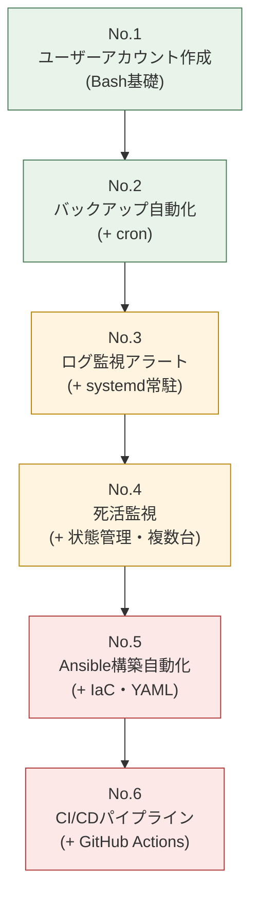

# 学習ロードマップ

本ポートフォリオの6案件に、どういう順序で・どのくらいの時間をかけて取り組むとよいかをまとめたドキュメントです。すでに一部の技術を知っている場合は、前提知識マップを見て途中の案件から始めても構いません。

## 1. なぜNo.1〜No.6の順番で取り組むべきか

結論として、**フォルダ番号順(No.1 → No.6)** に取り組むことを推奨します。理由は、後の案件ほど「前の案件で学んだ知識を前提とする」構成になっているためです。

段階ごとの狙いは次のとおりです。

| 段階 | 案件 | この段階で身につく力 |
|---|---|---|
| 1. Bashの基礎固め | No.1〜No.2 | シェルスクリプトの基本文法、Linuxコマンドの組み合わせ方、cron(=決まった時刻に処理を自動実行する仕組み)による定期実行 |
| 2. 状態管理・堅牢性 | No.3〜No.4 | 常駐プロセス(systemd)の管理、状態ファイルを使った「実行をまたいだ情報の引き継ぎ」、誤検知を防ぐ設計 |
| 3. 構成管理・自動化の一段上 | No.5〜No.6 | IaC(Infrastructure as Code)によるサーバー構築の自動化、CI/CD(継続的インテグレーション/継続的デプロイ)によるソフトウェア配布の自動化 |

No.1〜4は同じ「Bash + Linuxコマンド」という道具立てで、扱う概念(単発実行 → 定期実行 → 常駐監視 → 複数台・状態管理)が段階的に難しくなっていきます。No.5・No.6は道具立てそのものが変わる(Ansible、GitHub Actions)ため、No.1〜4で身につけたLinux操作の基礎知識が土台として必要です。

## 2. 案件ごとの前提知識マップ

「これを事前に知っていないと厳しい」という知識を、案件ごとに整理しました。★の数はその知識への依存度の目安です。

| 案件 | 前提知識 | 依存度 | 未経験の場合の補い方 |
|---|---|---|---|
| No.1 ユーザーアカウント自動化 | Linuxの基本操作(cd/ls/catなど)、権限(root/一般ユーザー)の概念 | ★★★ | [docs/04-environment-setup.md](04-environment-setup.md)のコマンド早見表を先に一読 |
| No.2 バックアップ自動化 | No.1のBash基礎、ファイルの圧縮・展開の概念 | ★★☆ | tar/gzipは案件内の`02-design.md`で解説あり。未経験でも着手可 |
| No.3 ログ監視アラート | No.2のcron理解、正規表現の基本 | ★★★ | 正規表現は`grep -E`の実例を見ながら覚えれば十分。事前学習は必須ではない |
| No.4 死活監視 | No.3までのBash力、HTTPステータスコードの基礎知識(200/404/500など) | ★★★ | HTTPステータスコードは案件内で簡単に解説。ネットワークの詳しい知識は不要 |
| No.5 Ansible構築自動化 | No.1〜4のLinuxコマンド全般、YAMLの読み書き、SSH接続の基本 | ★★★★ | YAMLは「インデントで階層を表すJSONのようなもの」という理解でスタート可能。案件内で1から解説 |
| No.6 CI/CDパイプライン | No.5までの一連の知識、Gitの基本操作(add/commit/push)、SSH鍵認証の概念 | ★★★★★ | Git自体の基礎(コミット・ブランチ)は前提として別途習得しておくのが望ましい |

**Gitの基本操作(add/commit/push/pull、ブランチ)は本ポートフォリオの前提知識であり、6案件のいずれでも詳しくは解説していません。** 特にNo.6はGitHubへのpushをトリガーにするため、Gitの基礎は先に押さえておくことを推奨します。

## 3. 学習時間の目安

初心者が「読んで理解し、実際に手を動かして動作確認まで行う」ことを想定した目安時間です。すでにLinuxやプログラミングの基礎知識がある場合はもっと短縮できます。

| 案件 | 目安時間 | 内訳の考え方 |
|---|---|---|
| No.1 ユーザーアカウント自動化 | 4〜6時間 | 要件・設計の読解 1h、環境構築 1h、スクリプト読解・動作確認 2〜3h、テスト仕様の実施 1h |
| No.2 バックアップ自動化 | 5〜7時間 | cronの理解に時間がかかりやすい。Slack Webhook連携の動作確認も含む |
| No.3 ログ監視アラート | 6〜9時間 | systemdのunitファイル(=常駐サービスの設定ファイル)作成・デバッグに時間がかかりやすい |
| No.4 死活監視 | 6〜9時間 | 複数台(3〜5台)を用意する準備、状態ファイル設計の理解に時間を要する |
| No.5 Ansible構築自動化 | 10〜15時間 | YAML・Role構成という新しい概念の習得、複数台環境(制御ノード+対象ノード)の準備を含む |
| No.6 CI/CDパイプライン | 10〜15時間 | GitHub Secrets・SSH鍵の準備、GitHub Actionsのデバッグ(失敗→修正の繰り返し)に時間がかかりやすい |
| **合計目安** | **約41〜61時間** | 1日2時間のペースなら約1ヶ月、週末中心なら約2ヶ月が目安 |

はじめてLinuxサーバーに触れる場合は、上限に近い時間(週末中心で2〜3ヶ月程度)を見ておくと現実的です。詰まった箇所は各案件の`05-troubleshooting.md`を読むと、時間短縮につながります。

## 4. このポートフォリオを終えた後に学ぶとよいこと

No.1〜No.6を一通り終えた後、次のステップとして学習を検討するとよい発展的なトピックを紹介します。いずれも、本ポートフォリオで扱った「自動化」「IaC」「CI/CD」の考え方の延長線上にあります。

### 4.1 クラウド・仮想化まわり

| トピック | 本ポートフォリオとのつながり | 学ぶ意義 |
|---|---|---|
| **Terraform** | No.5のAnsibleは「サーバーの中身の設定」を自動化するツール。Terraformは「サーバーそのものを作る」(クラウド上のインフラ構築)を自動化するIaCツールで、Ansibleとセットで使われることが多い | クラウド環境の構築を含めてコード化できるようになり、案件の幅が大きく広がる |
| **AWS / GCP / Azureなどのクラウド** | 本ポートフォリオは主にオンプレミス/単体サーバーを想定した構成。クラウドではネットワーク・権限管理(IAM)の概念が加わる | 現在の求人市場ではクラウド環境での構築・運用スキルが強く求められる |
| **Docker / Kubernetes** | No.6でアプリをサーバーに直接配置(rsyncで転送)する方式を扱ったが、コンテナ技術を使うと「環境ごと配布する」という別のアプローチが可能になる | モダンな開発現場のデプロイ手法の主流であり、CI/CDと合わせて学ぶ価値が高い |

### 4.2 資格

未経験からの就職・転職では、資格が知識の裏付けとして評価されることがあります。

| 資格 | 位置づけ |
|---|---|
| LinuC(Linux技術者認定) レベル1 / LPIC-1 | 本ポートフォリオNo.1〜4で扱ったLinux操作の体系的な知識を証明できる |
| AWS認定 クラウドプラクティショナー | クラウドの基礎知識を証明する入門資格。次のステップとして「ソリューションアーキテクト – アソシエイト」も視野に |
| Ansible/Terraformの実務経験を示す資格・認定 | 資格自体は必須ではないが、学習の指標として活用できる |

### 4.3 発展的な運用トピック

- **監視・可観測性(モニタリング)の高度化**: 本ポートフォリオのNo.3・No.4は自作のシンプルな監視だが、実務ではPrometheus/Grafana、Zabbixなどの監視基盤ツールが使われることが多い
- **ログ集約基盤**: No.3では単一サーバーのログを監視したが、複数サーバーのログを一元管理する仕組み(例: Fluentd、ELK Stackなど)を学ぶと、より実務に近づく
- **セキュリティの基礎**: No.5・No.6で扱ったSSH鍵認証やSecrets管理をさらに発展させ、脆弱性診断や最小権限の原則(必要な権限だけを与える考え方)などを学ぶと運用者としての信頼性が高まる

これらはすべて「本ポートフォリオで身につけた自動化の基礎」があってこそ、効率よく学習を進められる分野です。焦って手を広げるより、まずはNo.1〜No.6を確実に自分の手で動かしきることを優先してください。
