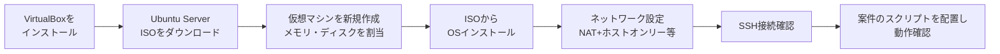
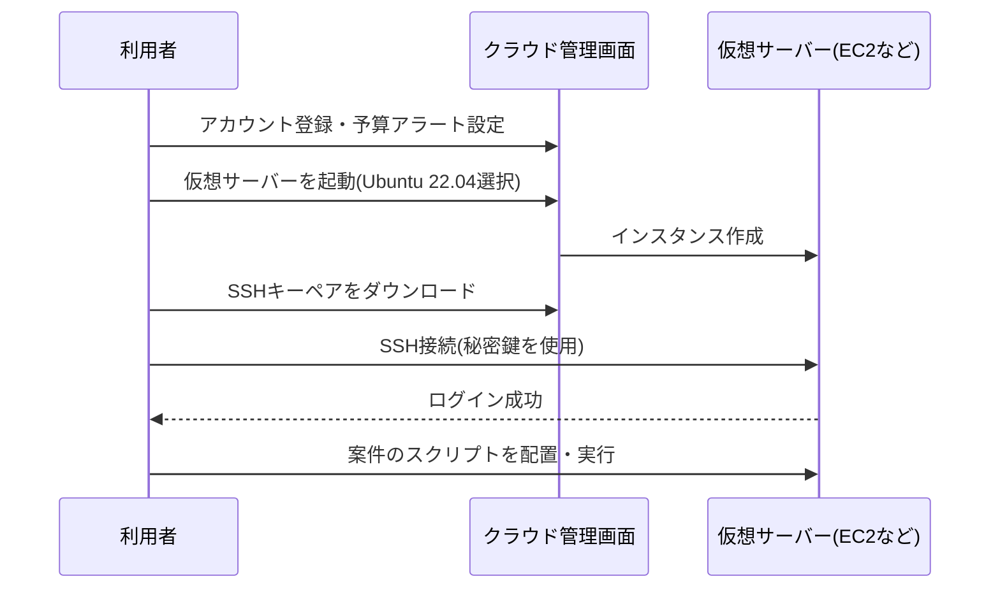

# 検証環境構築ガイド

本ポートフォリオの各案件を「読むだけ」で終わらせず、実際に自分の手で動かして確認するための環境構築ガイドです。予算・パソコンのスペック・学びたい内容に応じて、複数の選択肢から選べるようにしています。

## 1. どの方法を選ぶか

| 方法 | 費用の目安 | 向いている人 | 対応できる案件 |
|---|---|---|---|
| A. VirtualBox + Linux(ローカル仮想マシン) | 無料(電気代のみ) | 自分のPCでじっくり試したい人、ネットワーク設定も含めて学びたい人 | No.1〜No.5(複数台構成もローカルで再現可) |
| B. クラウドの無料枠(AWS / Oracle Cloud等) | 無料枠内なら無料 | 実務に近い環境で試したい人、将来的にクラウドも学びたい人 | No.1〜No.6すべて |
| C. WSL2(Windows Subsystem for Linux) | 無料 | Windows PCで手軽にLinuxコマンドだけ試したい人 | No.1〜No.3の一部(仮想マシンとしての制約に注意。詳細は3.3節) |

**推奨**: 最初はA(VirtualBox)でNo.1〜No.4を試し、No.5・No.6でB(クラウド無料枠)に切り替える、という組み合わせが挫折しにくくおすすめです。理由は、No.5・No.6は複数サーバー間の通信(SSHやGitHubとの連携)を扱うため、クラウド環境の方がむしろ構成をシンプルにしやすいためです。

---

## 2. 方法A: VirtualBox + Linuxディストリビューション

### 2.1 概要

自分のPC(Windows / macOS)の中に、無料の仮想化ソフト「VirtualBox」を使ってLinuxサーバーを仮想的に作る方法です。何度壊しても、削除してやり直せる(スナップショット機能で作業前の状態に戻せる)のが最大のメリットです。

### 2.2 必要なもの

| 項目 | 内容 |
|---|---|
| VirtualBox | 無料の仮想化ソフト。公式サイトからダウンロード |
| ISOイメージ | Ubuntu Server 22.04 LTS(本ポートフォリオの多くの案件で検証環境として使用)。公式サイトから無料ダウンロード |
| PCスペックの目安 | メモリ8GB以上推奨(仮想マシンに2GB×2〜3台割り当てる想定)、空きディスク30GB以上 |

### 2.3 構築手順の流れ



1. VirtualBoxをインストールする
2. Ubuntu Server 22.04 LTSのISOイメージをダウンロードする
3. VirtualBoxで新規仮想マシンを作成する(メモリ2GB以上、ディスク20GB以上を目安に割り当て)
4. ISOイメージから起動し、画面の指示に従ってOSをインストールする(インストール中に作成するユーザー名・パスワードは忘れずに控えておく)
5. ネットワーク設定を行う。VirtualBoxの「ネットワーク」設定で、アダプター1を「NAT」、アダプター2を「ホストオンリーアダプター」にすると、インターネット接続とホストPCからのSSH接続の両方が可能になる
6. インストール後、ホストPCのターミナルからSSH接続できることを確認する

```bash
# ホストPCのターミナルから実行(IPアドレスは仮想マシン側で ip a コマンドを実行して確認)
$ ssh <作成したユーザー名>@192.168.56.10
```

```text
# 実行結果イメージ
The authenticity of host '192.168.56.10' can't be established.
...
<ユーザー名>@192.168.56.10's password:
Welcome to Ubuntu 22.04.x LTS (GNU/Linux 5.15.0-generic x86_64)
```

7. 接続できたら、各案件の`03-build-guide.md`(構築手順書)に従ってスクリプトを配置し、動作確認を進める

**No.4(死活監視)やNo.5(Ansible)のように複数台構成が必要な案件は、同じ手順で仮想マシンをもう1〜2台作成すれば、ローカルPC内だけで複数台環境を再現できます。**

### 2.4 スナップショット機能の活用

VirtualBoxの「スナップショット」機能を使うと、作業前の状態を保存しておき、失敗してもすぐ元に戻せます。特にNo.5(Ansible)のようにサーバー設定を何度も変更する案件では、以下のタイミングでスナップショットを取っておくことを推奨します。

- OSインストール直後(まっさらな状態)
- 各案件に着手する直前

---

## 3. 方法B: クラウドの無料枠を使う

### 3.1 選択肢の比較

| サービス | 無料枠の目安 | 特徴 |
|---|---|---|
| AWS(Amazon Web Services) | 12ヶ月間、EC2の t2.micro/t3.micro を月750時間まで無料(新規アカウント向けの条件は変更されることがあるため公式サイトで要確認) | 実務での利用実績が非常に多く、学んだ内容がそのまま実務知識になりやすい |
| Oracle Cloud Infrastructure | 一部のシェイプ(Arm系など)が期間無期限の無料枠として提供 | 無料枠が手厚く、長期間の学習用途に向く |
| Google Cloud Platform | 新規登録時のクレジット付与+一部サービスの無料枠 | クレジット期限があるため、短期集中での学習に向く |

いずれも「無料枠の内容は時期によって変わる」ため、利用開始前に必ず各社の公式サイトで最新の条件を確認してください。また、無料枠を超えると課金される可能性があるため、**予算アラート(利用額が一定を超えたら通知する設定)を必ず有効にしておく**ことを強く推奨します。

### 3.2 構築手順の流れ(AWSの例)



1. クラウドサービスのアカウントを登録し、**真っ先に予算アラートを設定する**
2. 仮想サーバー(AWSなら「EC2インスタンス」)を起動する。OSはUbuntu Server 22.04を選択
3. インスタンス作成時にSSHキーペアを発行し、秘密鍵ファイル(`.pem`など)をダウンロードする
4. 秘密鍵のアクセス権限を絞り込む(第三者に読み取られないようにするため)

```bash
$ chmod 600 my-key.pem
```

5. SSH接続する

```bash
$ ssh -i my-key.pem ubuntu@<インスタンスのパブリックIPアドレス>
```

```text
# 実行結果イメージ
Welcome to Ubuntu 22.04.x LTS (GNU/Linux 5.15.0-1019-aws x86_64)
ubuntu@ip-172-31-xx-xx:~$
```

6. 接続できたら、各案件の`03-build-guide.md`に従って進める

**No.6(CI/CDパイプライン)は、GitHub Actionsから直接SSH接続してデプロイする構成のため、クラウド上の仮想サーバー(グローバルIPを持つサーバー)を使うと、ローカル環境よりも構成をシンプルに再現できます。**

### 3.3 WSL2について(補足)

Windows PCの場合、WSL2(Windows Subsystem for Linux)を使えば、仮想マシンを別途作らずにUbuntu環境をすぐ使えます。No.1〜No.3のようにBashスクリプトの動作確認が中心の案件であれば、WSL2でも十分に試せます。

ただし、WSL2は「サーバーを再起動する」「複数台のサーバー間で通信する」といった検証にはあまり向かないため、No.4(複数台監視)以降は方法AまたはBを推奨します。

---

## 4. 共通で使うLinux基礎コマンド早見表

各案件を進める上で頻出する基礎コマンドをまとめました。意味が分からなくなったら、このページに戻って確認してください。

### 4.1 ファイル・ディレクトリ操作

| コマンド | 意味 | 実行例 |
|---|---|---|
| `pwd` | 今いる場所(ディレクトリ)を表示する | `pwd` → `/home/ubuntu` |
| `ls` | ディレクトリの中身を一覧表示する | `ls -l` (詳細情報付き一覧) |
| `cd` | ディレクトリを移動する | `cd /var/log` |
| `mkdir -p` | ディレクトリを作成する(`-p`は親ディレクトリごと作成) | `mkdir -p /opt/scripts` |
| `cp` | ファイル・ディレクトリをコピーする | `cp backup.sh backup.sh.bak` |
| `mv` | ファイルを移動・リネームする | `mv old.txt new.txt` |
| `rm` | ファイルを削除する(`-r`でディレクトリごと) | `rm -f temp.log` |
| `cat` | ファイルの中身を表示する | `cat /etc/os-release` |
| `less` | ファイルの中身をスクロールしながら表示する | `less /var/log/syslog` |

### 4.2 権限・所有者

| コマンド | 意味 | 実行例 |
|---|---|---|
| `chmod` | ファイルの権限(誰が読み書き実行できるか)を変更する | `chmod +x create_users.sh`(実行権限を付与) |
| `chown` | ファイルの所有者を変更する | `chown ubuntu:ubuntu backup.sh` |
| `sudo` | 一時的に管理者(root)権限でコマンドを実行する | `sudo apt update` |
| `whoami` | 現在ログイン中のユーザー名を確認する | `whoami` → `ubuntu` |

### 4.3 プロセス・サービス管理

| コマンド | 意味 | 実行例 |
|---|---|---|
| `ps aux` | 現在動いているプロセス(プログラム)の一覧を表示する | `ps aux \| grep bash` |
| `systemctl status` | systemdサービスの状態を確認する | `systemctl status log-watch-alert` |
| `systemctl start / stop / restart` | サービスを起動/停止/再起動する | `sudo systemctl restart nginx` |
| `journalctl -u` | 指定したサービスのログを確認する | `journalctl -u log-watch-alert -f` |

### 4.4 ネットワーク確認

| コマンド | 意味 | 実行例 |
|---|---|---|
| `ip a` | ネットワークインターフェースとIPアドレスを確認する | `ip a` |
| `ping` | 相手先への疎通(通信できるか)を確認する | `ping -c 4 192.168.56.10` |
| `curl -I` | Webサーバーへ通信し、応答ヘッダー(ステータスコード含む)を確認する | `curl -I http://localhost` |
| `ss -tulnp` | 現在使用中のポート番号一覧を確認する | `sudo ss -tulnp` |

### 4.5 パッケージ管理(Ubuntu/Debian系)

| コマンド | 意味 | 実行例 |
|---|---|---|
| `apt update` | パッケージの一覧情報を最新化する | `sudo apt update` |
| `apt install` | パッケージをインストールする | `sudo apt install -y jq` |
| `apt list --installed` | インストール済みパッケージを確認する | `apt list --installed \| grep nginx` |

これらのコマンドの多くは、`man <コマンド名>`(例: `man tar`)または`<コマンド名> --help`で詳細なオプション一覧を確認できます。分からないオプションに出会ったら、まずこの2つを試す習慣をつけると学習が効率化します。

---

## 5. 困ったときは

環境構築中に発生しやすいエラーへの対処は、各案件の`05-troubleshooting.md`にも一部記載があります。特に以下は環境構築そのものに関わるため、先に目を通しておくと安心です。

- 案件No.1: [01-user-account-automation/05-troubleshooting.md](../projects/01-user-account-automation/05-troubleshooting.md)(root権限まわりのエラー)
- 案件No.4: [04-server-health-check/05-troubleshooting.md](../projects/04-server-health-check/05-troubleshooting.md)(複数台構成でのSSH・ネットワーク関連の問題)
- 案件No.5: [05-ansible-provisioning/05-troubleshooting.md](../projects/05-ansible-provisioning/05-troubleshooting.md)(SSH接続・Ansible実行時のエラー)
- 案件No.6: [06-cicd-pipeline/05-troubleshooting.md](../projects/06-cicd-pipeline/05-troubleshooting.md)(GitHub Secrets・SSH鍵配布まわりのエラー)

それでも解決しない場合は、エラーメッセージをそのまま検索する、公式ドキュメントを確認するなど、実務でも通用する「自力で調べて解決する力」を意識して取り組んでみてください。
