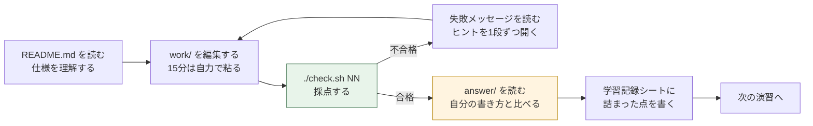
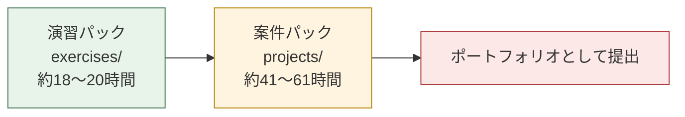

# 自動化スクリプト演習パック

**手を動かして覚える、サーバー自動化スクリプトの21演習。自動採点つき。**

[案件パック(projects/)](../README.md) の6案件を「読んで分かる」から「自分で書ける」に変えるための演習集です。1演習30〜90分、`./check.sh` を叩けば合否とヒントが即座に返ります。

- **root権限は不要**です。採点は使い捨ての一時ディレクトリの中だけで行われ、あなたのPCは書き換えられません
- **サーバーもインターネット接続も不要**です。`useradd` や `ping` や `curl` はダミーに差し替えて動かします
- **答え合わせに人は要りません**。不合格のときは「期待・実際・ヒント」の3点セットが表示されます

---

## 1. 5分で始める

必要なのは Linux(WSL2 / 仮想マシン / macOSのターミナルでも可)と bash だけです。

```bash
# 1. このリポジトリを取得して演習ディレクトリへ移動する
git clone https://github.com/ns7jp/automation.git
cd automation/exercises

# 2. どんな演習があるか見る
./check.sh --list

# 3. 最初の演習の課題文を読む
cat ex01-server-info/README.md

# 4. 雛形を編集する(エディタは何でもよい)
nano ex01-server-info/work/server_info.sh

# 5. 採点する
./check.sh 01
```

不合格ならこう出ます。**期待と実際の差、そして次の一手**がそのまま書かれています。

```text
  ✗ [2] 引数なしで実行すると終了ステータス1で終わる
      期待: 終了ステータス 1
      実際: 終了ステータス 0
      ヒント: 引数の個数は $# で調べます。1個でなければ exit 1 で終了してください。
```

合格すればこうなります。

```text
  ✓ [2] 引数なしで実行すると終了ステータス1で終わる
  ...
  結果: 15/15 合格
```

初めての方は [docs/02-getting-started.md](docs/02-getting-started.md) に、環境準備から最初の1問を解ききるまでの手順を用意しています。

---

## 2. 演習一覧

全21演習・6ステージ。上から順に取り組むことを想定しています。

<!-- BEGIN:EXERCISE-INDEX -->

### ステージ1: Bashの基礎体力

| No. | 演習 | 難易度 | 目安 | 身につく力 |
|---|---|---|---|---|
| ex01 | [サーバー情報表示スクリプト](ex01-server-info/README.md) | ★☆☆☆☆ | 30分 | 変数 / コマンド置換 / 引数チェック / 終了ステータス |
| ex02 | [入力チェックと安全装置](ex02-input-validation/README.md) | ★☆☆☆☆ | 40分 | 条件分岐 / ファイル判定 / 権限チェック |
| ex03 | [CSVを1行ずつ処理する](ex03-csv-loop/README.md) | ★★☆☆☆ | 50分 | while read / IFS / パラメータ展開 / プロセス置換 |

<!-- END:EXERCISE-INDEX -->

演習と案件・スキルの詳しい対応は [docs/03-curriculum-map.md](docs/03-curriculum-map.md) を参照してください。

---

## 3. 採点ツールの使い方

```bash
./check.sh              # 自分の解答(work/)を全演習まとめて採点する
./check.sh 03           # ex03 だけを採点する(03 / 3 / ex03 どの書き方でも可)
./check.sh 03 05 07     # 複数の演習をまとめて採点する
./check.sh --stage 2    # ステージ2の演習だけを採点する
./check.sh --answer 03  # ex03 の解答例を採点する(答え合わせ・動作確認用)
./check.sh --list       # 演習の一覧を表示する
./check.sh --help       # ヘルプを表示する
```

補助ツールもあります。

```bash
./tools/lint.sh         # パック内のシェルスクリプトの構文チェックと静的解析
./tools/make-index.sh   # 上の演習一覧を meta.env から自動生成し直す
```

採点の仕組み(一時ディレクトリ、ダミーコマンド、判定関数)は [docs/04-self-check-guide.md](docs/04-self-check-guide.md) で解説しています。**採点ツール自体もBashで書かれているので、教材として読むこともできます。**

---

## 4. 進め方

### 4.1 1つの演習の流れ



### 4.2 詰まったときの順番

1. `./check.sh NN` の**失敗メッセージを最後まで読む**(期待と実際の差が答えに直結します)
2. 演習の README の「5. ヒント」を**1段だけ**開く
3. 演習の README の「6. よくあるつまずき」を見る
4. [docs/06-hints-and-pitfalls.md](docs/06-hints-and-pitfalls.md)(全演習共通のつまずき集)を見る
5. [docs/07-bash-syntax-cheatsheet.md](docs/07-bash-syntax-cheatsheet.md) で文法を確認する
6. それでも進まなければ `answer/` の解答例を読む。**読んで理解し、写経してから、もう一度自分の言葉で書き直す**

**6番まで行くことは悪いことではありません。** 解答例を読んで理解し、閉じてから自力で書き直せたなら、それは習得です。

### 4.3 大事にしてほしいこと

- **合格が目的ではありません。** 「なぜこの書き方なのか」を説明できることが目的です
- 合格したら必ず `answer/` を読んでください。同じ仕様でも、実務でよく使われる書き方があります
- 詰まった点は [docs/05-progress-sheet.md](docs/05-progress-sheet.md) の学習記録シートに書き残してください。**面接で話せる具体的なエピソードになります**

---

## 5. ディレクトリ構成

```text
exercises/
├── README.md                    # 本ファイル(演習パックの入口)
├── check.sh                     # 自動採点ツール
├── docs/                        # 演習パック全体のドキュメント
│   ├── 01-design.md             # 演習パック設計書(なぜこの構成なのか)
│   ├── 02-getting-started.md    # はじめかた
│   ├── 03-curriculum-map.md     # カリキュラムマップ
│   ├── 04-self-check-guide.md   # 自動採点の仕組み
│   ├── 05-progress-sheet.md     # 学習記録シート
│   ├── 06-hints-and-pitfalls.md # つまずき集
│   └── 07-bash-syntax-cheatsheet.md  # Bash文法早見表
├── lib/                         # 採点の共通部品
│   ├── assert.sh                # 判定関数
│   ├── harness.sh               # 一時ディレクトリ・スタブ・実行
│   └── stubs/_recorder.sh       # ダミーコマンドの本体
├── tools/
│   ├── lint.sh                  # 構文チェック・静的解析
│   └── make-index.sh            # 演習一覧の自動生成
└── exNN-<名前>/                  # 演習(21件。すべて同じ構成)
    ├── meta.env                 # 演習のメタ情報
    ├── README.md                # 課題文
    ├── work/                    # あなたが編集するファイル
    ├── answer/                  # 解答例
    └── tests/test.sh            # 採点テスト
```

---

## 6. 案件パックとの関係

演習パックは、案件パックの**手前**に置く練習場です。



| 演習のステージ | 対応する案件 |
|---|---|
| ステージ1 (ex01-ex06) | [案件No.1 ユーザーアカウント一括作成](../projects/01-user-account-automation/README.md) |
| ステージ2 (ex07-ex10) | [案件No.2 バックアップ自動化](../projects/02-backup-automation/README.md) |
| ステージ3 (ex11-ex14) | [案件No.3 ログ監視アラート](../projects/03-log-monitoring-alert/README.md) |
| ステージ4 (ex15-ex17) | [案件No.4 死活監視](../projects/04-server-health-check/README.md) |
| ステージ5 (ex18-ex19) | [案件No.5 Ansible構築自動化](../projects/05-ansible-provisioning/README.md) |
| ステージ6 (ex20-ex21) | [案件No.6 CI/CDパイプライン](../projects/06-cicd-pipeline/README.md) |

**ステージを1つ終えたら、対応する案件のREADMEと設計書を読む**という進め方が最も効率的です。演習で書いた部品が、案件のスクリプトの中でどう組み合わさっているかが見えます。

---

## 7. 修了チェック

全21演習に合格したら、次を確認してください。ここまでできていれば、案件パックの内容は「読めば分かる」状態になっています。

```bash
./check.sh          # すべて合格することを確認する
```

- [ ] 全21演習が `./check.sh` で合格した
- [ ] ex06(ユーザー一括作成ミニ版)を、解答例を見ずに書ける
- [ ] 「なぜドライランを用意するのか」を自分の言葉で説明できる
- [ ] 「なぜ終了ステータスを正しく返す必要があるのか」を説明できる
- [ ] 「べき等性とは何か」を具体例つきで説明できる
- [ ] 「1回の失敗で即通知」がなぜ良くないかを説明できる
- [ ] 学習記録シートに、詰まった点と解決方法が書き残されている

チェックがついたら、[案件パック](../README.md)の案件No.1から順に進んでください。

---

## 8. ドキュメント一覧

| ドキュメント | 内容 |
|---|---|
| [docs/01-design.md](docs/01-design.md) | 演習パック設計書(学習設計・難易度設計・採点システムの設計) |
| [docs/02-getting-started.md](docs/02-getting-started.md) | はじめかた(環境準備から最初の1問まで) |
| [docs/03-curriculum-map.md](docs/03-curriculum-map.md) | カリキュラムマップ(演習・案件・スキルの対応) |
| [docs/04-self-check-guide.md](docs/04-self-check-guide.md) | 自動採点の仕組みと、自分で演習を追加する方法 |
| [docs/05-progress-sheet.md](docs/05-progress-sheet.md) | 学習記録シート(振り返り・面接ネタの蓄積) |
| [docs/06-hints-and-pitfalls.md](docs/06-hints-and-pitfalls.md) | 全演習共通のつまずき集 |
| [docs/07-bash-syntax-cheatsheet.md](docs/07-bash-syntax-cheatsheet.md) | Bash文法早見表 |
| [../docs/04-environment-setup.md](../docs/04-environment-setup.md) | 検証環境構築ガイド(仮想マシン・クラウド無料枠) |
| [../docs/03-glossary.md](../docs/03-glossary.md) | 初心者向け用語集 |
