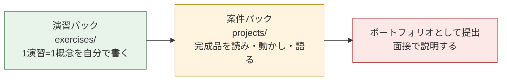
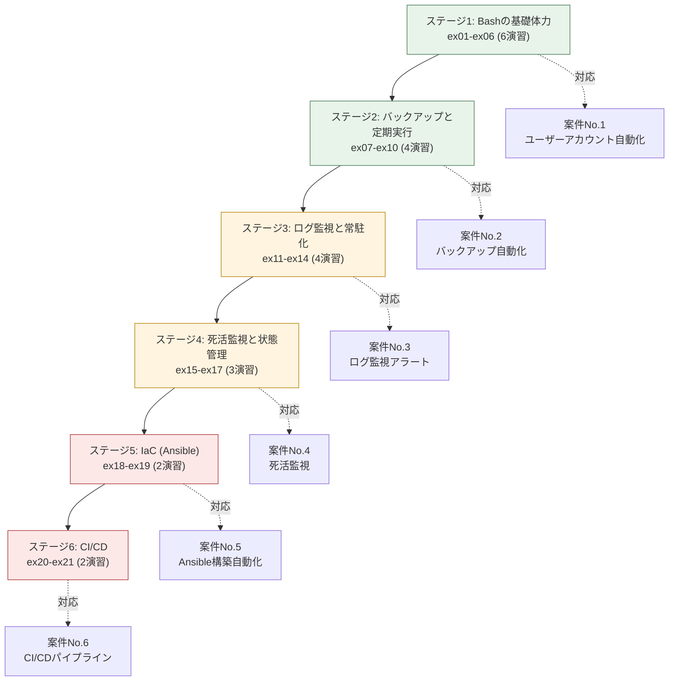
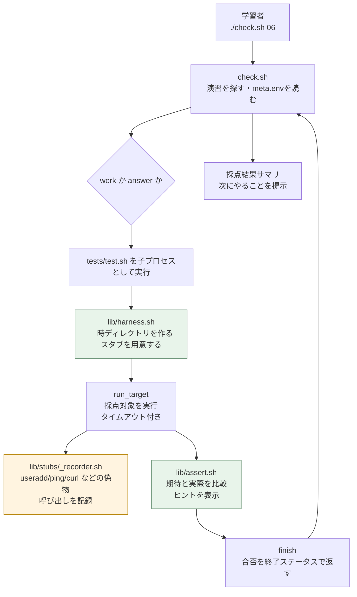

# 演習パック設計書

本ドキュメントは、`exercises/` に収録した **自動化スクリプト演習パック** の設計を記したものです。「なぜこの構成なのか」「どういう基準で難易度を並べたのか」「どうやって初心者が挫折せずに習得できるようにしたのか」を、後から自分でも読み返せる形で残しています。

面接や職務経歴書で「学習教材そのものを設計した」と語る場合の根拠資料にもなります。

---

## 1. 背景と目的

### 1.1 案件パックだけでは足りなかったもの

本リポジトリにはすでに、[案件パック(projects/)](../../README.md) として6件の完成済みプロジェクトが収録されています。要件定義から設計・構築手順・テスト・トラブルシューティングまでを揃えた「完成品」です。

しかし、未経験者が完成品を読んだときに起きることは、たいていこうです。

| 起きること | なぜ問題か |
|---|---|
| 読めば「分かった気」になる | 自分で書くと手が止まる。読解力と記述力は別の能力 |
| コピペで動いてしまう | 動いた理由が分からないため、少し要件が変わると対応できない |
| 300行のスクリプトが最初の課題になる | 学ぶ要素が多すぎて、どこでつまずいたのか自分で切り分けられない |
| 動作確認にサーバーが要る | 環境構築で力尽きて、本題に入る前に離脱する |

### 1.2 このパックが解決すること

演習パックは、案件パックの**手前**に置く「自分の手で書く練習場」です。次の4点を満たすことを設計目標にしました。

1. **1演習=1概念**: 30〜90分で終わる単位に分解し、つまずいた原因が特定できるようにする
2. **即時フィードバック**: `./check.sh` で合否とヒントが即座に返る。答え合わせに人を必要としない
3. **環境ゼロで始められる**: root権限も、サーバーも、インターネット接続も不要。Linuxとbashがあれば動く
4. **案件へ地続き**: すべての演習が案件パックのどの処理に対応するかを明示し、演習の完了が案件の理解に直結する



---

## 2. 対象読者と到達目標

### 2.1 対象読者

| 項目 | 想定 |
|---|---|
| 経験 | Linuxの基本コマンド(cd / ls / cat / vi)を触ったことがある程度 |
| プログラミング | 未経験、または他言語を少し。シェルスクリプトは書いたことがない |
| 環境 | Windows + WSL2、macOSのターミナル、または仮想マシンのUbuntuのいずれか1つ |
| 目的 | サーバー構築・運用エンジニアへの就職・転職 |

**前提としないもの**: root権限、複数台のサーバー、クラウドアカウント、Ansible/GitHub Actionsの知識、Git以外の開発ツール。

### 2.2 修了時の到達目標

全21演習を終えたとき、次のことが「調べながらであれば自力でできる」状態を目指します。

| 分類 | 到達目標 |
|---|---|
| 読む | 300行程度の運用スクリプトを読み、どこで何をしているか説明できる |
| 書く | 「CSVを読んで処理し、結果をログに残し、失敗したら通知する」程度のスクリプトを自力で書ける |
| 守る | ドライラン・権限チェック・終了ステータス・べき等性といった安全装置を、理由を説明しながら設計に入れられる |
| 回す | cronとsystemdで定期実行・常駐化でき、状態ファイルで実行をまたいだ制御ができる |
| 広げる | Ansibleのべき等な書き方と、GitHub ActionsのCI/CDワークフローを読み書きできる |
| 語れる | 「なぜその実装にしたのか」を、事故の防止という観点から説明できる |

---

## 3. 学習設計の原則

演習の作り方には、次の5つの原則を一貫して適用しています。

### 3.1 スモールステップ

1つの演習で新しく学ぶ概念は**原則1〜2個まで**にしています。ex01は「変数・引数・終了ステータス」だけを扱い、ファイル判定は次のex02に回します。

これは、初心者が挫折する最大の原因が「1回に学ぶことが多すぎて、どれが原因で動かないのか切り分けられない」ことにあるためです。逆に言えば、**つまずいたときに原因の候補が2つしかない状態**を維持することが、独学を続けられる条件になります。

### 3.2 即時フィードバック

`./check.sh <番号>` を実行すると、判定は数秒で返ります。しかも「不合格」だけでなく、次の3点が必ず出ます。

```text
  ✗ [2] 引数なしで実行すると終了ステータス1で終わる
      期待: 終了ステータス 1
      実際: 終了ステータス 0
      ヒント: 引数の個数は $# で調べます。1個でなければ exit 1 で終了してください。
```

**期待・実際・ヒント**の3点セットは、独学者が持てない「隣に座って教えてくれる人」の代わりです。テストの説明文を仕様の言葉(「〜する」)で書いているのも、失敗メッセージがそのまま課題の再提示になるようにするためです。

### 3.3 安全な失敗

学習中に一番避けたいのは、**練習で自分のPCを壊すこと**です。演習では次の2段構えで安全を確保しています。

1. 採点はすべて使い捨ての一時ディレクトリの中だけで行う
2. `useradd` `ping` `curl` `systemctl` など、危険または環境が必要なコマンドはダミー(スタブ)に差し替える

結果として、**ユーザー作成スクリプトの練習を、root権限なしで、本物のユーザーを1人も作らずに**できます。詳細は [04-self-check-guide.md](04-self-check-guide.md) を参照してください。

### 3.4 転移(演習 → 案件 → 実務)

演習が「演習のための演習」で終わらないよう、すべての演習に次の2つを必ず入れています。

- **「1. どんな場面で必要になるか」**: 架空の中小企業の運用現場での具体的な場面から始める
- **「8. この演習と案件のつながり」**: 対応する案件のどのファイル・どの処理に相当するかを明示する

学んだことが「どこで使えるのか」まで一緒に記憶されないと、実務や面接の場で引き出せません。

### 3.5 答えを見る前に3段階のヒント

各演習には、折りたたみ形式のヒントを3段階で用意しています。

| 段階 | 内容 | 意図 |
|---|---|---|
| ヒント1 | 考え方の方向づけ(「引数の個数は何で調べられるか」) | 自力で気づくきっかけを与える |
| ヒント2 | 使う文法の具体例(`$#` と `-ne` の使い方) | 文法を知らないだけの停滞を解消する |
| ヒント3 | 全体の骨組み(穴あきのコード) | 構造は与え、判断は残す |

解答例(`answer/`)は最初から全員に公開しています。隠しても意味がない上に、**詰まったときに読める正解があること自体が、独学の継続率を上げる**ためです。ただし `check.sh` の失敗メッセージでは「読んで理解し、写経してから自力で書き直す」という使い方を案内しています。

---

## 4. カリキュラム設計

### 4.1 全体構造

6ステージ・21演習で構成し、案件パックの6案件に1対1で対応させています。



### 4.2 ステージごとの設計意図

| ステージ | 演習数 | この段階の狙い | 卒業条件(自己判定) |
|---|---|---|---|
| 1. Bashの基礎体力 | 6 | シェルスクリプトの「部品」を1つずつ手で書けるようにする。最後のex06で部品を組み立てて案件No.1のミニ版を完成させる | ex06を、解答例を見ずに書ける |
| 2. バックアップと定期実行 | 4 | 「作る・消す・知らせる・定時に動かす」という運用の1サイクルを体験する | 世代管理の必要性とdry-runの価値を自分の言葉で説明できる |
| 3. ログ監視と常駐化 | 4 | 実行と実行のあいだに情報を引き継ぐ「状態」の概念を導入する。常駐サービス化まで進む | 状態ファイルが必要な理由を説明できる |
| 4. 死活監視と状態管理 | 3 | 対象が複数になったときの設計と、誤検知(フラッピング)対策を学ぶ | 「1回の失敗で即通知」がなぜ駄目かを説明できる |
| 5. IaC (Ansible) | 2 | 「手順」から「あるべき状態の宣言」へ思考を切り替える | べき等性を具体例で説明できる |
| 6. CI/CD | 2 | 人が実行していた検証とデプロイを、pushをきっかけに自動化する | Secretsを使う理由を説明できる |

### 4.3 難易度カーブの設計

難易度は★1〜★5の5段階で、案件パックの表記と揃えています。カーブは**前半をなだらかに、後半で立ち上げる**形にしました。

| 演習 | 難易度 | 新しく学ぶ主概念 | 前演習からの積み上げ |
|---|---|---|---|
| ex01 | ★☆☆☆☆ | 変数・引数・終了ステータス | — |
| ex02 | ★☆☆☆☆ | ファイル判定・終了コードの使い分け | ex01の引数チェック |
| ex03 | ★★☆☆☆ | ループ・CSV読み込み・サブシェル問題 | ex02の入力検証 |
| ex04 | ★★☆☆☆ | 関数・ログ出力・tee | ex03の繰り返し処理 |
| ex05 | ★★☆☆☆ | getopts・ドライラン | ex01の引数処理を本格化 |
| ex06 | ★★☆☆☆ | 総合(ex01〜05の組み立て) | ステージ1すべて |
| ex07〜ex10 | ★★☆☆☆〜★★★☆☆ | tar・世代管理・Webhook通知・cron | ステージ1の全部品 |
| ex11〜ex14 | ★★☆☆☆〜★★★☆☆ | 正規表現・状態ファイル・差分処理・systemd | ex04のログ、ex09の通知 |
| ex15〜ex17 | ★★★☆☆ | 複数対象・状態遷移・awk集計 | ex12の状態管理 |
| ex18〜ex19 | ★★★★☆ | YAML・Playbook・べき等性 | ex06のべき等性の考え方 |
| ex20〜ex21 | ★★★★☆ | GitHub Actions・CI用テスト | 全ステージ |

**ex06は意図的に★★☆☆☆に据え置いています。** 個々の要素はすべて学習済みで、新しい概念は「組み立てること」だけだからです。難易度表示は「未知の概念の量」を表すものとし、作業量とは切り離しています。

### 4.4 学習時間の目安

| ステージ | 演習数 | 目安時間 |
|---|---|---|
| 1. Bashの基礎体力 | 6 | 約5時間 |
| 2. バックアップと定期実行 | 4 | 約3時間 |
| 3. ログ監視と常駐化 | 4 | 約3.5時間 |
| 4. 死活監視と状態管理 | 3 | 約3時間 |
| 5. IaC (Ansible) | 2 | 約2時間 |
| 6. CI/CD | 2 | 約2時間 |
| **合計** | **21** | **約18〜20時間** |

1日1時間なら約3週間、週末中心なら約1.5ヶ月が目安です。これは案件パック(約41〜61時間)の**前**に置く投資であり、演習を先に済ませることで案件パックの理解速度が上がるため、総学習時間はむしろ短くなることを狙っています。

---

## 5. 演習1件の構造(フォーマット標準)

全21演習は完全に同じ構造で作られています。1件の読み方を覚えれば、残り20件も同じ要領で進められます。

```text
exNN-<英語スラグ>/
├── meta.env      # 演習のメタ情報。check.sh が読み込む
├── README.md     # 課題文。8つの節で固定
├── work/         # 学習者が編集するファイル(TODO入りの雛形)
├── answer/       # 解答例(コメント多め)
└── tests/
    └── test.sh   # 自動採点テスト
```

### 5.1 README.md の8節構成

| 節 | 内容 | 設計意図 |
|---|---|---|
| 冒頭のメタ表 | ステージ / 難易度 / 目安時間 / 身につく力 / 対応する案件 / 作業するファイル | 着手前に「自分に今できるか」を判断できる |
| 1. どんな場面で必要になるか | 運用現場での具体的な場面 | 学ぶ動機を先に作る |
| 2. この演習で学ぶこと | 学習項目の表 + 「3分でわかる予備知識」 | 新出文法をここで完結させ、外部検索を必須にしない |
| 3. 課題 | 仕様表 + 出力フォーマット | テストと1対1対応。曖昧さを残さない |
| 4. やり方 | 移動・編集・実行・採点の4コマンド | 環境が違っても迷わない |
| 5. ヒント | 3段階の折りたたみ | 詰まりの深さに応じて必要な分だけ開く |
| 6. よくあるつまずき | 症状と対処の表 | 実際に出るエラーメッセージから逆引きできる |
| 7. 発展課題 | 採点対象外の追加課題 | 早く終わった人の手が止まらない |
| 8. この演習と案件のつながり | 対応箇所の明示 + 次の演習への導線 | 学習の連続性を切らさない |

### 5.2 work/(雛形)の設計方針

- **構文エラーは無いが、テストは落ちる**状態から始める。実行はできるので「動くけれど不正解」という状態を体験できる
- `TODO 1:` `TODO 2:` と番号を振り、**何をするか + 使う文法の名前**を日本語で書く。答えのコードは書かない
- 関数の枠やコメントの骨組みは与える。**白紙から書く負荷は、この段階では学習効果より挫折率を高める**ため

### 5.3 answer/(解答例)の設計方針

- 仕様を100%満たし、テストが全項目合格する
- **コメントは「何をしているか」ではなく「なぜそう書くか」を書く**。案件パックのスクリプトと同じ密度
- 冒頭に「これは1つの正解であって、唯一の正解ではない」と明記する

### 5.4 tests/test.sh(採点)の設計方針

- 1演習あたり**8〜18項目**。正常系だけでなく、異常系(引数不足・ファイル無し・コマンド失敗)を必ず含める
- 判定の説明文は仕様の言葉で書く(例: 「既存ユーザーはスキップして SKIP と記録する」)
- 重要な判定の直前に `hint` を置き、失敗時に次の一手が分かるようにする
- **環境によって結果が変わる判定は書かない。** 判定できない場合は `skip` として理由を表示する
  (例: root で採点している場合、読み取り権限のテストは成立しないため明示的にスキップする)

---

## 6. 自動採点システムの設計

### 6.1 全体像



### 6.2 設計上の判断とその理由

| 判断 | 理由 |
|---|---|
| 採点ツールを**Bashだけ**で実装した | 学習者の環境にPython・Node.js・テストフレームワークを要求しないため。演習の題材(Bash)と実装言語を揃えることで、興味を持った人がツール自体を読んで学べる副次効果もある |
| テストを**子プロセス**として実行する | 1つの演習のテストが異常終了しても、残りの演習の採点が続く。`finish` の終了ステータスだけで合否を判定する単純な契約にできる |
| 採点対象を `bash <ファイル>` で実行する | 実行権限(chmod +x)の付け忘れで不合格にならないようにするため。権限は本質的な学習項目ではあるが、採点の失敗理由としては雑音になる |
| 一時ディレクトリで実行する | 学習者のファイルを壊さない。テスト用の入力ファイルを毎回きれいな状態から作れる |
| 危険なコマンドをスタブに差し替える | root権限・実サーバー・インターネット接続を不要にする。さらに「サーバーが落ちている」「コマンドが失敗する」といった**普通は再現しづらい異常系**を、環境変数だけで再現できるようになる |
| タイムアウト(既定20秒)を設ける | 無限ループを書いてしまっても採点が固まらない。タイムアウト時は専用のメッセージを出す |
| `--answer` モードを用意した | 演習パック自身の回帰テストになる。CIで毎回実行し、「解答例が全問合格する」ことを保証する |

### 6.3 スタブ(ダミーコマンド)の設計

`lib/stubs/_recorder.sh` 1本を、採点時に `useradd` `ping` `curl` などの名前でコピーして PATH の先頭に置きます。呼び出しは1行1件で記録され、テストから `assert_stub_called` で検証できます。

| 環境変数 | 何を再現できるか |
|---|---|
| `STUB_EXISTING_USERS` / `STUB_EXISTING_GROUPS` | 「そのユーザーは既に存在する」状態 |
| `STUB_FAIL_CMDS` | 「useraddが失敗した」といったコマンド失敗 |
| `STUB_DOWN_HOSTS` | 「サーバーが落ちていてpingが返らない」状態 |
| `STUB_HTTP_CODE` / `STUB_HTTP_CODES` | 「Webサーバーが500を返す」状態 |
| `STUB_ACTIVE_UNITS` | 「サービスが起動している/いない」状態 |

**異常系を安全に何度でも再現できること**が、この設計の最大の価値です。実務のスクリプトの品質差は、正常系ではなく異常系の作り込みに出ます。

---

## 7. 品質基準と検証

演習パックは「動くはず」ではなく「動くことを確認した」状態で公開しています。

| 基準 | 検証方法 |
|---|---|
| すべての解答例がテストに合格する | `./check.sh --answer` が終了ステータス0 |
| すべての雛形がテストに落ちる(課題として成立している) | `./check.sh` が終了ステータス1 |
| すべてのシェルスクリプトに構文エラーが無い | `./tools/lint.sh` の bash -n チェック |
| パック自身のコードが静的解析を通る | `./tools/lint.sh` の shellcheck チェック(警告0件) |
| 上記を継続的に保証する | GitHub Actions で push / pull request のたびに自動実行 |

CIの設定は [`.github/workflows/exercises-check.yml`](../../.github/workflows/exercises-check.yml) にあります。**このパック自体が、案件No.6で学ぶCI/CDの実例になっています。**

---

## 8. 拡張・保守の方針

### 8.1 演習を追加するとき

`meta.env` を置いたディレクトリを `exNN-<スラグ>` の形で作れば、`check.sh` が自動的に認識します。追加手順は [04-self-check-guide.md](04-self-check-guide.md) の「自分で演習を追加する」を参照してください。

### 8.2 変えてはいけない設計上の約束

以下は、パック全体の一貫性を保つために維持すべき制約です。

1. **root権限を必要とする採点を書かない**(学習者の環境を選ばないため)
2. **ネットワーク接続を必要とする採点を書かない**(オフラインでも学習できるため)
3. **現在時刻・実行順序・実行速度に依存する採点を書かない**(結果が毎回変わると学習者が混乱するため)
4. **README の仕様とテストの判定を必ず1対1で対応させる**(テストにしか書かれていない要求は「意地悪な問題」になる)
5. **失敗メッセージには必ず次の一手を書く**(独学者には質問する相手がいないため)

### 8.3 意図的に扱わなかったこと

| 扱わなかったもの | 理由 |
|---|---|
| 自動採点の点数化・ランキング | 学習の目的が「合格すること」にすり替わるのを避けるため。合否と次の一手だけを返す |
| Bats などのテストフレームワーク | 追加インストールを不要にするため。判定関数は自作の `lib/assert.sh` で完結させた |
| Docker前提の環境 | Dockerの学習コストを入口に置かないため。WSL2・仮想マシン・クラウドのいずれでも同じ手順で動く |
| ex01からex21までの通し課題(1本の大きなアプリ) | どこか1つで詰まると先に進めなくなるため。演習間は独立させ、ex06のような節目の総合演習だけを置いた |

---

## 9. 関連ドキュメント

| ドキュメント | 内容 |
|---|---|
| [../README.md](../README.md) | 演習パックの入口(演習一覧・進め方) |
| [02-getting-started.md](02-getting-started.md) | はじめかた(環境準備から最初の1問まで) |
| [03-curriculum-map.md](03-curriculum-map.md) | カリキュラムマップ(演習と案件・スキルの対応) |
| [04-self-check-guide.md](04-self-check-guide.md) | 自動採点の仕組みと、自分で演習を追加する方法 |
| [05-progress-sheet.md](05-progress-sheet.md) | 学習記録シート(振り返りと面接ネタの蓄積) |
| [06-hints-and-pitfalls.md](06-hints-and-pitfalls.md) | 全演習共通のつまずき集 |
| [07-bash-syntax-cheatsheet.md](07-bash-syntax-cheatsheet.md) | Bash文法早見表 |
| [../../docs/02-learning-roadmap.md](../../docs/02-learning-roadmap.md) | 案件パックを含めた全体の学習ロードマップ |
