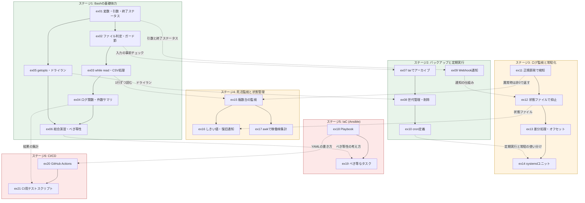
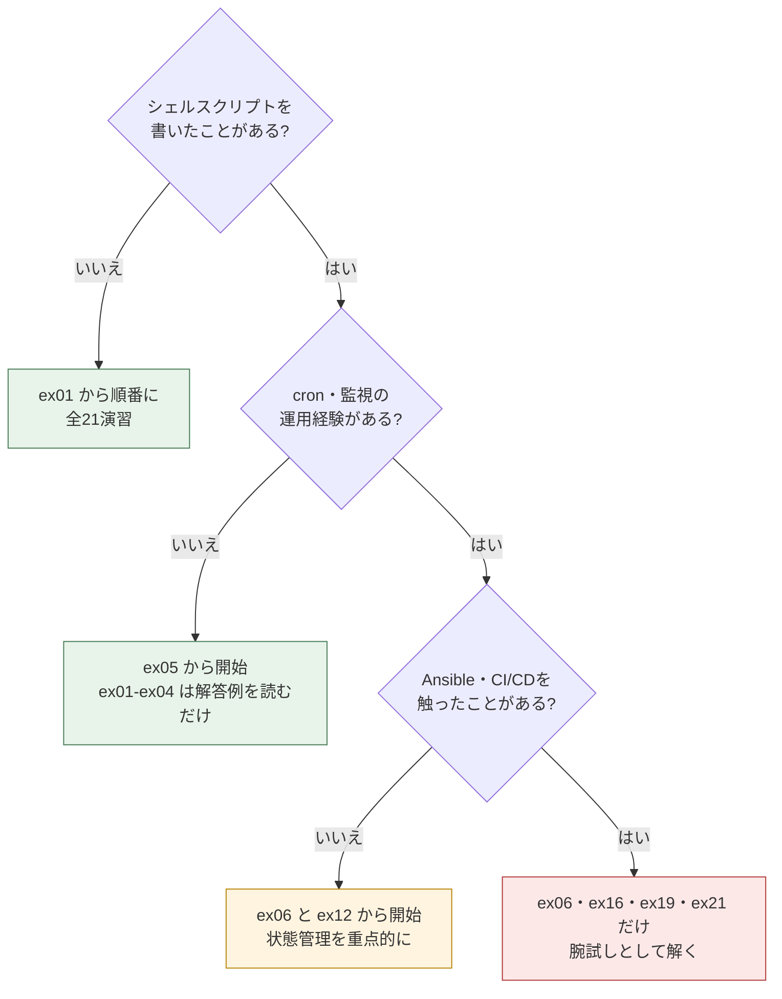

# カリキュラムマップ

全21演習が「何を身につけるためのものか」「どの演習がどの演習の前提になっているか」「その力が案件パックと実務のどこで必要になるか」を一枚にまとめたものです。

**使い方は3つあります。** (1) 着手前に全体像をつかむ、(2) 詰まったときに「どの演習に戻ればよいか」を依存関係図から探す、(3) すでに知識がある分野を「4. 経験者向けのショートカット」で飛ばす。演習の途中で迷子になったら、まずこのページに戻ってきてください。

---

## 1. スキル獲得マップ

全21演習を1行ずつ並べたものです。**「前提となる演習」に挙がっている演習を終えていれば、その演習は単独で始められます。**

### ステージ1: Bashの基礎体力 (案件No.1)

| 演習 | 難易度 | 目安 | 新しく学ぶ概念 | 前提となる演習 |
|---|---|---|---|---|
| [ex01 サーバー情報表示スクリプト](../ex01-server-info/README.md) | ★☆☆☆☆ | 30分 | 変数 / コマンド置換 / 引数チェック / 終了ステータス | — |
| [ex02 入力チェックと安全装置](../ex02-input-validation/README.md) | ★☆☆☆☆ | 40分 | 条件分岐 / ファイル判定 / 権限チェック | ex01 |
| [ex03 CSVを1行ずつ処理する](../ex03-csv-loop/README.md) | ★★☆☆☆ | 50分 | while read / IFS / パラメータ展開 / プロセス置換 | ex02 |
| [ex04 ログ関数と実行記録](../ex04-log-function/README.md) | ★★☆☆☆ | 45分 | 関数 / local / date書式 / tee -a / カウンタ変数 | ex03 |
| [ex05 オプション解析とドライラン](../ex05-getopts-dryrun/README.md) | ★★☆☆☆ | 50分 | getopts / OPTARG / 長いオプションの変換 / ドライラン / グロブ | ex01 |
| [ex06 総合演習: ユーザー一括作成ミニ版](../ex06-mini-useradd/README.md) | ★★☆☆☆ | 90分 | ex01〜ex05の組み立て / べき等性 / 危険な処理をドライランで確かめる習慣 | ex01〜ex05 |

### ステージ2: バックアップと定期実行 (案件No.2)

| 演習 | 難易度 | 目安 | 新しく学ぶ概念 | 前提となる演習 |
|---|---|---|---|---|
| [ex07 tarでバックアップを作る](../ex07-tar-archive/README.md) | ★★☆☆☆ | 45分 | tar czf / -C で基準を変える / --exclude / du -h | ex02 |
| [ex08 世代管理 (古い世代の削除)](../ex08-rotate-generations/README.md) | ★★★☆☆ | 50分 | 世代管理 / 安全な並べ替え / 削除対象の絞り込み | ex05, ex07 |
| [ex09 失敗時のWebhook通知](../ex09-webhook-notify/README.md) | ★★★☆☆ | 50分 | 環境変数で秘密情報を渡す / JSONの組み立てとエスケープ / curl でのPOST | ex01, ex02 |
| [ex10 cron定義を書く](../ex10-cron-schedule/README.md) | ★★☆☆☆ | 40分 | cronの5フィールド / `*/5` と `1-5` の書き方 / 絶対パスで書く理由 | ex07, ex08 |

### ステージ3: ログ監視と常駐化 (案件No.3)

| 演習 | 難易度 | 目安 | 新しく学ぶ概念 | 前提となる演習 |
|---|---|---|---|---|
| [ex11 正規表現でログを検知する](../ex11-log-grep/README.md) | ★★☆☆☆ | 45分 | grep -E の正規表現 / -v による除外 / 監視系の終了ステータス | ex02, ex05 |
| [ex12 状態ファイルで通知を抑止する](../ex12-throttle-state/README.md) | ★★★☆☆ | 55分 | 状態ファイル / `date +%s` (epoch秒) / 算術式 / 壊れた状態への防御 | ex09, ex11 |
| [ex13 前回の続きから読む (差分処理)](../ex13-offset-tail/README.md) | ★★★☆☆ | 60分 | `tail -n +N` / オフセットの保存 / ログローテートの検知 | ex12 |
| [ex14 systemdユニットを書く](../ex14-systemd-unit/README.md) | ★★★☆☆ | 45分 | ユニットの3セクション / Type=simple / Restart=always / WantedBy | ex10, ex13 |

### ステージ4: 死活監視と状態管理 (案件No.4)

| 演習 | 難易度 | 目安 | 新しく学ぶ概念 | 前提となる演習 |
|---|---|---|---|---|
| [ex15 複数台をまとめて監視する](../ex15-multi-target-check/README.md) | ★★★☆☆ | 60分 | 設定ファイルの読み込み / case による分岐 / curl -w でHTTPコードを取る | ex03, ex11 |
| [ex16 連続失敗しきい値と復旧通知](../ex16-flapping-guard/README.md) | ★★★☆☆ | 60分 | 状態遷移 / フラッピング対策 / 通知は変化した瞬間だけ出す | ex12, ex15 |
| [ex17 awkで稼働率を集計する](../ex17-awk-report/README.md) | ★★★☆☆ | 55分 | awk の -F / 連想配列 / ENDブロック / printf の桁ぞろえ | ex03, ex15 |

### ステージ5: IaC (Ansible) (案件No.5)

| 演習 | 難易度 | 目安 | 新しく学ぶ概念 | 前提となる演習 |
|---|---|---|---|---|
| [ex18 Playbookを完成させる](../ex18-ansible-playbook/README.md) | ★★★★☆ | 60分 | YAMLの構造 / play と task / become / handlers と notify | — (新しい分野) |
| [ex19 べき等なタスクに書き換える](../ex19-idempotent-tasks/README.md) | ★★★★☆ | 60分 | べき等性 / 専用モジュールへの置き換え / changed_when と creates | ex06, ex18 |

### ステージ6: CI/CD (案件No.6)

| 演習 | 難易度 | 目安 | 新しく学ぶ概念 | 前提となる演習 |
|---|---|---|---|---|
| [ex20 GitHub Actionsワークフローを書く](../ex20-actions-workflow/README.md) | ★★★★☆ | 60分 | on / jobs / steps / uses と run の違い / needs / if / Secrets | ex18 |
| [ex21 CIで動かすテストスクリプト](../ex21-ci-test-script/README.md) | ★★★★☆ | 60分 | テストの関数化と集計 / `command -v` / スキップと失敗の区別 | ex04, ex20 |

難易度・目安時間・身につく力は、各演習の `meta.env` に書かれている値と同じものです。手元でも確認できます。

```bash
$ cd /home/user/automation/exercises
$ cat ex05-getopts-dryrun/meta.env
```

```text
# 実行結果イメージ
# 演習の情報ファイル(check.sh が読み込んで一覧表示・採点に使う)
EX_ID="05"
EX_TITLE="オプション解析とドライラン"
EX_STAGE="1"
EX_STAGE_NAME="Bashの基礎体力"
EX_LEVEL="★★☆☆☆"
EX_TIME="50分"
EX_SKILL="getopts / OPTARG / 長いオプションの変換 / ドライラン / グロブ"
EX_PROJECT="projects/01-user-account-automation"
EX_TARGET="cleanup_tool.sh"
```

一覧をまとめて見たいときは採点ツールの `--list` を使います。

```bash
$ ./check.sh --list
```

```text
# 実行結果イメージ
演習一覧 (全21件)

ステージ1: Bashの基礎体力
  ex01  ★☆☆☆☆     サーバー情報表示スクリプト
        目安30分 / 変数 / コマンド置換 / 引数チェック / 終了ステータス
  ex02  ★☆☆☆☆     入力チェックと安全装置
        目安40分 / 条件分岐 / ファイル判定 / 権限チェック
  ...

採点するには: ./check.sh 01
```

---

## 2. 演習の依存関係図

実線はステージの中の順序、点線はステージをまたいだ「前の演習で書いた仕組みを使い回す」関係です。**点線の元になっている演習を飛ばすと、後の演習で必ず手が止まります。**



### 図の読み方の例

| 詰まった場面 | 戻るべき演習 |
|---|---|
| ex15 で定義ファイルを1行ずつ読むところが書けない | ex03 (while read と IFS) |
| ex16 の状態ファイルの読み書きが分からない | ex12 (状態ファイルの基本形) |
| ex08 で「本当に消していいのか怖い」と感じた | ex05 (ドライランの作り方) |
| ex19 で「べき等ってどういうこと?」となった | ex06 (2回実行しても壊れないスクリプト) |
| ex20 の YAML のインデントで落ちる | ex18 (YAMLの基本構造) |

---

## 3. 技術要素からの逆引き

「この文法はどの演習で出てくるのか」を引くための表です。復習したい要素が決まっているときに使ってください。

### 3.1 Bashの文法

| 要素 | 出てくる演習 |
|---|---|
| 変数の代入と参照 / コマンド置換 `$(...)` | ex01, ex04, ex07, ex12 |
| 引数の個数チェック `$#` と `$1` | ex01, ex02, ex03, ex07, ex09, ex12, ex13, ex16 |
| 終了ステータスの設計 (`exit 0` / `exit 1` / 用途別のコード) | ex01, ex02, ex04, ex11, ex15, ex21 |
| 標準エラー出力への書き出し `>&2` | ex01, ex02, ex03, ex07, ex09, ex13, ex15 |
| `if` / `elif` とファイル判定 `[[ -f ]]` `[[ -r ]]` `[[ -s ]]` `[[ -d ]]` | ex02, ex05, ex07, ex12, ex21 |
| `case` による分岐 | ex05, ex15, ex16 |
| `while read` によるループ | ex03, ex06, ex15 |
| `IFS=','` を指定した分解 | ex03, ex06, ex15 |
| プロセス置換 `< <( ... )` とサブシェル問題 | ex03, ex06 |
| パラメータ展開 (`${VAR%...}` `${VAR:-既定値}`) | ex03, ex04, ex05, ex08, ex12 |
| 関数の定義と `local` | ex04, ex06, ex21 |
| `getopts` / `OPTARG` / `shift $((OPTIND - 1))` | ex05, ex06, ex08, ex11, ex15 |
| 算術式 `$(( ))` とカウンタ変数 | ex04, ex05, ex12, ex13, ex16 |
| 正規表現による判定 (`=~` / `grep -E`) | ex06, ex11, ex12 |
| 環境変数で設定を受け取る | ex09, ex12, ex16 |

### 3.2 Linuxコマンド・ツール

| 要素 | 出てくる演習 |
|---|---|
| `hostname` / `whoami` / `date` | ex01, ex04, ex09 |
| `wc -l < file` (行数を数える) | ex02, ex13 |
| `tee -a` (画面とファイルの両方に出す) | ex04 |
| `mkdir -p` (無ければ作る) | ex04, ex07, ex16 |
| `tar czf` / `tar tzf` / `--exclude` / `du -h` | ex07 |
| ファイルの削除と、消す対象の絞り込み | ex05, ex08 |
| `find` / `touch -t` / 更新日時での並べ替え | ex08 |
| `curl` (`-sS` / `-X POST` / `-o /dev/null -w`) | ex09, ex15 |
| `ping -c 1 -W 2` | ex15 |
| `grep -E` / `grep -Ev` / `grep -c` | ex11, ex21 |
| `tail -n +N` (N行目から読む) | ex03, ex13 |
| `awk -F` / 連想配列 / `printf` の桁ぞろえ | ex17 |
| `sort` との組み合わせ | ex08, ex17 |
| `crontab -e` / `crontab -l` / `/etc/cron.d` | ex10 |
| `systemctl` / `journalctl -u` | ex14 |
| `useradd` / `groupadd` / `getent` / `chpasswd` / `chage` | ex06 |
| `bash -n` / `shellcheck` / `command -v` | ex21 |
| `ansible-playbook --syntax-check` / `--check` | ex18, ex19 |

### 3.3 運用の考え方

| 要素 | 出てくる演習 |
|---|---|
| ガード節 (処理を始める前に止まる) | ex02, ex07, ex11, ex15 |
| ドライラン (実行する前に見せる) | ex05, ex06, ex08 |
| ログを残す / レベル (INFO・WARN・ERROR) で分ける | ex04, ex06 |
| 最後に件数サマリを出す | ex03, ex04, ex06, ex11, ex15, ex17, ex21 |
| 1件の失敗で全体を止めない | ex03, ex06, ex15 |
| 世代管理 (溜め続けてディスクを枯渇させない) | ex08 |
| 状態ファイル (実行と実行のあいだに情報を引き継ぐ) | ex12, ex13, ex16 |
| 通知の抑止 (同じアラートで鳴り続けない) | ex12 |
| フラッピング対策としきい値 / 復旧通知 | ex16 |
| 秘密情報をスクリプトやリポジトリに直書きしない | ex09, ex20 |
| べき等性 (2回実行しても結果が変わらない) | ex06, ex19 |
| 定期実行 (cron) と常駐 (systemd) の使い分け | ex10, ex13, ex14 |
| 監視は異常時に非0の終了ステータスで知らせる | ex11, ex15, ex21 |
| 自動テストで壊れていないことを守る | ex20, ex21 |

### 逆引きを自分で作る

表に無い要素は、解答例を直接検索すれば見つかります。

```bash
$ cd /home/user/automation/exercises
$ grep -l 'getopts' ex*/answer/*.sh
```

```text
# 実行結果イメージ
ex04-log-function/answer/with_log.sh
ex05-getopts-dryrun/answer/cleanup_tool.sh
...
```

`grep -l` は「一致した行の内容」ではなく「一致したファイル名」を表示するオプションです。**解答例は検索できる教材でもあります。**

---

## 4. 経験者向けのショートカット

すでに知っている分野があるなら、飛ばして構いません。ただし飛ばす判断は「知っている気がする」ではなく、**その演習の `work/` を自力で埋めて `./check.sh NN` が一発で合格するか**で決めてください。1回でも不合格になった演習は、飛ばさずにやったほうが結果的に速く進みます。



| あなたの状況 | 入り方 | 飛ばしてよい理由と注意点 |
|---|---|---|
| **まったくの未経験** | ex01 から順番に | 標準の進め方です。ステージ1だけは順番を守ってください。後の演習が前の演習の文法を前提にしています |
| **Bashを書いたことがある** | ex01〜ex04 は解答例を読むだけにして、**ex05 から** | 変数・条件分岐・ループは既知のはずです。ただし **ex03 の「パイプで while に渡すとサブシェルになりカウンタが消える」問題だけは必ず目を通してください。** 経験者でも踏む落とし穴です |
| **運用経験がある (cron・監視を触ったことがある)** | ex06 で腕試しし、**ex12 から** 状態管理を中心に | ex07・ex10・ex11 の内容は既知の可能性が高いです。一方で ex12・ex13・ex16 の「状態ファイル」と「フラッピング対策」は、経験者でも実装したことがない人が多い領域です |
| **Ansible経験者** | **ex18・ex19 は飛ばしてよい** | ただし ex19 の README にある「なぜ shell / command を使うとべき等でなくなるのか」の説明は、面接で必ず問われます。演習は飛ばしてもREADMEは読んでください |
| **CI/CD経験者** | ex20 を飛ばし、**ex21 だけ解く** | ex21 は案件No.6の `scripts/test.sh` そのものです。CIの設定を書いた経験はあっても「CIで動かすテストスクリプトを自分で書いた」経験がない人は多いため、ここだけは残す価値があります |

### 時間が無いときの最短コース

7〜8時間で全体の骨格を通したい場合は、次の10演習に絞ってください。各ステージの中心となる演習だけを選んでいます。

```text
ex01 → ex03 → ex05 → ex06 → ex08 → ex09 → ex12 → ex15 → ex16 → ex21
```

飛ばした演習は、案件パックを読んでいて分からない箇所が出たときに、この逆引き表から戻って解けば十分です。

---

## 5. 演習 → 案件 → 実務のつながり

ステージごとに「この力が実務のどんな場面で必要になるか」をまとめたものです。**演習が「演習のための演習」で終わらないよう、ここを読んでから着手してください。**

| ステージ | 対応する案件 | 実務でこの力が必要になる場面 |
|---|---|---|
| **1. Bashの基礎体力**<br/>ex01-ex06 | [案件No.1 ユーザーアカウント一括作成](../../projects/01-user-account-automation/README.md) | 入社シーズンに40人ぶんのアカウントを作る、といった「手作業では時間がかかり、しかもミスが許されない」場面です。人事から届くCSVは空行や項目抜けを含むのが普通なので、1行の不備で全体が止まらない作りが要ります。ここで身につく引数チェック・ログ・ドライランは、以降のすべてのスクリプトに入る共通部品です |
| **2. バックアップと定期実行**<br/>ex07-ex10 | [案件No.2 バックアップ自動化](../../projects/02-backup-automation/README.md) | 「バックアップを取っていたつもりが、古い世代でディスクが満杯になって数週間前から失敗していた」は現場で実際に起きる事故です。作る・消す・知らせる・定時に動かすの4点セットが揃って初めて運用に乗ります。cronの書き方は、運用担当者なら読めて当然とみなされる知識です |
| **3. ログ監視と常駐化**<br/>ex11-ex14 | [案件No.3 ログ監視アラート](../../projects/03-log-monitoring-alert/README.md) | アプリのログにエラーが出ていることに翌朝まで誰も気づかない、という状況を無くすための仕組みです。ここで初めて「実行と実行のあいだに情報を引き継ぐ」状態ファイルが登場します。同じ通知が延々と飛んで誰も見なくなる、という二次被害を防ぐ設計まで含めて実務の水準です |
| **4. 死活監視と状態管理**<br/>ex15-ex17 | [案件No.4 死活監視](../../projects/04-server-health-check/README.md) | 監視対象が1台から10台に増えたときに必要になる設計です。ネットワークが一瞬揺れただけで深夜に電話が鳴る監視は、すぐに信用されなくなります。「連続3回失敗したら通知し、直ったら復旧を知らせる」という判断をスクリプトに持たせられるかどうかが、運用エンジニアの評価の分かれ目になります |
| **5. IaC (Ansible)**<br/>ex18-ex19 | [案件No.5 Ansible構築自動化](../../projects/05-ansible-provisioning/README.md) | サーバーを10台同じ設定で構築し、しかも「手順書のとおりにやったはずなのに1台だけ違う」を無くすための考え方です。手順を並べる発想から、あるべき状態を宣言する発想への切り替えが要ります。べき等性は、面接で必ずと言ってよいほど聞かれる用語です |
| **6. CI/CD**<br/>ex20-ex21 | [案件No.6 CI/CDパイプライン](../../projects/06-cicd-pipeline/README.md) | 「手元では動いたのに本番で落ちた」「誰かが確認せずにデプロイした」を仕組みで防ぎます。pushをきっかけに検証とデプロイが自動で走る形は、今やWeb系だけでなくインフラ運用でも標準です。秘密鍵をリポジトリに置かずSecretsで渡す作法は、セキュリティの基本として見られます |

### 案件の実物と突き合わせる

ステージを終えたら、対応する案件のスクリプトを開いて「演習で書いた部品がどこに入っているか」を探してください。**この作業が、演習と実務をつなぐ一番効きます。**

```bash
$ cd /home/user/automation
$ less projects/01-user-account-automation/src/create_users.sh
```

各演習のREADMEの「8. この演習と案件のつながり」に、対応箇所が具体的に書かれています。

---

## 6. 学習時間の目安

| ステージ | 演習 | 演習数 | 目安時間の合計 |
|---|---|---|---|
| 1. Bashの基礎体力 | ex01-ex06 | 6 | 305分 (約5時間) |
| 2. バックアップと定期実行 | ex07-ex10 | 4 | 185分 (約3時間) |
| 3. ログ監視と常駐化 | ex11-ex14 | 4 | 205分 (約3.5時間) |
| 4. 死活監視と状態管理 | ex15-ex17 | 3 | 175分 (約3時間) |
| 5. IaC (Ansible) | ex18-ex19 | 2 | 120分 (約2時間) |
| 6. CI/CD | ex20-ex21 | 2 | 120分 (約2時間) |
| **合計** | **ex01-ex21** | **21** | **1110分 (約18〜20時間)** |

この数字は各演習の `meta.env` に書かれた目安時間の合計です。**詰まって考えている時間は含んでいません**が、それも含めておおむね18〜20時間に収まる想定です。

| ペース | 1日の目安 | 完了までの目安 |
|---|---|---|
| 平日1時間 | 1〜2演習 | 約3週間 |
| 週末中心 (土日4時間ずつ) | 4〜6演習 | 約1.5ヶ月 |
| 集中 (1日5時間) | 6〜8演習 | 約4日 |

演習パック (約18〜20時間) は、案件パック (約41〜61時間) の**前**に置く投資です。先に手を動かしておくと、案件パックのスクリプトが「読めば分かる」状態で読めるため、合計の学習時間はむしろ短くなります。

ステージ単位で採点すれば、その区切りが終わったかどうかを確認できます。

```bash
$ cd /home/user/automation/exercises
$ ./check.sh --stage 2
```

```text
# 実行結果イメージ
════════════════ 採点結果サマリ ════════════════
 合格: 4 / 4 件

 全問合格です。おつかれさまでした。
```

---

## 7. 関連ドキュメント

| ドキュメント | 内容 |
|---|---|
| [../README.md](../README.md) | 演習パックの入口 (演習一覧・進め方・修了チェック) |
| [01-design.md](01-design.md) | 演習パック設計書 (なぜこの並びなのか・難易度カーブの設計) |
| [02-getting-started.md](02-getting-started.md) | はじめかた (環境準備から最初の1問を解ききるまで) |
| [04-self-check-guide.md](04-self-check-guide.md) | 自動採点の仕組み (一時ディレクトリ・ダミーコマンド・判定関数) |
| [05-progress-sheet.md](05-progress-sheet.md) | 学習記録シート (詰まった点を面接エピソードに変える) |
| [06-hints-and-pitfalls.md](06-hints-and-pitfalls.md) | 全演習共通のつまずき集 (エラーメッセージからの逆引き) |
| [07-bash-syntax-cheatsheet.md](07-bash-syntax-cheatsheet.md) | Bash文法早見表 |
| [../../docs/02-learning-roadmap.md](../../docs/02-learning-roadmap.md) | 案件パックを含めた全体の学習ロードマップ |
| [../../docs/03-glossary.md](../../docs/03-glossary.md) | 初心者向け用語集 |
| [../../docs/04-environment-setup.md](../../docs/04-environment-setup.md) | 検証環境構築ガイド (仮想マシン・クラウド無料枠) |
| [../../docs/01-portfolio-guide.md](../../docs/01-portfolio-guide.md) | ポートフォリオとしての見せ方・面接での語り方 |
