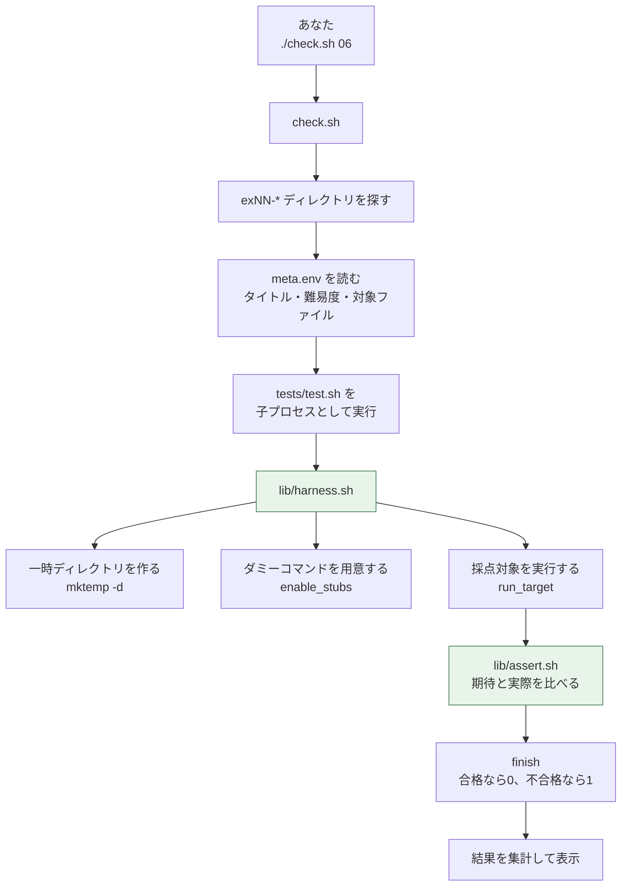

# 自動採点の仕組みガイド

`./check.sh` が何をしているのかを解説します。**この採点ツール自体もすべてBashで書かれている**ため、演習を進めながら「実務でも通用するBashスクリプトの実例」として読むことができます。

自分で演習を追加したい人向けの手順も後半にまとめています。

---

## 1. まず知ってほしいこと: 採点は安全です

採点中に不安になりやすいのが「`useradd` の練習をして、自分のPCに変なユーザーが作られないか」「`rm` の練習でファイルが消えないか」という点です。結論から言うと、**どちらも起きません**。

| 心配ごと | 実際にどうなっているか |
|---|---|
| 本物のユーザーが作られる? | `useradd` はダミーに差し替えられる。呼ばれた記録が残るだけで、何も作られない |
| 自分のファイルが消される? | 採点は使い捨ての一時ディレクトリの中だけで行われる。終わると自動で消える |
| root権限が必要? | 不要。一般ユーザーのままで全21演習を採点できる。ただし ex06 だけは「root権限チェック」自体が課題に含まれるため、一般ユーザーで採点するとアカウント作成部分の判定がスキップされる。仕上げに `sudo ./check.sh 06` を実行すると全項目を判定できる |
| インターネット接続が必要? | 不要。`curl` もダミーなので、通信は一切発生しない |
| 実サーバーが必要? | 不要。`ping` の相手も、監視対象のWebサーバーもダミーで再現している |

---

## 2. 全体の流れ



登場するファイルは4つだけです。

| ファイル | 役割 |
|---|---|
| `check.sh` | 演習を探して、順番にテストを走らせ、結果を集計する司会役 |
| `lib/harness.sh` | 安全な実験場(一時ディレクトリ + ダミーコマンド)を用意して、対象を実行する |
| `lib/assert.sh` | 「期待どおりか」を判定して、合否とヒントを表示する |
| `lib/stubs/_recorder.sh` | ダミーコマンドの本体。呼び出しを記録するだけの偽物 |

---

## 3. 一時ディレクトリ(安全な実験場)

`lib/harness.sh` は読み込まれた瞬間に、使い捨ての作業ディレクトリを作り、その中へ移動します。

```bash
WORKDIR="$(mktemp -d "${TMPDIR:-/tmp}/exercise-check.XXXXXX")"
trap _cleanup EXIT       # 終了時に必ず消す予約
cd "$WORKDIR"
```

- `mktemp -d` は「他と衝突しない一時ディレクトリ」を作るコマンドです
- `trap ... EXIT` は「このスクリプトが終わるときに必ず実行する処理」を予約する仕組みです。途中でエラーが起きても、Ctrl+C で止めても、後始末が実行されます
- テストが作る入力ファイル(CSVやログ)も、採点対象が作る出力も、すべてこの中に閉じ込められます

調査のために中身を残したいときは、環境変数を付けて実行します。

```bash
KEEP_WORKDIR=1 ./check.sh 07
```

```text
  作業ディレクトリを残しました: /tmp/exercise-check.AbC123
```

**`trap` は実務のスクリプトでも定番です。** 一時ファイルを使う処理では「作ったら即座に消す予約をする」と覚えておくと、消し忘れによるディスク圧迫を防げます。

---

## 4. ダミーコマンド(スタブ)の仕組み

### 4.1 なぜ差し替えるのか

演習では `useradd` や `ping` を扱いますが、本物を動かすには次の壁があります。

- `useradd` は root権限が必要で、しかも本当にユーザーが増えてしまう
- `ping` は相手のサーバーが要る。しかも「落ちているサーバー」を用意するのは面倒
- `curl` は通信先が要る。Slackの本物のWebhookを演習で叩くわけにはいかない

そこで、**呼び出しを記録するだけの偽物**を用意し、それを本物より先に見つけさせます。

### 4.2 どう差し替えているのか

Linuxは、コマンド名を `PATH` 環境変数に書かれたディレクトリの**先頭から順に**探します。この性質を使い、一時ディレクトリの中に偽物を置いて、`PATH` の先頭に足しています。

```bash
enable_stubs useradd groupadd getent      # 偽物を用意する
PATH="${STUB_DIR}:${PATH}" bash "$TARGET" # 偽物を先に見つけさせる
```

偽物の正体は `lib/stubs/_recorder.sh` 1本です。これが `useradd` や `ping` という名前でコピーされ、自分がどの名前で呼ばれたかを `$(basename "$0")` で判断して、それらしく振る舞います。

呼び出しは1行1件で記録され、テストから検証できます。

```text
getent passwd yamada_t
groupadd eigyo
useradd -m -c 山田太郎 -g eigyo -s /bin/bash yamada_t
chpasswd
chage -d 0 yamada_t
```

### 4.3 異常系を自由に再現できる

スタブの本当の価値は、**普通は再現しづらい異常系を、環境変数だけで作り出せる**ことです。

| 環境変数 | 再現できる状況 | 使う演習 |
|---|---|---|
| `STUB_EXISTING_USERS` | そのユーザーは既に存在する | ex06 |
| `STUB_EXISTING_GROUPS` | そのグループは既に存在する | ex06 |
| `STUB_FAIL_CMDS` | useraddやcurlが失敗した | ex06 / ex09 |
| `STUB_DOWN_HOSTS` | サーバーが落ちていてpingが返らない | ex15 |
| `STUB_HTTP_CODE` / `STUB_HTTP_CODES` | Webサーバーが500を返す | ex15 |
| `STUB_ACTIVE_UNITS` | サービスが起動している/いない | 任意 |

実務のスクリプトの品質差は、正常系ではなく**異常系の作り込み**に出ます。「相手が落ちていたら」「コマンドが失敗したら」を何度でも安全に試せることが、この仕組みの狙いです。

---

## 5. 判定関数(assert)の読み方

`tests/test.sh` は、次のような素直な形で書かれています。

```bash
source "${EX_LIB}/harness.sh"       # 実験場を用意する

require_target                       # 採点対象のファイルがあるか確認
assert_no_syntax_error               # bash -n で構文チェック

describe "異常系: 引数なしで実行したとき"
run_target                           # 引数なしで実行する

hint "引数の個数は \$# で調べます。"
assert_status 1 "引数なしで実行すると終了ステータス1で終わる"
assert_stderr_contains "使い方" "使い方を標準エラー出力に表示する"

finish                               # 集計して終了
```

### 5.1 実行と結果の受け取り

`run_target` は採点対象を実行し、結果を4つの変数に入れます。

| 変数 | 中身 |
|---|---|
| `LAST_STDOUT` | 標準出力 |
| `LAST_STDERR` | 標準エラー出力 |
| `LAST_OUTPUT` | 両方をつないだもの |
| `LAST_STATUS` | 終了ステータス(タイムアウト時は124) |

タイムアウトは既定20秒です。無限ループを書いてしまっても採点が固まらないよう、`timeout` コマンドで保護しています。

### 5.2 主な判定関数

| 関数 | 判定する内容 |
|---|---|
| `assert_status <期待値> <説明>` | 終了ステータス |
| `assert_stdout_contains <文字列> <説明>` | 標準出力に文字列が含まれるか |
| `assert_stdout_matches <正規表現> <説明>` | 標準出力が正規表現に一致するか |
| `assert_stderr_contains <文字列> <説明>` | 標準エラー出力に文字列が含まれるか |
| `assert_output_not_contains <文字列> <説明>` | 出力に含まれ「ない」こと |
| `assert_file_exists <パス> <説明>` | ファイルが作られたか |
| `assert_file_contains <パス> <正規表現> <説明>` | ファイルの中身 |
| `assert_file_count <グロブ> <件数> <説明>` | 該当するファイルの数 |
| `assert_stub_called <コマンド> <正規表現> <説明>` | ダミーコマンドが呼ばれたか |
| `assert_stub_not_called <コマンド> <正規表現> <説明>` | 呼ばれていないこと(ドライラン検証) |
| `assert_cmd <説明> <コマンド...>` | 任意のコマンドが成功するか |
| `skip <理由>` | 環境の都合で判定できない項目 |

`hint "..."` は「次の1項目が失敗したときだけ表示されるヒント」です。**独学者には質問する相手がいない**という前提で、失敗メッセージが次の一手を示すように設計しています。

---

## 6. 自分で演習を追加する

演習は「`meta.env` を置いたディレクトリ」があれば自動的に認識されます。フレームワークの登録作業のようなものは一切ありません。

### 6.1 手順

```bash
cd exercises

# 1. ディレクトリを作る(exNN-<英語スラグ> の形)
mkdir -p ex22-my-exercise/{work,answer,tests}

# 2. 演習の情報を書く
cat > ex22-my-exercise/meta.env <<'EOF'
EX_ID="22"
EX_TITLE="自分で考えた演習"
EX_STAGE="6"
EX_STAGE_NAME="CI/CD"
EX_LEVEL="★★★☆☆"
EX_TIME="45分"
EX_SKILL="学べること / を / スラッシュ区切りで"
EX_PROJECT="projects/06-cicd-pipeline"
EX_TARGET="my_script.sh"
EOF

# 3. 課題文・雛形・解答例・テストを作る
#    (ex01-server-info/ をまるごとコピーして書き換えるのが早い)
cp ex01-server-info/README.md ex22-my-exercise/README.md

# 4. 一覧に反映する
./tools/make-index.sh

# 5. 動作確認する
./check.sh --answer 22   # 解答例が全項目合格すること
./check.sh 22            # 雛形は落ちること
./tools/lint.sh          # 構文チェックと静的解析
```

### 6.2 テストを書くときの約束

演習パック全体の一貫性を保つため、次の5点は必ず守ってください(設計上の約束です)。

1. **root権限を必要とする採点を書かない**(学習者の環境を選ばないため)
2. **ネットワーク接続を必要とする採点を書かない**(オフラインでも学習できるため)
3. **現在時刻・実行順序・実行速度に依存する採点を書かない**(結果が毎回変わると学習者が混乱するため)
4. **READMEの仕様とテストの判定を1対1で対応させる**(テストにしか書かれていない要求は「意地悪な問題」になる)
5. **失敗メッセージには必ず次の一手を書く**(`hint` を活用する)

判定できない項目は、黙って合格にせず `skip "理由"` として理由を表示してください。
実行ユーザーによって結果が変わる判定(rootかどうかで挙動が変わる課題など)も、
合格にしてごまかさず `skip` で理由を出すのが約束です。

### 6.3 テスト用の入力ファイルの作り方

harness が既に一時ディレクトリへ移動しているので、ヒアドキュメントでそのまま作れます。

```bash
cat > input.csv <<'EOF'
氏名,ユーザー名,部署,初期パスワード
山田太郎,yamada_t,eigyo,ChangeMe123!
EOF

run_target -f input.csv
assert_status 0 "正常なCSVを処理できる"
```

`<<'EOF'` のようにシングルクォートで囲むと、`$` や `` ` `` がそのままの文字として扱われます。テストデータを書くときはこの形が安全です。

---

## 7. 困ったとき

| 症状 | 確認すること |
|---|---|
| `./check.sh: Permission denied` | `bash check.sh 01` で実行するか、`chmod +x check.sh` を実行する |
| `./check.sh: No such file or directory` | `exercises` ディレクトリの中にいるか確認する。別の場所から実行するときは `bash /path/to/exercises/check.sh 01` のようにパスを指定する |
| `演習ディレクトリ(ex01-... 形式)が見つかりません` | `check.sh` と同じ階層に `exNN-*` ディレクトリが無い。リポジトリを正しく取得できているか確認する(`check.sh` はスクリプト自身の位置を基準に演習を探すため、どのディレクトリから呼んでもこのエラーにはならない) |
| 採点が20秒で止まる | 採点対象に無限ループがある。`while` の終了条件や `tail -f` の使い方を確認する |
| 何が起きたか詳しく見たい | `KEEP_WORKDIR=1 ./check.sh 07` で作業ディレクトリを残して中身を確認する |
| テストの中身を読みたい | `cat exNN-*/tests/test.sh` を読む。**テストは仕様書そのものです** |

---

## 8. 関連ドキュメント

- [01-design.md](01-design.md) — 演習パック設計書(採点システムの設計判断とその理由)
- [06-hints-and-pitfalls.md](06-hints-and-pitfalls.md) — 全演習共通のつまずき集
- [../README.md](../README.md) — 演習パックの入口
