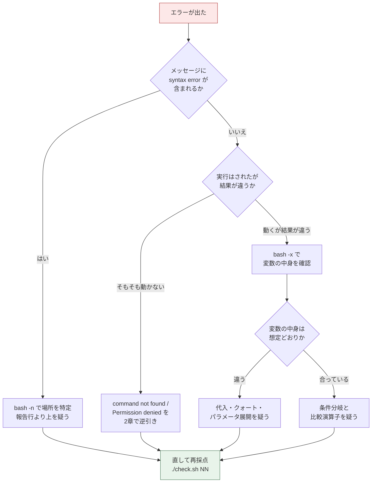

# つまずき集(全演習共通)

演習中に出たエラーメッセージから、原因と直し方に**逆引き**でたどり着くためのページです。手が止まったら、まず [2. エラーメッセージ逆引き表](#2-エラーメッセージ逆引き表) で、画面に出ている文言を探してください。

各演習の README にも「6. よくあるつまずき」がありますが、そちらは**その演習に固有**の話です。ここでは **どの演習でも起きる、Bashそのものの落とし穴**と、採点ツール `./check.sh` の使い方でつまずく点をまとめています。

このページに載せたエラーメッセージは、GNU bash 5.2 (Ubuntu 24.04) で実際に再現した文言です(ファイル名と行番号は演習に合わせた例に置き換えています)。bashのバージョンによって文言が少し変わることがありますが、原因と直し方は同じです。

---

## 1. まず失敗メッセージを読む

**エラーメッセージは、犯人の自白です。** 初心者がいちばん損をしているのは、赤い文字が出た瞬間に読むのをやめて、コードを勘で書き換えてしまうことです。ほとんどのエラーは、メッセージを最後まで読めば場所と原因が書かれています。

### 1.1 エラーメッセージは4つの部分でできている

```text
parse_users.sh: line 12: CSV_FILE: unbound variable
```

| 部分 | この例では | 読み取れること |
|---|---|---|
| ファイル名 | `parse_users.sh` | どのファイルで起きたか |
| `line NN` | `line 12` | 12行目。ただし**あなたが間違えた場所とは限らない** |
| 対象の名前 | `CSV_FILE` | どの変数・コマンドが問題だったか |
| 症状 | `unbound variable` | 何が起きたか。検索するのはここ |

**行番号は「bashが困った場所」であって「間違いを書いた場所」ではありません。** たとえば `if` を閉じ忘れると、bashは最終行まで読んでから「終わってしまった」と気づくため、ファイルの一番下の行番号が報告されます。閉じ忘れ系のエラーでは、報告された行より**上**を疑ってください。

### 1.2 デバッグの道具は3つで足りる

演習21問を通して、この3つ以外はほとんど要りません。

#### 道具1: `bash -n` — 実行せずに文法だけ調べる

`-n` は「読むだけで実行しない」オプションです。`fi` や `done` の閉じ忘れ、クォートの閉じ忘れを、副作用ゼロで見つけられます。

```bash
$ bash -n ex03-csv-loop/work/parse_users.sh
```

```text
# 実行結果イメージ(問題がなければ何も表示されず、終了ステータスは0)
```

```text
# 実行結果イメージ(閉じ忘れがあるとき)
parse_users.sh: line 34: syntax error: unexpected end of file
```

#### 道具2: `bash -x` — 実行した内容を1行ずつ見せてもらう

`-x` は「実行する直前の行を `+` 付きで表示する」オプションです。**変数に何が入っているか**、**どこまで進んだか**が一目で分かります。

```bash
$ bash -x ex02-input-validation/work/check_input.sh users.csv
```

```text
# 実行結果イメージ
+ set -u
+ FILE=users.csv
+ [[ ! -f users.csv ]]
++ wc -l
+ LINES=2
+ echo 'OK: users.csv は処理できます (2行)'
OK: users.csv は処理できます (2行)
```

- 先頭の `+` の数はネストの深さです。`++` はコマンド置換 `$(...)` の中を意味します
- 変数は**展開後の値**で表示されます。`FILE=users.csv` のように、実際に何が入ったかが分かります
- スクリプト全体ではなく一部だけ見たいときは、調べたい範囲を `set -x` と `set +x` で挟みます

```bash
set -x          # ここから表示を開始する
LINES=$(wc -l < "$FILE")
set +x          # ここで表示を止める
```

#### 道具3: `echo $?` — 直前の終了ステータスを見る

`$?` には**直前に終わったコマンドの終了ステータス**が入ります。演習では「引数なしなら exit 1」のような仕様が頻出するので、目視での確認はこれが基本です。

```bash
$ bash ex02-input-validation/work/check_input.sh
$ echo $?
```

```text
# 実行結果イメージ
使い方: check_input.sh <入力ファイル>
1
```

**注意: `$?` は「直前の1つ」しか覚えていません。** 間に `echo` を1つ挟んだだけで、その `echo` の結果(成功なので0)に上書きされます。詳しくは [3.5](#35-落とし穴5--を別のコマンドを挟んでから見てしまう) を見てください。

### 1.3 終了ステータス早見表

数字には意味があります。採点の失敗メッセージに出た数字から、原因の見当がつきます。

| 値 | 意味 | よくある原因 |
|---|---|---|
| `0` | 成功 | 正常終了。`exit 0` を書いた場合も含む |
| `1` | 一般的な失敗 | 自分で `exit 1` した / `grep` が1件も見つけられなかった |
| `2` | bashの構文エラー | `bash -n` で見つかる種類の間違い |
| `124` | 時間切れ | 採点ツールが20秒で打ち切った。無限ループを疑う |
| `126` | 実行できない | ファイルはあるが実行権限がない |
| `127` | 見つからない | コマンド名の打ち間違い / 未インストール / CRLF改行 |
| `130` | 中断 | `Ctrl+C` で止めた |

`grep` が「1件も見つからなかったとき1を返す」のは覚えておく価値があります。これを知らないと `set -e` と組み合わせたときに原因不明の停止に見えます([3.7](#37-落とし穴7-set--e-で想定内の失敗まで止まる))。

### 1.4 切り分けの順番



---

## 2. エラーメッセージ逆引き表

出ている文言から探してください。`スクリプト名` や行番号は環境によって変わるので、**それ以外の部分**で照合します。

| 出ているメッセージ | ひとことで言う原因 | 詳細 |
|---|---|---|
| `NAME: command not found` | `=` の前後に空白を入れた | [2.1](#21-command-not-found) |
| `xxx: command not found` | コマンド名の打ち間違い / 未インストール | [2.1](#21-command-not-found) |
| `No such file or directory` | パスが違う / 相対パスで実行している | [2.2](#22-no-such-file-or-directory) |
| `Permission denied` | 実行権限がない / 読み取り権限がない | [2.3](#23-permission-denied) |
| ``unexpected EOF while looking for matching `"'`` | クォートの閉じ忘れ | [2.4](#24-unexpected-eof-while-looking-for-matching-) |
| `syntax error: unexpected end of file` | `fi` `done` `}` の閉じ忘れ | [2.5](#25-syntax-error-unexpected-end-of-file) |
| ``syntax error near unexpected token `fi'`` | `then` の前の `;` 忘れなど、構文の並びの誤り | [2.6](#26-syntax-error-near-unexpected-token-xxx) |
| `unbound variable` | `set -u` の状態で、未定義の変数を参照した | [2.7](#27-unbound-variable) |
| `[: abc: integer expression expected` | 数値比較 `-eq` `-gt` に数値でない値を渡した | [2.8](#28-integer-expression-expected) |
| `[: too many arguments` | 変数をクォートしていない | [2.9](#29-too-many-arguments--unary-operator-expected) |
| `[: =: unary operator expected` | 変数が空なのにクォートしていない | [2.9](#29-too-many-arguments--unary-operator-expected) |
| `${V*}: bad substitution` | パラメータ展開の書き方の誤り / `sh` で実行した | [2.10](#210-bad-substitution) |
| `$F: ambiguous redirect` | リダイレクト先の変数が空、または空白を含む | [2.11](#211-ambiguous-redirect) |
| `$'date\r': command not found` | ファイルの改行コードがCRLF(Windows形式) | [2.12](#212-crlf改行によるエラー) |
| `cannot execute: required file not found` | シバン行の末尾にCRが付いている | [2.12](#212-crlf改行によるエラー) |
| `[[: not found` | bashのスクリプトを `sh` で実行した | [2.13](#213--not-found) |
| `illegal option -- z` | `getopts` が知らないオプションを受け取った | [2.14](#214-illegal-option----x) |
| `rm: cannot remove '*.tmp': No such file or directory` | グロブが1件もマッチしなかった | [2.15](#215-rm-cannot-remove-tmp-no-such-file-or-directory) |
| `タイムアウト(実行が終わらなかった)` | 採点が20秒で打ち切られた | [4.1](#41-20秒でタイムアウトする) |

### 2.1 `command not found`

**症状**

```text
server_info.sh: line 5: NAME: command not found
```

**よくある原因**: 代入の `=` の前後に空白を入れています。bashは `NAME` を**コマンド名**として実行しようとします。もう1つは、単純なコマンド名の打ち間違いや、そのコマンドが入っていないケースです。

**直し方**

```bash
# 間違い: = の前後に空白がある
NAME = "web01"

# 正しい: 空白を入れない
NAME="web01"
```

コマンド名側を疑うときは、存在確認をしてから使います。

```bash
$ command -v tar          # あればパスが表示され、無ければ何も出ずに終了ステータス1
```

```text
# 実行結果イメージ
/usr/bin/tar
```

### 2.2 `No such file or directory`

**症状**

```text
cat: /no/such/file.txt: No such file or directory
bash: ./check.sh: No such file or directory
```

**よくある原因**: パスの打ち間違い、または**今いるディレクトリが想定と違う**ことです。`./check.sh` が見つからないときは、`exercises` ディレクトリの外にいます。cronやsystemdから実行したときに出る場合は、相対パスで書いていることが原因です(実行時のカレントディレクトリが自分の想定と違います)。

**直し方**

```bash
$ pwd                              # 今どこにいるかを確認する
$ ls                               # そこに目的のファイルがあるかを確認する
$ cd ~/automation/exercises        # 演習パックへ移動する(cloneした場所に合わせる)
```

cron や systemd から動かすスクリプトでは、**必ず絶対パス**で書きます(ex10・ex14で扱います)。

```bash
# 間違い: cron から実行すると見つからない
./scripts/backup.sh

# 正しい: 絶対パスで書く
/opt/scripts/backup.sh
```

### 2.3 `Permission denied`

**症状**

```text
bash: ./check.sh: Permission denied          # 終了ステータス126
cat: secret.txt: Permission denied
```

**よくある原因**: 実行しようとしたファイルに**実行権限(x)**が無い、または読もうとしたファイルに**読み取り権限(r)**が無い状態です。

**直し方**

```bash
$ ls -l check.sh                   # 権限を確認する
$ chmod +x check.sh                # 実行権限を付ける
$ bash check.sh 01                 # または bash 経由で実行する(権限が無くても動く)
```

```text
# 実行結果イメージ(ls -l)
-rw-r--r-- 1 user user 9255 Sep  6 11:15 check.sh    ← x が無い
-rwxr-xr-x 1 user user 9255 Sep  6 11:15 check.sh    ← chmod +x のあと
```

**補足**: root は権限の設定を無視して読み書きできます。そのため ex02 の読み取り権限チェックは、root で採点すると判定できず自動でスキップされます([4.2](#42-rootで採点するとスキップされる項目がある))。

### 2.4 ``unexpected EOF while looking for matching `"'``

**症状**

```text
with_log.sh: line 12: unexpected EOF while looking for matching `"'
```

**よくある原因**: クォート(`"` や `'`)の閉じ忘れです。「`"` の相方を探しながらファイルの終わり(EOF)まで来てしまった」という意味です。

**直し方**

```bash
# 間違い: 閉じ忘れ。この行以降すべてが文字列の中身として扱われる
echo "処理を開始します

# 正しい
echo "処理を開始します"
```

エディタの色分け(シンタックスハイライト)が途中から一色になっている場所が、たいてい閉じ忘れの位置です。**この行番号はクォートを「開き始めた行」**を指しているので、ここは素直にその行を見てください。

### 2.5 `syntax error: unexpected end of file`

**症状**

```text
parse_users.sh: line 34: syntax error: unexpected end of file
```

**よくある原因**: `if` に対する `fi`、`for` / `while` に対する `done`、関数の `{` に対する `}` の閉じ忘れです。

**直し方**

```bash
# 間違い: fi が無い
if [[ -f "$FILE" ]]; then
    echo "あります"

# 正しい
if [[ -f "$FILE" ]]; then
    echo "あります"
fi
```

**報告される行番号はファイルの末尾付近になります。** 上から順にインデントを見直し、`if` と `fi`、`do` と `done` の数が合っているかを数えてください。半角スペース4つでインデントを揃えておくと、この種の間違いは目で見つかります。

### 2.6 ``syntax error near unexpected token `xxx'``

**症状**

```text
check_input.sh: line 8: syntax error near unexpected token `fi'
check_input.sh: line 8: `fi'
```

**よくある原因**: 構文の並びが違います。頻出は次の3つです。

1. `then` の前の `;` を書き忘れた
2. プロセス置換 `< <(...)` の `<` と `<(` の間の**半角スペースを入れ忘れた**(ex03で必ず出ます)
3. 関数定義の `()` の中に引数名を書いてしまった

**直し方**

```bash
# 間違い1: ; が無い
if [ 1 -eq 1 ] then

# 正しい1
if [ 1 -eq 1 ]; then

# 間違い2: <<( になっている
done <<(tail -n +2 "$CSV_FILE")

# 正しい2: < と <( の間に半角スペースが必要
done < <(tail -n +2 "$CSV_FILE")

# 間違い3: Bashの関数は () の中に引数を書かない
create_user(name) {

# 正しい3: 引数は $1 $2 で受け取る
create_user() {
    local name="$1"
}
```

### 2.7 `unbound variable`

**症状**

```text
check_input.sh: line 12: $1: unbound variable
with_log.sh: line 20: LOG_DIR: unbound variable
```

**よくある原因**: `set -u`(未定義の変数を使ったら止める設定)を書いた状態で、まだ値が入っていない変数を参照しています。**引数チェックより先に `$1` を代入している**のが定番です。

**直し方**

```bash
# 間違い: 引数が無いと $1 が未定義で止まる
set -u
FILE="$1"
if [[ $# -ne 1 ]]; then ...

# 正しい: 引数の個数を先に確認してから代入する
set -u
if [[ $# -ne 1 ]]; then
    echo "使い方: check_input.sh <入力ファイル>" >&2
    exit 1
fi
FILE="$1"
```

環境変数のように「無いかもしれない」ものは、既定値付きで参照します。

```bash
STATE_FILE="${STATE_FILE:-./throttle.state}"    # 未設定なら ./throttle.state を使う
THRESHOLD="${FAIL_THRESHOLD:-3}"                # ex12・ex16 で使う書き方
```

`set -u` は面倒に見えますが、**変数名の打ち間違いを実行前に教えてくれる安全装置**です。外さずに、上の形で付き合ってください。

### 2.8 `integer expression expected`

**症状**

```text
rotate_backups.sh: line 24: [: abc: integer expression expected
```

**よくある原因**: `-eq` `-ne` `-lt` `-gt` は**数値専用**の比較です。中身が数値でない変数(空文字列を含む)を渡すと、この文句が出ます。

**直し方**

```bash
# 間違い: COUNT に数字以外が入る可能性がある
if [ "$COUNT" -gt 3 ]; then

# 正しい: 数値かどうかを先に確かめる(ex08 の -g、ex12 の状態ファイルで必要になる)
if [[ ! "$COUNT" =~ ^[0-9]+$ ]]; then
    echo "エラー: 世代数には数値を指定してください" >&2
    exit 1
fi
if [[ "$COUNT" -gt 3 ]]; then
    echo "多いです"
fi
```

文字列を比べたいときは `=`(または `==`)を使います。使い分けは [3.4](#34-落とし穴4--eq-と--の取り違え) にまとめました。

### 2.9 `too many arguments` / `unary operator expected`

**症状**

```text
check_input.sh: line 15: [: too many arguments
check_input.sh: line 15: [: =: unary operator expected
```

**よくある原因**: どちらも**変数をクォートしていない**ことが原因です。`[ $V = "a b" ]` は、`V` に `a b` が入っていると `[ a b = "a b" ]` に展開され、単語の数が合わなくなります。`V` が空だと `[ = "x" ]` になり、`=` の左側が無いと言われます。

**直し方**

```bash
# 間違い
if [ $V = "x" ]; then

# 正しい: ダブルクォートで囲む
if [ "$V" = "x" ]; then

# もっと安全: [[ ]] を使う(単語分割が起きないので空でも壊れない)
if [[ "$V" == "x" ]]; then
```

### 2.10 `bad substitution`

**症状**

```text
parse_users.sh: line 18: ${V*}: bad substitution
parse_users.sh: 18: Bad substitution
```

**よくある原因**: 2種類あります。

1. パラメータ展開の書き方が間違っている(`${V*}` のように、bashが知らない記号を使った)
2. **bash専用の書き方を `sh` で実行した**。`sh` の正体は多くのUbuntu環境で dash という別のシェルで、`${VAR:0:2}` などが使えません

**直し方**

```bash
# 1. 書き方を直す(意図した展開の形にする)
echo "${V%.txt}"        # 末尾の .txt を取り除く
echo "${V#prefix_}"     # 先頭の prefix_ を取り除く
echo "${V:-既定値}"     # V が空なら既定値を使う
```

```bash
# 2. 実行の仕方を直す
$ sh  ex03-csv-loop/work/parse_users.sh users.csv    # 間違い
$ bash ex03-csv-loop/work/parse_users.sh users.csv   # 正しい
```

演習のスクリプトは**すべて bash 前提**です。シバン行に `#!/bin/bash` と書き、実行も `bash` で行ってください。

### 2.11 `ambiguous redirect`

**症状**

```text
with_log.sh: line 22: $LOG_FILE: ambiguous redirect
```

**よくある原因**: リダイレクト先に指定した変数が**空**、または**空白を含む**のに、クォートしていません。「どこに書けばいいのか判断できない」という意味です。

**直し方**

```bash
# 間違い
echo "hi" > $LOG_FILE

# 正しい: 必ずクォートする
echo "hi" > "$LOG_FILE"
```

それでも出るときは `LOG_FILE` が空です。`bash -x` で中身を確認してください。ログディレクトリの組み立てを間違えている(ex04)ことが多いです。

### 2.12 CRLF改行によるエラー

**症状**

```text
parse_users.sh: line 9: $'date\r': command not found
bash: ./parse_users.sh: cannot execute: required file not found
parse_users.sh: line 42: syntax error: unexpected end of file
```

**よくある原因**: ファイルの改行コードが **CRLF(Windows形式)** になっています。Windowsのエディタで保存した、あるいはWindows側のフォルダで作業したファイルで起きます。行末に見えない `\r`(CR)が付き、bashはそれをコマンド名や変数の値の一部として扱ってしまいます。**症状が「文法エラー」「コマンドが無い」「値が一致しない」とバラバラに出る**のがこの問題のやっかいなところです。

**直し方**

まず確認します。

```bash
$ file ex03-csv-loop/work/parse_users.sh
$ cat -A ex03-csv-loop/work/parse_users.sh | head -3
```

```text
# 実行結果イメージ(CRLFのとき)
parse_users.sh: ASCII text, with CRLF line terminators
#!/bin/bash^M$
^M$
set -u^M$
```

`^M$` の `^M` がCRです(`$` が行末を表します)。次のどちらかで直します。

```bash
$ sed -i 's/\r$//' ex03-csv-loop/work/parse_users.sh    # どの環境でも使える
$ dos2unix ex03-csv-loop/work/parse_users.sh            # dos2unix が入っていれば
```

**入力データ側がCRLFの場合は、スクリプトで対処するのが正解です。** 実務では「相手からもらうCSVがWindows製」は日常なので、消しに行くのではなく受け止められるように書きます(ex03の課題そのものです)。

```bash
line="${line%$'\r'}"      # 行末のCRを取り除く
```

エディタ側の設定でも防げます。VS Code なら画面右下の `CRLF` をクリックして `LF` に変更してください。

### 2.13 `[[: not found`

**症状**

```text
health_check.sh: 12: [[: not found
```

**よくある原因**: bash用に書いたスクリプトを `sh` で実行しています。`[[ ]]` は bash の機能なので、dash には存在しません([2.10](#210-bad-substitution) と同じ原因です)。

**直し方**

```bash
$ bash script.sh          # sh ではなく bash で実行する
```

`./script.sh` のように直接実行するときは、1行目のシバンが `#!/bin/bash` になっているかを確認します。`#!/bin/sh` と書いてあると、`[[ ]]` は使えません。

### 2.14 `illegal option -- x`

**症状**

```text
cleanup_tool.sh: illegal option -- z
cleanup_tool.sh: illegal option -- -
```

**よくある原因**: `getopts` が、定義していないオプションを受け取りました。`-- -` と表示される場合は、`--dry-run` のような**長いオプション**を渡しています。`getopts` は1文字のオプションしか扱えません。

**直し方**

```bash
# オプション文字列に足りない文字を追加する。値を取るオプションには : を付ける
while getopts "d:e:nh" opt; do

# 長いオプションは、getopts に渡す前に短い形へ変換する(ex05・ex06・ex08の定型)
ARGS=()
for arg in "$@"; do
    case "$arg" in
        --dry-run) ARGS+=("-n") ;;
        --help)    ARGS+=("-h") ;;
        *)         ARGS+=("$arg") ;;
    esac
done
set -- "${ARGS[@]}"
```

`illegal option` はbashが自動で出すメッセージです。**自分の使い方メッセージも一緒に出すのが親切な作りです。** `case` の `*)` で使い方を表示して `exit 1` してください。

### 2.15 `rm: cannot remove '*.tmp': No such file or directory`

**症状**

```text
rm: cannot remove './tmp/*.tmp': No such file or directory
[./tmp/*.tmp]
```

**よくある原因**: グロブ(`*.tmp` のようなワイルドカード)が**1件もマッチしなかったとき、bashはパターンの文字列をそのまま渡します**。その結果、`*.tmp` という名前のファイルを消そうとして失敗し、`for` ループも1回だけ空回りします(ex05で「対象0件なのに `対象: 1件` と出る」の正体です)。

**直し方**

```bash
# 間違い: マッチしなくても1回ループしてしまう
for file in "$DIR"/*."$EXT"; do
    rm "$file"
done

# 正しい: 実在するファイルかを確認してから処理する
for file in "$DIR"/*."$EXT"; do
    [[ -f "$file" ]] || continue
    rm "$file"
    count=$((count + 1))
done
```

---

## 3. Bash初心者が必ずハマる10の落とし穴

エラーメッセージが出ないぶん、こちらのほうが厄介です。**「エラーは出ないのに結果が違う」ときは、この10個を上から順に疑ってください。**

### 3.1 落とし穴1: `=` の前後に空白を入れる

```bash
# 間違い: NAME というコマンドを実行しようとする
NAME = "web01"

# 正しい
NAME="web01"
```

他の言語では `x = 1` と書くのが普通なので、最初は全員がここでつまずきます。bashにとって行の先頭は「コマンド名」であり、空白は「コマンドと引数の区切り」です。`$NAME="web01"` のように左辺に `$` を付けるのも誤りです。

### 3.2 落とし穴2: 変数をクォートしない

```bash
# 間違い: FILE に "my file.txt" が入っていると2つの引数に分かれる
cat $FILE

# 正しい
cat "$FILE"
```

**変数を参照するときは、原則いつでもダブルクォートで囲みます。** 空白を含むファイル名、空の値、`*` を含む値で壊れるのを防げます。囲まないほうが正しいのは、意図的に複数の単語に分けたい場合だけです(演習ではほぼありません)。

### 3.3 落とし穴3: `[ ]` と `[[ ]]` の違い

```bash
# [ ] は「test という名前のコマンド」。引数の数が合わないと壊れる
if [ $V = "x" ]; then          # V が空だと unary operator expected

# [[ ]] は bash の構文。単語分割もグロブ展開も起きない
if [[ $V == "x" ]]; then       # V が空でも壊れない
```

| 書き方 | 正体 | 使えるもの | 演習での方針 |
|---|---|---|---|
| `[ ]` | `test` コマンド | POSIX標準の範囲。移植性が高い | `sh` でも動かす必要があるときだけ |
| `[[ ]]` | bashの構文 | `&&` `\|\|` `==` のパターン一致 `=~` の正規表現 | **こちらを既定で使う** |

演習パックでは `[[ ]]` を推奨しています。それでも `[[ ]]` の中でも変数はクォートする習慣を付けてください(`[ ]` に書き換えたときに事故らないためです)。

### 3.4 落とし穴4: `-eq` と `=` の取り違え

```bash
# 間違い: 数値比較に文字列を渡している
if [[ "$NAME" -eq "web01" ]]; then

# 間違い: 数値を文字列として大小比較している
if [[ "$COUNT" > "9" ]]; then

# 正しい
if [[ "$NAME" == "web01" ]]; then      # 文字列は == または =
if [[ "$COUNT" -gt 9 ]]; then          # 数値は -eq -ne -lt -le -gt -ge
```

| 比べたいもの | 演算子 | 覚え方 |
|---|---|---|
| 文字列 | `=` `==` `!=` | 見た目どおりの記号 |
| 数値 | `-eq` `-ne` `-lt` `-le` `-gt` `-ge` | equal / not equal / less than / greater than の頭文字 |

**文字列として大小を比べると、辞書順になります。** `COUNT=10` のとき、`[[ "$COUNT" > "9" ]]` は成立しません(先頭の文字 `1` と `9` を比べるためです)。件数やしきい値の判定では必ず数値比較を使ってください(ex08の世代数、ex16のしきい値)。

```text
# 実行結果イメージ(COUNT=10 のとき)
文字列比較: 10 は 9 より大きくない
数値比較: 10 は 9 より大きい
```

### 3.5 落とし穴5: `$?` を別のコマンドを挟んでから見てしまう

```bash
# 間違い: echo の結果(成功=0)に上書きされている
false                     # 必ず失敗するコマンド(動作確認用)
echo "確認します"
echo "status=$?"          # → status=0 になってしまう

# 正しい: 直後に変数へ退避する
false
status=$?
echo "確認します"
echo "status=$status"
```

```text
# 実行結果イメージ
確認します
status=0        ← 間違いのほう。false の結果が消えている
確認します
status=1        ← 正しいほう。false の結果が残っている
```

`$?` は「直前の1つ」しか覚えていません。判定に使うなら**その場で変数へ受け取る**か、`if コマンド; then ... fi` の形で直接分岐してください。

### 3.6 落とし穴6: パイプで `while` に渡してカウンタが消える

```bash
# 間違い: パイプの右側は別プロセス(サブシェル)なので、count の増加が消える
count=0
printf "a\nb\nc\n" | while read -r line; do
    count=$((count + 1))
done
echo "count=$count"

# 正しい: プロセス置換でリダイレクトすると、同じプロセスの中で回る
count=0
while read -r line; do
    count=$((count + 1))
done < <(printf "a\nb\nc\n")
echo "count=$count"
```

```text
# 実行結果イメージ
count=0        ← 間違いのほう
count=3        ← 正しいほう
```

**ex03で「合計: 0件」としか出ない現象の正体がこれです。** パイプの各段はそれぞれ別のプロセスで動くため、右側で変えた変数は左側(親)に戻りません。ファイルから読むなら `done < "$CSV_FILE"`、コマンドの出力から読むなら `done < <(コマンド)` と書きます。`<` と `<(` の間の半角スペースを忘れないでください。

### 3.7 落とし穴7: `set -e` で想定内の失敗まで止まる

```bash
# 間違い: grep が1件も見つけないと終了ステータス1 → set -e でスクリプトが終わる
set -e
grep -q "ERROR" app.log
echo "ここには来ない"

# 正しい: 失敗も想定される処理は、if で受け止める
set -e
if grep -q "ERROR" app.log; then
    echo "エラーが見つかりました"
else
    echo "エラーはありませんでした"
fi
```

`set -e` は「失敗したら即座に止める」設定です。安全側に見えますが、`grep`(見つからない=1)、`diff`(差分あり=1)、`ping`(応答なし=非0)のように**失敗が正常な結果である**コマンドと相性が悪く、初心者には原因不明の停止に見えます。

**この演習パックでは `set -u` を基本とし、`set -e` は必須にしていません。** 終了ステータスは `if` で自分で受け止め、どう扱うかを明示的に書くほうが、監視スクリプトの意図が読み手に伝わります。

### 3.8 落とし穴8: CRLF改行のファイルを実行する

```bash
# 確認する
$ file work/parse_users.sh
$ cat -A work/parse_users.sh | head -3

# 直す
$ sed -i 's/\r$//' work/parse_users.sh
```

症状とメッセージの詳細は [2.12](#212-crlf改行によるエラー) を参照してください。**入力データのCRLFはスクリプト側で吸収する**という考え方(`${line%$'\r'}`)まで含めて、ex03で身につけます。

### 3.9 落とし穴9: `for f in $(ls)` でファイル名の空白が壊れる

```bash
# 間違い: "a b.txt" が "a" と "b.txt" の2件に分かれる
for f in $(ls); do
    echo "[$f]"
done

# 正しい: グロブを直接使う
for f in *; do
    echo "[$f]"
done
```

```text
# 実行結果イメージ(a b.txt と c.txt がある場合)
[a]            ← 間違いのほう
[b.txt]
[c.txt]
[a b.txt]      ← 正しいほう
[c.txt]
```

`ls` の出力は「人が見るための表示」であって、スクリプトが機械的に扱うためのものではありません。**更新日時の順に並べたい**ときは、`ls -t` ではなく `find` と `sort` を組み合わせます(ex08で扱います)。静的解析ツール shellcheck も、この書き方を `SC2045` として警告します。

### 3.10 落とし穴10: `rm -rf "$DIR"/` の `$DIR` が空だったとき

```bash
# 間違い: DIR が空だと rm -rf / になる
DIR=""
rm -rf "$DIR"/
```

何が起きるかは、`rm` の前に `echo` を付けると安全に確認できます。**絶対に `echo` を外して実行しないでください。**

```bash
$ DIR=""; echo rm -rf "$DIR"/
```

```text
# 実行結果イメージ
rm -rf /
```

これはBash最大の事故です。変数が空のまま `/` を付ければ、ルートディレクトリを指してしまいます。**削除の前には必ず3つの安全装置を置いてください。**

```bash
# 1. 空チェック(変数が空なら即座に止める)
if [[ -z "$DIR" ]]; then
    echo "エラー: 対象ディレクトリが指定されていません" >&2
    exit 1
fi

# 2. 存在チェックと対象の絞り込み(消していいものだけを対象にする)
[[ -d "$DIR" ]] || { echo "エラー: ディレクトリが見つかりません: $DIR" >&2; exit 1; }

# 3. ドライラン(何を消すつもりかを先に見せる)
if [[ "$DRY_RUN" == "true" ]]; then
    echo "[dry-run] 削除します: $file"
else
    rm -f "$file"
fi
```

**ドライランが演習パックに何度も出てくるのは、この事故を防ぐためです**(ex05・ex06・ex08)。実務では「削除系のスクリプトを書いたら、まず `-n` を付けて実行する」が習慣です。面接で「安全のために何を作り込みますか」と聞かれたら、ここを話せます。

---

## 4. 採点ツール(check.sh)に関するつまずき

| 症状 | 原因と対処 |
|---|---|
| `bash: ./check.sh: No such file or directory` | `exercises` ディレクトリの外にいる。`cd automation/exercises` してから実行する |
| `bash: ./check.sh: Permission denied` | 実行権限が無い。`chmod +x check.sh` するか `bash check.sh 01` と書く |
| `エラー: 演習ディレクトリ(ex01-... 形式)が見つかりません。` | `check.sh` だけを別の場所へコピーしている。演習ディレクトリと同じ階層に置く |
| `エラー: 指定に一致する演習がありませんでした。` | 演習番号の指定違い。`./check.sh --list` で番号を確認する |
| `エラー: 演習番号の指定が不正です: xxx` | 数字以外を渡している。`03` / `3` / `ex03` のいずれかで指定する |
| `✗ 採点対象のファイルが見つかりません: .../work/xxx.sh` | ファイル名を変えた、または別の場所に作った。READMEの「作業するファイル」と同じ名前に戻す |
| `✗ テストファイルがありません` | 演習ディレクトリの中の `tests/test.sh` が消えている。リポジトリを取得し直す |
| `タイムアウト(実行が終わらなかった)` | 20秒で打ち切られた。[4.1](#41-20秒でタイムアウトする) |
| `- [7] スキップ: root で採点しているため、...` | rootで採点している。[4.2](#42-rootで採点するとスキップされる項目がある) |
| 直したのに結果が変わらない | 保存していない、または `answer/` のほうを編集している。採点対象は `work/` |
| 日本語が化ける | ロケールの問題。`echo $LANG` を確認し、`export LANG=C.UTF-8` を試す |

### 4.1 20秒でタイムアウトする

採点は `timeout` コマンドで20秒に制限されています(終了ステータスは124)。無限ループを書いても採点が固まらないための保護です。

```text
# 実行結果イメージ
  ✗ [5] 正常なCSVを処理できる
      期待: 終了ステータス 0
      実際: タイムアウト(実行が終わらなかった)
```

原因はほぼ次の3つです。

| 原因 | 確認するところ |
|---|---|
| `while` の終了条件が成立しない | カウンタを増やし忘れていないか。`read` で読む対象が空でないか |
| `read` が入力を待ち続けている | リダイレクトを付け忘れていないか(`done < "$FILE"`) |
| `tail -f` を使っている | 演習で作るのは「1回実行して終わる」スクリプト。追従読み(`-F`)は使わない |

手元で確認するときも `timeout` を付けると安全です。

```bash
$ timeout 5 bash ex03-csv-loop/work/parse_users.sh users.csv; echo "status=$?"
```

### 4.2 rootで採点するとスキップされる項目がある

**root は権限の設定を無視できます。** そのため「読み取り権限が無いファイルを弾く」といった判定は、rootで採点すると意味を持ちません。採点ツールはこれを黙って合格にせず、理由を表示してスキップします。

```text
# 実行結果イメージ
  - [7] スキップ: root で採点しているため、読み取り権限のテストは省略します
  結果: 12/12 合格 (スキップ 3件)
```

**スキップは不合格ではありません。** ただし、その項目が検証されていないことは事実なので、可能であれば一般ユーザーで採点してください。

```bash
$ id -u          # 0 と表示されたら root で作業している
```

### 4.3 環境に無いツールがある場合

shellcheck(静的解析ツール)やPyYAML(YAMLを読むPythonライブラリ)は、必須ではありません。ステージ5・6のYAMLの演習や ex21 では、これらが無い環境では該当項目がスキップされます。**採点は通ります。** 入れておくとより厳密に確認できる、という位置づけです。

```bash
$ sudo apt install -y shellcheck        # 静的解析ツール(任意)
$ python3 -c 'import yaml'              # 何も出なければPyYAMLは入っている
```

### 4.4 中で何が起きたか調べたい

採点は使い捨ての一時ディレクトリの中で行われ、終了時に自動で消えます。調査したいときは残せます。

```bash
$ KEEP_WORKDIR=1 ./check.sh 07
```

```text
# 実行結果イメージ
  作業ディレクトリを残しました: /tmp/exercise-check.AbC123
```

```bash
$ ls -la /tmp/exercise-check.AbC123      # 作られたファイルを確認する
```

採点の仕組みそのものは [04-self-check-guide.md](04-self-check-guide.md) で解説しています。**`tests/test.sh` は仕様書そのもの**なので、期待値が分からなくなったら読んで構いません。

---

## 5. 調べ方のコツ

**独学でいちばん価値があるのは、エラーを自力で解けた経験そのものです。** 実務でも、先輩が教えてくれるのは調べ方であって答えではありません。ここでは「どう調べるか」を型として示します。

### 5.1 手元で引く

インターネットを開く前に、手元で引けるものが4つあります。

| コマンド | 用途 | 例 |
|---|---|---|
| `man <コマンド>` | 正式なマニュアル。オプションの意味を確認する | `man tar` |
| `<コマンド> --help` | 短い使い方。まずこちらで足りることが多い | `tar --help` |
| `help <bashの機能>` | `if` や `test` などbash自身の機能 | `help test` |
| `type -a <名前>` | それがコマンドか、bashの機能かを見分ける | `type -a cd` |

```bash
$ help test | head -3
```

```text
# 実行結果イメージ
test: test [expr]
    Evaluate conditional expression.
```

`man` の中では `/` で検索、`n` で次の候補、`q` で終了です。**オプションを探すときは `/-C` のように `-` 付きで検索する**と一発で見つかります。

### 5.2 エラーメッセージを検索するときのコツ

そのまま貼るのではなく、**環境に固有の部分を削ってから**検索します。

| 削るもの | 例 |
|---|---|
| ファイル名 | `parse_users.sh:` |
| 行番号 | `line 12:` |
| 自分のパス | `/home/yamada/...` |
| 自分の変数名 | `CSV_FILE:` |

```text
# 貼り付けたままの検索(ヒットしにくい)
parse_users.sh: line 12: CSV_FILE: unbound variable

# 削ったあとの検索(定番の質問がヒットする)
bash unbound variable
```

日本語で見つからないときは英語で検索してください。シェルスクリプトの情報量は英語のほうが桁違いに多く、`bash` を付けるだけで精度が上がります。

### 5.3 最小の再現スクリプトを作る

200行のスクリプトの中で悩むより、**問題の部分だけを3行に切り出す**ほうが速く解決します。

```bash
$ cat > /tmp/try.sh <<'EOF'
V="a b"
if [ $V = "a b" ]; then echo yes; fi
EOF
$ bash /tmp/try.sh
```

```text
# 実行結果イメージ
/tmp/try.sh: line 2: [: too many arguments
```

これで「原因はクォートだ」と確定できます。**切り出せた時点で、半分は解決しています。** この手順は、実務で先輩に質問するときの「再現手順」の作り方そのものです。

### 5.4 shellcheck に読んでもらう

shellcheck は、シェルスクリプトの危ない書き方を指摘してくれる静的解析ツールです。**人間が見つけにくいクォート漏れを、機械的に洗い出せます。**

```bash
$ shellcheck ex05-getopts-dryrun/work/cleanup_tool.sh
```

```text
# 実行結果イメージ
In cleanup_tool.sh line 3:
for f in $(ls $DIR); do
         ^--------^ SC2045 (error): Iterating over ls output is fragile. Use globs.
              ^--^ SC2086 (info): Double quote to prevent globbing and word splitting.

Did you mean:
for f in $(ls "$DIR"); do
```

`SC2086` のような番号が付いているので、`SC2086` で検索すると解説ページにたどり着けます。演習パック自体も `./tools/lint.sh` でこのチェックを通しています。

### 5.5 公式ドキュメントの読み方

検索結果の個人ブログは「動いた例」であって「仕様」ではありません。**最終的な根拠は公式に当たります。**

| 対象 | 一次情報 | 読むときのコツ |
|---|---|---|
| bashの文法 | `man bash` | 長いので `/Parameter Expansion` のように節名で検索する |
| コマンドのオプション | `man <コマンド>` の `DESCRIPTION` | 例は `EXAMPLES` 節にあることが多い |
| cron | `man 5 crontab` | 数字の `5` は「設定ファイル形式」の章という意味 |
| systemd | `man systemd.service` | ディレクティブ名で検索する |
| Ansible | 公式ドキュメントのモジュール別ページ | ページ内の `Examples` から読むと速い |
| GitHub Actions | 公式ドキュメントのワークフロー構文 | キー名(`on` `jobs` `needs`)で引く |

### 5.6 それでも進まないとき

順番を守ってください。**いきなり解答例を開くと、学べるはずだったものが消えます。**

1. `./check.sh NN` の失敗メッセージを最後まで読む(期待と実際の差が答えに直結します)
2. 演習READMEの「5. ヒント」を**1段だけ**開く
3. 演習READMEの「6. よくあるつまずき」を見る
4. このページの[逆引き表](#2-エラーメッセージ逆引き表)と[10の落とし穴](#3-bash初心者が必ずハマる10の落とし穴)を見る
5. [07-bash-syntax-cheatsheet.md](07-bash-syntax-cheatsheet.md) で文法を確認する
6. `answer/` の解答例を読む。**読んで理解し、写経してから、閉じてもう一度自力で書く**

**6番まで行くことは失敗ではありません。** ただし、解決したら [05-progress-sheet.md](05-progress-sheet.md) に「何に詰まって、どう調べて、何が原因だったか」を1〜2行で残してください。エラーと格闘した記録は、面接で語れる数少ない具体的な素材になります。

---

## 6. 関連ドキュメント

| ドキュメント | 内容 |
|---|---|
| [../README.md](../README.md) | 演習パックの入口(演習一覧・進め方・修了チェック) |
| [01-design.md](01-design.md) | 演習パック設計書(なぜこの構成なのか) |
| [02-getting-started.md](02-getting-started.md) | はじめかた(環境準備から最初の1問まで) |
| [03-curriculum-map.md](03-curriculum-map.md) | カリキュラムマップ(どの演習で何が身につくか) |
| [04-self-check-guide.md](04-self-check-guide.md) | 自動採点の仕組み(一時ディレクトリ・ダミーコマンド・判定関数) |
| [05-progress-sheet.md](05-progress-sheet.md) | 学習記録シート(詰まった点を面接エピソードに変える) |
| [07-bash-syntax-cheatsheet.md](07-bash-syntax-cheatsheet.md) | Bash文法早見表(文法をピンポイントで引く) |
| [../../docs/03-glossary.md](../../docs/03-glossary.md) | 初心者向け用語集 |
| [../../docs/04-environment-setup.md](../../docs/04-environment-setup.md) | 検証環境構築ガイド(仮想マシン・クラウド無料枠) |
