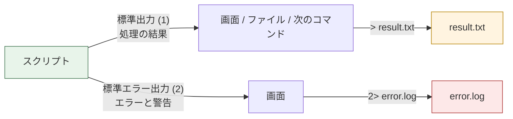

# Bash文法早見表

演習の途中で「あの書き方、どうだったっけ」となったときに開く1ページです。**ここで扱うのは文法だけ**です。`cp` や `grep` といったLinuxコマンドそのものの一覧は [../../docs/04-environment-setup.md](../../docs/04-environment-setup.md) の「4. 共通で使うLinux基礎コマンド早見表」にあります。役割が違うので、両方を使い分けてください。

各表の右端には **その文法が主に出てくる演習** を書いてあります。「この書き方はどこで使うのか」を一緒に覚えられるようにするためと、逆に「ex12で手が止まった」ときにここから必要な文法だけを引けるようにするためです。演習をまたいだ広い逆引きは [03-curriculum-map.md](03-curriculum-map.md) の「3. 技術要素からの逆引き」も併せて使ってください。

**この表は覚えるためのものではありません。** 現役のエンジニアも毎回調べます。調べる場所を1つに決めておくことのほうが、暗記よりずっと役に立ちます。

---

## 1. スクリプトの基本形

### 1.1 最小の骨格

新しいスクリプトを書き始めるとき、まずこの4行を書きます。

```bash
#!/bin/bash
set -u

echo "こんにちは"
exit 0
```

| 行 | 意味 |
|---|---|
| `#!/bin/bash` | シバン(shebang)。「このファイルは bash で実行する」という宣言。**必ず1行目の1文字目から**書く |
| `set -u` | 未定義の変数を参照したら、そこで止める。タイプミスを黙って見逃さないための保険 |
| `echo` | 処理の本体 |
| `exit 0` | 終了ステータス0(成功)で終わる。省略もできるが、意図して成功で終わらせていることを示すために書く |

### 1.2 実行のしかた

```bash
$ bash myscript.sh          # 最も確実。実行権限が無くても動く
$ ./myscript.sh             # 実行権限が要る。シバンの行が使われる
$ chmod +x myscript.sh      # 実行権限を付ける
$ source myscript.sh        # 別プロセスにせず、今のシェルの中で実行する(. myscript.sh も同じ)
```

`source` だけは意味が違います。**今開いているシェルそのものに読み込む**ため、スクリプトの中の変数がターミナルに残ります。演習の採点では `lib/harness.sh` をこの形で読み込んでいます。普段の実行は `bash myscript.sh` か `./myscript.sh` を使ってください。

### 1.3 終了ステータス

すべてのコマンドは、終わるときに 0〜255 の数値を返します。**0が成功、0以外が失敗**です。人間ではなく機械(cron、systemd、CI、呼び出し元のスクリプト)がこの数値だけを見て成否を判断します。

```bash
$ ls /etc > /dev/null
$ echo $?
```

```text
# 実行結果イメージ
0
```

```bash
$ ls /存在しないディレクトリ 2> /dev/null
$ echo $?
```

```text
# 実行結果イメージ
2
```

| 書き方 | 意味 | 主に出てくる演習 |
|---|---|---|
| `exit 0` | 成功して終わる | 全スクリプト演習 |
| `exit 1` | 失敗して終わる(汎用) | ex01, ex02, ex04, ex07, ex09 |
| `exit 2` `exit 3` `exit 4` | 失敗の理由ごとに番号を分ける | ex02 |
| `$?` | **直前の**コマンドの終了ステータス | ex01 以降すべて |

**`$?` は直前の1つしか覚えていません。** `echo` を1回挟んだだけで上書きされます。使うなら必ず即座に変数へ退避してください。

```bash
some_command
STATUS=$?          # ここで受け取る。この後で echo しても STATUS は変わらない
if [[ "$STATUS" -ne 0 ]]; then
    echo "失敗しました" >&2
fi
```

### 1.4 set のオプション

| 書き方 | 意味 | 使いどころ |
|---|---|---|
| `set -u` | 未定義の変数を参照したらエラーで止める | **基本的に常に付ける。** 本パックの解答例はすべてこれ |
| `set -e` | コマンドが1つでも失敗したら即座に止める | 「1つでも失敗したら全体を中止」でよい処理だけ |
| `set -x` | 実行した1行ずつを画面に表示する | デバッグ時。`bash -x script.sh` でも同じ |
| `set -o pipefail` | パイプの途中が失敗しても失敗として扱う | `set -e` と併用する |

**`set -e` は万能ではありません。** 「1行が失敗しても次の行へ進みたい」処理では、かえって邪魔になります。演習でいえば ex03 や ex06 のように「1人分の失敗で残り全員を止めたくない」場面です。そういうスクリプトでは `set -e` を付けず、`if` で自分でエラー処理を書きます。

```bash
# set -u だけを付け、エラー処理は自分で書く(ex03・ex06 の解答例の方針)
set -u
```

---

## 2. 変数とクォート

### 2.1 代入と参照

```bash
NAME="web01"                 # 代入。= の前後に空白を入れてはいけない
echo "$NAME"                 # 参照。$ を付ける
echo "${NAME}"               # 波かっこ付き。こちらを推奨
echo "${NAME}_backup"        # 変数名の境界がはっきりする
```

```text
# 実行結果イメージ
web01
web01
web01_backup
```

`${NAME}_backup` を `$NAME_backup` と書くと、bash は `NAME_backup` という**別の変数**を探しに行きます。`set -u` があればエラーで止まりますが、無ければ空文字として静かに動いてしまいます。**迷ったら `${ }` を付ける**と覚えてください。本パックの解答例はすべてこの形です。

### 2.2 クォートの違い

| 書き方 | 変数の展開 | コマンド置換 | 使いどころ | 主に出てくる演習 |
|---|---|---|---|---|
| `"..."` ダブルクォート | される | される | **基本はこれ。** 変数を含む文字列 | 全演習 |
| `'...'` シングルクォート | されない | されない | 記号をそのままの文字として扱いたいとき | ex04 (`date` の書式), ex11 (正規表現) |
| クォート無し | される | される | **原則として使わない** | — |

```bash
NAME="web 01"
echo "$NAME"       # → web 01     (1つの文字列として扱われる)
echo '$NAME'       # → $NAME      (変数として展開されない)
echo $NAME         # → web 01     (画面上は同じに見えるが、内部では2つの単語に割れている)
```

見た目が同じでも、**クォート無しは危険**です。次の例ではっきり差が出ます。

```bash
$ mkdir -p "/tmp/my dir"
$ DIR="/tmp/my dir"
$ ls "$DIR"        # → 正常に一覧が出る
$ ls $DIR          # → 「/tmp/my」と「dir」の2つを探しに行って失敗する
```

```text
# 実行結果イメージ (クォート無しのとき)
ls: '/tmp/my' にアクセスできません: そのようなファイルやディレクトリはありません
ls: 'dir' にアクセスできません: そのようなファイルやディレクトリはありません
```

**ファイル名やユーザーの入力に空白が混じるのは日常茶飯事です。** 変数を書いたら反射的にダブルクォートで囲む癖をつけてください。

### 2.3 シングルクォートを使う場面

`date` の書式や正規表現には `%` `$` `\` といった記号が出てきます。これらをそのままの文字として渡したいときはシングルクォートを使います。

```bash
NOW="$(date '+%Y-%m-%d %H:%M:%S')"      # ex04・ex07 の定番。書式はシングルクォート
grep -E 'ERROR|FATAL' app.log           # ex11。正規表現もシングルクォート
```

---

## 3. パラメータ展開の早見表

変数を参照するときに、ついでに加工できる仕組みです。`sed` や `cut` を呼び出さずに済むため、スクリプトが速く・短くなります。

| 書き方 | 意味 | 例 (`F="report.txt.bak"`) | 主に出てくる演習 |
|---|---|---|---|
| `${VAR:-既定値}` | VARが未定義または空なら既定値を使う(VAR自体は変えない) | `${1:-}` → 引数が無くてもエラーにしない | ex01, ex09, ex12, ex16 |
| `${VAR:=既定値}` | 未定義または空なら既定値を**代入**する | `${PORT:=80}` → PORT に 80 が入る | — |
| `${VAR%接尾}` | 末尾がパターンに一致すれば取り除く(最短一致) | `${F%.bak}` → `report.txt` | ex03, ex04, ex08 |
| `${VAR%%接尾}` | 同上(最長一致) | `${F%%.*}` → `report` | — |
| `${VAR#接頭}` | 先頭がパターンに一致すれば取り除く(最短一致) | `${F#report.}` → `txt.bak` | — (`%` と対で覚える) |
| `${VAR##接頭}` | 同上(最長一致)。パスからファイル名を取るのに使える | `${F##*.}` → `bak` | — |
| `${VAR/古/新}` | 最初の1か所だけ置換する | `${F/txt/csv}` → `report.csv.bak` | — |
| `${VAR//古/新}` | すべて置換する | `${F//./_}` → `report_txt_bak` | ex09 (JSONのエスケープ) |
| `${#VAR}` | 文字数を数える | `${#F}` → `14` | — |

実際に確かめてみます。

```bash
$ F="report.txt.bak"
$ echo "${F%.bak}" "${F##*.}" "${F//./_}" "${#F}"
```

```text
# 実行結果イメージ
report.txt bak report_txt_bak 14
```

### 演習でよく使う2つの型

**型1: 行末のCR(キャリッジリターン)を落とす — ex03**

WindowsのExcelで保存したCSVは、行末が `CR` + `LF` の2文字になっています。Linuxで読むと最後の項目に `CR` が1文字残り、**画面では見えないのに「空ではない」と判定されて**しまいます。

```bash
dept="${dept%$'\r'}"      # 末尾にCRがあれば取り除く。無ければ何も起きない
```

`$'\r'` は「CRという1文字」を表すbash独自の書き方です。ex03 の解答例では4つの変数すべてにこれを適用しています。

**型2: 末尾のスラッシュを揃える — ex04**

利用者が `-l /var/log` と書くか `-l /var/log/` と書くかは選べません。末尾のスラッシュを一度落としてから自分で付け直すと、`//` の二重スラッシュを防げます。

```bash
LOG_FILE="${LOG_DIR%/}/with_log_$(date '+%Y%m%d_%H%M%S').log"
```

---

## 4. コマンド置換と算術式

### 4.1 コマンド置換

コマンドの実行結果を文字列として取り出す書き方です。

```bash
HOST_NAME="$(hostname)"
NOW="$(date '+%Y-%m-%d %H:%M:%S')"
LINE_COUNT="$(wc -l < users.csv)"
```

| 書き方 | 評価 |
|---|---|
| `$(コマンド)` | **こちらを使う。** 入れ子にできる (`$(dirname "$(readlink -f "$0")")`) |
| `` `コマンド` `` (バッククォート) | 古い書き方。入れ子にしづらく、`\` の扱いも分かりにくい。**新しく書くコードでは使わない** |

`$( )` の結果は必ずダブルクォートで囲んでください。囲まないと、結果に空白が含まれたときに単語が割れます。

### 4.2 算術式

`$(( ))` の中では数値として計算されます。**中では変数に `$` を付けなくても構いません。**

```bash
COUNT=0
COUNT=$((COUNT + 1))              # カウンタを1増やす。ex03・ex04・ex12・ex16 の定番
ELAPSED=$((NOW_EPOCH - LAST_EPOCH))   # 経過秒を求める。ex12
```

```bash
$ A=7
$ B=2
$ echo "$((A + B)) $((A - B)) $((A * B)) $((A / B)) $((A % B))"
```

```text
# 実行結果イメージ
9 5 14 3 1
```

**bashの算術式は整数しか扱えません。** `7 / 2` は `3` になり、小数は切り捨てられます。ex17 で稼働率を小数第1位まで出すのに `awk` を使うのは、この制約が理由です。

---

## 5. 条件分岐

### 5.1 if / elif / else

```bash
if [[ "$#" -ne 1 ]]; then
    echo "エラー: 引数を1つ指定してください。" >&2
    exit 1
elif [[ ! -f "$1" ]]; then
    echo "エラー: ファイルが見つかりません: $1" >&2
    exit 2
else
    echo "OK: $1 は処理できます"
fi
```

書き方の約束は3つだけです。

- `if` と `[[` のあいだ、`[[` と条件のあいだには**半角スペースが必要**です。`if[[` や `[["$#"` は文法エラーになります
- 条件の行の末尾は `; then`。改行して `then` を書いても構いません
- 閉じるのは `fi`(if を逆から書いたもの)。`case` は `esac` です

### 5.2 [[ ]] のテスト演算子

**ファイルに関する判定**

| 演算子 | 真になる条件 | 主に出てくる演習 |
|---|---|---|
| `-e パス` | 存在する(種類は問わない) | ex08 |
| `-f パス` | **通常ファイル**として存在する | ex02, ex03, ex07, ex11, ex13, ex21 |
| `-d パス` | **ディレクトリ**として存在する | ex05, ex07, ex08, ex15 |
| `-r パス` | 読み取り権限がある | ex02 |
| `-w パス` | 書き込み権限がある | ex04 |
| `-x パス` | 実行権限がある | ex21 |
| `-s パス` | 存在し、かつサイズが0より大きい | ex02, ex12 |

```bash
if [[ -f "$CSV_FILE" && -r "$CSV_FILE" ]]; then
    echo "読み込めます"
fi
```

**文字列に関する判定**

| 演算子 | 真になる条件 | 主に出てくる演習 |
|---|---|---|
| `-z "$VAR"` | 空文字である(zero) | ex03, ex05, ex06, ex12, ex15 |
| `-n "$VAR"` | 空文字ではない(not empty) | ex03, ex09 |
| `"$A" = "$B"` | 等しい(`==` も同じ) | ex05, ex15, ex16 |
| `"$A" != "$B"` | 等しくない | ex16 |
| `"$A" =~ 正規表現` | 正規表現に一致する | ex06, ex08, ex12 |

`=~` の右側は**クォートしません**。クォートすると、ただの文字列として比較されてしまいます。

```bash
USERNAME="yamada_t"
if [[ "$USERNAME" =~ ^[a-z_][a-z0-9_-]*$ ]]; then
    echo "使えるユーザー名です"      # ex06 のユーザー名チェック
fi

GEN="3"
if [[ ! "$GEN" =~ ^[0-9]+$ ]]; then
    echo "エラー: 世代数には数値を指定してください" >&2   # ex08
    exit 1
fi
```

**数値に関する判定**

| 演算子 | 意味 | 読み方 |
|---|---|---|
| `-eq` | 等しい | equal |
| `-ne` | 等しくない | not equal |
| `-lt` | より小さい | less than |
| `-le` | 以下 | less than or equal |
| `-gt` | より大きい | greater than |
| `-ge` | 以上 | greater than or equal |

```bash
if [[ "$ERROR_COUNT" -gt 0 ]]; then
    exit 1                                   # ex04・ex11・ex15・ex21 の定番
fi
```

**文字列と数値で演算子が違う**点に注意してください。`[[ "$A" = "$B" ]]` は文字列の比較、`[[ "$A" -eq "$B" ]]` は数値の比較です。`"10"` と `"9"` を文字列として比べると `"10"` のほうが小さくなります(先頭の文字で比べるため)。

### 5.3 [[ ]] と [ ] の違い

| | `[[ 条件 ]]` | `[ 条件 ]` |
|---|---|---|
| 正体 | bashの構文 | `test` コマンドの別名 |
| 変数が空のとき | 壊れない | **引数が消えて文法エラーになる** |
| `&&` `\|\|` | そのまま書ける | `-a` `-o` を使う必要がある |
| `=~` (正規表現) | 使える | 使えない |
| 移植性 | bash / zsh など | どのシェルでも動く |

**本パックでは `[[ ]]` に統一しています。** 空の変数で壊れないことと、正規表現が使えることが理由です。

```bash
X=""
[[ "$X" = "1" ]] && echo "一致"     # 何も起きない(正常)
[ $X = 1 ] && echo "一致"           # bash: [: =: 単項演算子が予期されます
```

### 5.4 case による分岐

同じ変数を何通りにも振り分けるときは `if` を並べるより読みやすくなります。

```bash
case "$KIND" in
    ping)
        echo "pingで確認します"
        ;;
    http)
        echo "HTTPで確認します"
        ;;
    *)
        echo "[SKIP] 種別が不正です: ${KIND}"      # ex15 の不正種別の扱い
        ;;
esac
```

- 各分岐の終わりは `;;`
- `*)` は「どれにも当てはまらないとき」。**必ず最後に用意する**
- `ping|PING)` のように `|` で複数のパターンを並べられます

### 5.5 && と || による短い書き方

```bash
mkdir -p "$LOG_DIR" || { echo "エラー: ログディレクトリを作れません" >&2; exit 1; }
command -v shellcheck >/dev/null 2>&1 && shellcheck ./*.sh
```

`A && B` は「Aが成功したらBを実行」、`A || B` は「Aが失敗したらBを実行」です。**1行で済む短い処理だけ**に使い、分岐が2つ以上になるなら素直に `if` を書いてください。

---

## 6. 繰り返し

### 6.1 for

```bash
for HOST in web01 web02 db01; do
    echo "確認中: ${HOST}"
done

for FILE in "$TARGET_DIR"/*.tmp; do        # グロブ。ex05 の削除対象の探し方
    [[ -f "$FILE" ]] || continue           # 1件も無いときはパターンがそのまま入るので弾く
    echo "削除しました: $(basename "$FILE")"
done

for i in {1..3}; do                        # 回数で回す。{1..3} は 1 2 3 に展開される
    echo "${i} 回目"
done
```

グロブ(`*.tmp` のようなワイルドカード)が**1件も一致しないとき、bashは既定でパターン文字列そのものを返します**。存在しないファイル名がそのままループに入ってくるため、`[[ -f "$FILE" ]] || continue` の1行で弾きます(ex05 の解答例と同じ形です)。存在するかどうかだけを見たいときは `-f` の代わりに `-e` でも構いません。

### 6.2 while read — ファイルを1行ずつ読む

**演習パックで最も重要な型です。** ex03・ex06・ex13・ex15・ex17 のすべてがこの形を使います。

```bash
while IFS=',' read -r fullname username dept password || [[ -n "$fullname" ]]; do
    fullname="${fullname%$'\r'}"                    # CRLF対策
    [[ -z "$username" ]] && continue                # 不完全な行は飛ばす
    echo "${fullname} / ${username} / ${dept}"
done < <(tail -n +2 "$CSV_FILE")
```

1つずつ意味を分解します。

| 部分 | 意味 |
|---|---|
| `IFS=','` | **この read の間だけ**区切り文字をカンマにする。スクリプトの他の場所には影響しない |
| `read -r` | `\` をエスケープ文字として特別扱いしない。**read には常に `-r` を付ける**と覚えてよい |
| `fullname username dept password` | 区切った値を順に入れる変数。最後の変数には残り全部が入る |
| `\|\| [[ -n "$fullname" ]]` | 最終行に改行が無いファイルでも最後の1行を落とさないための保険 |
| `< <(コマンド)` | プロセス置換。コマンドの出力をファイルのようにループへ流し込む |

### 6.3 パイプではなくプロセス置換を使う理由

これは初心者が必ず1度は踏む落とし穴です。

```bash
# 間違い: パイプで while に渡す
COUNT=0
cat users.csv | while read -r line; do
    COUNT=$((COUNT + 1))
done
echo "合計: ${COUNT}件"      # → 合計: 0件 になってしまう
```

```bash
# 正しい: プロセス置換で渡す
COUNT=0
while read -r line; do
    COUNT=$((COUNT + 1))
done < <(cat users.csv)
echo "合計: ${COUNT}件"      # → 合計: 3件 と正しく出る
```

パイプの右側は**サブシェル(別プロセス)**として動くため、ループの中で数えた変数はループを抜けた瞬間に消えます。ex03 のテストで「合計: 3件 (スキップ: 1件)」を検証しているのは、この間違いを確実に見つけるためです。

**`< <(` の `<` と `<(` のあいだには半角スペースが必要**です。詰めて書くと文法エラーになります。ファイルをそのまま読むだけなら `done < "$FILE"` と書けます。

### 6.4 while / until / continue / break

```bash
COUNT=0
while [[ "$COUNT" -lt 3 ]]; do          # 条件が真のあいだ繰り返す
    COUNT=$((COUNT + 1))
    [[ "$COUNT" -eq 2 ]] && continue    # この回だけ飛ばして次へ
    echo "$COUNT"
done
```

```text
# 実行結果イメージ
1
3
```

| 書き方 | 意味 |
|---|---|
| `while 条件` | 条件が**真のあいだ**繰り返す |
| `until 条件` | 条件が**偽のあいだ**繰り返す(真になったら抜ける) |
| `continue` | この回の残りを飛ばして次の繰り返しへ |
| `break` | ループそのものを抜ける |

**`continue` と `break` を取り違えると、1行の不備で全体が止まります。** ex03 や ex06 のように「1件の失敗で残り全部を巻き込みたくない」処理では `continue` を使います。

---

## 7. 関数

### 7.1 定義と呼び出し

```bash
usage() {
    echo "使い方: $(basename "$0") <サーバー名>"
}

usage            # 呼び出し。かっこは付けない
usage >&2        # 出力先を変えて呼ぶこともできる
```

**関数は使う前に定義**しておく必要があります。スクリプトの上のほうにまとめて書いてください。

### 7.2 引数と local

関数の引数もスクリプトと同じく `$1` `$2` … で受け取ります。

```bash
log() {
    local level="$1"        # 関数の中だけで使う変数にする
    shift                   # $1 を捨てて、$2 以降を1つずつ前へ詰める
    local message="$*"      # 残り全部を1つの文字列にする
    local now
    now="$(date '+%Y-%m-%d %H:%M:%S')"

    echo "[${now}] [${level}] ${message}" | tee -a "$LOG_FILE"
}

log "INFO" "処理を開始します"
```

```text
# 実行結果イメージ
[2026-09-06 10:30:00] [INFO] 処理を開始します
```

| 書き方 | 意味 |
|---|---|
| `local 変数名` | **その関数の中だけ**で使う変数にする。付け忘れるとスクリプト全体の変数を書き換えてしまう |
| `shift` | 引数を1つずらす。`$1` を用途別に使ったあと、残りをまとめて扱うときの定番 |
| `local now` と代入を分ける | `local now="$(cmd)"` と1行で書くと、cmd の終了ステータスが `local` のものに上書きされて拾えなくなる |

### 7.3 return と exit の違い

| | `return` | `exit` |
|---|---|---|
| 抜ける範囲 | **関数だけ** | **スクリプト全体** |
| 使いどころ | 関数の成否を呼び出し元に返す | スクリプトを終わらせる |

```bash
check_file() {
    [[ -f "$1" ]] || return 1      # 関数だけを抜ける
    return 0
}

if check_file "users.csv"; then
    echo "見つかりました"
else
    echo "ありません" >&2
    exit 1                          # ここでスクリプトが終わる
fi
```

`usage()` の中に `exit 1` を書いてしまうと、ヘルプ表示のときにも失敗扱いで終わってしまいます。**終了の判断は関数の外で行う**のが安全です(ex01・ex05 の解答例はこの形です)。

---

## 8. 引数の処理

### 8.1 位置引数

`./backup.sh /data /backup` と実行したときの中身です。

| 変数 | 中身 | 備考 |
|---|---|---|
| `$0` | `./backup.sh` | スクリプト自身のパス。`$(basename "$0")` でファイル名だけ取れる |
| `$1` `$2` … | `/data` `/backup` | 1個目、2個目の引数 |
| `$#` | `2` | 引数の**個数** |
| `$@` | `/data` `/backup` | 全部。**`"$@"` と囲むと1個ずつ別々の引数として展開される** |
| `$*` | `/data /backup` | 全部。`"$*"` と囲むと**つないだ1つの文字列**になる |

```bash
if [[ "$#" -ne 2 ]]; then
    echo "エラー: 引数を2つ指定してください。" >&2
    exit 1
fi
SRC_DIR="$1"
DEST_DIR="$2"
```

**`"$@"` と `"$*"` の使い分け**: 引数をそのまま別のコマンドへ渡すときは `"$@"`、ログのメッセージのように1つの文にまとめたいときは `"$*"` です(ex04 の `log` 関数は `"$*"` を使っています)。

`set -u` を付けていると、引数なしで `$1` を参照した瞬間にエラーになります。個数チェックより前に `$1` を見たいときは `${1:-}` の形にしてください。

```bash
case "${1:-}" in                # 引数が無くてもエラーにならない
    -h|--help) usage; exit 0 ;;
esac
```

### 8.2 getopts

`-d /var/log -n` のようなオプションを解析する組み込み機能です。ex05・ex06・ex08・ex11・ex15 で使います。

```bash
TARGET_DIR="./tmp"       # 既定値を先に入れておく
EXT="tmp"
DRY_RUN="false"

while getopts "d:e:nh" opt; do
    case "$opt" in
        d)  TARGET_DIR="$OPTARG" ;;
        e)  EXT="$OPTARG" ;;
        n)  DRY_RUN="true" ;;
        h)  usage; exit 0 ;;
        \?) usage >&2; exit 1 ;;
    esac
done
shift $((OPTIND - 1))
```

| 部分 | 意味 |
|---|---|
| `"d:e:nh"` | 扱うオプションの一覧。**`:` は「そのオプションは値を取る」という印** |
| `$OPTARG` | 値を取るオプションに渡された値が入る |
| `\?` | 定義していないオプションが来たとき。`\` でエスケープが必要 |
| `shift $((OPTIND - 1))` | 処理したオプションの分だけ引数をずらし、残りを `$1` から使えるようにする |

**既定値は getopts の前に代入しておく**のが型です。こうすると case の中は「指定されたときだけ上書きする」だけで済みます。

### 8.3 長いオプションを受け付ける

bash組み込みの `getopts` は仕様上 `-n` のような1文字オプションしか扱えません。`--dry-run` も受け付けたいときは、**getopts に渡す前に短い形へ置き換えます**(ex05・ex06・ex08 で使う型です)。

```bash
args=()
for arg in "$@"; do
    case "$arg" in
        --dry-run) args+=("-n") ;;
        --help)    args+=("-h") ;;
        *)         args+=("$arg") ;;
    esac
done
set -- "${args[@]}"        # 位置引数($1, $2, ...)を丸ごと置き換える
```

| 部分 | 意味 |
|---|---|
| `args=()` | 空の配列(値を順番に入れておける箱) |
| `args+=("$arg")` | 配列の末尾に追加する |
| `"${args[@]}"` | 配列の全要素を、1つずつ別々の値として展開する |
| `set -- ...` | 位置引数そのものを置き換える |

---

## 9. 入出力とリダイレクト

### 9.1 標準出力と標準エラー出力

どのコマンドにも「結果の出口」が2つあります。**画面では混ざって見えますが、別々の管です。**



分けておく理由は単純です。**結果だけをファイルに保存したいとき、エラーは画面に残ってほしい**からです。

```bash
$ ./check_input.sh users.csv > result.txt
```

```text
# 実行結果イメージ (画面にはエラーだけが残る)
エラー: ファイルが見つかりません: users.csv
```

### 9.2 リダイレクトの早見表

| 書き方 | 意味 | 主に出てくる演習 |
|---|---|---|
| `> file` | 標準出力をファイルへ。**既存の内容は消える** | ex12, ex13, ex16 (状態ファイルの書き込み) |
| `>> file` | 標準出力をファイルへ**追記**する | ex10 (cronのログ) |
| `2> file` | 標準エラー出力をファイルへ | — |
| `2>&1` | 標準エラー出力を標準出力と同じ行き先へ**合流**させる | ex10, ex21 |
| `>&2` | その出力を標準エラー出力へ回す | ex01, ex02, ex03, ex07, ex09, ex13, ex15 |
| `> /dev/null` | 出力を捨てる。`/dev/null` は「捨て場」を表す特別なファイル | ex10, ex15, ex21 |
| `> /dev/null 2>&1` | 標準出力も標準エラー出力もまとめて捨てる | ex10, ex21 |
| `< file` | ファイルを標準入力として読み込ませる | ex02, ex13 (`wc -l < file`) |

```bash
echo "エラー: ファイルが見つかりません: ${FILE}" >&2       # エラーは必ず >&2 で出す
/opt/scripts/backup.sh >> /var/log/backup.log 2>&1        # cronの定番 (ex10)
command -v shellcheck > /dev/null 2>&1                     # 存在確認。出力は要らない (ex21)
```

**`2>&1` の位置に注意してください。** リダイレクトは左から順に解釈されます。

```bash
cmd > file 2>&1      # 正しい: 標準出力をfileへ回し、そのあと標準エラーも同じ行き先へ
cmd 2>&1 > file      # 間違い: 標準エラーは画面のまま。標準出力だけがfileへ行く
```

### 9.3 wc -l のリダイレクト形

```bash
$ printf 'a\nb\nc\n' > lines.txt
$ wc -l lines.txt
```

```text
# 実行結果イメージ
3 lines.txt
```

```bash
$ wc -l < lines.txt
```

```text
# 実行結果イメージ
3
```

`wc -l file` は**ファイル名まで一緒に出力します**。行数だけを変数に入れたいときは `< file` の形にしてください(ex02・ex13 の必須テクニックです)。

### 9.4 パイプと tee

```bash
grep -E 'ERROR|FATAL' app.log | wc -l      # 左の出力を右の入力へ渡す
echo "[INFO] 開始" | tee -a run.log        # 画面とファイルの両方へ同時に出す (ex04)
```

`tee` は水道の「T字管」が由来です。`-a` を付けると**追記**、付けないと毎回上書きになります。ログを書くときは必ず `-a` を付けてください。

### 9.5 ヒアドキュメント

複数行の文字列をそのまま書き出す仕組みです。使い方の表示やレポートの生成に使います。

```bash
cat <<'EOF'
使い方: backup.sh <対象ディレクトリ> <保存先ディレクトリ>
  指定したディレクトリを tar.gz で固めて保存します。
EOF
```

**クォートの有無で意味が変わります。ここを間違えると事故になります。**

| 書き方 | `$VAR` や `$(cmd)` | 使いどころ |
|---|---|---|
| `<<'EOF'` (シングルクォート付き) | **展開されない**。書いたままの文字が出る | 使い方の表示、テストデータ、`$` を含む説明文 |
| `<<EOF` (クォート無し) | **展開される** | 変数の値を埋め込んだレポートを作るとき |

```bash
$ NAME="web01"
$ cat <<'EOF'
ホスト: $NAME
EOF
```

```text
# 実行結果イメージ
ホスト: $NAME
```

```bash
$ cat <<EOF
ホスト: $NAME
EOF
```

```text
# 実行結果イメージ
ホスト: web01
```

`cat > file <<EOF` は新規作成(上書き)、`cat >> file <<EOF` は追記です。**終端の `EOF` は行頭から書いてください**(インデントすると終端と認識されません)。

---

## 10. よく使う小技

文法そのものではありませんが、演習の解答例と案件のスクリプトに繰り返し登場する定型です。

| 書き方 | 何をするか | 主に出てくる演習 |
|---|---|---|
| `command -v cmd >/dev/null 2>&1` | そのコマンドが使えるか調べる。使えれば成功(0)を返す | ex21 |
| `trap 'cleanup' EXIT` | スクリプトが終わるときに必ず実行する処理を予約する | 採点の `lib/harness.sh` |
| `trap 'log "停止します"; exit 0' TERM INT` | 停止シグナルやCtrl+Cを受けたときの後始末 | 案件No.3 の常駐スクリプト |
| `mktemp -d` | 他と衝突しない一時ディレクトリを作る | 採点の `lib/harness.sh` |
| `date '+%Y-%m-%d %H:%M:%S'` | ログ用のタイムスタンプ | ex04 |
| `date '+%Y%m%d_%H%M%S'` | ファイル名用のタイムスタンプ(記号を含めない) | ex04, ex07 |
| `date +%s` | 1970年からの経過秒(epoch秒)。差を取れば経過時間が出る | ex12 |
| `basename "$0"` | パスからファイル名だけを取り出す | ex01, ex05 |
| `dirname "$FILE"` | パスからディレクトリ部分だけを取り出す | ex07 |
| `mkdir -p "$DIR"` | 無ければ作る。既にあってもエラーにならない(べき等) | ex04, ex07, ex16 |

```bash
# コマンドの存在確認。無ければ「失敗」ではなく「スキップ」にする (ex21)
if command -v shellcheck >/dev/null 2>&1; then
    shellcheck scripts/*.sh
else
    echo "[SKIP] shellcheck が未インストールのため省略します"
fi
```

```bash
# 一時ディレクトリを作り、終了時に必ず消す予約をする
WORKDIR="$(mktemp -d)"
trap 'rm -rf "$WORKDIR"' EXIT
```

`trap ... EXIT` は、途中でエラーになっても Ctrl+C で止めても実行されます。**一時ファイルを作ったら、その場で消す予約をする**と覚えてください。

---

## 11. やってはいけない書き方

事故と時間の損失に直結する8つです。**間違い例のほうが短く見えるものばかり**なので、意識して避ける必要があります。

| やってはいけない書き方 | 何が起きるか | こう書く |
|---|---|---|
| `rm -rf $DIR/` | `$DIR` が空だと `rm -rf /` になる。**取り返しがつかない** | `[[ -n "$DIR" && -d "$DIR" ]] \|\| exit 1` で確認し、`rm -rf "$DIR"` と囲む。削除処理にはドライランを付ける (ex05, ex08) |
| `cp $SRC $DEST` | 値に空白があると引数が割れて別のファイルを触る | `cp "$SRC" "$DEST"` と必ずダブルクォートで囲む |
| `for f in $(ls)` | ファイル名の空白で分割される。改行を含む名前でも壊れる | `for f in ./*; do` とグロブを使う (ex05)。更新日時の順に並べたいときは `find` と `sort` を組み合わせる (ex08) |
| `[ $x = 1 ]` | `$x` が空だと引数が消えて文法エラーになる | `[[ "$x" = "1" ]]` を使う |
| `cat file \| while read line; do COUNT=$((COUNT+1)); done` | パイプの右側がサブシェルになり、**カウンタがループを抜けると消える** | `done < <(cat file)` とプロセス置換にする (ex03) |
| `` VER=`cmd` `` | バッククォートは入れ子にできず読みにくい | `VER="$(cmd)"` を使う |
| `cmd; echo "実行しました"; if [[ $? -ne 0 ]]` | `$?` は直前の `echo` のものに上書きされている | `cmd; STATUS=$?` と即座に退避する |
| `VAR = "値"` | `=` の前後に空白があると、`VAR` というコマンドを実行しようとする | `VAR="値"` と詰めて書く |

**削除を伴うスクリプトの原則**を、もう一度書いておきます。

```bash
# 消す前に必ず3つ確認する
[[ -n "$TARGET_DIR" ]] || { echo "エラー: 対象が空です" >&2; exit 1; }   # 1. 空でないか
[[ -d "$TARGET_DIR" ]] || { echo "エラー: ディレクトリがありません" >&2; exit 1; }  # 2. 存在するか
if [[ "$DRY_RUN" = "true" ]]; then                                       # 3. まず見せる
    echo "[dry-run] 削除します: ${FILE}"
else
    rm -f "$FILE"
fi
```

ex05・ex08 でこの型を練習し、案件No.2 の世代管理でそのまま使います。

---

## 12. 1ページ要約: 迷ったらこの5箇条

文法を全部覚える必要はありません。**次の5つを守るだけで、初心者がやりがちな大事故はほぼ防げます。**

| # | 守ること | 理由 |
|---|---|---|
| 1 | **変数は必ず `"${VAR}"` と書く** | 空白入りの値でも壊れない。空文字でも文法エラーにならない |
| 2 | **先頭に `set -u` を書く** | 変数名のタイプミスを、静かなバグではなく即座のエラーにできる |
| 3 | **判定は `[[ ]]`。数値は `-eq`、文字列は `=`** | `[ ]` は空の変数で壊れる。演算子の取り違えは気づきにくい |
| 4 | **ループへの入力はパイプではなく `< <( )`** | パイプの右側はサブシェル。数えた件数が消える |
| 5 | **消す・上書きする処理は、存在チェックとドライランを付けてから書く** | 事故は「動かないこと」ではなく「意図せず動いてしまうこと」で起きる |

書き終えたら、実行する前に2つのコマンドを通してください。

```bash
$ bash -n myscript.sh                              # 文法チェック(実行はしない)
$ shellcheck --severity=warning myscript.sh        # 静的解析ツール。危ない書き方を指摘してくれる
```

`shellcheck` は、上の5箇条の違反をほぼすべて自動で見つけてくれます。入っていなければ入れてください。

```bash
$ sudo apt install -y shellcheck
```

---

## 13. 関連ドキュメント

| ドキュメント | 内容 |
|---|---|
| [../README.md](../README.md) | 演習パックの入口 (演習一覧・進め方・修了チェック) |
| [01-design.md](01-design.md) | 演習パック設計書 (なぜこの並びなのか) |
| [02-getting-started.md](02-getting-started.md) | はじめかた (環境準備から最初の1問を解ききるまで) |
| [03-curriculum-map.md](03-curriculum-map.md) | カリキュラムマップ (技術要素からの逆引き・依存関係図) |
| [04-self-check-guide.md](04-self-check-guide.md) | 自動採点の仕組み (一時ディレクトリ・ダミーコマンド・判定関数) |
| [05-progress-sheet.md](05-progress-sheet.md) | 学習記録シート (詰まった点を面接エピソードに変える) |
| [06-hints-and-pitfalls.md](06-hints-and-pitfalls.md) | 全演習共通のつまずき集 (エラーメッセージからの逆引き) |
| [../../docs/03-glossary.md](../../docs/03-glossary.md) | 初心者向け用語集 |
| [../../docs/04-environment-setup.md](../../docs/04-environment-setup.md) | 検証環境構築ガイド。**Linux基礎コマンドの早見表はこちら** |

文法を確認したら、実際の使われ方は解答例で読むのが一番の近道です。

```bash
$ cd /home/user/automation/exercises
$ grep -l 'while IFS' ex*/answer/*.sh
```

```text
# 実行結果イメージ
ex03-csv-loop/answer/parse_users.sh
ex06-mini-useradd/answer/mini_create_users.sh
...
```

`grep -l` は「一致した行」ではなく「一致したファイル名」を表示するオプションです。

**解答例は検索できる文法辞典でもあります。**
