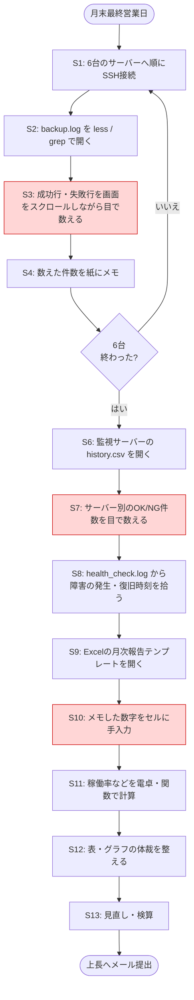
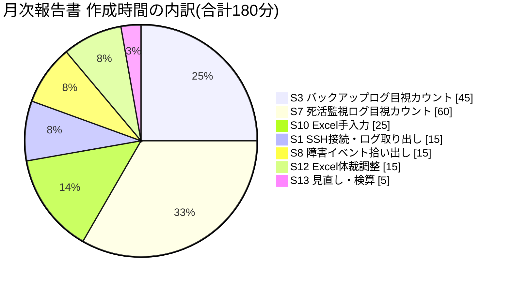
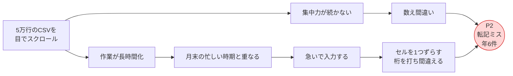

# 現状分析書(As-Is) — 月次運用報告書の作成作業

改善案件No.1 / 株式会社サンプル商事(架空の依頼元)

---

## 0. このドキュメントの位置づけと、数値の出どころ

改善案件では、**直す前に「今どうなっているか」を数字で押さえる** ことが最初の仕事になる。ここを飛ばして手を動かすと、「直したつもりだが本当に良くなったのか説明できない」という状態に陥る。

> **正直な但し書き(必ず読むこと)**
> 本案件は **学習用に自分で組み立てた架空の設定** である。実在企業の実務案件ではない。
> 本書に出てくる数値は、次の3種類に分かれる。どれなのかは各表に必ず明記している。
>
> | 種別 | 意味 |
> |---|---|
> | **[前提]** | 架空シナリオの「改善前の状態」として自分で設定した値。実測ではない |
> | **[試算]** | 前提値をもとに、内訳や年換算を計算した値 |
> | **[実測]** | 検証環境(仮想マシン1台)で実際に測った値 |

---

## 1. 現行の作業手順(1ステップずつの可視化)

### 1-1. 全体の流れ



赤くした3ステップ(S3・S7・S10)が、**時間もミスも集中している箇所**である。

### 1-2. 各ステップの中身

| # | 作業 | 具体的にやっていること | 使っているもの |
|---|---|---|---|
| S1 | SSH接続 | 6台に順番にログイン。IPと鍵の指定を毎回入力 | `ssh` |
| S2 | ログを開く | `less /var/log/backup-automation/backup.log` | `less` |
| S3 | 目視カウント | 「バックアップ作成に成功しました」の行を、画面をスクロールしながら数える | 目・指 |
| S4 | メモ | 数えた件数を紙のノートに書き留める | 紙とペン |
| S6 | 監視ログを開く | 監視サーバー上の `history.csv` を開く | `less` |
| S7 | 目視カウント | サーバー名ごとに `OK` / `NG` の件数を数える | 目・指 |
| S8 | 障害の抽出 | `health_check.log` を追い、障害検知と復旧の時刻を拾う | `grep` |
| S9〜S12 | Excel入力 | テンプレートを開き、メモの数字を入力、関数で稼働率を計算、体裁を整える | Excel |
| S13 | 見直し | 数字がおかしくないかを目でチェック | 目 |

---

## 2. 作業時間の内訳

### 2-1. 内訳表

**[前提]** 月次報告書の作成には毎月 **約3時間(180分)** かかっている。
**[試算]** その180分を、上の手順に沿って分解すると次のようになる。

| # | 作業 | 所要時間 | 全体比 | 種別 |
|---|---|---:|---:|---|
| S1 | 6台へのSSH接続とログの取り出し | 15分 | 8.3% | [試算] |
| S3 | **バックアップログの目視カウント(6台)** | **45分** | **25.0%** | [試算] |
| S7 | **死活監視ログの目視カウント(6台)** | **60分** | **33.3%** | [試算] |
| S8 | 障害イベントの時刻の拾い出し | 15分 | 8.3% | [試算] |
| S10 | 数字のExcelへの手入力 | 25分 | 13.9% | [試算] |
| S12 | Excelの体裁調整(表・グラフ) | 15分 | 8.3% | [試算] |
| S13 | 見直し・検算 | 5分 | 2.8% | [試算] |
| | **合計** | **180分** | **100%** | [前提] |

### 2-2. どこに時間が集中しているか



**分析結果:**

- **「ログを目で数える」作業(S3 + S7)だけで 105分。全体の 58.3%** を占める
- ここに「数えた結果をExcelへ手入力する」(S10 = 25分)を足すと **130分・全体の72.2%**
- 一方、**人間にしかできない仕事**(S13 の妥当性チェックや、報告書に書く所感)は 5分程度しかない

> **改善の方向性がここで決まる**
> 時間の7割強を占めているのは「数える」と「写す」——どちらも **機械が最も得意で、人間が最も苦手な作業** である。Excelの体裁調整(15分)を効率化しても効果は8%止まり。**最初に自動化すべきはS3・S7・S10**、という結論になる。

---

## 3. なぜ「目で数える」のに時間がかかるのか(対象データ量の実測)

「6台分のログを見る」と一言で言うが、実際の量はどれくらいか。**[実測]** 検証環境で1か月分のログを生成して行数を数えた。

```bash
# 各サーバーのバックアップログの行数を数える
$ cd /var/log/ops-report/collected
$ for s in web01 web02 api01 db01 app01 file01; do
    printf "%-8s %5d 行\n" "$s" "$(wc -l < $s/backup.log)"
  done
```

実行結果:

```text
web01      217 行
web02      217 行
api01      217 行
db01       209 行
app01      217 行
file01     223 行
```

```bash
# 死活監視の履歴CSVの行数(ヘッダー1行を除く)
$ echo $(( $(wc -l < /var/log/server-health-check/history.csv) - 1 ))
53568
```

| データ | 1か月あたりの行数 | 種別 |
|---|---:|---|
| バックアップログ(6台合計) | 1,300行 | [実測] |
| 死活監視 履歴CSV(`history.csv`) | 53,568行 | [実測] |
| 死活監視 実行ログ(`health_check.log`) | 約80,000行 | [試算] ※288回/日 × 31日 × 9行 |
| **人間が目を通す対象の合計** | **約13万行** | [試算] |

> **なぜ死活監視だけ桁が違うのか**
> 案件No.4の死活監視は **5分間隔** で動く。1日あたり 24時間 × 60分 ÷ 5分 = **288回**。これが6台分・31日分あるので `288 × 6 × 31 = 53,568` 行になる。
> つまり「稼働率を出す」ためだけに、担当者は5万行のCSVをスクロールして `OK` と `NG` を数えていることになる。**そもそも人間がやる作業ではない。**

---

## 4. 発生している問題の洗い出しと、その影響

### 4-1. 問題の一覧

| ID | 問題 | 直接の影響 | ビジネスへの影響 |
|---|---|---|---|
| **P1** | 集計に毎月3時間かかる | 担当者の時間が奪われる | **[試算]** 年36時間。本来やるべきセキュリティ更新や改善提案に手が回らない |
| **P2** | 目視カウント+手入力で転記ミスが起きる | **[前提]** 年6件の転記ミス | 誤った数字で経営判断される恐れ。修正版の再送で信頼を損なう |
| **P3** | 担当者1名しか作れない(属人化) | 休むと報告書が出ない | 報告の遅延。担当者が休みを取りにくい |
| **P4** | Excelファイルが月ごとにバラバラ | 前月との比較が手作業 | 「稼働率が悪化傾向にある」といった **傾向の変化に気づけない** |
| **P5** | 集計の定義が担当者の頭の中にある | 「稼働率」の計算方法が文書化されていない | 別の人が作ると違う数字が出る。監査で説明できない |
| **P6** | 集計中にログが更新される可能性 | 数え始めと終わりで母数がずれる | 数字の再現性がない(同じ月を2回集計しても一致しない) |

### 4-2. 問題の連鎖(なぜP2が起きるのか)



**転記ミスは担当者の注意力の問題ではなく、「人間に5万行を数えさせる作業設計」の問題である。** 注意喚起やダブルチェックでは根治しない(そしてダブルチェックを入れれば作業時間はさらに増える)。

---

## 5. 現状をどう数値で把握したか(測定方法)

改善案件では **「その数字はどうやって出したのか」を必ず説明できる**ようにしておく。面接でもここを聞かれる。

### 5-1. 測定した項目と方法

| 項目 | 値 | どうやって出したか | 種別 |
|---|---|---|---|
| 月次報告書の作成時間 | 180分/月 | 架空シナリオの前提として設定 | [前提] |
| 作業時間の内訳 | 表2-1のとおり | 手順を13ステップに分解し、各ステップの所要を配分して合計が180分になるようにした | [試算] |
| 転記ミスの件数 | 年6件 | 架空シナリオの前提として設定 | [前提] |
| バックアップログの行数 | 1,300行/月 | `wc -l` で実際に数えた | [実測] |
| 死活監視CSVの行数 | 53,568行/月 | `wc -l` で実際に数えた | [実測] |
| 年間作業時間 | 36時間 | 180分 × 12か月 ÷ 60 | [試算] |

### 5-2. 実務で現状を測るならこうする(手順の型)

この案件は架空だが、**実務で同じ分析をするときの手順** は次のとおり。改善案件の進め方として覚えておく価値がある。

1. **手順を分解して書き出す**(本書の1-2)
   - いきなり「3時間かかっています」ではなく、何を何回やっているかまで割る
2. **1サイクルだけ実測する**
   - ストップウォッチで1か月分を1回だけ計測する。「体感」ではなく秒で記録する
3. **3か月分の記録を取る**
   - 1回だけだとその月がたまたま忙しかった可能性がある。最低3回の平均を取る
4. **ミスは「発生記録」から数える**
   - 「たぶん多い」ではなく、修正版を再送したメールの件数など、**残っている証拠から数える**
5. **対象データ量を機械で数える**
   - `wc -l` や `du -sh` で客観的な量を押さえる。人の感覚に依存しない指標になる

> **ポイント**
> 改善前の数値を残していないと、**改善後にどれだけ良くなったかを証明できない**。「まず測る」は改善の第一手順であり、後回しにすると取り返しがつかない。

---

## 6. 現状分析のまとめ

| 観点 | 結論 |
|---|---|
| 一番時間を食っている作業 | ログの目視カウント(105分・全体の58.3%) |
| 一番リスクが高い作業 | 目視カウント → Excelへの手入力(転記ミスの発生源) |
| 人間にしかできない作業 | 数字を見て「妥当か」を判断すること、所感を書くこと(5分程度) |
| 自動化の余地 | **作業時間の約97%**(180分中175分)が機械で置き換え可能 |
| 最初に手を付けるべきところ | S3・S7(集計)と S10(転記)。Excelの体裁調整ではない |

**次のステップ:** この分析をもとに、改善案を複数挙げて比較する → [02-improvement-proposal.md](./02-improvement-proposal.md)

---

## 関連ドキュメント

- [README.md](./README.md) — 案件概要
- [02-improvement-proposal.md](./02-improvement-proposal.md) — 改善提案書
- [05-effect-measurement.md](./05-effect-measurement.md) — 効果測定レポート(本書のBefore値と対比する)
- [projects/02-backup-automation](../../projects/02-backup-automation/README.md) — 入力となる `backup.log` の出力元
- [projects/04-server-health-check](../../projects/04-server-health-check/README.md) — 入力となる `history.csv` の出力元
