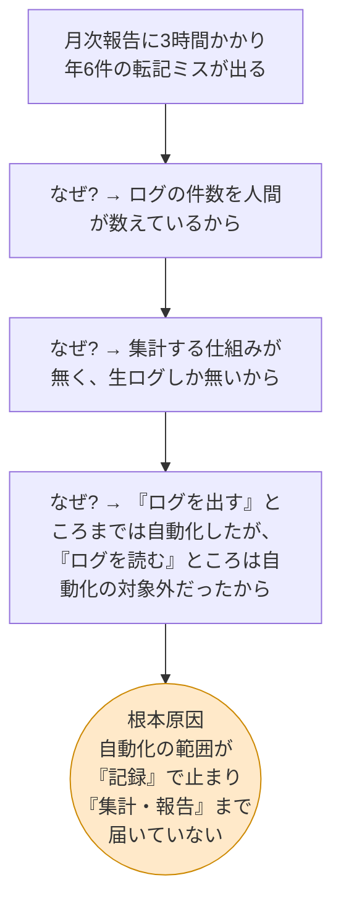
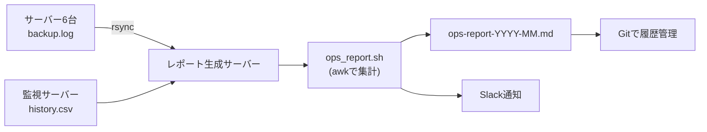

# 改善提案書 — 月次運用報告書の自動集計・自動生成

改善案件No.1 / 株式会社サンプル商事(架空の依頼元)

> **正直な但し書き**
> 本案件は **学習用に自分で組み立てた架空の設定** である。実在企業への提案書ではない。
> 数値の種別([前提] / [試算] / [実測])は [01-current-analysis.md](./01-current-analysis.md) の定義に従う。

---

## 1. 課題の構造化(なぜ起きているのかの深掘り)

### 1-1. 表面の問題と、その根っこ

現状分析で挙がった問題を「なぜ?」で3回掘り下げる。**表面の問題に対策を打っても再発する**ため、根本原因まで下りてから対策を決める。

### 1-2. 根本原因の言い換え

| 層 | 状態 | 自動化の有無 |
|---|---|---|
| **① 実行** バックアップを取る / 死活を監視する | 案件No.2・No.4 で自動化済み | ✅ 済 |
| **② 記録** 結果をログに残す | 案件No.2・No.4 で自動化済み | ✅ 済 |
| **③ 集計** ログから件数・率を求める | **人間が目で数えている** | ❌ 未 |
| **④ 報告** 集計結果を報告書の形にする | **人間がExcelに手入力している** | ❌ 未 |

**構造上の問題:** ①②を自動化したことで、③④に流れ込むデータ量が **月13万行** まで増えた([01-current-analysis.md](./01-current-analysis.md) 3章の実測)。
つまり **前工程を自動化したことが、後工程の人手作業を重くしている**。①②を戻すわけにはいかないので、③④を自動化するしかない。

### 1-3. 課題の整理(何を解けば何が解決するか)

| 解くべき課題 | 解けると消える問題 |
|---|---|
| **C1. ログの集計を機械にやらせる** | P1(3時間)、P2(転記ミス)、P6(再現性がない) |
| **C2. 報告書の生成を機械にやらせる** | P1、P2、P3(属人化) |
| **C3. 集計の定義をコードとして残す** | P5(定義が頭の中にある)、P3 |
| **C4. 出力を差分の見える形式にする** | P4(月次比較ができない) |

> P1〜P6 の番号は [01-current-analysis.md](./01-current-analysis.md) 4-1 の問題一覧に対応。

---

## 2. 改善案の洗い出し

C1〜C4 を解く手段として、方向性の異なる3案を挙げる。

### 案A: Excelマクロ(VBA)化

現行のExcelテンプレートにマクロを仕込み、ログファイルを読み込んで集計させる。

- **やること**: ログをPCにダウンロード → Excelのマクロボタンを押す → 集計済みシートが出来る
- **前提**: ログを毎月PCへ手動で持ってくる必要がある

### 案B: 統合監視ツール(Zabbix等)の導入

Zabbix / Prometheus + Grafana のような監視基盤を導入し、そのレポート機能で月次報告を出す。

- **やること**: 監視サーバーを新規構築 → 6台にエージェント導入 → ダッシュボード設計 → レポート定義
- **前提**: 既存の案件No.2・No.4の仕組みとは別系統の監視が増える

### 案C: Bash + awk によるレポート自動生成(採用案)

既存のログをそのまま入力にして、シェルスクリプトで集計しMarkdownレポートを生成する。cronで月初に自動実行。

- **やること**: 既存サーバーにスクリプトを1つ置き、cronに2行足す
- **前提**: 追加のサーバーもエージェントも不要。既存ログを読むだけ

---

## 3. 3案の比較評価

### 3-1. 評価軸の設定

**依頼元の制約から評価軸を決める。** 株式会社サンプル商事は「従業員50名・情報システム担当1名」。この体制で回せるかどうかが最重要である。

| 軸 | なぜこの軸で見るのか | 重み |
|---|---|---|
| **導入コスト** | 追加の機器・ライセンス費用が出せる規模ではない | 高 |
| **導入工数** | 担当1名が通常業務の合間に構築する | 高 |
| **保守性(1名体制で維持できるか)** | 担当者が休んでも壊れない・直せることが必須 | **最高** |
| **属人化の解消** | 今回の改善目的そのもの | 高 |
| **転記ミスの根絶** | 今回の改善目的そのもの | 高 |
| **月次比較のしやすさ** | P4の解決 | 中 |
| **既存運用への影響** | バックアップ・監視を止めるのは論外 | **最高** |
| **将来の拡張性** | サーバーが増えたときに耐えられるか | 低 |

### 3-2. 比較表

評価: ◎ 非常に良い / ○ 良い / △ 課題あり / × 不可

| 評価軸 | 案A: Excelマクロ | 案B: Zabbix等の導入 | **案C: Bash+awk(採用)** |
|---|---|---|---|
| 導入コスト | ◎ 0円(Excelは既存) | △ サーバー1台分の費用が発生 | ◎ 0円(既存サーバーに同居) |
| 導入工数 | ○ 2〜3日 | × 2〜4週間(設計・構築・チューニング) | ◎ 1〜2日 |
| **保守性(1名体制)** | △ VBAを読める人がいないとブラックボックス化 | **× 監視基盤自体の保守が新たな負担になる** | ◎ Bashなので他のスクリプトと同じ知識で直せる |
| 属人化の解消 | △ 「担当者のPCのExcel」に依存が残る | ◎ 誰でもWeb画面で見られる | ◎ コマンド1つ。cronで無人実行 |
| 転記ミスの根絶 | ○ 集計は自動化されるがログのDLは手動 | ◎ 完全自動 | ◎ 完全自動 |
| 月次比較のしやすさ | △ xlsxはバイナリで差分が見えない | ◎ ダッシュボードで推移が見える | ○ MarkdownなのでGitで差分が出る |
| **既存運用への影響** | ◎ 影響なし | △ エージェント導入で6台に手を入れる必要がある | ◎ 影響なし(ログを読むだけ) |
| 将来の拡張性 | △ サーバー増でマクロ改修 | ◎ 台数が増えても耐える | ○ `servers.conf` に1行足すだけ |
| 実行の自動化 | × 人がExcelを開いてボタンを押す必要がある | ◎ 完全自動 | ◎ cronで完全自動 |

### 3-3. 選定理由:なぜ案Cなのか

**案Aを外した理由**

- **人の操作が残る**のが致命的。「ログをDLしてExcelを開いてボタンを押す」は担当者にしかできず、**P3(属人化)が解決しない**
- `.xlsx` はバイナリ形式なので、Gitに入れても差分が見えず **P4(月次比較)も解決しない**
- VBAは今回の担当者が読み書きできる言語ではなく、**保守できる人が1人もいなくなるリスク**がある

**案Bを外した理由(ここが一番説明の価値がある)**

- 機能面では案Bが圧倒的に優れている。ダッシュボード、アラート、長期トレンド——すべて上位互換である
- しかし **「担当1名」という制約に対して、監視基盤という新しい保守対象を増やすのは筋が悪い**
  - Zabbixサーバー自体のバックアップ、バージョンアップ、DBの肥大化対策……これらは全部「新しい運用作業」である
  - 月3時間の作業を減らすために、月に何時間かかるか分からない保守作業を背負い込むのは本末転倒
- 既存6台にエージェントを入れる作業は、**稼働中サーバーに手を入れる**ことを意味する。今回の要求「既存運用を止めない」に対してリスクが高い
- **一言でいうと:** 案Bは「正しいがオーバースペック」。組織の体力に合っていない

**案Cを選んだ理由**

| 決め手 | 内容 |
|---|---|
| 既存資産をそのまま使える | 案件No.2・No.4 が既に **必要なデータをログに出している**。読むだけで済む |
| 追加の保守対象を増やさない | サーバーもエージェントもDBも増えない。増えるのは「スクリプト1本と設定ファイル」だけ |
| 担当者が読める技術で書かれる | Bash / awk / cron は案件No.2・No.4 で既に使っている。**新しい学習コストがほぼゼロ** |
| 完全に無人で回る | cronで月初に自動実行 → Slack通知。人の操作が1回も要らない |
| 既存運用へのリスクがない | **ログを読むだけで、一切書き換えない**(読み取り専用) |

> **面接で聞かれたらこう答える**
> 「技術的に一番強いのはZabbixでした。でも担当が1人しかいない組織で監視基盤を新設すると、**削減した3時間以上の保守作業が新しく発生しかねない**と考えて外しました。改善案は『一番高機能なもの』ではなく『**その組織が維持できるもの**』を選ぶべきだと判断しています。」

---

## 4. なぜ出力形式をExcelではなくMarkdownにするのか

依頼元は今までExcelで報告書を作っていた。それをMarkdownに変える提案なので、**理由をきちんと説明できる必要がある**。

> **Markdown(=マークダウン)とは**
> `#` で見出し、`|` で表、`-` で箇条書きを表す **ただのテキストファイル** の書き方。GitHubやSlackなど多くのツールがそのまま表として表示してくれる。

| 観点 | Excel(.xlsx) | Markdown(.md) | 判定 |
|---|---|---|---|
| **差分が見えるか** | バイナリ形式。`git diff` で「変更あり」としか出ない | テキストなので **どの行のどの数字が変わったかが一目で分かる** | Markdown |
| **自動生成のしやすさ** | 生成にはライブラリ(Python openpyxl等)が必要 | `cat > file <<EOF` で書き出すだけ。追加インストール不要 | Markdown |
| **Gitで履歴が残るか** | 残せるがリポジトリが肥大化しやすい | 1か月分が4KB程度。何年分でも軽い | Markdown |
| **編集しやすさ** | 罫線やセル結合が崩れやすい | テキストエディタで直せる | Markdown |
| **表計算・グラフ** | ◎ 得意 | × できない | Excel |
| **受け取る側の読みやすさ** | 誰でも開ける | Markdownを知らない人には読みにくい | Excel |

**結論と対応:**

- **集計と生成はMarkdownで行う。**「差分が見える」「Gitで履歴が残る」「自動生成が簡単」の3点が、月次報告書という用途に決定的に効く
- ただし **「受け取る側の読みやすさ」だけはExcelに分がある**。ここは無視せず、`md2html.sh` で **HTML版も同時に出せる** ようにして解決する(ブラウザで開けば誰でも読める)
- 表計算やグラフが本当に必要になったら、Markdownの表をExcelに貼れば済む。**生成の自動化を犠牲にしてまでxlsxで出す理由はない**

> **💡 補足: 「差分が見える」の実際の価値**
> 月次報告書をGitに入れておくと、`git diff` で先月との違いが数行で出る。
> 「稼働率が 99.98% → 99.87% に落ちた」「file01 のディスク使用率が 78% → 81% に上がった」といった **変化そのものが自動で目に入る**。これはExcelを並べて見比べていた頃には得られなかった価値である(P4の解決)。

---

## 5. 期待効果

| 指標 | Before | After(見込み) | 根拠 | 種別 |
|---|---:|---:|---|---|
| 月次報告書の作成時間 | 180分 | **5分** | 自動生成2分+目視確認3分 | [試算] |
| 年間作業時間 | 36時間 | **1時間** | 5分 × 12か月 | [試算] |
| 転記ミス | 年6件 | **0件** | 人が数字を写す工程が消滅するため | [試算] |
| 報告書を作れる人 | 1人 | **全員** | `ops_report.sh` を実行するだけ。cronなら無人 | - |
| 集計の再現性 | なし | **あり** | 同じ月を何度実行しても同じ結果になる | [実測] |
| 前月との比較 | 手作業 | **`git diff` で自動** | Markdownテキストのため | - |

### 削減できる時間の使い道(改善提案として重要)

削減した年35時間を「浮きました」で終わらせず、**何に使うかまで提案する**のが改善案件の作法である。

| 用途 | 想定時間/年 |
|---|---|
| セキュリティパッチの適用と検証 | 12時間 |
| バックアップからの復旧訓練(リストアテスト) | 8時間 |
| 手順書の整備(属人化の解消) | 10時間 |
| 次の改善案件の検討 | 5時間 |

---

## 6. リスクと対策

| ID | リスク | 影響度 | 対策 |
|---|---|---|---|
| **R1** | 自動集計の数値が手作業の値と食い違う | **高** | **1か月間は並行運用**し、手作業の結果と突き合わせて一致を確認してから切り替える([04-build-guide.md](./04-build-guide.md) 7章) |
| **R2** | ログの書式が将来変わり、集計できなくなる | 高 | 集計対象の文言を設定ではなくスクリプト内に明示し、**変更時に気づけるようコメントで出典(案件No.2/No.4のどの行か)を記載**する。テストは `generate_sample_logs.sh` で再現できるようにする |
| **R3** | ログ収集(rsync)が失敗し、一部サーバーが欠けたレポートが出る | 中 | 収集失敗をログとSlackに記録。**欠けたサーバーは集計から除外して警告を残す**(全体を止めない)。付録の集計条件に対象台数が出るので気づける |
| **R4** | Slack Webhook URLの流出 | **高** | 設定ファイルに書き `chmod 600` で保護。**リポジトリには `<YOUR_SLACK_WEBHOOK_URL>` というプレースホルダーしか置かない** |
| **R5** | cronが動かず、報告書が生成されないことに誰も気づかない | 中 | 生成完了時にSlack通知する設計にしてある。**通知が来ないこと自体が異常のサイン**になる |
| **R6** | 生成中にログが更新され、集計値がぶれる | 低 | 対象を **前月分に限定** しているため、実行時点(月初)には前月のログは確定済み。ぶれない |
| **R7** | 「特記事項」欄に書いた内容が再実行で消える | 中 | 手順書に「再実行は上書きになる」と明記。追記した版は別名保存またはGitコミットして残す運用にする |
| **R8** | 既存のバックアップ・監視を壊す | **高** | ツールは **読み取り専用**。入力ログへの書き込み・削除は一切行わない。実行ユーザーの権限も読み取りのみに絞る |

---

## 7. 今回のスコープ外にしたことと、その理由

**やらないことを明示するのは、やることを決めるのと同じくらい重要である。** 際限なく機能を足すと、入門案件が完成しないまま終わる。

| スコープ外にしたこと | 理由 | 将来やるなら |
|---|---|---|
| **グラフ・チャートの自動生成** | Bashだけでは描けず、Python等の追加依存が必要になる。今回の目的(集計と転記の自動化)には必須ではない | gnuplot、またはMermaidのグラフ記法で生成 |
| **Excel(.xlsx)形式での出力** | 生成にライブラリが必要。4章の比較のとおりMarkdown+HTMLで代替可能 | Python + openpyxl |
| **前月比・過去12か月の推移分析** | 過去データの蓄積構造が必要になり、入門レベルを超える。まず1か月分を正しく出すことを優先 | 生成済みレポートをGitに蓄積してから、次の改善案件として実装 |
| **メールでの自動送付** | メールサーバー(SMTP)の設定が別途必要で、環境依存が大きい | `mail` コマンド + SMTP設定。`crontab.example` に例だけ記載済み |
| **CPU・メモリ・ディスクの詳細な性能レポート** | 今回の入力ログ(バックアップ・死活監視)には含まれないデータ。新たに収集の仕組みが要る | sar / node_exporter などの導入を別案件として |
| **Webでの閲覧画面** | Webサーバーの新設が必要。HTML版をファイル共有に置けば当面は足りる | 既存Webサーバーの一部ディレクトリで公開 |
| **報告書の承認ワークフロー** | 業務プロセスの変更を伴い、システムの話ではなくなる | - |

> **💡 スコープの決め方**
> 「今回の目的(=作業時間と転記ミスの削減)に直接効くか」で線を引いた。
> グラフは **見栄えは良くなるが、3時間の作業時間を1分も減らさない**。だから今回は入れない。**改善案件では『効果に直結するか』が唯一の判断基準**である。

---

## 8. 提案のまとめ

| 項目 | 内容 |
|---|---|
| **採用案** | 案C: Bash + awk によるレポート自動生成 |
| **選定理由** | 追加の保守対象を増やさず、既存ログをそのまま活用でき、担当1名体制でも維持できるため |
| **主な効果** | 作業時間 180分/月 → 5分/月(約97%削減)、転記ミス 年6件 → 0件、属人化の解消 |
| **主なリスクと対策** | 数値の食い違い → 1か月の並行運用で突き合わせ / 既存運用への影響 → 読み取り専用設計 |
| **スコープ外** | グラフ生成、xlsx出力、推移分析、メール送付(いずれも効果に直結しないため) |

**次のステップ:** 採用案の具体的な設計 → [03-design.md](./03-design.md)

---

## 関連ドキュメント

- [README.md](./README.md) — 案件概要
- [01-current-analysis.md](./01-current-analysis.md) — 現状分析書(本書の前提となる数値の出どころ)
- [03-design.md](./03-design.md) — 改善設計書(To-Be)
- [04-build-guide.md](./04-build-guide.md) — 実装・移行手順書
- [05-effect-measurement.md](./05-effect-measurement.md) — 効果測定レポート(本書の「期待効果」と実績を照合する)
