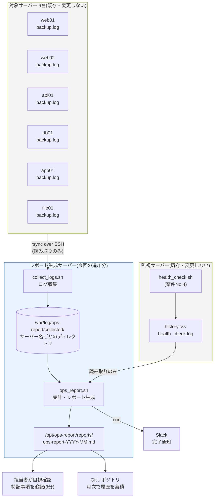
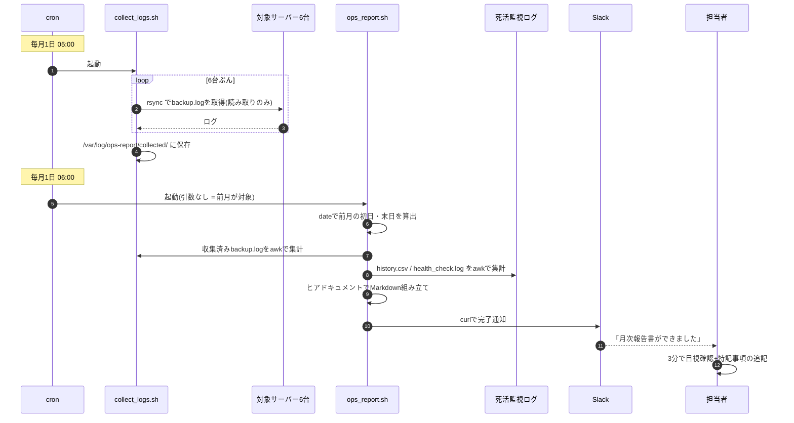
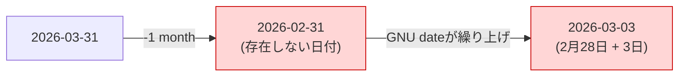

# 改善設計書(To-Be) — 月次運用報告書の自動集計・自動生成

改善案件No.1 / 株式会社サンプル商事(架空の依頼元)

> **正直な但し書き**
> 本案件は **学習用に自分で組み立てた架空の設定** である。本書のコマンド実行例と出力は、すべて **検証環境(Ubuntu Server 相当 / 仮想マシン1台)で実際に実行して得たもの** をそのまま貼っている。

---

## 1. 全体構成

### 1-1. システム構成図



### 1-2. 設計上の重要な決めごと

| # | 決めごと | 理由 |
|---|---|---|
| D1 | **入力ログには一切書き込まない(読み取り専用)** | 既存のバックアップ・死活監視の運用を絶対に壊さないため。`rsync` も `awk` も読むだけ |
| D2 | **「集める処理」と「集計する処理」を別スクリプトに分ける** | 収集が失敗しても集計だけ再実行できる。障害の切り分けが楽になる |
| D3 | **対象は必ず「前月」に限定する** | 月初に実行した時点で、前月のログは確定済み。集計値がぶれない(R6対策) |
| D4 | **設定(`.conf`)と処理(`.sh`)を分離する** | 案件No.2・No.4 と同じ方針。パスや目標値の変更でロジックを壊さない |
| D5 | **読めないログがあっても止まらない** | 6台中1台が収集失敗しても、残り5台分のレポートは出す。警告だけ残す |
| D6 | **`-n`(ドライラン)を用意する** | 移行期間中、ファイルを保存せず結果だけ確認できるようにするため |

---

## 2. 処理フロー

### 2-1. 月次の全体フロー(cronによる自動実行)



### 2-2. `ops_report.sh` の内部フロー

```mermaid
flowchart TD
    S([開始]) --> C1["ops_report.conf を読み込む"]
    C1 --> C2{設定ファイルが<br>ある?}
    C2 -- ない --> E1["エラー終了(exit 1)"]
    C2 -- ある --> D1["対象月の決定<br>(引数 or 前月)"]
    D1 --> D2{YYYY-MM の<br>書式か?}
    D2 -- 不正 --> E2["エラー終了(exit 1)"]
    D2 -- OK --> D3["初日・末日・翌月1日を算出"]

    D3 --> B1["バックアップログの集計<br>(サーバーごとにawk)"]
    B1 --> B2{ログが<br>読めた?}
    B2 -- 読めない --> B3["WARNログを残して<br>そのサーバーは除外"]
    B2 -- 読めた --> B4["成功件数 / 失敗件数 /<br>ディスク使用率最大 を取得"]
    B3 --> H1
    B4 --> H1

    H1["history.csv の集計<br>(awk -F',' でサーバー別)"] --> H2["チェック回数 / OK / NG /<br>稼働率 を算出"]
    H2 --> I1["health_check.log から<br>障害イベントを抽出"]
    I1 --> I2["検知↔復旧をペアにして<br>継続時間を計算"]
    I2 --> I3["sort | uniq -c で<br>サーバー別の件数を集計"]

    I3 --> M1["ヒアドキュメントで<br>Markdownを組み立て"]
    M1 --> M2{ドライラン<br>(-n)?}
    M2 -- はい --> M3["標準出力に表示<br>ファイルは保存しない"] --> END([終了])
    M2 -- いいえ --> M4["ファイルに保存"]
    M4 --> M5{HTML出力が<br>有効?}
    M5 -- はい --> M6["md2html.sh で変換"]
    M5 -- いいえ --> N1
    M6 --> N1["Slackへ完了通知"]
    N1 --> END

    style E1 fill:#ffd6d6
    style E2 fill:#ffd6d6
    style B3 fill:#fff2cc
```

---

## 3. 使用技術の解説(初心者向け)

この案件でつまずきやすい4つの技術を、**手を動かして確かめられる形** で解説する。以下のコマンドは検証環境で実際に実行した結果を貼っている。

### 3-1. awkでの集計 — 「列の取り出し」と「カウント」

> **awk(=オーク)とは**
> 「ファイルを1行ずつ読んで、条件に合う行だけに処理をする」ためのツール。ログの集計にはこれ以上ないほど向いている。

#### ステップ1: awkは行を「列」に分けてくれる

バックアップログの1行はこうなっている。

```bash
$ head -3 /var/log/ops-report/collected/db01/backup.log
```

```text
2026-08-01 03:00:01 [INFO] ===== バックアップ処理を開始します =====
2026-08-01 03:00:01 [INFO] バックアップを作成します: /var/backups/html-backup/html-backup-20260801.tar.gz
2026-08-01 03:00:04 [INFO] バックアップ作成に成功しました(サイズ: 807M)
```

awkは **空白で区切って、左から `$1`, `$2`, `$3` … と番号を振る**。試してみる。

```bash
$ head -1 /var/log/ops-report/collected/db01/backup.log \
    | awk '{print "$1 =", $1; print "$2 =", $2; print "$3 =", $3}'
```

```text
$1 = 2026-08-01
$2 = 03:00:01
$3 = [INFO]
```

**なぜこれが重要か:** `$1` が日付なので、**「`$1` が対象月の範囲内の行だけを処理する」と書けば月次の絞り込みができる**。日付が `YYYY-MM-DD` と桁の揃った形式なので、文字列のまま大小比較しても時系列の順序と一致する(`"2026-08-01" <= "2026-08-15"` は正しく成立する)。

#### ステップ2: 条件に合う行を数える

```bash
$ awk '$1 >= "2026-08-01" && $1 <= "2026-08-31" \
       && index($0, "バックアップ作成に成功しました") > 0 { c++ } \
       END { print c + 0 "件" }' \
    /var/log/ops-report/collected/db01/backup.log
```

```text
29件
```

| 書いたもの | 意味 |
|---|---|
| `$1 >= "..." && $1 <= "..."` | 日付が対象月の範囲内の行だけを対象にする |
| `index($0, "文字列") > 0` | 行全体(`$0`)にその文字列が含まれていれば真。`grep` と同じ働き |
| `{ c++ }` | 条件に合った回数だけ変数 `c` を1増やす(カウンター) |
| `END { ... }` | **全行を読み終わったあとに1回だけ**実行されるブロック |
| `c + 0` | 1件も無いと `c` は空なので、`+0` を足して数値の `0` として表示させる小技 |

#### ステップ3: サーバーごとに同時に数える(連想配列)

死活監視の `history.csv` はカンマ区切りなので、`-F','` で列を分ける。

```bash
$ head -3 /var/log/server-health-check/history.csv
```

```text
timestamp,name,type,target,status
2026-08-01 00:00:01,web01,http,http://192.168.1.11/,OK
2026-08-01 00:00:01,web02,http,https://192.168.1.12/,OK
```

| 列 | 内容 |
|---|---|
| `$1` | タイムスタンプ |
| `$2` | サーバー名 |
| `$3` | 監視方法(http / ping) |
| `$4` | 監視対象 |
| `$5` | 結果(OK / NG) |

ここで **`total[$2]++` という書き方** をすると、「サーバー名ごとのカウンター」が自動的に作られる。これを **連想配列**(=数字ではなく文字列を添字にできる配列)と呼ぶ。

```bash
$ awk -F',' -v s="2026-08-01 00:00:00" -v e="2026-09-01 00:00:00" '
    NR == 1 { next }
    $1 >= s && $1 < e { total[$2]++; if ($5 == "OK") ok[$2]++ }
    END {
      for (n in total)
        printf "%-8s チェック%5d回 / OK %5d回 / 稼働率 %.2f%%\n", \
               n, total[n], ok[n], (ok[n] / total[n]) * 100
    }' /var/log/server-health-check/history.csv | sort
```

```text
api01    チェック 8928回 / OK  8928回 / 稼働率 100.00%
app01    チェック 8928回 / OK  8928回 / 稼働率 100.00%
db01     チェック 8928回 / OK  8916回 / 稼働率 99.87%
file01   チェック 8928回 / OK  8928回 / 稼働率 100.00%
web01    チェック 8928回 / OK  8928回 / 稼働率 100.00%
web02    チェック 8928回 / OK  8921回 / 稼働率 99.92%
```

**5万行を1回読むだけで、6台分の集計が同時に終わる。** これが担当者が3時間かけていた作業の中身である。

| 書いたもの | 意味 |
|---|---|
| `-F','` | 区切り文字をカンマにする(既定は空白) |
| `-v s="..."` | シェルの値をawkの変数として渡す |
| `NR == 1 { next }` | `NR` は「今何行目か」。1行目(ヘッダー)を読み飛ばす |
| `total[$2]++` | サーバー名(`$2`)を添字にしたカウンターを1増やす |
| `for (n in total)` | 連想配列に入っている全ての添字(=全サーバー名)を順に取り出す |
| `printf "%-8s ... %.2f%%"` | 桁を揃えて表示する。`%.2f` は小数第2位まで |

> **💡 なぜ `sort` を後ろに付けているのか**
> `for (n in total)` の取り出し順は **awkの実装によって変わる(順序は保証されない)**。表示順を安定させたいときは、awkの外で `sort` に通すか、出現順を配列に覚えておく必要がある。`ops_report.sh` では後者(`order[++n] = $2` で出現順を記録)を採用している。

#### ステップ4: `sort | uniq -c` で件数を数える

awkを使わずに「同じものが何回出てきたか」を数える定番の組み合わせ。

```bash
$ awk -F',' '$5 == "NG" { split($1, d, " "); print d[1], $2 }' \
    /var/log/server-health-check/history.csv | sort | uniq -c
```

```text
     12 2026-08-12 db01
      7 2026-08-19 web02
```

| コマンド | 役割 |
|---|---|
| `sort` | 同じ行を隣り合わせに並べる |
| `uniq -c` | **隣り合う** 同じ行をまとめ、件数を先頭に付ける |
| `sort -rn` | 件数の多い順(逆順・数値順)に並べ替える |

> **⚠️ よくある間違い**
> `uniq` は **隣り合う行しか比較しない**。`sort` を通さずに `uniq -c` を使うと、離れた場所にある同じ行が別々に数えられてしまう。**`sort | uniq -c` は必ずセットで使う。**

### 3-2. dateコマンドで「前月の初日と末日」を求める

月次レポートの心臓部。ここを間違えると **1年に1回だけ壊れるバグ** になり、原因究明が非常に難しくなる。

#### ⚠️ やってはいけない書き方

```bash
$ date -d '2026-03-31 -1 month' '+%Y-%m-%d'
```

```text
2026-03-03
```

**3月31日の1か月前が「3月3日」になってしまった。** 理由は次のとおり。



2月は28日までしかないので「2月31日」は存在しない。GNU date はこれを **3日ぶん繰り上げて3月3日** と解釈する。
**この不具合は31日に実行したときだけ起きる。** テストが1日〜28日に行われれば見逃される。

#### ✅ 正しい書き方(月末日に依存しない手順)

```bash
$ first_day_this_month="$(date '+%Y-%m-01')"
$ echo "今月1日  : ${first_day_this_month}"
$ last_prev="$(date -d "${first_day_this_month} -1 day" '+%Y-%m-%d')"
$ echo "前月末日 : ${last_prev}"
$ first_prev="$(date -d "${last_prev}" '+%Y-%m-01')"
$ echo "前月初日 : ${first_prev}"
```

実行結果(検証環境の実行日は 2026-09-07):

```text
今月1日  : 2026-09-01
前月末日 : 2026-08-31
前月初日 : 2026-08-01
```


**なぜこれなら安全なのか:** どの月でも「1日」は必ず存在する。存在する日付から1日引くだけなので、**存在しない日付が一度も生まれない**。

うるう年も自動的に正しく処理される。

```bash
$ date -d '2026-03-01 -1 day' '+%Y-%m-%d'   # 平年
2026-02-28
$ date -d '2028-03-01 -1 day' '+%Y-%m-%d'   # うるう年
2028-02-29
```

#### 月の日数を求める

```bash
$ date -d "2026-08-01 +1 month -1 day" '+%d'
31
```

「対象月の1日 + 1か月 - 1日」= その月の末日。日付部分がそのまま日数になる。

> **💡 落とし穴: `08` は8進数ではない**
> 取り出した `08` や `09` をそのまま計算に使うと、bashが8進数と誤解してエラーになる。
> ```bash
> $ d="08"; echo $((d + 1))
> bash: 08: value too great for base (error token is "08")
> $ d="08"; echo $((10#$d + 1))
> 9
> ```
> `10#` を付けて「10進数として読め」と明示する。`ops_report.sh` でもこの書き方を使っている。

#### 経過時間(障害の継続時間)の計算

```bash
$ start=$(date -d "2026-08-12 03:05:02" '+%s')
$ end=$(date -d "2026-08-12 04:00:02" '+%s')
$ echo "$(( (end - start) / 60 ))分"
55分
```

`+%s` は「1970年1月1日からの経過秒数」に変換する指定。**日時を秒という1本の数直線に載せてしまえば、引き算だけで経過時間が出る。**

### 3-3. ヒアドキュメントでレポートを組み立てる

> **ヒアドキュメント(here document)とは**
> `<<EOF` から `EOF` までの複数行を、そのままコマンドの入力として渡す仕組み。`echo` を何行も並べる代わりに使う。

#### 基本形

```bash
$ cat > /tmp/sample.md <<EOF
# ${YEAR}年${MONTH}月 レポート

- 成功: ${OK}件
- 失敗: ${NG}件
EOF
```

| 書き方 | 変数 `${...}` の展開 | 使いどころ |
|---|---|---|
| `<<EOF` | **される** | 集計結果を埋め込みたいとき(レポート本文) |
| `<<'EOF'`(引用符つき) | **されない** | 記号をそのまま出したいとき(CSSやコード例) |
| `cat > file <<EOF` | — | 新規作成(上書き) |
| `cat >> file <<EOF` | — | 追記 |

#### なぜ `echo` を並べるより良いのか

```bash
# ❌ echo を並べる書き方:完成形が想像しにくい
echo "# レポート" > report.md
echo "" >> report.md
echo "| 項目 | 値 |" >> report.md
echo "|---|---|" >> report.md

# ✅ ヒアドキュメント:出力される形がそのまま見える
cat > report.md <<EOF
# レポート

| 項目 | 値 |
|---|---|
EOF
```

**ヒアドキュメントは「完成形のレイアウトがコード上でそのまま見える」。** 帳票やレポートのように「見た目が決まっているもの」を作るときは、圧倒的にこちらが読みやすい。

#### 表の行だけはループで追加する

サーバーの台数は可変なので、表のヘッダーまでをヒアドキュメントで出し、**中身の行はループで `>>` 追記する** という組み合わせにしている。

```bash
# ヘッダーまでを一気に書き出す
cat > "$REPORT_FILE" <<EOF
| サーバー | 成功 | 失敗 |
|---|---|---|
EOF

# 中身はサーバーの数だけループで追記
for s in "${BACKUP_SERVERS[@]}"; do
    echo "| ${s} | ${BK_OK[$s]}件 | ${BK_NG[$s]}件 |" >> "$REPORT_FILE"
done
```

> **⚠️ ヒアドキュメントの落とし穴**
> - 終端の `EOF` は **行頭に置く**。前に空白があると終端と認識されず、ファイルの最後までヒアドキュメントとして読まれてしまう
> - 本文中にバッククォート(`` ` ``)を書きたいときは `\`` とエスケープする(`<<EOF` の場合)。Markdownのインラインコードを出力するときに必ず出くわす

### 3-4. なぜExcelではなくMarkdownで出すのか

3つの理由がある。詳しい比較表は [02-improvement-proposal.md](./02-improvement-proposal.md) の4章にあるが、設計上の要点だけ再掲する。

| 理由 | 説明 |
|---|---|
| **① 差分が見える** | `.xlsx` はバイナリなので `git diff` が「変更あり」としか言わない。Markdownはテキストなので **どの数字が変わったかが行単位で見える** |
| **② 自動化しやすい** | Markdownは `cat > file <<EOF` で書き出すだけ。xlsxの生成にはPythonライブラリ等の追加インストールが必要になる |
| **③ Gitで履歴が残る** | 1か月分が約4KB。何年分でもリポジトリが重くならない。「いつの報告書にどう書いたか」が全部追える |

**読みやすさへの対応:** Markdownに慣れていない人向けに、`md2html.sh` でHTML版も同時生成できる設計にしている(`ENABLE_HTML_REPORT=true`)。ブラウザで開けば表として整形されて表示される。

---

## 4. データ設計

### 4-1. 設定ファイル `ops_report.conf`

| 変数名 | 既定値 | 意味 |
|---|---|---|
| `COMPANY_NAME` | 株式会社サンプル商事 | レポート冒頭に表示する組織名(架空) |
| `REPORT_AUTHOR` | 情報システム課 運用担当 | 作成者欄の表示 |
| `BACKUP_LOG_ROOT` | `/var/log/ops-report/collected` | 収集したbackup.logの親ディレクトリ |
| `BACKUP_LOG_NAME` | `backup.log` | 各サーバーディレクトリ内のログファイル名 |
| `HEALTH_HISTORY_FILE` | `/var/log/server-health-check/history.csv` | 死活監視の履歴CSV |
| `HEALTH_LOG_FILE` | `/var/log/server-health-check/health_check.log` | 死活監視の実行ログ(障害抽出に使う) |
| `REPORT_DIR` | `/opt/ops-report/reports` | レポートの出力先 |
| `LOG_FILE` | `/var/log/ops-report/ops_report.log` | このツール自身の実行ログ |
| `BACKUP_EXPECTED_PER_DAY` | `1` | 1日あたり期待されるバックアップ回数 |
| `UPTIME_TARGET` | `99.5` | 稼働率の目標値(%) |
| `BACKUP_SUCCESS_TARGET` | `100` | バックアップ成功率の目標値(%) |
| `DISK_USAGE_THRESHOLD` | `80` | ディスク使用率の警告しきい値(%) |
| `ENABLE_HTML_REPORT` | `false` | HTML版も出力するか |
| `ENABLE_SLACK_NOTIFY` | `false` | Slack通知を行うか |
| `SLACK_WEBHOOK_URL` | `<YOUR_SLACK_WEBHOOK_URL>` | Slack Incoming WebhookのURL(**リポジトリにはプレースホルダーのみ**) |

### 4-2. 入力データ形式

#### ① バックアップログ(案件No.2 `backup.sh` の出力)

**格納場所:** `${BACKUP_LOG_ROOT}/<サーバー名>/backup.log`

```text
2026-08-01 03:00:01 [INFO] ===== バックアップ処理を開始します =====
2026-08-01 03:00:04 [INFO] バックアップ作成に成功しました(サイズ: 807M)
2026-08-01 03:00:10 [INFO] バックアップ先の使用率: 72%(警告閾値: 80%)
2026-08-12 03:00:04 [ERROR] バックアップ作成に失敗しました(tar終了コード: 2)
```

| 集計に使う文言 | 取り出す値 | 出典 |
|---|---|---|
| `バックアップ作成に成功しました` | 成功件数 | [projects/02-backup-automation/src/backup.sh](../../projects/02-backup-automation/src/backup.sh) |
| `バックアップ作成に失敗しました` | 失敗件数 | 同上 |
| `バックアップ先の使用率: NN%` | ディスク使用率(月内最大) | 同上 |

> **⚠️ 依存関係の注意(リスクR2)**
> 上の文言は案件No.2のスクリプトが出す **日本語メッセージそのもの** である。案件No.2側でメッセージ文言を変えると、この集計は静かに0件になる。
> そのため `ops_report.sh` のawk部分には、**どのスクリプトのどのログ行に対応しているかをコメントで明記** してある。案件No.2を改修するときは、必ずこちらのテストも回すこと。

#### ② 死活監視の履歴CSV(案件No.4 `health_check.sh` の出力)

**格納場所:** `${HEALTH_HISTORY_FILE}`(全サーバー分が1ファイル)

```text
timestamp,name,type,target,status
2026-08-01 00:00:01,web01,http,http://192.168.1.11/,OK
2026-08-12 03:00:01,db01,ping,192.168.1.21,NG
```

| 列 | 名前 | 用途 |
|---|---|---|
| `$1` | timestamp | 対象月での絞り込み |
| `$2` | name | サーバー別の集計キー |
| `$3` | type | レポートの「監視方法」列 |
| `$4` | target | (レポートでは未使用) |
| `$5` | status | `OK` / `NG`。稼働率の計算に使う |

#### ③ 死活監視の実行ログ(案件No.4 `health_check.sh` の出力)

**格納場所:** `${HEALTH_LOG_FILE}`

```text
2026-08-12 03:05:02 [ERROR] db01(192.168.1.21)が2回連続でNGです。閾値(2回)を超えたため異常として通知します
2026-08-12 04:00:02 [INFO] db01(192.168.1.21)が復旧しました
```

| 抽出条件 | 意味 |
|---|---|
| `$3 == "[ERROR]"` かつ `連続でNGです` を含む | 障害検知イベント |
| `$3 == "[INFO]"` かつ `復旧しました` を含む | 復旧イベント |

サーバー名は `$4`(`db01(192.168.1.21)が2回連続で…`)の **最初の `(` より前** を取り出して得る。

### 4-3. 出力レポートの構成

| 章 | 内容 | データ元 |
|---|---|---|
| ヘッダー | 対象組織・対象期間・対象台数・生成日時 | 設定ファイル + date |
| 1. サマリ | バックアップ成功率 / 平均稼働率 / 障害件数 と目標達成判定 | 全集計の合算 |
| 2. バックアップ実施状況 | サーバー別の成功・失敗・成功率・ディスク使用率 | backup.log |
| 3. 死活監視 稼働状況 | サーバー別のチェック回数・OK・NG・稼働率 | history.csv |
| 4. 障害イベント一覧 | 検知日時・サーバー・復旧日時・継続時間 | health_check.log |
| 5. サーバー別 障害検知件数 | `sort \| uniq -c` の結果 | health_check.log |
| 6. 特記事項・所感 | **人間が記入する唯一の欄** | 人間(3分) |
| 付録 | 集計期間・入力ファイルパス・指標の定義 | 設定ファイル |

**実際に生成された報告書の実物:** [src/report-sample.md](./src/report-sample.md)

出力ファイル名の規則:

| 種類 | ファイル名 | 例 |
|---|---|---|
| Markdown版 | `ops-report-YYYY-MM.md` | `ops-report-2026-08.md` |
| HTML版(任意) | `ops-report-YYYY-MM.html` | `ops-report-2026-08.html` |

### 4-4. 指標の定義(P5「定義が頭の中にある」の解消)

**集計の定義をドキュメントとコードの両方に明記する。** これが属人化を防ぐ核心である。

| 指標 | 定義 |
|---|---|
| バックアップ成功率 | (「作成に成功しました」の行数) ÷ (成功 + 失敗の行数) × 100 |
| バックアップ実行回数 | 成功 + 失敗の行数 |
| 稼働率 | (`status` が `OK` のチェック回数) ÷ (全チェック回数) × 100 |
| 平均稼働率 | 全サーバーの OK 合計 ÷ 全サーバーのチェック合計 × 100(台数の単純平均ではない) |
| 障害検知件数 | `[ERROR]` の連続NG検知イベントの件数(復旧までを1件と数える) |
| 障害の継続時間 | (復旧時刻 − 検知時刻)を分に換算。**検知時刻は連続NG回数がしきい値に達した時点**であり、実際の停止開始はそれより最大5分前 |
| ディスク使用率(月内最大) | `バックアップ先の使用率: NN%` のうち月内で最大の値 |

---

## 5. ディレクトリ構成

### 5-1. リポジトリ内(このパック)

```text
improvements/01-ops-report-automation/
├── README.md
├── 01-current-analysis.md
├── 02-improvement-proposal.md
├── 03-design.md                   # 本ファイル
├── 04-build-guide.md
├── 05-effect-measurement.md
├── 06-troubleshooting.md
└── src/
    ├── ops_report.sh              # レポート生成本体
    ├── ops_report.conf            # 設定ファイル
    ├── collect_logs.sh            # 6台からのログ収集
    ├── servers.conf               # 収集対象サーバー一覧
    ├── md2html.sh                 # Markdown→HTML変換(任意)
    ├── generate_sample_logs.sh    # 検証用サンプルログ生成
    ├── crontab.example            # cron登録例
    └── report-sample.md           # 生成された報告書の実物
```

### 5-2. サーバー上の配置

```text
/opt/ops-report/                       # スクリプトと設定の置き場所
├── ops_report.sh                      # 750(所有者のみ実行可)
├── collect_logs.sh                    # 750
├── md2html.sh                         # 750
├── ops_report.conf                    # 600(Webhook URLを含むため)
├── servers.conf                       # 640
└── reports/                           # 生成物の出力先
    ├── ops-report-2026-08.md
    └── ops-report-2026-08.html

/var/log/ops-report/                   # 入力ログの集積とツール自身のログ
├── ops_report.log                     # このツールの実行ログ
├── cron.log                           # cronからの標準出力・標準エラー
└── collected/                         # 各サーバーから集めたbackup.log
    ├── web01/backup.log
    ├── web02/backup.log
    ├── api01/backup.log
    ├── db01/backup.log
    ├── app01/backup.log
    └── file01/backup.log

/var/log/server-health-check/          # 既存(案件No.4)。読むだけ・変更しない
├── history.csv
└── health_check.log
```

### 5-3. 権限設計

| 対象 | 権限 | 理由 |
|---|---|---|
| `*.sh` | `750` | 所有者のみ実行。他のユーザーに勝手に動かされない |
| `ops_report.conf` | `600` | **Slack Webhook URLという秘匿情報を含む**ため所有者のみ読める |
| `servers.conf` | `640` | サーバーのIPを含むので一般公開はしない |
| 入力ログへのアクセス | **読み取りのみ** | 既存運用を壊さないための最重要の設計判断(D1) |

---

## 6. 設計のまとめ

| 観点 | 設計 |
|---|---|
| 既存運用への影響 | **ゼロ**(ログを読むだけ。書き込み・削除は一切しない) |
| 追加する保守対象 | スクリプト3本 + 設定ファイル2本のみ。サーバー・DB・エージェントの追加なし |
| 障害時の挙動 | 読めないログはスキップし、警告を残して残りでレポートを出す(止まらない) |
| 再現性 | 対象を前月に固定しているため、何度実行しても同じ結果になる |
| 移行のしやすさ | `-n`(ドライラン)で保存せずに結果だけ確認できる。cron 1行のコメントアウトで元に戻せる |

**次のステップ:** 実際に構築して移行する → [04-build-guide.md](./04-build-guide.md)

---

## 関連ドキュメント

- [README.md](./README.md) — 案件概要
- [02-improvement-proposal.md](./02-improvement-proposal.md) — 改善提案書(案の比較と選定理由)
- [04-build-guide.md](./04-build-guide.md) — 実装・移行手順書
- [06-troubleshooting.md](./06-troubleshooting.md) — トラブルシューティング集
- [projects/02-backup-automation/src/backup.sh](../../projects/02-backup-automation/src/backup.sh) — 入力ログの出力元
- [projects/04-server-health-check/src/health_check.sh](../../projects/04-server-health-check/src/health_check.sh) — 入力ログの出力元
