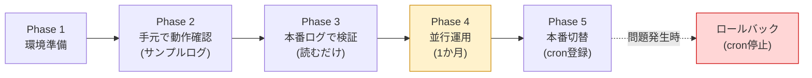
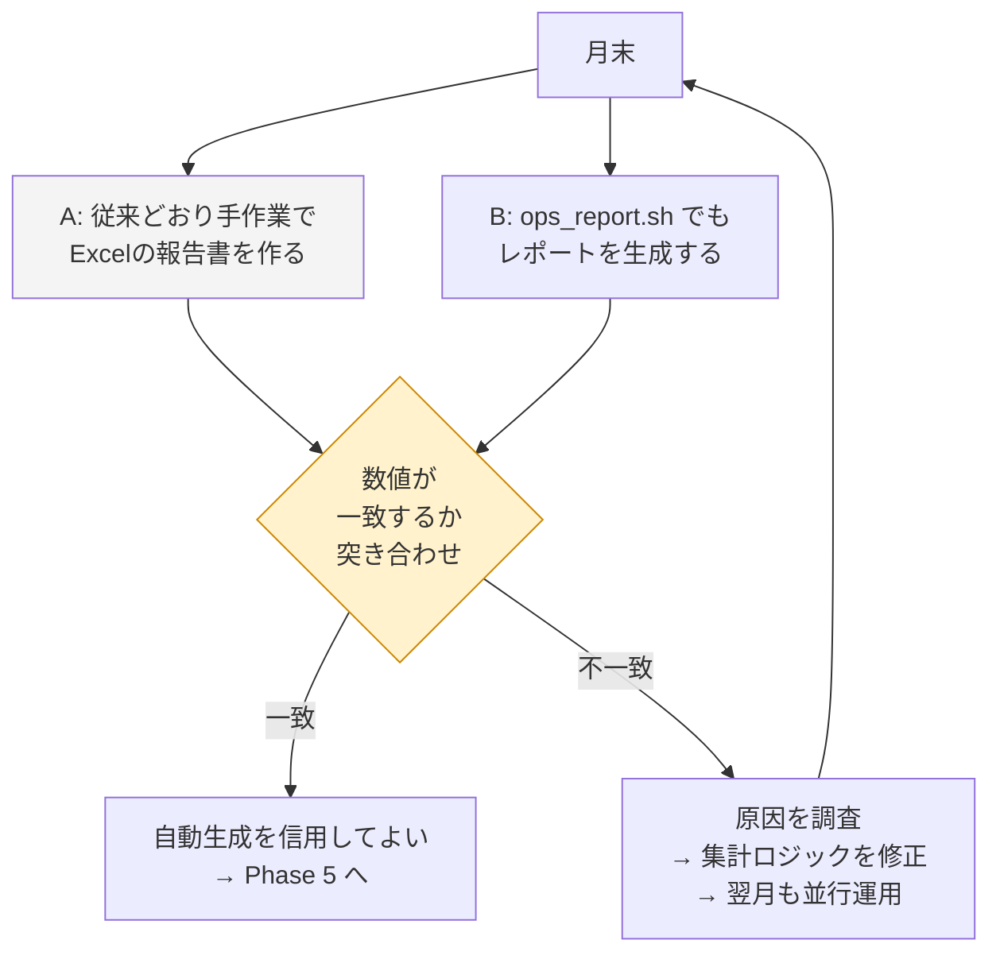
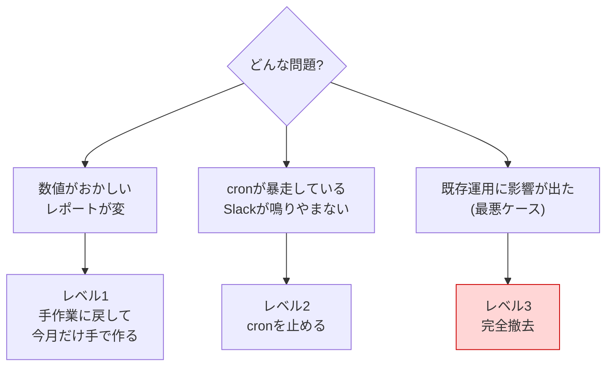

# 実装・移行手順書 — 月次運用報告書の自動集計・自動生成

改善案件No.1 / 株式会社サンプル商事(架空の依頼元)

> **正直な但し書き**
> 本案件は **学習用に自分で組み立てた架空の設定** である。
> 本書に載せているコマンドと出力は、**検証環境(Ubuntu Server 24.04 LTS 相当・仮想マシン1台)で実際に実行した結果** をそのまま貼っている。ただし6台構成は1台の中に `collected/<サーバー名>/` というディレクトリを作って再現している(実機6台は用意していない)。

---

## この手順書の読み方

| 記号 | 意味 |
|---|---|
| `$` | 一般ユーザーで実行するコマンド |
| `#` | root権限(`sudo`)で実行するコマンド |
| 💡ポイント | つまずきやすい箇所・理由の説明 |
| ⚠️注意 | 間違えると既存運用に影響が出る箇所 |

**全体の流れ:**



---

## Phase 1: 環境準備

### 手順1-1. 必要なコマンドがそろっているか確認する

**なぜ:** 途中で「コマンドが無い」と止まるのを防ぐため、最初にまとめて確認する。

```bash
$ for c in bash awk date curl rsync ssh crontab; do
    if command -v "$c" >/dev/null 2>&1; then
      printf "%-10s OK  (%s)\n" "$c" "$(command -v "$c")"
    else
      printf "%-10s なし\n" "$c"
    fi
  done
```

実行結果(検証環境):

```text
bash       OK  (/usr/bin/bash)
awk        OK  (/usr/bin/awk)
date       OK  (/usr/bin/date)
curl       OK  (/usr/bin/curl)
rsync      なし
ssh        OK  (/usr/bin/ssh)
crontab    なし
```

不足しているものを入れる。

```bash
# 「なし」と出たものをインストールする
$ sudo apt update
$ sudo apt install -y rsync cron
```

> 💡 **ポイント: rsync が無くても動く**
> `collect_logs.sh` は `rsync` が見つからないときは自動的に `scp` を使うように書いてある。ただし `rsync` のほうが差分転送で速いので、可能なら入れておく。

### 手順1-2. バージョンを確認する

**なぜ:** `date` の日付計算は **GNU coreutils 版** の機能に依存している。macOS標準の `date` では動かないため、Linux(GNU date)であることを確認しておく。

```bash
$ bash --version | head -1
$ date --version | head -1
$ awk -W version 2>&1 | head -1 || awk --version | head -1
```

実行結果:

```text
GNU bash, version 5.2.21(1)-release (x86_64-pc-linux-gnu)
date (GNU coreutils) 9.4
mawk 1.3.4 20240123
```

> 💡 **ポイント: awkの種類は mawk でも gawk でもよい**
> 本ツールは両方で動く書き方にしてある(gawk 専用の機能は使っていない)。Ubuntu の既定は `mawk`、RHEL系は `gawk` であることが多い。

### 手順1-3. ディレクトリを作成する

**なぜ:** スクリプト置き場・出力先・ログ置き場を先に用意しておくと、以降の手順で「ディレクトリがない」エラーに悩まされない。

```bash
$ sudo mkdir -p /opt/ops-report/reports
$ sudo mkdir -p /var/log/ops-report/collected
$ ls -ld /opt/ops-report /opt/ops-report/reports /var/log/ops-report
```

実行結果:

```text
drwxr-xr-x 3 root root 4096 Sep  7 04:57 /opt/ops-report
drwxr-xr-x 2 root root 4096 Sep  7 04:53 /opt/ops-report/reports
drwxr-xr-x 3 root root 4096 Sep  7 04:56 /var/log/ops-report
```

### 手順1-4. スクリプト一式を配置する

**なぜ:** リポジトリの `src/` はあくまで「原本」。サーバー上の運用場所へコピーして使う。

```bash
$ cd ~/automation/improvements/01-ops-report-automation
$ sudo cp src/ops_report.sh src/collect_logs.sh src/md2html.sh /opt/ops-report/
$ sudo cp src/ops_report.conf src/servers.conf /opt/ops-report/
```

### 手順1-5. 権限を設定する

**なぜ:** `ops_report.conf` には **Slack Webhook URL(秘匿情報)** を書く。他のユーザーから読めてはいけない。

```bash
$ sudo chmod 750 /opt/ops-report/*.sh
$ sudo chmod 600 /opt/ops-report/ops_report.conf
$ sudo chmod 640 /opt/ops-report/servers.conf
$ ls -l /opt/ops-report/
```

実行結果:

```text
total 60
-rwxr-x--- 1 root root  5093 Sep  7 04:57 collect_logs.sh
-rwxr-x--- 1 root root  7016 Sep  7 04:57 md2html.sh
-rw------- 1 root root  4839 Sep  7 04:57 ops_report.conf
-rwxr-x--- 1 root root 26546 Sep  7 04:57 ops_report.sh
drwxr-xr-x 2 root root  4096 Sep  7 04:53 reports
-rw-r----- 1 root root  1508 Sep  7 04:57 servers.conf
```

> ⚠️ **注意: `ops_report.conf` は必ず 600 にする**
> `-rw-------`(600)になっていることを確認する。ここが `644` のままだと、サーバーにログインできる全員がSlack Webhook URLを読めてしまう。

### 手順1-6. shellcheckで静的検査をする

**なぜ:** 実行する前に文法ミスや危険な書き方を見つけておくため。**「動かしてみて確かめる」前に「読まずに検査してもらう」** のが安全な進め方。

> **shellcheck とは**
> シェルスクリプトを実行せずに検査し、バグになりやすい書き方を指摘してくれるツール。

```bash
$ sudo apt install -y shellcheck
$ shellcheck -S warning /opt/ops-report/*.sh
$ echo "終了コード: $?(0 = 警告なし)"
```

実行結果:

```text
終了コード: 0(0 = 警告なし)
```

> 💡 **ポイント: 何も表示されないのが正常**
> shellcheck は問題があるときだけメッセージを出す。**無言で終わったら合格。**

---

## Phase 2: 手元で動作確認(サンプルログを使う)

いきなり本番ログを触る前に、**自分で作った検証用ログ** でツールの挙動を確かめる。

### 手順2-1. サンプルログを生成する

**なぜ:** 案件No.2・No.4 をまだ構築していなくても、本番と同じ書式のログを手元で作れる。

```bash
$ cd ~/work
$ ~/automation/improvements/01-ops-report-automation/src/generate_sample_logs.sh \
    -m 2026-08 -o ./sample-logs
```

実行結果:

```text
[INFO] 対象月       : 2026-08(31日間)
[INFO] 出力先       : ./sample-logs
[INFO] 対象サーバー : 6台
[INFO] バックアップログを生成しています...
[INFO]   - web01: ./sample-logs/collected/web01/backup.log(対象: /var/www/html)
[INFO]   - web02: ./sample-logs/collected/web02/backup.log(対象: /var/www/html)
[INFO]   - api01: ./sample-logs/collected/api01/backup.log(対象: /opt/api/data)
[INFO]   - db01: ./sample-logs/collected/db01/backup.log(対象: /var/lib/mysql-dump)
[INFO]   - app01: ./sample-logs/collected/app01/backup.log(対象: /opt/app/data)
[INFO]   - file01: ./sample-logs/collected/file01/backup.log(対象: /srv/share)
[INFO] 死活監視の履歴CSVを生成しています...
[INFO]   - ./sample-logs/server-health-check/history.csv(53569行)
[INFO] 死活監視の実行ログを生成しています...
[INFO]   - ./sample-logs/server-health-check/health_check.log(285行)
```

生成されたディレクトリ構成を確認する。

```bash
$ find ./sample-logs -maxdepth 2 | sort
```

```text
./sample-logs
./sample-logs/collected
./sample-logs/collected/api01
./sample-logs/collected/app01
./sample-logs/collected/db01
./sample-logs/collected/file01
./sample-logs/collected/web01
./sample-logs/collected/web02
./sample-logs/server-health-check
./sample-logs/server-health-check/health_check.log
./sample-logs/server-health-check/history.csv
```

> 💡 **ポイント: サンプルログの障害は「決め打ち」**
> 毎回同じレポートが再現できるよう、障害の発生日時は固定してある(db01 が8月12日 03:00〜04:00、web02 が8月19日 14:00〜14:30 にダウン、db01 のバックアップが12日と25日に失敗)。ランダムだと「昨日と結果が違う」となって検証にならない。

### 手順2-2. 検証用の設定ファイルを作る

**なぜ:** 本番用の `/opt/ops-report/ops_report.conf` を書き換えずに検証したいため、**環境変数 `OPS_REPORT_CONF` で別の設定ファイルを指定できる** ようにしてある。

```bash
$ cd ~/work
$ cp ~/automation/improvements/01-ops-report-automation/src/ops_report.conf ./test.conf
$ W="$(pwd)"
$ sed -i \
    -e "s|^BACKUP_LOG_ROOT=.*|BACKUP_LOG_ROOT=\"${W}/sample-logs/collected\"|" \
    -e "s|^HEALTH_HISTORY_FILE=.*|HEALTH_HISTORY_FILE=\"${W}/sample-logs/server-health-check/history.csv\"|" \
    -e "s|^HEALTH_LOG_FILE=.*|HEALTH_LOG_FILE=\"${W}/sample-logs/server-health-check/health_check.log\"|" \
    -e "s|^REPORT_DIR=.*|REPORT_DIR=\"${W}/reports\"|" \
    -e "s|^LOG_FILE=.*|LOG_FILE=\"${W}/logs/ops_report.log\"|" \
    ./test.conf
$ mkdir -p "${W}/logs"
```

### 手順2-3. ヘルプを表示して使い方を確認する

```bash
$ ~/automation/improvements/01-ops-report-automation/src/ops_report.sh -h
```

実行結果:

```text
使い方:
  ops_report.sh [-n] [YYYY-MM]

引数:
  YYYY-MM   レポート対象月(省略時は「前月」)

オプション:
  -n        ドライラン。ファイルに保存せず標準出力に表示するだけ。
            Slack通知も行わない(移行期間の突き合わせ確認に使う)。
  -h        このヘルプを表示する。
```

### 手順2-4. ドライランで実行する

**なぜ:** `-n` を付けると **ファイルを一切保存せず、結果を画面に出すだけ**。最初はこれで中身を確認する。

```bash
$ export OPS_REPORT_CONF=~/work/test.conf
$ ~/automation/improvements/01-ops-report-automation/src/ops_report.sh -n 2026-08 2>/dev/null | head -25
```

実行結果:

```text
# 2026年8月 月次運用報告書

| 項目 | 内容 |
|---|---|
| 対象組織 | 株式会社サンプル商事(架空の依頼元) |
| 対象期間 | 2026-08-01 〜 2026-08-31(31日間) |
| 対象サーバー | 6台 |
| 作成者 | 情報システム課 運用担当 |
| 生成日時 | 2026-09-07 04:34:33 |
| 生成方法 | `ops_report.sh` による自動集計・自動生成 |

> このレポートの数値はすべてログから自動集計したものであり、人手による転記は行っていない。
> 人間が編集するのは末尾の「特記事項・所感」欄のみ。

---

## 1. サマリ

| 指標 | 実績 | 目標 | 判定 |
|---|---|---|---|
| バックアップ成功率 | 98.92%(成功 184 / 実行 186) | 100% | ⚠️ 未達 |
| 死活監視 平均稼働率 | 99.96%(OK 53549 / チェック 53568) | 99.5% | ✅ 達成 |
```

> 💡 **ポイント: `2>/dev/null` を付けている理由**
> 進捗ログ(`[INFO] ...`)は **標準エラー出力** に、レポート本文は **標準出力** に出るように分けてある。
> こうしておくと `ops_report.sh -n > out.md` としたときに **ログが混ざらない綺麗なMarkdownが得られる**。ドライランで中身だけ見たいときは `2>/dev/null` でログを捨てる。

### 手順2-5. ファイルに保存して実行する

```bash
$ ~/automation/improvements/01-ops-report-automation/src/ops_report.sh 2026-08
```

実行結果:

```text
2026-09-07 04:56:32 [INFO] ===== 月次運用報告書の生成を開始します(対象月: 2026-08) =====
2026-09-07 04:56:32 [INFO] 集計期間: 2026-08-01 〜 2026-08-31(31日間)
2026-09-07 04:56:32 [INFO] api01: バックアップ 成功31件 / 失敗0件 / ディスク最大51%
2026-09-07 04:56:32 [INFO] app01: バックアップ 成功31件 / 失敗0件 / ディスク最大56%
2026-09-07 04:56:32 [INFO] db01: バックアップ 成功29件 / 失敗2件 / ディスク最大78%
2026-09-07 04:56:32 [INFO] file01: バックアップ 成功31件 / 失敗0件 / ディスク最大81%
2026-09-07 04:56:32 [INFO] web01: バックアップ 成功31件 / 失敗0件 / ディスク最大64%
2026-09-07 04:56:32 [INFO] web02: バックアップ 成功31件 / 失敗0件 / ディスク最大67%
2026-09-07 04:56:32 [INFO] 死活監視: 総チェック 53568回 / OK 53549回 / 平均稼働率 99.96%
2026-09-07 04:56:32 [INFO] 障害イベント: 2件を抽出しました
2026-09-07 04:56:32 [INFO] Markdownレポートを生成しました: /root/work/reports/ops-report-2026-08.md
2026-09-07 04:56:32 [INFO] ===== 月次運用報告書の生成が正常に終了しました =====
```

> 💡 **ポイント: ログの読み方**
> `db01` だけ「成功29件 / 失敗2件」になっている。サンプルログでは8月12日と25日にバックアップ失敗を仕込んであるので、**期待どおりに検出できている**ことが確認できる。
> `file01` の「ディスク最大81%」も、閾値80%を超えるよう意図的に仕込んだシナリオ。レポート側で警告マークが付く。

生成された報告書の全文は [src/report-sample.md](./src/report-sample.md) にそのまま置いてある。

### 手順2-6. HTML版も生成してみる(任意)

**なぜ:** Markdownを読めない相手に渡すときのため。ブラウザで開けば表として整形される。

```bash
$ sed -i 's|^ENABLE_HTML_REPORT=.*|ENABLE_HTML_REPORT=true|' ~/work/test.conf
$ ~/automation/improvements/01-ops-report-automation/src/ops_report.sh 2026-08 2>&1 | tail -3
```

実行結果:

```text
2026-09-07 04:56:33 [INFO] Markdownレポートを生成しました: /root/work/reports/ops-report-2026-08.md
2026-09-07 04:56:33 [INFO] HTML版レポートを生成しました: /root/work/reports/ops-report-2026-08.html
2026-09-07 04:56:33 [INFO] ===== 月次運用報告書の生成が正常に終了しました =====
```

```bash
$ ls -lh ~/work/reports/
```

```text
total 16K
-rw-r--r-- 1 root root 6.9K Sep  7 04:56 ops-report-2026-08.html
-rw-r--r-- 1 root root 4.2K Sep  7 04:56 ops-report-2026-08.md
```

ブラウザで `ops-report-2026-08.html` を開くと、表として整形された報告書が表示される。

---

## Phase 3: 本番ログでの検証(読むだけ)

### 手順3-1. 収集対象サーバーを定義する

**なぜ:** サーバーが増減したときに `servers.conf` の1行を足し引きするだけで済むようにするため(スクリプト本体は触らない)。

```bash
$ sudo vi /opt/ops-report/servers.conf
```

書式は `name,ssh_target,remote_log_path`。

```text
web01,ops@192.168.1.11,/var/log/backup-automation/backup.log
web02,ops@192.168.1.12,/var/log/backup-automation/backup.log
api01,ops@192.168.1.13,/var/log/backup-automation/backup.log
db01,ops@192.168.1.21,/var/log/backup-automation/backup.log
app01,ops@192.168.1.22,/var/log/backup-automation/backup.log
file01,ops@192.168.1.23,/var/log/backup-automation/backup.log
```

### 手順3-2. SSH公開鍵認証を設定する

**なぜ:** cronからの無人実行では **パスワードを入力する人がいない**。公開鍵認証にしておかないと自動化できない。

```bash
# レポート生成サーバー側で鍵を作る(パスフレーズなし)
$ sudo -u root ssh-keygen -t ed25519 -N "" -f /root/.ssh/id_ed25519_opsreport

# 各サーバーへ公開鍵を配る(6台ぶん繰り返す)
$ sudo ssh-copy-id -i /root/.ssh/id_ed25519_opsreport.pub ops@192.168.1.11
```

接続確認する。

```bash
$ sudo ssh -o BatchMode=yes ops@192.168.1.11 'echo 接続OK'
接続OK
```

> ⚠️ **注意: `-o BatchMode=yes` を付けて確認する**
> `BatchMode=yes` は「パスワードを聞かれたら諦めて失敗する」という指定。これを付けて成功すれば **本当に鍵だけで入れている** 証明になる。付けずに試すと、パスワード入力で成功してしまい「cronでは動かない」ことに気づけない。

> 💡 **ポイント: 読み取り専用の権限で十分**
> `ops` ユーザーには **バックアップログを読む権限だけ** あればよい。書き込み権限は不要なので与えない。万一このツール側が侵害されても、既存サーバーのログを壊せない。

### 手順3-3. ログを収集する

```bash
$ sudo /opt/ops-report/collect_logs.sh
```

実行結果:

> ⚠️ **この実行例について正直に書いておく**
> 検証環境は仮想マシン1台のため、実機6台へのSSH転送は行っていない。`servers.conf` の接続先を `localhost` にし、同一マシン内の別パス(`/var/log/backup-automation-src/<サーバー名>/`)を「各サーバーのログ」に見立ててコピーで再現した結果である。
> 実機構成では `rsync`(または `scp`)が使われ、ログの文言は `web01: rsyncで収集成功(ops@192.168.1.11:/var/log/backup-automation/backup.log)` のようになる。

```text
2026-09-07 04:56:03 [INFO] ===== ログ収集を開始します(収集先: /var/log/ops-report/collected) =====
2026-09-07 04:56:03 [INFO] web01: ローカルコピー成功(/var/log/backup-automation-src/web01/backup.log)
2026-09-07 04:56:03 [INFO] web02: ローカルコピー成功(/var/log/backup-automation-src/web02/backup.log)
2026-09-07 04:56:03 [INFO] api01: ローカルコピー成功(/var/log/backup-automation-src/api01/backup.log)
2026-09-07 04:56:03 [INFO] db01: ローカルコピー成功(/var/log/backup-automation-src/db01/backup.log)
2026-09-07 04:56:03 [INFO] app01: ローカルコピー成功(/var/log/backup-automation-src/app01/backup.log)
2026-09-07 04:56:03 [INFO] file01: ローカルコピー成功(/var/log/backup-automation-src/file01/backup.log)
2026-09-07 04:56:03 [INFO] ログ収集完了: 成功 6台 / 失敗 0台
2026-09-07 04:56:03 [INFO] ===== ログ収集が正常に終了しました =====
```

> 💡 **ポイント: `servers.conf` の接続先に `localhost` と書くとSSHを使わない**
> 手元1台で全部試したいときに便利。実機6台を用意しなくても手順の検証ができる。

### 手順3-4. 本番設定を書き込む

```bash
$ sudo vi /opt/ops-report/ops_report.conf
```

最低限、次の3か所を環境に合わせる。

| 項目 | 設定例 |
|---|---|
| `HEALTH_HISTORY_FILE` | 案件No.4 の `history.csv` の実際のパス |
| `HEALTH_LOG_FILE` | 案件No.4 の `health_check.log` の実際のパス |
| `UPTIME_TARGET` | 依頼元と合意した稼働率の目標値 |

### 手順3-5. 本番ログでドライラン実行する

**なぜ:** ⚠️ **この時点ではまだファイルを一切作らない。** 本番ログで正しく集計できるかだけを確認する。

```bash
$ sudo /opt/ops-report/ops_report.sh -n 2>/dev/null | head -30
```

### 手順3-6. 「本当に読むだけか」を検証する

**なぜ:** 設計上「読み取り専用」と言っていても、**実際にそうであることを確かめる**のが技術者の仕事。入力ログのチェックサム(=ファイルの中身から計算した指紋のような値)が実行前後で変わらないことを確認する。

```bash
$ BEFORE=$(find /var/log/ops-report/collected /var/log/server-health-check \
             -type f -exec md5sum {} \; | sort | md5sum)
$ sudo /opt/ops-report/ops_report.sh 2026-08 > /dev/null 2>&1
$ AFTER=$(find /var/log/ops-report/collected /var/log/server-health-check \
             -type f -exec md5sum {} \; | sort | md5sum)
$ echo "実行前: $BEFORE"
$ echo "実行後: $AFTER"
$ [ "$BEFORE" = "$AFTER" ] && echo "→ 一致。入力ログは一切書き換えられていない"
```

実行結果:

```text
実行前: 3fc969f96a056bbb9031c40272b54d20  -
実行後: 3fc969f96a056bbb9031c40272b54d20  -
→ 一致。入力ログは一切書き換えられていない
```

> 💡 **ポイント: この検証は面接で語れる**
> 「既存運用に影響しません」と口で言うだけでなく、**チェックサムで証明した** という話ができる。設計の主張を検証で裏付けるのは、実務でも重要な習慣。

### 手順3-7. 再現性を確認する

**なぜ:** 同じ月を何度実行しても同じ結果になること(=数字がぶれないこと)を確認する。

```bash
$ sudo /opt/ops-report/ops_report.sh 2026-08 > /dev/null 2>&1
$ sudo cp /opt/ops-report/reports/ops-report-2026-08.md /tmp/run1.md
$ sleep 1
$ sudo /opt/ops-report/ops_report.sh 2026-08 > /dev/null 2>&1
$ sudo diff /tmp/run1.md /opt/ops-report/reports/ops-report-2026-08.md
```

実行結果:

```text
9c9
< | 生成日時 | 2026-09-07 04:44:38 |
---
> | 生成日時 | 2026-09-07 04:44:39 |
```

**差分は「生成日時」の1行だけ。** 集計値はすべて一致しており、再現性があることが確認できた(問題P6の解決)。

---

## Phase 4: 並行運用(1か月)— 既存の運用を止めずに切り替える

**改善案件で最も重要なフェーズ。** いきなり手作業をやめず、**1か月は両方やって数字を突き合わせる。**



### 手順4-1. 月末に両方の方法で作る

1. **従来どおり**、担当者が手作業でExcelの月次報告書を作る(これは今までどおり提出する)
2. **同時に**、`ops_report.sh` でも生成する

```bash
$ sudo /opt/ops-report/ops_report.sh
```

### 手順4-2. 数値を突き合わせる

**なぜ:** 自動集計が正しいことを、**人間が数えた値と照合して証明する**ため。ここで一致しなければ切り替えてはいけない。

手作業と同じ方法(`grep -c`)で数えて比較する。

```bash
$ cd /var/log/ops-report/collected
$ for s in web01 web02 api01 db01 app01 file01; do
    ok=$(grep -c "バックアップ作成に成功しました" "$s/backup.log")
    ng=$(grep -c "バックアップ作成に失敗しました" "$s/backup.log")
    printf "%-8s 成功 %2d件 / 失敗 %d件\n" "$s" "$ok" "$ng"
  done
```

実行結果:

```text
web01    成功 31件 / 失敗 0件
web02    成功 31件 / 失敗 0件
api01    成功 31件 / 失敗 0件
db01     成功 29件 / 失敗 2件
app01    成功 31件 / 失敗 0件
file01   成功 31件 / 失敗 0件
```

ツールが出した値と比較する。

```bash
$ grep -A9 '^| サーバー | 成功' /opt/ops-report/reports/ops-report-2026-08.md
```

実行結果:

```text
| サーバー | 成功 | 失敗 | 実行回数 | 成功率 | ディスク使用率(月内最大) |
|---|---|---|---|---|---|
| api01 | 31件 | 0件 | 31回 | 100.00% | 51% |
| app01 | 31件 | 0件 | 31回 | 100.00% | 56% |
| db01 | 29件 | 2件 | 31回 | 93.55% | 78% |
| file01 | 31件 | 0件 | 31回 | 100.00% | **81% ⚠ 閾値80%超過** |
| web01 | 31件 | 0件 | 31回 | 100.00% | 64% |
| web02 | 31件 | 0件 | 31回 | 100.00% | 67% |
| **合計** | **184件** | **2件** | **186回** | **98.92%** | - |
```

**6台すべてで一致。** 突き合わせ結果を記録に残す。

### 手順4-3. 突き合わせチェックリスト

| # | 確認項目 | 判定基準 | 結果 |
|---|---|---|---|
| 1 | バックアップ成功件数(6台) | 手作業の集計と完全一致 | ✅ 一致 |
| 2 | バックアップ失敗件数(6台) | 完全一致 | ✅ 一致 |
| 3 | 死活監視のOK/NG件数 | 完全一致 | ✅ 一致 |
| 4 | 稼働率の小数第2位まで | 完全一致 | ✅ 一致 |
| 5 | 障害イベントの件数と時刻 | 完全一致 | ✅ 一致 |
| 6 | 対象サーバーが6台すべて出ているか | 6台 | ✅ 一致 |
| 7 | 入力ログが書き換わっていないこと | チェックサム一致 | ✅ 一致 |
| 8 | 2回実行して集計値が同じか | 生成日時以外は同一 | ✅ 一致 |

> ⚠️ **注意: 1つでも不一致なら切り替えない**
> 「だいたい合っているから大丈夫」で切り替えると、後から「あの月の数字は間違っていた」となる。**不一致があれば原因を突き止め、翌月も並行運用する。**

### 手順4-4. 不一致が出たときの調べ方

| 症状 | まず疑うこと | 確認コマンド |
|---|---|---|
| 件数が少ない | 集計期間の境界がずれている | `head -1` と `tail -1` でログの最初と最後の日付を見る |
| 件数が0 | ログのメッセージ文言が変わった | `grep "バックアップ作成に" backup.log \| head -3` |
| サーバーが1台足りない | 収集に失敗している | `grep ERROR /var/log/ops-report/ops_report.log` |
| 稼働率が変 | ヘッダー行を数えてしまっている | `head -2 history.csv` |

詳しくは [06-troubleshooting.md](./06-troubleshooting.md) を参照。

---

## Phase 5: 本番切替

### 手順5-1. Slack通知を設定する

**なぜ:** 生成が終わったことを担当者に知らせるため。**通知が来ないこと自体が「cronが動いていない」というサイン**にもなる(リスクR5への対策)。

Slackで Incoming Webhook を発行し、設定ファイルに書く。

```bash
$ sudo vi /opt/ops-report/ops_report.conf
```

```bash
ENABLE_SLACK_NOTIFY=true
SLACK_WEBHOOK_URL="<YOUR_SLACK_WEBHOOK_URL>"
```

> ⚠️ **注意: Webhook URLは絶対にGitに入れない**
> このリポジトリの `src/ops_report.conf` は **`<YOUR_SLACK_WEBHOOK_URL>` というプレースホルダーのまま** にしてある。実物のURLを書いたファイルをコミットすると、**GitHubの秘密情報検知に引っかかるだけでなく、誰でもそのSlackに投稿できる状態になる。**

通知テストをする。

```bash
$ sudo /opt/ops-report/ops_report.sh 2026-08
```

Slackに次のようなメッセージが届けば成功(下記は `ops_report.sh` が組み立てる本文。**検証環境にはSlackを接続していないため実送信はしていない**)。

```text
:memo: [月次運用報告書] 2026年8月分を自動生成しました
・ファイル: /opt/ops-report/reports/ops-report-2026-08.md
・バックアップ成功率: 98.92%(失敗 2件)
・平均稼働率: 99.96%
・障害検知: 2件
内容を目視確認のうえ、特記事項欄の記入をお願いします。
```

> 💡 **ポイント: URLが未設定でもエラーにならない**
> `SLACK_WEBHOOK_URL` がプレースホルダーのままだと、通知をスキップして WARN ログを残すようにしてある。「Webhookを設定し忘れたせいでレポート生成ごと失敗する」という事故を防ぐため。

### 手順5-2. cronに登録する

**なぜ:** 月初に無人で自動実行させるため。`crontab.example` の内容を貼り付ける。

```bash
$ sudo crontab -e
```

```cron
SHELL=/bin/bash
PATH=/usr/local/sbin:/usr/local/bin:/usr/sbin:/usr/bin:/sbin:/bin

# 毎月1日 AM5:00 : 各サーバーからバックアップログを収集する
0 5 1 * * /opt/ops-report/collect_logs.sh >> /var/log/ops-report/cron.log 2>&1

# 毎月1日 AM6:00 : 前月分の月次運用報告書を生成し、Slackへ通知する
0 6 1 * * /opt/ops-report/ops_report.sh >> /var/log/ops-report/cron.log 2>&1
```

登録内容を確認する。

```bash
$ sudo crontab -l
```

> 💡 **ポイント: `PATH=` を必ず書く**
> cronは対話ログイン時と違い、**最小限の環境変数しか持たない**。`PATH` を書かないと `rsync` や `curl` が「見つからない」と言われる。**cron絡みのトラブルで最も多い原因**がこれ。

> 💡 **ポイント: なぜ収集(5時)と生成(6時)を1時間空けるのか**
> ネットワークが遅くて収集に時間がかかったとき、**ログが途中までしか無い状態で集計が走る**のを防ぐため。6台程度なら数分で終わるが、余裕を持たせておく。

### 手順5-3. cronの動作を確認する(翌月まで待たない方法)

**なぜ:** 「毎月1日」の設定は、そのままだと次の月初まで検証できない。一時的に頻度を上げて動作だけ確かめる。

```bash
$ sudo crontab -e
```

```cron
# 【検証用・確認できたら必ず消す】5分後に1回だけ動かして挙動を見る
*/5 * * * * /opt/ops-report/ops_report.sh >> /var/log/ops-report/cron.log 2>&1
```

5分待ってからログを確認する。

```bash
$ sudo tail -5 /var/log/ops-report/cron.log
```

```text
2026-09-07 04:56:59 [INFO] 死活監視: 総チェック 53568回 / OK 53549回 / 平均稼働率 99.96%
2026-09-07 04:56:59 [INFO] 障害イベント: 2件を抽出しました
2026-09-07 04:56:59 [INFO] Markdownレポートを生成しました: /opt/ops-report/reports/ops-report-2026-08.md
2026-09-07 04:56:59 [INFO] HTML版レポートを生成しました: /opt/ops-report/reports/ops-report-2026-08.html
2026-09-07 04:56:59 [INFO] ===== 月次運用報告書の生成が正常に終了しました =====
```

> ⚠️ **注意: 検証用の行は必ず消す**
> 消し忘れると5分ごとにSlack通知が飛び続ける。確認できたらすぐ `crontab -e` で削除し、`crontab -l` で消えたことを確認する。

### 手順5-4. 運用手順を引き継ぐ(属人化の解消)

**なぜ:** これが今回の改善目的の1つ(問題P3)。**担当者以外でも報告書を出せる状態**にして初めて完了となる。

月次の運用手順は次の3行で足りる。

```text
1. 毎月1日 AM6:00 に自動生成される。Slack通知を待つ
2. /opt/ops-report/reports/ops-report-YYYY-MM.md を開いて目視確認する(3分)
3. 「6. 特記事項・所感」欄に気づいたことを書いて提出する
```

自動生成されなかった場合の手動実行:

```bash
$ sudo /opt/ops-report/ops_report.sh            # 前月分
$ sudo /opt/ops-report/ops_report.sh 2026-08    # 月を指定
```

### 手順5-5. 生成物をGitで管理する(問題P4の解決)

**なぜ:** 月次の差分が見えるようにするため。ここまでやって初めて「Excelがバラバラ」問題が解決する。

```bash
$ cd /opt/ops-report/reports
$ sudo git init
$ sudo git add ops-report-2026-08.md
$ sudo git commit -m "2026年8月分 月次運用報告書"
```

翌月以降は、前月との差分が1コマンドで見られる。

```bash
$ git diff HEAD~1 -- ops-report-2026-09.md
```

---

## ロールバック手順(問題が起きたとき)

**改善は「元に戻せる」ことまで設計して初めて完成する。** レベルを3段階に分けてある。



### レベル1: 今月だけ手作業に戻す(所要1分)

**使う場面:** 自動生成の数値が疑わしい。今月は手で作りたい。

```bash
# 生成されたレポートを退避して、従来どおりExcelで作る
$ sudo mv /opt/ops-report/reports/ops-report-2026-09.md \
          /opt/ops-report/reports/ops-report-2026-09.md.suspect
```

**影響:** なし。ツールは何も壊していないので、いつでも再開できる。

### レベル2: 自動実行を止める(所要2分)

**使う場面:** cronが想定外の動きをしている。通知が鳴り続けている。

```bash
$ sudo crontab -e
```

該当の2行の先頭に `#` を付けてコメントアウトする。

```cron
# 0 5 1 * * /opt/ops-report/collect_logs.sh >> /var/log/ops-report/cron.log 2>&1
# 0 6 1 * * /opt/ops-report/ops_report.sh >> /var/log/ops-report/cron.log 2>&1
```

停止を確認する。

```bash
$ sudo crontab -l | grep ops-report
```

`#` が付いた行だけが表示されれば停止完了。

**影響:** **既存のバックアップ(案件No.2)と死活監視(案件No.4)のcronには一切触っていない**ので、それらは動き続ける。月次報告だけが手作業に戻る。

> 💡 **ポイント: なぜ削除ではなくコメントアウトなのか**
> 削除すると、再開したいときに設定を書き直す必要がある。`#` を外すだけで戻せる状態にしておくのが安全。

### レベル3: 完全撤去(所要5分)

**使う場面:** 万一、既存運用に影響が出た場合。

```bash
# 1. cronから完全に削除する
$ sudo crontab -e     # 該当2行を削除

# 2. 各サーバーに配った公開鍵を削除する
$ ssh ops@192.168.1.11 'sed -i "/id_ed25519_opsreport/d" ~/.ssh/authorized_keys'
#   (6台ぶん繰り返す)

# 3. ツール一式を削除する
$ sudo rm -rf /opt/ops-report
$ sudo rm -rf /var/log/ops-report
```

**⚠️ 削除してはいけないもの:**

| パス | 理由 |
|---|---|
| `/var/log/server-health-check/` | **案件No.4のデータ。本ツールの持ち物ではない** |
| `/var/log/backup-automation/` | **案件No.2のデータ。本ツールの持ち物ではない** |
| 各サーバー上のログ | 同上 |

> 💡 **ポイント: 撤去しても既存運用は無傷**
> 本ツールは **自分が作ったディレクトリしか持っていない**。入力ログには一切書き込んでいないので、`/opt/ops-report` と `/var/log/ops-report` を消せば **導入前と完全に同じ状態に戻る**。これが「読み取り専用設計」(設計判断D1)の最大の利点である。

---

## 移行完了チェックリスト

| # | 項目 | 確認方法 |
|---|---|---|
| 1 | shellcheckが無警告で通る | `shellcheck -S warning /opt/ops-report/*.sh` |
| 2 | 設定ファイルの権限が600 | `ls -l /opt/ops-report/ops_report.conf` |
| 3 | Webhook URLがGitに入っていない | `git grep -n "hooks.slack" \|\| echo OK` |
| 4 | 6台すべてからログを収集できる | `collect_logs.sh` が「失敗 0台」 |
| 5 | 手作業の集計値と一致する | Phase 4 の突き合わせ表がすべて✅ |
| 6 | 入力ログが書き換わらない | チェックサムが実行前後で一致 |
| 7 | 2回実行しても同じ結果 | `diff` の差分が生成日時のみ |
| 8 | cronが登録されている | `crontab -l` に2行ある |
| 9 | Slack通知が届く | 実行後にSlackを確認 |
| 10 | 担当者以外も実行できる | 別の人に手順書だけ渡して実行してもらう |
| 11 | ロールバック手順を確認済み | レベル2を一度試して戻せることを確認 |

**次のステップ:** 効果を測定して報告する → [05-effect-measurement.md](./05-effect-measurement.md)

---

## 関連ドキュメント

- [README.md](./README.md) — 案件概要
- [03-design.md](./03-design.md) — 改善設計書(構成・技術解説)
- [05-effect-measurement.md](./05-effect-measurement.md) — 効果測定レポート
- [06-troubleshooting.md](./06-troubleshooting.md) — トラブルシューティング集
- [src/crontab.example](./src/crontab.example) — cron登録例
- [src/report-sample.md](./src/report-sample.md) — 生成される報告書の実物
