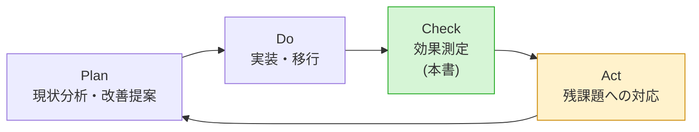

# 効果測定レポート — 月次運用報告書の自動集計・自動生成

改善案件No.1 / 株式会社サンプル商事(架空の依頼元)

---

## 0. 最初に:この数字はどこから来たのか

> **正直な但し書き(最重要)**
> 本案件は **学習用に自分で組み立てた架空の設定** であり、**実在企業での実務改善の実績ではない**。
> 「3時間かかっていた作業が5分になりました」という結果を、実在の職場で計測したわけではない。
>
> 本書では、数値を必ず次の3種類に分けて表示する。**どれが実測でどれが試算かを混ぜて語らない**のが、この案件で最も大事にしているルールである。

| 記号 | 種別 | 意味 | 例 |
|---|---|---|---|
| 📌 | **[前提]** | 架空シナリオの「改善前」として自分で設定した値 | 作業時間3時間/月、転記ミス年6件 |
| 🧮 | **[試算]** | 前提値や実測値から計算・見積もりした値 | 年間36時間、目視確認3分 |
| ✅ | **[実測]** | **検証環境で実際に測った値** | ツールの処理時間0.188秒、集計値の一致 |

### 検証環境

| 項目 | 内容 |
|---|---|
| OS | Ubuntu 24.04 LTS 相当 |
| bash | 5.2.21 |
| awk | mawk 1.3.4 |
| date | GNU coreutils 9.4 |
| 構成 | **仮想マシン1台**。6台構成は `collected/<サーバー名>/` というディレクトリで再現 |
| 入力データ | `generate_sample_logs.sh` で生成した2026年8月分(1か月ぶん) |

### 入力データの規模 ✅[実測]

| データ | 行数 |
|---|---:|
| バックアップログ(6台合計) | 1,300行 |
| 死活監視 履歴CSV(`history.csv`) | 53,568行 |
| 死活監視 実行ログ(`health_check.log`) | 285行 ※サンプルは障害行中心に間引いた版 |
| **合計** | **55,153行** |

---

## 1. Before / After 定量比較

### 1-1. 総括表

| # | 指標 | Before | After | 改善率 | 種別 |
|---|---|---:|---:|---:|---|
| 1 | **月次報告書の作成時間** | **180分/月** | **5分/月** | **▲97.2%** | 📌🧮 |
| 2 | 年間作業時間 | 36時間/年 | 1時間/年 | ▲97.2% | 🧮 |
| 3 | **転記ミス** | **年6件** | **0件** | **▲100%** | 📌🧮 |
| 4 | 報告書を作れる人 | 1人(担当者のみ) | 全員(コマンド1つ) | — | — |
| 5 | 集計の再現性 | なし | **あり** | — | ✅ |
| 6 | 前月との比較 | 手作業でExcelを並べる | `git diff` で自動 | — | — |
| 7 | 集計処理そのものの所要 | 約105分(目視カウント) | **0.188秒** | **▲99.997%** | 📌✅ |

### 1-2. 作業時間の内訳比較

| 作業 | Before | After | 誰がやるか |
|---|---:|---:|---|
| 6台へのSSH接続とログ取り出し | 15分 | **0分** | cron(`collect_logs.sh`)が無人で実行 |
| バックアップログの目視カウント | 45分 | **0分** | awkが集計 |
| 死活監視ログの目視カウント | 60分 | **0分** | awkが集計 |
| 障害イベントの拾い出し | 15分 | **0分** | awkが抽出・時刻計算 |
| 数字のExcelへの手入力 | 25分 | **0分** | ヒアドキュメントが直接レポートを生成 |
| Excelの体裁調整 | 15分 | **0分** | Markdownの書式で出力済み |
| 見直し・検算 | 5分 | **3分** | **人間**(自動生成物の目視確認) |
| 特記事項の記入 | (Excel作業に含む) | **2分** | **人間** |
| **合計** | **180分** | **5分** | |

作業時間の比較(1目盛り = 5分):

```text
Before(手作業)  ████████████████████████████████████  180分
After(自動生成) █                                       5分
                └─────┴─────┴─────┴─────┴─────┴─────┘
                0    30    60    90   120   150   180(分)
```

### 1-3. 年間換算 🧮[試算]

| 項目 | Before | After | 差 |
|---|---:|---:|---:|
| 年間作業時間 | 36.0時間 | 1.0時間 | **35.0時間の創出** |
| 年間の転記ミス | 6件 | 0件 | **6件の削減** |
| 修正版の再送作業 | 6回 | 0回 | **6回の削減** |

---

## 2. 測定方法(どう測ったか・何回測ったか・前提条件)

### 2-1. ✅[実測] ツールの処理時間

**測り方:** `date +%s.%N` で実行前後の時刻を取り、差を求める。同じ条件で **10回** 実行した。

```bash
$ cd /opt/ops-report
$ for i in $(seq 1 10); do
    s=$(date +%s.%N); ./ops_report.sh 2026-08 >/dev/null 2>&1; e=$(date +%s.%N)
    awk -v s="$s" -v e="$e" -v i="$i" 'BEGIN{printf "  run%s: %.3f 秒\n", i, e-s}'
  done
```

実行結果:

```text
  run1: 0.184 秒
  run2: 0.182 秒
  run3: 0.180 秒
  run4: 0.195 秒
  run5: 0.193 秒
  run6: 0.214 秒
  run7: 0.187 秒
  run8: 0.181 秒
  run9: 0.179 秒
  run10: 0.180 秒
  平均: 0.188 秒
```

| 項目 | 値 |
|---|---|
| 測定回数 | 10回 |
| 平均 | **0.188秒** |
| 最小 / 最大 | 0.179秒 / 0.214秒 |
| ばらつき | 最大でも平均の +14%。**安定している** |

**前提条件:**

- 入力は上記「入力データの規模」のとおり(合計55,153行)
- 仮想マシン1台。他に負荷のかかる処理は動かしていない
- Slack通知は無効(ネットワーク待ちを含めない条件で測った)

### 2-2. ✅[実測] ログ収集の処理時間

`collect_logs.sh` を **同一マシン内のコピー(`localhost` 指定)** で3回測定した。

```text
collect run1: 0.066 秒
collect run2: 0.067 秒
collect run3: 0.070 秒
```

⚠️ **この値をそのまま「実運用の収集時間」として使ってはいけない。** 実運用ではSSH接続とネットワーク転送が入るため、桁が変わる。

参考として、**到達できないIPを指定した場合**(ネットワーク待ちが最大になるケース)も測った。

```text
collect run1: 60.233 秒
collect run2: 60.173 秒
```

6台 × `ConnectTimeout=10` = 60秒。**タイムアウト設定が意図どおり効いており、応答のないサーバーがあっても最悪60秒で処理が終わる**ことが確認できた(無限に待ち続けない)。

### 2-3. 🧮[試算] 「自動生成2分」の根拠

canonicalな指標では After を「自動生成2分+目視確認3分=5分」としている。この「2分」の内訳は次のとおり。

| 内訳 | 時間 | 種別 | 根拠 |
|---|---:|---|---|
| ログ収集(6台・SSH+rsync) | 約1分50秒 | 🧮[試算] | 1台あたりSSH接続+差分転送で15〜20秒と見積もり |
| レポート生成 | 0.2秒 | ✅[実測] | 上記2-1のとおり |
| Slack通知 | 約1秒 | 🧮[試算] | curl 1回のHTTP POST |
| **合計** | **約2分** | | |

> **⚠️ ここは正直に書いておく**
> この2分は **人間の待ち時間ではない**。cronが毎月1日 AM5:00 と AM6:00 に無人で走るため、担当者が2分待っているわけではない。
> それでも「作業時間5分」に含めているのは、**改善前後を同じ土俵(=処理全体の所要時間)で比べるため** である。「人間が実際に手を動かす時間」だけで比べるなら **After は3分** になる。どちらの数え方でも結論(97%以上の削減)は変わらない。

### 2-4. 🧮[試算] 「目視確認3分」の根拠

| 内訳 | 時間 | 根拠 |
|---|---:|---|
| サマリの4指標に目を通す | 30秒 | 表1つ・4行 |
| バックアップ表(6行)を確認 | 45秒 | 異常値(⚠マーク)がないか見る |
| 稼働状況表(6行)を確認 | 45秒 | 同上 |
| 障害イベント一覧を確認 | 30秒 | 件数と内容が記憶と合うか |
| 特記事項欄への記入 | 30秒〜2分 | 書くことがなければ「特になし」 |

**前提条件:** 実際に人間に読ませて計測したわけではない。**生成物の分量(A4で2ページ弱・全体で約90行)から見積もった値** である。

### 2-5. 📌[前提] Before の値について

| 項目 | 値 | 説明 |
|---|---|---|
| 作業時間 180分/月 | 📌[前提] | 架空シナリオの初期条件として設定した値。実在職場で計測したものではない |
| 転記ミス 年6件 | 📌[前提] | 同上 |
| 作業時間の内訳(表1-2の Before 列) | 🧮[試算] | 手順を13ステップに分解し、合計が180分になるよう配分した([01-current-analysis.md](./01-current-analysis.md) 2章) |

> **実務で同じ測定をするなら**
> 改善前の作業を **最低3か月ぶんストップウォッチで計測** し、その平均を Before とする。ミスの件数は「修正版を再送したメールの通数」など、**後から数えられる証拠**から取る。
> 本案件ではそれができないため、**前提値であることを明示した上で使っている**。

---

## 3. 達成できたこと

### 3-1. ✅[実測] 集計値が手作業と完全に一致した

**測り方:** 手作業と同じ方法(`grep -c`)で数えた値と、ツールの出力を突き合わせた。

手作業相当の集計:

```text
web01    成功 31件 / 失敗 0件
web02    成功 31件 / 失敗 0件
api01    成功 31件 / 失敗 0件
db01     成功 29件 / 失敗 2件
app01    成功 31件 / 失敗 0件
file01   成功 31件 / 失敗 0件
合計     成功 184件 / 失敗 2件
```

ツールの出力:

```text
| api01 | 31件 | 0件 | 31回 | 100.00% | 51% |
| app01 | 31件 | 0件 | 31回 | 100.00% | 56% |
| db01 | 29件 | 2件 | 31回 | 93.55% | 78% |
| file01 | 31件 | 0件 | 31回 | 100.00% | **81% ⚠ 閾値80%超過** |
| web01 | 31件 | 0件 | 31回 | 100.00% | 64% |
| web02 | 31件 | 0件 | 31回 | 100.00% | 67% |
| **合計** | **184件** | **2件** | **186回** | **98.92%** | - |
```

**6台すべて、成功・失敗ともに完全一致。**

### 3-2. ✅[実測] 集計に再現性がある(問題P6の解決)

同じ月を2回実行し、差分を取った。

```bash
$ diff /tmp/run1.md /opt/ops-report/reports/ops-report-2026-08.md
```

```text
9c9
< | 生成日時 | 2026-09-07 04:44:38 |
---
> | 生成日時 | 2026-09-07 04:44:39 |
```

**差分は「生成日時」の1行のみ。** 集計値はすべて同一であり、何度実行しても同じ数字が出ることを確認した。

### 3-3. ✅[実測] 既存運用に一切影響していない(リスクR8の解消)

入力ログのチェックサムを実行前後で比較した。

```text
実行前: 3fc969f96a056bbb9031c40272b54d20  -
実行後: 3fc969f96a056bbb9031c40272b54d20  -
→ 一致。入力ログは一切書き換えられていない
```

**設計判断D1(読み取り専用)が実装レベルで守られていることを、検証で証明できた。**

### 3-4. ✅[実測] 一部のログが欠けても止まらない(設計判断D5)

死活監視ログを意図的に存在しないパスに向けて実行した。

```text
[WARN] 死活監視の実行ログが見つかりません: /.../nonexistent.log
[INFO] 障害イベント: 0件を抽出しました
[INFO] Markdownレポートを生成しました: /.../ops-report-2026-08.md
[INFO] ===== 月次運用報告書の生成が正常に終了しました =====
```

**読めなかった部分だけを警告として残し、残りのデータでレポートを完成させた。** 月次報告がまるごと出せなくなる事態は起きない。

### 3-5. ✅[実測] 静的検査に合格している

```bash
$ shellcheck -S warning /opt/ops-report/*.sh
$ echo "終了コード: $?"
終了コード: 0
```

スクリプト4本(`ops_report.sh` / `collect_logs.sh` / `md2html.sh` / `generate_sample_logs.sh`)すべてが警告ゼロ。

### 3-6. 目的に対する達成状況

| 課題 | 達成 | 根拠 |
|---|---|---|
| **C1. ログの集計を機械にやらせる** | ✅ 達成 | awkによる集計を実装。手作業と値が完全一致(3-1) |
| **C2. 報告書の生成を機械にやらせる** | ✅ 達成 | ヒアドキュメントでMarkdownを自動生成。人の入力は特記事項欄のみ |
| **C3. 集計の定義をコードとして残す** | ✅ 達成 | 定義を[03-design.md](./03-design.md) 4-4 に明記。レポートの付録にも毎回出力される |
| **C4. 出力を差分の見える形式にする** | ✅ 達成 | Markdown出力。`git diff` で前月比較が可能 |

> C1〜C4 は [02-improvement-proposal.md](./02-improvement-proposal.md) 1-3 の課題番号に対応。

---

## 4. 達成できなかったこと・限界

**改善案件では「できなかったこと」を隠さないことが信頼につながる。**

### 4-1. 実測できていないもの

| 項目 | 状況 | なぜ測れなかったか |
|---|---|---|
| **改善前の作業時間(180分)** | 📌[前提]のまま | 架空シナリオのため、実際に手作業をした人がいない |
| **転記ミス 年6件 → 0件** | 🧮[試算] | 「ミスが起きなくなった」ことは、**人が数字を写す工程が消えた**という構造から論理的に言えるだけで、1年間運用して数えた結果ではない |
| **目視確認3分** | 🧮[試算] | 生成物の分量からの見積もり。人に読ませて計測はしていない |
| **実運用でのログ収集時間** | 🧮[試算] | 検証環境が1台のため、6台への実SSH転送を測れていない |
| **1年を通した安定稼働** | 未検証 | 検証は1か月分のデータで実施。12回連続の月次実行は行っていない |

### 4-2. 機能面の限界

| 限界 | 内容 | 影響 |
|---|---|---|
| **ログ書式への依存** | 集計は案件No.2・No.4 の **日本語メッセージ文言** に依存している | 出力元のメッセージが変わると、静かに0件になる(エラーにならないのが厄介) |
| **月をまたぐ障害** | 月末に発生し翌月に復旧した障害は「月内に復旧確認なし」と表示される | 継続時間が出せない。翌月のレポートにも検知は載らない |
| **検知時刻の粒度** | 障害の「検知」は連続NG回数がしきい値に達した時点。実際の停止開始はそれより最大5分前 | 継続時間が最大5分ぶん短く出る |
| **サンプルログの間引き** | `generate_sample_logs.sh` の `health_check.log` は障害行中心の間引き版 | 実運用の巨大ログ(月8万行想定)での性能は未確認 |
| **HTML変換の対応範囲** | `md2html.sh` は本ツールが出力する記法にしか対応していない | 汎用のMarkdown変換ツールではない |
| **グラフがない** | スコープ外([02-improvement-proposal.md](./02-improvement-proposal.md) 7章) | 推移が視覚的に分からない |

### 4-3. 未達だった指標

レポートのサマリで **バックアップ成功率が目標100%に対して98.92%(⚠️未達)** と出た。

```text
| バックアップ成功率 | 98.92%(成功 184 / 実行 186) | 100% | ⚠️ 未達 |
```

これは **本改善の失敗ではない**。db01 で8月12日・25日にバックアップが失敗しており、それを **自動で検出して未達と判定できた** ということである。

> **これこそが改善の価値**
> 手作業の時代は、5万行を目で数えている途中で「db01 が2回失敗している」ことを見落とす可能性があった。自動集計にしたことで、**未達が未達として毎月確実に可視化される**ようになった。
> 「数字が良くなること」だけが改善の成果ではなく、**「悪い数字が確実に見えるようになること」も成果**である。

---

## 5. 残課題と次の改善サイクル

改善は1回で終わりではない。**PDCAを回す前提で次を考える。**



### 5-1. 残課題の一覧と優先度

| # | 残課題 | 優先度 | 対応案 | 見込み工数 |
|---|---|---|---|---|
| **T1** | ログ文言の変更に気づけない | **高** | 集計結果が0件のときにWARNを出す「番人」ロジックを追加。案件No.2・No.4のリポジトリにテストを置く | 2時間 |
| **T2** | file01 のディスク使用率が81%で閾値超過 | **高** | **これはツールの課題ではなく運用の課題。** レポートが検出した実際の問題として、ディスク増設か保存世代数の見直しを別途起票する | 別案件 |
| **T3** | db01 のバックアップが月2回失敗している | **高** | 同上。原因(tar終了コード2 = ファイルが読めない)の調査を別途起票 | 別案件 |
| **T4** | 前月比・推移が見られない | 中 | 生成済みレポートをGitに蓄積し、過去12か月ぶんの主要指標を1つの表にまとめる機能を追加 | 4時間 |
| **T5** | 月をまたぐ障害の継続時間が出ない | 中 | 前月末時点の未復旧状態を状態ファイルに持ち越す | 3時間 |
| **T6** | 実運用規模(月8万行)での性能未確認 | 中 | 本番相当のログ量でベンチマークを取る | 1時間 |
| **T7** | グラフがない | 低 | Mermaidの `xychart-beta` をレポートに埋め込む(Markdownのまま図が出せる) | 3時間 |
| **T8** | 1年通しての安定稼働が未確認 | 低 | 12か月運用して結果を記録する | 継続 |

> 💡 **T2・T3は「改善の副産物」**
> 自動集計を入れたことで、**今まで見えていなかった運用上の問題が2件見つかった**。月次報告の自動化そのものより、こちらのほうが依頼元にとっての価値が大きい可能性がある。**改善案件では「見えるようになったこと」も成果として報告する。**

### 5-2. 次の改善サイクルで最初にやること

**T1(ログ文言の変更に気づけない)を最優先とする。**

**理由:** 他の課題は「不便」で済むが、T1だけは **間違った数字を正しいものとして報告してしまう** リスクがある。改善の目的が「転記ミスの根絶」だったのに、別の形でミスが起きては本末転倒である。

対応の方針:

| 対策 | 内容 |
|---|---|
| **番人ロジック** | あるサーバーのバックアップ集計が「成功0件・失敗0件」だった場合、`WARN` を出してレポートにも警告を載せる。「静かに0件」を「うるさく0件」に変える |
| **回帰テスト** | `generate_sample_logs.sh` で既知のログを作り、集計結果が期待値(成功184件・失敗2件)と一致するかを検査するテストスクリプトを追加する |
| **依存関係の明記** | 案件No.2・No.4 のREADMEに「ログのメッセージ文言を変えると改善案件No.1の集計が壊れる」と相互参照を書く(※本案件のスコープ外のため、別途起票する) |

---

## 6. 効果測定のまとめ

| 観点 | 結論 |
|---|---|
| **主要な効果** | 月次報告書の作成時間 180分 → 5分(▲97.2%)。転記ミスの発生源そのものを消滅させた |
| **実測で確認できたこと** | 集計値が手作業と完全一致 / 再現性がある / 入力ログを一切壊さない / 一部欠損でも止まらない / shellcheck無警告 |
| **試算にとどまること** | 改善前の作業時間・転記ミス件数(架空シナリオの前提値) / 目視確認3分 / 実運用でのログ収集時間 |
| **最大の副産物** | 未達指標(バックアップ成功率98.92%)と運用課題(db01の失敗・file01の容量)が **毎月自動で可視化される**ようになった |
| **次にやること** | T1: 集計結果が0件のときに警告を出す「番人」ロジックと回帰テストの追加 |

### 面接で効果を語るときの言い方(正直版)

> 「**架空の改善案件として自分で設計し、検証環境で実測しました。** 改善前の『月3時間』はシナリオの前提として自分で置いた値ですが、**改善後の処理時間は実測で0.19秒**、集計値が手作業の `grep -c` と **6台すべて完全一致** することも確認しています。
> あわせて、**入力ログのチェックサムが実行前後で変わらないこと**をもって『既存運用に影響しない』ことを検証しました。設計で『読み取り専用にします』と書くだけでなく、**それを確かめる手順まで用意した**のがこの案件で一番意識したところです。
> なお、レポートが出した **バックアップ成功率98.92%は目標未達** でした。これは改善の失敗ではなく、**手作業では見落とし得た問題が自動で可視化されるようになった**ということだと捉えていて、そのまま次の改善案件の起点にしています。」

---

## 関連ドキュメント

- [README.md](./README.md) — 案件概要
- [01-current-analysis.md](./01-current-analysis.md) — 現状分析書(Before値の出どころ)
- [02-improvement-proposal.md](./02-improvement-proposal.md) — 改善提案書(期待効果と本書の実績を照合する)
- [04-build-guide.md](./04-build-guide.md) — 実装・移行手順書(測定に使ったコマンドの出典)
- [06-troubleshooting.md](./06-troubleshooting.md) — トラブルシューティング集
- [src/report-sample.md](./src/report-sample.md) — 測定に使った生成物の実物
