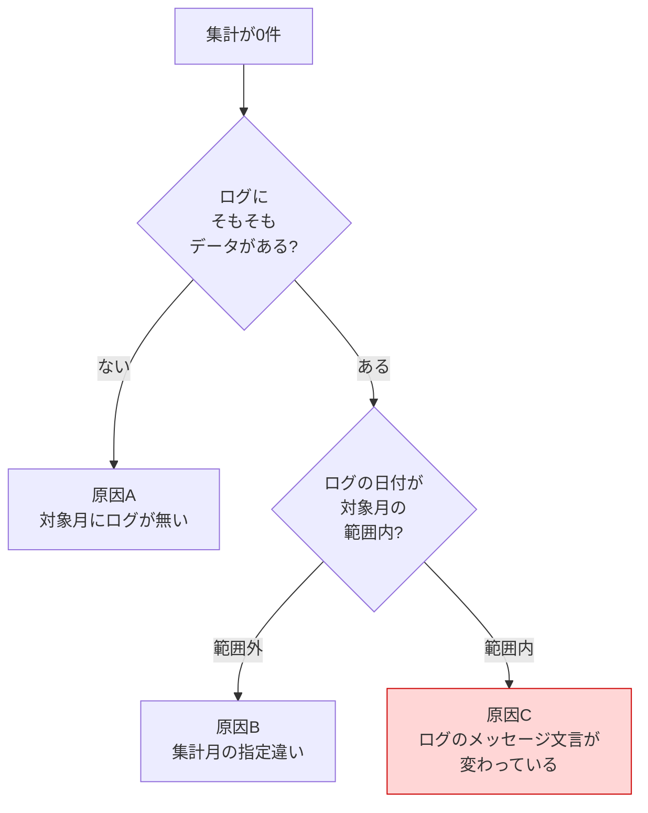
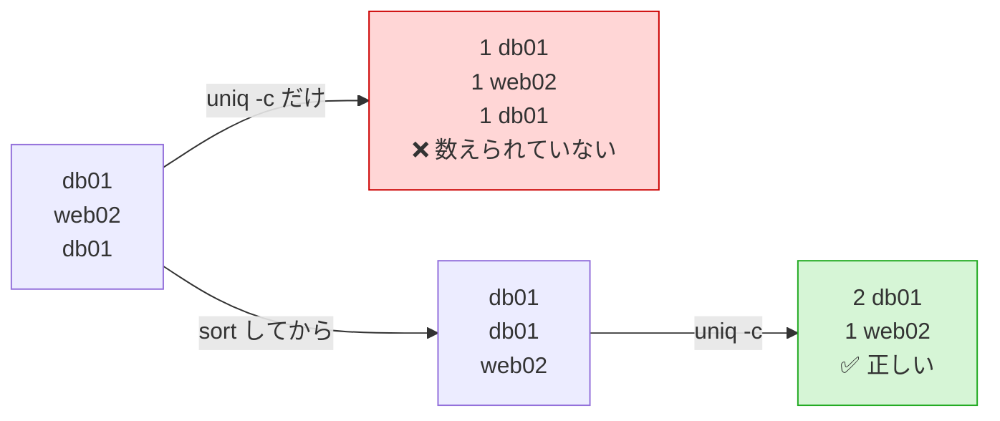
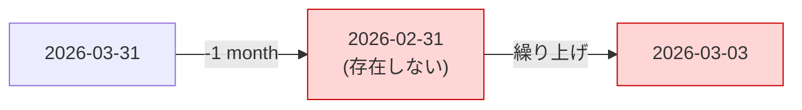
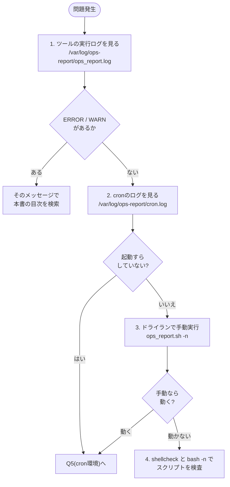

# トラブルシューティング集 — 月次運用報告書の自動集計・自動生成

改善案件No.1 / 株式会社サンプル商事(架空の依頼元)

> **正直な但し書き**
> 本案件は **学習用に自分で組み立てた架空の設定** である。
> Q1〜Q3・Q4・Q6・Q8・Q9・Q10 のエラーメッセージと出力は、**検証環境で実際に問題を再現させて得たもの** をそのまま貼っている。
> 一方、**cron・SSH接続・Slack通知に関わる出力(Q4の一部・Q5・Q7)は、検証環境にcronサービス・他ホスト・Slackが無いため実行しておらず、一般的な例として示している**。該当箇所にはその旨を明記した。

---

## 目次

| # | 症状 | 分類 |
|---|---|---|
| [Q1](#q1-設定ファイルが見つかりませんと出て起動しない) | `設定ファイルが見つかりません` で起動しない | 設定 |
| [Q2](#q2-対象月の書式が不正ですと言われる) | `対象月の書式が不正です` と言われる | 引数 |
| [Q3](#q3-集計結果が全部0件になる) | 集計結果が全部0件になる | 集計 |
| [Q4](#q4-サーバーが1台足りないレポートに出てこない) | サーバーが1台足りない | 収集 |
| [Q5](#q5-cronでは動かないが手で実行すると動く) | cronでは動かないが手動なら動く | cron |
| [Q6](#q6-value-too-great-for-base-というエラーが出る) | `value too great for base` エラー | 日付計算 |
| [Q7](#q7-slackに通知が飛ばない) | Slackに通知が飛ばない | 通知 |
| [Q8](#q8-uniq--cの件数がおかしい同じ名前が何度も出る) | `uniq -c` の件数がおかしい | 集計 |
| [Q9](#q9-ヒアドキュメントがファイルの最後まで止まらない) | ヒアドキュメントが終端しない | 実装 |
| [Q10](#q10-3月31日に実行すると集計月が3月になる) | 3月31日に実行すると集計月がずれる | 日付計算 |

---

## Q1. 「設定ファイルが見つかりません」と出て起動しない

### 症状

```bash
$ ./ops_report.sh 2026-08
[ERROR] 設定ファイルが見つかりません: /tmp/nothing.conf
$ echo $?
1
```

### 原因

`ops_report.sh` は **同じディレクトリにある `ops_report.conf`** を読み込む設計になっている。次のどれかに該当している。

| 原因 | 見分け方 |
|---|---|
| A. `ops_report.conf` をコピーし忘れた | `ls` で確認 |
| B. スクリプトだけを別の場所に置いた | 設定ファイルが同じディレクトリにない |
| C. 環境変数 `OPS_REPORT_CONF` に古いパスが残っている | `echo $OPS_REPORT_CONF` |

### 対処

```bash
# A・B の場合: 設定ファイルを同じディレクトリに置く
$ ls -l /opt/ops-report/
$ sudo cp ~/automation/improvements/01-ops-report-automation/src/ops_report.conf /opt/ops-report/
$ sudo chmod 600 /opt/ops-report/ops_report.conf

# C の場合: 環境変数を解除する
$ unset OPS_REPORT_CONF
$ echo "OPS_REPORT_CONF=[$OPS_REPORT_CONF]"
OPS_REPORT_CONF=[]
```

> 💡 **なぜ環境変数で上書きできるようにしてあるのか**
> 検証用の設定ファイルを使いたいときに、**本番の `ops_report.conf` を書き換えずに済ませる**ため。便利な反面、`export` したまま忘れると本件のように混乱するので、検証が終わったら `unset` する習慣をつける。

---

## Q2. 「対象月の書式が不正です」と言われる

### 症状

```bash
$ ./ops_report.sh 202608
[ERROR] 対象月の書式が不正です: 202608(正しくは YYYY-MM)
$ echo $?
1
```

### 原因

対象月の指定は **`YYYY-MM`(ハイフン区切り)** 固定である。次のような書き方はすべて弾かれる。

| 書き方 | 判定 | 理由 |
|---|---|---|
| `2026-08` | ✅ OK | 正しい |
| `202608` | ❌ NG | ハイフンがない |
| `2026/08` | ❌ NG | 区切りがスラッシュ |
| `2026-8` | ❌ NG | 月が2桁でない |
| `2026-13` | ❌ NG | 13月は存在しない |
| `2026-08-01` | ❌ NG | 日まで書かれている |

### 対処

```bash
$ ./ops_report.sh 2026-08     # 正しい書き方
$ ./ops_report.sh             # 引数なし = 前月が自動で選ばれる(推奨)
```

> 💡 **なぜここまで厳しくチェックするのか**
> 書式が緩いと、`2026-8` のようなつもり違いが **「該当データ0件」というレポート** になって出てしまう。**エラーで止まるほうが、間違った報告書が出るよりはるかに安全**である。エラーメッセージは「異常を知らせる機能」であって、じゃま者ではない。

---

## Q3. 集計結果が全部0件になる

### 症状

```text
2026-09-07 04:52:59 [INFO] api01: バックアップ 成功0件 / 失敗0件 / ディスク最大0%
2026-09-07 04:52:59 [INFO] app01: バックアップ 成功0件 / 失敗0件 / ディスク最大0%
...
2026-09-07 04:53:00 [INFO] 死活監視: 総チェック 0回 / OK 0回 / 平均稼働率 N/A%
```

レポート側はこう出る(エラーにはならない)。

```text
| バックアップ成功率 | N/A%(成功 0 / 実行 0) | 100% | - 判定不可 |
| 死活監視 平均稼働率 | N/A%(OK 0 / チェック 0) | 99.5% | - 判定不可 |
```

### 原因と切り分け

**この症状は原因が3つあり、順番に切り分ける。**



#### 原因A・B の確認:ログの中身と日付を見る

```bash
# ログの最初と最後の日付を見る
$ head -1 /var/log/ops-report/collected/db01/backup.log
2026-08-01 03:00:01 [INFO] ===== バックアップ処理を開始します =====
$ tail -1 /var/log/ops-report/collected/db01/backup.log
2026-08-31 03:00:11 [INFO] ===== バックアップ処理が正常に終了しました =====
```

指定した対象月がこの範囲に入っているかを確認する。例えば `2025-01` を指定すれば、当然0件になる。

#### 原因C の確認:文言が変わっていないか

**これが一番厄介。エラーにならず静かに0件になる。**

```bash
# 集計に使っている文言が実際にログに存在するか確認する
$ grep -c "バックアップ作成に成功しました" /var/log/ops-report/collected/db01/backup.log
29

# 0 が返ってきたら、実際のメッセージを見て文言を確かめる
$ grep "バックアップ" /var/log/ops-report/collected/db01/backup.log | head -3
```

### 対処

| 原因 | 対処 |
|---|---|
| A. 対象月のログが無い | `collect_logs.sh` を実行してログを収集する。または対象月を正しく指定する |
| B. 集計月の指定違い | 引数を省略して「前月」を使う |
| C. 文言が変わった | `ops_report.sh` の awk 部分の検索文字列を、実際のログの文言に合わせて修正する |

原因Cのときに直す場所:

```bash
# ops_report.sh の該当箇所(コメントに出典が書いてある)
if (index($0, "バックアップ作成に成功しました") > 0) ok++
if (index($0, "バックアップ作成に失敗しました") > 0) ng++
```

> ⚠️ **これは既知の弱点(効果測定レポートの残課題T1)**
> 集計は案件No.2・No.4 が出す **日本語メッセージそのもの** に依存している。出力元のメッセージを変えると静かに壊れる。
> 対策として「集計が0件のときに警告を出す番人ロジック」を次の改善サイクルで追加する予定。詳しくは [05-effect-measurement.md](./05-effect-measurement.md) 5章を参照。

---

## Q4. サーバーが1台足りない(レポートに出てこない)

### 症状

```text
2026-09-07 04:52:59 [INFO] web01: バックアップ 成功31件 / 失敗0件 / ディスク最大64%
2026-09-07 04:52:59 [WARN] web99: バックアップログが見つかりません(/tmp/q4/collected/web99/backup.log)。集計から除外します
```

レポートの「対象サーバー」の台数が想定より少なくなる。

### 原因

**設計どおりの動作である(設計判断D5)。** ログが読めないサーバーは、エラーで止まる代わりに **警告を残して集計から除外** する。1台のトラブルで月次報告全体が出せなくなるのを避けるための仕様。

原因は次のどれか。

| 原因 | 確認方法 |
|---|---|
| A. `collect_logs.sh` が失敗している | `grep ERROR /var/log/ops-report/ops_report.log` |
| B. SSH接続ができない | `ssh -o BatchMode=yes ops@192.168.1.11 'echo OK'` |
| C. そのサーバーでバックアップが動いていない | 対象サーバーで `ls -l /var/log/backup-automation/` |
| D. `servers.conf` のパスが間違っている | ファイルの記述を確認 |

### 対処

```bash
# まず収集ログでどこで失敗したかを見る
$ sudo grep -E 'ERROR|WARN' /var/log/ops-report/ops_report.log | tail -10

# SSHが通るか単独で確認する(BatchModeでパスワード認証を封じる)
# ※ この2行は検証環境に他ホストが無いため未実行。出力は期待値の例
$ sudo ssh -o BatchMode=yes -o ConnectTimeout=10 ops@192.168.1.11 'echo 接続OK'
接続OK

# 通らない場合は公開鍵を配り直す
$ sudo ssh-copy-id -i /root/.ssh/id_ed25519_opsreport.pub ops@192.168.1.11
```

収集し直してからレポートを再生成する。

```bash
$ sudo /opt/ops-report/collect_logs.sh
$ sudo /opt/ops-report/ops_report.sh 2026-08
```

> 💡 **ポイント: 応答のないサーバーがあっても最悪60秒で終わる**
> `collect_logs.sh` は `ConnectTimeout=10` を指定しているため、到達できないサーバーは10秒で諦める。検証環境で到達不能なIPを6台ぶん指定したところ、**60.2秒** で正常に処理を終えた([05-effect-measurement.md](./05-effect-measurement.md) 2-2)。無限に待ち続けてcronが詰まることはない。

---

## Q5. cronでは動かないが、手で実行すると動く

### 症状

手動実行では成功するのに、cronの時刻になっても報告書が生成されない。Slack通知も来ない。

### 原因

**cron絡みのトラブルで圧倒的に多いのがこれ。** cronは対話ログイン時とは違い、**最小限の環境変数しか持たない**。

| 対話ログイン時 | cron実行時 |
|---|---|
| `PATH` に `/usr/local/bin` などが全部入っている | `PATH=/usr/bin:/bin` 程度しかない |
| `~/.bashrc` が読まれる | **読まれない** |
| カレントディレクトリが自由 | ホームディレクトリ |

そのため `rsync` や `curl` が「見つからない」となって失敗する。

### 確認

```bash
# cronのログを見る(標準エラー出力がここに集まる設計にしてある)
$ sudo tail -20 /var/log/ops-report/cron.log
```

```bash
# cron環境でのPATHを実際に確かめる(一時的に登録して結果を見る)
$ sudo crontab -e
```

```cron
* * * * * echo "PATH=$PATH" >> /tmp/cron-path.txt
```

1分待ってから確認する。

```bash
$ cat /tmp/cron-path.txt
PATH=/usr/bin:/bin
```

> ⚠️ **この出力は一般的な例**
> 検証環境にはcronサービスを導入していないため、上の値は実行して得たものではなく、Debian系Linuxのcronにおける典型的な既定値を示している。**自分の環境では必ず上のやり方で実測してから対処すること**(ディストリビューションによって既定値は異なる)。

### 対処

crontab の先頭で `SHELL` と `PATH` を明示する。

```cron
SHELL=/bin/bash
PATH=/usr/local/sbin:/usr/local/bin:/usr/sbin:/usr/bin:/sbin:/bin

0 5 1 * * /opt/ops-report/collect_logs.sh >> /var/log/ops-report/cron.log 2>&1
0 6 1 * * /opt/ops-report/ops_report.sh >> /var/log/ops-report/cron.log 2>&1
```

**チェックリスト:**

| # | 確認項目 | コマンド |
|---|---|---|
| 1 | `PATH` を書いたか | `sudo crontab -l \| head -3` |
| 2 | スクリプトを **絶対パス** で書いたか | 相対パスは動かない |
| 3 | 実行権限があるか | `ls -l /opt/ops-report/*.sh` |
| 4 | `2>&1` でエラーもログに落としているか | 書いていないとエラーが闇に消える |
| 5 | cronサービス自体が動いているか | `systemctl status cron` |

> ⚠️ **注意: `2>&1` を省略しない**
> `>> cron.log` だけだと標準出力しか記録されず、**肝心のエラーメッセージがどこにも残らない**。「動かないのに理由が分からない」状態の大半はこれが原因。

---

## Q6. `value too great for base` というエラーが出る

### 症状

```bash
$ d="08"
$ echo $((d + 1))
bash: 08: value too great for base (error token is "08")
```

### 原因

bashは **`0` で始まる数字を8進数だと解釈する**。8進数には `8` や `9` という数字が存在しないため、「基数に対して大きすぎる値」というエラーになる。

| 値 | bashの解釈 | 結果 |
|---|---|---|
| `07` | 8進数の7 = 10進数の7 | 動くが値がずれる可能性がある |
| `08` | 8進数の8 → **存在しない** | エラー |
| `09` | 8進数の9 → **存在しない** | エラー |

**月次レポートでは `date '+%m'` や `'+%d'` が `08` `09` を返すため、8月・9月に限って壊れる**という、非常に見つけにくいバグになる。

### 対処

`10#` を付けて「10進数として読め」と明示する。

```bash
$ d="08"
$ echo $((10#$d + 1))
9
```

`ops_report.sh` でもこの書き方を使っている。

```bash
DAYS_IN_MONTH="$(date -d "$END_DATE" '+%d')"
DAYS_IN_MONTH="$((10#${DAYS_IN_MONTH}))"   # "08" を8進数と誤解釈させない
```

> 💡 **ポイント: 8月と9月にしか出ないバグ**
> 1〜7月にテストしても再現しない。**日付を扱うコードは、必ず「8」「9」「31日」「うるう年」を意識してテストする。**

---

## Q7. Slackに通知が飛ばない

### 症状

レポートは正常に生成されるのに、Slackにメッセージが届かない。

### 原因の切り分け

```bash
# まずログを見る。設定漏れなら警告が残っている
$ sudo grep -i slack /var/log/ops-report/ops_report.log | tail -3
```

**ケース1: Webhook URLが未設定**

```text
2026-09-07 04:58:20 [WARN] SLACK_WEBHOOK_URL が未設定のため、Slack通知をスキップしました
```

**ケース2: そもそも通知が無効**

```bash
$ sudo grep ENABLE_SLACK_NOTIFY /opt/ops-report/ops_report.conf
ENABLE_SLACK_NOTIFY=false
```

**ケース3: URLは設定済みだが届かない** → curlで直接試す。

```bash
$ curl -s -X POST -H 'Content-type: application/json' \
    --data '{"text": "疎通テスト"}' \
    "<YOUR_SLACK_WEBHOOK_URL>"
```

| curlの応答 | 意味 | 対処 |
|---|---|---|
| `ok` | 成功 | Slack側のチャンネルを確認する |
| `invalid_token` | URLが間違っている | Webhook URLを発行し直す |
| `no_service` | Webhookが削除されている | Slack App側で再作成する |
| (何も返らない・タイムアウト) | 外部への通信が遮断されている | ファイアウォール・プロキシ設定を確認 |

### 対処

```bash
$ sudo vi /opt/ops-report/ops_report.conf
```

```bash
ENABLE_SLACK_NOTIFY=true
SLACK_WEBHOOK_URL="<YOUR_SLACK_WEBHOOK_URL>"
```

権限を確認する。

```bash
$ ls -l /opt/ops-report/ops_report.conf
-rw------- 1 root root 4839 Sep  7 04:57 /opt/ops-report/ops_report.conf
```

> ⚠️ **注意: Webhook URLをGitに入れない**
> リポジトリの `src/ops_report.conf` は **`<YOUR_SLACK_WEBHOOK_URL>` というプレースホルダーのまま** にしてある。実物のURLを書いてコミットすると、GitHubの秘密情報検知に引っかかるうえ、**そのURLを知った誰もがそのSlackチャンネルに投稿できてしまう**。

> 💡 **ポイント: 通知が無くてもレポート生成は失敗させない**
> Webhookが未設定でも、警告を残すだけで処理は続く。「通知の設定を忘れたせいで月次報告そのものが出ない」という本末転倒を避けるための設計。

---

## Q8. `uniq -c` の件数がおかしい(同じ名前が何度も出る)

### 症状

```bash
$ cat /tmp/q6.txt
db01
web02
db01
$ uniq -c /tmp/q6.txt
      1 db01
      1 web02
      1 db01
```

`db01` が2回あるのに「1件」が2行出てしまう。

### 原因

**`uniq` は「隣り合う行」しか比較しない。** 離れた場所にある同じ行は、別のものとして扱われる。



### 対処

**`sort | uniq -c` は必ずセットで使う。**

```bash
$ sort /tmp/q6.txt | uniq -c
      2 db01
      1 web02
```

件数の多い順に並べたいときは、さらに `sort -rn` を通す。

```bash
$ sort /tmp/q6.txt | uniq -c | sort -rn
      2 db01
      1 web02
```

| コマンド | 役割 |
|---|---|
| `sort` | 同じ行を隣り合わせに並べる(**これが必須**) |
| `uniq -c` | 隣り合う同じ行をまとめて件数を付ける |
| `sort -rn` | `-n` = 数値順、`-r` = 逆順。つまり多い順 |

`ops_report.sh` でも同じ書き方をしている。

```bash
INCIDENT_RANK="$(printf '%s\n' "${INCIDENT_SERVERS[@]}" | sort | uniq -c | sort -rn)"
```

---

## Q9. ヒアドキュメントがファイルの最後まで止まらない

### 症状

スクリプトを実行すると、レポートに **本来コードであるはずの行がそのまま書き込まれる**。または `unexpected EOF while looking for matching` というエラーで終わる。

```text
./ops_report.sh: line 512: warning: here-document at line 300 delimited by end-of-file (wanted `EOF')
```

### 原因

**終端の `EOF` が行頭にない。** 前に空白やタブがあると、bashはそれを終端と認識しない。

```bash
# ❌ 間違い: EOF の前にインデントがある
    cat > report.md <<EOF
# レポート
    EOF          ← これは終端として認識されない

# ✅ 正しい: EOF は必ず行頭
    cat > report.md <<EOF
# レポート
EOF
```

### 対処

| 対処 | 内容 |
|---|---|
| **基本** | 終端の `EOF` を **必ず行頭(1桁目)から書く** |
| どうしてもインデントしたい | `<<-EOF`(ハイフン付き)を使う。ただし **タブのみ** が除去され、半角スペースは除去されない |
| 確認 | `bash -n ops_report.sh` で構文チェックする(実行せずに文法だけ見る) |

```bash
$ bash -n /opt/ops-report/ops_report.sh
$ echo "終了コード: $?(0 = 構文エラーなし)"
終了コード: 0(0 = 構文エラーなし)
```

**そのほかヒアドキュメントで詰まりやすい点:**

| 症状 | 原因 | 対処 |
|---|---|---|
| `${変数}` が展開されずそのまま出る | `<<'EOF'` と引用符を付けている | 展開したいなら `<<EOF`(引用符なし) |
| `$` や `` ` `` が消える・勝手に実行される | `<<EOF` で展開が効いている | 展開させたくないなら `<<'EOF'`、部分的に逃がすなら `\$` `` \` `` |
| Markdownのインラインコードが壊れる | バッククォートがコマンド置換と解釈された | `` \` `` とエスケープする |

---

## Q10. 3月31日に実行すると、集計月が3月になる

### 症状

「前月」を集計するはずなのに、**3月31日に実行したときだけ** 対象月が当月(3月)になってしまう。

### 原因

`date -d "-1 month"` を使っていると起きる。

```bash
$ date -d '2026-03-31 -1 month' '+%Y-%m-%d'
2026-03-03
```

2月には31日が存在しない。GNU date は「2026年2月31日」を **3日ぶん繰り上げて3月3日** と解釈する。



**この不具合は月末31日に実行したときだけ発生する。** 1日〜28日にテストしていれば見逃す。

### 対処

**「今月1日から1日引く」** という、月末日に依存しない手順を使う。`ops_report.sh` はこの方式を採用している。

```bash
$ first_day_this_month="$(date '+%Y-%m-01')"
$ last_prev="$(date -d "${first_day_this_month} -1 day" '+%Y-%m-%d')"
$ first_prev="$(date -d "${last_prev}" '+%Y-%m-01')"
$ echo "前月初日: ${first_prev} / 前月末日: ${last_prev}"
前月初日: 2026-08-01 / 前月末日: 2026-08-31
```

**なぜ安全なのか:** どの月にも「1日」は必ず存在する。存在する日付から1日引くだけなので、**存在しない日付が一度も生まれない**。

うるう年も自動的に正しく扱える。

```bash
$ date -d '2026-03-01 -1 day' '+%Y-%m-%d'   # 平年
2026-02-28
$ date -d '2028-03-01 -1 day' '+%Y-%m-%d'   # うるう年
2028-02-29
```

### 検証のコツ

日付を扱うコードは、次のケースを必ず試す。

| テストケース | 確認したいこと |
|---|---|
| 1月1日に実行 | 前月が「前年12月」になるか |
| 3月1日・3月31日に実行 | 2月の日数を正しく扱えるか |
| うるう年の3月1日 | 2月29日を認識できるか |
| 8月・9月の日付 | 8進数の罠(Q6)を踏まないか |

```bash
# 対象月を明示的に指定すれば、任意の月をいつでも検証できる
$ ./ops_report.sh 2026-02
$ ./ops_report.sh 2028-02
```

---

## 困ったときの調査手順(共通)

問題の種類が分からないときは、次の順に見る。



### よく使う調査コマンド

```bash
# ツールの実行ログの直近20行
$ sudo tail -20 /var/log/ops-report/ops_report.log

# エラーと警告だけを抜き出す
$ sudo grep -E '\[(ERROR|WARN)\]' /var/log/ops-report/ops_report.log | tail -20

# cronからの出力
$ sudo tail -20 /var/log/ops-report/cron.log

# ファイルを保存せず、結果だけ画面で確認する
$ sudo /opt/ops-report/ops_report.sh -n 2>&1 | less

# スクリプトの静的検査(実行せずに検査)
$ shellcheck -S warning /opt/ops-report/*.sh
$ bash -n /opt/ops-report/ops_report.sh

# 入力ログが正しく集まっているか
$ ls -l /var/log/ops-report/collected/*/backup.log
```

---

## 関連ドキュメント

- [README.md](./README.md) — 案件概要
- [03-design.md](./03-design.md) — 改善設計書(技術要素の詳しい解説)
- [04-build-guide.md](./04-build-guide.md) — 実装・移行手順書
- [05-effect-measurement.md](./05-effect-measurement.md) — 効果測定レポート(残課題T1がQ3の弱点への対応)
- [projects/02-backup-automation/05-troubleshooting.md](../../projects/02-backup-automation/05-troubleshooting.md) — 入力ログ側(バックアップ)のトラブルシューティング
- [projects/04-server-health-check/05-troubleshooting.md](../../projects/04-server-health-check/05-troubleshooting.md) — 入力ログ側(死活監視)のトラブルシューティング
