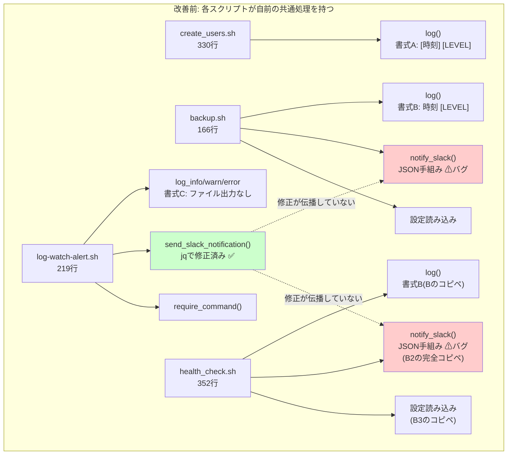

# 01. 現状分析書(As-Is)

改善案件No.2「コピペで増えた運用スクリプトを共通ライブラリ化して保守性と潜在バグを改善」

---

## 0. この文書の位置づけと前提

この文書は、改善に着手する前に**現状を事実として記録する**ためのものである。

改善案件では「なんとなく汚いから直す」では通用しない。**どのファイルの何行目に、どういう問題が、どれだけの量あるのか**を数えて示し、その問題が実際にどんな害を生むのかを検証して初めて、改善する価値があると説明できる。

> **前提の確認**
> - 案件設定(依頼元・背景)は学習用の**架空の設定**である。
> - しかし**分析対象のコードは架空ではない**。このリポジトリの `projects/` 配下に実在する、自分自身が書いた成果物である。以下に引用するコードはすべて実物であり、行番号も実ファイルのものである。
> - 分析対象のファイルは**一切書き換えていない**。改善前の証拠として原状のまま保存する方針である。

**分析対象(4ファイル)**

| # | ファイル | 総行数 |
|---|---|---|
| 1 | `projects/01-user-account-automation/src/create_users.sh` | 330行 |
| 2 | `projects/02-backup-automation/src/backup.sh` | 166行 |
| 3 | `projects/03-log-monitoring-alert/src/log-watch-alert.sh` | 219行 |
| 4 | `projects/04-server-health-check/src/health_check.sh` | 352行 |

---

## 1. 問題1: ログ出力の書式が3種類に分裂している

### 1-1. 実物のコード(4ファイルからの引用)

**案件No.1 `create_users.sh` の161〜168行目**

```bash
log() {
    local level="$1"
    shift
    local message="$*"
    local now
    now=$(date '+%Y-%m-%d %H:%M:%S')
    echo "[${now}] [${level}] ${message}" | tee -a "$LOG_FILE"
}
```

**案件No.2 `backup.sh` の50〜57行目**

```bash
log() {
    local level="$1"
    shift
    local message="$*"
    local timestamp
    timestamp="$(date '+%Y-%m-%d %H:%M:%S')"
    echo "${timestamp} [${level}] ${message}" | tee -a "$LOG_FILE"
}
```

**案件No.3 `log-watch-alert.sh` の48〜50行目**

```bash
log_info()  { printf '[%s] [INFO]  %s\n'  "$(date '+%Y-%m-%d %H:%M:%S')" "$*"; }
log_warn()  { printf '[%s] [WARN]  %s\n'  "$(date '+%Y-%m-%d %H:%M:%S')" "$*"; }
log_error() { printf '[%s] [ERROR] %s\n' "$(date '+%Y-%m-%d %H:%M:%S')" "$*" >&2; }
```

**案件No.4 `health_check.sh` の62〜69行目**

```bash
log() {
    local level="$1"
    shift
    local message="$*"
    local timestamp
    timestamp="$(date '+%Y-%m-%d %H:%M:%S')"
    echo "${timestamp} [${level}] ${message}" | tee -a "$LOG_FILE"
}
```

### 1-2. 分かったこと

- **No.2 と No.4 の `log()` は1文字も違わない完全なコピペ**である(変数名 `timestamp` の綴りまで同一)。
- **No.1 は No.2 とほぼ同じだが、2か所だけ違う**。ローカル変数名が `now` か `timestamp` か、そして**出力書式が違う**(日時が `[` `]` で囲まれているかどうか)。
- **No.3 だけ設計方針そのものが違う**。レベルごとに別関数を定義し、`tee` を使わず `printf` のみでファイル出力を行わない。

### 1-3. 生成されるログ行の比較

実際に4本を動かすと、次の3種類の行が出力される。

| 案件 | 出力される行の例 |
|---|---|
| No.1 | `[2026-09-07 04:40:17] [INFO] ユーザー tyamada を作成しました。` |
| No.2 / No.4 | `2026-09-07 04:37:57 [INFO] バックアップを作成します` |
| No.3 | `[2026-09-07 04:41:54] [INFO]  監視を開始します`(INFO の後ろが**半角スペース2つ**) |

3種類の書式が混在している。No.3 は桁揃えのために `INFO` と `WARN` の後ろに空白を1つ多く入れており、これも書式の差である。

### 1-4. この不統一が招く実害

**害1: 複数ログを時系列に並べられない**

複数サーバー・複数スクリプトのログをまとめて時系列で追いたいとき、通常は次のようにする。

```bash
cat create_users.log backup.log health_check.log | sort
```

`sort` は行を先頭から文字として比較する。No.2/No.4 の行は `2026-...` で始まり、No.1 の行は `[2026-...` で始まる。半角の `[`(ASCIIコード91)は数字 `2`(同50)より大きいため、**No.1 のログだけがすべて後ろにまとまってしまい、時系列が崩れる**。

**害2: レベルの抽出方法をファイルごとに変えなければならない**

「ERROR だけを数えたい」という集計は運用でよく発生する。

| 案件 | レベルを取り出す書き方 |
|---|---|
| No.2 / No.4 | `awk '{print $3}'`(1列目=日付、2列目=時刻、3列目=`[INFO]`) |
| No.1 | `awk '{print $3}'` だと `[INFO]` が取れるが、1列目が `[2026-09-07` になる |
| No.3 | 同上に加え、レベル後の空白数が違うため列位置がずれる場合がある |

つまり**1本の集計コマンドで4本のログを扱えない**。ログ集約基盤(Fluentd や Loki など)へ取り込む場合も、書式ごとに解析ルールを3つ書き分ける必要が出てくる。

**害3: 出力先の方針も揃っていない**

| 案件 | 標準出力 | ログファイル | ERRORの出力先 |
|---|---|---|---|
| No.1 | あり | あり(`tee -a`) | 標準出力 |
| No.2 | あり | あり(`tee -a`) | 標準出力 |
| No.3 | あり | **なし** | 標準エラー出力 |
| No.4 | あり | あり(`tee -a`) | 標準出力 |

`cron`(=決まった時刻に処理を自動実行するLinuxの仕組み)は、実行したコマンドが**標準エラー出力に何か出した場合にだけ**管理者へメールを送る設定にできる。No.1/No.2/No.4 はERRORも標準出力に出しているため、この仕組みで異常を拾えない。

---

## 2. 問題2: Slack通知が3実装に分裂し、うち2つに潜在バグがある

### 2-1. 実物のコード

**案件No.2 `backup.sh` の62〜72行目**

```bash
notify_slack() {
    local message="$1"

    if [ "${ENABLE_SLACK_NOTIFY}" != "true" ]; then
        return 0
    fi

    curl -s -X POST -H 'Content-type: application/json' \
        --data "{\"text\": \"${message}\"}" \
        "${SLACK_WEBHOOK_URL}" > /dev/null
}
```

**案件No.4 `health_check.sh` の73〜83行目**

```bash
notify_slack() {
    local message="$1"

    if [ "${ENABLE_SLACK_NOTIFY}" != "true" ]; then
        return 0
    fi

    curl -s -X POST -H 'Content-type: application/json' \
        --data "{\"text\": \"${message}\"}" \
        "${SLACK_WEBHOOK_URL}" > /dev/null
}
```

**この2つも1文字も違わない完全なコピペである。**

**案件No.3 `log-watch-alert.sh` の116〜128行目(抜粋)**

```bash
  # jq -n --arg で text の中身をJSON文字列として安全にエスケープする。
  # ログ行にはダブルクォートや改行が含まれる可能性があるため、
  # 手動で文字列連結してJSONを組み立てると壊れたJSONになりやすい。
  local payload
  payload="$(jq -n --arg text "$text" '{text: $text}')"

  local http_status
  http_status="$(curl -sS -o /dev/null -w '%{http_code}' \
    --max-time 10 \
    -X POST \
    -H 'Content-type: application/json' \
    --data "$payload" \
    "$SLACK_WEBHOOK_URL")"
```

### 2-2. これがこの案件の目玉である理由

案件No.3 のコメントに注目してほしい。

> `手動で文字列連結してJSONを組み立てると壊れたJSONになりやすい。`

**案件No.3 を作った時点で、この問題には気づいて対処していた。** `jq` を使い、さらにHTTPステータスコードを確認して成否をログに残す処理まで追加している。

しかし、**その修正はコピペ元だった案件No.2 と案件No.4 には一切反映されていない**。両者は今も文字列連結のままである。

これが「**コピペで増やすと、1箇所直しても他が直らない**」ということの、たとえ話ではない実例である。

### 2-3. 3実装の機能比較

| 観点 | No.2 `notify_slack` | No.3 `send_slack_notification` | No.4 `notify_slack` |
|---|---|---|---|
| JSONの組み立て方 | 文字列連結(**危険**) | `jq -n --arg`(安全) | 文字列連結(**危険**) |
| タイムアウト指定 | なし(無限に待つ可能性) | `--max-time 10` | なし |
| HTTPステータスの確認 | なし | あり | なし |
| 送信結果のログ記録 | なし | あり | なし |
| 通知の有効/無効の切り替え | あり | なし | あり |
| curlのエラー表示 | `-s`(エラーも隠す) | `-sS`(エラーは表示) | `-s` |

**同じ「Slackに通知する」という目的の関数が、機能の充実度でここまで差がついている。** No.3 が最も進化しているのに、その進化が他へ伝わっていない。

---

## 3. 潜在バグの再現検証

「壊れたJSONになる**かもしれない**」では改善の根拠として弱い。実際に壊れることを確認する。

### 3-1. 検証方針

- Slackへは**実際に送信しない**。Webhook URLも不要である。
- No.2/No.4 と同じ方法で組み立てた文字列と、No.3 と同じ方法で組み立てた文字列を並べ、`jq empty`(=JSONとして読めるかどうかだけを確認するコマンド)で妥当性を判定する。
- 検証は `src/demo_json_bug.sh` として実行可能な形で成果物に含めた。

### 3-2. 実行コマンドと実際の出力

```bash
cd improvements/02-shared-library-refactoring/src
./demo_json_bug.sh
```

実際の出力(抜粋)は以下のとおりである。

```text
-------------------------------------------------------------------
■ ケース: 特殊文字を含まない普通のメッセージ
  メッセージ本文: :x: [バックアップ失敗] html-backup-20260907.tar.gz の作成に失敗しました

  [Before] 文字列連結方式(案件No.2 / No.4 の notify_slack)
    生成された文字列: {"text": ":x: [バックアップ失敗] html-backup-20260907.tar.gz の作成に失敗しました"}
    JSON妥当性判定  : OK (JSONとして妥当)

  [After ] jq方式(案件No.3 の send_slack_notification と同じ)
    生成された文字列: {"text":":x: [バックアップ失敗] html-backup-20260907.tar.gz の作成に失敗しました"}
    JSON妥当性判定  : OK (JSONとして妥当)

-------------------------------------------------------------------
■ ケース: メッセージ本文にダブルクォート(")が含まれる
  メッセージ本文: tar: 対象 "public html" を開けません

  [Before] 文字列連結方式(案件No.2 / No.4 の notify_slack)
    生成された文字列: {"text": "tar: 対象 "public html" を開けません"}
    JSON妥当性判定  : NG (壊れたJSON)

  [After ] jq方式(案件No.3 の send_slack_notification と同じ)
    生成された文字列: {"text":"tar: 対象 \"public html\" を開けません"}
    JSON妥当性判定  : OK (JSONとして妥当)

-------------------------------------------------------------------
■ ケース: メッセージ本文にバックスラッシュ(\)が含まれる
  メッセージ本文: パスの検証に失敗しました: C:\backup\html

  [Before] 文字列連結方式(案件No.2 / No.4 の notify_slack)
    生成された文字列: {"text": "パスの検証に失敗しました: C:\backup\html"}
    JSON妥当性判定  : NG (壊れたJSON)

  [After ] jq方式(案件No.3 の send_slack_notification と同じ)
    生成された文字列: {"text":"パスの検証に失敗しました: C:\\backup\\html"}
    JSON妥当性判定  : OK (JSONとして妥当)

-------------------------------------------------------------------
■ ケース: メッセージ本文に改行が含まれる
  メッセージ本文: バックアップ失敗
終了コード: 2

  [Before] 文字列連結方式(案件No.2 / No.4 の notify_slack)
    生成された文字列: {"text": "バックアップ失敗
終了コード: 2"}
    JSON妥当性判定  : NG (壊れたJSON)

  [After ] jq方式(案件No.3 の send_slack_notification と同じ)
    生成された文字列: {"text":"バックアップ失敗\n終了コード: 2"}
    JSON妥当性判定  : OK (JSONとして妥当)
```

### 3-3. なぜ壊れるのかの解説

JSONでは、文字列は `"` で囲むと決まっている。そのため文字列の**中身**に `"` を入れたいときは `\"` と書いてエスケープ(=特別な意味を打ち消す)しなければならない。

```text
正しい : {"text": "対象 \"public html\" を開けません"}
壊れた : {"text": "対象 "public html" を開けません"}
                        ↑ここで文字列が終わったと解釈される
```

壊れた方をJSONとして読むと、`"対象 "` までが文字列で、その次に `public` という**意味不明な記号列**が来ていることになり、構文エラーになる。

同様に、

- **バックスラッシュ `\`** は、JSONではエスケープの開始記号なので `\\` と2つ重ねる必要がある。`C:\backup` の `\b` は「バックスペース文字」として解釈されてしまう。
- **改行** は、JSONの文字列の中に生の改行文字を入れてはいけない決まりで、`\n` という2文字で表現する必要がある。

`jq -n --arg` は、渡された値をJSON文字列として正しい形へ**自動的に変換**してくれる。これが No.3 で採用された方法である。

### 3-4. この潜在バグが引き起こす運用上の実害

1. **通知が届かない。** 壊れたJSONを Slack へPOSTすると HTTP 400(Bad Request)が返り、メッセージは投稿されない。
2. **失敗したことに気づけない。** No.2/No.4 の `notify_slack` は `curl` の戻り値もHTTPステータスも確認していない。そのうえ `> /dev/null` で出力を捨てているため、**通知に失敗しても何のログも残らない**。
3. **最悪のタイミングで起きる。** この関数が呼ばれるのは、バックアップ失敗時・ディスク容量警告時・サーバー障害検知時である。しかも `tar` のエラー文言やサーバー名・パスに `"` や `\` が混ざる可能性は十分にある。**「異常が起きたときに限って通知が来ない」**という、運用上もっとも避けたい壊れ方をする。

---

## 4. 問題3: 設定ファイルの読み込みと前提コマンドチェックも重複している

### 4-1. 設定ファイルの読み込み(No.2 と No.4)

**案件No.2 `backup.sh` の32〜41行目**

```bash
SCRIPT_DIR="$(cd "$(dirname "${BASH_SOURCE[0]}")" && pwd)"
CONFIG_FILE="${SCRIPT_DIR}/backup.conf"

if [ ! -f "$CONFIG_FILE" ]; then
    echo "[ERROR] 設定ファイルが見つかりません: ${CONFIG_FILE}" >&2
    exit 1
fi

# shellcheck source=backup.conf
source "$CONFIG_FILE"
```

**案件No.4 `health_check.sh` の39〜53行目**

```bash
SCRIPT_DIR="$(cd "$(dirname "${BASH_SOURCE[0]}")" && pwd)"
CONFIG_FILE="${SCRIPT_DIR}/health_check.conf"

if [ ! -f "$CONFIG_FILE" ]; then
    echo "[ERROR] 設定ファイルが見つかりません: ${CONFIG_FILE}" >&2
    exit 1
fi

# shellcheck source=health_check.conf
source "$CONFIG_FILE"

if [ ! -f "$TARGETS_FILE" ]; then
    echo "[ERROR] 監視対象リストが見つかりません: ${TARGETS_FILE}" >&2
    exit 1
fi
```

ここも**設定ファイル名以外は完全に同一**である。しかも両者とも「読み取り**権限**があるか」は確認していない。設定ファイルにはWebhook URLという秘匿情報が入るため `chmod 600` が推奨されるが、権限が適切かを確認する処理もない。

### 4-2. 前提コマンドチェック(No.3 のみ)

**案件No.3 `log-watch-alert.sh` の59〜68行目**

```bash
require_command() {
  command -v "$1" >/dev/null 2>&1 || {
    log_error "コマンド '$1' が見つかりません。インストールしてから再実行してください。"
    exit 1
  }
}
require_command tail
require_command grep
require_command curl
require_command jq
```

これは No.3 にしかない良い実装だが、2つの弱点がある。

1. **1つ見つからない時点で `exit` する。** `jq` も `curl` も入っていない環境では、`jq` を入れて再実行して初めて `curl` も無いと分かる。**二度手間**になる。
2. **他の3本にはこのチェックが無い。** No.2 と No.4 は `curl` を使うのに、`curl` があるかどうかを確認していない。

---

## 5. 問題4: 同じ変数名が正反対の意味で使われている

分析中に見つかった、特に危険な状態である。

| 案件 | `LOG_FILE` の意味 |
|---|---|
| No.1 / No.2 / No.4 | **自分が出力する**ログファイルのパス |
| No.3 | **自分が監視する対象の**ログファイルのパス |

**案件No.3 `log-watch-alert.sh` の34行目**

```bash
LOG_FILE="${LOG_FILE:-/var/log/app/error.log}"
```

同じ `LOG_FILE` という名前が、片方では「書き込み先」、もう片方では「読み取り元」を指している。

将来「4本で共通の設定ファイルを使おう」と考えたとき、この衝突に気づかないまま統合すると、**ログ監視スクリプトが自分の出力先を監視し始める**(=自分が書いた行を自分で検知して無限にSlack通知を送る)といった事故につながりかねない。共通ライブラリを設計する際は、この名前の衝突を必ず解消する必要がある。

---

## 6. 重複行数の計測

### 6-1. 数え方(ルールを先に決める)

「だいたい100行くらい」では検証できないため、**誰が数えても同じ値になるルール**を決めた。

1. 対象は4カテゴリ(**ログ出力 / Slack通知 / 設定読み込み / 前提コマンドチェック**)に該当する関数定義ブロックと、その呼び出し準備コードのみ。
2. ブロックの**開始行から終了行まで**を数える(途中の空行も含む)。
3. ただし、行頭(先頭の空白を除く)が `#` で始まる行、つまり**コメントだけの行は数えない**。コメントは処理の実体ではないため。

このルールを `src/count_duplication.sh` として実装し、実行できる形で成果物に含めた。

### 6-2. 実行結果

```bash
./improvements/02-shared-library-refactoring/src/count_duplication.sh
```

実際の出力:

| カテゴリ | ファイル | 行範囲 | 行数 |
|---|---|---|---|
| ログ出力 | projects/01-user-account-automation/src/create_users.sh | 161-168 | 8 |
| 設定読み込み | projects/02-backup-automation/src/backup.sh | 32-41 | 9 |
| ログ出力 | projects/02-backup-automation/src/backup.sh | 50-57 | 8 |
| Slack通知 | projects/02-backup-automation/src/backup.sh | 62-72 | 11 |
| ログ出力 | projects/03-log-monitoring-alert/src/log-watch-alert.sh | 48-50 | 3 |
| 前提コマンドチェック | projects/03-log-monitoring-alert/src/log-watch-alert.sh | 59-68 | 10 |
| Slack通知 | projects/03-log-monitoring-alert/src/log-watch-alert.sh | 92-137 | 38 |
| 設定読み込み | projects/04-server-health-check/src/health_check.sh | 39-53 | 14 |
| ログ出力 | projects/04-server-health-check/src/health_check.sh | 62-69 | 8 |
| Slack通知 | projects/04-server-health-check/src/health_check.sh | 73-83 | 11 |

```text
合計(コメントのみの行を除く実コード行数): 120 行
重複が散在しているファイル数            : 4 ファイル
```

### 6-3. 計測結果のまとめ

- **共通化の対象になる処理が、4ファイルに合計120行散在している。**
- カテゴリ別の内訳は、Slack通知が60行、ログ出力が27行、設定読み込みが23行、前提コマンドチェックが10行。
- 「完全に同一のコピペ」だけを取り出しても、No.2 と No.4 の `log()`(8行)+ `notify_slack()`(11行)+ 設定読み込み(9行相当)= **約28行が2重に存在**している。

> **注意**: 「120行が重複している」とは、「120行すべてが1行残らず同一である」という意味ではない。**同じ目的の処理が、少しずつ違う形で4ファイルに分散して合計120行ある**という意味である。むしろ「少しずつ違う」ことのほうが問題で、それが書式の不統一と、修正の伝播漏れを生んでいる。

---

## 7. 現状の全体像(図解)



図の点線が、この案件の核心である。**案件No.3 で行われた修正が、コピペ元だった No.2 と No.4 へ戻ってこない。** コピー&ペーストで作られたコードは、コピー元とコピー先の間に何のつながりも残さないため、修正が自動的に伝わることは決してない。

---

## 8. 課題の一覧(優先度つき)

| # | 課題 | 影響 | 緊急度 | 根拠 |
|---|---|---|---|---|
| 1 | Slack通知のJSONエスケープ漏れが2箇所 | **障害時に通知が届かず、しかも失敗に気づけない** | 高 | 3章で再現検証済み |
| 2 | 同じ修正を4ファイルに書く必要がある | 修正漏れによる挙動の不一致。今後スクリプトが増えるほど悪化 | 高 | 6章で120行/4ファイルと計測 |
| 3 | ログ書式が3種類 | 複数ログの横断検索・時系列並べ替え・集計ができない | 中 | 1章で3種類と確認 |
| 4 | 通知の成否がログに残らない(No.2/No.4) | 通知が失敗しても運用者が気づけない | 中 | 2-3章の機能比較表 |
| 5 | `curl` / `jq` の存在確認が No.3 にしかない | 未インストール環境で分かりにくいエラーになる | 低 | 4-2章 |
| 6 | 設定ファイルの読み取り権限を確認していない | 秘匿情報の権限不備に気づけない | 低 | 4-1章 |
| 7 | `LOG_FILE` が正反対の意味で使われている | 将来の設定統合時に事故の原因になる | 低 | 5章 |

課題1と2が、この改善案件で最優先に解決すべき対象である。

---

## 9. 次の文書へ

現状分析の結果、**4ファイルに散在する120行の共通処理を1か所に集約し、そのうえでJSONエスケープのバグを直す**必要があることが分かった。

ただし、「共通ライブラリを作る」という手段が本当に最適なのかはまだ検証していない。他の選択肢と比較したうえで判断する必要がある。その検討は [02-improvement-proposal.md](./02-improvement-proposal.md) で行う。

---

## 関連ドキュメント

- [README.md](./README.md) — 改善案件の概要
- [02-improvement-proposal.md](./02-improvement-proposal.md) — 改善提案書(次に読む文書)
- [src/demo_json_bug.sh](./src/demo_json_bug.sh) — 3章の再現検証スクリプト
- [src/count_duplication.sh](./src/count_duplication.sh) — 6章の計測スクリプト
