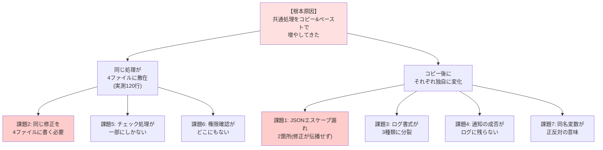
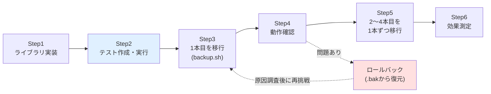

# 02. 改善提案書

改善案件No.2「コピペで増えた運用スクリプトを共通ライブラリ化して保守性と潜在バグを改善」

---

## 0. この文書の目的

[01-current-analysis.md](./01-current-analysis.md) で明らかになった課題に対し、**どう直すのが最適かを複数案の比較で決める**ための文書である。

改善案件では「共通ライブラリを作りました」と結果だけを報告しても評価されない。**なぜ他の手段ではなくその手段を選んだのか**、**どんなリスクをどう抑えたのか**、**あえてやらなかったことは何か**を説明できて初めて、設計の判断ができる人だと示せる。

> **前提**: 案件設定は架空だが、対象コードと計測値はこのリポジトリの実物である。

---

## 1. 課題の構造化

分析で挙がった7つの課題は、バラバラに存在しているわけではない。原因をたどると1つの根本原因に行き着く。

### 1-1. 根本原因

**共通処理をコピー&ペーストで増やしてきたこと**である。

コピー&ペーストには、次の2つの性質がある。

1. **コピー元とコピー先の間に、何のつながりも残らない。** 片方を直しても、もう片方は永久に古いままになる。
2. **コピー後、それぞれが独自に変化していく。** 案件No.3 でだけ `jq` に直され、No.1 でだけ書式が変わり、といった具合に差分が積み上がる。

課題1(JSONエスケープ漏れ)は性質1の結果であり、課題3(書式の分裂)は性質2の結果である。**どちらもコピペという手段そのものが生んだ問題**であり、個別に直しても同じことがまた起きる。

### 1-2. 課題の分類

| 分類 | 課題 | 性質 |
|---|---|---|
| **今すぐ直すべき不具合** | 課題1(JSONエスケープ漏れ) | 障害時に通知が届かない。放置は危険 |
| **構造の問題** | 課題2(4ファイル修正)、課題3(書式分裂)、課題7(変数名衝突) | 今は動くが、将来の事故と作業コストを生み続ける |
| **機能の不足** | 課題4(通知結果不明)、課題5(コマンド確認欠落)、課題6(権限未確認) | 改善のついでに揃えたい |

**課題1だけを直しても、根本原因は残る。** 逆に構造だけ直しても、不具合が残っていては意味がない。両方を一度に解決できる案を選ぶ必要がある。

---

## 2. 改善案の比較

4つの案を検討した。

### 案A: 何もしない(現状維持)

現在のまま運用を続け、問題が起きたときに個別対応する。

- **やること**: なし
- **費用**: 0時間

比較のために必ず挙げるべき選択肢である。「改善したい」という気持ちが先行して、**改善しないという選択肢を検討しないまま作業を始めてしまう**のはよくある失敗である。改善にはコストがかかり、動いているものを壊すリスクもあるため、費用対効果が見合わないなら「やらない」が正解になる場合もある。

### 案B: 潜在バグだけを、各ファイルで個別に直す

案件No.2 と No.4 の `notify_slack` を、それぞれ `jq` を使う形に書き換える。共通化はしない。

- **やること**: 2ファイルを編集(各11行程度)
- **費用**: 1〜2時間

### 案C: 共通ライブラリ化する(推奨案)

共通処理を `opslib.sh` という1ファイルに集約し、各スクリプトは `source` して使う。

- **やること**: ライブラリの設計・実装・テスト、4ファイルの段階的な移行
- **費用**: 12〜18時間

### 案D: 外部ツール・既製の仕組みを導入する

自作をやめ、既製の仕組みに置き換える。

- ログ出力 → `logger` コマンドで `syslog` / `journald`(=Linux標準のログ収集の仕組み)へ集約
- Slack通知 → `Alertmanager` や監視SaaSの通知機能へ委譲
- スクリプト全体 → Ansible や監視ツールの標準機能へ置き換え

- **やること**: ツールの選定・導入・既存スクリプトの全面的な作り直し
- **費用**: 40時間以上(ツールの学習を含む)

---

## 3. 比較評価表

評価は5段階(◎=非常に良い / ○=良い / △=どちらとも言えない / ×=悪い)。

| 評価軸 | 案A 何もしない | 案B 個別に直す | **案C 共通ライブラリ化** | 案D 外部ツール導入 |
|---|---|---|---|---|
| 課題1(JSONバグ)の解消 | × 解消しない | ◎ 解消する | ◎ 解消する | ◎ 解消する |
| 課題2(4ファイル修正)の解消 | × 解消しない | × **解消しない** | ◎ 1ファイルになる | ◎ 解消する |
| 課題3(書式3種類)の解消 | × 解消しない | × 解消しない | ◎ 1種類になる | ◎ 解消する |
| 同じ問題の再発防止 | × 再発する | × **再発する** | ○ 共通化した範囲では防げる | ◎ 防げる |
| 導入コスト(時間) | ◎ 0時間 | ◎ 1〜2時間 | ○ 12〜18時間 | × 40時間以上 |
| 既存を壊すリスク | ◎ なし | ○ 影響範囲が2ファイルに限定 | △ **ライブラリのミスが全体に波及** | × 全面作り直しで極めて高い |
| 運用担当者への影響 | ◎ なし | ◎ なし | ○ なし(設定ファイルを変えないため) | × 運用手順の再教育が必要 |
| 学習効果(ポートフォリオとして) | × 語ることがない | △ バグ修正の話のみ | ◎ **設計・移行・テストまで語れる** | ○ ツール知識は語れるが自作要素が消える |
| 必要な前提知識 | ◎ なし | ○ jq の基礎 | ○ source と関数設計 | × 各ツールの体系的な知識 |
| **総合評価** | **×** | **△** | **◎ 採用** | **×(将来の選択肢)** |

---

## 4. 各案を選ばなかった/選んだ理由

### 案A(何もしない)を選ばなかった理由

**課題1が「実害のある不具合」だからである。**

分析で確認したとおり、この不具合は「バックアップ失敗時」「ディスク容量警告時」「サーバー障害検知時」にだけ発動する。**異常が起きたときに限って通知が来ず、しかも通知が失敗したことすらログに残らない。** 通知の仕組みを入れている意味が失われるため、放置は選択できない。

また、スクリプトは今後も増える見込みである。**放置期間が長いほど、コピー元となるスクリプトが増えて問題が拡大する。** 「これ以上増える前に整理してほしい」という依頼の趣旨とも合致しない。

### 案B(個別に直す)を選ばなかった理由

**費用が最も安く、リスクも小さいため、真剣に検討に値する案である。** しかし2つの理由で採用しなかった。

**理由1: 根本原因に手を付けないため、同じことがまた起きる。**

案Bで直しても、`notify_slack` は依然として2ファイルに別々に存在する。次に何か改善したくなったとき(例: リトライを入れる、通知先をチャンネル別にする)、また2ファイル(将来は5ファイル、6ファイル)を編集することになる。**今回起きた「片方だけ直って片方が残る」という事故は、まったく同じ形で再発しうる。**

**理由2: 課題2・課題3が丸ごと残る。**

依頼内容は「Slackのバグを直してほしい」ではなく「**共通で使う部分を整理してほしい**」である。案Bは依頼の一部にしか答えていない。

> **判断の考え方**: 「症状を消す」のと「原因を取り除く」のは別である。案Bは症状を消す案、案Cは原因を取り除く案である。今回は**同じ症状が2度目に起きた**(No.3で直したのに他へ伝わらなかった)ため、原因側に手を入れるべきだと判断した。

### 案D(外部ツール導入)を選ばなかった理由

**技術的には最も正しい方向だが、今回の依頼の範囲を大きく超える。**

- **コストが釣り合わない。** 4本のスクリプトの整理という依頼に対し、40時間以上かけて監視基盤を導入するのは過剰である。
- **リスクが高い。** 動いている4本を全面的に作り直すことになり、移行期間中の運用に空白が生まれる。
- **段階を飛ばしている。** ログ書式すら統一できていない状態でログ集約基盤を導入しても、**書式が3種類のまま集約されるだけ**で解析ルールを3つ書く羽目になる。まず書式を統一するのが先である。

ただし**案Dは将来の選択肢として有効**である。案Cで書式を1種類に統一しておけば、後から `logger` コマンドや集約基盤へ移行する際の作業が大幅に楽になる。**案Cは案Dへの踏み台としても機能する。** この点は [05-effect-measurement.md](./05-effect-measurement.md) の「次の改善」に記載する。

### 案C(共通ライブラリ化)を選んだ理由

1. **課題1・2・3をまとめて解決できる唯一の現実的な案である。** バグ修正と構造改善が同時に達成される。
2. **費用が現実的である。** 12〜18時間は、案件1本分の作業量に相当する。依頼の規模に見合っている。
3. **依頼の趣旨そのものである。** 「これ以上増える前に整理してほしい」に正面から答えている。
4. **今後スクリプトが増えるほど効果が大きくなる。** 5本目・6本目は `source` を1行書くだけで、統一された書式とバグのない通知が手に入る。
5. **将来の案Dへの移行を容易にする。**

---

## 5. 期待効果

### 5-1. 定量的な効果(目標値)

| 指標 | 改善前 | 改善後(目標) | 測定方法 |
|---|---|---|---|
| 重複していた共通処理 | 4ファイルに散在、計120行 | 共通ライブラリ1ファイルに集約 | `src/count_duplication.sh` |
| 同種の修正で触るファイル数 | 4ファイル | 1ファイル | ログ書式やSlack送信方法の変更時に編集するファイル数 |
| 潜在バグ(JSONエスケープ未対応) | 2箇所 | 0箇所 | 文字列連結でJSONを組み立てている関数の数 |
| ログ書式 | 3種類 | 1種類 | 4本が出力するログ行の書式の種類数 |
| 共通処理のテスト | 0件 | 30件以上 | `src/test_opslib.sh` の実行結果 |

実際の達成状況は [05-effect-measurement.md](./05-effect-measurement.md) で報告する。

### 5-2. 定性的な効果

- **修正漏れが構造的に起きなくなる。** 共通処理は1か所にしかないため、「片方だけ直った」という状態が発生しえない。
- **5本目以降のスクリプトを書くのが楽になる。** ログとSlack通知を毎回書く必要がなくなり、その案件固有のロジックに集中できる。
- **複数ログを横断で扱えるようになる。** 書式が1種類になることで、`cat *.log | sort` で時系列に並べ、`awk '{print $3}'` でレベルを一律に取り出せる。
- **通知の失敗に気づけるようになる。** HTTPステータスを確認し、失敗をログに残すようになる。

### 5-3. 効果が出ない範囲(正直に書くこと)

- **実行速度は速くならない。** これは保守性の改善であり、性能改善ではない。
- **コードの総行数はむしろ増える。** ライブラリに機能を足すためである(詳細は効果測定レポート)。
- **各スクリプト固有のロジック(tar・ping・CSV処理など)は一切改善されない。** 今回の対象外である。

---

## 6. リスクと対策

共通化は良いことばかりではない。**「1か所を直せば全体に反映される」は、裏を返せば「1か所を壊せば全体が壊れる」ということである。** リスクを正しく認識し、対策を用意する。

| # | リスク | 起こると何が困るか | 対策 |
|---|---|---|---|
| R1 | **ライブラリのバグが4本すべてに一度に波及する** | バックアップも監視もユーザー作成も同時に停止しうる | **簡易テストを用意し、ライブラリを変更するたびに実行する。** テストは特殊文字のエスケープ・戻り値・出力先など、壊れると影響が大きい部分を重点的に確認する |
| R2 | 移行作業中にスクリプトを壊す | 稼働中の運用が止まる | **1本ずつ段階的に移行する。** 1本移行するたびに動作確認を行い、次へ進む。全部を一度に変えない |
| R3 | 移行後に問題が発覚し、元に戻せない | 復旧に時間がかかる | **移行前に元のファイルを `.bak` として退避する。** 戻す手順を手順書に明記し、実際に戻せることを確認しておく |
| R4 | ライブラリが呼び出し側の変数を上書きしてしまう(変数汚染) | 一見無関係な箇所が壊れ、原因が分かりにくい | **すべての公開名を `ops_` / `OPS_` で始める。** 関数内のローカル変数は `local` を付け、名前も `_ops_` で始める |
| R5 | ライブラリが `set -e` などのシェルオプションを変えてしまう | 呼び出し側のエラー処理方針が意図せず変わる | **ライブラリはシェルオプションを一切変更しない。** この点をテストで確認する |
| R6 | ライブラリが内部で `exit` し、呼び出し側の後片付けが実行されない | 一時ファイルが残る、状態ファイルが中途半端になる | **ライブラリは `exit` せず、戻り値(`return`)で異常を伝える。** 終了するかどうかは呼び出し側が決める |
| R7 | 既存の設定ファイルを書き換える必要が生じ、運用担当者の作業が発生する | 作業ミスによる障害。移行の心理的ハードルが上がる | **設定ファイルの書式は一切変えない。** スクリプト側で既存の変数名を `OPS_*` へ橋渡しする |
| R8 | `jq` が入っていないサーバーで動かなくなる | Slack通知が送れない | **起動時に前提コマンドを確認**し、不足していれば分かりやすいメッセージを出す。不足時も本来の処理(バックアップ等)は継続する |
| R9 | ライブラリの置き場所が見つからず起動しない | スクリプトが動かない | **`${BASH_SOURCE[0]}` を使い、スクリプト自身の場所を基準にライブラリを探す。** 実行時のカレントディレクトリに依存しない |

### 6-1. 特に重要な対策: なぜテストを書くのか

R1 は、共通化によって**新しく生まれる**リスクである。改善前は、`backup.sh` を壊しても影響は `backup.sh` だけだった。改善後は、`opslib.sh` を壊すと4本すべてが同時に壊れる。

これは共通化のデメリットであり、「共通化すれば無条件に良くなる」わけではないことを示している。**このデメリットを受け入れられる状態にするために、テストという安全網を先に用意する。**

リファクタリング(=外から見た動きを変えずに内部の作りを整理すること)におけるテストの役割は、**「整理したつもりが、こっそり動きを変えてしまっていないか」を機械的に確認すること**である。人間の目視では、4本×数十行の変更をすべて正しく確認するのは難しい。

---

## 7. スコープ(この案件でやること・やらないこと)

### 7-1. やること

- 共通ライブラリ `opslib.sh` の設計・実装
- ライブラリの簡易テストの作成
- 4カテゴリ(ログ出力 / Slack通知 / 設定読み込み / 前提コマンドチェック)の集約
- ログ書式の1種類への統一
- JSONエスケープ漏れの解消
- 4本のスクリプトの改善版の作成と、移行手順・ロールバック手順の文書化
- 改善効果の計測と報告

### 7-2. やらないこと(スコープ外)と、その理由

| スコープ外にしたこと | 理由 |
|---|---|
| **`projects/` 配下の元ファイルの書き換え** | 改善前(Before)の証拠として原状保存する方針。改善版は `improvements/02-shared-library-refactoring/src/` に置き、移行手順として書き換え方を示す |
| **各スクリプト固有ロジックの共通化**(`check_ping` / `check_http` / `calc_uptime` / CSV解析 / tar処理など) | **1か所でしか使われていない処理を共通化しても得がない。** ライブラリが肥大化して読みづらくなり、変更の影響範囲だけが無駄に広がる。「実際に2か所以上で重複しているものだけを共通化する」という基準を採用した |
| **設定ファイルの書式変更・統合** | 運用担当者の作業を発生させないため(R7)。`LOG_FILE` の意味が案件間で違う問題(課題7)も、統合するなら慎重な設計が必要。今回は変数名の衝突をライブラリ側(`OPS_LOG_FILE`)で回避するにとどめる |
| **ログのローテーション設計の共通化** | 案件No.2 には `logrotate` 設定があるが、他にはない。ログ書式を統一した後に検討するのが順序として正しい |
| **`logger` / `journald` / ログ集約基盤への移行**(案D) | コストが釣り合わない。書式統一が完了してから検討すべき次段階の改善 |
| **テストフレームワーク(bats等)の導入** | 追加インストールが必要になり、学習コストも上がる。今回の規模ならBashだけで十分な安全網になる |
| **Slack以外の通知手段(メール等)の追加** | 現状の要望に含まれていない。ただしライブラリの構造上、後から `ops_notify_mail` を足せる設計にはしておく |
| **案件No.5(Ansible)・No.6(CI/CD)への適用** | この2件はBashスクリプトが主体ではないため、今回の共通化の対象外 |

### 7-3. スコープ外の判断で特に説明したいこと

**「共通化できるものを全部共通化する」は正しくない。**

例えば `health_check.sh` の `check_ping()` は、確かにきれいな関数である。しかし**他の3本では一度も使われていない**。これをライブラリに入れると、

- `backup.sh` を読む人が、使われていない `check_ping` の存在に悩む
- ライブラリのテストに `check_ping` のテストが必要になる
- `check_ping` を直すとき、影響範囲が4本に広がったように見えて慎重にならざるを得ない

といった不利益だけが生じる。**共通化の判断基準は「実際に重複しているか」であって、「共通化できそうか」ではない。**

---

## 8. 実施計画

**移行の順番と、その理由**

| 順番 | 対象 | この順番にした理由 |
|---|---|---|
| 1本目 | `backup.sh`(案件No.2) | **4本の中で最も短く(166行)、4カテゴリすべて**(ログ・Slack・設定読み込み)**を含む。** 最初の1本でライブラリの使い勝手を検証するのに最適 |
| 2本目 | `health_check.sh`(案件No.4) | `backup.sh` の**完全なコピペ**なので、1本目と同じ手順がそのまま通用する。移行手順の妥当性を確認できる |
| 3本目 | `create_users.sh`(案件No.1) | 変更箇所が `log()` だけと少ない。ただし書式が変わる(`[時刻]` → `時刻`)ため、ログを見る側への影響を確認する |
| 4本目 | `log-watch-alert.sh`(案件No.3) | **最も構造が違う**(常駐プロセス、レベル別関数、jq実装済み)。最後に回し、前の3本で得た知見を活かす |

**「簡単で影響の小さいものから始め、難しいものは最後に回す」**という順番である。最初に一番難しいものに手を付けると、序盤でつまずいて全体が止まりやすい。

---

## 9. 次の文書へ

改善の方針として**共通ライブラリ化(案C)**を採用することが決まった。次は、ライブラリにどんな関数を持たせ、呼び出し側とどう役割を分けるかを設計する。

→ [03-design.md](./03-design.md)

---

## 関連ドキュメント

- [README.md](./README.md) — 改善案件の概要
- [01-current-analysis.md](./01-current-analysis.md) — 現状分析書(前に読む文書)
- [03-design.md](./03-design.md) — 改善設計書(次に読む文書)
- [05-effect-measurement.md](./05-effect-measurement.md) — 効果測定レポート(目標値の達成状況)
