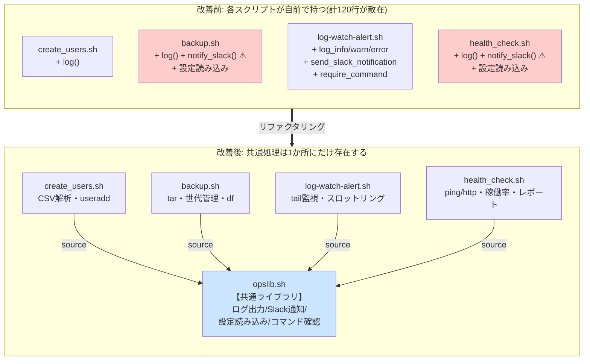
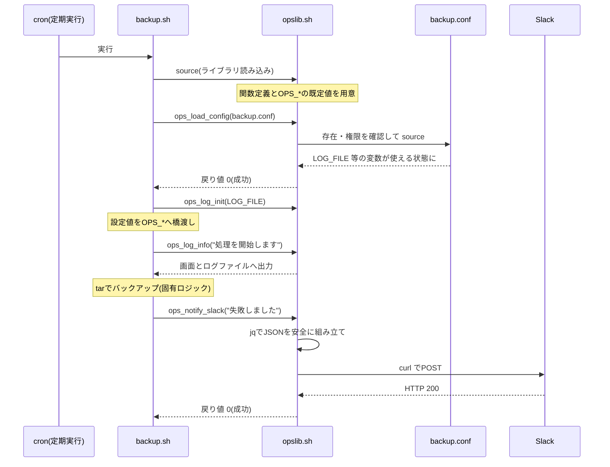
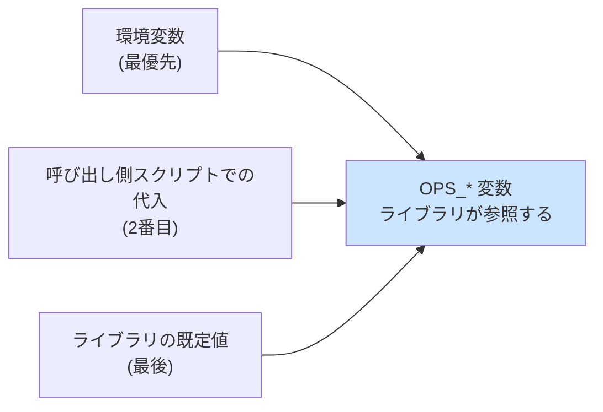

# 03. 改善設計書(To-Be)

改善案件No.2「コピペで増えた運用スクリプトを共通ライブラリ化して保守性と潜在バグを改善」

---

## 0. この文書の目的

[02-improvement-proposal.md](./02-improvement-proposal.md) で決めた「共通ライブラリ化」を、**具体的にどう作るか**を決める文書である。

実装を始める前に設計を書く理由は、**関数の境界(どこまでをライブラリがやり、どこからを呼び出し側がやるか)を先に決めておかないと、後から動かせなくなる**ためである。ライブラリは4本のスクリプトから使われるため、いったん公開した関数の使い方を変えると4本すべての修正が必要になる。

---

## 1. 全体構成

### 1-1. 改善前と改善後の対比



改善前は共通処理が4か所にあった。改善後は**1か所にしかない**。これが構造上の最大の変化である。

### 1-2. ファイル配置

実運用では、共通ライブラリと利用スクリプトを**同じディレクトリに並べる**。

```text
/opt/backup-automation/
├── opslib.sh          ← 共通ライブラリ
├── backup.sh          ← 利用スクリプト
└── backup.conf        ← 設定ファイル
```

**なぜ `/usr/local/lib/` のような共有の場所に1つだけ置かないのか。**

置き場所を1か所に集約すると、ライブラリの更新が全サーバー・全スクリプトへ同時に反映される。これは便利に見えるが、**移行期間中は危険**である。「バックアップスクリプトだけ先に新しいライブラリで動かし、他は様子を見る」ということができなくなり、[02-improvement-proposal.md](./02-improvement-proposal.md) で決めた**1本ずつの段階的移行ができない**。

そのため、当面は**各スクリプトのディレクトリにライブラリのコピーを置く**方式とする。全4本の移行が完了して安定してから、共有ディレクトリへの集約を検討する(効果測定レポートの「残課題」に記載)。

### 1-3. 呼び出しの流れ



---

## 2. ライブラリの関数一覧と責務

公開関数は11個である。

### 2-1. 一覧表

| 関数 | 引数 | 戻り値 | 責務(何をするか) |
|---|---|---|---|
| `ops_lib_version` | なし | 0 | ライブラリのバージョン文字列を標準出力へ出す |
| `ops_log_init` | `<ログファイルパス>` | 0=成功 / 1=失敗 | ログ出力先を設定し、親ディレクトリの作成と書き込み可否の確認を行う |
| `ops_log` | `<レベル> <メッセージ...>` | 常に0 | 統一書式でログを1行出力する(画面＋ログファイル) |
| `ops_log_debug` | `<メッセージ...>` | 常に0 | `ops_log "DEBUG"` の短縮版 |
| `ops_log_info` | `<メッセージ...>` | 常に0 | `ops_log "INFO"` の短縮版 |
| `ops_log_warn` | `<メッセージ...>` | 常に0 | `ops_log "WARN"` の短縮版 |
| `ops_log_error` | `<メッセージ...>` | 常に0 | `ops_log "ERROR"` の短縮版 |
| `ops_require_commands` | `<コマンド名...>` | 0=全部ある / 1=不足あり | 必要な外部コマンドの存在をまとめて確認し、足りないものを列挙する |
| `ops_load_config` | `<設定ファイルパス>` | 0=成功 / 1=失敗 | 設定ファイルの存在・読み取り権限を確認してから `source` する |
| `ops_slack_payload` | `<本文>` | 0=成功 / 2=jq無し | Slack用のJSONを安全に組み立てて標準出力へ出す(**送信はしない**) |
| `ops_notify_slack` | `<本文>` | 0=成功 / 1=送信失敗 / 2=設定不足 | Slackへ通知を送信し、結果をログに残す |

### 2-2. 責務の分割で意識したこと

**`ops_slack_payload` と `ops_notify_slack` を分けた理由**

1つの関数にまとめることもできたが、あえて分けた。

- `ops_slack_payload` は**JSONを組み立てるだけ**で、ネットワーク通信をしない。同じ入力に対して必ず同じ出力を返す。
- `ops_notify_slack` は**実際に送信する**。ネットワークの状態によって結果が変わる。

こう分けると、**テストが書きやすくなる**。JSONのエスケープが正しいかどうかは、Slackへ送信せずに `ops_slack_payload` だけを呼んで確認できる。実際、テスト35件のうち6件がこの関数を直接検証している。

> **一般化すると**: 「計算するだけの部分」と「外の世界に影響を与える部分」を分けると、前者はテストしやすくなる。ライブラリ設計の基本的な考え方の1つである。

**`ops_log_init` を `ops_log` から分けた理由**

ログを1行出すたびにディレクトリの存在確認をするのは無駄である。また、**「ログが書けない」ことは処理を始める前に気づきたい問題**である。100件のユーザーを作った後で「実はログが1行も書けていませんでした」では困る。そのため初期化を独立させ、起動直後に確認する形にした。

---

## 3. 呼び出し側とライブラリの境界

**どちらが何を担当するか**を明確にしておかないと、同じ処理が両方に書かれたり、どちらも書かなかったりする。

| 関心事 | 担当 | 理由 |
|---|---|---|
| ログの**書式** | ライブラリ | 全スクリプトで統一したいから |
| ログの**出力先パス** | 呼び出し側が決めてライブラリに渡す | パスは案件ごとに違うから |
| ログに**何を書くか**(メッセージ本文) | 呼び出し側 | 案件固有の情報だから |
| Slackの**送信方法**(JSON化・HTTP・タイムアウト) | ライブラリ | 全スクリプトで同じでよいから |
| Slackの**メッセージ文面** | 呼び出し側 | 案件ごとに伝えたい内容が違うから |
| 設定ファイルの**読み込み方**(存在確認・権限確認・source) | ライブラリ | 手順が全スクリプトで同じだから |
| 設定ファイルの**中身**(どんな項目があるか) | 呼び出し側 | 案件固有だから |
| **異常時に処理を止めるかどうか** | **呼び出し側** | 案件ごとに方針が違うから(後述) |
| 案件固有の処理(tar / ping / CSV解析など) | 呼び出し側 | 1か所でしか使わないから |

### 3-1. 「止めるかどうか」を呼び出し側が決める理由

ライブラリの中で `exit` しない、というのはこの設計で最も重要な決まりである。

**なぜか。** 同じ「Slack通知に失敗した」という事象でも、あるべき対応は案件によって違う。

| 案件 | Slack通知が失敗したとき、どうすべきか |
|---|---|
| No.2 バックアップ | **止めてはいけない。** バックアップ自体は成功しているかもしれない。通知の失敗で処理を中断したら本末転倒 |
| No.4 死活監視 | **止めてはいけない。** 1台の通知に失敗しても、残りのサーバーのチェックとレポート生成は続けたい |
| No.3 ログ監視 | **止めてはいけない。** 常駐プロセスなので、通知1回の失敗で監視全体が停止したら困る |

ライブラリが勝手に `exit` すると、呼び出し側は**この判断をする機会を奪われる**。さらに悪いことに、`exit` されると呼び出し側の後片付け処理(一時ファイルの削除、状態ファイルの書き戻し)が実行されない。

そこでライブラリは**必ず戻り値で状態を返し、終了するかどうかは呼び出し側が `if` で判断する**設計にした。

```bash
# ライブラリは exit しない。呼び出し側が判断する。
if ! ops_load_config "$CONFIG_FILE"; then
    exit 1        # ← このスクリプトでは「設定が無いなら続行不能」と判断
fi

ops_notify_slack "バックアップに失敗しました"
# ↑ 戻り値を見ずに次へ進む。「通知の失敗では止めない」という判断
```

---

## 4. ログ書式の設計

### 4-1. 採用する書式

```text
YYYY-MM-DD HH:MM:SS [レベル] [タグ] メッセージ
```

実際の出力例:

```text
2026-09-07 04:37:57 [INFO] [backup] ===== バックアップ処理を開始します =====
2026-09-07 04:37:57 [WARN] [backup] バックアップ先の空き容量が閾値を超えています(22% >= 1%)
2026-09-07 04:40:17 [SKIP] [create_users] ユーザー root は既に存在するためスキップしました。
```

### 4-2. なぜこの書式にしたのか

| 決めたこと | 理由 |
|---|---|
| **日時を行頭に置き、`[ ]` で囲まない** | `sort` は行を先頭から文字として比較する。`[` で囲むと、囲まないログと混ぜたときに並び順が崩れる(現状分析1-4の害1)。囲まなければ `cat *.log \| sort` だけで正しく時系列に並ぶ |
| **区切りは半角スペース** | `awk` の既定の区切り文字なので、`awk '{print $3}'` でレベル、`awk '{print $4}'` でタグを取り出せる |
| **レベルを `[ ]` で囲む** | `grep '\[ERROR\]'` で、本文中にたまたま `ERROR` という語が含まれる行を拾わずに済む |
| **タグ(出力元の識別子)を追加した** | 複数スクリプトのログを1か所に集めたとき、どのスクリプトの行かを判別できるようにするため。改善前は判別する手段が無かった |
| **改善前のNo.2/No.4の書式をベースにした** | 4本のうち2本が既に使っている書式なので、移行で書式が変わるファイルを2本に抑えられる |
| **レベルの後ろの空白は1つに固定** | No.3 は桁揃えのため `INFO` の後に空白2つを入れていたが、これも書式の差になる。揃えることを優先した |

### 4-3. 出力先の設計

| レベル | 標準出力 | 標準エラー出力 | ログファイル |
|---|---|---|---|
| DEBUG / INFO / WARN / その他 | ○ | − | ○(設定時) |
| ERROR | − | ○ | ○(設定時) |

**ERROR だけを標準エラー出力に分けた理由**は、`cron` の性質にある。cron は実行したコマンドが**標準エラー出力に何か出したときにだけ**管理者へメールを送るよう設定できる。ERROR を分けておくことで、**異常が起きたときだけメールが届く**運用ができる。改善前の No.1/No.2/No.4 は ERROR も標準出力に出していたため、この仕組みが使えなかった。

### 4-4. ログレベルによる出力抑制

`OPS_LOG_LEVEL` で、指定した重要度未満のログを出さないようにできる。

| 設定値 | 出力されるレベル |
|---|---|
| `DEBUG` | DEBUG / INFO / WARN / ERROR(すべて) |
| `INFO`(既定) | INFO / WARN / ERROR |
| `WARN` | WARN / ERROR |
| `ERROR` | ERROR のみ |

**未知のレベル名は INFO と同じ扱いにする。** 案件No.1 は `log "SKIP"` という独自レベルを使っている。未知のレベルを弾く設計にすると、移行時にこのログが消えてしまう。既存の挙動を壊さないための配慮である。

---

## 5. 設定の受け渡し方法

### 5-1. 3層の設計



ライブラリは `: "${OPS_XXX:=既定値}"` という書き方で既定値を用意している。これは「**未定義または空なら、この値を代入する**」という意味のパラメータ展開である。したがって、

- `source` する**前**に呼び出し側や環境変数で値が設定されていれば、その値が生きる
- `source` した**後**に代入すれば、既定値を上書きできる

という、柔軟な受け渡しができる。

### 5-2. ライブラリが参照する変数の一覧

| 変数 | 既定値 | 意味 |
|---|---|---|
| `OPS_LOG_FILE` | 空 | ログの追記先。空ならファイル出力せず画面のみ |
| `OPS_LOG_TAG` | スクリプト名から自動生成 | ログ行に入れる出力元の識別子 |
| `OPS_LOG_LEVEL` | `INFO` | この重要度未満のログは出力しない |
| `OPS_SLACK_ENABLED` | `true` | `true` 以外なら Slack 通知を行わない |
| `OPS_SLACK_WEBHOOK_URL` | 空 | Slack Incoming Webhook の URL |
| `OPS_SLACK_TIMEOUT` | `10` | Slack への送信を諦めるまでの秒数 |
| `OPS_SLACK_DRY_RUN` | `false` | `true` なら送信せず、送る予定のJSONを表示する |

### 5-3. 既存の設定ファイルとの橋渡し(後方互換)

既存の `backup.conf` は `LOG_FILE` / `ENABLE_SLACK_NOTIFY` / `SLACK_WEBHOOK_URL` という名前で値を持っている。**この設定ファイルは書き換えない**方針([02-improvement-proposal.md](./02-improvement-proposal.md) のリスクR7)なので、スクリプト側で名前を変換する。

```bash
# 既存の設定ファイルをそのまま読み込む
if ! ops_load_config "$CONFIG_FILE"; then
    exit 1
fi

# 既存の変数名を、ライブラリが使う OPS_* へ移し替える(橋渡し)
if ! ops_log_init "$LOG_FILE"; then
    exit 1
fi
OPS_SLACK_ENABLED="$ENABLE_SLACK_NOTIFY"
OPS_SLACK_WEBHOOK_URL="$SLACK_WEBHOOK_URL"
```

この3行の橋渡しがあるおかげで、**サーバー上の設定ファイルには一切触れずに、スクリプトを差し替えるだけで移行が完了する**。切り戻すときも、スクリプトを元に戻すだけでよい。

### 5-4. `OPS_LOG_FILE` という名前にした理由

現状分析5章で指摘したとおり、`LOG_FILE` という名前は案件によって意味が正反対である。

| 案件 | `LOG_FILE` の意味 |
|---|---|
| No.1 / No.2 / No.4 | 自分が**出力する**ログファイル |
| No.3 | 自分が**監視する**ログファイル |

ライブラリが `LOG_FILE` をそのまま参照する設計にすると、案件No.3 で `source` した瞬間に「監視対象ファイルへログを書き込む」という事故が起きる。**自分が書いた行を自分で検知して、無限にSlack通知を送り続ける**という最悪の動作になりうる。

`OPS_` という接頭辞を付けることで、この衝突を構造的に防いでいる。

---

## 6. 命名規則

| 対象 | 規則 | 例 |
|---|---|---|
| 公開関数 | `ops_` で始める。動詞または「対象＋動詞」 | `ops_log_init` / `ops_notify_slack` |
| 内部関数(直接呼ばれない前提) | `_ops_` で始める | `_ops_timestamp` / `_ops_level_priority` |
| 公開設定変数 | `OPS_` で始める大文字 | `OPS_LOG_FILE` / `OPS_SLACK_ENABLED` |
| 内部状態変数 | `_OPS_` で始める大文字 | `_OPS_LOG_FILE_WARNED` |
| 関数内のローカル変数 | `local` を付け、`_ops_` で始める | `local _ops_message` |

### 6-1. なぜ接頭辞を付けるのか

Bashには、他の言語の「名前空間」や「モジュール」に相当する仕組みが**存在しない**。`source` で読み込んだ関数と変数は、呼び出し側とまったく同じ空間に置かれる。

つまり、ライブラリが `log()` という関数を定義すると、**呼び出し側が持っていた `log()` は上書きされて消える**。同じことが変数にも起きる。

接頭辞は、この衝突を人間の規律で防ぐための唯一の手段である。

### 6-2. なぜローカル変数にまで `_ops_` を付けるのか

これは特に間違えやすい点である。次のコードを見てほしい。

```bash
# ライブラリ側(悪い例)
ops_load_config() {
    local file="$1"      # ← ローカル変数 file
    source "$file"
}
```

一見問題なさそうだが、**設定ファイルの中に `file=...` という行があったら**どうなるか。`source` は関数の中で実行されるため、設定ファイル内の `file=` への代入が**関数のローカル変数 `file` を書き換えてしまう**。その結果、`source "$file"` の後で `$file` を使う処理があれば誤動作する。

```bash
# ライブラリ側(採用した書き方)
ops_load_config() {
    local _ops_cfg="$1"   # ← 設定ファイルに _ops_cfg= と書かれる可能性は極めて低い
    source "$_ops_cfg"
}
```

**`local` を付けるだけでは不十分で、名前そのものを衝突しにくいものにする必要がある。**

---

## 7. `source` の仕組み(初心者向け解説)

この案件の中心にある `source` を、動作原理から理解しておく。

### 7-1. `./script.sh` と `source script.sh` の違い


| | `./opslib.sh`(実行) | `source opslib.sh`(読み込み) |
|---|---|---|
| プロセス | **新しく作られる**(子プロセス) | **作られない**(同じシェルの中) |
| 定義された関数 | 子プロセスの終了とともに消える | **呼び出し側に残る** |
| 定義された変数 | 同上 | **呼び出し側に残る** |
| 実行権限(`chmod +x`) | 必要 | **不要** |
| `exit` を書いた場合 | 子プロセスだけが終了する | **呼び出し側のシェルごと終了する** |

**ライブラリで `exit` を使ってはいけない理由が、この表の最後の行**である。`source` されたファイルの中の `exit` は、呼び出し元のスクリプトを丸ごと終了させてしまう。

### 7-2. `source` の書き方

```bash
source "${SCRIPT_DIR}/opslib.sh"
# 短縮形として . (ドット) も使えるが、見落としやすいので source を使う
# . "${SCRIPT_DIR}/opslib.sh"
```

### 7-3. なぜ `${BASH_SOURCE[0]}` を使うのか

ライブラリの場所を指定する方法として、次の3つが考えられる。

| 書き方 | 問題 |
|---|---|
| `source opslib.sh` | **カレントディレクトリ**から探すため、cron から実行すると見つからない(cron のカレントディレクトリはホームディレクトリ) |
| `source "$(dirname "$0")/opslib.sh"` | `$0` は起動のされ方で中身が変わる。`source` された場合や特殊な起動方法では期待どおりにならない |
| `source "$(cd "$(dirname "${BASH_SOURCE[0]}")" && pwd)/opslib.sh"` | **常にこのファイル自身の場所**を指す。採用 |

`${BASH_SOURCE[0]}` は「今実行中のファイル自身のパス」を指すBashの特別な変数である。`dirname` でディレクトリ部分を取り出し、`cd` して `pwd` することで、相対パスを絶対パスに変換している。

---

## 8. エラー処理の設計

### 8-1. 戻り値の意味を統一する

| 戻り値 | 意味 | 呼び出し側の典型的な対応 |
|---|---|---|
| `0` | 成功。または「やる必要がなかった」(通知が無効など) | そのまま次へ進む |
| `1` | **実行はしたが失敗した**(送信エラー、ファイルが書けない) | ログに残して継続、または `exit` |
| `2` | **実行する前提が整っていない**(設定不足、コマンド不足) | 設定を見直す必要がある。多くの場合 `exit` |

**`1` と `2` を分けた理由**は、原因の切り分けが変わるためである。`1` はネットワークやディスクの問題で、時間をおけば直るかもしれない。`2` は設定や環境の問題で、人が直さない限り何度実行しても直らない。

### 8-2. ライブラリが守る3つの約束

1. **`exit` しない。** 戻り値で伝える(7-1の理由)。
2. **シェルオプション(`set -e` / `set -u` など)を変更しない。** 呼び出し側のエラー処理方針を尊重する。
3. **ログ出力の失敗で処理を止めない。** `ops_log` は常に `0` を返す。ログが書けないという理由でバックアップが止まるのは本末転倒である(ただし最初の1回だけ警告を出す)。

---

## 9. テストの設計方針

### 9-1. 何をテストするか

**すべてをテストしようとすると挫折する。** 壊れたときの影響が大きい部分に絞る。

| 分類 | テストする理由 | 件数 |
|---|---|---|
| ログの書式 | 4本すべての出力書式が決まる。ここが崩れると全ログが壊れる | 4件 |
| ログファイルへの出力 | 追記であること、階層作成、書けない場合の挙動 | 4件 |
| ログレベルの抑制 | 未知のレベル(SKIP)が消えないことを含む | 4件 |
| **Slackペイロードのエスケープ** | **この案件の核心。ここが壊れると改善の意味がなくなる** | **6件** |
| Slack通知の戻り値と分岐 | 無効時・ドライラン・設定不足の判別 | 4件 |
| 設定ファイルの読み込み | 成功・失敗・権限警告。**exit しないこと** | 6件 |
| 前提コマンドの確認 | 不足を全部列挙すること | 4件 |
| ライブラリとしての行儀 | 二重読み込み・シェルオプション不変・直接実行の防止 | 3件 |

合計35件。

### 9-2. エスケープのテストは「往復」で確認する

「妥当なJSONである」だけでは不十分である。次のJSONは妥当だが、中身が壊れている。

```json
{"text": "対象 public html を開けません"}
```

`"` が消えてしまっているが、JSONとしては読める。そこでテストでは**往復(ラウンドトリップ)**で確認する。

1. 元の文字列から `ops_slack_payload` でJSONを作る
2. そのJSONから `jq -r '.text'` で中身を取り出す
3. **取り出した文字列が、元の文字列と完全に一致するか**を確認する

一致すれば、エスケープと復元が正しく行われたと言える。

### 9-3. 旧方式が壊れることもテストする

テストには「旧方式(文字列連結)ではダブルクォートで壊れる」という確認も1件含めた。

**これは回帰テスト(=直したバグが再発していないかを見張るテスト)である。** 将来このコードを読んだ人が「`jq` を使うのは大げさでは」と思って書き戻したとき、このテストが「なぜ `jq` が必要なのか」を思い出させる役割を果たす。

### 9-4. なぜテストフレームワークを使わないのか

`bats` のようなテストフレームワークを使う選択肢もあったが、次の理由で見送った。

- **追加インストールが必要になる。** 「テストを動かすための準備」でつまずくと、テストが実行されなくなる
- **今回の規模では、Bashの `if` と `echo` で十分な安全網になる**
- **テストコード自体が学習教材になる。** フレームワークの記法を覚えるより、素のBashで書いたほうが仕組みが見える

規模が大きくなればフレームワークの導入を検討すべきである。この判断は「今の規模に合っているか」で決めている。

---

## 10. 設計上の判断のまとめ

| 判断 | 選ばなかった選択肢 | 選んだ理由 |
|---|---|---|
| ライブラリは `exit` せず戻り値で返す | 内部で `exit` する | 呼び出し側の後片付けを奪わない。案件ごとに「止めるか」の方針が違う |
| すべての名前に `ops_` / `_ops_` を付ける | 短い名前(`log` など) | Bashには名前空間が無く、`source` で衝突するため |
| JSONの組み立てを `jq` に任せる | Bashで自前のエスケープ処理を書く | 制御文字やUnicodeまで正しく実装するのは難しく、バグの温床になる。**この案件自体が自前実装で事故った実例** |
| ログ書式は No.2/No.4 の形をベースに、タグ列を追加 | No.1 や No.3 の書式 | 4本中2本が既に使っており移行対象が減る。`sort` と `awk` で扱いやすい |
| ライブラリを各スクリプトのディレクトリに置く | `/usr/local/lib/` に1つだけ置く | 段階的移行(1本ずつ)を可能にするため。移行完了後に集約を検討する |
| 使われていない処理は共通化しない | 共通化できるものは全部する | ライブラリの肥大化を防ぐ。判断基準は「実際に2か所以上で重複しているか」 |
| 設定ファイルの書式を変えない | `OPS_*` に書き換える | 運用担当者の作業を発生させない。切り戻しがスクリプトの差し替えだけで済む |
| テストはBashのみで書く | bats などのフレームワーク | 追加インストール不要。今回の規模に見合う。テスト自体が教材になる |

---

## 11. 次の文書へ

設計が固まったので、実装と移行の具体的な手順に進む。

→ [04-build-guide.md](./04-build-guide.md)

---

## 関連ドキュメント

- [README.md](./README.md) — 改善案件の概要
- [02-improvement-proposal.md](./02-improvement-proposal.md) — 改善提案書(前に読む文書)
- [04-build-guide.md](./04-build-guide.md) — 実装・移行手順書(次に読む文書)
- [src/opslib.sh](./src/opslib.sh) — この設計に基づく実装
- [src/test_opslib.sh](./src/test_opslib.sh) — 9章のテスト設計に基づく実装
