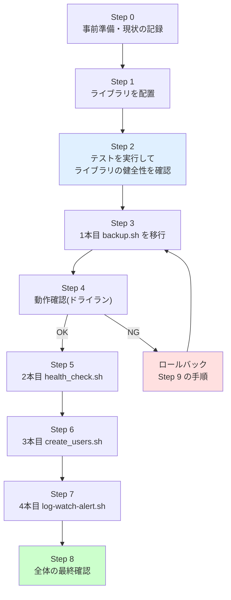
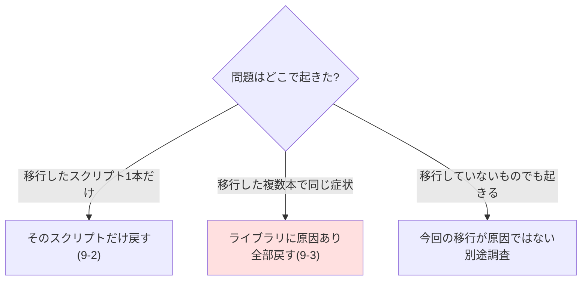

# 04. 実装・移行手順書

改善案件No.2「コピペで増えた運用スクリプトを共通ライブラリ化して保守性と潜在バグを改善」

---

## 0. この手順書の使い方

[03-design.md](./03-design.md) の設計に沿って、共通ライブラリを導入し、4本のスクリプトを**1本ずつ**移行していく手順である。

### 0-1. 全体の流れ



### 0-2. 最重要の原則

> **絶対に、4本を一度に書き換えないこと。**
>
> 一度に変えると、問題が起きたときに「ライブラリが悪いのか、書き換え方が悪いのか、どのスクリプトの書き換えが悪いのか」を切り分けられなくなる。1本ずつ移行し、そのつど動作を確認して次へ進む。

### 0-3. この手順書での前提

- 作業は検証環境(Ubuntu Server 22.04 LTS 相当)で行う
- `jq` と `shellcheck` がインストール済み(未導入なら `sudo apt-get install -y jq shellcheck`)
- **`projects/` 配下の元ファイルは書き換えない。** 改善版は `improvements/02-shared-library-refactoring/src/` に作る

---

## Step 0. 事前準備と現状の記録

### 0-1. 改善前の状態を数値で記録する

**なぜそうするのか**: 改善後に「良くなった」と言うには、改善前の数値が必要である。作業を始めてしまうと元の状態が分からなくなるため、**必ず最初に記録する**。

```bash
cd /home/user/automation
./improvements/02-shared-library-refactoring/src/count_duplication.sh
```

実行結果:

```text
| カテゴリ | ファイル | 行範囲 | 行数 |
|---|---|---|---|
| ログ出力 | projects/01-user-account-automation/src/create_users.sh | 161-168 | 8 |
| 設定読み込み | projects/02-backup-automation/src/backup.sh | 32-41 | 9 |
| ログ出力 | projects/02-backup-automation/src/backup.sh | 50-57 | 8 |
| Slack通知 | projects/02-backup-automation/src/backup.sh | 62-72 | 11 |
| ログ出力 | projects/03-log-monitoring-alert/src/log-watch-alert.sh | 48-50 | 3 |
| 前提コマンドチェック | projects/03-log-monitoring-alert/src/log-watch-alert.sh | 59-68 | 10 |
| Slack通知 | projects/03-log-monitoring-alert/src/log-watch-alert.sh | 92-137 | 38 |
| 設定読み込み | projects/04-server-health-check/src/health_check.sh | 39-53 | 14 |
| ログ出力 | projects/04-server-health-check/src/health_check.sh | 62-69 | 8 |
| Slack通知 | projects/04-server-health-check/src/health_check.sh | 73-83 | 11 |

合計(コメントのみの行を除く実コード行数): 120 行
重複が散在しているファイル数            : 4 ファイル
```

> 💡 **ポイント**: 数値は「120行くらい」ではなく「数え方のルールごと」記録する。ルールが違えば数値も変わるため、ルールなしの数値は再現できず、説明にも使えない。

### 0-2. 潜在バグを自分の目で確認する

**なぜそうするのか**: 「バグがあるらしい」と聞いた話で作業を始めると、直したつもりで直っていないことがある。**自分で再現してから直す**のが鉄則である。

```bash
cd /home/user/automation/improvements/02-shared-library-refactoring/src
./demo_json_bug.sh
```

出力の要点(ダブルクォートを含むケース):

```text
  [Before] 文字列連結方式(案件No.2 / No.4 の notify_slack)
    生成された文字列: {"text": "tar: 対象 "public html" を開けません"}
    JSON妥当性判定  : NG (壊れたJSON)

  [After ] jq方式(案件No.3 の send_slack_notification と同じ)
    生成された文字列: {"text":"tar: 対象 \"public html\" を開けません"}
    JSON妥当性判定  : OK (JSONとして妥当)
```

> 💡 **ポイント**: このデモは Slack へ**実際には送信しない**。Webhook URLも不要である。外部サービスへ送らずに検証できる形にしておくと、いつでも何度でも安全に再現できる。

### 0-3. 改善前のログ書式の問題も確認しておく

**なぜそうするのか**: 「書式が3種類あると困る」という主張も、実際に困る様子を見ておくと説得力が違う。

改善前の `backup.sh` と `create_users.sh` を検証用ディレクトリで実行し、両方のログを混ぜて時系列に並べてみる。

```bash
cat logs/*.log | sort
```

実際の出力:

```text
2026-09-07 04:52:43 [INFO] 7日より古いバックアップを検索・削除します
2026-09-07 04:52:43 [INFO] ===== バックアップ処理が正常に終了しました =====
2026-09-07 04:52:43 [INFO] ===== バックアップ処理を開始します =====
2026-09-07 04:52:43 [INFO] バックアップを作成します: /tmp/.../html-backup-20260907.tar.gz
2026-09-07 04:52:43 [INFO] バックアップ作成に成功しました(サイズ: 4.0K)
2026-09-07 04:52:43 [INFO] バックアップ先の使用率: 22%(警告閾値: 99%)
2026-09-07 04:52:43 [INFO] 削除対象の古いバックアップはありませんでした
[2026-09-07 04:52:43] [INFO] ===== ユーザーアカウント一括作成処理を開始します =====
[2026-09-07 04:52:43] [INFO] ===== 処理を終了します =====
[2026-09-07 04:52:43] [INFO] ===== 処理結果サマリ =====
...
```

**2本は同じ秒に実行したのに、`[` で始まる `create_users.sh` のログが全部まとめて後ろに固まっている。** 実際の運用のように数分おきに交互に動いた場合でも、この2つのログは混ざらず2つの塊に分かれてしまう。これでは時系列で追えない。

### 0-4. 作業用ディレクトリの確認

```bash
cd /home/user/automation/improvements/02-shared-library-refactoring/src
ls -la
```

`opslib.sh` を含む一式がここに揃っている。

---

## Step 1. 共通ライブラリを配置する

### 1-1. ライブラリの中身を確認する

**なぜそうするのか**: 中身を理解せずに `source` すると、問題が起きたときに何も判断できない。最低限、公開されている関数の一覧は把握しておく。

```bash
grep -n '^ops_[a-z_]*()' opslib.sh
```

実行結果:

```text
155:ops_lib_version() {
169:ops_log_init() {
218:ops_log() {
261:ops_log_debug() { ops_log "DEBUG" "$@"; }
262:ops_log_info()  { ops_log "INFO"  "$@"; }
263:ops_log_warn()  { ops_log "WARN"  "$@"; }
264:ops_log_error() { ops_log "ERROR" "$@"; }
278:ops_require_commands() {
314:ops_load_config() {
370:ops_slack_payload() {
400:ops_notify_slack() {
```

11個の公開関数がある。それぞれの責務は [03-design.md](./03-design.md) の2章にまとめてある。

### 1-2. 構文エラーがないことを確認する

**なぜそうするのか**: `source` する前に構文を確認しておく。`source` は「そのファイルの中身をシェルのコマンドとして実行する」命令なので、構文エラーがあれば呼び出し側ごと巻き込まれる。

```bash
bash -n opslib.sh && echo "構文OK"
```

```text
構文OK
```

`bash -n` は「実行せずに構文だけチェックする」オプションである。

### 1-3. 静的解析ツールで確認する

```bash
shellcheck -S warning opslib.sh && echo "shellcheck 警告なし"
```

```text
shellcheck 警告なし
```

> 💡 **ポイント**: `-S warning` は「警告レベル以上だけを表示する」という指定である。`-S` を付けないと、様式(style)レベルの細かい指摘まで出る。まずは警告レベルをゼロにすることを目標にする。

### 1-4. ライブラリは直接実行しないことを確認する

**なぜそうするのか**: ライブラリは `source` して使うものであり、実行しても意味がない。うっかり実行したときに「何も起きない」と悩まないよう、使い方を表示して終わる作りになっている。

```bash
bash opslib.sh; echo "終了ステータス: $?"
```

```text
opslib.sh は共通ライブラリです。直接実行せず、スクリプトから source して使ってください。
  例: source "$(dirname "${BASH_SOURCE[0]}")/opslib.sh"
終了ステータス: 1
```

---

## Step 2. テストを実行してライブラリの健全性を確認する

**なぜそうするのか**: これから4本のスクリプトがこのライブラリに依存する。**依存する前に、ライブラリ自身が正しく動くことを確認する。** 順番を逆にすると、スクリプトが動かないときに「スクリプトの書き換えミス」なのか「ライブラリのバグ」なのか分からなくなる。

```bash
./test_opslib.sh
```

実行結果:

```text
===================================================================
 opslib.sh 簡易テスト (バージョン: 1.0.0)
===================================================================

[1] ログ出力 ops_log
  [PASS] 統一書式 '[レベル] [タグ] 本文' で出力される
  [PASS] 行頭が 'YYYY-MM-DD HH:MM:SS ' 形式である
  [PASS] ERRORレベルは標準エラー出力に出る
  [PASS] INFOレベルは標準エラー出力には出ない

[2] ログファイル出力 ops_log_init
  [PASS] ops_log_init は親ディレクトリごと作成して成功する
  [PASS] ログファイルに同じ内容が追記される
  [PASS] ログは上書きではなく追記される
  [PASS] 書き込めないパスでは戻り値1を返す(exitしない)

[3] ログレベルによる抑制
  [PASS] OPS_LOG_LEVEL=WARN のとき DEBUG は出力されない
  [PASS] OPS_LOG_LEVEL=WARN のとき INFO は出力されない
  [PASS] OPS_LOG_LEVEL=WARN のとき WARN は出力される
  [PASS] 未知のレベル(SKIP)もINFO相当として出力される

[4] Slackペイロードの組み立て ops_slack_payload(この案件の核心)
  [PASS] 特殊文字なしの本文を正しく組み立てられる
  [PASS] ダブルクォート(")を含む本文を正しくエスケープする
  [PASS] バックスラッシュ(\)を含む本文を正しくエスケープする
  [PASS] 改行を含む本文を正しくエスケープする
  [PASS] タブを含む本文を正しくエスケープする
  [PASS] 旧方式(文字列連結)はダブルクォートで壊れる(改善前の再現)

[5] Slack通知 ops_notify_slack
  [PASS] OPS_SLACK_ENABLED=false なら送信せず戻り値0
  [PASS] ドライランでは送信予定のJSONが出力される
  [PASS] ドライランの戻り値は0
  [PASS] Webhook URL未設定なら戻り値2(設定不足)

[6] 設定ファイルの読み込み ops_load_config
  [PASS] 正常な設定ファイルの読み込みは戻り値0
  [PASS] 設定ファイルの値が変数として使える
  [PASS] 設定ファイルの数値も読み込める
  [PASS] 存在しない設定ファイルは戻り値1(exitしない)
  [PASS] 権限が緩い設定ファイルには警告を出す
  [PASS] 権限が緩くても読み込み自体は成功する(戻り値0)

[7] 前提コマンドの確認 ops_require_commands
  [PASS] 存在するコマンドだけなら戻り値0
  [PASS] 存在しないコマンドが混ざると戻り値1
  [PASS] 不足コマンドを1つ目まで列挙する
  [PASS] 不足コマンドを2つ目まで列挙する

[8] ライブラリとしての行儀(副作用がないこと)
  [PASS] 二重に source してもバージョンが保たれる
  [PASS] source してもシェルオプション($-)が変化しない
  [PASS] 直接実行すると戻り値1で使い方を表示する

===================================================================
 テスト結果: 成功 35件 / 失敗 0件
===================================================================
```

終了ステータスも確認する。

```bash
./test_opslib.sh > /dev/null 2>&1; echo "終了ステータス: $?"
```

```text
終了ステータス: 0
```

> 💡 **ポイント**: テストは**終了ステータスで成否が分かる**ように作ってある(全件成功=0、1件でも失敗=1)。こうしておくと、将来 CI(=コードを更新するたびに自動でテストを走らせる仕組み)に組み込むときにそのまま使える。

> 💡 **ポイント**: `[4]` のテスト群がこの案件の核心である。特に最後の「旧方式(文字列連結)はダブルクォートで壊れる」は、**直したバグが将来また戻ってこないかを見張る回帰テスト**である。「`jq` を使うのは大げさでは」と誰かが書き戻したとき、このテストが理由を思い出させてくれる。

---

## Step 3. 1本目を移行する(backup.sh / 案件No.2)

### 3-1. なぜ backup.sh を最初にするのか

| 理由 | 説明 |
|---|---|
| **最も短い**(166行) | 全体を把握しやすく、変更の影響を追いやすい |
| **4カテゴリのうち3つを含む** | ログ出力・Slack通知・設定読み込みが揃っており、ライブラリの使い勝手を一度に検証できる |
| **潜在バグの当事者** | JSONエスケープ漏れがあるファイルなので、改善の効果を最初に確認できる |

### 3-2. 元のファイルを退避する(ロールバックの準備)

**なぜそうするのか**: 何かあったときに元へ戻せる状態を、**書き換える前に**作っておく。書き換えた後で「戻したい」と思っても手遅れである。

実運用のサーバーで作業する場合:

```bash
sudo cp -p /opt/backup-automation/backup.sh /opt/backup-automation/backup.sh.bak.$(date +%Y%m%d)
ls -la /opt/backup-automation/backup.sh*
```

```text
-rw-r--r-- 1 root root 5432 Sep  7 04:00 /opt/backup-automation/backup.sh
-rw-r--r-- 1 root root 5432 Sep  7 04:00 /opt/backup-automation/backup.sh.bak.20260907
```

> 💡 **ポイント**: `cp -p` の `-p` は「元のファイルの権限・所有者・更新日時をそのまま保つ」オプション。戻したときに権限が変わっていると、実行できなくなったり逆に権限が緩くなったりする事故につながる。

> 💡 **ポイント**: ファイル名に日付を付けておくと、複数回の移行を試したときにどれがいつの版か分かる。

このリポジトリ内で学習する場合は、`projects/` 配下の元ファイルがそのまま「退避済みの原本」の役割を果たす。**元ファイルは書き換えない。**

### 3-3. ライブラリを同じディレクトリに配置する

```bash
sudo cp improvements/02-shared-library-refactoring/src/opslib.sh /opt/backup-automation/
sudo chmod 644 /opt/backup-automation/opslib.sh
ls -l /opt/backup-automation/opslib.sh
```

```text
-rw-r--r-- 1 root root 22106 Sep  7 04:33 /opt/backup-automation/opslib.sh
```

> 💡 **ポイント**: ライブラリに実行権限(`+x`)は不要である。`source` は実行権限を必要としない。むしろ実行権限を付けないほうが「これは直接実行するものではない」という意図が伝わる。

### 3-4. 書き換える内容(3か所)

**削除する① 設定ファイルの読み込み(元の32〜41行目)**

```bash
SCRIPT_DIR="$(cd "$(dirname "${BASH_SOURCE[0]}")" && pwd)"
CONFIG_FILE="${SCRIPT_DIR}/backup.conf"

if [ ! -f "$CONFIG_FILE" ]; then
    echo "[ERROR] 設定ファイルが見つかりません: ${CONFIG_FILE}" >&2
    exit 1
fi

# shellcheck source=backup.conf
source "$CONFIG_FILE"
```

**削除する② `log()` 関数(元の50〜57行目)**

```bash
log() {
    local level="$1"
    shift
    local message="$*"
    local timestamp
    timestamp="$(date '+%Y-%m-%d %H:%M:%S')"
    echo "${timestamp} [${level}] ${message}" | tee -a "$LOG_FILE"
}
```

**削除する③ `notify_slack()` 関数(元の62〜72行目)**

```bash
notify_slack() {
    local message="$1"

    if [ "${ENABLE_SLACK_NOTIFY}" != "true" ]; then
        return 0
    fi

    curl -s -X POST -H 'Content-type: application/json' \
        --data "{\"text\": \"${message}\"}" \
        "${SLACK_WEBHOOK_URL}" > /dev/null
}
```

**追加する(上記3つの代わりに置く)**

```bash
# --- 共通ライブラリの読み込み ---
SCRIPT_DIR="$(cd "$(dirname "${BASH_SOURCE[0]}")" && pwd)"

if [ ! -f "${SCRIPT_DIR}/opslib.sh" ]; then
    echo "[ERROR] 共通ライブラリが見つかりません: ${SCRIPT_DIR}/opslib.sh" >&2
    exit 1
fi

# shellcheck source=./opslib.sh
source "${SCRIPT_DIR}/opslib.sh"

# --- 設定ファイルの読み込み ---
CONFIG_FILE="${SCRIPT_DIR}/backup.conf"

if ! ops_load_config "$CONFIG_FILE"; then
    exit 1
fi

# --- 設定値をライブラリへ引き渡す(後方互換のための橋渡し) ---
if ! ops_log_init "$LOG_FILE"; then
    exit 1
fi
# shellcheck disable=SC2034
OPS_SLACK_ENABLED="$ENABLE_SLACK_NOTIFY"
# shellcheck disable=SC2034
OPS_SLACK_WEBHOOK_URL="$SLACK_WEBHOOK_URL"
```

**関数の呼び出しを置き換える**

| 元の書き方 | 新しい書き方 |
|---|---|
| `log "INFO" "..."` | `ops_log_info "..."` |
| `log "WARN" "..."` | `ops_log_warn "..."` |
| `log "ERROR" "..."` | `ops_log_error "..."` |
| `notify_slack "..."` | `ops_notify_slack "..."` |

置き換えは `sed` でまとめて行える。

```bash
sed -i \
  -e 's/\blog "INFO" /ops_log_info /g' \
  -e 's/\blog "WARN" /ops_log_warn /g' \
  -e 's/\blog "ERROR" /ops_log_error /g' \
  -e 's/\bnotify_slack /ops_notify_slack /g' \
  backup.sh
```

置き換え漏れがないことを確認する。

```bash
grep -nE '(^|[^_a-z])log "|(^|[^_a-z])notify_slack ' backup.sh || echo "(置き換え漏れなし)"
```

```text
(置き換え漏れなし)
```

> 💡 **ポイント**: `sed -i`(ファイルを直接書き換える)を実行する前に、必ずStep 3-2の退避を済ませておくこと。`-i` を付けた `sed` は元に戻せない。
>
> 慎重を期すなら、まず `-i` を外して実行し、画面に出る結果を目視で確認してから `-i` を付けて再実行する。

> 💡 **ポイント**: `\b` は「単語の区切り」を表す。これを付けないと、`catalog "INFO"` のような別の単語の一部までうっかり置き換えてしまう可能性がある。

完成した改善版は [src/backup.sh](./src/backup.sh) にある。

### 3-5. 後方互換の考え方(重要)

この移行では、**設定ファイル `backup.conf` を一切書き換えていない。**

```bash
diff projects/02-backup-automation/src/backup.conf \
     improvements/02-shared-library-refactoring/src/backup.conf && echo "設定ファイルは完全に同一"
```

```text
設定ファイルは完全に同一
```

**なぜそうするのか**: 本番サーバー上の設定ファイルを書き換える作業は、それ自体が作業ミスによる障害の原因になる。とくに `SLACK_WEBHOOK_URL` のような秘匿情報を含むファイルは、書き換えのたびに漏洩のリスクが生じる。

「**スクリプトを差し替えるだけで移行が完了し、スクリプトを戻すだけで切り戻せる**」状態にしておくと、移行も切り戻しも1コマンドで済む。

その代わりに、スクリプト側で `LOG_FILE` → `ops_log_init`、`ENABLE_SLACK_NOTIFY` → `OPS_SLACK_ENABLED` という**橋渡し**を3行書いている。これが「後方互換を保った段階的な移行」の具体的なやり方である。

### 3-6. 参考: もっと変更を小さくしたい場合(薄いラッパー方式)

対象スクリプトが非常に大きく、`log` の呼び出しが100か所あるような場合、すべてを `ops_log_info` に書き換えるのは変更量が大きすぎる。そのときは**中間段階**として、次のような「薄いラッパー」を置く方法がある。

```bash
# 移行の中間段階でだけ使う。呼び出し側は log "INFO" のまま変更しない。
log() {
    ops_log "$@"
}
```

こうすると**呼び出し箇所を1つも変えずに**、出力の実体だけをライブラリへ移せる。まずこの状態で動作を確認し、落ち着いてから呼び出し箇所を順次 `ops_log_info` に置き換えていく。

> 💡 **ポイント**: ただしこれは**あくまで中間段階**である。ラッパーを残したままにすると「`log` と `ops_log` のどちらを使うのが正しいのか」が分からなくなる。最終的には消すことを前提に使う。今回の4本は呼び出し箇所が多くないため、この方式は使わず直接置き換えている。

---

## Step 4. 1本目の動作確認

### 4-1. 構文と静的解析

```bash
cd improvements/02-shared-library-refactoring/src
bash -n backup.sh && echo "構文OK"
shellcheck -S warning backup.sh && echo "shellcheck 警告なし"
```

```text
構文OK
shellcheck 警告なし
```

### 4-2. 実際に動かす(検証用のディレクトリで)

**なぜそうするのか**: 静的解析は「書き方の問題」しか見つけられない。**実際に動かして、期待どおりの出力が出るかを目で確認する**必要がある。

検証用の一時ディレクトリを作り、そこで動かす。

```bash
T="$(mktemp -d)"
cp backup.sh opslib.sh "$T/"
mkdir -p "$T/www/html" "$T/dest"
echo "hello" > "$T/www/html/index.html"

cat > "$T/backup.conf" <<EOF
BACKUP_SRC_DIR="$T/www/html"
BACKUP_DEST_DIR="$T/dest"
LOG_FILE="$T/log/backup.log"
RETENTION_DAYS=7
DISK_USAGE_THRESHOLD=1
ENABLE_SLACK_NOTIFY=true
SLACK_WEBHOOK_URL="<YOUR_SLACK_WEBHOOK_URL>"
EOF
chmod 600 "$T/backup.conf"

OPS_SLACK_DRY_RUN=true "$T/backup.sh"
```

実際の出力:

```text
2026-09-07 04:37:57 [INFO] [backup] ===== バックアップ処理を開始します =====
2026-09-07 04:37:57 [INFO] [backup] バックアップを作成します: /tmp/tmp.vxZVwlcKzp/dest/html-backup-20260907.tar.gz
2026-09-07 04:37:57 [INFO] [backup] バックアップ作成に成功しました(サイズ: 4.0K)
2026-09-07 04:37:57 [INFO] [backup] 7日より古いバックアップを検索・削除します
2026-09-07 04:37:57 [INFO] [backup] 削除対象の古いバックアップはありませんでした
2026-09-07 04:37:57 [INFO] [backup] バックアップ先の使用率: 22%(警告閾値: 1%)
2026-09-07 04:37:57 [WARN] [backup] バックアップ先の空き容量が閾値を超えています(22% >= 1%)
2026-09-07 04:37:57 [INFO] [backup] Slack通知(ドライラン。実際には送信しません): {"text":":warning: [容量警告] バックアップ先(/tmp/tmp.vxZVwlcKzp/dest)の使用率が 22% です(閾値: 1%)"}
2026-09-07 04:37:57 [INFO] [backup] ===== バックアップ処理が正常に終了しました =====
```

> 💡 **ポイント**: `OPS_SLACK_DRY_RUN=true` を付けて実行すると、**Slackへ送信せずに、送る予定のJSONを表示する**。移行の動作確認で本物のSlackチャンネルにテスト通知を流し込まずに済む。
>
> `DISK_USAGE_THRESHOLD=1` という極端な値にしているのは、**通知の経路をわざと通すため**である。正常系だけ確認して「動いた」と判断すると、異常系の経路にバグが残る。

### 4-3. 確認すべき5つの観点

| # | 観点 | 確認方法 | 期待結果 |
|---|---|---|---|
| 1 | 処理内容が変わっていないか | `ls "$T/dest"` | `html-backup-20260907.tar.gz` が作られている |
| 2 | ログが統一書式になったか | 画面出力 | `2026-09-07 04:37:57 [INFO] [backup] ...` の形 |
| 3 | ログファイルにも同じ内容が残るか | `cat "$T/log/backup.log"` | 画面と同じ内容が記録されている |
| 4 | Slackペイロードが妥当なJSONか | 出力の `{"text":...}` を確認 | 特殊文字が正しくエスケープされている |
| 5 | 終了ステータスが正しいか | `echo $?` | 正常時は `0` |

```bash
ls "$T/dest"
cat "$T/log/backup.log" | head -3
echo "終了ステータス: $?"
```

```text
html-backup-20260907.tar.gz
2026-09-07 04:37:57 [INFO] [backup] ===== バックアップ処理を開始します =====
2026-09-07 04:37:57 [INFO] [backup] バックアップを作成します: /tmp/tmp.vxZVwlcKzp/dest/html-backup-20260907.tar.gz
2026-09-07 04:37:57 [INFO] [backup] バックアップ作成に成功しました(サイズ: 4.0K)
終了ステータス: 0
```

### 4-4. 後片付け

```bash
rm -rf "$T"
```

**ここまで問題なければ、2本目へ進む。問題があればStep 9のロールバックへ。**

---

## Step 5. 2本目を移行する(health_check.sh / 案件No.4)

### 5-1. なぜ2本目がこれなのか

`health_check.sh` の `log()` と `notify_slack()` は、`backup.sh` の**完全なコピペ**である。つまり**Step 3とまったく同じ手順が通用する**。1本目で確立した手順が正しかったかを検証する意味がある。

### 5-2. 手順(Step 3と同じ)

1. 元ファイルを `.bak` に退避
2. `opslib.sh` を同じディレクトリへ配置
3. 設定読み込み・`log()`・`notify_slack()` の3ブロックを削除し、ライブラリ読み込みと橋渡しを追加
4. `sed` で呼び出しを置き換え

`health_check.sh` には `backup.sh` に無い確認処理が1つある(監視対象リストの存在確認)。これも `echo` から `ops_log_error` に変える。

```bash
# 変更前
if [ ! -f "$TARGETS_FILE" ]; then
    echo "[ERROR] 監視対象リストが見つかりません: ${TARGETS_FILE}" >&2
    exit 1
fi

# 変更後
if [ ! -f "$TARGETS_FILE" ]; then
    ops_log_error "監視対象リストが見つかりません: ${TARGETS_FILE}"
    exit 1
fi
```

### 5-3. 共通化しないものを見極める

`health_check.sh` には `check_ping()` / `check_http()` / `calc_uptime()` という関数もあるが、**これらはライブラリに移さない。**

**なぜそうするのか**: この3つは「サーバー死活監視」という**この案件だけの関心事**であり、他の3本では一度も使われていない。使われる見込みのない処理までライブラリに入れると、

- 他のスクリプトを読む人が、使わない関数の存在に悩む
- ライブラリのテストが無駄に増える
- 変更の影響範囲が実際より広く見え、修正が慎重になりすぎる

という不利益だけが生じる。**共通化の判断基準は「実際に2か所以上で重複しているか」であって「共通化できそうか」ではない。**

### 5-4. 動作確認

`health_check.sh` は「連続で失敗したときだけ通知する」仕組みを持つため、**2回実行して閾値を超える動作まで確認する**。

```bash
OPS_SLACK_DRY_RUN=true "$T/health_check.sh"   # 1回目
OPS_SLACK_DRY_RUN=true "$T/health_check.sh"   # 2回目
```

1回目(閾値未満なので通知しない):

```text
2026-09-07 04:39:15 [INFO] [health_check] ===== サーバー死活監視を開始します =====
2026-09-07 04:39:15 [WARN] [health_check] localhost(127.0.0.1)がNGです(連続1回目。通知の閾値は2回)
2026-09-07 04:39:15 [WARN] [health_check] dead01(192.0.2.1)がNGです(連続1回目。通知の閾値は2回)
2026-09-07 04:39:15 [INFO] [health_check] 監視完了: 対象2台中、NG 2台
2026-09-07 04:39:15 [INFO] [health_check] レポートを生成しました: /tmp/.../report/report.md
2026-09-07 04:39:15 [INFO] [health_check] ===== サーバー死活監視を終了します =====
```

2回目(閾値に到達して通知):

```text
2026-09-07 04:39:15 [INFO] [health_check] ===== サーバー死活監視を開始します =====
2026-09-07 04:39:15 [ERROR] [health_check] localhost(127.0.0.1)が2回連続でNGです。閾値(2回)を超えたため異常として通知します
2026-09-07 04:39:15 [INFO] [health_check] Slack通知(ドライラン。実際には送信しません): {"text":":red_circle: [障害検知] localhost(127.0.0.1)が2回連続でNGです"}
...
```

> 💡 **ポイント**: 移行の動作確認では、**状態を持つ処理は状態が変わるところまで動かす**。1回動かして正常終了したことだけで判断すると、2回目以降にだけ通る経路(閾値超過、復旧通知など)のバグを見逃す。

---

## Step 6. 3本目を移行する(create_users.sh / 案件No.1)

### 6-1. 特徴

このファイルの変更は `log()` の1か所だけと少ない。ただし**ログ書式が変わる**(`[時刻] [レベル]` → `時刻 [レベル] [タグ]`)ため、そこだけ注意する。

### 6-2. 手順

`create_users.sh` は設定ファイルを使わず、コマンドライン引数(`-l`)でログ出力先を決める。したがって橋渡しは `ops_log_init` の1回だけである。

```bash
# 変更前(ログディレクトリ作成 + LOG_FILE組み立て + log()定義 = 約20行)
if ! mkdir -p "$LOG_DIR"; then
    echo "エラー: ログディレクトリの作成に失敗しました: ${LOG_DIR}" >&2
    exit 1
fi
LOG_FILE="${LOG_DIR%/}/create_users_${TIMESTAMP}.log"

log() {
    ...(8行)...
}

# 変更後(3行)
LOG_FILE="${LOG_DIR%/}/create_users_${TIMESTAMP}.log"

if ! ops_log_init "$LOG_FILE"; then
    exit 1
fi
```

`ops_log_init` がディレクトリ作成と書き込み可否の確認を両方行うため、`mkdir -p` の行も不要になる。

### 6-3. 独自レベル `SKIP` の扱い

`create_users.sh` は `log "SKIP" "..."` という独自のレベルを使っている。これは `ops_log_info` などの短縮版には対応しないが、`ops_log` に直接渡せる。

```bash
# 変更前
log "SKIP" "ユーザー ${username} は既に存在するためスキップしました。"

# 変更後
ops_log "SKIP" "ユーザー ${username} は既に存在するためスキップしました。"
```

> 💡 **ポイント**: ライブラリは**未知のレベル名を INFO と同じ重要度として扱う**設計にしてある(設計書4-4)。もし未知のレベルを弾く作りにしていたら、移行した瞬間に SKIP ログが消えて「既存ユーザーがスキップされた記録」が失われるところだった。
>
> **移行では「今ある挙動を壊さない」ことが最優先である。** 気に入らない部分があっても、まず同じ動きを再現し、改善は次の段階で行う。

### 6-4. 動作確認(ドライラン)

`create_users.sh` は実際にユーザーを作るスクリプトなので、必ず `-n`(ドライラン)で確認する。

```bash
sudo ./create_users.sh -f users.csv -l "$T/logs" -n
```

```text
2026-09-07 04:40:17 [INFO] [create_users] ===== ユーザーアカウント一括作成処理を開始します =====
2026-09-07 04:40:17 [INFO] [create_users] CSVファイル: users.csv
2026-09-07 04:40:17 [INFO] [create_users] ログファイル: /tmp/.../logs/create_users_20260907_044017.log
2026-09-07 04:40:17 [INFO] [create_users] ドライランモードで実行しています。実際のアカウント作成・変更は行いません。
2026-09-07 04:40:17 [INFO] [create_users] [dry-run] グループ eigyo が存在しないため作成します(実際には作成していません)
2026-09-07 04:40:17 [INFO] [create_users] [dry-run] ユーザー tyamada (氏名: 山田 太郎 / 部署: eigyo) を作成します(実際には作成していません)
2026-09-07 04:40:17 [SKIP] [create_users] ユーザー root は既に存在するためスキップしました。
2026-09-07 04:40:17 [ERROR] [create_users] 不正なユーザー名のためスキップ: Bad_Name (使用可能文字: 英小文字/数字/_/- のみ)
2026-09-07 04:40:17 [INFO] [create_users] ===== 処理結果サマリ =====
2026-09-07 04:40:17 [INFO] [create_users] 成功: 1件 / スキップ: 1件 / 失敗: 1件
2026-09-07 04:40:17 [INFO] [create_users] ドライランモードのため、実際のアカウント作成・変更は行われていません。
2026-09-07 04:40:17 [INFO] [create_users] ===== 処理を終了します =====
```

`[SKIP]` レベルが正しく残っていることが確認できる。終了ステータスは、失敗が1件あるため `1` になる(これは改善前と同じ挙動である)。

---

## Step 7. 4本目を移行する(log-watch-alert.sh / 案件No.3)

### 7-1. なぜ最後なのか

このファイルは他の3本と構造が大きく違う。

| 違い | 内容 |
|---|---|
| 常駐プロセスである | `tail -F` で動き続ける。1回動かして終わりではない |
| レベル別に関数が分かれている | `log_info` / `log_warn` / `log_error` の3つ |
| ログファイルを持たない | journald へ任せる方針 |
| Slack通知は既に `jq` で正しい | ここだけ改善済み |
| `LOG_FILE` の意味が正反対 | **監視対象の**ログファイルを指す |

**難しいものを最後に回す**のが移行の基本である。前の3本で手順とライブラリの癖を掴んでから取り組む。

### 7-2. 変数名の衝突に注意する

このスクリプトの `LOG_FILE` は「**監視する対象**のログファイル」である。ライブラリの `OPS_LOG_FILE`(自分が**出力する**ログファイル)とは意味が正反対なので、**橋渡しをしてはいけない。**

```bash
# ❌ 絶対にやってはいけない
OPS_LOG_FILE="$LOG_FILE"
# → 監視対象のファイルに自分のログを書き込むことになる。
#    自分が書いた行を自分で検知して、無限にSlack通知を送り続ける事故になる。

# ⭕ 正しい: OPS_LOG_FILE は空のままにする(既定値が空)
# journald にログを預ける、という改善前からの方針をそのまま維持する。
```

> 💡 **ポイント**: 共通化の作業中は「同じ名前だから同じ意味だろう」という思い込みが最も危険である。**名前ではなく、その変数が何に使われているかをコードで確認する。**

### 7-3. 3つの関数をライブラリへ寄せる

**① ログ関数の置き換え**

```bash
# 変更前(3行の定義 + 呼び出し箇所)
log_info()  { printf '[%s] [INFO]  %s\n'  "$(date '+%Y-%m-%d %H:%M:%S')" "$*"; }
log_warn()  { printf '[%s] [WARN]  %s\n'  "$(date '+%Y-%m-%d %H:%M:%S')" "$*"; }
log_error() { printf '[%s] [ERROR] %s\n' "$(date '+%Y-%m-%d %H:%M:%S')" "$*" >&2; }

# 変更後: 定義を削除し、呼び出しを ops_log_info / ops_log_warn / ops_log_error へ
```

**② 前提コマンドチェックの置き換え**

```bash
# 変更前(定義6行 + 呼び出し4行 = 10行)
require_command() {
  command -v "$1" >/dev/null 2>&1 || {
    log_error "コマンド '$1' が見つかりません。インストールしてから再実行してください。"
    exit 1
  }
}
require_command tail
require_command grep
require_command curl
require_command jq

# 変更後(3行)
if ! ops_require_commands tail grep curl jq; then
  exit 1
fi
```

> 💡 **ポイント**: 旧実装は1つ足りない時点で `exit` していたため、`jq` と `curl` の両方が無い環境では、`jq` を入れて再実行して初めて `curl` も無いと分かる**二度手間**が発生していた。`ops_require_commands` は足りないものをすべて列挙してから戻り値で返すため、1回で全部わかる。

**③ Slack通知の置き換え(送信部分だけ)**

このスクリプトの `send_slack_notification` は、複数行の凝ったメッセージを組み立てている。**メッセージの組み立ては残し、送信の部分だけをライブラリへ渡す。**

```bash
# 変更前(関数の後半)
  local payload
  payload="$(jq -n --arg text "$text" '{text: $text}')"

  local http_status
  http_status="$(curl -sS -o /dev/null -w '%{http_code}' \
    --max-time 10 -X POST -H 'Content-type: application/json' \
    --data "$payload" "$SLACK_WEBHOOK_URL")"

  if [[ "$http_status" == "200" ]]; then
    log_info "Slack通知を送信しました(HTTP ${http_status})"
  else
    log_error "Slack通知の送信に失敗しました(HTTP ${http_status})"
  fi

# 変更後(1行)
  ops_notify_slack "$text"
```

> 💡 **ポイント**: これが**責務の線引き**である。「どんな文面を送るか」はこのスクリプト固有の関心事なので残し、「JSON化・HTTP送信・結果のログ記録」はどのスクリプトでも同じなのでライブラリへ移す。
>
> こう分けると、通知の見た目を変えたいときはこのファイルだけを、送信方法を変えたいときはライブラリだけを触ればよくなる。

### 7-4. 動作確認(常駐プロセスの確認方法)

常駐プロセスは「起動して終わり」ではないため、**動かしながらログを流し込んで反応を見る**。

```bash
# 別ターミナルで監視対象ファイルに行を追記する準備をしておき、
# timeout で自動停止させながら起動する
LOG_FILE="$T/app.log" \
SLACK_WEBHOOK_URL="<YOUR_SLACK_WEBHOOK_URL>" \
STATE_DIR="$T/state" \
THROTTLE_SECONDS=300 \
HOSTNAME_LABEL="web01" \
OPS_SLACK_DRY_RUN=true \
timeout 4 "$T/log-watch-alert.sh"
```

別ターミナルで(または `sleep` を挟んだバックグラウンド処理で)次を流し込む。

```bash
printf 'INFO 正常な行\nERROR 対象 "public html" を開けません\nERROR 2件目\n' >> "$T/app.log"
```

実際の出力:

```text
2026-09-07 04:41:54 [INFO] [log-watch-alert] 監視を開始します: /tmp/.../app.log (検知パターン: ERROR|CRITICAL / スロットリング: 300秒)
2026-09-07 04:41:55 [INFO] [log-watch-alert] Slack通知(ドライラン。実際には送信しません): {"text":":rotating_light: *ログ異常検知* :rotating_light:\nホスト: web01\n監視対象: /tmp/.../app.log\n検知時刻: 2026-09-07 04:41:55\n検知内容(抜粋):\n```\nERROR 対象 \"public html\" を開けません\n```"}
2026-09-07 04:41:55 [INFO] [log-watch-alert] スロットリング中のため通知を抑制しました(直近通知から0秒 / 抑制件数1)
2026-09-07 04:41:58 [INFO] [log-watch-alert] 監視を停止します(終了シグナルを受信しました)
```

**確認できたこと**

| 観点 | 結果 |
|---|---|
| `INFO 正常な行` は検知しない | 通知が出ていない。正しい |
| ダブルクォートを含む行のエスケープ | `\"public html\"` と正しくエスケープされている |
| 複数行メッセージのエスケープ | 改行が `\n` に変換されている |
| スロットリングが効く | 2件目は抑制され、抑制件数が記録された |
| 終了シグナルの処理 | `timeout` の SIGTERM を受けて正常終了メッセージを出した |

> 💡 **ポイント**: `timeout <秒> コマンド` を使うと、常駐プロセスを指定秒数で自動停止できる。手動で `Ctrl+C` を押す必要がなく、確認作業を再現可能な形にできる。

---

## Step 8. 全体の最終確認

### 8-1. 全スクリプトの静的解析

```bash
cd improvements/02-shared-library-refactoring/src
for f in *.sh; do
  printf '%-24s ' "$f"
  if shellcheck -S warning "$f" > /dev/null 2>&1; then echo "OK (警告なし)"; else echo "NG"; fi
done
```

```text
backup.sh                OK (警告なし)
count_duplication.sh     OK (警告なし)
create_users.sh          OK (警告なし)
demo_json_bug.sh         OK (警告なし)
health_check.sh          OK (警告なし)
log-watch-alert.sh       OK (警告なし)
opslib.sh                OK (警告なし)
test_opslib.sh           OK (警告なし)
```

### 8-2. ログ書式が統一されたことを確認する

**なぜそうするのか**: これが今回の改善の主目的の1つである。Step 0-3 で見た「混ぜると時系列が崩れる」問題が解消されたかを、同じ方法で確認する。

改善後の `backup.sh` と `create_users.sh` を動かし、両方のログを混ぜて時系列に並べる。

```bash
cat logs/*.log | sort
```

```text
2026-09-07 04:52:11 [INFO] [backup] 7日より古いバックアップを検索・削除します
2026-09-07 04:52:11 [INFO] [backup] ===== バックアップ処理が正常に終了しました =====
2026-09-07 04:52:11 [INFO] [backup] ===== バックアップ処理を開始します =====
2026-09-07 04:52:11 [INFO] [backup] バックアップを作成します: /tmp/.../html-backup-20260907.tar.gz
2026-09-07 04:52:11 [INFO] [backup] バックアップ作成に成功しました(サイズ: 4.0K)
2026-09-07 04:52:11 [INFO] [backup] バックアップ先の使用率: 22%(警告閾値: 99%)
2026-09-07 04:52:11 [INFO] [backup] 削除対象の古いバックアップはありませんでした
2026-09-07 04:52:11 [INFO] [create_users] ===== ユーザーアカウント一括作成処理を開始します =====
2026-09-07 04:52:11 [INFO] [create_users] ===== 処理を終了します =====
2026-09-07 04:52:11 [INFO] [create_users] CSVファイル: users.csv
...
```

**すべての行が同じ書式になり、日時で正しく並ぶようになった。** (この例は2本を同じ秒に実行したため秒が同じだが、時刻が違えば正しく時系列順に並ぶ。)

### 8-3. 横断集計ができることを確認する

```bash
# レベル別の件数を数える(全ログ横断)
cat logs/*.log | awk '{print $3}' | sort | uniq -c
```

```text
     17 [INFO]
```

```bash
# どのスクリプトが何行出したかを数える(タグ列のおかげで可能になった)
cat logs/*.log | awk '{print $4}' | sort | uniq -c
```

```text
      7 [backup]
     10 [create_users]
```

**改善前は書式が3種類だったため、この1本のコマンドでは集計できなかった。** また、どのスクリプトの行かを示す列自体が存在しなかった。

### 8-4. 潜在バグが解消されたことを確認する

文字列連結でJSONを組み立てている箇所が残っていないかを検索する。解説用のコメントにも同じ文字列が登場するため、`grep -v` でコメント行を除外する。

```bash
# 改善前(projects/ 配下)
grep -rn -- '--data "{\\"text' projects/ | grep -v ':[[:space:]]*#'
```

```text
projects/04-server-health-check/src/health_check.sh:81:        --data "{\"text\": \"${message}\"}" \
projects/02-backup-automation/src/backup.sh:70:        --data "{\"text\": \"${message}\"}" \
projects/06-cicd-pipeline/src/.github/workflows/deploy.yml:141:            --data "{\"text\": \"${ICON} [${{ github.repository }}] ${TEXT} (commit: ${{ github.sha }})\"}" \
```

```bash
# 改善後(この案件の src/ 配下)
grep -rn -- '--data "{\\"text' improvements/02-shared-library-refactoring/src/ \
  | grep -v ':[[:space:]]*#' || echo "文字列連結でJSONを組み立てている箇所は 0 件"
```

```text
文字列連結でJSONを組み立てている箇所は 0 件
```

> 💡 **ポイント**: この検索で、**今回の対象4本の外にも同じ書き方が1件見つかった**(案件No.6のGitHub Actionsワークフロー)。これは今回のスコープ外(Bashスクリプトではない)だが、**コピペで広がった書き方が想定より遠くまで届いていた**ことを示している。
>
> 見つけたものを黙って直すのではなく、**スコープ外だと判断した理由とともに残課題として記録する**。詳細は [05-effect-measurement.md](./05-effect-measurement.md) の残課題に記載した。

### 8-5. cron / systemd への反映

移行後もスクリプトのパスと使い方は変わっていないため、**cron の設定・systemd のユニットファイルは変更不要**である。

念のため、cron から呼ばれる状況を再現して確認する。

```bash
# cron はカレントディレクトリがホームディレクトリになり、PATH も最小限になる。
# それを再現して実行できるか確認する。
cd / && env -i /bin/bash -c '/opt/backup-automation/backup.sh'
```

> 💡 **ポイント**: cron 経由でだけ失敗する不具合の多くは、**カレントディレクトリと環境変数の違い**が原因である。`${BASH_SOURCE[0]}` を使ってライブラリを探す設計にしているため、どのディレクトリから呼ばれても `opslib.sh` を見つけられる。この確認で、その設計が効いていることを検証できる。

---

## Step 9. ロールバック手順(元に戻す)

**移行後に問題が見つかった場合の手順である。** 慌てず、以下の順で戻す。

### 9-1. まず何を戻すか判断する



**判断のポイント**: 移行した複数のスクリプトで**同じ症状**が出ている場合、原因はライブラリ側にある可能性が高い。1本ずつ移行していれば、この切り分けができる。

### 9-2. スクリプト1本だけを戻す

```bash
# 1. 退避しておいた .bak を書き戻す
sudo cp -p /opt/backup-automation/backup.sh.bak.20260907 /opt/backup-automation/backup.sh

# 2. 権限を確認する
ls -l /opt/backup-automation/backup.sh
```

```text
-rwxr-xr-x 1 root root 5432 Sep  7 04:00 /opt/backup-automation/backup.sh
```

```bash
# 3. 戻したスクリプトが動くことを確認する
sudo /opt/backup-automation/backup.sh
```

**設定ファイルは書き換えていないため、戻す必要がない。** これが「設定ファイルを変えない」方針([03-design.md](./03-design.md) 5-3)の効果である。

> 💡 **ポイント**: ロールバックは「元に戻す」だけでは終わらない。**戻したものが本当に動くことまで確認する**。「戻したつもりで動いていない」が最悪の状態である。

### 9-3. 全部戻す

```bash
# 移行済みの各ディレクトリで .bak から書き戻す
for d in /opt/backup-automation /opt/server-health-check; do
  sudo cp -p "$d"/*.sh.bak.20260907 "$d/$(basename "$d" | sed 's/.*/&/').sh" 2>/dev/null
done

# ライブラリを削除する(残しておいても害はないが、混乱を避けるため)
sudo rm -f /opt/backup-automation/opslib.sh /opt/server-health-check/opslib.sh
```

実際には各スクリプト名が異なるため、1つずつ確実に戻すほうが安全である。

```bash
sudo cp -p /opt/backup-automation/backup.sh.bak.20260907 /opt/backup-automation/backup.sh
sudo cp -p /opt/server-health-check/health_check.sh.bak.20260907 /opt/server-health-check/health_check.sh
```

### 9-4. ロールバック後にやること

1. **何が起きたかを記録する。** 症状・エラーメッセージ・実行したコマンドをメモに残す
2. **検証環境で再現させる。** 本番で試行錯誤しない
3. **原因を直してから、もう一度Step 3から始める**

> 💡 **ポイント**: ロールバックは失敗ではない。**「戻せる状態を作ってから進む」という計画が正しく機能した証拠**である。戻せずに障害が長引くことのほうが、はるかに問題である。

---

## Step 10. 移行チェックリスト

移行1本ごとに、以下をすべて確認してから次へ進む。

| # | 確認項目 | 確認方法 |
|---|---|---|
| 1 | 元ファイルを `.bak` に退避したか | `ls -l <path>.bak.*` |
| 2 | `opslib.sh` を同じディレクトリに置いたか | `ls -l <dir>/opslib.sh` |
| 3 | 構文エラーがないか | `bash -n <script>` |
| 4 | shellcheck の警告がないか | `shellcheck -S warning <script>` |
| 5 | 旧関数の呼び出しが残っていないか | `grep -nE '(^\|[^_a-z])log "\|notify_slack '` |
| 6 | 正常系が動くか | ドライラン等で実行 |
| 7 | **異常系の経路も通ったか** | 閾値を極端な値にして通知経路を通す |
| 8 | ログが統一書式で出ているか | 出力を目視 |
| 9 | ログファイルにも記録されているか | `cat <logfile>` |
| 10 | 終了ステータスが改善前と同じか | `echo $?` |
| 11 | 設定ファイルを変更していないか | `diff` で確認 |
| 12 | cron / systemd の設定変更が不要か | 実行パスと引数が変わっていないことを確認 |

---

## 次の文書へ

移行が完了したので、改善の効果を数値で測定する。

→ [05-effect-measurement.md](./05-effect-measurement.md)

トラブルが起きた場合は → [06-troubleshooting.md](./06-troubleshooting.md)

---

## 関連ドキュメント

- [README.md](./README.md) — 改善案件の概要
- [03-design.md](./03-design.md) — 改善設計書(前に読む文書)
- [05-effect-measurement.md](./05-effect-measurement.md) — 効果測定レポート(次に読む文書)
- [06-troubleshooting.md](./06-troubleshooting.md) — トラブルシューティング集
