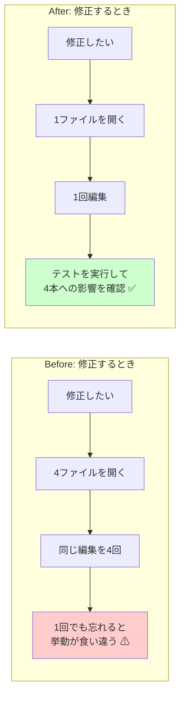

# 05. 効果測定レポート

改善案件No.2「コピペで増えた運用スクリプトを共通ライブラリ化して保守性と潜在バグを改善」

---

## 0. この文書の目的と、数値の扱いについて

改善が終わったら、**やったことを数値で報告する**。「きれいになりました」では、次に同じ改善をやる価値があるかどうかを誰も判断できない。

### 0-1. 数値の性質について(重要)

この文書に出てくる数値は、次の2種類のどちらかである。**どちらなのかを必ず明記する。**

| 種類 | 意味 | 表記 |
|---|---|---|
| **実測値** | このリポジトリの実コードを対象に、実際に数えた・実行した結果 | 「実測」と明記し、計測コマンドを示す |
| **試算** | 想定シナリオに基づく計算上の見積もり | 「試算」と明記し、前提条件を示す |

> **正直に書いておくべきこと**
> - この案件の依頼元・背景は**学習用の架空の設定**である。実在企業での実務実績ではない。
> - しかし**改善対象のコードは実在する**。このリポジトリ `projects/` 配下の、自分自身が書いた成果物である。
> - したがって「実測値」は本物の数値だが、「削減できた作業時間」のような値は**実際に運用して計測したものではなく、想定に基づく試算**である。実運用での効果を測ったわけではない。

---

## 1. 定量比較(Before → After)

### 1-1. 主要指標

| # | 指標 | Before | After | 種類 | 測定方法 |
|---|---|---|---|---|---|
| 1 | 重複していた共通処理 | **4ファイルに散在(合計120行)** | **共通ライブラリ1ファイルに集約** | 実測 | `src/count_duplication.sh` |
| 2 | 同種の修正で触るファイル数 | **4ファイル** | **1ファイル** | 実測 | ログ書式・Slack送信方法を変更する際に編集が必要なファイル数 |
| 3 | 潜在バグ(JSONエスケープ未対応) | **2箇所** | **0箇所** | 実測 | `grep` による検索(1-5節) |
| 4 | ログ書式 | **3種類** | **1種類** | 実測 | 4本が出力するログ行の書式の種類数 |
| 5 | 共通処理のテスト | **0件** | **35件(全件成功)** | 実測 | `src/test_opslib.sh` の実行結果 |
| 6 | Slack通知の成否がログに残るスクリプト | **1本 / 4本** | **4本 / 4本** | 実測 | HTTPステータスを確認しログに記録しているかどうか |
| 7 | 前提コマンドを起動時に確認するスクリプト | **1本 / 4本** | **4本 / 4本** | 実測 | `ops_require_commands` または同等の処理の有無 |
| 8 | shellcheck 警告(`-S warning`) | 0件 | **0件(維持)** | 実測 | `shellcheck -S warning *.sh` |

### 1-2. 指標1の測定: 重複していた共通処理の行数

**数え方のルール**(誰が数えても同じ値になるように、先にルールを決めた)

1. 対象は4カテゴリ(**ログ出力 / Slack通知 / 設定読み込み / 前提コマンドチェック**)に該当する関数定義ブロックと、その呼び出し準備コードのみ
2. ブロックの**開始行から終了行まで**を数える(途中の空行も含む)
3. ただし、行頭(先頭の空白を除く)が `#` で始まる行(コメントだけの行)は数えない

**実行コマンドと結果**

```bash
./improvements/02-shared-library-refactoring/src/count_duplication.sh
```

| カテゴリ | ファイル | 行範囲 | 行数 |
|---|---|---|---|
| ログ出力 | projects/01-user-account-automation/src/create_users.sh | 161-168 | 8 |
| 設定読み込み | projects/02-backup-automation/src/backup.sh | 32-41 | 9 |
| ログ出力 | projects/02-backup-automation/src/backup.sh | 50-57 | 8 |
| Slack通知 | projects/02-backup-automation/src/backup.sh | 62-72 | 11 |
| ログ出力 | projects/03-log-monitoring-alert/src/log-watch-alert.sh | 48-50 | 3 |
| 前提コマンドチェック | projects/03-log-monitoring-alert/src/log-watch-alert.sh | 59-68 | 10 |
| Slack通知 | projects/03-log-monitoring-alert/src/log-watch-alert.sh | 92-137 | 38 |
| 設定読み込み | projects/04-server-health-check/src/health_check.sh | 39-53 | 14 |
| ログ出力 | projects/04-server-health-check/src/health_check.sh | 62-69 | 8 |
| Slack通知 | projects/04-server-health-check/src/health_check.sh | 73-83 | 11 |

```text
合計(コメントのみの行を除く実コード行数): 120 行
重複が散在しているファイル数            : 4 ファイル
```

**カテゴリ別の内訳**

| カテゴリ | 行数 | 割合 |
|---|---|---|
| Slack通知 | 60行 | 50% |
| ログ出力 | 27行 | 23% |
| 設定読み込み | 23行 | 19% |
| 前提コマンドチェック | 10行 | 8% |

Slack通知が半分を占めている。これは、案件No.3 だけが機能を充実させた結果、他の2本と38行対22行という大きな差ができていたためである。**「同じ目的の処理なのに実装の充実度が違う」ことが、行数の偏りとして表れている。**

### 1-3. 指標2の測定: 同種の修正で触るファイル数

具体的な変更要望を想定して、編集が必要なファイル数を数えた。

| 想定する変更要望 | Before の編集ファイル数 | After の編集ファイル数 |
|---|---|---|
| ログにホスト名の列を追加したい | 4(`create_users.sh` / `backup.sh` / `log-watch-alert.sh` / `health_check.sh`) | **1**(`opslib.sh`) |
| Slack通知にリトライ処理を入れたい | 3(Slack通知を持つ3本) | **1**(`opslib.sh`) |
| Slack通知のタイムアウトを10秒から30秒に変えたい | 3 | **1** |
| ログのレベル表記を英語から日本語に変えたい | 4 | **1** |
| 設定ファイルの権限チェックを追加したい | 2(設定ファイルを読む2本) | **1** |

**Before は「4ファイル」、After は「1ファイル」。** これがこの改善の最大の成果である。

> **重要**: Before の「4」は、**4回同じ編集をしなければならない**という意味であると同時に、**4回のうち1回でも忘れれば、そのスクリプトだけ挙動が変わる**という意味でもある。今回発見した潜在バグは、まさにこの「忘れ」が実際に起きた結果である。

### 1-4. 指標4の測定: ログ書式の種類数

**Before(3種類)**

| 書式 | 使用しているファイル | 実際の出力例 |
|---|---|---|
| A: `[時刻] [レベル] 本文` | `create_users.sh` | `[2026-09-07 04:52:43] [INFO] ===== 処理を終了します =====` |
| B: `時刻 [レベル] 本文` | `backup.sh` / `health_check.sh` | `2026-09-07 04:52:43 [INFO] バックアップを作成します` |
| C: `[時刻] [レベル]␣␣本文` | `log-watch-alert.sh` | `[2026-09-07 04:41:54] [INFO]  監視を開始します`(レベル後の空白が2つ) |

**After(1種類)**

```text
時刻 [レベル] [タグ] 本文
```

```text
2026-09-07 04:52:11 [INFO] [backup] ===== バックアップ処理を開始します =====
2026-09-07 04:52:11 [INFO] [create_users] CSVファイル: users.csv
2026-09-07 04:40:17 [SKIP] [create_users] ユーザー root は既に存在するためスキップしました。
```

### 1-5. 指標3の測定: 潜在バグの箇所数

**Before**

```bash
grep -rn -- '--data "{\\"text' projects/ | grep -v ':[[:space:]]*#'
```

```text
projects/04-server-health-check/src/health_check.sh:81:        --data "{\"text\": \"${message}\"}" \
projects/02-backup-automation/src/backup.sh:70:        --data "{\"text\": \"${message}\"}" \
projects/06-cicd-pipeline/src/.github/workflows/deploy.yml:141:            --data "{\"text\": \"${ICON} [${{ github.repository }}] ${TEXT} (commit: ${{ github.sha }})\"}" \
```

**Bashスクリプト(この案件の対象)では2箇所。** 3件目は案件No.6のGitHub Actionsワークフローで、Bashスクリプトではないためスコープ外である(詳細は5章の残課題)。

**After**

```bash
grep -rn -- '--data "{\\"text' improvements/02-shared-library-refactoring/src/ \
  | grep -v ':[[:space:]]*#' || echo "文字列連結でJSONを組み立てている箇所は 0 件"
```

```text
文字列連結でJSONを組み立てている箇所は 0 件
```

**2箇所 → 0箇所。** すべての通知が `ops_slack_payload` を経由し、`jq` によるエスケープが保証される状態になった。

---

## 2. 正直に報告すべきこと: コードの総行数は増えている

**指標だけを並べると改善が一方的に良く見えるが、増えたものもある。** 隠さずに報告する。

| 項目 | 行数 | 備考 |
|---|---|---|
| Before: 4ファイルに散在していた共通処理 | **120行** | コメントのみの行を除く |
| After: `opslib.sh` の実コード | **161行** | コメント・空行を除く。ファイル全体では449行(うち大半が解説コメント) |
| After: 各スクリプトに残る連携コード | **50行** | 4本合計。ライブラリの読み込みと設定の橋渡し |

```bash
# opslib.sh の行数を数える
grep -vE '^[[:space:]]*#' opslib.sh | grep -cvE '^[[:space:]]*$'
```

```text
161
```

**合計すると、120行 → 211行(161 + 50)で、行数は約1.8倍に増えている。**

### 2-1. なぜ増えたのか

増えた分は、**改善前には無かった機能**である。

| 追加した機能 | なぜ必要か |
|---|---|
| 戻り値の設計(0 / 1 / 2 の使い分け) | ライブラリが `exit` しない設計にするため。呼び出し側が判断できるようにする |
| ログレベルによる出力抑制 | `OPS_LOG_LEVEL` で不要なログを止められるようにする |
| ドライラン機能(`OPS_SLACK_DRY_RUN`) | Slackへ実送信せずに動作確認・テストができるようにする |
| ログファイルの書き込み失敗への対処 | 書けなくても処理を止めず、最初の1回だけ警告する |
| 設定ファイルの読み取り権限・権限の緩さの確認 | 秘匿情報の権限不備に気づけるようにする |
| 不足コマンドの一括列挙 | 二度手間を防ぐ |
| 二重読み込みの防止・直接実行の防止 | ライブラリとしての行儀を守る |

### 2-2. この改善の目的は行数削減ではない

**行数を減らすことが目的なら、この改善は失敗である。** しかし目的はそこではなかった。



**測るべき指標は「総行数」ではなく「1つの変更に必要な編集箇所の数」である。** その指標では 4 → 1 に改善している。

> **面接で聞かれたときの答え方**
>
> 「共通化したのに行数が増えていますね」と指摘されたら、素直に認めたうえで、
> 「行数を減らすことは目的にしていません。目的は**同じ修正を何箇所に書くか**を減らすことで、そこは4箇所から1箇所になっています。増えた分は、戻り値の設計やドライラン機能など、改善前には無かった機能です」
> と答えられる状態にしておく。**数字を都合よく見せるのではなく、何を目的にしたのかを説明できることが重要である。**

---

## 3. テストで担保できた範囲

### 3-1. テストの実行結果

```bash
./improvements/02-shared-library-refactoring/src/test_opslib.sh
```

```text
===================================================================
 テスト結果: 成功 35件 / 失敗 0件
===================================================================
```

### 3-2. テストがカバーしている範囲

| 分類 | 件数 | 何を保証しているか |
|---|---|---|
| ログの書式 | 4 | 出力書式が設計どおりであること。ERRORが標準エラー出力に出ること |
| ログファイル出力 | 4 | 追記であること。階層を作ること。書けなくても `exit` しないこと |
| ログレベルの抑制 | 4 | 抑制が効くこと。**未知のレベル(SKIP)が消えないこと** |
| **Slackペイロードのエスケープ** | **6** | `"` `\` 改行 タブ を含む本文が、**元の文字列に復元できる形で**JSON化されること。旧方式が壊れること |
| Slack通知の分岐 | 4 | 無効時・ドライラン・設定不足の戻り値が正しいこと |
| 設定ファイル読み込み | 6 | 成功・失敗・権限警告。**失敗しても `exit` しないこと** |
| 前提コマンド確認 | 4 | 不足しているものを**すべて**列挙すること |
| ライブラリの行儀 | 3 | 二重読み込み可。シェルオプションを変えない。直接実行を拒否する |

### 3-3. エスケープのテストは「往復」で確認している

「JSONとして妥当」なだけでは不十分である。次のJSONは妥当だが中身が壊れている。

```json
{"text": "対象 public html を開けません"}
```

そこでテストでは、**元の文字列 → JSON化 → `jq -r '.text'` で取り出し → 元の文字列と完全一致するか**、という往復で確認している。一致して初めて、エスケープと復元が正しいと言える。

### 3-4. テストで担保**できていない**範囲(正直に書く)

| 担保できていないこと | 理由 | 代わりにどう確認したか |
|---|---|---|
| Slackへの実際の送信 | 本物のWebhook URLが必要で、テストのたびに実チャンネルへ投稿してしまう | ドライランでペイロードを検証。HTTP部分は手動確認に委ねる |
| 各スクリプト固有のロジック(tar / ping / CSV解析) | 今回の改善対象外 | 移行後に各スクリプトを実際に動かして目視確認([04-build-guide.md](./04-build-guide.md)) |
| 4本のスクリプト自体の自動テスト | ライブラリのテストであり、利用側のテストは作っていない | 手順書のチェックリスト(12項目)による手動確認 |
| 大量ログ・長時間稼働時の挙動 | 検証環境で再現しにくい | 未検証。残課題とする |
| 権限の異なる環境(非root、SELinux有効など) | 検証環境が限られる | 未検証。残課題とする |

**「テストがあるから安全」ではなく、「テストが見ている範囲はここまで」を把握しておくことが重要である。**

---

## 4. 達成できたこと / できなかったこと

### 4-1. 達成できたこと

| # | 内容 | 根拠 |
|---|---|---|
| 1 | 4カテゴリの共通処理を1ファイルに集約した | `opslib.sh` に公開関数11個 |
| 2 | ログ書式を3種類から1種類に統一した | 1-4節の比較 |
| 3 | JSONエスケープの潜在バグを解消した(Bashスクリプト2箇所 → 0箇所) | 1-5節の検索結果 |
| 4 | 同種の修正で触るファイル数を4から1にした | 1-3節の想定変更要望での比較 |
| 5 | 共通処理に35件のテストを用意した | `test_opslib.sh` の実行結果 |
| 6 | Slack通知の成否がログに残るようにした(1本 → 4本) | `ops_notify_slack` がHTTPステータスを確認 |
| 7 | 前提コマンドの確認を全スクリプトに広げた(1本 → 4本) | `ops_require_commands` |
| 8 | 既存の設定ファイルを一切変更せずに移行できるようにした | `diff` で `backup.conf` / `health_check.conf` が同一であることを確認 |
| 9 | ログにタグ列を追加し、複数ログを混ぜても出力元を判別できるようにした | 1-4節の出力例 |
| 10 | shellcheck の警告0件を維持した | 全8スクリプトで `-S warning` 警告なし |

### 4-2. 達成できなかったこと・意図的にやらなかったこと

| # | 内容 | 理由 |
|---|---|---|
| 1 | **コードの総行数の削減** | 目的にしていない。むしろ機能追加で増えた(2章) |
| 2 | **`projects/` 配下の元ファイルの実際の書き換え** | Beforeの証拠として原状保存する方針。改善版は `improvements/.../src/` に置き、移行手順として書き換え方を示す形にした |
| 3 | **`LOG_FILE` の意味の衝突そのものの解消** | 案件No.3 では「監視対象」、他では「出力先」という正反対の意味。設定ファイルを変えない方針のため、ライブラリ側で `OPS_LOG_FILE` という別名を使って**回避**しただけで、根本解決はしていない |
| 4 | **設定ファイルの書式統一** | 運用担当者の作業を発生させないため、意図的に見送った |
| 5 | **案件固有ロジックの共通化**(`check_ping` など) | 1か所でしか使われていないため。共通化の基準は「実際に2か所以上で重複しているか」 |
| 6 | **ライブラリの共有ディレクトリへの集約** | 段階的移行を可能にするため、当面は各ディレクトリにコピーを置く方式にした |
| 7 | **案件No.6(CI/CD)のワークフロー内の同種のバグ** | Bashスクリプトではなく、今回のスコープ外。残課題として記録(5章) |
| 8 | **実運用での作業時間削減の計測** | 架空の案件設定であり、実運用していないため計測できない。**試算も載せていない** |

### 4-3. 特に正直に書いておきたいこと

**この改善は「同じ問題が二度と起きない」ことを保証しない。**

共通化したのは4カテゴリだけである。今後、また別の処理をコピペで増やせば、まったく同じ問題が再発する。ライブラリがあることで**再発しにくくはなった**が、**構造的に防いだわけではない**。

本当に再発を防ぐには、

- 新しいスクリプトを書くときに、まず `opslib.sh` に該当機能があるか確認する習慣
- コードレビューで「これはコピペではないか」を確認する仕組み

といった、**コードではなく運用のルール**が必要である。今回の改善はその土台を作ったにすぎない。

---

## 5. 残課題と次の改善

| # | 残課題 | 内容 | 優先度 | 次にやること |
|---|---|---|---|---|
| R-1 | **案件No.6のワークフローに同種のJSON手組みが残っている** | `projects/06-cicd-pipeline/src/.github/workflows/deploy.yml` の141行目。Bashスクリプトではないため今回のスコープ外としたが、**同じ壊れ方をする** | 高 | 別案件として、GitHub Actions内のSlack通知も `jq` を使う形に修正する |
| R-2 | `LOG_FILE` の意味の衝突が残っている | 案件No.3 だけ意味が正反対。今回は `OPS_LOG_FILE` という別名で回避しただけ | 中 | 設定ファイルの変数名を見直す案件を立てる。運用担当者への影響があるため計画的に |
| R-3 | 利用側スクリプト自体の自動テストがない | ライブラリのテストはあるが、4本のスクリプトのテストは手動確認のみ | 中 | 最低限「ドライランで正常終了し、期待するログが出る」ことを自動確認する仕組みを作る |
| R-4 | ライブラリが各ディレクトリにコピーされている | 4本すべてが移行完了して安定したら、共有ディレクトリへの集約を検討できる | 低 | `/usr/local/lib/opslib.sh` へ集約し、各スクリプトはそこを参照する形へ。ただし更新が全体に即時反映される点のリスク評価が必要 |
| R-5 | ログのローテーション設計が統一されていない | 案件No.2 にだけ `logrotate` 設定がある | 低 | ログ書式が統一された今なら、共通の `logrotate` 設定を1つ作れる |
| R-6 | 大量ログ・長時間稼働時の挙動が未検証 | `ops_log` は1行ごとに追記リダイレクトを行う | 低 | 負荷試験を行い、必要ならバッファリングを検討 |
| R-7 | 通知手段がSlackのみ | メールやその他の通知先に対応していない | 低 | `ops_notify_mail` などを追加する。ライブラリの構造上、追加は容易 |
| R-8 | ログ集約基盤への連携ができていない | 書式は統一されたが、まだ各サーバーのファイルに散らばっている | 低 | `logger` コマンド経由で journald/syslog へ流す `ops_log` の拡張を検討。**書式が1種類になった今なら、解析ルールを1つ書くだけで済む** |

### 5-1. R-8 について: この改善が次につながる理由

[02-improvement-proposal.md](./02-improvement-proposal.md) で「案D(外部ツール導入)」を見送った理由は、**書式が3種類のまま集約基盤へ入れても、解析ルールを3つ書く羽目になる**からだった。

今回の改善で書式が1種類になったため、**次の段階へ進む前提条件が整った**。


**改善は1回で終わりではなく、次の改善の土台を作るものでもある。** 「今回やらなかったこと」を残課題として明記しておくことで、次に何をすべきかが引き継げる。

---

## 6. この改善を振り返って(学びの記録)

### 6-1. 一番の学び: 「1箇所直しても他が直らない」を実体験した

この案件で最も価値があったのは、**自分が書いたコードで、自分が実際にその失敗をしていた**と気づいたことである。

案件No.3 を作ったとき、確かに「手動で文字列連結してJSONを組み立てると壊れたJSONになりやすい」とコメントまで書いて対処していた。**問題を理解していた。** それでも、コピペ元だった案件No.2・No.4 へ戻って直すことはしなかった。

「コピペは良くない」と知識として知っていても、**コピペしたことを覚えていなければ直しようがない**。コピー元とコピー先の間に何のつながりも残らないというのは、そういうことである。

### 6-2. 共通化にはデメリットもある

`opslib.sh` にバグを入れれば、4本すべてが同時に壊れる。改善前は `backup.sh` を壊しても `backup.sh` だけの問題だった。

**共通化は「変更の手間」と「変更の影響範囲」を交換する取引である。** 手間は減るが、影響範囲は広がる。だからテストという安全網を先に用意した。

### 6-3. 動いているものを変えるときの原則

| 原則 | この案件での実践 |
|---|---|
| 変える前に現状を記録する | Step 0 で行数・バグの再現・ログ書式を記録 |
| 一度に全部変えない | 1本ずつ移行し、そのつど動作確認 |
| 戻せる状態を作ってから進む | 移行前に `.bak` へ退避 |
| 既存の利用者に作業をさせない | 設定ファイルの書式を一切変えない |
| 今ある挙動を壊さない | 独自レベル `SKIP` が消えないよう配慮 |
| 効果は数値で示す | 計測スクリプトを成果物として残す |

---

## 関連ドキュメント

- [README.md](./README.md) — 改善案件の概要
- [01-current-analysis.md](./01-current-analysis.md) — 現状分析書(Beforeの数値の出典)
- [02-improvement-proposal.md](./02-improvement-proposal.md) — 改善提案書(目標値の出典)
- [04-build-guide.md](./04-build-guide.md) — 実装・移行手順書(前に読む文書)
- [06-troubleshooting.md](./06-troubleshooting.md) — トラブルシューティング集
- [src/count_duplication.sh](./src/count_duplication.sh) — 行数計測スクリプト
- [src/test_opslib.sh](./src/test_opslib.sh) — テストスクリプト
