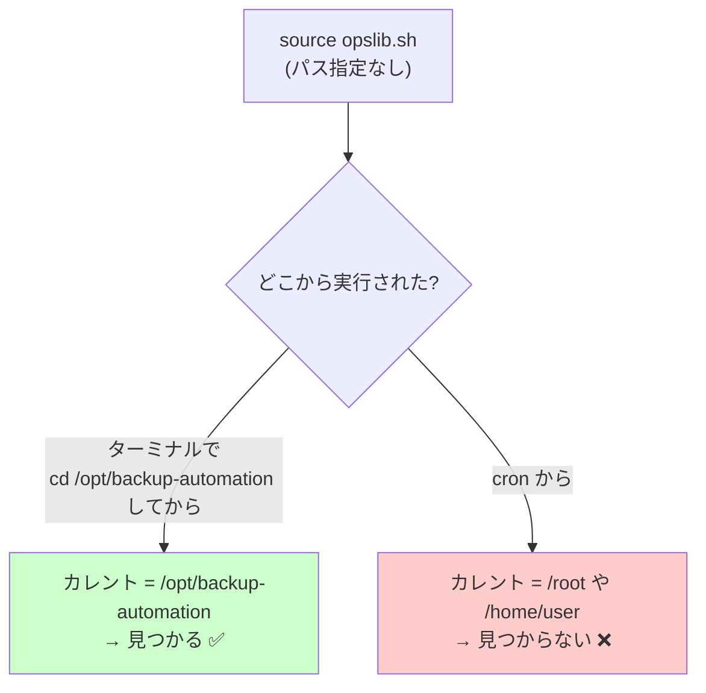
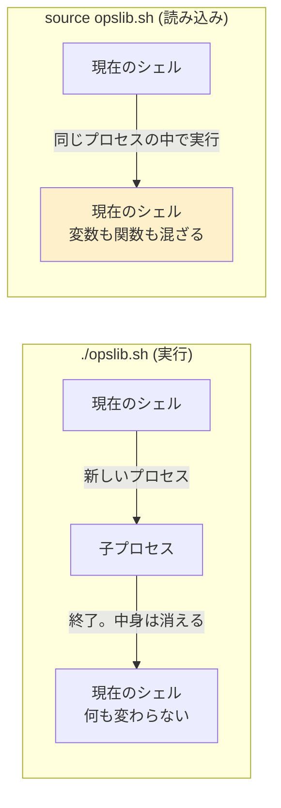
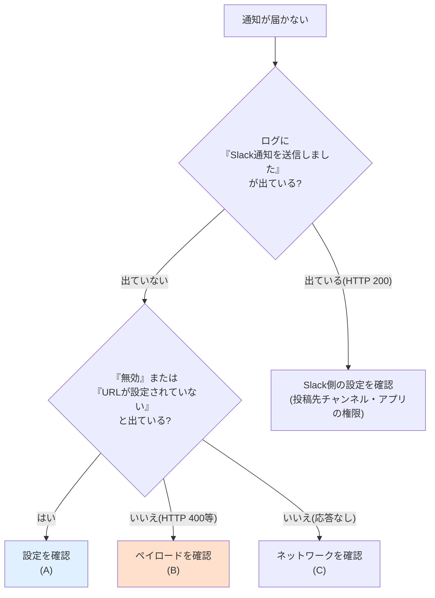

# 06. トラブルシューティング集

改善案件No.2「コピペで増えた運用スクリプトを共通ライブラリ化して保守性と潜在バグを改善」

---

## 0. この文書の使い方

共通ライブラリの導入・移行でつまずきやすい点を、Q&A形式でまとめた。**症状から探せるように、各項目の先頭に「こう見える」という症状を書いている。**

| # | 症状 | 分類 |
|---|---|---|
| [Q1](#q1) | `opslib.sh: No such file or directory` と出て起動しない | `source` のパス |
| [Q2](#q2) | 手元では動くのに cron から実行すると動かない | `source` のパス |
| [Q3](#q3) | ライブラリを読み込んだら、関係ない変数の中身が変わった | 変数汚染 |
| [Q4](#q4) | `SC1090` / `SC2034` などの shellcheck 警告が出る | shellcheck |
| [Q5](#q5) | Slack通知が届かない / `HTTP 400` が返る | Slack通知 |
| [Q6](#q6) | ログがファイルに書かれない | ログ出力 |
| [Q7](#q7) | 移行したらログの見た目が変わり、既存の集計が動かなくなった | 移行 |
| [Q8](#q8) | `ops_log_error` の出力が画面に見えない / ログに残らない | ログ出力 |
| [Q9](#q9) | テストが失敗する | テスト |
| [Q10](#q10) | 移行後、スクリプトが途中で止まる・後片付けが実行されない | ライブラリ設計 |

---

<a id="q1"></a>
## Q1. 実行すると「共通ライブラリが見つかりません」と出て止まる

### 症状

```text
[ERROR] 共通ライブラリが見つかりません: /opt/backup-automation/opslib.sh
```

あるいは、自分でライブラリ読み込みを書いた場合は次のようなエラーになる。

```text
./backup.sh: line 53: opslib.sh: No such file or directory
```

### 原因

`opslib.sh` が、スクリプトと同じディレクトリに置かれていない。

このライブラリは**各スクリプトのディレクトリに1つずつコピーを置く**方式である([03-design.md](./03-design.md) 1-2)。スクリプトだけをコピーして、ライブラリを忘れているケースが最も多い。

### 確認方法

```bash
ls -l /opt/backup-automation/
```

```text
-rw------- 1 root root  1873 Sep  7 04:37 backup.conf
-rwxr-xr-x 1 root root  9480 Sep  7 04:37 backup.sh
```

`opslib.sh` が無い。

### 対処

```bash
sudo cp improvements/02-shared-library-refactoring/src/opslib.sh /opt/backup-automation/
sudo chmod 644 /opt/backup-automation/opslib.sh
ls -l /opt/backup-automation/opslib.sh
```

```text
-rw-r--r-- 1 root root 22106 Sep  7 04:33 /opt/backup-automation/opslib.sh
```

> **補足**: ライブラリに実行権限(`+x`)は不要である。`source` は実行権限を必要としない。むしろ付けないほうが「直接実行するものではない」という意図が伝わる。

---

<a id="q2"></a>
## Q2. 手元では動くのに、cron から実行すると動かない

### 症状

ターミナルで `./backup.sh` と実行すると正常に動くが、cron に登録すると次のエラーメールが届く。

```text
/opt/backup-automation/backup.sh: line 53: opslib.sh: No such file or directory
```

### 原因

**`source opslib.sh` のように、相対パス(あるいはパス無し)で書いている。**

`source` は、パスを指定しない場合「**カレントディレクトリ**」と `PATH` から探す。ターミナルではスクリプトのあるディレクトリで実行しているので見つかるが、**cron はホームディレクトリをカレントディレクトリとして実行する**ため見つからない。



### 対処

**`${BASH_SOURCE[0]}` を使って、スクリプト自身の場所を基準に探す。**

```bash
# ❌ 悪い例: カレントディレクトリに依存する
source opslib.sh

# ❌ 惜しい例: $0 は起動のされ方で中身が変わる
source "$(dirname "$0")/opslib.sh"

# ⭕ 良い例: 常にこのファイル自身の場所を指す
SCRIPT_DIR="$(cd "$(dirname "${BASH_SOURCE[0]}")" && pwd)"
source "${SCRIPT_DIR}/opslib.sh"
```

`${BASH_SOURCE[0]}` は「今実行中のファイル自身のパス」を指すBashの特別な変数である。`dirname` でディレクトリ部分を取り出し、`cd` して `pwd` することで絶対パスに変換している。

### 確認方法(cron 環境の再現)

cron は環境変数も最小限しか持たない。それを再現して確認できる。

```bash
cd / && env -i /bin/bash -c '/opt/backup-automation/backup.sh'
```

`env -i` は「環境変数を一切引き継がずに実行する」オプションである。これで動けば、cron からも動く可能性が高い。

> **cron のトラブルで最も多い2大原因**
> 1. **カレントディレクトリが違う**(このQ2)
> 2. **`PATH` が最小限で、コマンドが見つからない** — `jq` や `curl` が `/usr/local/bin` にある場合など。crontab の先頭に `PATH=/usr/local/bin:/usr/bin:/bin` を書くか、コマンドを絶対パスで指定する

---

<a id="q3"></a>
## Q3. ライブラリを読み込んだら、関係ないはずの変数の中身が変わった

### 症状

```bash
CONFIG_FILE="/etc/myapp/app.conf"
source "${SCRIPT_DIR}/opslib.sh"
echo "$CONFIG_FILE"     # ← 中身が変わっている、あるいは空になっている
```

### 原因

**`source` は、別プロセスを作らず「今のシェルの中で」ファイルの中身を実行する。** そのため、ライブラリが定義した変数や関数は、呼び出し側とまったく同じ空間に置かれる。

Bashには他の言語のような「名前空間」「モジュール」の仕組みが**存在しない**。ライブラリが `CONFIG_FILE` という変数を使えば、呼び出し側の `CONFIG_FILE` は**上書きされて消える**。関数も同じで、ライブラリが `log()` を定義すれば、呼び出し側の `log()` は消える。



### 対処: 接頭辞で名前空間を作る

`opslib.sh` は、この問題を**すべての名前に接頭辞を付ける**ことで回避している。

| 対象 | 規則 | 例 |
|---|---|---|
| 公開関数 | `ops_` | `ops_log_info` |
| 内部関数 | `_ops_` | `_ops_timestamp` |
| 公開設定変数 | `OPS_` | `OPS_LOG_FILE` |
| 内部状態変数 | `_OPS_` | `_OPS_LOG_FILE_WARNED` |
| 関数内のローカル変数 | `local` + `_ops_` | `local _ops_message` |

したがって、**`OPS_` / `ops_` で始まる名前を呼び出し側で使わない限り、衝突は起きない。**

### 特に注意: `local` を付けるだけでは足りない場合がある

```bash
# ライブラリ側(悪い例)
ops_load_config() {
    local file="$1"
    source "$file"     # ← 設定ファイルに file=... と書かれていたら?
    echo "$file"       # ← ローカル変数 file が書き換わっている
}
```

`source` を関数の中で実行すると、設定ファイル内の代入が**関数のローカル変数を書き換えてしまう**。そのため `opslib.sh` では、ローカル変数の名前まで `_ops_` で始めている。

```bash
# ライブラリ側(採用している書き方)
ops_load_config() {
    local _ops_cfg="$1"
    source "$_ops_cfg"
}
```

### 確認方法

ライブラリを読み込む前後で、シェルオプションが変わっていないことも確認できる。

```bash
opts_before="$-"
source "${SCRIPT_DIR}/opslib.sh"
opts_after="$-"
[ "$opts_before" = "$opts_after" ] && echo "シェルオプションは変化していない"
```

```text
シェルオプションは変化していない
```

`$-` には有効なシェルオプションの文字が入る(`u` = `set -u`、`e` = `set -e` など)。`opslib.sh` はシェルオプションを一切変更しない設計であり、この確認はテスト([8]の項目)にも含まれている。

---

<a id="q4"></a>
## Q4. shellcheck が SC1090 / SC2034 などの警告を出す

### 症状1: SC1090

```text
In backup.sh line 53:
source "${SCRIPT_DIR}/opslib.sh"
       ^-- SC1090 (warning): ShellCheck can't follow non-constant source. Use a directive to specify location.
```

### 原因

shellcheck は**実行せずにコードを読む**ツールなので、`${SCRIPT_DIR}` の中身が実行時にしか決まらない場合、どのファイルを読み込むのか判断できない。

### 対処

読み込むファイルの場所を、指示コメントで教える。

```bash
# shellcheck source=./opslib.sh
source "${SCRIPT_DIR}/opslib.sh"
```

読み込むファイルが本当に不定の場合(`ops_load_config` の中など)は、次のように書く。

```bash
# shellcheck source=/dev/null
source "$_ops_cfg"
```

`source=/dev/null` は「解析できないことを承知している」という意思表示である。

---

### 症状2: SC2034

```text
In backup.sh line 97:
OPS_SLACK_ENABLED="$ENABLE_SLACK_NOTIFY"
^---------------^ SC2034 (warning): OPS_SLACK_ENABLED appears unused. Verify use (or export if used externally).
```

### 原因

`OPS_SLACK_ENABLED` は `opslib.sh` の中の `ops_notify_slack` が参照している。しかし shellcheck は**既定では `source` 先のファイルを解析しない**ため、「代入しただけで使っていない変数」だと誤検知する。

### 対処: 2つの方法がある

**方法A(推奨): `-x` オプションを付けて実行する**

```bash
shellcheck -x -S warning backup.sh
```

`-x` は「`source` 先のファイルも解析する」オプションである。これが最も正確な結果になる。

**方法B: その行だけ警告を抑止する**

`-x` なしで実行される場合(CIの設定を変えられないなど)に備え、対象の行だけ抑止する。

```bash
# 以下2つの変数は opslib.sh の ops_notify_slack が参照する。
# ただし解析ツールは既定では source 先まで読まないため誤検知される。
# shellcheck disable=SC2034
OPS_SLACK_ENABLED="$ENABLE_SLACK_NOTIFY"
# shellcheck disable=SC2034
OPS_SLACK_WEBHOOK_URL="$SLACK_WEBHOOK_URL"
```

### 落とし穴: 説明コメントを「shellcheck」で書き始めない

**次のように書くと、shellcheck が指示行だと誤解してエラーになる。**

```bash
# shellcheck は既定では source 先を解析しないため誤検知します   ← ❌
```

```text
In backup.sh line 89:
# shellcheck は既定では source 先を...
  ^-- SC1072 (error): Expected '=' after directive key.
  ^-- SC1073 (error): Couldn't parse this shellcheck directive.
```

`#` の直後に `shellcheck` という語が来ると、内容にかかわらず**指示行として解析される**。説明文を書くときは、この語で始めないようにする。

```bash
# 解析ツールは既定では source 先を解析しないため誤検知されます   ← ⭕
```

---

### 症状3: `disable` を書いたのに効かない

**原因**: `# shellcheck disable=SCxxxx` は、**直後の1コマンドにしか効かない。**

ファイル全体に効かせたい場合は、**ファイル内の最初のコマンドより前**(シバンとコメントだけがある位置)に置く必要がある。

```bash
#!/usr/bin/env bash
# ここは最初のコマンドより前なので、ファイル全体に効く
# shellcheck disable=SC2034

set -uo pipefail   # ← これが最初のコマンド
```

`set -uo pipefail` の**後**に書くと、その次の1コマンドにしか効かない。

---

<a id="q5"></a>
## Q5. Slack通知が届かない

### 切り分けの手順

原因は複数ありうるので、**上から順に切り分ける**。



### (A) 設定の問題

**症状**

```text
2026-09-07 04:39:15 [ERROR] [backup] OPS_SLACK_WEBHOOK_URL が設定されていないため、Slack通知を送信できません
```

**原因**: 設定ファイルの `SLACK_WEBHOOK_URL` から `OPS_SLACK_WEBHOOK_URL` への**橋渡しを書き忘れている**。

**対処**: 設定を読み込んだ後に、橋渡しの2行があるか確認する。

```bash
grep -n 'OPS_SLACK' backup.sh
```

```text
97:OPS_SLACK_ENABLED="$ENABLE_SLACK_NOTIFY"
99:OPS_SLACK_WEBHOOK_URL="$SLACK_WEBHOOK_URL"
```

また、次のログが出る場合は通知が意図的に無効化されている。

```text
2026-09-07 04:39:15 [DEBUG] [backup] Slack通知は無効(OPS_SLACK_ENABLED=false)のため送信しません
```

`DEBUG` レベルなので、既定の `OPS_LOG_LEVEL=INFO` では表示されない。表示したい場合は `OPS_LOG_LEVEL=DEBUG` を指定する。

```bash
OPS_LOG_LEVEL=DEBUG ./backup.sh
```

### (B) ペイロードの問題(HTTP 400)

**症状**

```text
2026-09-07 04:39:15 [ERROR] [backup] Slack通知の送信に失敗しました(HTTP 400)
```

**原因**: JSONが壊れている。**改善前のコードを使っている可能性が高い。**

**確認方法**: 送るはずのJSONを、実送信せずに表示して確認する。

```bash
OPS_SLACK_DRY_RUN=true ./backup.sh
```

```text
2026-09-07 04:37:57 [INFO] [backup] Slack通知(ドライラン。実際には送信しません): {"text":":warning: [容量警告] ..."}
```

さらに、そのJSONが妥当かどうかを機械的に判定する。

```bash
echo '{"text": "対象 "public html" を開けません"}' | jq empty && echo "妥当" || echo "壊れている"
```

```text
jq: parse error: Invalid numeric literal at line 1, column 25
壊れている
```

`column 25` は、`"対象 "` で文字列が終わったと解釈された直後の位置を指している。JSONの解析器は、そこから始まる `public` を数値として読もうとして失敗している。

**対処**: `ops_notify_slack` を使う(改善版のスクリプトへ移行する)。改善版は `jq -n --arg` でエスケープするため、この問題は起きない。

再現デモで違いを確認できる。

```bash
./demo_json_bug.sh
```

### (C) ネットワークの問題

**症状**

```text
2026-09-07 04:39:15 [ERROR] [backup] Slack通知の送信に失敗しました(HTTP 応答なし)
```

**原因**: 名前解決の失敗、プロキシ経由が必要、ファイアウォールで遮断、など。

**確認方法**

```bash
curl -sS -o /dev/null -w '%{http_code}\n' --max-time 10 https://slack.com/
```

**対処**: プロキシ環境なら `HTTPS_PROXY` を設定する。cron から実行する場合は、crontab 側にも環境変数を書く必要がある。

> **補足**: `opslib.sh` は Slack通知の失敗で処理全体を止めない設計である。通知が失敗しても、バックアップや監視といった**本来の処理は最後まで実行される**。ログに `[ERROR]` として記録されるので、後から気づける。

---

<a id="q6"></a>
## Q6. ログがファイルに書かれない(画面には出る)

### 症状

画面にはログが出るが、ログファイルが空、あるいは作られていない。

### 原因1: `ops_log_init` を呼んでいない

`OPS_LOG_FILE` の既定値は**空**である。空の場合、ログは画面にしか出ない。

**確認方法**

```bash
grep -n 'ops_log_init' backup.sh
```

何も出なければ、呼び出しを書き忘れている。

**対処**

```bash
if ! ops_log_init "$LOG_FILE"; then
    exit 1
fi
```

### 原因2: 書き込み権限がない

**症状**

```text
2026-09-07 04:39:15 [WARN] [backup] ログファイルに書き込めません(以後この警告は表示しません): /var/log/backup-automation/backup.log
```

**確認方法**

```bash
ls -ld /var/log/backup-automation/
id
```

**対処**: `sudo` を付けて実行するか、ディレクトリの権限を調整する。

> **設計上の補足**: この警告は**最初の1回だけ**表示される。毎行警告を出すと画面が警告で埋まり、本来のログが読めなくなるためである。また、**ログが書けなくても処理は止まらない**。「ログが書けない」という理由でバックアップが中止されるのは本末転倒だからである。

### 原因3: `ops_log_init` が失敗しているのに戻り値を見ていない

```bash
# ❌ 戻り値を確認していない
ops_log_init "$LOG_FILE"

# ⭕ 確認している
if ! ops_log_init "$LOG_FILE"; then
    exit 1
fi
```

`opslib.sh` はライブラリの中で `exit` しない設計なので、**戻り値を見なければ失敗に気づけない。**

---

<a id="q7"></a>
## Q7. 移行したらログの見た目が変わり、既存の集計スクリプトが動かなくなった

### 症状

移行前に作っていた集計コマンドが、0件しか返さなくなった。

```bash
grep '^\[' /var/log/create_users.log | wc -l
```

```text
0
```

### 原因

**これは不具合ではなく、意図した変更である。** ログ書式を1種類に統一したため、案件No.1 の書式が変わった。

| | 書式 | 例 |
|---|---|---|
| 移行前 | `[時刻] [レベル] 本文` | `[2026-09-07 04:52:43] [INFO] 処理を開始します` |
| 移行後 | `時刻 [レベル] [タグ] 本文` | `2026-09-07 04:52:11 [INFO] [create_users] 処理を開始します` |

### 対処: 集計コマンドを新しい書式に合わせる

新しい書式は、**むしろ扱いやすくなっている**。

| やりたいこと | 移行前 | 移行後 |
|---|---|---|
| ERROR行を抽出 | `grep '\[ERROR\]' app.log` | `grep '\[ERROR\]' app.log`(同じ) |
| レベル別に件数を数える | ファイルごとに書き分けが必要 | `awk '{print $3}' *.log \| sort \| uniq -c` |
| 出力元スクリプト別に数える | **不可能**(情報が無い) | `awk '{print $4}' *.log \| sort \| uniq -c` |
| 複数ログを時系列に並べる | **崩れる** | `cat *.log \| sort` |

実行例:

```bash
cat logs/*.log | awk '{print $3}' | sort | uniq -c
```

```text
     17 [INFO]
```

```bash
cat logs/*.log | awk '{print $4}' | sort | uniq -c
```

```text
      7 [backup]
     10 [create_users]
```

### 移行時に気をつけること

**書式の変更は、ログを見る側にも影響する。** 移行前に、次を確認しておく。

1. ログを解析している既存のスクリプト・ツールがないか
2. ログ集約基盤に取り込んでいる場合、解析ルールの変更が必要か
3. 監視アラートがログの文字列に依存していないか

今回のように「そもそも書式が3種類でまともに解析できていなかった」場合は影響が小さいが、**一部だけ整った解析がある場合は、移行と同時に解析側も更新する計画が必要である。**

---

<a id="q8"></a>
## Q8. `ops_log_error` の出力が画面に見えない

### 症状

```bash
./backup.sh > result.txt
cat result.txt      # ← ERROR行が入っていない
```

### 原因

**これも意図した設計である。** `ops_log_error` だけは**標準エラー出力**に出る。

| レベル | 出力先 |
|---|---|
| DEBUG / INFO / WARN / その他 | 標準出力 |
| **ERROR** | **標準エラー出力** |

### なぜそうしているのか

cron は「実行したコマンドが**標準エラー出力に何か出したときにだけ**管理者へメールを送る」という設定ができる。ERROR を分けておくことで、**異常が起きたときだけメールが届く**運用ができる。

改善前の案件No.1/No.2/No.4 は ERROR も標準出力に出していたため、この仕組みが使えなかった。

### 対処

**両方をファイルに残したい場合**

```bash
./backup.sh > result.txt 2>&1
```

`2>&1` は「標準エラー出力を、標準出力と同じ場所へ流す」という指定である。

**ERROR だけを取り出したい場合**

```bash
./backup.sh 2> errors.txt 1> /dev/null
cat errors.txt
```

**ログファイルには両方が記録される**

`ops_log_init` でログファイルを設定していれば、**レベルにかかわらず全行がファイルに記録される**。画面での出し分けとは別の話である。

```bash
cat /var/log/backup-automation/backup.log | grep '\[ERROR\]'
```

---

<a id="q9"></a>
## Q9. テストが失敗する

### 症状

```text
  [FAIL] 権限が緩い設定ファイルには警告を出す
         含まれるべき文字列: >chmod 600<
         実際値            : ><
```

### 原因の切り分け

テストが失敗したとき、原因は次の3つのどれかである。**まずどれなのかを判断する。**

| 原因 | 見分け方 | 対処 |
|---|---|---|
| **ライブラリのバグ** | 期待どおりの動作をしていない | ライブラリを直す |
| **テストのバグ** | ライブラリは正しいが、テストの検証方法が間違っている | テストを直す |
| **環境の違い** | 別の環境では成功する | 環境依存を減らすか、前提を明記する |

上の例は**テストのバグ**だった。ライブラリの警告は `ops_log_warn`(=標準出力)で出るのに、テストが標準エラー出力だけを見ていたため、何も捕まえられなかった。

```bash
# ❌ テストの誤り: 標準エラー出力だけを見ていた
loose_warn="$(ops_load_config "$cfg_loose" 2>&1 1> /dev/null)"

# ⭕ 修正: WARNは標準出力に出るので、標準出力を受け取る
loose_warn="$(ops_load_config "$cfg_loose")"
```

> **教訓**: テストが失敗したとき、反射的にライブラリを疑わないこと。**テストが間違っている可能性も同じくらいある。** どちらが正しいかは「設計としてどうあるべきか」に立ち返って判断する。この例では「ERROR だけを標準エラー出力に出す」という設計が正しく、テストの側が間違っていた。

### よくある環境依存の失敗

| 症状 | 原因 | 対処 |
|---|---|---|
| `jq: command not found` でテストが失敗する | `jq` が未インストール | `sudo apt-get install -y jq` |
| 権限テストだけが失敗する | root で実行しているため、権限に関係なく読み書きできてしまう | 一般ユーザーでも実行して確認する |
| `mktemp -d` が失敗する | `/tmp` の空き容量不足、または権限 | `df -h /tmp` で確認 |

### テスト全体の成否を確認する

```bash
./test_opslib.sh > /dev/null 2>&1; echo "終了ステータス: $?"
```

```text
終了ステータス: 0
```

`0` なら全件成功、`1` なら1件以上失敗である。

---

<a id="q10"></a>
## Q10. 移行後、スクリプトが途中で止まる・後片付けが実行されない

### 症状

移行後、一時ファイルが残るようになった。あるいは、エラー時にログの最終行が出力されなくなった。

### 原因: ライブラリの中で `exit` している

自分でライブラリに手を加えた場合に起きやすい。

```bash
# ❌ ライブラリの中で exit してはいけない
ops_load_config() {
    if [ ! -f "$1" ]; then
        ops_log_error "設定ファイルが見つかりません: $1"
        exit 1          # ← 呼び出し元のスクリプトごと終了してしまう
    fi
    ...
}
```

**`source` されたファイルの中の `exit` は、呼び出し元のスクリプトを丸ごと終了させる。** そのため、呼び出し側が用意していた後片付け(一時ファイルの削除、状態ファイルの書き戻し、終了ログの出力)が実行されなくなる。

`health_check.sh` を例にすると、`mktemp` で作った一時ファイルが `mv` される前に終了してしまい、`/tmp` にゴミが残り続ける。

### 対処: 戻り値で返し、終了の判断は呼び出し側に任せる

```bash
# ⭕ ライブラリ側: exit せず return で伝える
ops_load_config() {
    if [ ! -f "$1" ]; then
        ops_log_error "設定ファイルが見つかりません: $1"
        return 1
    fi
    ...
}

# ⭕ 呼び出し側: どうするかを自分で決める
if ! ops_load_config "$CONFIG_FILE"; then
    exit 1        # このスクリプトでは「設定が無いなら続行不能」と判断
fi
```

### なぜ呼び出し側が決めるべきなのか

同じ「Slack通知に失敗した」という事象でも、あるべき対応は案件によって違う。

| 案件 | 通知が失敗したときの正しい対応 |
|---|---|
| バックアップ | 止めない。バックアップ自体は成功しているかもしれない |
| 死活監視 | 止めない。残りのサーバーのチェックとレポート生成を続けたい |
| ログ監視(常駐) | 止めない。通知1回の失敗で監視全体が停止したら困る |

**ライブラリはこの判断ができない。** だから戻り値で状況だけを伝え、判断は呼び出し側に委ねる。

### 確認方法

ライブラリに実行される `exit` が無いことを確認する。

```bash
grep -n 'exit' opslib.sh
```

```text
29:#   3. ライブラリの中で exit しない。異常は戻り値(return)で伝える。
30:#      ライブラリが勝手に exit すると、呼び出し側が「後片付け処理」を
60:    exit 1
272:#     旧実装は1つ見つからない時点で exit していた。そのため
276:#     また exit せず戻り値で返すので、呼び出し側が終了方法を決められる。
396:#   このライブラリは通知失敗を「ログに残すが exit はしない」方針にしている。
```

`#` で始まる行は解説コメントなので、実際に実行される `exit` は**60行目の1箇所だけ**である。コメントを除いて数えるなら次のようにする。

```bash
grep -n 'exit' opslib.sh | grep -v ':[[:space:]]*#'
```

```text
60:    exit 1
```

この1箇所は、**ライブラリが直接実行されたとき**(`source` ではなく `./opslib.sh` と実行されたとき)に使い方を案内して終了する処理である。`source` されている状況では、その手前の判定によってこの行には到達しない。**関数の中には `exit` が1つも無い。**

---

## 付録: よく使う確認コマンド一覧

| 目的 | コマンド |
|---|---|
| 構文チェック(実行しない) | `bash -n script.sh` |
| 静的解析(警告レベル以上) | `shellcheck -S warning script.sh` |
| 静的解析(source先も解析) | `shellcheck -x -S warning script.sh` |
| ライブラリのテスト | `./test_opslib.sh` |
| JSONバグの再現デモ | `./demo_json_bug.sh` |
| 重複行数の計測 | `./count_duplication.sh` |
| Slackへ送らず動作確認 | `OPS_SLACK_DRY_RUN=true ./script.sh` |
| 詳細ログを出す | `OPS_LOG_LEVEL=DEBUG ./script.sh` |
| cron 環境の再現 | `cd / && env -i /bin/bash -c '/絶対パス/script.sh'` |
| JSONの妥当性判定 | `echo "$json" \| jq empty && echo 妥当 \|\| echo 壊れている` |
| 実行時のトレース(1行ずつ表示) | `bash -x script.sh` |

> **`bash -x` について**: スクリプトが実行する1行ずつを画面に表示する。「どこまで進んだか」「変数に何が入っていたか」が分かるため、原因が特定できないときの最終手段として有効である。ただし**パスワードやWebhook URLも表示される**ため、他人に見せる画面や共有ログでは使わないこと。

---

## 関連ドキュメント

- [README.md](./README.md) — 改善案件の概要
- [03-design.md](./03-design.md) — 改善設計書(設計の意図はこちら)
- [04-build-guide.md](./04-build-guide.md) — 実装・移行手順書
- [05-effect-measurement.md](./05-effect-measurement.md) — 効果測定レポート
- [src/opslib.sh](./src/opslib.sh) — 共通ライブラリ本体
