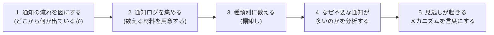
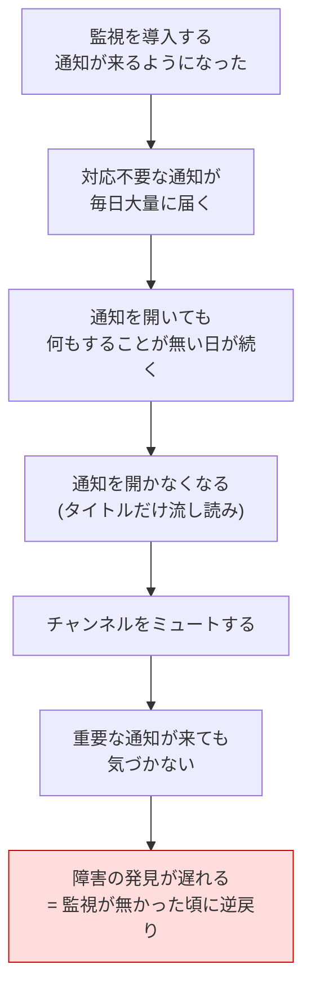
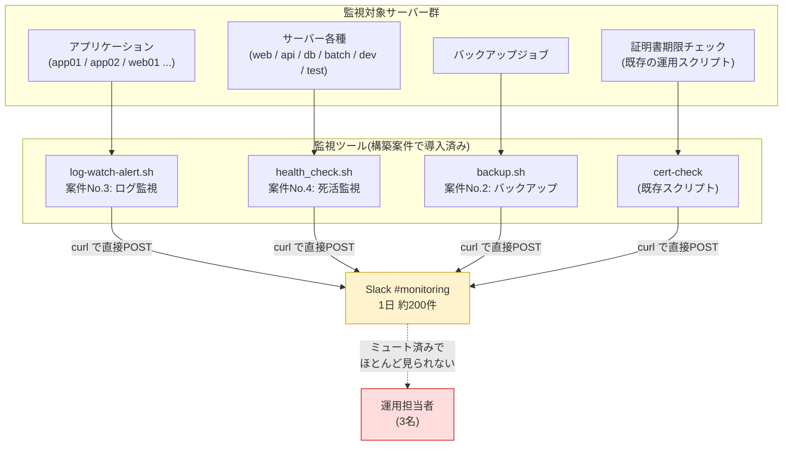
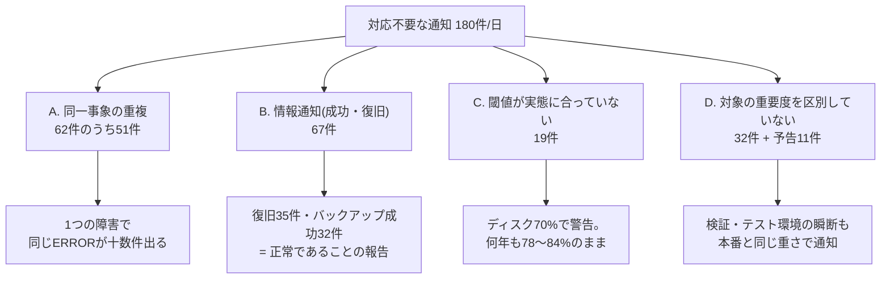
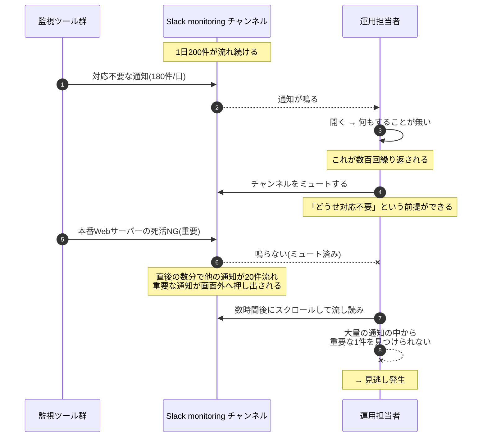

# 01. 現状分析書(As-Is)

> **⚠️ この案件は架空の設定です。**
> 依頼元・課題・通知データはすべて学習用に自分で設定したものです。実在企業での実務実績ではありません。
> 本書の「件数」「割合」は、後述の [`generate-sample-alerts.sh`](./src/generate-sample-alerts.sh) で生成した検証データを、実際に集計スクリプトで数えた**検証環境での実測値**です。「対応した件数」「見逃し件数」など、人の行動に関する数値は**架空の設定に基づく想定値**であり、その旨を表の中で明示しています。

## 1. この文書の目的

改善案件は、いきなり「こう直します」から始めてはいけない。**まず現状を数える**ことから始める。

理由は3つある。

1. **どこから手を付けるべきかが分からない。** 「通知が多い」だけでは、何を減らせばよいか決められない
2. **改善後に効果を示せない。** 改善前の数字が無ければ「減った気がする」としか言えない
3. **減らしてはいけないものを見落とす。** 全体像を把握せずに減らすと、重要な通知まで一緒に消してしまう

本書では、次の順で現状を明らかにする。



## 2. 「アラート疲れ」とは何か、なぜ危険か

**アラート疲れ(alert fatigue)**(=通知を受け取りすぎて慣れてしまい、反応しなくなる現象)は、監視を導入した現場で非常によく起きる。

人は、鳴っても何も起きない通知を繰り返し受け取ると、次のように行動が変わっていく。



危険なのは、**監視の仕組み自体は正常に動いているのに、実質的に監視が機能していない状態になる**点である。ツールは通知を出しているので、「監視は入っています」と言えてしまう。しかし誰も見ていないので、障害には気づけない。**動いているのに効いていない**という、いちばん気づきにくい壊れ方をする。

さらに悪いことに、この状態は自然には直らない。通知が増えるほど見なくなり、見なくなるほど「通知を減らそう」という動機も薄れていく。**明確に手を入れないと悪化し続ける**種類の問題である。

## 3. 現状(As-Is)の通知の流れ

現在、3つの監視ツールが、それぞれ独立に、**同じ1つのSlackチャンネルへ直接**通知を送っている。



**この構成の問題点**

| 問題 | 内容 |
|---|---|
| 通知先が1つしかない | 「今すぐ起きるべき通知」と「見なくてよい通知」が同じ場所に混ざる |
| 重要度の概念が無い | すべての通知が同じ重さで届く。人が毎回自分で仕分けするしかない |
| 各ツールが直接Slackへ送る | 通知の総量を誰も管理していない。ツールを1つ足すたびに件数が増える |
| 通知したものしか残らない | Slackのメッセージ以外に記録が無く、後から集計・分析ができない |

最後の「記録が無い」は特に重い。**数えられないものは改善できない。**

## 4. 現状をどう数えたか(測定方法)

### 4.1 実務の場合

実際の現場であれば、次のいずれかで通知ログを集める。

| 方法 | 内容 | 難易度 |
|---|---|---|
| Slackのエクスポート | ワークスペース管理者がチャンネル履歴をJSONで書き出す | 管理者権限が必要 |
| 通知スクリプトのログ | 各ツールが `notify_slack` を呼んだ記録をローカルログに残す | 事前に仕込んでいれば簡単 |
| 通知の入口を1本化して数える | 通知をいったん1つのスクリプトに集約し、そこで数える | 改善そのものと同じ作業になる |

### 4.2 本案件(架空)の場合

本案件は架空の設定であり、手元に本物の通知ログは存在しない。そこで、**改善前の1日分の通知ログを再現するスクリプト**を用意した。

- [`src/generate-sample-alerts.sh`](./src/generate-sample-alerts.sh)
- 1日あたりちょうど200件を生成する
- 通知の文面は、[projects/02](../../projects/02-backup-automation/README.md) / [projects/03](../../projects/03-log-monitoring-alert/README.md) / [projects/04](../../projects/04-server-health-check/README.md) が実際にSlackへ送っている文面に合わせてある
- 乱数は自前の計算式(線形合同法)で作っているため、**誰が実行しても同じログが再現できる**

```bash
cd improvements/03-alert-noise-reduction/src
./generate-sample-alerts.sh --date 2026-09-01 --out /tmp/sample-alerts.tsv
```

```text
サンプル通知ログを生成しました: /tmp/sample-alerts.tsv
対象期間: 2026-09-01 から 1 日分 / 合計 200 件(1日あたり 200 件)

  件数  カテゴリ
------  --------------------
     2  本番死活NG
    35  復旧通知
    33  非本番死活NG
    62  アプリERROR繰り返し
    32  バックアップ完了
    19  容量警告70-84%
     2  容量警告85%以上
     9  証明書期限予告
     6  監視ツール再起動
------  --------------------
   200  合計
```

**なぜこうしたか**: 学習用のポートフォリオでは「数字を書くだけ」なら誰でもできる。実際に動くスクリプトでデータを作り、実際に集計スクリプトで数えることで、**本書の数字はすべて手元で再現・検証できる**状態にしている。

生成されたログの形式(タブ区切り)は次のとおり。

```bash
head -3 /tmp/sample-alerts.tsv
```

```text
2026-09-01 00:07:30	backup	backup01	:warning: [容量警告] バックアップ先(/backup)の使用率が 78% です(閾値: 70%)
2026-09-01 01:05:00	backup	web01	:white_check_mark: [バックアップ完了] web01-20260901.tar.gz を作成しました(12.4MB)
2026-09-01 01:07:30	backup	backup01	:warning: [容量警告] バックアップ先(/backup)の使用率が 78% です(閾値: 70%)
```

| 列 | 内容 |
|---|---|
| 1列目 | 発生日時(`YYYY-MM-DD HH:MM:SS`) |
| 2列目 | 発生元(`health-check` / `log-watch` / `backup` / `cert-check` / `systemd`) |
| 3列目 | 対象ホスト名 |
| 4列目 | 通知本文(Slackへ送られる文面そのもの) |

> **補足**: 案件No.3のログ監視ツールの通知は本来複数行だが、集計・判定の都合上「1通知=1行」に整形して扱う。この整形は改善後のツール側でも同じように行うため、扱いは一貫している。

### 4.3 集計は何で行ったか

棚卸し用に [`src/alert-inventory.sh`](./src/alert-inventory.sh) を作成した。このスクリプトは、後の改善で使う**重要度分類ルールと同じルールファイル**を読み込んで通知を分類し、種類別に数える。

```bash
./alert-inventory.sh --input /tmp/sample-alerts.tsv --days 1
```

**なぜ同じルールファイルを使うのか**: 「棚卸しに使った分類」と「改善後に使う分類」が別物だと、Before/Afterの比較ができなくなる。**同じものさしで測る**ことが、効果測定の前提になる。

## 5. 通知の棚卸し結果

### 5.1 種類別の件数(1日あたり)

上記コマンドの実行結果(検証環境での実測値)。

```text
===== 通知の棚卸し結果 =====
集計対象: /tmp/sample-alerts.tsv
集計期間: 1日分 / 合計 200 件(1日あたり 200.0 件)

RULE      SEV  CHANNEL     COUNT   PER-DAY   SHARE  内容
-------------------------------------------------------------------------------------
R031      P2   daily          62      62.0   31.0%  アプリログのERROR検知(10分単位でまとめる)
R020      P3   record         35      35.0   17.5%  復旧通知(P1発報中のホストのみP1へ格上げ)
R041      P3   record         32      32.0   16.0%  バックアップジョブの正常終了(情報通知)
R049      P3   record         19      19.0    9.5%  ディスク使用率84%以下(閾値70%が低すぎて常時出ている)
R013      P3   record         11      11.0    5.5%  バッチサーバーの死活NG(瞬断が多く単発では対応不要)
R014      P3   record         11      11.0    5.5%  検証サーバーの死活NG
R015      P3   record         11      11.0    5.5%  テストサーバーの死活NG
R069      P3   record          9       9.0    4.5%  証明書の期限が15日以上(日次サマリで十分)
R070      P3   record          6       6.0    3.0%  監視ツール自身の再起動・再接続通知
R044      P2   daily           2       2.0    1.0%  ディスク使用率85〜89%(翌営業日に確認)
R010      P1   critical        1       1.0    0.5%  本番Webサーバーの死活NG
R011      P1   critical        1       1.0    0.5%  本番APIサーバーの死活NG
-------------------------------------------------------------------------------------
TOTAL                        200     200.0  100.0%

----- 重要度別の内訳 -----
P1         2 件  1日あたり    2.0 件  (  1.0%)
P2        64 件  1日あたり   64.0 件  ( 32.0%)
P3       134 件  1日あたり  134.0 件  ( 67.0%)

----- 発生元別の内訳 -----
health-check        70 件  ( 35.0%)
log-watch           62 件  ( 31.0%)
backup              53 件  ( 26.5%)
cert-check           9 件  (  4.5%)
systemd              6 件  (  3.0%)
```

> `SEV`(重要度)と `CHANNEL`(通知先)の列は、改善後に適用する分類ルールを当てはめた結果である。**改善前はこの区別が存在せず、全200件が同じチャンネルへ同じ重さで届いていた。**

### 5.2 棚卸し表(対応要否つき)

上の結果に、「実際に人が何らかの対応をしたか」を加えたものが次の表である。

| # | 通知の種類 | 件数/日 | 割合 | 対応した件数/日 | 対応不要 |
|---:|---|---:|---:|---:|---:|
| 1 | アプリログの同一ERROR繰り返し | 62 | 31.0% | 11 | 51 |
| 2 | 死活監視の復旧通知 | 35 | 17.5% | 0 | 35 |
| 3 | バックアップの正常終了通知 | 32 | 16.0% | 0 | 32 |
| 4 | ディスク使用率警告(70〜84%) | 19 | 9.5% | 0 | 19 |
| 5 | バッチサーバーの死活NG(瞬断) | 11 | 5.5% | 1 | 10 |
| 6 | 検証サーバーの死活NG(瞬断) | 11 | 5.5% | 0 | 11 |
| 7 | テストサーバーの死活NG(瞬断) | 11 | 5.5% | 0 | 11 |
| 8 | 証明書の期限予告(残り15日以上) | 9 | 4.5% | 3 | 6 |
| 9 | 監視ツール自身の再起動通知 | 6 | 3.0% | 1 | 5 |
| 10 | ディスク使用率警告(85%以上) | 2 | 1.0% | 2 | 0 |
| 11 | 本番Webサーバーの死活NG | 1 | 0.5% | 1 | 0 |
| 12 | 本番APIサーバーの死活NG | 1 | 0.5% | 1 | 0 |
| | **合計** | **200** | **100.0%** | **20** | **180** |

| 数値 | 出どころ |
|---|---|
| 件数/日、割合 | **検証環境での実測値**(生成した通知ログを集計スクリプトで数えた結果) |
| 対応した件数/日 | **架空の設定に基づく想定値**(「どの通知に人が反応したか」は生成データからは分からないため、シナリオとして設定した) |

### 5.3 棚卸しから読み取れること

1. **対応不要が180件(90.0%)。** 10件のうち9件は、見ても何もすることがない
2. **上位3種類だけで129件(64.5%)。** ここを削るだけで通知は3分の1近くになる
3. **本当に急ぐ通知は1日2件しかない。** 200件のうち即時対応が必要なのは2件(1.0%)
4. **「対応した20件」も、その多くは急がない。** 証明書の期限やディスク使用率85%は、翌営業日に見れば十分間に合う

つまり、**「今すぐ起きて対応すべき通知」は1日あたり数件しかないのに、その数十倍の通知に埋もれている**というのが現状の姿である。

## 6. なぜ9割が対応不要なのか(原因の分析)

棚卸しした12種類を、原因のパターンで整理すると4つに分けられる。



### A. 同一事象の重複(1つの障害が十数件の通知になる)

アプリログのERROR通知62件は、実際には**6回の障害**にすぎない。1回の障害で同じエラーが6〜15件連続して出るためである。

| 障害 | 発生時刻 | 通知件数 | 内容 |
|---|---|---:|---|
| 1 | 03:12〜03:17 | 15 | 決済ゲートウェイのタイムアウト |
| 2 | 07:41〜07:46 | 12 | Redis接続拒否 |
| 3 | 10:05〜10:10 | 11 | 一時ファイルの書き込み失敗 |
| 4 | 13:22〜13:27 | 10 | 認証基盤からの502応答 |
| 5 | 17:48〜17:53 | 8 | 決済ゲートウェイのタイムアウト(再発) |
| 6 | 20:33〜20:37 | 6 | 夜間バッチのレコードスキップ |

**人が知りたいのは「6回の障害が起きた」という事実であって、「62件の行が出た」ことではない。** 情報としては同じなのに、通知の数だけが12倍になっている。

> **補足**: [projects/03-log-monitoring-alert](../../projects/03-log-monitoring-alert/README.md) にはスロットリング(5分以内の再検知を抑制する機能)が実装されている。しかし、それは**1台のサーバー・1つの監視プロセスの中でしか効かない**。6台のサーバーで同時に同じ障害が起きれば、6プロセスぶんの通知が別々に飛ぶ。**通知を横断してまとめる仕組みが、どこにも存在しない**というのが構造上の問題である。

### B. 情報通知(「正常です」を毎回知らせている)

- 復旧通知 35件 — 「直りました」という報告
- バックアップ正常終了 32件 — 「成功しました」という報告

合わせて67件、全体の33.5%が「**正常であることの報告**」である。

正常であることの確認自体は必要だが、**1件ずつリアルタイムで人に知らせる必要はない**。1日1回まとめて「昨日のバックアップは32件すべて成功」と分かれば足りる。

### C. 閾値が実態に合っていない

ディスク使用率の警告は閾値70%で設定されている。しかし実際の使用率は78〜84%で、**何年も同じ水準のまま安定している**。つまりこの警告は「異常」ではなく「現在の正常な状態」を通知し続けている。

**閾値は一度決めたら終わりではない。** 実態に合わなくなった閾値は、通知を出すだけで何の判断材料にもならない。

### D. 対象の重要度を区別していない

死活監視の対象には、本番サーバー(web / api / db)と非本番サーバー(batch / dev / test)が混ざっている。しかし通知の重さは同じである。

- 本番Webが落ちる = 売上が止まる → **今すぐ対応**
- 検証サーバーが3分間pingに応答しない = 誰も困らない → **後で見れば十分**

この2つが同じ見た目・同じ場所に届くため、**受け取った人が毎回自分で仕分けする必要がある**。これが積み重なると、仕分けそのものが面倒になり、全部見なくなる。

## 7. 見逃しが起きるメカニズム

「月2件の見逃し」は、担当者の不注意で起きているのではない。**構造的に起きるべくして起きている。**



### 見逃しに至る3つの要因

| 要因 | 内容 | 改善で潰すべき点 |
|---|---|---|
| 1. 通知が鳴らない | 対応不要な通知に慣れ、ミュートされた | **重要な通知だけは必ず鳴る**状態にする(メンションの使い分け) |
| 2. 画面から流れる | 重要な通知の直後に他の通知が積み重なり、見えなくなる | **重要な通知を別チャンネルへ隔離**し、埋もれない場所に置く |
| 3. 見分けがつかない | すべて同じ見た目で並ぶため、重要かどうかが一目で分からない | **重要度をラベルとして通知に明示**する |

つまり、見逃しを防ぐには「通知を減らす」だけでは足りない。**重要な通知を、それ以外から物理的に分離する**必要がある。

### 一次対応の着手が遅れる理由

一次対応の着手までが平均25分かかっているのも、同じ構造による(この25分は架空の設定に基づく想定値)。

1. 通知が鳴らないので、担当者は自分のタイミングでSlackを見に行く(平均で十数分の遅れ)
2. 見に行っても、200件の中から重要な1件を探す必要がある(数分)
3. 見つけても「これは本当に対応すべきものか」の判断に迷う(数分)

**「気づくまでの時間」と「判断するまでの時間」の両方が、通知の多さによって伸びている。**

## 8. 現状分析のまとめ

| # | 課題 | 数字による裏付け |
|---|---|---|
| 1 | 通知が多すぎる | 1日200件。うち対応不要180件(90.0%) |
| 2 | 同一事象が重複して通知される | ERROR通知62件の実体は6回の障害 |
| 3 | 「正常です」の報告が多い | 復旧35件 + バックアップ成功32件 = 67件(33.5%) |
| 4 | 閾値が実態に合っていない | ディスク警告19件はすべて常時発生している水準 |
| 5 | 対象の重要度を区別していない | 本番と検証の死活NGが同じ重さで届く |
| 6 | 重要な通知が埋もれる | 即時対応が必要なのは1日2件(1.0%)だが、198件に紛れている |
| 7 | 通知したものしか残らない | Slack以外に記録が無く、後から集計・検証ができない |

この7点をどう解決するかは [02-improvement-proposal.md](./02-improvement-proposal.md) で検討する。

## 関連ドキュメント

- [README.md](./README.md) — 案件概要
- [02-improvement-proposal.md](./02-improvement-proposal.md) — 改善提案書
- [03-design.md](./03-design.md) — 改善設計書
- [05-effect-measurement.md](./05-effect-measurement.md) — 効果測定レポート
