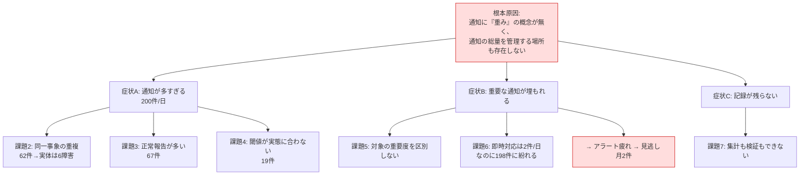
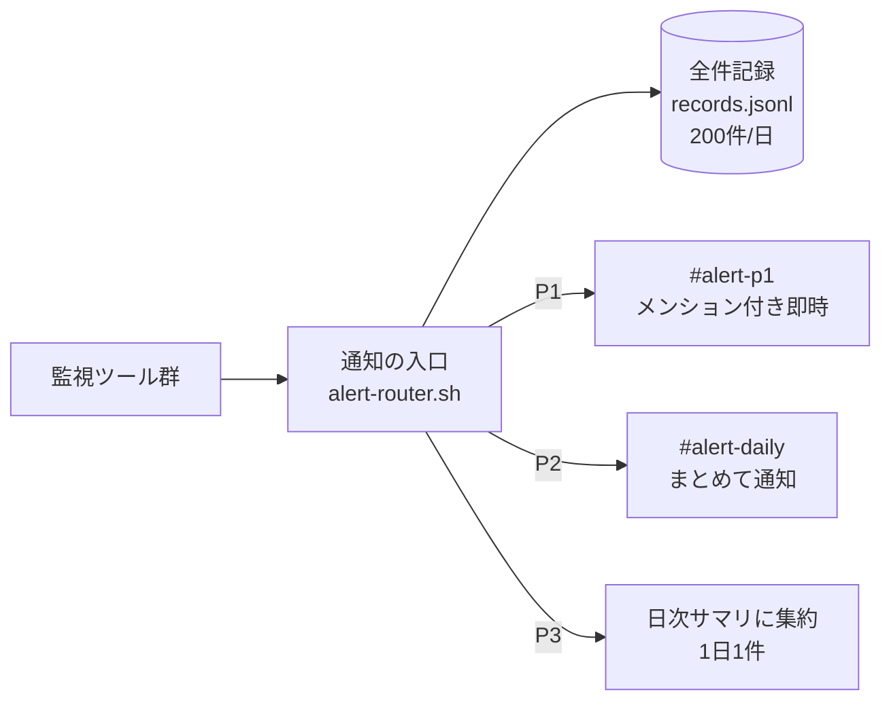
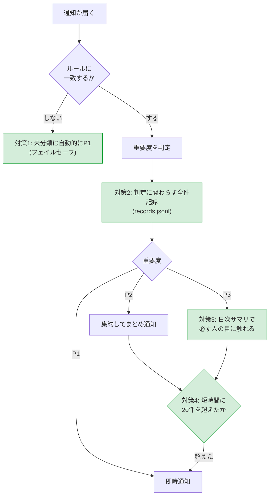

# 02. 改善提案書

> **⚠️ この案件は架空の設定です。** 依頼元・課題・数値はすべて学習用に自分で設定したものであり、実在企業での実務実績ではありません。

## 1. この文書の目的

[01-current-analysis.md](./01-current-analysis.md) で明らかにした7つの課題に対し、

1. 課題の構造を整理して「本当に手を入れるべき場所」を絞り込む
2. 改善案を複数出し、同じ基準で比較する
3. 採用する案とその理由を、数字と根拠を添えて説明する
4. 採用案のリスク、特に**「重要な通知まで消してしまう」危険をどう防ぐか**を明記する
5. 今回はやらないこと(スコープ外)をはっきりさせる

改善案件では、**「なぜその案を選んだのか」を説明できることが、実装そのものと同じくらい重要**になる。他の案を検討していないと、「たまたま知っている方法を使っただけ」に見えてしまうためである。

## 2. 課題の構造化

7つの課題は、それぞれ独立した問題ではない。並べ直すと、**1つの根本原因から枝分かれしている**ことが分かる。

### 手を入れるべき場所の絞り込み

構造を見ると、対策が入れられる場所は3か所ある。

| 場所 | できること | 制約 |
|---|---|---|
| ① 監視ツール側(検知の手前) | そもそも通知を出さない、閾値を変える | ツール本体の改造が必要。ツールごとに個別対応になる |
| ② 通知の入口(検知〜Slackの間) | 分類・集約・振り分け・記録 | **今は何も存在しない。ここを作れば全ツールに一括で効く** |
| ③ 受け取り側(Slack) | チャンネルを分ける、通知設定を変える | 件数そのものは減らない |

**②に新しく「通知の入口」を作るのが、いちばん効果が広く、既存ツールへの影響も小さい。** これが以降の検討の軸になる。

## 3. 改善案の候補

### 案A: 不要な通知を出すのをやめる(通知の停止)

各監視ツールの設定・スクリプトを直接編集し、対応不要な通知を出さないようにする。

- バックアップの成功通知を削除する
- 復旧通知を削除する
- 非本番サーバーの死活監視通知を削除する

| 評価 | 内容 |
|---|---|
| 削減効果 | 大きい(67件+33件=100件程度は消える) |
| 見逃しリスク | **非常に高い**。消した通知は完全に失われ、後から検証できない |
| 記録 | **残らない**。「本当に不要だったか」を確認する手段が無い |
| 実現コスト | 低い(各ツールを数行編集するだけ) |
| 保守性 | 低い。ツールが増えるたびに個別対応が必要 |
| 元に戻しやすさ | 中(編集を戻せばよいが、消えた期間のデータは戻らない) |

### 案B: しきい値を上げる

各監視ツールの検知しきい値を厳しくする。

- ディスク使用率の警告閾値を 70% → 90% に上げる
- 死活監視の連続失敗回数(`FAIL_THRESHOLD`)を 2回 → 5回 に上げる
- ログ監視のスロットリング時間を 300秒 → 1800秒 に延ばす

| 評価 | 内容 |
|---|---|
| 削減効果 | 中程度(50〜80件程度) |
| 見逃しリスク | **高い**。「検知を遅らせる」ことになるため、本物の障害への反応も遅れる |
| 記録 | 残らない(検知しなかったものは記録もされない) |
| 実現コスト | 非常に低い(設定ファイルの数値を変えるだけ) |
| 保守性 | 中(設定ファイルなので変更自体は楽) |
| 元に戻しやすさ | 高(数値を戻すだけ) |

> **注意**: 一見よさそうに見えるが、しきい値を上げるのは「**検知しなくする**」ことである。通知が減るのは「異常を見つけなくなったから」であって、「うまく整理できたから」ではない。ディスク90%は、90%になってから慌てても遅い場合がある。

### 案C: 重要度分類 + 集約 + 振り分け(通知の入口を作る)

監視ツールとSlackの間に「通知の入口」となるスクリプトを1本立て、そこで

1. **全件を記録**する(通知の有無に関わらず)
2. **ルール定義ファイル**で重要度(P1/P2/P3)を判定する
3. 同一種別の連続通知を**集約**して1件にまとめる
4. 重要度に応じて**通知先を振り分ける**(P1のみ即時+メンション、P2はまとめ、P3は日次サマリ)

| 評価 | 内容 |
|---|---|
| 削減効果 | **非常に大きい**(200件 → 12件、94.0%削減。検証環境で実測) |
| 見逃しリスク | **低い**。記録は全件残り、P3も日次サマリで必ず人の目に触れる。未分類はP1扱い |
| 記録 | **全件残る**(JSON Lines形式。あとから何度でも集計・検証できる) |
| 実現コスト | 中(スクリプト一式の新規作成。既存ツール側は通知の呼び出し1行を差し替えるのみ) |
| 保守性 | **高い**。分類ルールは設定ファイルなので、運用担当者がスクリプトを触らずに変更できる |
| 元に戻しやすさ | **高い**(設定1行を `active` → `shadow` に戻すだけ) |

### 案D: 監視SaaSを導入する(Datadog / PagerDuty など)

商用の監視・インシデント管理サービスを導入し、その通知制御機能(グルーピング、抑制、オンコールルーティング)を使う。

| 評価 | 内容 |
|---|---|
| 削減効果 | 非常に大きい(製品が持つ機能として実現済み) |
| 見逃しリスク | 低い(実績のある製品のため) |
| 記録 | 残る(SaaS側に蓄積される) |
| 実現コスト | **高い**。月額費用が発生し、社内の稟議・セキュリティ審査が必要 |
| 保守性 | 高い(製品として保守される) |
| 元に戻しやすさ | 低い(一度移行すると戻すのが大変) |
| その他 | 通知データを社外へ送ることになり、社内規程の確認が必要 |

## 4. 比較評価

評価は ◎(非常に良い)/ ○(良い)/ △(課題あり)/ ×(不可)の4段階とした。

| 評価軸 | 重み | 案A 通知停止 | 案B 閾値上げ | **案C 分類+集約** | 案D SaaS |
|---|---|:---:|:---:|:---:|:---:|
| 通知の削減効果 | 高 | ○ | △ | **◎** | ◎ |
| 見逃しリスクの低さ | **最高** | × | × | **◎** | ○ |
| 記録の保持(検証可能性) | **最高** | × | × | **◎** | ○ |
| 実現コスト(費用・工数) | 中 | ◎ | ◎ | **○** | × |
| 運用の保守性(設定変更のしやすさ) | 高 | △ | ○ | **◎** | ◎ |
| 元に戻しやすさ | 高 | △ | ◎ | **◎** | × |
| 既存ツールへの影響の小ささ | 中 | × | ○ | **○** | △ |
| 段階的に導入できるか | 高 | × | ○ | **◎** | △ |
| **総合** | | 不採用 | 不採用 | **採用** | 不採用 |

### 評価軸の重み付けの根拠

**「見逃しリスクの低さ」と「記録の保持」を最重要**とした。理由は、今回の依頼が「通知を減らしてほしい」ではなく「**見逃しをなくしてほしい**」だからである。

改善前の見逃しは月2件。ここで通知を減らしすぎて月3件になったら、この改善は完全な失敗になる。**通知件数の削減は手段であって、目的ではない。**

## 5. 案Cを選定した理由

### 理由1: 唯一「減らす」と「見逃さない」を同時に満たせる

案A・案Bは、通知を減らす代わりに情報そのものを失う。案Cは**通知の量だけを減らし、情報は1件も失わない**。

| | 情報(記録) | 通知(人への配信) |
|---|---|---|
| 案A(通知停止) | 消える | 消える |
| 案B(閾値上げ) | 消える | 消える |
| **案C(分類+集約)** | **全件残る(200件/日)** | **12件/日に絞る** |

この違いを表す言葉が**「集約(aggregation)」と「抑制(suppression)」の違い**である。詳しくは [03-design.md](./03-design.md) 4.3節で解説する。

### 理由2: ルールが設定ファイルなので、運用しながら直せる

分類が最初から完璧に決まることはない。運用しながら「これはP2ではなくP1にすべきだった」と気づくのが普通である。

案Cはルールを `alert-rules.conf` という設定ファイルに外出ししているため、**運用担当者がスクリプトを一切触らずに重要度を変更できる**。しかも変更内容は1行のdiffとして残るため、「いつ・誰が・何を変えたか」が追える。

### 理由3: 段階的に導入でき、失敗しても1行で戻せる

案Cは、いきなり本番の通知を絞る必要がない。

| 段階 | 動作 | 現場の見え方 |
|---|---|---|
| 第1段階(影実行) | 判定と記録は新方式。通知は従来どおり全件を旧チャンネルへ | **まったく変わらない** |
| 第2段階(本稼働) | 判定どおりに振り分けて通知 | 12件/日に減る |
| ロールバック | 設定1行を `shadow` に戻す | 元どおり全件通知に戻る |

**「試してから決められる」**という点は、監視まわりの変更では極めて大きな価値がある。

### 理由4: 費用がかからず、既存の技術で実現できる

案DのSaaSは機能面では優れているが、費用・稟議・セキュリティ審査が必要で、すぐには始められない。案Cは Bash / cron / Slack Webhook という既存の技術だけで実現でき、**今日から着手できる**。

> なお、案Dは「将来的な選択肢としては有力」と位置づける。案Cで通知の入口を1本化しておけば、後からSaaSへ移行する際も**入口の送信先を差し替えるだけ**で済む。案Cは案Dへの踏み台としても機能する。

## 6. 期待効果

| 指標 | 改善前 | 改善後(目標) | 根拠 |
|---|---:|---:|---|
| 1日の通知件数 | 200件 | **12件** | P1 4件 + P2まとめ 7件 + 日次サマリ 1件(検証環境での実測値) |
| 記録件数 | 200件 | **200件** | 全件記録するため変化なし(検証環境での実測値) |
| 重要な通知の見逃し | 月2件 | **0件** | P1を専用チャンネルへ隔離しメンションを付けるため(想定シナリオに基づく試算) |
| 一次対応の着手まで | 平均25分 | **平均5分** | 通知が鳴る + 探す必要が無い + 重要度が明示される(想定シナリオに基づく試算) |

### 12件の内訳

| 通知 | 件数/日 | 通知先 | メンション |
|---|---:|---|---|
| P1 即時通知 | 4 | `#alert-p1` | あり(`<!channel>`) |
| P2 まとめ通知 | 7 | `#alert-daily` | なし |
| 日次サマリ | 1 | `#alert-daily` | なし |
| **合計** | **12** | | |

**このうち、担当者が「今すぐ見なければならない」のは4件だけ**になる。1日200件を流し読みしていた状態から、1日4件を確実に読む状態へ変わる。

## 7. リスクと対策

### ★最大のリスク: 重要な通知まで消してしまう

これがこの改善で唯一許されない失敗である。対策を**7重**に用意する。

| # | 対策 | 内容 | 実装場所 |
|---|---|---|---|
| 1 | **フェイルセーフ分類** | どのルールにも一致しない通知は、自動的にP1(即時通知)として扱う。未知の通知を静かに握りつぶさない | `alert-router.conf` の `AR_UNMATCHED_SEVERITY=P1` |
| 2 | **全件記録** | 通知するかどうかに関わらず、受け取った通知を1件残らずJSON Linesで保存する。後からいつでも検証できる | `common.sh` の `ar_append_record` |
| 3 | **日次サマリ** | P3(記録のみ)にした通知も、翌朝のサマリに必ず件数と内訳が載る。「見えなくなる」ことがない | `daily-summary.sh` |
| 4 | **大量発生エスカレーション** | 重要度が低い種別でも、短時間に20件を超えたらP1チャンネルへ先行通知する。「静かな異常」の見落としを防ぐ | `common.sh` の `ar_accumulate` |
| 5 | **影実行による事前検証** | 本稼働の前に、判定だけを新方式で行う期間を設ける。通知は従来どおり全件流れるので、現場のリスクはゼロ | `AR_MODE=shadow` |
| 6 | **P3全件の目視レビュー** | 影実行のデータから、P3に落とす予定の通知を**全件人の目で確認**してから本稼働に切り替える | `shadow-compare.sh --list-p3` |
| 7 | **1行でのロールバック** | 問題があれば `AR_MODE` を `active` → `shadow` に戻すだけで、即座に全件通知へ戻る | `alert-router.conf` |

### その他のリスク

| # | リスク | 影響 | 対策 |
|---|---|---|---|
| R1 | 通知の入口(alert-router.sh)自体が壊れると、全ての通知が止まる | **大** | ・エラーが起きても処理を続ける設計(`set -e` を使わない) ・Slack送信に失敗しても記録は残す ・入口の異常は実行ログ(`alert-router.log`)に残す ・cronで日次サマリが届かないことが「入口が壊れている」サインになる |
| R2 | ルール定義ファイルの書式ミスでツールが起動しない | 中 | 起動時に妥当性チェックを行い、誤りがあれば具体的な行番号を示して停止する。`--check-rules` で本番反映前に確認できる |
| R3 | 集約ウィンドウが長すぎて、まとめ通知が遅れる | 中 | ・P1は集約しない(即時通知のみ) ・P2の既定ウィンドウは600秒(10分) ・cronで5分ごとにウィンドウを締めるため、遅延は最大でも15分程度 |
| R4 | 状態ファイルが壊れて集約がおかしくなる | 小 | 読み込み時に数値として妥当かを検証し、壊れていれば初期化して処理を継続する |
| R5 | 新しい監視ツールを追加したとき、ルールに無い通知が増える | 小 | 未分類はP1として通知されるため気づける。日次サマリにも「未分類N件」と表示され、ルール整備を促す |
| R6 | ディスク容量:全件記録が増え続ける | 小 | JSON Lines 1件あたり約400バイト。200件/日で約80KB/日、1年で約30MB。logrotateの対象にすればよい |

## 8. スコープ外にしたこと(今回はやらない)

改善案件では、「やらないこと」を決めることも設計の一部である。何でも詰め込むと、期限内に終わらず、効果測定もぼやける。

| # | やらないこと | 理由 | 将来の扱い |
|---|---|---|---|
| 1 | 既存の監視ツール(projects/02, 03, 04)本体の改造 | 通知の入口を1本化すれば、ツール側は通知の送り先を1行変えるだけで済む。ツールごとの改造は保守対象を増やす | 変更するのは「通知の呼び出し1行」のみ |
| 2 | 監視の閾値そのものの見直し(ディスク70% → 85%など) | 閾値の見直しは「何%が適正か」の調査が別途必要で、本改善(通知の届け方)とは別の話。今回は重要度分類で対応する | 次の改善サイクルで検討 |
| 3 | オンコール当番の輪番管理・電話通知 | 人と組織のルール作りが主で、技術的な改善ではない。Slackのメンションで足りるかをまず確認する | 効果測定の結果を見て判断 |
| 4 | 障害対応手順書(ランブック)へのリンク自動付与 | 手順書自体がまだ整備されていない。通知に存在しないURLを載せても意味がない | 手順書の整備後 |
| 5 | Webの管理画面・ダッシュボード | 日次サマリのMarkdownで当面は足りる。画面を作ると保守対象が増える | 必要が生じたら |
| 6 | P3種別の大量発生を、より賢く検知する仕組み | 今回は「20件を超えたらP1」という単純な閾値のみ。時間帯や曜日による変動を考慮した検知は複雑になりすぎる | 次の改善サイクルで検討 |
| 7 | 監視SaaSへの移行 | 費用・稟議・セキュリティ審査が必要で、すぐには着手できない | 通知の入口を1本化しておくことで、将来の移行が容易になる |
| 8 | 通知の多言語化・フォーマットの高度化(Slack Block Kit等) | 見た目の改善であり、見逃しの削減には直結しない | 余力があれば |

## 9. まとめ

- 課題の根本原因は「**通知に重みの概念が無く、総量を管理する場所も無い**」ことだった
- 4案を比較し、「**減らす**」と「**見逃さない**」を同時に満たせる案C(重要度分類+集約+振り分け)を採用した
- 最大のリスクである「重要な通知まで消してしまう」ことに対し、**7重の対策**を設計に組み込んだ
- 通知の入口を1本化しておくことで、将来の監視SaaS移行への踏み台にもなる

具体的な設計は [03-design.md](./03-design.md) へ続く。

## 関連ドキュメント

- [README.md](./README.md) — 案件概要
- [01-current-analysis.md](./01-current-analysis.md) — 現状分析書
- [03-design.md](./03-design.md) — 改善設計書
- [04-build-guide.md](./04-build-guide.md) — 実装・移行手順書
- [05-effect-measurement.md](./05-effect-measurement.md) — 効果測定レポート
