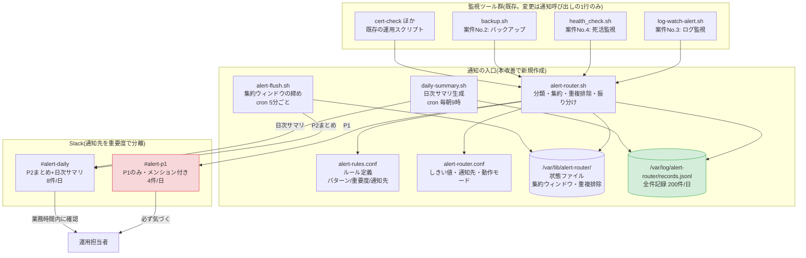
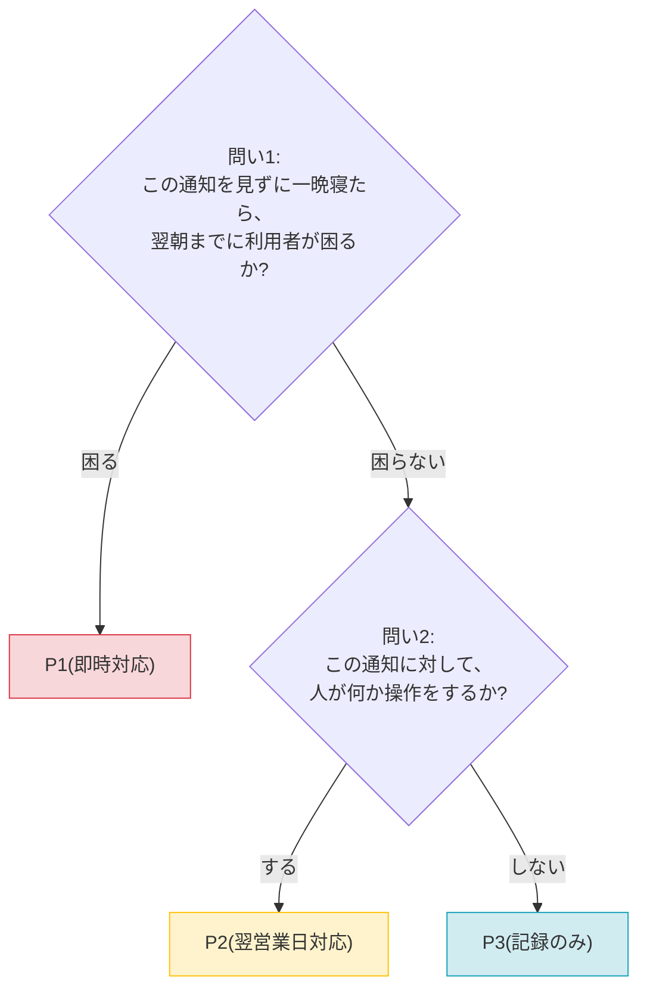
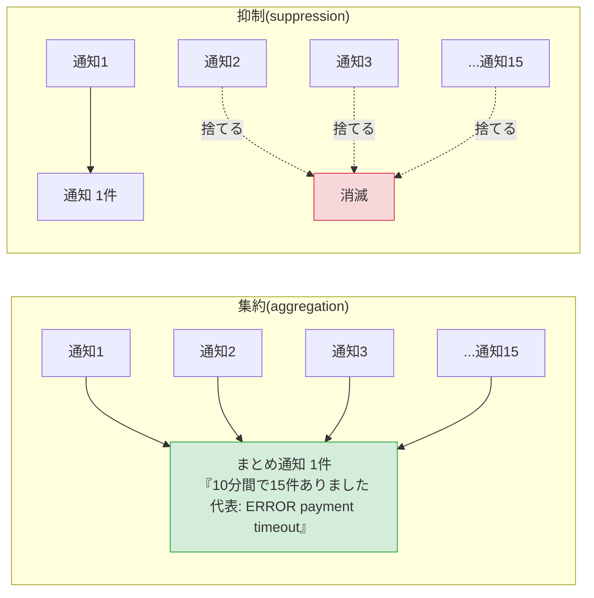
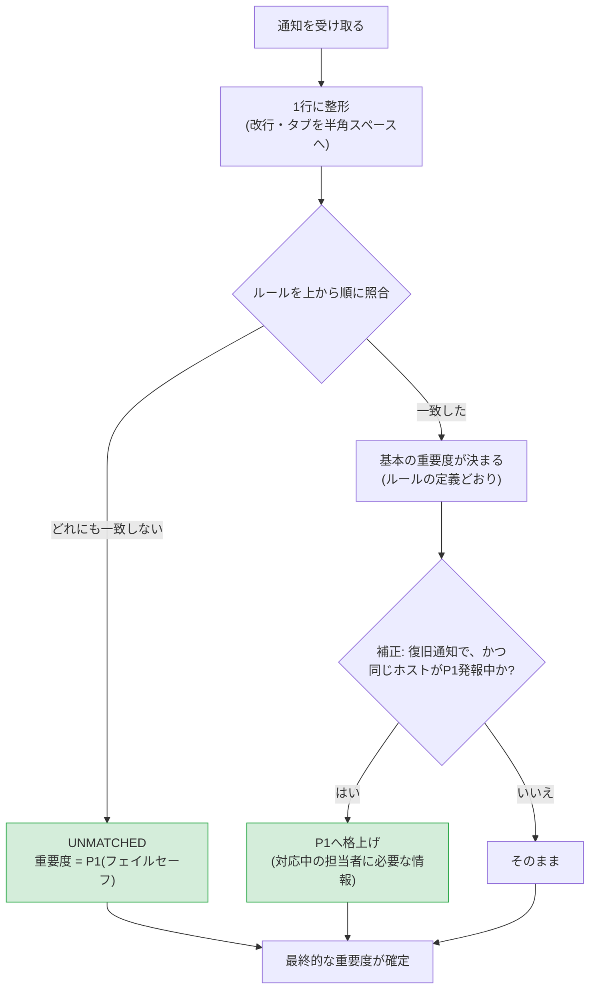
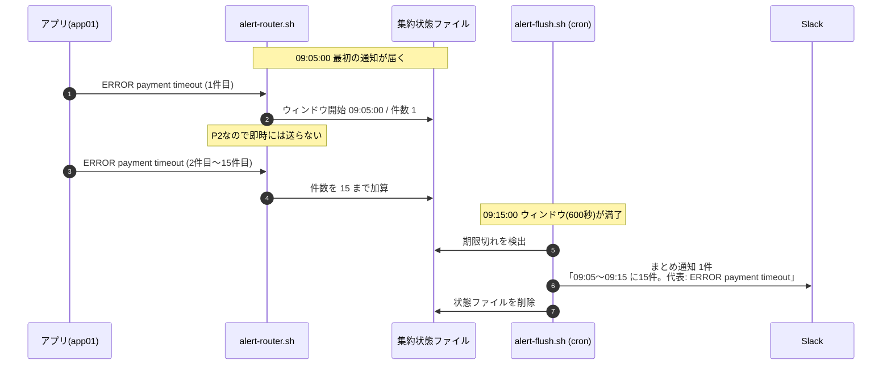
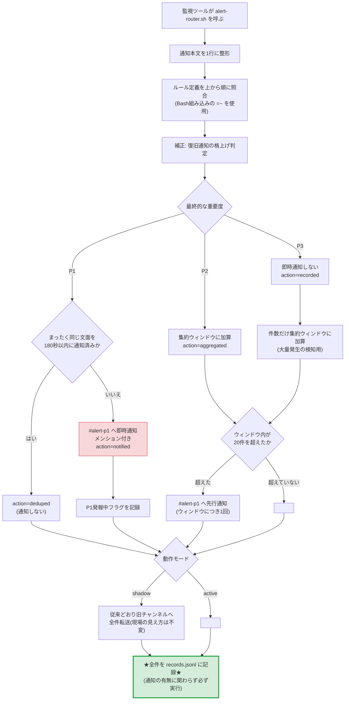
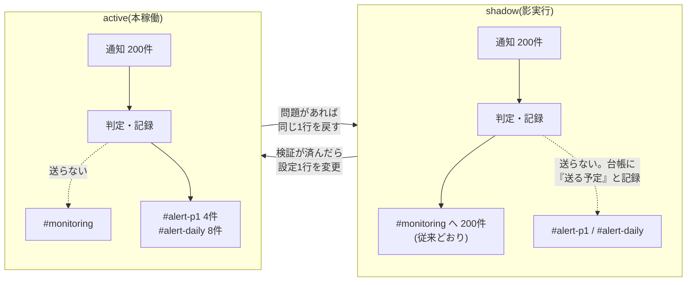

# 03. 改善設計書(To-Be)

> **⚠️ この案件は架空の設定です。** 依頼元・課題・数値はすべて学習用に自分で設定したものであり、実在企業での実務実績ではありません。

## 1. 設計方針(4つの原則)

実装に入る前に、判断に迷ったときの拠り所となる原則を決めておく。

| # | 原則 | 意味 | 具体的な現れ方 |
|---|---|---|---|
| 1 | **記録は絶対に減らさない** | 通知を減らすことと記録を減らすことは別。受け取った通知は1件残らず保存する | 全件を `records.jsonl` に追記。通知の有無に関わらず記録する |
| 2 | **迷ったら安全側(通知する側)に倒す** | 分類できない・判断がつかないものは、重要として扱う | どのルールにも一致しない通知は自動的にP1 |
| 3 | **判断のルールはコードの外に置く** | 「何をどう扱うか」は運用しながら変わる。変えるたびにスクリプトを直す作りにしない | ルールは `alert-rules.conf`、しきい値は `alert-router.conf` |
| 4 | **いつでも元に戻せるようにする** | 監視の変更は失敗すると障害に気づけなくなる。切り替えとロールバックを対称にする | `AR_MODE` を `shadow` ⇔ `active` で切り替えるだけ |

## 2. 全体構成

### 2.1 構成図



### 2.2 構成要素の役割

| 要素 | 役割 |
|---|---|
| `alert-router.sh` | 通知の入口。1件受け取るごとに「記録 → 分類 → 集約/重複排除 → 振り分け」を行う |
| `alert-rules.conf` | **どの通知をどの重要度で、どこへ届けるか**を1行1ルールで定義する設定ファイル |
| `alert-router.conf` | 集約ウィンドウ、重複排除の時間、Webhook URL、動作モードなどの設定 |
| `common.sh` | 上記スクリプト群が共通して使う関数(ログ・分類・集約・送信・記録)をまとめたライブラリ |
| 状態ファイル(`/var/lib/alert-router/`) | 集約ウィンドウの開始時刻と件数、重複排除の最終通知時刻、P1発報中フラグを保持する |
| `records.jsonl` | **全件記録**。通知したか否かに関わらず、受け取った通知をすべて1行1JSONで保存する |
| `alert-flush.sh` | 期限が来た集約ウィンドウを閉じ、まとめ通知を送る。cronから5分ごとに実行 |
| `daily-summary.sh` | 前日の記録を集計し、日次サマリを生成してSlackへ1件通知する。cronから毎朝9時に実行 |
| `#alert-p1` | P1専用チャンネル。ここが鳴ったら必ず何かある、という状態を作る |
| `#alert-daily` | P2のまとめ通知と日次サマリの置き場。業務時間内に確認すればよい |

### 2.3 既存ツール側の変更点(1行だけ)

既存の監視ツールは、これまでSlackへ直接POSTしていた。それを入口の呼び出しに差し替える。

**変更前**([projects/04-server-health-check](../../projects/04-server-health-check/README.md) の `notify_slack` 関数の中):

```bash
curl -s -X POST -H 'Content-type: application/json' \
    --data "{\"text\": \"${message}\"}" \
    "${SLACK_WEBHOOK_URL}" > /dev/null
```

**変更後**:

```bash
/opt/alert-router/alert-router.sh \
    --source health-check --host "${name}" --message "${message}"
```

**なぜこれだけで済むのか**: 既存ツールがやっていたのは「文字列をSlackへ渡す」ことだけである。その渡し先を入口に変えるだけで、分類・集約・記録のすべてが入口側で行われる。**ツール側は自分の通知が最終的にどう扱われるかを知らなくてよい**(=責務の分離)。

> **注**: 本改善案件では `projects/` 配下は変更していない。上記は「本番環境で行う差し替え手順」として [04-build-guide.md](./04-build-guide.md) のStep 7で示す。

## 3. 重要度(severity)の設計

### 3.1 なぜ重要度が必要か

改善前は、すべての通知が同じ重さで届いていた。すると受け取った人は、**通知が来るたびに毎回「これは急ぐのか?」を自分で判断する**必要がある。1日200回それをやるのは不可能なので、結局全部見なくなる。

重要度分類とは、**その判断をあらかじめルールとして決めておき、機械にやらせる**ことである。人は「P1が来たら動く」とだけ覚えていればよくなる。

### 3.2 P1 / P2 / P3 の定義

重要度は3段階にした。**5段階や10段階にしないのは、細かすぎると分類そのものが運用できなくなるため**である。「これはP3?P4?」と迷う時間が発生した時点で、その分類は失敗している。

| 重要度 | 名前 | 対応の期限 | 通知先 | メンション | 判断基準(1行) |
|---|---|---|---|---|---|
| **P1** | 即時対応 | すぐ(夜間・休日でも) | `#alert-p1` | あり | **利用者に影響が出ている、または数時間以内に出る** |
| **P2** | 翌営業日対応 | 次の営業時間内 | `#alert-daily` | なし | **放置すると将来困るが、今日中でなくてよい** |
| **P3** | 記録のみ | 対応不要 | 日次サマリのみ | なし | **知っておきたいが、行動は起こさない** |

### 3.3 重要度を決めるときの2つの問い

新しい通知の重要度に迷ったら、次の2つを順に問う。



この2つの問いを使うと、[01-current-analysis.md](./01-current-analysis.md) の棚卸し表がそのまま分類できる。

| 通知の種類 | 問い1(翌朝までに利用者が困る?) | 問い2(人が操作する?) | 重要度 |
|---|---|---|---|
| 本番Webサーバーの死活NG | **困る**(サービス停止) | ― | **P1** |
| バックアップジョブの失敗 | **困る**(復旧できなくなる) | ― | **P1** |
| ディスク使用率100% | **困る**(書き込み不能) | ― | **P1** |
| アプリログのERROR検知 | 困らない(一部機能の失敗) | **する**(原因調査) | **P2** |
| ディスク使用率85〜89% | 困らない | **する**(拡張の検討) | **P2** |
| 検証サーバーの死活NG | 困らない | しない(自動で戻る) | **P3** |
| 復旧通知 | 困らない | しない | **P3** |
| バックアップ正常終了 | 困らない | しない | **P3** |
| 証明書の期限(残り15日以上) | 困らない | しない(まだ余裕がある) | **P3** |

### 3.4 「同じ種類の通知でも重要度は変わる」という考え方

重要度設計でいちばん大事なのは、**通知の種類ではなく「対象」と「程度」で決める**ことである。

| 同じ「死活NG」でも | 重要度 | 理由 |
|---|---|---|
| `web01`(本番Webサーバー) | **P1** | 落ちると売上が止まる |
| `db01`(本番DBサーバー) | **P1** | 全サービスが止まる |
| `batch01`(バッチサーバー) | **P3** | 瞬断が多く、単発では対応しない |
| `dev01`(検証サーバー) | **P3** | 誰も困らない |

| 同じ「ディスク容量警告」でも | 重要度 | 理由 |
|---|---|---|
| 使用率 100% | **P1** | 今この瞬間、書き込みが失敗している |
| 使用率 90〜99% | **P2** | 数日以内に対応が要る |
| 使用率 85〜89% | **P2** | 今週中に確認すればよい |
| 使用率 84%以下 | **P3** | 何年も同じ水準。行動は起こさない |

この「対象と程度で分ける」考え方があるからこそ、通知を大幅に減らしても見逃しが増えない。**単純に「死活NGは全部P3にする」ようなやり方では、必ず本番障害を見落とす。**

## 4. 主要な技術要素の解説(初心者向け)

### 4.1 ルール定義ファイル(=判断基準を設定ファイルに外出しする)

**ルール定義ファイル**とは、「どの通知をどう扱うか」という判断基準を、スクリプト本体とは別のテキストファイルに書き出したものである。

**なぜ外出しするのか。** 判断基準をスクリプトの中に直接書くと、次のようになる。

```bash
# ❌ 悪い例: 判断基準がスクリプトに埋まっている
if [[ $message =~ 障害検知.*web ]]; then
    severity="P1"
elif [[ $message =~ 障害検知.*batch ]]; then
    severity="P3"
fi
```

この書き方には4つの問題がある。

| 問題 | 内容 |
|---|---|
| 1. 変更が怖い | 重要度をひとつ変えるだけでスクリプトを編集することになり、書き間違えるとツール全体が動かなくなる |
| 2. 権限の問題 | ルールを変えたい運用担当者に、スクリプトの編集権限を渡すことになる |
| 3. 変更履歴が読めない | 「ロジックの修正」と「ルールの変更」がdiff上で混ざり、後から追いにくい |
| 4. 増えると読めない | ルールが20個になると、`if`〜`elif` の連鎖が数百行になる |

```text
# ✅ 良い例: 判断基準を設定ファイルに置く(alert-rules.conf)
R010|\[障害検知\] web|P1|critical|0|本番Webサーバーの死活NG
R013|\[障害検知\] batch|P3|record|3600|バッチサーバーの死活NG
```

こうすると、ルールの追加・変更は**1行の追加・編集**で済み、スクリプトには一切触れなくてよい。これは「**設定(config)と処理(logic)の分離**」という、インフラの世界では基本中の基本の考え方である。

### 4.2 連想配列(`declare -A`)

通常の配列は `array[0]`, `array[1]` のように**数字**でしか要素を指定できない。**連想配列**は、`array["R010"]` のように**文字列をキーにできる配列**である。

```bash
# 連想配列を作る宣言(Bash 4.0以降で使える)
declare -A RULE_SEVERITY

# ルールIDをキーにして重要度を入れる
RULE_SEVERITY["R010"]="P1"
RULE_SEVERITY["R013"]="P3"

# 取り出す
echo "${RULE_SEVERITY[R010]}"
```

```text
P1
```

**なぜ今回の用途に合うのか。**

1. **ルール定義の保持**: 「ルールIDから重要度・通知先・集約時間を引く」という操作そのもの
2. **種類別の集計**: 「キーが出てくるたびに1ずつ足す」だけで集計になる。事前にキーの一覧を用意しなくてよい

```bash
# 集計の例: 出てきた重要度を数える
declare -A COUNT
for severity in P1 P3 P3 P2 P3; do
    COUNT["$severity"]=$(( ${COUNT["$severity"]:-0} + 1 ))
done
for key in "${!COUNT[@]}"; do
    echo "${key}: ${COUNT[$key]}"
done
```

```text
P1: 1
P2: 1
P3: 3
```

`${COUNT["$severity"]:-0}` の `:-0` は「その値がまだ無ければ0として扱う」という書き方。これがあるので、初期化を書かなくてよい。

`${!COUNT[@]}` は「キーの一覧」を返す(`!` が付くと値ではなくキーになる)。

> **注意**: 連想配列にはキーの順序が無い。`${!COUNT[@]}` で取り出す順番は不定である。順番が必要なときは、いったん「件数<TAB>キー」の行に展開してから `sort` に渡す(本案件の集計スクリプトはこの方法を使っている)。

### 4.3 ★集約(aggregation)と抑制(suppression)の違い★

**この改善でいちばん重要な概念**なので、丁寧に説明する。似ているが、まったく違うものである。

| | **集約(aggregation)** | **抑制(suppression)** |
|---|---|---|
| やること | 複数の通知を**1件にまとめて送る** | 条件に当てはまる通知を**送らない** |
| 件数の情報 | **残る**(「10分間で15件」と伝える) | 残らない |
| 元の内容 | 代表メッセージとして残る | 残らない |
| 使いどころ | 同じ事象が繰り返し通知されるとき | 明らかに不要と分かっている通知 |
| 危険度 | 低い(情報を失わない) | **高い**(消したことに気づけない) |

図で見ると違いがはっきりする。



**本改善で採用したのは集約である。** 「15件ありました」という件数の情報が残るため、まとめ通知を見た人は「これは1回きりの軽いエラーではなく、繰り返し起きている」と判断できる。抑制では、この情報が失われる。

#### よく似た3つの用語の整理

| 用語 | 意味 | 本案件での使用 |
|---|---|---|
| **集約(aggregation)** | 複数を1件にまとめる。件数の情報は残す | **採用**(P2に適用) |
| **抑制(suppression)** | 条件に合う通知を送らない | **不採用**(情報が失われるため) |
| **スロットリング(throttling)** | 一定時間は再通知しない。件数だけ数える | 案件No.3のログ監視ツールが単体で実装済み |
| **重複排除(dedup)** | **まったく同じ内容**が来たら2件目以降を送らない | **採用**(P1に適用) |

**なぜP1には集約ではなく重複排除を使うのか。** 集約は「まとめるためにいったんためる」ので、必ず遅延が発生する。P1は即時対応が必要な通知なので、1秒でも遅らせてはいけない。そこでP1には「**まったく同じ文面の短時間の再送だけを落とす**」重複排除を使い、内容が少しでも違えば必ず即時通知する。

### 4.4 状態ファイル(state file)

Bashのスクリプトは、実行が終わると変数の中身がすべて消える。しかし「前回この通知を送ったのは何時か」「今のウィンドウに何件たまっているか」は、次の実行のときにも覚えておく必要がある。

そこで、覚えておきたい値を**ファイルに書いておく**。これが状態ファイルである。

```text
/var/lib/alert-router/
├── agg_R031_app01.tsv       # 集約ウィンドウの状態(開始時刻・件数・代表メッセージ)
├── dedup_a1b2c3....txt      # 重複排除用(その文面を最後に通知した時刻)
└── p1active_web01.txt       # そのホストがP1発報中であることの印
```

`/var/lib` は「サービスが動作中に書き換える永続データ」を置くLinuxの標準的な場所である。ログは `/var/log`、設定は `/etc` や `/opt`、状態は `/var/lib` と使い分ける。

**壊れたときの備え**: 状態ファイルは手で編集されたり、書き込み中に中断されたりして壊れることがある。読み込むときは必ず「数値として妥当か」を検証し、壊れていれば初期化して処理を続ける。**状態ファイルのせいで通知が止まる**のが最悪のパターンなので、そこは必ず守る。

### 4.5 JSON Lines と jq

**JSON Lines**(拡張子 `.jsonl`)は、**1行に1件のJSONを書く**形式である。

```text
{"ts":"2026-09-01 02:14:03","severity":"P1","action":"notified","message":"..."}
{"ts":"2026-09-01 02:19:41","severity":"P1","action":"notified","message":"..."}
{"ts":"2026-09-01 03:12:00","severity":"P2","action":"aggregated","message":"..."}
```

**なぜこの形式なのか。**

| 理由 | 内容 |
|---|---|
| 追記が簡単 | 普通のログと同じように `>>` で1行足すだけ。全体を読み込んで書き直す必要がない |
| 途中で壊れても被害が小さい | 1行が壊れても、他の行は無事 |
| 行単位の道具が使える | `wc -l` で件数、`grep` で絞り込み、`tail` で末尾確認ができる |
| 構造を持てる | 普通のログと違い、項目に名前が付いているので後から機械的に集計できる |

読み書きには **jq** というJSON専用のコマンドを使う。

```bash
# 書くとき: --arg で値を安全にエスケープしてJSONを組み立てる
jq -c -n --arg ts "2026-09-01 02:14:03" --arg severity "P1" \
    '{ts: $ts, severity: $severity}'
```

```text
{"ts":"2026-09-01 02:14:03","severity":"P1"}
```

```bash
# 読むとき: 条件で絞り、必要な列だけタブ区切りにする
jq -r 'select(.severity == "P1") | [.ts, .message] | @tsv' records.jsonl
```

**なぜ自分で文字列を連結してJSONを作らないのか**: 通知本文には `"` や改行が普通に含まれる。手で連結すると簡単に壊れたJSONになる。`jq --arg` はエスケープを自動でやってくれるので、確実である(案件No.3のログ監視ツールと同じ方針)。

### 4.6 Bash組み込みの正規表現照合(`=~`)

パターン照合には `grep` ではなく、Bash組み込みの `=~` を使う。

```bash
pattern='\[障害検知\] web'
message=':red_circle: [障害検知] web01(http://192.168.1.11/)が2回連続でNGです'

if [[ $message =~ $pattern ]]; then
    echo "一致しました"
fi
```

```text
一致しました
```

**なぜ grep ではないのか**: 1件の通知に対してルールの数だけ照合するので、200件 × 20ルール = 4000回の照合が発生する。`grep` は毎回外部プロセスを起動するため、これだけで数十秒かかることもある。`=~` はBash自身の機能なのでプロセス起動が無く、大幅に速い(本案件の検証では200件の処理が約7秒で完了した)。

**注意点**: `=~` の右辺(正規表現)は**クォートしてはいけない**。クォートすると、正規表現ではなくただの文字列として比較されてしまう。

```bash
[[ $message =~ $pattern ]]     # ✅ 正しい(正規表現として扱われる)
[[ $message =~ "$pattern" ]]   # ❌ 誤り(文字列そのものとの比較になる)
```

## 5. ルール定義ファイルの仕様

### 5.1 書式

パイプ `|` 区切りの6項目。1行に1ルール。

```text
ルールID|パターン|重要度|通知先|集約ウィンドウ秒|説明
```

| # | 項目 | 内容 | 例 |
|---|---|---|---|
| 1 | ルールID | 一意な識別子。記録・集計・日次サマリで使う | `R010` |
| 2 | **パターン** | 通知本文に対する拡張正規表現(ERE) | `\[障害検知\] web` |
| 3 | **重要度** | `P1` / `P2` / `P3` のいずれか | `P1` |
| 4 | **通知先** | `critical` / `daily` / `record` のいずれか | `critical` |
| 5 | 集約ウィンドウ秒 | この秒数の同種通知を1件にまとめる。P1は集約しないので `0` | `600` |
| 6 | 説明 | 人が読むためのメモ。通知本文にも載る | `本番Webサーバーの死活NG` |

> 依頼要件の中核は「**パターン\|重要度\|通知先**」の3項目である。運用しやすいように、ルールID・集約ウィンドウ・説明を加えて6項目にしている。

### 5.2 通知先の意味

| 値 | 意味 | 実際の届き先 |
|---|---|---|
| `critical` | P1専用チャンネルへ即時通知 | `#alert-p1`(メンション付き) |
| `daily` | まとめ通知用チャンネルへ | `#alert-daily`(メンションなし) |
| `record` | 即時通知しない | 記録と日次サマリのみ |

### 5.3 3つの重要な仕様

#### 仕様1: 評価は上から順、最初に一致したルールが勝つ

ルールは書かれた順に評価され、**最初に一致した1件だけ**が採用される。つまり **ファイル内の並び順が、そのまま優先順位になる**。

したがって「**細かい条件を上に、大まかな条件を下に**」置く必要がある。

```text
# ✅ 正しい順序
R030|ログ異常検知.*CRITICAL|P1|critical|0|CRITICAL検知(細かい条件)
R031|ログ異常検知|P2|daily|600|ERROR検知(大まかな条件)

# ❌ 逆にすると、CRITICALもすべてR031に吸い込まれてP2になってしまう
```

#### 仕様2: パターンの中に `|`(OR)は書けない

`|` は項目の区切り文字として使っているため、パターンの中で使うと列がずれて壊れる。OR条件が必要なときは次のどちらかで書く。

| 方法 | 例 | 使いどころ |
|---|---|---|
| (a) ルールを複数行に分ける | `R010|\[障害検知\] web|...`<br>`R011|\[障害検知\] api|...` | **推奨**。どのルールに当たったかが記録に残る |
| (b) 文字クラス `[ ]` を使う | `使用率が 8[5-9]%` で85〜89%を表す | 数字の範囲など、機械的な条件のとき |

これは設計上の制約だが、(a) のほうが「web01が落ちた」「api01が落ちた」を別のルールIDとして集計できるため、**むしろ運用上は望ましい**という側面もある。

#### 仕様3: どのルールにも一致しない通知は自動的にP1になる

これは仕様であり、バグではない。**未知の通知を静かに握りつぶさない**ためのフェイルセーフである。

「未分類が多い」ということは「ルールの整備が足りない」というサインでもあるので、日次サマリに未分類の件数を必ず表示する。

### 5.4 実際のルール定義(抜粋)

```text
# 死活監視(projects/04-server-health-check が出力)
R010|\[障害検知\] web|P1|critical|0|本番Webサーバーの死活NG
R011|\[障害検知\] api|P1|critical|0|本番APIサーバーの死活NG
R012|\[障害検知\] db|P1|critical|0|本番DBサーバーの死活NG
R013|\[障害検知\] batch|P3|record|3600|バッチサーバーの死活NG(瞬断が多く単発では対応不要)
R014|\[障害検知\] dev|P3|record|3600|検証サーバーの死活NG
R015|\[障害検知\] test|P3|record|3600|テストサーバーの死活NG
R019|\[障害検知\]|P1|critical|0|未定義ホストの死活NG(フェイルセーフ)
R020|\[復旧\]|P3|record|3600|復旧通知(P1発報中のホストのみP1へ格上げ)

# ログ監視(projects/03-log-monitoring-alert が出力)
R030|ログ異常検知.*CRITICAL|P1|critical|0|アプリログのCRITICAL検知
R031|ログ異常検知|P2|daily|600|アプリログのERROR検知(10分単位でまとめる)
```

**R019 に注目してほしい。** これは「R010〜R015 のどれにも当たらなかった死活NG」を拾うルールで、重要度はP1にしてある。新しい本番サーバー(例: `cache01`)が追加されたとき、ルールを書き忘れていても**P3に落ちてしまうことはなく、必ずP1として通知される**。これも安全側に倒す設計の一例である。

全21ルールの定義は [`src/alert-rules.conf`](./src/alert-rules.conf) を参照。

## 6. 重要度の判定ロジック

パターンマッチだけでは決められない判定もある。そこで、判定は**2段階**にしている。



### 補正ルール: 復旧通知のエスカレーション

復旧通知(`[復旧] web01(...)が復旧しました`)は、単体では対応不要なのでP3にしてある。

しかし「**直前にP1として通知した障害**の復旧」だけは話が別で、対応中の担当者にとっては最も欲しい情報である。そこで、

1. P1として通知したとき、`/var/lib/alert-router/p1active_<ホスト名>.txt` に印を残す
2. 復旧通知が来たとき、同じホストの印があればP1へ格上げして即時通知し、印を消す
3. 印には有効期限(既定24時間)を設け、復旧通知が来ないまま残り続けないようにする

**この判定はパターンマッチだけでは絶対に書けない。** 同じ文面の復旧通知でも、そのホストが直前にP1を出していたかどうかで重要度が変わるからである。「**状態を持った判定**」の実例として理解しておくとよい。

## 7. 集約ウィンドウの設計

### 7.1 集約ウィンドウとは

**集約ウィンドウ**とは、「この時間内に来た同じ種類の通知は、まとめて1件にする」という時間の区切りのことである。



### 7.2 集約キー(何を「同じ種類」とみなすか)

集約キーは **`ルールID:ホスト名`** とした(例: `R031:app01`)。

| 選択肢 | 判定 | 理由 |
|---|---|---|
| ルールIDだけ | ❌ | 別々のサーバーで起きた別の障害が1件にまとまってしまう |
| **ルールID + ホスト名** | ✅ | 「同じサーバーで同じ種類のことが繰り返し起きている」を1件にできる |
| ルールID + ホスト名 + 本文 | ❌ | 本文にIDや時刻が含まれると毎回別扱いになり、まったくまとまらない |

### 7.3 ウィンドウの長さ

| 重要度 | ウィンドウ | 理由 |
|---|---|---|
| **P1** | **0秒(集約しない)** | 即時対応が必要な通知を、まとめるために遅らせてはいけない |
| **P2** | 600秒(10分)が既定 | 「まとめても対応が遅れて困らない」かつ「まとめすぎて状況が分からなくならない」バランス点 |
| **P2**(ディスク・証明書) | 3600秒(1時間) | 変化がゆっくりで、10分単位で見る必要がない |
| **P3** | 3600〜86400秒 | 通知は送らないが、大量発生の検知のために件数だけ数える |

**なぜ10分なのか**: 短くすると通知件数が減らない。長くするとまとめ通知が遅れる。今回のログ監視のERRORは、1回の障害が3〜6分続くパターンだったため、それを1件に収められる長さとして10分を選んだ。**この値は棚卸しのデータを見て決めており、当てずっぽうではない。**

### 7.4 ウィンドウを閉じるのは誰か

集約は「ためて、あとで出す」仕組みなので、**ためている間に次の通知が来ないと、誰も締めてくれない**という問題がある。

```text
09:05  最初のERROR → ウィンドウ開始
09:12  最後のERROR
09:15  ウィンドウ満了 …… だが次の通知が13:00まで来ない
13:00  次の通知が来てはじめて締められる → まとめ通知が3時間45分遅れる
```

そこで、**cronから5分ごとに `alert-flush.sh` を実行し、期限が来たウィンドウを閉じて回る**係を用意した。これにより、まとめ通知の遅延は最大でも「ウィンドウ長 + 5分」に収まる。

### 7.5 大量発生エスカレーション

P2やP3でも、短時間に大量に発生している場合は「何か普通でないことが起きている」サインである。

- 1つのウィンドウ内で件数が **20件**(`AR_ESCALATE_COUNT`)に達したら
- ウィンドウにつき1回だけ、**P1チャンネルへ先行通知**する

これは [02-improvement-proposal.md](./02-improvement-proposal.md) の7重の対策のうちの1つで、「重要度を下げた種別が、実は大障害の予兆だった」場合の安全弁である。

## 8. 重複排除の設計

P1には集約を使わず、重複排除だけを適用する。

| 項目 | 内容 |
|---|---|
| 判定の単位 | `集約キー` + `通知本文が完全に一致` |
| 判定に使う時間 | 180秒(`AR_DEDUP_SECONDS`) |
| 判定方法 | 「キー+本文」のMD5ハッシュをファイル名にした状態ファイルに、最終通知時刻を記録する |
| 効果 | 同じツールが同じ内容を2回送ってしまった、といった事故を吸収する |
| **やらないこと** | 内容が1文字でも違えば、必ず通知する |

**180秒という値の根拠**: 短すぎると重複を吸収できず、長すぎると「同じ場所で3分後に再発した本物の障害」を落としてしまう。監視の実行間隔(案件No.4のcronは5分ごと)より短くすることで、正規の再チェックによる通知は落とさないようにしている。

## 9. 通知先の振り分け設計

### 9.1 チャンネルの分け方

| チャンネル | 入るもの | 件数/日 | 見方 |
|---|---|---:|---|
| `#alert-p1` | P1のみ | 4 | **通知ONで常時監視。鳴ったら必ず動く** |
| `#alert-daily` | P2まとめ + 日次サマリ | 8 | 業務時間内に確認。通知はOFFでよい |
| `#monitoring`(旧) | 移行完了後は使わない | 0 | 影実行期間中のみ従来どおり全件が流れる |

**なぜチャンネルを分けるのか。** [01-current-analysis.md](./01-current-analysis.md) の見逃しメカニズムで見たとおり、**重要な通知が他の通知に押し流されて画面外に消える**のが見逃しの直接原因だった。物理的に別の場所へ置けば、この問題は構造的に起きなくなる。

### 9.2 メンションの使い分け

| 重要度 | メンション | 理由 |
|---|---|---|
| P1 | `<!channel>`(チャンネル全員) | **鳴らないと意味がない**。夜間でも起こす必要がある |
| P2 | なし | 業務時間内に見ればよいものを、鳴らす必要はない |
| P3 | なし(そもそも通知しない) | ― |

**メンションは「1日4件だけ」だからこそ効く。** 1日200件にメンションを付けたら、それはただの騒音になり、結局ミュートされる。**通知を絞ることと、メンションを効かせることはセットである。**

### 9.3 通知本文の設計

P1通知には、受け取った人が**次の行動をすぐ決められる情報**だけを載せる。

```text
:rotating_light: *[P1] 即時対応* <!channel>
ルール: R010 本番Webサーバーの死活NG
ホスト: web01 / 発生元: health-check
検知時刻: 2026-09-01 02:14:03
内容: :red_circle: [障害検知] web01(http://192.168.1.11/)が2回連続でNGです
```

| 行 | 何のためにあるか |
|---|---|
| `[P1] 即時対応` | **今すぐ動くべきかを一目で判断する**ため |
| ルールID + 説明 | 「何が起きたか」を1行で理解するため |
| ホスト / 発生元 | **どこを見に行けばよいか**を決めるため |
| 検知時刻 | 通知の遅れがないか、いつから続いているかを判断するため |
| 内容 | 元のツールが出した生の文面(調査の起点) |

まとめ通知(P2)には、これに加えて**集約期間と件数**を載せる。「15件」という数字があることで、1回きりの軽いエラーなのか繰り返しなのかが判断できる。

## 10. 処理フロー全体

通知が1件届いてから記録されるまでの流れ。



**この図で最も重要なのは、いちばん下の緑の箱である。** どの経路を通っても、最後は必ず全件記録にたどり着く。「通知しない」経路(`deduped` / `recorded`)であっても、記録だけは必ず残る。

### 処理結果(action)の種類

| action | 意味 | 通知 | 記録 |
|---|---|---|---|
| `notified` | P1として即時通知した | ✅ 送った | ✅ 残る |
| `aggregated` | P2として集約ウィンドウにまとめた | あとでまとめて1件 | ✅ 残る |
| `deduped` | まったく同じ文面の再送だったため通知を省いた | ❌ 送らない | ✅ 残る |
| `recorded` | P3として記録のみにした | ❌ 送らない(日次サマリに載る) | ✅ 残る |

## 11. ファイル配置

### 11.1 サーバー上の配置

```text
/opt/alert-router/                     # 実行ファイルと設定(権限 750、所有者 root)
├── common.sh                          # 共通関数ライブラリ
├── alert-router.sh                    # 通知の入口
├── alert-flush.sh                     # 集約ウィンドウの締め(cron)
├── alert-inventory.sh                 # 棚卸し(手動実行)
├── daily-summary.sh                   # 日次サマリ(cron)
├── shadow-compare.sh                  # 影実行の突き合わせ(手動実行)
├── generate-sample-alerts.sh          # サンプル通知ログ生成(検証用)
├── alert-router.conf                  # 共通設定(権限 600。Webhook URLを含む)
└── alert-rules.conf                   # ルール定義(権限 644。運用担当者が編集する)

/var/lib/alert-router/                 # 状態ファイル(権限 750)
├── agg_<ルールID>_<ホスト>.tsv         # 集約ウィンドウの状態
├── dedup_<ハッシュ>.txt                # 重複排除の最終通知時刻
└── p1active_<ホスト>.txt               # P1発報中フラグ

/var/log/alert-router/                 # ログと記録(権限 750)
├── records.jsonl                       # ★全件記録★
├── alert-router.log                    # 実行ログ
├── outbox.log                          # 送信台帳(何件通知したかを数える)
├── cron.log                            # cron実行時の標準出力・標準エラー
└── summary/
    └── summary-YYYY-MM-DD.md           # 日次サマリのMarkdownレポート
```

### 11.2 権限設計

| パス | 権限 | 理由 |
|---|---|---|
| `alert-router.conf` | 600 | **Webhook URL(秘匿情報)を含む**ため、所有者以外は読めなくする |
| `alert-rules.conf` | 644 | 運用担当者が内容を確認・編集する。秘匿情報は含まない |
| `*.sh` | 750 | 実行は所有者とグループのみ |
| `/var/log/alert-router/` | 750 | 通知本文にはシステムの内部情報が含まれるため、一般ユーザーには見せない |

## 12. 設定項目一覧

`alert-router.conf` の主要な設定。すべて環境変数で一時的に上書きできる。

| 項目 | 既定値 | 意味 |
|---|---|---|
| `AR_MODE` | `shadow` | 動作モード。`shadow`(影実行)/ `active`(本稼働) |
| `AR_RULES_FILE` | `<配置先>/alert-rules.conf` | ルール定義ファイルのパス |
| `AR_DATA_DIR` | `/var/lib/alert-router` | 状態ファイルの置き場所 |
| `AR_RECORD_FILE` | `/var/log/alert-router/records.jsonl` | **全件記録の保存先** |
| `AR_OUTBOX` | `/var/log/alert-router/outbox.log` | 送信台帳(効果測定に使う) |
| `AR_DEFAULT_WINDOW` | `600` | 集約ウィンドウの既定値(秒) |
| `AR_DEDUP_SECONDS` | `180` | 重複排除の判定時間(秒) |
| `AR_ESCALATE_COUNT` | `20` | 大量発生エスカレーションの閾値(件) |
| `AR_UNMATCHED_SEVERITY` | `P1` | 未分類の通知の重要度(**必ずP1にすること**) |
| `AR_RECOVERY_RULES` | `R020` | 復旧通知として扱うルールID(スペース区切り) |
| `AR_P1_ACTIVE_TTL` | `86400` | P1発報中フラグの有効期間(秒) |
| `AR_ENABLE_SLACK` | `false` | 実際にSlackへ送るか。`false` は台帳に書くだけ(ドライラン) |
| `AR_WEBHOOK_CRITICAL` | `<YOUR_SLACK_WEBHOOK_URL>` | P1チャンネルのWebhook URL |
| `AR_WEBHOOK_DAILY` | `<YOUR_SLACK_WEBHOOK_URL>` | まとめ・サマリ用チャンネルのWebhook URL |
| `AR_WEBHOOK_LEGACY` | `<YOUR_SLACK_WEBHOOK_URL>` | 影実行で使う既存チャンネルのWebhook URL |
| `AR_MENTION_P1` | `<!channel>` | P1通知に付けるメンション |

## 13. 動作モード(shadow / active)

この改善の要となる仕組みなので、設計として明記しておく。

| | `AR_MODE=shadow`(影実行) | `AR_MODE=active`(本稼働) |
|---|---|---|
| 分類 | 行う | 行う |
| 集約・重複排除の計算 | 行う | 行う |
| 全件記録 | 行う | 行う |
| `#alert-p1` / `#alert-daily` への送信 | **行わない**(台帳に「送る予定」として記録するだけ) | 行う |
| 既存 `#monitoring` への送信 | **全件行う**(従来どおり) | 行わない |
| 現場の見え方 | **まったく変わらない** | 12件/日に減る |



**この2つのモードが対称になっていることが重要である。** 切り替えとロールバックが同じ1行の操作なので、慌てている状況でも間違えにくい。

## 14. 関連ドキュメント

- [README.md](./README.md) — 案件概要
- [01-current-analysis.md](./01-current-analysis.md) — 現状分析書
- [02-improvement-proposal.md](./02-improvement-proposal.md) — 改善提案書
- [04-build-guide.md](./04-build-guide.md) — 実装・移行手順書
- [05-effect-measurement.md](./05-effect-measurement.md) — 効果測定レポート
- [06-troubleshooting.md](./06-troubleshooting.md) — トラブルシューティング集
- [src/alert-rules.conf](./src/alert-rules.conf) — ルール定義ファイル(全21ルール)
- [src/alert-router.conf](./src/alert-router.conf) — 共通設定ファイル
