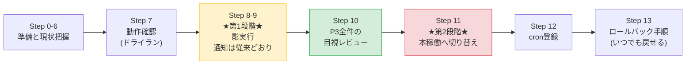
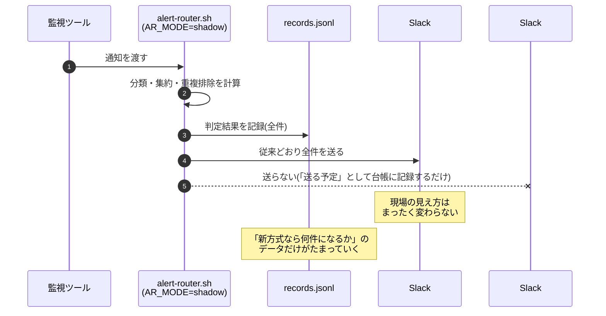

# 04. 実装・移行手順書

> **⚠️ この案件は架空の設定です。** 依頼元・課題・数値はすべて学習用に自分で設定したものであり、実在企業での実務実績ではありません。
> 本手順の出力例は、Ubuntu Server 22.04 LTS 相当の検証環境で実際に実行して得られたものです(パスは配置先に合わせて表記しています)。

## この手順書の読み方

本手順は **「いきなり本番の通知を絞らない」** ことを最優先に組んである。



**Step 8〜10 を飛ばして Step 11 に進んではいけない。** 影実行と目視レビューを省くと、「重要な通知まで消していないか」を確認しないまま本番の通知を絞ることになる。この改善で唯一許されない失敗である。

---

## Step 0. 前提の確認

```bash
lsb_release -a
```

```text
Distributor ID: Ubuntu
Description:    Ubuntu 22.04.4 LTS
Release:        22.04
Codename:       jammy
```

```bash
bash --version | head -1
```

```text
GNU bash, version 5.1.16(1)-release (x86_64-pc-linux-gnu)
```

**何をしているか**: OSとBashのバージョンを確認している。

**なぜ**: 本改善では**連想配列(`declare -A`)**を使う。これは Bash 4.0 以降でしか使えない。また、`local -n`(参照渡し)を使っている箇所があり、これは Bash 4.3 以降が必要になる。Ubuntu 22.04 の Bash 5.1 なら問題ない。

💡 **ポイント**: 最初にバージョンを確認しておくと、後で「なぜか連想配列でエラーになる」といった原因究明に時間を使わずに済む。特に古いCentOS 6系(Bash 4.1)や、macOS標準のBash(3.2)では動かない。

---

## Step 1. 必要なパッケージのインストール

```bash
sudo apt-get update
sudo apt-get install -y jq curl
```

```text
...
The following NEW packages will be installed:
  jq libjq1 libonig5
...
Setting up jq (1.6-2.1ubuntu3) ...
```

確認する。

```bash
jq --version && curl --version | head -1
```

```text
jq-1.6
curl 7.81.0 (x86_64-pc-linux-gnu) libcurl/7.81.0 OpenSSL/3.0.2 zlib/1.2.11
```

**何をしているか**: JSON Lines形式の記録を作る `jq` と、Slackへの送信に使う `curl` を入れている。

**なぜ**: `jq` は標準では入っていないことが多い。入っていない状態でこのツールを動かすと、起動時の事前チェックで「コマンドが見つかりません」と明示して停止する仕様にしてあるが、先に入れておくほうが早い。

---

## Step 2. ディレクトリとファイルの配置

```bash
sudo mkdir -p /opt/alert-router
sudo mkdir -p /var/lib/alert-router
sudo mkdir -p /var/log/alert-router/summary
```

**何をしているか**: 実行ファイル置き場(`/opt`)、状態ファイル置き場(`/var/lib`)、ログ置き場(`/var/log`)を作っている。

**なぜ**: Linuxには「どのディレクトリに何を置くか」の慣習(FHS = ファイルシステム階層標準)がある。これに従っておくと、他の人が引き継いだときに探す場所が分かる。

| ディレクトリ | 置くもの |
|---|---|
| `/opt/<製品名>/` | 自作・サードパーティのアプリケーション一式 |
| `/var/lib/<製品名>/` | アプリケーションが動作中に書き換える永続データ(状態ファイル) |
| `/var/log/<製品名>/` | ログ・記録 |

リポジトリからファイルをコピーする。

```bash
cd /path/to/automation/improvements/03-alert-noise-reduction
sudo cp src/*.sh src/*.conf /opt/alert-router/
sudo chmod 750 /opt/alert-router/*.sh
sudo chmod 600 /opt/alert-router/alert-router.conf
sudo chmod 644 /opt/alert-router/alert-rules.conf
ls -l /opt/alert-router/
```

```text
total 96
-rwxr-x--- 1 root root 15234 Sep  7 10:00 alert-flush.sh
-rwxr-x--- 1 root root  9871 Sep  7 10:00 alert-inventory.sh
-rw-r--r-- 1 root root  7412 Sep  7 10:00 alert-rules.conf
-rw------- 1 root root  6120 Sep  7 10:00 alert-router.conf
-rwxr-x--- 1 root root 11048 Sep  7 10:00 alert-router.sh
-rwxr-x--- 1 root root 23960 Sep  7 10:00 common.sh
-rwxr-x--- 1 root root 12603 Sep  7 10:00 daily-summary.sh
-rwxr-x--- 1 root root 13782 Sep  7 10:00 generate-sample-alerts.sh
-rwxr-x--- 1 root root 10534 Sep  7 10:00 shadow-compare.sh
```

💡 **ポイント**: `alert-router.conf` だけ `600`(所有者のみ読み書き)にしているのは、**Slack Webhook URLという秘匿情報が入っている**ため。一方 `alert-rules.conf` は `644` にして、運用担当者が中身を確認できるようにしている。「秘密が入っているファイルだけを厳しくする」という権限の分け方を意識するとよい。

---

## Step 3. 設定ファイルの編集

### 3.1 Slack Incoming Webhook を3つ発行する

Slackの管理画面で、次の3つのチャンネル用にWebhook URLを発行する。

| チャンネル | 用途 | 通知設定 |
|---|---|---|
| `#alert-p1` | P1(即時対応)専用 | **通知ON**。全員が受け取る |
| `#alert-daily` | P2まとめ + 日次サマリ | 通知OFFでよい |
| `#monitoring` | 既存チャンネル(影実行で使用) | 現状のまま |

💡 **ポイント**: `#alert-p1` は**新しく作る**こと。既存の `#monitoring` を流用してはいけない。既存チャンネルはすでに「見ない場所」として全員に認識されており、そこにP1を流しても見られない。**新しい場所を作って「ここは違う」と分かるようにする**ことが、心理的にも重要である。

### 3.2 設定ファイルを編集する

```bash
sudo vi /opt/alert-router/alert-router.conf
```

次の項目を書き換える。

```bash
# 動作モードは shadow のままにしておく(いきなり本稼働にしない)
AR_MODE="${AR_MODE:-shadow}"

# Slackへ実際に送信する
AR_ENABLE_SLACK="${AR_ENABLE_SLACK:-true}"

# 発行したWebhook URLに置き換える
AR_WEBHOOK_CRITICAL="${AR_WEBHOOK_CRITICAL:-<YOUR_SLACK_WEBHOOK_URL>}"
AR_WEBHOOK_DAILY="${AR_WEBHOOK_DAILY:-<YOUR_SLACK_WEBHOOK_URL>}"
AR_WEBHOOK_LEGACY="${AR_WEBHOOK_LEGACY:-<YOUR_SLACK_WEBHOOK_URL>}"
```

**何をしているか**: 動作モードを影実行のままにし、Slack送信を有効にし、Webhook URLを設定している。

**なぜ `AR_MODE` を `shadow` のままにするのか**: これがこの改善の肝である。影実行では判定と記録だけを行い、**通知は従来どおり全件を `#monitoring` へ流す**。つまり、この時点でツールを動かし始めても、**現場の見え方は1ミリも変わらない**。安全に検証を始められる。

💡 **ポイント**: `AR_ENABLE_SLACK=false` のままにしておくと、Slackへは一切送らず「送信台帳(`outbox.log`)に書くだけ」のドライラン動作になる。これから行う Step 5〜7 の練習では、この `false` のままで進めるとSlackを汚さずに済む。

---

## Step 4. ルール定義ファイルの確認

```bash
sudo /opt/alert-router/alert-router.sh --check-rules
```

```text
[2026-09-07 10:05:12] [INFO] ルールを 21 件読み込みました: /opt/alert-router/alert-rules.conf

ID       重要度 通知先 集約(秒) 説明
---------------------------------------------------------------------------
R010     P1   critical  0        本番Webサーバーの死活NG
R011     P1   critical  0        本番APIサーバーの死活NG
R012     P1   critical  0        本番DBサーバーの死活NG
R013     P3   record    3600     バッチサーバーの死活NG(瞬断が多く単発では対応不要)
R014     P3   record    3600     検証サーバーの死活NG
R015     P3   record    3600     テストサーバーの死活NG
R019     P1   critical  0        未定義ホストの死活NG(フェイルセーフ。上のどれにも当たらない場合)
R020     P3   record    3600     復旧通知(P1発報中のホストのみP1へ格上げ)
R030     P1   critical  0        アプリログのCRITICAL検知
R031     P2   daily     600      アプリログのERROR検知(10分単位でまとめる)
R040     P1   critical  0        バックアップジョブの失敗(データ保全に直結)
R041     P3   record    3600     バックアップジョブの正常終了(情報通知)
R042     P1   critical  0        ディスク使用率100%(書き込み不能。即時対応)
R043     P2   daily     3600     ディスク使用率90〜99%(翌営業日に拡張検討)
R044     P2   daily     3600     ディスク使用率85〜89%(翌営業日に確認)
R049     P3   record    3600     ディスク使用率84%以下(閾値70%が低すぎて常時出ている)
R060     P1   critical  0        証明書の期限が7日以内(サービス停止に直結)
R061     P2   daily     3600     証明書の期限が8〜9日(上のR060で7日以内は除外済み)
R062     P2   daily     3600     証明書の期限が10〜14日
R069     P3   record    86400    証明書の期限が15日以上(日次サマリで十分)
R070     P3   record    3600     監視ツール自身の再起動・再接続通知
---------------------------------------------------------------------------
ルール定義は正常です(21 件)。未分類の通知は P1 として扱われます。
```

**何をしているか**: ルール定義ファイルを読み込み、書式の誤りが無いかを検査して一覧表示している。通知は一切送らない。

**なぜ**: ルールファイルは1文字の書き間違いで壊れる。**本番に反映する前に必ずこのコマンドで確認する**習慣をつける。

書式に誤りがあると、次のように行番号つきで指摘される。

```bash
# わざと重要度を "P4"(存在しない値)にした場合
sudo /opt/alert-router/alert-router.sh --check-rules
```

```text
[2026-09-07 10:06:01] [ERROR] ルール定義エラー(128行目): 重要度は P1/P2/P3 のいずれかです (id=R099, 値=P4)
[2026-09-07 10:06:01] [ERROR] ルール定義に 1 件の誤りがあります。修正してから再実行してください。
```

💡 **ポイント**: 「エラーになったら、どこが悪いかを具体的に言う」のは自作ツールの重要な品質である。単に `exit 1` するだけでは、使う人が原因を探すのに何十分もかかる。**行番号・項目名・実際の値**の3つをメッセージに含めておくとよい。

---

## Step 5. 検証用のサンプル通知ログを生成する

```bash
cd /var/log/alert-router
sudo /opt/alert-router/generate-sample-alerts.sh --date 2026-09-01 --out /tmp/sample-alerts.tsv
```

```text
サンプル通知ログを生成しました: /tmp/sample-alerts.tsv
対象期間: 2026-09-01 から 1 日分 / 合計 200 件(1日あたり 200 件)

  件数  カテゴリ
------  --------------------
     2  本番死活NG
    35  復旧通知
    33  非本番死活NG
    62  アプリERROR繰り返し
    32  バックアップ完了
    19  容量警告70-84%
     2  容量警告85%以上
     9  証明書期限予告
     6  監視ツール再起動
------  --------------------
   200  合計
```

**何をしているか**: 改善前の1日分の通知(200件)を再現したログを生成している。

**なぜ**: 実運用では過去の通知ログを使うが、学習環境には存在しない。生成スクリプトで再現することで、**棚卸し → 判定 → 効果測定という一連の流れを、誰でも手元で再現できる**ようにしている。

💡 **ポイント**: このスクリプトは自前の計算式(線形合同法)で乱数を作っているため、`--seed` が同じなら**何度実行しても、どの環境で実行しても、まったく同じログができる**。Bash組み込みの `$RANDOM` はバージョンによって値が変わるので、再現性が必要な検証には使えない。

---

## Step 6. 棚卸し(現状を数える)

```bash
sudo /opt/alert-router/alert-inventory.sh --input /tmp/sample-alerts.tsv --days 1
```

```text
===== 通知の棚卸し結果 =====
集計対象: /tmp/sample-alerts.tsv
集計期間: 1日分 / 合計 200 件(1日あたり 200.0 件)

RULE      SEV  CHANNEL     COUNT   PER-DAY   SHARE  内容
-------------------------------------------------------------------------------------
R031      P2   daily          62      62.0   31.0%  アプリログのERROR検知(10分単位でまとめる)
R020      P3   record         35      35.0   17.5%  復旧通知(P1発報中のホストのみP1へ格上げ)
R041      P3   record         32      32.0   16.0%  バックアップジョブの正常終了(情報通知)
R049      P3   record         19      19.0    9.5%  ディスク使用率84%以下(閾値70%が低すぎて常時出ている)
R013      P3   record         11      11.0    5.5%  バッチサーバーの死活NG(瞬断が多く単発では対応不要)
R014      P3   record         11      11.0    5.5%  検証サーバーの死活NG
R015      P3   record         11      11.0    5.5%  テストサーバーの死活NG
R069      P3   record          9       9.0    4.5%  証明書の期限が15日以上(日次サマリで十分)
R070      P3   record          6       6.0    3.0%  監視ツール自身の再起動・再接続通知
R044      P2   daily           2       2.0    1.0%  ディスク使用率85〜89%(翌営業日に確認)
R010      P1   critical        1       1.0    0.5%  本番Webサーバーの死活NG
R011      P1   critical        1       1.0    0.5%  本番APIサーバーの死活NG
-------------------------------------------------------------------------------------
TOTAL                        200     200.0  100.0%

----- 重要度別の内訳 -----
P1         2 件  1日あたり    2.0 件  (  1.0%)
P2        64 件  1日あたり   64.0 件  ( 32.0%)
P3       134 件  1日あたり  134.0 件  ( 67.0%)

----- 発生元別の内訳 -----
health-check        70 件  ( 35.0%)
log-watch           62 件  ( 31.0%)
backup              53 件  ( 26.5%)
cert-check           9 件  (  4.5%)
systemd              6 件  (  3.0%)
```

**何をしているか**: 通知ログを種類別に集計し、どの通知が何件出ているかを数えている。

**なぜ**: 改善の第一歩は「減らすこと」ではなく「**数えること**」。ここで得た数字が、この後の効果測定の基準(Before)になる。

💡 **ポイント**: 上位3種類(R031 62件 + R020 35件 + R041 32件 = 129件)だけで全体の64.5%を占めている。**この3つに手を打てば、それだけで通知は3分の1近くになる**という当たりが、数える前には見えていなかったはずである。感覚ではなく数字から施策を決める、というのが改善案件の型である。

複数日分をまとめて集計することもできる。

```bash
sudo /opt/alert-router/generate-sample-alerts.sh --date 2026-08-19 --days 14 --out /tmp/sample-14d.tsv >/dev/null
sudo /opt/alert-router/alert-inventory.sh --input /tmp/sample-14d.tsv --days 14 --format md | head -12
```

```text
## 通知の棚卸し結果

- 集計対象: `/tmp/sample-14d.tsv`
- 集計期間: 14日分 / 合計 2800 件(1日あたり 200.0 件)

| ルールID | 重要度 | 通知先 | 件数 | 1日あたり | 割合 | 内容 |
|---|---|---|---:|---:|---:|---|
| R031 | P2 | daily | 868 | 62.0 | 31.0% | アプリログのERROR検知(10分単位でまとめる) |
| R020 | P3 | record | 490 | 35.0 | 17.5% | 復旧通知(P1発報中のホストのみP1へ格上げ) |
| R041 | P3 | record | 448 | 32.0 | 16.0% | バックアップジョブの正常終了(情報通知) |
| R049 | P3 | record | 266 | 19.0 | 9.5% | ディスク使用率84%以下(閾値70%が低すぎて常時出ている) |
| R013 | P3 | record | 154 | 11.0 | 5.5% | バッチサーバーの死活NG(瞬断が多く単発では対応不要) |
```

14日分を集計しても1日あたりの件数は変わらない(生成スクリプトが毎日同じ構成の200件を作るため)。実運用では曜日による差が出るので、**必ず複数日分を平均して見る**こと。

💡 **ポイント**: `--format md` を付けるとMarkdownの表で出力される。そのまま報告書やWikiに貼れるので、集計結果を手で表に書き写す手間と書き写しミスが無くなる。

---

## Step 7. 動作確認(1件だけ流してみる)

まずSlackへ送らないドライランで確かめる。

```bash
sudo AR_ENABLE_SLACK=false AR_MODE=active /opt/alert-router/alert-router.sh \
    --source health-check --host web01 \
    --message ":red_circle: [障害検知] web01(http://192.168.1.11/)が2回連続でNGです"
```

```text
[2026-09-07 10:12:44] [INFO] ルールを 21 件読み込みました: /opt/alert-router/alert-rules.conf
```

送信台帳を見る。

```bash
sudo cat /var/log/alert-router/outbox.log
```

```text
2026-09-07 10:12:44	critical	dry-run	:rotating_light: *[P1] 即時対応* <!channel> ルール: R010 本番Webサーバーの死活NG ホスト: web01 / 発生元: health-check 検知時刻: 2026-09-07 10:12:44 内容: :red_circle: [障害検知] web01(http://192.168.1.11/)が2回連続でNGです
```

**何をしているか**: 死活監視の通知を1件流し、R010(P1)として判定され、`critical` チャンネルへ送られる予定であることを確認している。`dry-run` は「実際には送っていない」という印。

**なぜ**: いきなり本番の通知を流す前に、**判定が意図どおりかを1件ずつ確かめる**。ルールの書き間違いはここで見つかる。

全件記録も確認する。

```bash
sudo jq -c '{rule_id, severity, action, host}' /var/log/alert-router/records.jsonl
```

```text
{"rule_id":"R010","severity":"P1","action":"notified","host":"web01"}
```

### 主要な動作を一通り確認する

**(a) 重複排除**: まったく同じ文面をもう一度流す。

```bash
sudo AR_ENABLE_SLACK=false AR_MODE=active /opt/alert-router/alert-router.sh \
    --source health-check --host web01 \
    --message ":red_circle: [障害検知] web01(http://192.168.1.11/)が2回連続でNGです"
sudo jq -c '{rule_id, severity, action}' /var/log/alert-router/records.jsonl
```

```text
{"rule_id":"R010","severity":"P1","action":"notified","host":"web01"}
{"rule_id":"R010","severity":"P1","action":"deduped"}
```

💡 **ポイント**: 2件目は `deduped`(重複のため通知しない)になったが、**記録には残っている**。ここが「抑制」との決定的な違い。通知しなかったものも、後から必ず追跡できる。

**(b) 未分類のフェイルセーフ**: ルールに無い文面を流す。

```bash
sudo AR_ENABLE_SLACK=false AR_MODE=active /opt/alert-router/alert-router.sh \
    --source unknown-tool --host xyz01 \
    --message "新しい監視ツールからの見たことがない通知です"
sudo jq -c 'select(.rule_id=="UNMATCHED") | {rule_id, severity, action}' \
    /var/log/alert-router/records.jsonl
```

```text
{"rule_id":"UNMATCHED","severity":"P1","action":"notified"}
```

💡 **ポイント**: どのルールにも一致しない通知は、自動的に**P1として即時通知**される。「分類できないものは安全側に倒す」という設計が、実際にそう動いていることを目で確認しておく。

**(c) 複数行の通知(案件No.3の形式)**: 標準入力から渡す。

```bash
printf ':rotating_light: *ログ異常検知* :rotating_light:\nホスト: app01\n監視対象: /var/log/app/error.log\n検知時刻: 2026-09-07 10:12:33\n検知内容(抜粋):\n2026-09-07 10:12:33 CRITICAL DBPool: all connections exhausted\n' \
  | sudo AR_ENABLE_SLACK=false AR_MODE=active /opt/alert-router/alert-router.sh \
      --source log-watch --host app01 --message -
sudo jq -c 'select(.rule_id=="R030") | {rule_id, severity, action}' \
    /var/log/alert-router/records.jsonl
```

```text
{"rule_id":"R030","severity":"P1","action":"notified"}
```

💡 **ポイント**: `--message -` と書くと標準入力から本文を読む。案件No.3のログ監視ツールの通知は複数行なので、コマンドライン引数より標準入力のほうが確実。`CRITICAL` を含むためR030(P1)と判定されている。

確認が終わったら、テストで作ったデータを消しておく。

```bash
sudo rm -f /var/log/alert-router/records.jsonl /var/log/alert-router/outbox.log
sudo rm -f /var/lib/alert-router/dedup_* /var/lib/alert-router/p1active_* /var/lib/alert-router/agg_*
```

---

## Step 8. ★第1段階★ 影実行(shadow)を開始する

ここからが段階的移行の本番である。

### 8.1 影実行とは何をするのか



**要するに**: 判定はする。記録もする。しかし**通知は今までと同じ**。だから現場は何も変わらないし、リスクもゼロ。その裏で「新方式に切り替えたらどうなるか」のデータだけがたまっていく。

### 8.2 既存ツールの通知先を差し替える

各監視ツールが直接Slackへ送っている部分を、入口の呼び出しに差し替える。

**[projects/04-server-health-check](../../projects/04-server-health-check/README.md) の場合**

`health_check.sh` の `notify_slack` 関数の中を、次のように変更する。

```bash
# --- 変更前 ---
notify_slack() {
    local message="$1"
    if [ "${ENABLE_SLACK_NOTIFY}" != "true" ]; then
        return 0
    fi
    curl -s -X POST -H 'Content-type: application/json' \
        --data "{\"text\": \"${message}\"}" \
        "${SLACK_WEBHOOK_URL}" > /dev/null
}

# --- 変更後 ---
notify_slack() {
    local message="$1"
    if [ "${ENABLE_SLACK_NOTIFY}" != "true" ]; then
        return 0
    fi
    # Slackへ直接送るのをやめ、通知の入口へ渡す。
    # 分類・集約・記録・振り分けは入口側がすべて行う。
    /opt/alert-router/alert-router.sh \
        --source health-check --host "${name}" --message "${message}"
}
```

**[projects/03-log-monitoring-alert](../../projects/03-log-monitoring-alert/README.md) の場合**

`log-watch-alert.sh` の `send_slack_notification` 関数の中の `curl` を、次に置き換える。

```bash
    # 本文は複数行なので、標準入力経由で渡す
    printf '%s' "$text" | /opt/alert-router/alert-router.sh \
        --source log-watch --host "${HOSTNAME_LABEL}" --message -
```

**[projects/02-backup-automation](../../projects/02-backup-automation/README.md) の場合**

`backup.sh` の `notify_slack` 関数の中の `curl` を、次に置き換える。

```bash
    /opt/alert-router/alert-router.sh \
        --source backup --host "$(hostname)" --message "${message}"
```

💡 **ポイント**: 変更するのは各ツール**1か所ずつ、実質1行**だけ。「Slackへ送る」を「入口へ渡す」に変えているだけで、ツール側のロジックは何も変わっていない。**変更が小さいほど、壊すリスクも小さくなる。**

> **注**: 本リポジトリでは `projects/` 配下は変更していない(改善案件の作業範囲外のため)。上記は本番環境で行う差し替え内容として記載している。

### 8.3 影実行の設定を確認する

```bash
sudo grep -E '^AR_(MODE|ENABLE_SLACK)=' /opt/alert-router/alert-router.conf
```

```text
AR_MODE="${AR_MODE:-shadow}"
AR_ENABLE_SLACK="${AR_ENABLE_SLACK:-true}"
```

**確認すべきこと**: `AR_MODE` が **`shadow`** であること。これが `active` になっていると、いきなり本稼働してしまう。

### 8.4 影実行を数日〜1週間動かす

この状態で、実際の通知が流れるのを待つ。**推奨は最低3日、できれば1週間。**

**なぜ期間が必要か**: 通知の種類は曜日や時間帯で変わる。平日しか出ない通知、月初にしか出ない通知がある。1日だけのデータで判断すると、見落としが出る。

### 8.5 (学習環境の場合)過去ログを流し込んで代用する

実際の通知が流れるのを待てない学習環境では、Step 5 で作ったサンプルログを流し込むことで同じデータを作れる。

```bash
# 計測を正確にするため、送信台帳と記録をいったん空にする
sudo rm -f /var/log/alert-router/records.jsonl /var/log/alert-router/outbox.log
sudo rm -f /var/lib/alert-router/agg_* /var/lib/alert-router/dedup_* /var/lib/alert-router/p1active_*

# 1日分(200件)を流し込む
sudo AR_ENABLE_SLACK=false AR_QUIET=true /opt/alert-router/alert-router.sh \
    --replay /tmp/sample-alerts.tsv
```

```text
(処理に約7秒かかる。AR_QUIET=true のため画面には何も出ない)
```

```bash
sudo wc -l /var/log/alert-router/records.jsonl
sudo awk -F'\t' '{print $2, $3}' /var/log/alert-router/outbox.log | sort | uniq -c
```

```text
200 /var/log/alert-router/records.jsonl
      4 critical shadow-planned
      7 daily shadow-planned
    200 legacy dry-run
```

**この3行が影実行の成果物である。**

| 行 | 意味 |
|---|---|
| `200 legacy` | 従来どおり `#monitoring` へ流した通知(現場の見え方は変わっていない) |
| `4 critical shadow-planned` | 新方式なら `#alert-p1` へ送る**予定**だった通知 |
| `7 daily shadow-planned` | 新方式なら `#alert-daily` へ送る**予定**だった通知(P2のまとめ通知) |

最後に、日次サマリも影実行のまま1回生成しておく。これも新方式で送る通知の1件として数えるため。

```bash
sudo AR_ENABLE_SLACK=false /opt/alert-router/daily-summary.sh --date 2026-09-01
sudo awk -F'\t' '{print $2}' /var/log/alert-router/outbox.log | sort | uniq -c
```

```text
      4 critical
      8 daily
    200 legacy
```

**新方式で送る通知は合計12件**(P1 4件 + P2まとめ 7件 + 日次サマリ 1件)になった。

💡 **ポイント**: `--replay` は集約ウィンドウの判定に**ログに記録された発生日時**を使う。現在時刻を使ってしまうと200件が一瞬で処理され、すべて同じウィンドウに入って結果が実態とかけ離れる。「過去ログの再生では、時計も過去に合わせる」という考え方は、この種の検証では必ず必要になる。

---

## Step 9. 影実行の結果を突き合わせる

```bash
sudo /opt/alert-router/shadow-compare.sh --date 2026-09-01
```

```text
===== 影実行の突き合わせ結果(2026-09-01)=====

受け取った通知(=記録件数)          :    200 件
旧方式で通知していた件数            :    200 件
新方式で通知する件数(P1即時)      :      4 件
新方式で通知する件数(P2・サマリ)  :      8 件
------------------------------------------------
新方式の通知合計                    :     12 件
削減率                              :   94.0 %

----- 重要度別の判定結果 -----
P1        4 件 (  2.0%)
P2       64 件 ( 32.0%)
P3      132 件 ( 66.0%)

----- 処理結果の内訳 -----
notified  (即時通知)      :      4 件
aggregated(集約)          :     64 件
deduped   (重複排除)      :      0 件
recorded  (記録のみ)      :    132 件

----- P3(記録のみ)に落とした通知 -----
※本当に即時通知が不要か、1行ずつ確認すること
R020          33 件  復旧通知(P1発報中のホストのみP1へ格上げ)
R041          32 件  バックアップジョブの正常終了(情報通知)
R049          19 件  ディスク使用率84%以下(閾値70%が低すぎて常時出ている)
R013          11 件  バッチサーバーの死活NG(瞬断が多く単発では対応不要)
R014          11 件  検証サーバーの死活NG
R015          11 件  テストサーバーの死活NG
R069           9 件  証明書の期限が15日以上(日次サマリで十分)
R070           6 件  監視ツール自身の再起動・再接続通知
```

**何をしているか**: 影実行でたまったデータから、「新方式に切り替えたら通知が何件になるか」を計算している。

**なぜ**: 本稼働に切り替える前に、**効果とリスクの両方を数字で確認する**。ここで削減率が思ったより低ければルールを見直せるし、P3が多すぎれば分類を再検討できる。**切り替えてから気づくのでは遅い。**

**この結果の読み方**

| 行 | 意味 |
|---|---|
| 受け取った通知 200件 | 入口に届いた通知の総数。**この数は改善後も変わらない** |
| 旧方式 200件 | 改善前は、この200件がすべて `#monitoring` に流れていた |
| 新方式 12件 | P1即時 4件 + P2まとめ 7件 + 日次サマリ 1件 |
| 削減率 94.0% | (1 − 12 ÷ 200)× 100 |
| recorded 132件 | 即時通知しないことにした通知。**次のStep 10 で全件レビューする** |

💡 **ポイント**: 「未分類の通知が N 件あります」という警告が出た場合は、**本稼働に進む前に必ずルールを追加する**。未分類はP1として通知されるので通知が減らないだけでなく、「ルールが現状をカバーできていない」というサインでもある。

---

## Step 10. ★P3全件の目視レビュー★ 消してよかったかを確認する

**これが、この改善でいちばん重要な作業である。**

Step 9 の結果から、「新方式では132件を即時通知しないことにする」ことが分かった。では、**その132件の中に、本当は即時通知すべきものが混ざっていないか。**

これを人の目で確認する。

```bash
sudo /opt/alert-router/shadow-compare.sh --date 2026-09-01 --list-p3 | head -20
```

```text
===== P3(記録のみ)にした通知の全件 =====
2026-09-01 00:07:30  R049   backup01  :warning: [容量警告] バックアップ先(/backup)の使用率が 78% です(閾値: 70%)
2026-09-01 01:05:00  R041   web01     :white_check_mark: [バックアップ完了] web01-20260901.tar.gz を作成しました(12.4MB)
2026-09-01 01:07:30  R049   backup01  :warning: [容量警告] バックアップ先(/backup)の使用率が 78% です(閾値: 70%)
2026-09-01 01:08:00  R041   web02     :white_check_mark: [バックアップ完了] web02-20260901.tar.gz を作成しました(12.4MB)
2026-09-01 01:11:00  R041   db01      :white_check_mark: [バックアップ完了] db01-20260901.tar.gz を作成しました(12.4MB)
...
```

### レビューのやり方

全件を上から順に見て、次の問いを立てる。

> **「この通知が今夜届かなかったとして、翌朝までに利用者が困るか?」**

困らないなら P3 のままでよい。困るなら **P1 か P2 に格上げする**。

チェックリスト形式にすると次のようになる。

| # | ルール | 件数 | 判断 | 判断の根拠 |
|---|---|---:|---|---|
| 1 | R020 復旧通知 | 33 | ✅ P3のまま | 復旧は「直った」報告。P1事象の復旧だけは自動でP1へ格上げされる仕組みがある |
| 2 | R041 バックアップ正常終了 | 32 | ✅ P3のまま | 成功の報告。失敗(R040)は別ルールでP1になっている |
| 3 | R049 ディスク70〜84% | 19 | ✅ P3のまま | 何年も同じ水準。85%以上(R044)からP2、100%(R042)でP1になる |
| 4 | R013/R014/R015 非本番の死活NG | 33 | ✅ P3のまま | 本番系(web/api/db)はR010〜R012でP1。未定義ホストもR019でP1 |
| 5 | R069 証明書(残り15日以上) | 9 | ✅ P3のまま | 残り14日以下はR062/R061でP2、7日以下はR060でP1 |
| 6 | R070 監視ツール再起動 | 6 | ✅ P3のまま | 単発では対応しない。ただし20件を超えたら自動でP1へエスカレーションされる |

💡 **ポイント**: レビューで見るべきは**「P3にした通知そのもの」だけでなく、「その種類の中で重要なものが別ルールで拾えているか」**である。上の表の「判断の根拠」の列がすべて「〜はP1/P2で拾える」となっていることに注目してほしい。**P3に落とすときは、必ず「重要なケースを拾う別ルール」とセットにする。** これができていれば、通知を減らしても見逃しは増えない。

### 過去に見逃した通知で確認する

さらに確実にするため、**過去に見逃した通知と同じ文面を流して、P1になることを確認する**。

```bash
# 見逃し事例1: 本番Webサーバーの死活NG
sudo AR_ENABLE_SLACK=false AR_MODE=active /opt/alert-router/alert-router.sh \
    --source health-check --host web02 \
    --message ":red_circle: [障害検知] web02(https://192.168.1.12/)が2回連続でNGです"

# 見逃し事例2: アプリログのCRITICAL
printf ':rotating_light: *ログ異常検知* :rotating_light:\nホスト: db01\n検知内容(抜粋): CRITICAL DBPool: all connections exhausted\n' \
  | sudo AR_ENABLE_SLACK=false AR_MODE=active /opt/alert-router/alert-router.sh \
      --source log-watch --host db01 --message -

sudo jq -c 'select(.host=="web02" or .host=="db01") | {host, rule_id, severity, action}' \
    /var/log/alert-router/records.jsonl
```

```text
{"host":"web02","rule_id":"R010","severity":"P1","action":"notified"}
{"host":"db01","rule_id":"R030","severity":"P1","action":"notified"}
```

**どちらもP1として即時通知される。** これで「新方式でも、過去に見逃した種類の通知は必ず届く」ことが確認できた。

💡 **ポイント**: 「過去の失敗を、新しい仕組みで再現テストする」のは、改善案件では非常に説得力のある検証になる。面接でも「実際に過去の見逃し事例と同じ通知を流して、P1として届くことを確認しました」と言えると強い。

---

## Step 11. ★第2段階★ 本稼働(active)へ切り替える

Step 9・Step 10 の確認が済んでから、はじめてここへ進む。

### 11.1 切り替え前チェックリスト

| # | 確認項目 | 確認方法 |
|---|---|---|
| 1 | 影実行を最低3日(推奨1週間)動かしたか | `records.jsonl` の日付の種類を確認 |
| 2 | 削減率と件数を確認したか | `shadow-compare.sh` |
| 3 | **P3全件を目視レビューしたか** | `shadow-compare.sh --list-p3` |
| 4 | 未分類(UNMATCHED)が0件か | `shadow-compare.sh` の警告 |
| 5 | 過去の見逃し事例がP1になることを確認したか | Step 10 の再現テスト |
| 6 | `#alert-p1` の通知設定がONになっているか | Slackのチャンネル設定 |
| 7 | ロールバック手順(Step 13)を読んだか | ― |

### 11.2 切り替える

```bash
# 現在の設定をバックアップしておく(ロールバック用)
sudo cp /opt/alert-router/alert-router.conf \
        /opt/alert-router/alert-router.conf.bak-$(date '+%Y%m%d')

# 動作モードを active に変更する
sudo sed -i 's|^AR_MODE="\${AR_MODE:-shadow}"|AR_MODE="${AR_MODE:-active}"|' \
    /opt/alert-router/alert-router.conf

# 変更されたことを確認する
sudo grep '^AR_MODE=' /opt/alert-router/alert-router.conf
```

```text
AR_MODE="${AR_MODE:-active}"
```

**何をしているか**: 動作モードを `shadow` から `active` へ変更している。**変更したのはこの1行だけ**である。

**なぜバックアップを取るのか**: ロールバックのとき、「元がどうだったか」を思い出さなくて済むようにするため。日付入りのファイル名にしておくと、いつの設定かが分かる。

💡 **ポイント**: 切り替えは `sed` の1行、しかも変更点は `shadow` → `active` の1単語だけ。**変更点が小さいほど、戻すのも簡単になる。** 「切り替え作業が複雑で、戻し方が分からない」という状態を作らないことが、運用設計では非常に重要である。

### 11.3 切り替え直後の確認

```bash
# テスト用のP1通知を1件流す
sudo /opt/alert-router/alert-router.sh \
    --source health-check --host web01 \
    --message ":red_circle: [障害検知] web01(http://192.168.1.11/)が2回連続でNGです"

sudo tail -1 /var/log/alert-router/outbox.log | awk -F'\t' '{print $2, $3}'
```

```text
critical sent
```

**確認すべきこと**: 状態が `sent`(実際に送信した)になっていること。`#alert-p1` チャンネルに通知が届いていることをSlackで目視確認する。

`shadow-planned` のままなら、まだ影実行のままである。設定の変更が反映されていないので Step 11.2 をやり直す。

---

## Step 12. cronに登録する

```bash
sudo crontab -e
```

次の2行を追加する(コメント行は任意)。

```cron
# 集約ウィンドウの締め処理(5分ごと)
*/5 * * * * /opt/alert-router/alert-flush.sh >> /var/log/alert-router/cron.log 2>&1

# 日次サマリの生成と通知(毎朝9時)
0 9 * * * /opt/alert-router/daily-summary.sh >> /var/log/alert-router/cron.log 2>&1
```

```bash
sudo crontab -l | grep alert
```

```text
*/5 * * * * /opt/alert-router/alert-flush.sh >> /var/log/alert-router/cron.log 2>&1
0 9 * * * /opt/alert-router/daily-summary.sh >> /var/log/alert-router/cron.log 2>&1
```

**何をしているか**: 「時間が来たら誰かがやらないといけない処理」をcronに任せている。

**なぜ `alert-flush.sh` が必要か**: 集約は「ためて、あとで出す」仕組みなので、ためている間に次の通知が来ないと誰も締めてくれない。cronで5分ごとに「期限が来たウィンドウを閉じて回る係」を動かすことで、まとめ通知の遅延を「ウィンドウ長 + 5分」以内に抑えている。

💡 **ポイント**: 実行間隔を「集約ウィンドウの半分」にするのが目安。ウィンドウが600秒(10分)なので、その半分の5分にしている。短くしすぎるとcronの起動が無駄になり、長くしすぎるとまとめ通知が遅れる。

### 日次サマリを手動で1回試す

```bash
sudo /opt/alert-router/daily-summary.sh --date 2026-09-01
```

```text
[2026-09-07 10:30:02] [INFO] ルールを 21 件読み込みました: /opt/alert-router/alert-rules.conf
[2026-09-07 10:30:02] [INFO] 日次サマリを生成しました: /var/log/alert-router/summary/summary-2026-09-01.md
[2026-09-07 10:30:02] [INFO] 日次サマリを通知しました(通知先: daily)
```

```bash
sudo head -30 /var/log/alert-router/summary/summary-2026-09-01.md
```

```text
# アラート日次サマリ 2026-09-01

- 生成日時: 2026-09-07 10:30:02
- 記録件数(受け取った通知の総数): **200 件**
- 動作モード: active

> この日に発生した通知は、即時通知したかどうかに関わらず
> すべて `/var/log/alert-router/records.jsonl` に記録されています。通知を減らしても記録は減らしていません。

## 1. 重要度別の内訳

| 重要度 | 意味 | 件数 | 割合 |
|---|---|---:|---:|
| P1 | 即時対応(メンション付きで即時通知) | 4 | 2.0% |
| P2 | 翌営業日対応(まとめて通知) | 64 | 32.0% |
| P3 | 記録のみ(このサマリで確認) | 132 | 66.0% |

## 2. 処理結果の内訳

| 処理 | 意味 | 件数 |
|---|---|---:|
| notified | 即時通知した(P1) | 4 |
| aggregated | 集約ウィンドウにまとめた(P2) | 64 |
| deduped | まったく同じ文面の再送のため通知を省いた | 0 |
| recorded | 記録のみ(P3) | 132 |
```

💡 **ポイント**: 日次サマリは「P3を捨てていない」ことの証明でもある。**毎朝これを1件見るだけで、前日の全200件の内訳が分かる。** この安心感があるからこそ、即時通知を12件まで絞ることができる。

---

## Step 13. ★ロールバック手順★

本稼働に切り替えたあと、問題が起きた場合の戻し方。**切り替えより先にこの手順を読んでおくこと。**

### 13.1 どんなときに戻すか

| 症状 | 判断 |
|---|---|
| 重要な通知が届かなかった | **即ロールバック**。原因究明は戻してから行う |
| 通知が想定より多い/少ない | ロールバックせず、ルールを調整する(13.4参照) |
| 入口スクリプトがエラーで動かない | **即ロールバック**(13.3の完全ロールバック) |
| Slackへの送信が失敗している | 記録は残っているので、Webhook URLの確認を先に行う |

### 13.2 ロールバック手順A: 影実行に戻す(推奨・30秒)

```bash
sudo sed -i 's|^AR_MODE="\${AR_MODE:-active}"|AR_MODE="${AR_MODE:-shadow}"|' \
    /opt/alert-router/alert-router.conf
sudo grep '^AR_MODE=' /opt/alert-router/alert-router.conf
```

```text
AR_MODE="${AR_MODE:-shadow}"
```

動作確認する。

```bash
sudo /opt/alert-router/alert-router.sh \
    --source health-check --host web01 \
    --message ":red_circle: [障害検知] web01(http://192.168.1.11/)が2回連続でNGです"
sudo tail -2 /var/log/alert-router/outbox.log | awk -F'\t' '{print $2, $3}'
```

```text
critical shadow-planned
legacy sent
```

**これで元どおり。** `#monitoring` へ全件が流れる状態(改善前とまったく同じ見え方)に戻り、`#alert-p1` への送信は止まる。

**なぜこれで戻るのか**: 影実行モードは「判定はするが、新チャンネルへは送らず、旧チャンネルへ全件送る」動作である。つまり**改善前とまったく同じ通知の流れ**になる。分類と記録は続くので、原因の調査はそのまま続けられる。

💡 **ポイント**: これが「切り替えとロールバックを対称にする」設計の効果である。**戻すために思い出さなければならないことが1つも無い。** 障害対応で慌てている状況では、これが決定的に重要になる。

バックアップから戻すこともできる。

```bash
sudo cp /opt/alert-router/alert-router.conf.bak-20260907 \
        /opt/alert-router/alert-router.conf
```

### 13.3 ロールバック手順B: 完全に元の構成へ戻す(入口ごと外す)

入口スクリプト自体に問題がある場合は、監視ツールを直接Slackへ送る構成に戻す。

```bash
# 1. cronを止める(まとめ通知・日次サマリを停止)
sudo crontab -l | grep -v 'alert-router\|alert-flush\|daily-summary' | sudo crontab -
sudo crontab -l | grep -c alert
```

```text
0
```

```bash
# 2. 各監視ツールの通知処理を、変更前の curl に戻す
#    (Step 8.2 の「変更前」のコードに戻す。git管理していればチェックアウトするだけ)
cd /opt/server-health-check && sudo git checkout health_check.sh
```

```bash
# 3. 通知が元のチャンネルへ直接届くことを確認する
sudo /opt/server-health-check/health_check.sh
```

**確認すべきこと**: `#monitoring` に通知が届くこと。

💡 **ポイント**: 監視ツールのスクリプトは**必ずgitなどのバージョン管理下に置いておく**こと。そうすれば「変更前に戻す」が `git checkout` 1回で済む。手で書き戻そうとすると、必ずどこかを間違える。

### 13.4 ロールバックせずに調整する場合

「重要な通知が届かなかった」以外の多くの問題は、**ルールの調整だけで直る**。この場合はロールバック不要。

```bash
# 例: バッチサーバーの死活NGを P3 → P2 へ格上げする
sudo vi /opt/alert-router/alert-rules.conf
# R013|\[障害検知\] batch|P3|record|3600|...
#                        ↓
# R013|\[障害検知\] batch|P2|daily|3600|...

# 反映前に必ず検査する
sudo /opt/alert-router/alert-router.sh --check-rules | grep R013
```

```text
R013     P2   daily     3600     バッチサーバーの死活NG(瞬断が多く単発では対応不要)
```

**再起動もリロードも不要。** ルールファイルは通知を1件処理するたびに読み直されるため、保存した瞬間から次の通知に反映される。

💡 **ポイント**: 「設定を変えたのに反映されない」というトラブルが起きない作りにしてある。常駐プロセスではなく「通知が来るたびに起動するスクリプト」だからこそ実現できる利点。

---

## Step 14. 移行完了チェックリスト

| # | 項目 | 確認方法 |
|---|---|---|
| 1 | ルール定義に誤りが無い | `alert-router.sh --check-rules` |
| 2 | 影実行を3日以上実施した | `records.jsonl` の日付 |
| 3 | P3全件を目視レビューした | `shadow-compare.sh --list-p3` |
| 4 | 未分類が0件である | `shadow-compare.sh` の警告が出ない |
| 5 | 過去の見逃し事例がP1になる | Step 10 の再現テスト |
| 6 | `AR_MODE=active` になっている | `grep '^AR_MODE=' alert-router.conf` |
| 7 | P1通知が `#alert-p1` に届く | Slackで目視 |
| 8 | cronが2件登録されている | `crontab -l \| grep -c alert` → 2 |
| 9 | まとめ通知が届く | 5分待って `#alert-daily` を確認 |
| 10 | 日次サマリが届く | `daily-summary.sh` を手動実行 |
| 11 | 全件記録が増え続けている | `wc -l records.jsonl` を1日おきに確認 |
| 12 | 設定ファイルの権限が600 | `ls -l alert-router.conf` |
| 13 | ロールバック手順を試した | Step 13.2 を1回実行して戻す |
| 14 | 効果測定を行った | [05-effect-measurement.md](./05-effect-measurement.md) |

💡 **ポイント**: 13番の「ロールバック手順を試した」を必ずやること。**実際に戻してみないと、その手順が本当に動くかは分からない。** 障害が起きてから初めて試すのでは遅い。

---

## 関連ドキュメント

- [README.md](./README.md) — 案件概要
- [01-current-analysis.md](./01-current-analysis.md) — 現状分析書
- [02-improvement-proposal.md](./02-improvement-proposal.md) — 改善提案書
- [03-design.md](./03-design.md) — 改善設計書
- [05-effect-measurement.md](./05-effect-measurement.md) — 効果測定レポート
- [06-troubleshooting.md](./06-troubleshooting.md) — トラブルシューティング集
- [src/crontab.example](./src/crontab.example) — cron登録例
