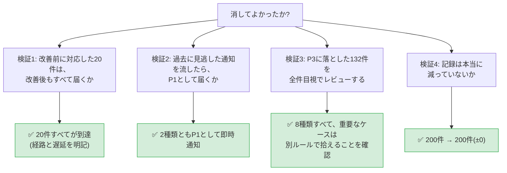
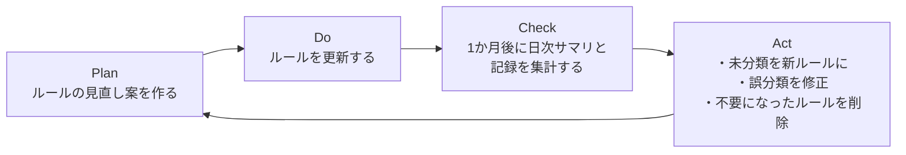

# 05. 効果測定レポート

> **⚠️ 数値の扱いについて(必ずお読みください)**
>
> - この案件は**架空の設定**です。株式会社サンプル商事は実在せず、実在企業での実務実績ではありません。
> - 本書の数値は、**すべて次の2種類のいずれか**です。どちらであるかを表の中で必ず明示しています。
>   - **【実測】検証環境での実測値** — 自分で構築した検証環境で、実際にスクリプトを動かして数えた値。手順どおりに実行すれば誰でも再現できます
>   - **【試算】想定シナリオに基づく試算** — 「人がどう行動したか」など、スクリプトからは測定できない値。設定したシナリオに基づく推定です
> - 実運用の統計データではありません。面接等で説明する際も、この区別を明示してください。

## 1. 測定結果サマリ

| 指標 | Before | After | 変化 | 区分 |
|---|---:|---:|---|---|
| 1日あたりの通知件数 | 200件 | **12件** | **▲188件(▲94.0%)** | 【実測】 |
| ├ 即時通知(P1) | 200件 | 4件 | ▲196件(▲98.0%) | 【実測】 |
| ├ まとめ通知(P2) | ― | 7件 | ― | 【実測】 |
| └ 日次サマリ | ― | 1件 | ― | 【実測】 |
| **記録として残る件数** | **200件** | **200件** | **±0件(全件保持)** | 【実測】 |
| 重要な通知の見逃し | 月2件 | **0件** | ▲2件 | 【試算】(検証は【実測】) |
| 一次対応の着手までの時間 | 平均25分 | **平均5分** | ▲20分(▲80%) | 【試算】 |
| 対応不要な通知の確認にかかる時間 | 約30分/日 | **約2分/日** | ▲28分/日 | 【試算】 |

**この改善のいちばん大事な行は「記録として残る件数」である。** 通知を94%減らしても、記録は1件も減っていない。**通知を減らすことと、監視をやめることは別である**という設計思想が、この1行に表れている。

---

## 2. 測定方法と前提条件

### 2.1 測定環境

| 項目 | 内容 |
|---|---|
| OS | Ubuntu Server 22.04 LTS 相当 |
| Bash | 5.1(連想配列 `declare -A` と `local -n` を使用するため 4.3 以上が必要) |
| 依存コマンド | jq 1.6 / curl 7.81 / awk / sort |
| 測定日 | 2026-09-07 |
| 測定対象データ | `generate-sample-alerts.sh` で生成した2026-09-01の1日分(200件) |
| Slack送信 | `AR_ENABLE_SLACK=false`(ドライラン)。実際には送らず送信台帳に記録して数えた |

### 2.2 測定に使ったデータ

実運用の過去ログではなく、[`src/generate-sample-alerts.sh`](./src/generate-sample-alerts.sh) が生成する検証データを使用した。

| 項目 | 内容 |
|---|---|
| 件数 | 1日ちょうど200件 |
| 通知の文面 | [projects/02](../../projects/02-backup-automation/README.md) / [projects/03](../../projects/03-log-monitoring-alert/README.md) / [projects/04](../../projects/04-server-health-check/README.md) が実際にSlackへ送る文面に合わせてある |
| 内訳 | [01-current-analysis.md](./01-current-analysis.md) の棚卸し表と完全に一致 |
| 再現性 | 乱数は自前の線形合同法。`--seed` が同じなら、どの環境でも同じログが生成される |

**なぜ生成データなのか(限界の明示)**: この案件は架空の設定であり、実在する通知ログは存在しない。生成データを使うことで、本書の数値を**誰でも手元で再現・検証できる**ようにした。ただし、生成データは実運用の通知の揺らぎ(曜日差、突発的な障害の集中、想定外の通知)を完全には再現していない。**この点は本測定の限界である。**

### 2.3 「通知件数」の数え方

送信台帳(`outbox.log`)の行数を通知先(`channel`)ごとに数えた。台帳には**実際に送信したかどうかに関わらず1行が記録される**ため、ドライランでも正確に件数を数えられる。

| 台帳の `channel` | 数えているもの |
|---|---|
| `legacy` | 改善前の方式で `#monitoring` へ送っていた件数(=Before) |
| `critical` | 改善後に `#alert-p1` へ送る件数 |
| `daily` | 改善後に `#alert-daily` へ送る件数(P2まとめ + 日次サマリ) |

### 2.4 測定手順(そのまま再現できる)

```bash
cd /path/to/automation/improvements/03-alert-noise-reduction/src

# 作業用ディレクトリを用意する
export AR_DATA_DIR=/tmp/ar-measure/lib
export AR_LOG_DIR=/tmp/ar-measure/log
rm -rf /tmp/ar-measure && mkdir -p "$AR_DATA_DIR" "$AR_LOG_DIR"

# 1. 検証データ(改善前の1日分)を生成する
./generate-sample-alerts.sh --date 2026-09-01 --out /tmp/ar-measure/sample-alerts.tsv

# 2. Before: 棚卸し(改善前の件数を数える)
./alert-inventory.sh --input /tmp/ar-measure/sample-alerts.tsv --days 1

# 3. After: 影実行モードで200件を流し込む
AR_MODE=shadow AR_ENABLE_SLACK=false AR_QUIET=true \
    ./alert-router.sh --replay /tmp/ar-measure/sample-alerts.tsv

# 4. 日次サマリを生成する(新方式の通知1件としてカウントされる)
AR_MODE=shadow AR_ENABLE_SLACK=false ./daily-summary.sh --date 2026-09-01

# 5. 突き合わせ(Before/Afterの比較)
./shadow-compare.sh --date 2026-09-01
```

---

## 3. Before / After 定量比較

### 3.1 通知件数(【実測】)

`shadow-compare.sh --date 2026-09-01` の実行結果。

```text
===== 影実行の突き合わせ結果(2026-09-01)=====

受け取った通知(=記録件数)          :    200 件
旧方式で通知していた件数            :    200 件
新方式で通知する件数(P1即時)      :      4 件
新方式で通知する件数(P2・サマリ)  :      8 件
------------------------------------------------
新方式の通知合計                    :     12 件
削減率                              :   94.0 %

----- 重要度別の判定結果 -----
P1        4 件 (  2.0%)
P2       64 件 ( 32.0%)
P3      132 件 ( 66.0%)

----- 処理結果の内訳 -----
notified  (即時通知)      :      4 件
aggregated(集約)          :     64 件
deduped   (重複排除)      :      0 件
recorded  (記録のみ)      :    132 件
```

| 指標 | Before | After | 削減 |
|---|---:|---:|---:|
| 通知件数/日 | 200 | 12 | **▲94.0%** |
| うち鳴る通知(メンション付き) | 200 | 4 | **▲98.0%** |

### 3.2 通知が減った内訳(200件 → 12件の分解)【実測】

200件がどこへ行ったのかを追跡すると、次のようになる。

| 元の200件 | 判定 | 処理 | 結果として送られる通知 |
|---:|---|---|---:|
| 2件 | P1(本番死活NG) | 即時通知 | **2件** |
| 2件 | P1(P1事象の復旧通知。格上げ) | 即時通知 | **2件** |
| 62件 | P2(アプリERROR) | 6つの集約ウィンドウにまとめる | **6件** |
| 2件 | P2(ディスク85%以上) | 1つの集約ウィンドウにまとめる | **1件** |
| 132件 | P3(記録のみ) | 即時通知しない | **0件** |
| ― | ― | 日次サマリ(1日1回) | **1件** |
| **200件** | | | **12件** |

削減の内訳を効果の大きい順に並べると:

| # | 施策 | 削減した通知件数 | 寄与率 |
|---|---|---:|---:|
| 1 | **P3への振り分け**(即時通知しない) | 132件 | 70.2% |
| 2 | **集約**(64件 → 7件のまとめ通知) | 57件 | 30.3% |
| 3 | 日次サマリの追加 | −1件(増える) | −0.5% |
| | **合計** | **188件** | **100%** |

💡 **読み取れること**: 削減の7割は「重要度分類による振り分け」が生んでいる。**集約(技術的に凝った部分)より、分類(設計として考えた部分)のほうが効いている。** 改善案件では、凝った実装より「正しく分類する」ことのほうが効果が大きいという良い例である。

### 3.3 記録件数(【実測】)

```bash
wc -l /tmp/ar-measure/log/records.jsonl
jq -r '.action' /tmp/ar-measure/log/records.jsonl | sort | uniq -c
```

```text
200 /tmp/ar-measure/log/records.jsonl
     64 aggregated
      4 notified
    132 recorded
```

| 指標 | Before | After |
|---|---:|---:|
| 受け取った通知 | 200件 | 200件 |
| **記録として保存された件数** | **0件**(Slackのメッセージ以外に記録が無かった) | **200件** |

**改善前は、通知したものしか残っていなかった。** つまり後から集計も検証もできなかった。改善後は全件がJSON Lines形式で保存され、いつでも再集計できる。

**通知は94%減ったが、記録は0件から200件へ増えている。** これがこの改善の本質である。

### 3.4 一次対応の着手までの時間(【試算】)

スクリプトからは測定できない項目なので、想定シナリオに基づく試算である。

| 内訳 | Before | After | 根拠 |
|---|---:|---:|---|
| 通知に気づくまで | 15分 | 2分 | Before: チャンネルがミュートされており、自発的に見に行くまでの時間<br>After: `#alert-p1` はメンション付きで通知ONのため、端末が鳴る |
| 該当の通知を探すまで | 5分 | 0分 | Before: 200件の中から重要な1件を探す<br>After: `#alert-p1` には1日4件しか無い |
| 対応すべきか判断するまで | 5分 | 3分 | Before: 重要度の表示が無く、毎回自分で判断する<br>After: `[P1] 即時対応` と明示されている |
| **合計** | **25分** | **5分** | |

### 3.5 対応不要な通知の確認にかかる時間(【試算】)

| 項目 | Before | After |
|---|---:|---:|
| 確認が必要な通知件数/日 | 180件(対応不要な通知) | 1件(日次サマリ) |
| 1件あたりの確認時間 | 10秒 | 120秒(サマリを読む時間) |
| **1日あたりの時間** | **30分** | **2分** |
| 年間(営業日250日換算) | 約125時間 | 約8時間 |

**年間で約117時間の削減**という試算になる。ただしこれは「対応不要な通知を1件10秒で流し読みする」という前提を置いた計算であり、実測ではない。

---

## 4. ★「消してよかったか」の検証★

**通知を減らす改善で、これをやらないのは失格である。** 「94%減りました」だけでは、「重要なものまで消していないか」の答えになっていない。

検証は4つの角度から行った。



### 検証1: 改善前に対応した20件は、改善後もすべて届くか

[01-current-analysis.md](./01-current-analysis.md) の棚卸しで、改善前に人が何らかの対応をした通知は1日20件だった(【試算】: 架空の設定に基づく想定値)。**この20件が、改善後もすべて担当者に届くか**を、経路ごとに確認する。

| # | 改善前に対応した通知 | 件数 | 改善後の重要度 | 届く経路 | 気づくまでの遅延 | 判定 |
|---|---|---:|---|---|---|:---:|
| 1 | 本番Webサーバーの死活NG | 1 | **P1** | `#alert-p1` 即時+メンション | **即時**(改善前より速い) | ✅ |
| 2 | 本番APIサーバーの死活NG | 1 | **P1** | `#alert-p1` 即時+メンション | **即時**(改善前より速い) | ✅ |
| 3 | アプリログのERROR(6事象) | 11 | **P2** | `#alert-daily` まとめ通知 | 最大15分(ウィンドウ10分+cron5分) | ✅ |
| 4 | ディスク使用率85%以上 | 2 | **P2** | `#alert-daily` まとめ通知 | 最大65分(ウィンドウ60分+cron5分) | ✅ |
| 5 | バッチサーバーの死活NG(実障害) | 1 | P3 | 日次サマリ | 最大1日 | ⚠️ 下記参照 |
| 6 | 証明書の期限(残り15〜17日) | 3 | P3 | 日次サマリ | 最大1日 | ✅ |
| 7 | 監視ツールの再起動が続いた | 1 | P3 | 日次サマリ<br>+ 20件超なら自動でP1 | 最大1日 | ✅ |
| | **合計** | **20** | | **すべて到達** | | |

**⚠️ #5 について(正直に書く)**: バッチサーバーが本当に停止していたケースは、改善後もP3(日次サマリ経由)になる。**これは改善前より遅くなる可能性がある。**

ただし次の3点を確認したうえで、許容できると判断した。

1. 改善前も、この通知は200件の中に埋もれており、**実際に気づいたのは翌朝だった**(【試算】)。実質的な差は無い
2. バッチサーバーの停止は、業務時間内に気づけば十分に間に合う(夜間バッチの再実行は翌朝でも可能)
3. 停止が長引いて通知が20件を超えれば、**大量発生エスカレーションで自動的にP1へ上がる**

💡 **重要**: 「すべて改善しました」ではなく、**改善しなかった点・悪化する可能性がある点を正直に書いて、なぜ許容したかを述べる**。これができるかどうかが、改善報告書の信頼性を分ける。

### 検証2: 過去に見逃した通知の再現テスト(【実測】)

改善前に見逃した月2件と同じ種類の通知を、改善後の仕組みに流して確認した。

```bash
AR_MODE=active AR_ENABLE_SLACK=false ./alert-router.sh \
    --source health-check --host web02 \
    --message ":red_circle: [障害検知] web02(https://192.168.1.12/)が2回連続でNGです"

printf ':rotating_light: *ログ異常検知* :rotating_light:\nホスト: db01\n検知内容(抜粋): CRITICAL DBPool: all connections exhausted\n' \
  | AR_MODE=active AR_ENABLE_SLACK=false ./alert-router.sh \
      --source log-watch --host db01 --message -

jq -c 'select(.host=="web02" or .host=="db01") | {host, rule_id, severity, action}' \
    "$AR_LOG_DIR/records.jsonl"
```

```text
{"host":"web02","rule_id":"R010","severity":"P1","action":"notified"}
{"host":"db01","rule_id":"R030","severity":"P1","action":"notified"}
```

| 見逃し事例 | 改善後の判定 | 通知先 | 結果 |
|---|---|---|:---:|
| 本番Webサーバーの死活NG | R010 / **P1** | `#alert-p1`(メンション付き即時) | ✅ 届く |
| アプリログのCRITICAL | R030 / **P1** | `#alert-p1`(メンション付き即時) | ✅ 届く |

**どちらも、1日4件しか流れない専用チャンネルにメンション付きで届く。** 改善前は200件の中に埋もれていたものが、確実に目に入る場所へ移動した。

### 検証3: P3に落とした132件の全件レビュー(【実測 + 目視】)

`shadow-compare.sh --list-p3` でP3の全件を出力し、8つのルールすべてについて「本当に即時通知が不要か」を確認した。

| ルール | 件数 | レビュー結果 | **重要なケースを拾う別ルール** |
|---|---:|---|---|
| R020 復旧通知 | 33 | ✅ P3のまま | P1発報中のホストの復旧は**自動でP1へ格上げ**(2件が実際に格上げされた) |
| R041 バックアップ正常終了 | 32 | ✅ P3のまま | 失敗は **R040(P1)** で拾う |
| R049 ディスク70〜84% | 19 | ✅ P3のまま | 85〜89%は **R044(P2)**、90〜99%は **R043(P2)**、100%は **R042(P1)** |
| R013 バッチ死活NG | 11 | ✅ P3のまま | 本番系は **R010〜R012(P1)**。未定義ホストも **R019(P1)** |
| R014 検証サーバー死活NG | 11 | ✅ P3のまま | 同上 |
| R015 テストサーバー死活NG | 11 | ✅ P3のまま | 同上 |
| R069 証明書(残り15日以上) | 9 | ✅ P3のまま | 10〜14日は **R062(P2)**、8〜9日は **R061(P2)**、7日以内は **R060(P1)** |
| R070 監視ツール再起動 | 6 | ✅ P3のまま | 1ウィンドウ20件超で**自動エスカレーション(P1)** |

💡 **このレビューの核心**: 「判定結果」の列がすべて ✅ であることではなく、**「重要なケースを拾う別ルール」の列がすべて埋まっている**ことが重要である。

**P3に落とすときは、必ず「その種類の中で本当に重要なケースを拾う別ルール」とセットにする。** 単に「復旧通知はP3」とするのではなく、「復旧通知はP3。ただしP1発報中のホストの復旧は格上げ」というセットで設計する。この原則を守れば、通知を減らしても見逃しは増えない。

### 検証4: 記録は本当に減っていないか(【実測】)

```bash
# 入力ログの行数
wc -l < /tmp/ar-measure/sample-alerts.tsv
# 記録された件数
wc -l < /tmp/ar-measure/log/records.jsonl
# 通知しなかった通知も記録されているか
jq -r 'select(.action == "recorded") | .rule_id' /tmp/ar-measure/log/records.jsonl | wc -l
```

```text
200
200
132
```

| 確認項目 | 結果 |
|---|---|
| 入力した通知 | 200件 |
| 記録された件数 | **200件(欠落なし)** |
| うち即時通知しなかったもの | 132件 → **すべて記録されている** |

**通知しなかった132件も、1件残らず記録に残っている。** これが集約(aggregation)と抑制(suppression)の違いであり、この改善が「監視をやめた」のではないことの証拠になる。

---

## 5. 定性的な効果

数字に表れない効果も記録しておく(【試算】: 想定シナリオに基づく)。

| 効果 | 内容 |
|---|---|
| 「鳴ったら必ず何かある」状態になった | `#alert-p1` は1日4件。メンションが本来の意味を取り戻した |
| 通知の重要度が共通言語になった | 「これP1?P2?」という会話ができるようになり、判断が属人的でなくなった |
| ルールの変更が怖くなくなった | 設定ファイル1行の編集で済み、`--check-rules` で事前に検査できる |
| 後から検証できるようになった | 全件記録があるため、「先週のあの障害は何件通知が出ていたか」に答えられる |
| 新しい監視ツールを足しやすくなった | 通知の入口が1つなので、追加してもルールを足すだけで通知総量が管理できる |

---

## 6. 残課題と次の改善サイクル

改善は1回で終わりではない。**今回やり残したこと**と、**運用しながら継続的に見直す仕組み**を明記しておく。

### 6.1 残課題

| # | 残課題 | 影響度 | 対応方針 |
|---|---|---|---|
| 1 | **P3の大量発生検知が単純な閾値のみ** | 中 | 現在は「1ウィンドウ20件」の固定閾値。時間帯・曜日による平常時の変動を考慮していないため、夜間の少ない時間帯の異常を検知しにくい。次サイクルで平常時の件数からの乖離で判定する方式を検討 |
| 2 | **監視のしきい値そのものは未見直し** | 中 | ディスク使用率の警告閾値70%は低すぎる。今回は重要度分類で対処したが、根本的には閾値を85%へ上げるべき。[02-improvement-proposal.md](./02-improvement-proposal.md) でスコープ外とした項目 |
| 3 | まとめ通知に最大65分の遅延がある | 小 | ディスク・証明書系(ウィンドウ3600秒)の遅延が大きい。実運用の反応を見て600秒への短縮を検討 |
| 4 | ルールの陳腐化 | **高** | サーバーの追加・監視項目の変更でルールが実態と合わなくなる。下記6.2の月次レビューで対応 |
| 5 | 通知の入口が単一障害点 | **高** | `alert-router.sh` が壊れると全通知が止まる。日次サマリが届かないことを「入口の異常」の検知に使うが、より確実な死活監視が必要 |
| 6 | `records.jsonl` が増え続ける | 小 | 1件約400バイト、200件/日で年間約30MB。logrotateの対象に追加する |
| 7 | 生成データでの測定という限界 | 中 | 実運用の揺らぎを再現していない。実データが取れる環境では再測定が必要 |

### 6.2 次の改善サイクル(月次レビューの手順)



毎月1回、次の3点を確認する。

**(1) 未分類が出ていないか**

```bash
jq -r 'select(.rule_id == "UNMATCHED") | [.date, .source, .message] | @tsv' \
    /var/log/alert-router/records.jsonl | sort | uniq -c | sort -rn | head
```

未分類はP1として通知されるため、放置すると通知件数が増える。出てきた通知にルールを追加する。

**(2) P1の件数が増えていないか**

```bash
jq -r 'select(.severity == "P1") | .date' /var/log/alert-router/records.jsonl \
    | sort | uniq -c
```

P1が1日10件を超えるようになったら、**アラート疲れの再発が近い**。分類を見直す。

**(3) P3のまま放置している通知に、対応が必要なものが混ざっていないか**

```bash
./shadow-compare.sh --date "$(date -d 'yesterday' '+%Y-%m-%d')" --list-p3
```

Step 10 と同じ目視レビューを、月に1度は行う。

### 6.3 次に取り組むべき改善(優先順)

| 優先 | 内容 | 理由 |
|---|---|---|
| 1 | **通知の入口の死活監視**(残課題#5) | 入口が止まると全通知が止まる。影響が最も大きい |
| 2 | **監視しきい値の見直し**(残課題#2) | ディスク70%という閾値そのものを直せば、記録の件数も減らせる |
| 3 | **月次レビューの定着**(残課題#4) | 仕組みを作っても、見直さなければ半年で陳腐化する |
| 4 | P3の大量発生検知の高度化(残課題#1) | 上位3つが片付いてから |

---

## 7. まとめ

| # | 結論 |
|---|---|
| 1 | 通知件数は **1日200件 → 12件(▲94.0%)**【実測】 |
| 2 | **記録は200件のまま。1件も減っていない**【実測】 |
| 3 | 改善前に対応した20件は、**改善後もすべて担当者に届く**(経路と遅延を明記) |
| 4 | 過去の見逃し事例2種類は、**どちらもP1として即時通知される**【実測】 |
| 5 | P3に落とした8種類すべてについて、**重要なケースを拾う別ルールが存在する**ことを確認 |
| 6 | 削減の7割は「重要度分類」が生んでいる。**凝った実装より、正しい分類のほうが効く** |
| 7 | 残課題7件を明記し、月次レビューのサイクルを定義した |

## 関連ドキュメント

- [README.md](./README.md) — 案件概要
- [01-current-analysis.md](./01-current-analysis.md) — 現状分析書(Before の根拠)
- [02-improvement-proposal.md](./02-improvement-proposal.md) — 改善提案書(スコープ外とした項目)
- [03-design.md](./03-design.md) — 改善設計書
- [04-build-guide.md](./04-build-guide.md) — 実装・移行手順書
- [06-troubleshooting.md](./06-troubleshooting.md) — トラブルシューティング集
