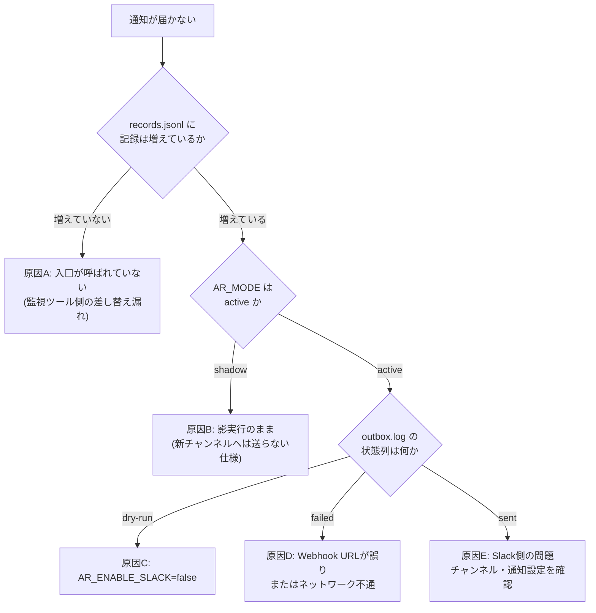

# 06. トラブルシューティング集

> **⚠️ この案件は架空の設定です。** 依頼元・課題・数値はすべて学習用に自分で設定したものであり、実在企業での実務実績ではありません。
> 本書のエラーメッセージ・出力例は、検証環境で実際に事象を再現して取得したものです。

## 最初に確認する3点

どんな不具合でも、まずこの3つを確認する。それだけで原因の半分は分かる。

```bash
# 1. ルール定義が壊れていないか
sudo /opt/alert-router/alert-router.sh --check-rules | tail -2

# 2. 動作モードはどちらか(shadow なら新チャンネルへは送らない)
sudo grep '^AR_MODE=' /opt/alert-router/alert-router.conf

# 3. 直近のログに何が出ているか
sudo tail -20 /var/log/alert-router/alert-router.log
```

```text
ルール定義は正常です(21 件)。未分類の通知は P1 として扱われます。

AR_MODE="${AR_MODE:-active}"

[2026-09-07 10:12:44] [INFO] ルールを 21 件読み込みました: /opt/alert-router/alert-rules.conf
```

---

## Q1. ルール定義ファイルを編集したら、ツールが起動しなくなった

### 症状

```text
[2026-09-07 10:06:01] [ERROR] ルール定義エラー(128行目): 重要度は P1/P2/P3 のいずれかです (id=R099, 値=P4)
[2026-09-07 10:06:01] [ERROR] ルール定義に 1 件の誤りがあります。修正してから再実行してください。
```

### 原因

ルール定義ファイルの書式が正しくない。よくある間違いは次の4つ。

| # | 間違い | 症状 |
|---|---|---|
| 1 | 重要度に `P1` / `P2` / `P3` 以外を書いた | 上記のエラー |
| 2 | 通知先に `critical` / `daily` / `record` 以外を書いた | 「通知先は critical/daily/record のいずれかです」 |
| 3 | 集約ウィンドウに数値以外を書いた(空欄も含む) | 「集約ウィンドウは0以上の整数です」 |
| 4 | **パターンの中に `\|` を書いた** | 列がずれて、別の項目のエラーとして報告される(Q2参照) |

### 対処

エラーメッセージが**行番号・ルールID・実際の値**を教えてくれるので、その行を直す。

```bash
sudo sed -n '128p' /opt/alert-router/alert-rules.conf
```

```text
R099|テスト|P4|critical|0|わざと壊したルール
```

`P4` を `P1`〜`P3` のいずれかに直してから、再度検査する。

```bash
sudo /opt/alert-router/alert-router.sh --check-rules | tail -1
```

```text
ルール定義は正常です(21 件)。未分類の通知は P1 として扱われます。
```

### 予防

**ルールを変更したら、必ず `--check-rules` を実行してから本番に反映する。** このコマンドは通知を一切送らないので、いつ実行しても安全。

💡 **注意**: このエラーが出ている間、`alert-router.sh` は**起動時に停止する**。つまり**通知が1件も処理されなくなる**。ルールファイルの編集は、必ず検査とセットで行うこと。

---

## Q2. パターンに `|`(OR条件)を書いたら、意味不明なエラーになった

### 症状

`\[障害検知\] (web|api)` のように書いたら、次のエラーが出た。

```text
[2026-09-07 05:10:21] [ERROR] ルール定義エラー(1行目): 重要度は P1/P2/P3 のいずれかです (id=R900, 値=api))
[2026-09-07 05:10:21] [ERROR] ルール定義に 1 件の誤りがあります。修正してから再実行してください。
```

### 原因

**`|` は項目の区切り文字として使われている。** パターンの中に `|` を書くと、そこで列が分割されてしまう。

```text
書いた行:  R900|\[障害検知\] (web|api)|P1|critical|0|説明
                              ↑ここで区切られる

解釈された結果:
  ルールID  = R900
  パターン  = \[障害検知\] (web
  重要度    = api)          ← ここでエラー
  通知先    = P1
  ...
```

エラーメッセージの `値=api)` を見れば、「パターンの途中が重要度として読まれている」ことに気づける。

### 対処

方法は2つある。

**(a) ルールを複数行に分ける(推奨)**

```text
R010|\[障害検知\] web|P1|critical|0|本番Webサーバーの死活NG
R011|\[障害検知\] api|P1|critical|0|本番APIサーバーの死活NG
```

**なぜ推奨か**: どちらのルールに一致したかが記録に残るため、「web系が何件、api系が何件」と別々に集計できる。制約が結果的に**運用上のメリット**になっている。

**(b) 文字クラス `[ ]` を使う**

```text
R044|\[容量警告\].*使用率が 8[5-9]%|P2|daily|3600|ディスク使用率85〜89%
```

数字の範囲のように、機械的に表せる条件はこちらが簡潔。

---

## Q3. 通知が1件も届かない

### 切り分けの手順



### 原因A: 入口が呼ばれていない

```bash
sudo wc -l /var/log/alert-router/records.jsonl
# 少し待ってからもう一度
sudo wc -l /var/log/alert-router/records.jsonl
```

数が増えていなければ、監視ツール側が入口を呼んでいない。[04-build-guide.md](./04-build-guide.md) Step 8.2 の差し替えができているか確認する。

```bash
sudo grep -n 'alert-router.sh' /opt/server-health-check/health_check.sh
```

```text
72:    /opt/alert-router/alert-router.sh \
```

### 原因B: 影実行モードのまま

```bash
sudo grep '^AR_MODE=' /opt/alert-router/alert-router.conf
```

```text
AR_MODE="${AR_MODE:-shadow}"
```

**これは仕様どおりの動作である。** 影実行では新チャンネル(`#alert-p1` / `#alert-daily`)へは送らず、従来どおり `#monitoring` へ全件送る。本稼働へ切り替えるには [04-build-guide.md](./04-build-guide.md) Step 11 を実施する。

### 原因C: ドライランのまま

```bash
sudo tail -3 /var/log/alert-router/outbox.log | awk -F'\t' '{print $2, $3}'
```

```text
critical dry-run
```

`dry-run` は「送信せず台帳に書くだけ」の状態。`AR_ENABLE_SLACK` を `true` にする。

```bash
sudo grep '^AR_ENABLE_SLACK=' /opt/alert-router/alert-router.conf
```

```text
AR_ENABLE_SLACK="${AR_ENABLE_SLACK:-false}"
```

### 原因D: 送信に失敗している

```text
[2026-09-07 05:10:53] [ERROR] Slack送信に失敗しました(通知先=critical HTTP=000)
```

```bash
sudo awk -F'\t' '$3=="failed"' /var/log/alert-router/outbox.log | tail -3
```

| HTTPステータス | 意味 | 対処 |
|---|---|---|
| `000` | curl自体が失敗した(名前解決不可・接続不可・タイムアウト) | ネットワーク、プロキシ設定、URLのタイプミスを確認 |
| `404` | Webhook URLが存在しない | URLを再確認。Slack側でWebhookが削除されていないか |
| `403` | Webhookが無効化されている | Slack側でWebhookを再発行する |
| `400` | 送信データが不正 | jqのバージョン、本文に異常な文字が無いか確認 |

💡 **重要**: **送信に失敗しても、記録(`records.jsonl`)には必ず残っている。** 通知が届かなかった期間の内容は、あとから記録で確認できる。

```bash
sudo jq -c 'select(.date == "2026-09-07") | {ts, severity, message}' \
    /var/log/alert-router/records.jsonl | head
```

---

## Q4. 未分類(UNMATCHED)の通知ばかりになる

### 症状

```text
[注意] どのルールにも一致しない通知が 47 件あります(安全側で P1 扱い)。
       本稼働へ切り替える前に alert-rules.conf を整備してください。
```

通知件数が減らず、`#alert-p1` に大量に流れてくる。

### 原因

ルール定義が、実際に流れている通知の文面をカバーできていない。よくある原因は次の3つ。

| # | 原因 | 確認方法 |
|---|---|---|
| 1 | 監視ツールの通知文面が想定と違う | 実際の文面を記録から確認する |
| 2 | 全角・半角、スペースの数が違う | 文面を1文字ずつ比較する |
| 3 | 新しい監視ツールを追加した | 発生元(`source`)別に集計する |

### 対処

まず、未分類になっている通知の実物を見る。

```bash
sudo jq -r 'select(.rule_id == "UNMATCHED") | [.source, .message] | @tsv' \
    /var/log/alert-router/records.jsonl | sort | uniq -c | sort -rn | head -5
```

```text
     32 backup	:white_check_mark: [バックアップ完了] web01-20260901.tar.gz を作成しました(12.4MB)
     19 backup	:warning: [容量警告] バックアップ先(/backup)の使用率が 78% です(閾値: 70%)
```

この文面に合うルールを追加する。

```bash
sudo vi /opt/alert-router/alert-rules.conf
# 追加する行:
# R041|\[バックアップ完了\]|P3|record|3600|バックアップジョブの正常終了(情報通知)
```

追加後、必ず検査する。

```bash
sudo /opt/alert-router/alert-router.sh --check-rules | grep R041
```

```text
R041     P3   record    3600     バックアップジョブの正常終了(情報通知)
```

### 全角・半角の落とし穴

**特に注意すべきは括弧である。**

| 文字 | 見た目 | ERE での書き方 |
|---|---|---|
| 半角括弧 | `(` `)` | `\(` `\)`(エスケープが必要) |
| 全角括弧 | `(` `)` | `(` `)`(そのまま書ける) |
| 半角角括弧 | `[` `]` | `\[` `\]`(エスケープが必要) |

監視ツールの通知には全角括弧が混ざっていることが多い。**目視では区別できない**ので、記録から文面をコピー&ペーストしてパターンを作るのが確実。

💡 **予防**: 「未分類はP1として通知される」のは仕様である。これがあるおかげで、**ルールの整備漏れに必ず気づける**。逆に、未分類をP3にしてしまうと、新しい種類の障害が静かに握りつぶされる。

---

## Q5. まとめ通知(P2)がいつまでも届かない

### 症状

`records.jsonl` には `action: "aggregated"` の記録があるのに、`#alert-daily` にまとめ通知が来ない。

### 原因

**集約は「ためて、あとで出す」仕組みなので、誰かが締めないと出ない。** 締める役は `alert-flush.sh` で、cronから5分ごとに実行される想定になっている。

### 対処

cronの登録を確認する。

```bash
sudo crontab -l | grep alert-flush
```

```text
*/5 * * * * /opt/alert-router/alert-flush.sh >> /var/log/alert-router/cron.log 2>&1
```

何も表示されなければ、cronが登録されていない。[04-build-guide.md](./04-build-guide.md) Step 12 を実施する。

たまっているウィンドウを確認する。

```bash
sudo ls -l /var/lib/alert-router/agg_*.tsv
sudo cat /var/lib/alert-router/agg_R031_app01.tsv
```

```text
-rw-r--r-- 1 root root 142 Sep  7 10:20 /var/lib/alert-router/agg_R031_app01.tsv
1788756661	15	0	P2	daily	R031	app01	:rotating_light: *ログ異常検知* ...
```

| 列 | 意味 |
|---|---|
| 1 | ウィンドウ開始のエポック秒 |
| 2 | たまっている件数 |
| 3 | エスカレーション済みか(0/1) |
| 4〜7 | 重要度 / 通知先 / ルールID / ホスト |
| 8 | 代表メッセージ |

手動で締めてみる。

```bash
sudo /opt/alert-router/alert-flush.sh
```

```text
[2026-09-07 10:25:11] [INFO] ルールを 21 件読み込みました: /opt/alert-router/alert-rules.conf
[2026-09-07 10:25:11] [INFO] まとめ通知を送出: R031/app01 15件 (エスカレーション済み=0)
[2026-09-07 10:25:11] [INFO] 集約ウィンドウの締め処理が完了しました(処理前 1 件 → 処理後 0 件)
```

**「処理前1件 → 処理後1件」で件数が減らない場合**は、まだウィンドウの期間が経過していない。ルールの集約ウィンドウ秒を確認する。

```bash
sudo /opt/alert-router/alert-router.sh --check-rules | grep R031
```

```text
R031     P2   daily     600      アプリログのERROR検知(10分単位でまとめる)
```

600秒(10分)経過するまでは締められない。**これは正常な動作である。**

💡 **ポイント**: まとめ通知の遅延は最大で「集約ウィンドウ + cronの間隔」になる。R031(600秒)なら最大15分。ディスク・証明書系(3600秒)なら最大65分。**この遅延が許容できない通知は、P2ではなくP1にすべき**というのが判断基準になる。

---

## Q6. `declare: -A: invalid option` というエラーが出る

### 症状

```text
/opt/alert-router/common.sh: line 38: declare: -A: invalid option
declare: usage: declare [-afFirtx] [-p] [name[=value] ...]
```

### 原因

**Bash のバージョンが古い。** 連想配列(`declare -A`)は Bash 4.0 以降でしか使えない。

```bash
bash --version | head -1
```

```text
GNU bash, version 3.2.57(1)-release (x86_64-apple-darwin21)
```

よくある環境:

| 環境 | Bash のバージョン | 連想配列 |
|---|---|---|
| Ubuntu 22.04 | 5.1 | ✅ 使える |
| Ubuntu 20.04 | 5.0 | ✅ 使える |
| CentOS 7 | 4.2 | ✅ 使える |
| CentOS 6 | 4.1 | ✅ 使える |
| **macOS 標準** | **3.2** | ❌ 使えない |
| Alpine Linux(ash) | ― | ❌ そもそもbashではない |

### 対処

**(a) 実行するシェルを確認する**

```bash
head -1 /opt/alert-router/common.sh
```

```text
#!/usr/bin/env bash
```

`sh alert-router.sh` のように **`sh` で起動していないか**確認する。Ubuntu では `/bin/sh` は `dash` という別のシェルへのリンクになっており、Bashの機能が使えない。

```bash
# ❌ 動かない
sh /opt/alert-router/alert-router.sh --check-rules
# ✅ 正しい
/opt/alert-router/alert-router.sh --check-rules
bash /opt/alert-router/alert-router.sh --check-rules
```

**(b) macOSで動かす場合**

Homebrewで新しいBashを入れ、そちらで実行する。

```bash
brew install bash
/opt/homebrew/bin/bash /opt/alert-router/alert-router.sh --check-rules
```

💡 **補足**: 本ツールは `local -n`(参照渡し)も使っているため、正確には **Bash 4.3 以降**が必要。Ubuntu 22.04 の 5.1 なら問題ない。

---

## Q7. 集約が効かず、通知が1件ずつ届いてしまう

### 症状

同じ種類のERRORが15件出たのに、まとめ通知にならず15件の記録がすべて `notified` になっている。

### 原因の切り分け

```bash
sudo jq -r 'select(.rule_id == "R031") | [.severity, .action, .agg_key] | @tsv' \
    /var/log/alert-router/records.jsonl | tail -5
```

**(a) 重要度がP1になっている場合**

```text
P1	notified	R030:app01
```

**P1は仕様として集約しない。** 即時対応が必要な通知を、まとめるために遅らせてはいけないため。ルールIDが `R030`(CRITICAL用)になっているなら、通知本文に `CRITICAL` が含まれている。これは正しい動作。

**(b) 集約キーが毎回違う場合**

```text
P2	aggregated	R031:app01
P2	aggregated	R031:app02
P2	aggregated	R031:app03
```

集約キーは `ルールID:ホスト名` である。**ホストが違えば別のウィンドウになる。** 5台のサーバーで同じ障害が起きれば、5件のまとめ通知になる。これは意図した動作(サーバーごとに状況が違う可能性があるため)。

**(c) ウィンドウが 0 になっている場合**

```bash
sudo /opt/alert-router/alert-router.sh --check-rules | grep R031
```

```text
R031     P2   daily     0        アプリログのERROR検知
```

集約ウィンドウが `0` だとまとめられない。適切な秒数(既定600)に直す。

### 対処

意図的に集約を強めたい場合は、集約ウィンドウを延ばす。

```bash
sudo vi /opt/alert-router/alert-rules.conf
# R031|ログ異常検知|P2|daily|600|...
#                            ↓
# R031|ログ異常検知|P2|daily|1800|...
sudo /opt/alert-router/alert-router.sh --check-rules | grep R031
```

```text
R031     P2   daily     1800     アプリログのERROR検知(10分単位でまとめる)
```

💡 **注意**: ウィンドウを延ばすと、まとめ通知の遅延も延びる(1800秒なら最大35分)。**「まとめたい」と「早く知りたい」はトレードオフ**であることを意識して決める。

---

## Q8. 状態ファイルが壊れたようで、動作がおかしい

### 症状

```text
[2026-09-07 05:10:33] [WARN] 集約状態ファイルが不正なため初期化します: /var/lib/alert-router/agg_R031_app01.tsv
```

### 原因

状態ファイルは次のような理由で壊れることがある。

- 書き込み中にサーバーが再起動した
- 手動で編集して書式を崩した
- ディスクが満杯で書き込みが途中で終わった

### 対処

**このメッセージが出ている時点で、ツールは自動的に復旧している。** 壊れたファイルを捨てて作り直すので、対処は不要である。

ただし、**繰り返し出る場合はディスク容量を確認する。**

```bash
df -h /var/lib /var/log
```

```text
Filesystem      Size  Used Avail Use% Mounted on
/dev/sda1        20G   19G  0.5G  98% /
```

容量不足なら、古い記録を退避する。

```bash
sudo gzip /var/log/alert-router/records.jsonl
sudo mv /var/log/alert-router/records.jsonl.gz /backup/
```

### 状態ファイルを全部消したい場合

```bash
# 集約中のウィンドウをすべて破棄する(まとめ通知は送られなくなる)
sudo rm -f /var/lib/alert-router/agg_*.tsv
# 重複排除の履歴をリセットする
sudo rm -f /var/lib/alert-router/dedup_*.txt
# P1発報中フラグをリセットする
sudo rm -f /var/lib/alert-router/p1active_*.txt
```

💡 **安全性について**: 状態ファイルを消しても、**記録(`records.jsonl`)は一切影響を受けない**。状態ファイルは「今まとめている途中の情報」だけを持っており、過去の記録とは完全に分離されている。**迷ったら消してよい。**

---

## Q9. ★重要な通知が届かなかった★ どう調査すればよいか

### これは最優先の障害である

まず**ロールバックしてから**調査する。原因究明より先に、通知が届く状態に戻すこと。

```bash
# 1. 影実行へ戻す(30秒。改善前とまったく同じ通知の流れに戻る)
sudo sed -i 's|^AR_MODE="\${AR_MODE:-active}"|AR_MODE="${AR_MODE:-shadow}"|' \
    /opt/alert-router/alert-router.conf
sudo grep '^AR_MODE=' /opt/alert-router/alert-router.conf
```

```text
AR_MODE="${AR_MODE:-shadow}"
```

詳細は [04-build-guide.md](./04-build-guide.md) Step 13 を参照。

### 調査手順

**ステップ1: その通知が入口に届いていたかを確認する**

```bash
sudo jq -c 'select(.message | contains("web02")) | {ts, rule_id, severity, action}' \
    /var/log/alert-router/records.jsonl
```

```text
{"ts":"2026-09-07 03:14:02","rule_id":"R013","severity":"P3","action":"recorded"}
```

**記録が無い場合**: 入口に届いていない。監視ツール側の問題(Q3の原因A)。

**記録がある場合**: 判定は行われている。次のステップへ。

**ステップ2: どのルールで、なぜその重要度になったかを確認する**

上の例では `R013`(バッチサーバーの死活NG / P3)と判定されている。しかし実際は本番のWebサーバー `web02` だった。

```bash
sudo /opt/alert-router/alert-router.sh --check-rules | grep -E 'R010|R013'
```

```text
R010     P1   critical  0        本番Webサーバーの死活NG
R013     P3   record    3600     バッチサーバーの死活NG(瞬断が多く単発では対応不要)
```

`R010` のパターンは `\[障害検知\] web` である。通知本文を確認する。

```bash
sudo jq -r 'select(.rule_id == "R013") | .message' \
    /var/log/alert-router/records.jsonl | tail -1
```

```text
:red_circle: [障害検知] batch-web02(192.168.1.51)が2回連続でNGです
```

**原因判明**: ホスト名が `batch-web02` になっており、`\[障害検知\] batch` のパターンに先に一致してしまった。ルールは上から順に評価されるため、R013 が R010 より先に勝った。

**ステップ3: ルールを修正する**

```bash
sudo vi /opt/alert-router/alert-rules.conf
# R013 より上に、より具体的なルールを追加する:
# R009|\[障害検知\] batch-web|P1|critical|0|本番Webサーバー(batch-web系)の死活NG
sudo /opt/alert-router/alert-router.sh --check-rules | head -4
```

**ステップ4: 修正が効くことを確認してから、本稼働へ戻す**

```bash
sudo AR_MODE=active AR_ENABLE_SLACK=false /opt/alert-router/alert-router.sh \
    --source health-check --host batch-web02 \
    --message ":red_circle: [障害検知] batch-web02(192.168.1.51)が2回連続でNGです"
sudo jq -c 'select(.host == "batch-web02") | {rule_id, severity}' \
    /var/log/alert-router/records.jsonl | tail -1
```

```text
{"rule_id":"R009","severity":"P1"}
```

### 再発防止

| # | 対策 |
|---|---|
| 1 | **ホスト命名規則をルールの前提にしない。** 例外的な名前が必ず出てくる |
| 2 | 本番サーバーを明示的に列挙するルールを、非本番のルールより**上に**置く |
| 3 | 月次レビュー([05-effect-measurement.md](./05-effect-measurement.md) 6.2)で、P3の中身を必ず目視する |
| 4 | 新しいサーバーを追加したら、**必ず `--check-rules` と1件流し込みのテストを行う** |

💡 **この事例が示すこと**: 「ルールは上から順に評価され、最初に一致したものが勝つ」という仕様は、**便利であると同時に危険でもある**。順序が意図と違うだけで重要度が変わる。**ルールを追加するときは、必ず既存ルールとの順序を確認する。**

---

## Q10. cronからは動かないが、手動では動く

### 症状

手動実行では正常なのに、cronで実行されると動かない、または通知が来ない。

```bash
sudo tail -20 /var/log/alert-router/cron.log
```

```text
/opt/alert-router/alert-flush.sh: line 26: jq: command not found
```

### 原因

**cronは、ログイン時とは違う環境変数で動く。** 特に `PATH` が最小限(`/usr/bin:/bin`)になっているため、`/usr/local/bin` などにインストールしたコマンドが見つからない。

```bash
# 手動実行時のPATH
echo "$PATH"
```

```text
/usr/local/sbin:/usr/local/bin:/usr/sbin:/usr/bin:/sbin:/bin
```

```bash
# cronでのPATHを確認する(一時的にcronで実行してみる)
sudo crontab -l | head -3
```

### 対処

**(a) crontabの先頭でPATHを指定する**

```cron
PATH=/usr/local/sbin:/usr/local/bin:/usr/sbin:/usr/bin:/sbin:/bin

*/5 * * * * /opt/alert-router/alert-flush.sh >> /var/log/alert-router/cron.log 2>&1
0 9 * * * /opt/alert-router/daily-summary.sh >> /var/log/alert-router/cron.log 2>&1
```

**(b) 相対パスを使っていないか確認する**

本ツールは、設定ファイルを次のように**絶対パスで解決**している。

```bash
AR_SCRIPT_DIR="$(cd "$(dirname "${BASH_SOURCE[0]}")" && pwd)"
```

**なぜこう書くか**: cronから実行されると、作業ディレクトリが `/root` や `/` になる。`./alert-router.conf` のような相対パスで設定を探すと、「手元では動くのにcronでは動かない」という典型的な障害になる。

**(c) cron.log を必ず取る**

```cron
*/5 * * * * /opt/alert-router/alert-flush.sh >> /var/log/alert-router/cron.log 2>&1
```

`2>&1` は「標準エラー出力を標準出力と同じ場所へ送る」という意味。これが無いと、エラーメッセージがどこにも残らず、原因が分からなくなる。

💡 **ポイント**: cron絡みの障害は「ログを取っていないこと」が原因で長引く。**cronに登録するときは、必ずログのリダイレクトをセットで書く**習慣をつける。

---

## Q11. 日次サマリが届かない

### 症状

毎朝9時になっても `#alert-daily` にサマリが来ない。

### 原因と対処

**(a) 記録ファイルが無い**

```text
[2026-09-07 05:10:21] [ERROR] 記録ファイルが見つかりません: /var/log/alert-router/records.jsonl
```

入口が一度も動いていない。Q3の原因Aを確認する。

**(b) 対象日の記録が0件**

```text
[2026-09-07 05:10:21] [WARN] 2026-09-01 の記録が1件もありません。サマリは生成しません。
```

**これは正常な動作である。** 引数なしで実行すると「昨日」が対象になるので、昨日の通知が0件ならサマリは作られない。日付を指定して確認する。

```bash
sudo jq -r '.date' /var/log/alert-router/records.jsonl | sort | uniq -c
```

```text
    200 2026-09-01
     15 2026-09-06
```

```bash
sudo /opt/alert-router/daily-summary.sh --date 2026-09-01
```

**(c) cronに登録されていない**

```bash
sudo crontab -l | grep daily-summary
```

何も出なければ [04-build-guide.md](./04-build-guide.md) Step 12 を実施する。

### 日次サマリが届かないこと自体が重要なサイン

💡 **設計上のポイント**: 日次サマリは**1日1回必ず届くもの**なので、これが届かないことは「通知の入口かcronが壊れている」というサインになる。

**「毎日必ず届くもの」を1つ作っておくと、仕組み全体の死活監視になる。** 監視の仕組みを作るときは、その仕組み自身が生きていることをどう確認するかも設計に入れておく。

---

## Q12. 記録ファイルが大きくなりすぎた

### 症状

```bash
sudo ls -lh /var/log/alert-router/records.jsonl
```

```text
-rw-r----- 1 root root 78M Sep  7 10:00 /var/log/alert-router/records.jsonl
```

### 見積もり

| 項目 | 値 |
|---|---|
| 1件あたりのサイズ | 約400バイト |
| 1日 | 200件 × 400B = 約80KB |
| 1年 | 約30MB |

78MBは約2.5年分に相当する。放置しても致命的ではないが、`jq` での集計が遅くなる。

### 対処: logrotate に登録する

```bash
sudo tee /etc/logrotate.d/alert-router > /dev/null <<'EOF'
/var/log/alert-router/records.jsonl
/var/log/alert-router/outbox.log
/var/log/alert-router/alert-router.log
/var/log/alert-router/cron.log
{
    monthly
    rotate 12
    compress
    delaycompress
    missingok
    notifempty
    create 0640 root root
}
EOF

sudo logrotate -d /etc/logrotate.d/alert-router 2>&1 | head -5
```

```text
reading config file /etc/logrotate.d/alert-router
Handling 1 logs
rotating pattern: /var/log/alert-router/records.jsonl ... monthly (12 rotations)
```

| 設定 | 意味 |
|---|---|
| `monthly` | 月に1回ローテートする |
| `rotate 12` | 12世代(=1年分)を保持する |
| `compress` | 古いものはgzipで圧縮する |
| `delaycompress` | 1世代前は圧縮しない(直前のファイルをすぐ読めるようにするため) |
| `missingok` | ファイルが無くてもエラーにしない |
| `create 0640 root root` | ローテート後に新しいファイルを作るときの権限 |

💡 **注意**: `-d` は**ドライラン**(実際にはローテートせず、何をするかだけ表示する)。設定を書いたら、まず `-d` で確認してから本番反映するのが安全。

**記録は改善の根拠そのもの**なので、安易に短い期間で消さないこと。12か月分(約30MB)は残しておく設定にしている。

---

## 関連ドキュメント

- [README.md](./README.md) — 案件概要
- [01-current-analysis.md](./01-current-analysis.md) — 現状分析書
- [02-improvement-proposal.md](./02-improvement-proposal.md) — 改善提案書
- [03-design.md](./03-design.md) — 改善設計書(ルール仕様・設定項目一覧)
- [04-build-guide.md](./04-build-guide.md) — 実装・移行手順書(ロールバック手順)
- [05-effect-measurement.md](./05-effect-measurement.md) — 効果測定レポート(月次レビュー手順)
