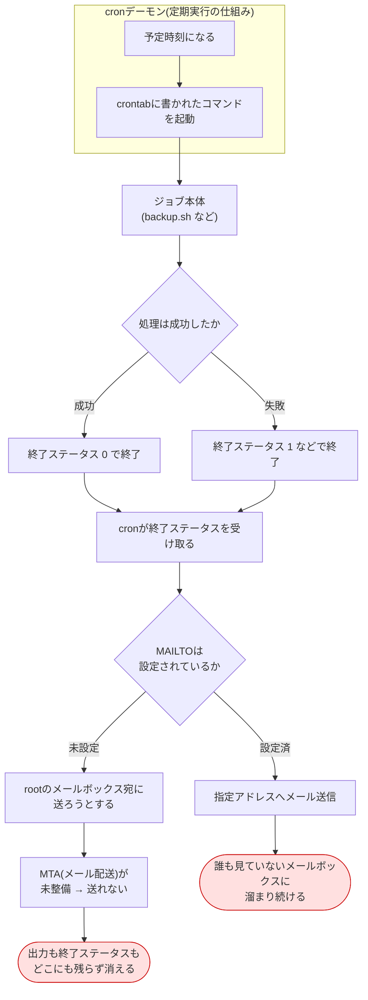
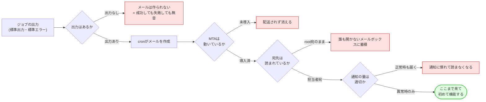
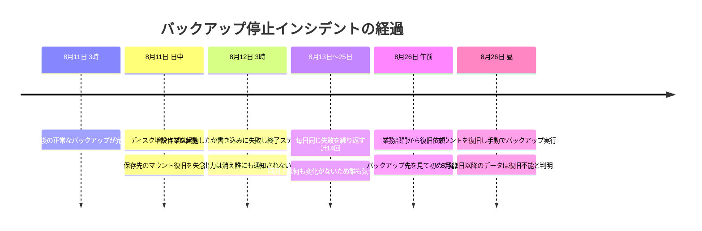

# 現状分析書(As-Is) — cronのサイレント障害

改善案件No.4「cronのサイレント障害を実行結果の可視化と失敗検知で撲滅」の現状分析書。**改善案を考える前に、いま何が起きているのかを事実として整理する**ためのドキュメントである。

> **この案件は架空の設定です。**
> 依頼元「株式会社サンプル商事」は架空の会社であり、本書に記載するインシデントやログの内容は、実在企業での実務記録ではなく、運用現場でよくある事象をもとに自分で組み立てたシナリオである。手順・スクリプト・コマンドの動作は、Ubuntu 24.04.4 LTS の検証環境で実際に確認している。

## 目次

1. [調査の目的と進め方](#1-調査の目的と進め方)
2. [現行のcron実行の流れ](#2-現行のcron実行の流れ)
3. [cronジョブの棚卸し(8本)](#3-cronジョブの棚卸し8本)
4. [サイレント障害が起きるメカニズム](#4-サイレント障害が起きるメカニズム)
5. [インシデント記録](#5-インシデント記録)
6. [現状をどう把握したか](#6-現状をどう把握したか)
7. [課題の整理(As-Isサマリ)](#7-課題の整理as-isサマリ)

## 1. 調査の目的と進め方

### 1.1 なぜ現状分析から始めるのか

改善案件では、**いきなり「こうすれば良くなります」と提案してはいけない**。理由は3つある。

| 理由 | 説明 |
|---|---|
| 本当の課題を外すため | 「失敗を通知したい」という要望の裏に「そもそも動いていないことに気づけない」という、より深刻な問題が隠れていることがある |
| 効果を測れなくなるため | 改善前の数値(Before)を取っていないと、改善後に「良くなった」と言えても「どれだけ良くなった」と言えない |
| 優先順位を決められないため | 8本のジョブのうち、止まって困る度合いはそれぞれ違う。全部を同じ重さで扱うと、限られた工数を使い切ってしまう |

### 1.2 調査した内容

| No. | 調査項目 | 手段 |
|---|---|---|
| 1 | 現在登録されているcronジョブの一覧 | `crontab -l`、`/etc/cron.d/`、`/etc/cron.{daily,hourly,weekly}` の確認 |
| 2 | 各ジョブの出力がどこへ行っているか | crontabのリダイレクト記述の確認 |
| 3 | cronがジョブを起動した記録 | `/var/log/syslog` の `CRON` 行 |
| 4 | 失敗した実績と、気づくまでにかかった時間 | 各ジョブのログファイルと、担当者の作業記録 |
| 5 | メール通知の状態 | `MAILTO` の設定有無、`/var/mail/root` の中身、MTAの稼働状況 |

## 2. 現行のcron実行の流れ

### 2.1 何が起きているか



用語の補足:

- **cronデーモン** = 決まった時刻・間隔でコマンドを自動実行する常駐プログラム。Linuxの標準機能。
- **終了ステータス**(exit status / 戻り値)= コマンドが終了するときに返す0〜255の数値。**0が成功、0以外が失敗**という約束になっている。
- **MTA**(Mail Transfer Agent)= メールを実際に配送するソフトウェア(Postfixなど)。cronはメールを「書く」だけで、「配る」のはMTAの仕事。MTAが無ければメールは配送されない。

### 2.2 図から読み取れる問題

上の図で赤くなっている2つの終点が、この案件の出発点である。

| 終点 | 何が問題か |
|---|---|
| 出力も終了ステータスも消える | ジョブが「動いたのか」「成功したのか」を**後から確認する手段が一切ない**。障害調査のときに手がかりがゼロになる |
| 誰も見ていないメールボックスに溜まる | 通知は存在するが、**人間の運用に接続されていない**。「通知しているのに気づかない」のは、通知していないのと同じ |

さらに、この図には**もっと重大な欠落**がある。「予定時刻になる」の部分が何らかの理由で発生しなかった場合(cronサービスが停止した、crontabの行が消えた、サーバーの時刻がずれた)、**この図の中の処理は1つも走らない**。つまりどのルートを通っても通知は発生しない。この「起動しなかった場合の経路が図に存在しない」ことこそが、[4.3](#43-未実行はなぜ原理的に検知できないのか) で扱う本質的な課題である。

## 3. cronジョブの棚卸し(8本)

### 3.1 棚卸し表

`crontab -l` の結果と、各スクリプトの内容を突き合わせて作成した一覧。**この表を作ること自体が改善の第一歩**である(改善前は、この一覧がどこにも存在しなかった)。

| No. | ジョブ | スケジュール | 内容 | 失敗・未実行時に何が起きるか | 重要度 |
|---|---|---|---|---|---|
| 1 | 日次バックアップ<br/>([projects/02](../../projects/02-backup-automation/README.md)) | 毎日 03:00 | `/var/www/html` を tar.gz で保存し、7日より古い世代を削除 | **復旧できないデータが増え続ける**。失敗に気づかないまま日数が経つほど、戻せる時点が古くなる | ★★★ |
| 2 | サーバー死活監視<br/>([projects/04](../../projects/04-server-health-check/README.md)) | 5分ごと | 対象サーバーへの ping / HTTP 監視、異常時Slack通知 | **監視が止まっていること自体に気づけない**。サーバーが落ちても通知が来ない状態になる | ★★★ |
| 3 | 基幹DBの論理バックアップ | 毎日 01:30 | `mysqldump` の結果を gzip 圧縮して保存 | 業務データを戻せない。No.1より影響が大きい | ★★★ |
| 4 | 人事CSVからのアカウント同期<br/>([projects/01](../../projects/01-user-account-automation/README.md)) | 毎時 15分 | 人事システムが出力したCSVからユーザーを追加・無効化 | 入社者がログインできない / **退職者のアカウントが残り続ける**(セキュリティリスク) | ★★☆ |
| 5 | アプリログのローテート | 毎日 04:10 | アプリケーションログを世代管理・圧縮 | ログが肥大化し、最終的に**ディスクフルでサーバー全体が停止**する | ★★☆ |
| 6 | 一時ディレクトリの掃除 | 毎日 05:00 | 作業用ディレクトリの古いファイルを削除 | 同上(ディスク圧迫)。ただし進行は緩やか | ★☆☆ |
| 7 | SSL証明書の期限チェック | 毎週月曜 06:00 | 証明書の残日数を確認し、30日を切ったら通知 | **証明書が切れてサイトが見られなくなる**。気づくのは顧客からの連絡 | ★★☆ |
| 8 | 売上CSVの基幹連携 | 平日 07:30 | 売上データをCSVで出力し、基幹システムへ転送 | 基幹側のデータが欠ける。**業務部門から「数字が合わない」と連絡が来て初めて分かる** | ★★★ |

### 3.2 棚卸しから分かったこと

| 発見 | 内容 |
|---|---|
| 全部で8本あった | 担当者の記憶では「5本くらい」だった。`/etc/cron.d/` に置かれていた2本は完全に忘れられていた |
| 出力の扱いがバラバラ | 3本は `>> ログ 2>&1` でファイルに出していたが、5本は何も書いておらず出力が消えていた |
| 「失敗の影響が出るまでの時間」に差がある | 死活監視(No.2)は止まった瞬間から実質的な被害が出るが、ディスク掃除(No.6)は数か月かけて悪化する。**同じ「失敗」でも緊急度が違う** |
| どれも「気づけるのは人からの指摘」 | 8本すべてにおいて、失敗の発見経路が「業務部門・顧客からの問い合わせ」だった |

**ポイント**: 棚卸し表の「失敗時に何が起きるか」の列は、改善の優先順位を決めるためだけでなく、**依頼元に危機感を持ってもらうための材料**にもなる。「バックアップが失敗しています」より「バックアップが失敗すると、最悪◯日分のデータが戻せません」のほうが伝わる。

## 4. サイレント障害が起きるメカニズム

### 4.1 サイレント障害とは

**サイレント障害**(silent failure)= 障害が発生しているのに、誰にも知らされないまま静かに継続している状態。

| 障害の種類 | 気づき方 | 発見までの時間 |
|---|---|---|
| 分かりやすい障害 | Webサイトが開かない、業務システムが応答しない | 数分〜数十分(利用者がすぐ気づく) |
| **サイレント障害** | 表面上は何も変わらない。必要になった瞬間に初めて発覚する | 数日〜数か月 |

cronの定期処理は、**成功しても失敗しても画面上は何も変わらない**ため、サイレント障害の典型的な発生源になる。とくにバックアップは「使うときになって初めて壊れていたことが分かる」性質を持ち、被害が最大化しやすい。

### 4.2 なぜcronのMAILTOは実務で機能しないのか

cronには標準の通知手段として `MAILTO` がある。「これを設定すればいいのでは」と考えるのが自然だが、実務ではほとんど機能しない。理由を分解する。



MAILTOが機能するには、上の分岐を**すべて正しく通過する必要がある**。実際の現場で崩れやすいのは次の点である。

| 崩れる箇所 | 具体例 |
|---|---|
| 出力の有無で通知が決まる | cronは「**出力があったとき**にメールを送る」仕様であり、終了ステータスは見ていない。つまり**何も出力せずに `exit 1` で失敗したジョブは通知されない**。逆に、正常時に進捗を `echo` するジョブは毎回メールが飛ぶ |
| MTAが無い | 最小構成のUbuntuサーバーにはMTAが入っていないことが多い。この場合メールは作られても配送されない |
| 宛先がrootのまま | `MAILTO` 未設定時の宛先はcrontabの所有者(通常root)。root宛のメールを日常的に読む運用は、実際にはほとんど行われていない |
| 通知が多すぎる | 正常時にも届くと、人は必ず読まなくなる(オオカミ少年状態) |
| 迷惑メール判定 | サーバーから直接送るメールは、外部メールサービスで迷惑メール扱いされやすい |

**結論**: MAILTOは「仕組みとしては存在するが、**終了ステータスではなく出力の有無で発火する**うえ、配送経路と読む習慣まで含めて整備しないと機能しない」。今回の依頼元では、そのどれも整っていなかった。

### 4.3 未実行はなぜ原理的に検知できないのか

サイレント障害には2種類ある。この違いを理解することが、本案件の設計の核心である。

| 種類 | 状態 | ジョブ自身に通知処理を足せば検知できるか |
|---|---|---|
| **失敗** | ジョブは起動した。しかし処理が失敗した | **できる**。ジョブの中で失敗を検知して通知すればよい |
| **未実行** | ジョブがそもそも起動しなかった | **できない**。起動していないコードは実行されない |


未実行が起きる原因は、ジョブ自身とは無関係な場所にある。

| 原因 | 具体例 |
|---|---|
| cronサービスの停止 | サーバー再起動後にcronが自動起動していない、誰かが `systemctl stop cron` した |
| crontabの消失・破損 | `crontab -r`(全削除)の誤操作、`crontab -e` の保存ミス、ユーザーアカウントの削除 |
| 時刻のずれ | NTP(時刻同期)が止まりサーバー時刻が大きくずれる、タイムゾーン設定の変更 |
| 実行ユーザーの権限変更 | 実行ユーザーのシェルが `/sbin/nologin` に変更された、アカウントがロックされた |
| ディスクフル | ログが書けずにジョブが起動直後に落ちる(この場合は「起動はしている」) |

**したがって、未実行を検知するには、ジョブの外側に「起きるはずのことが起きたか」を見張る仕組みが必要になる**。これが改善設計で採用する**デッドマン監視**である(詳細は [03-design.md](./03-design.md))。

### 4.4 多重起動はなぜ危険か

もう一つの現状課題が多重起動である。

**多重起動** = 前回の実行がまだ終わっていないのに、次回の予定時刻が来て2つ目のプロセスが起動してしまう状態。cronは「前回が終わったか」を確認しないため、間隔より処理が長引くと必ず発生する。

```mermaid
gantt
    title 5分間隔のジョブが1回6分かかるようになった場合
    dateFormat HH:mm
    axisFormat %H:%M
    section 1回目
    実行中 6分 :a1, 10:00, 6m
    section 2回目
    重なって起動 :crit, a2, 10:05, 6m
    section 3回目
    さらに重なる :crit, a3, 10:10, 6m
```



多重起動が引き起こす問題は次のとおり。

| 問題 | 具体例 |
|---|---|
| ファイルの破損 | 2つのプロセスが同じ状態ファイルに同時に書き込み、行が混ざって壊れる |
| 二重処理 | 同じデータを2回転送する、同じメールを2回送る |
| 負荷の雪だるま | 終わらないジョブが積み上がり、CPU・メモリ・DB接続数を食いつぶす。最終的にサーバー全体が応答しなくなる |
| 調査の困難化 | ログが2つのプロセス分だけ入り混じり、時系列が読めなくなる |

## 5. インシデント記録

### 5.1 インシデントA: バックアップが2週間止まっていた

改善に着手する直接のきっかけとなった事象。

| 項目 | 内容 |
|---|---|
| 対象ジョブ | 日次バックアップ(棚卸し表 No.1) |
| 停止期間 | 8月12日〜8月26日(14日間) |
| 発覚経路 | 業務部門からの「先週消してしまったファイルを戻したい」という問い合わせ |
| 直接原因 | ディスク増設作業の際、バックアップ保存先のマウントが復旧しておらず、書き込みに失敗し続けていた |
| 被害 | 8月11日時点のバックアップまでしか存在せず、**依頼されたファイルは復旧できなかった** |

タイムライン:



**この事象の本質**: ジョブは毎日きちんと起動していた。失敗もしていた。**失敗の事実がどこにも記録されず、誰にも届かなかった**だけである。技術的には難しい障害ではなく、「気づける仕組みが無かった」ことが唯一の原因だった。

### 5.2 インシデントB: 死活監視の多重起動

| 項目 | 内容 |
|---|---|
| 対象ジョブ | サーバー死活監視(棚卸し表 No.2、5分間隔) |
| 発生日 | 7月3日 |
| 経緯 | 監視対象の1台がネットワーク障害で無応答になり、`ping` のタイムアウト待ちで1回の実行が6分以上かかるようになった |
| 起きたこと | 5分間隔なので、前回が終わらないうちに次が起動。ピーク時には**7プロセスが並走**し、ロードアベレージが上昇 |
| 二次被害 | 複数プロセスが同時に状態ファイル(`state.csv`)へ書き込み、**連続失敗回数の記録が壊れた**。その結果、本来通知されるべき異常が通知されなくなった |
| 対処 | 手動でプロセスを停止し、状態ファイルを削除して初期化した |

**この事象の本質**: 監視ツール自身が、監視できない状態に陥っていた。しかも**その事実を検知する仕組みも無かった**。

## 6. 現状をどう把握したか

「気づくまでに平均18時間」という改善前の数値は、次の手順で算出した。**改善提案で効果を語るには、改善前の数値が必要**である。

### 6.1 手順1: cronが起動した記録を集める

cronはジョブを起動するたびにsyslogへ記録を残す。**ジョブが成功したかは分からないが、起動したかどうかは分かる**。

```bash
sudo grep CRON /var/log/syslog | head -5
```

出力イメージ:

```text
2026-08-12T03:00:01.412345+09:00 ops01 CRON[12345]: (root) CMD (/opt/backup-automation/backup.sh >> /var/log/backup-automation/cron.log 2>&1)
2026-08-12T03:05:01.520120+09:00 ops01 CRON[12388]: (root) CMD (/opt/server-health-check/health_check.sh >> /var/log/server-health-check/cron.log 2>&1)
2026-08-12T03:10:01.633981+09:00 ops01 CRON[12402]: (root) CMD (/opt/server-health-check/health_check.sh >> /var/log/server-health-check/cron.log 2>&1)
2026-08-12T03:15:01.744052+09:00 ops01 CRON[12455]: (root) CMD (/opt/server-health-check/health_check.sh >> /var/log/server-health-check/cron.log 2>&1)
2026-08-12T03:20:01.855410+09:00 ops01 CRON[12490]: (root) CMD (/opt/server-health-check/health_check.sh >> /var/log/server-health-check/cron.log 2>&1)
```

**なぜこれを見るのか**: 「起動した記録はあるのに、ジョブのログには成功の記録が無い」という食い違いを見つけるため。この差分が、まさにサイレント障害が起きている箇所になる。

**ここで判明した限界**:

| 限界 | 内容 |
|---|---|
| 成否が分からない | syslogに残るのは「起動した」ことだけ。終了ステータスも所要時間も記録されない |
| 保存期間が短い | syslogは既定で数週間でローテートされ、それ以前の記録は失われる |
| 探しにくい | 他のログと混在しているため、ジョブ単位の集計が難しい |

### 6.2 手順2: ジョブ側のログから失敗時刻を拾う

出力をファイルに残していた3本については、失敗の時刻が特定できた。

```bash
grep -n "ERROR" /var/log/backup-automation/backup.log | head -3
```

出力イメージ:

```text
142:2026-08-12 03:00:02 [ERROR] バックアップ先ディレクトリに書き込めません: /var/backups/html-backup
158:2026-08-13 03:00:02 [ERROR] バックアップ先ディレクトリに書き込めません: /var/backups/html-backup
174:2026-08-14 03:00:02 [ERROR] バックアップ先ディレクトリに書き込めません: /var/backups/html-backup
```

**なぜこれを見るのか**: 「いつから失敗が始まったか」を確定するため。この時刻が、後述の「気づくまでの時間」の起点になる。

### 6.3 手順3: 気づいた時刻と突き合わせる

担当者の作業記録(問い合わせ対応の記録)から「発覚した時刻」を拾い、手順2の「失敗が始まった時刻」との差を計算した。

| 事例 | 失敗開始 | 発覚 | 気づくまでの時間 |
|---|---|---|---|
| ログローテート失敗(6月) | 6/14 04:10 | 6/14 17:20 | 13.2時間 |
| 売上CSV連携失敗(6月) | 6/25 07:30 | 6/26 09:10 | 25.7時間 |
| アカウント同期失敗(7月) | 7/8 10:15 | 7/8 18:40 | 8.4時間 |
| DBダンプ失敗(7月) | 7/20 01:30 | 7/21 09:00 | 31.5時間 |
| ログローテート失敗(8月) | 8/3 04:10 | 8/3 15:30 | 11.3時間 |
| **平均** | | | **18.0時間** |

**この数値の扱い方(重要)**:

| 注意点 | 内容 |
|---|---|
| 母数は「気づけた事例」だけ | 上の5件は、いずれ誰かが気づいた事例である。**インシデントA(14日間気づかなかった)は含めていない**。含めれば平均は跳ね上がる |
| つまり実態はもっと悪い | 「平均18時間」は改善前の状況を**控えめに**見積もった数値である。改善提案では、この前提を明示したうえで使う |
| 発覚時刻の精度 | 作業記録の粒度が「時」単位のため、分単位の精度は無い |

**ポイント**: 数字を作るときは「どう算出したか」「何を含めなかったか」を必ずセットで残す。都合のいい数字だけを出すと、後で必ず信用を失う。逆に前提を明示した数字は、多少粗くても議論の土台として使える。

### 6.4 手順4: メール通知の状態を確認する

```bash
crontab -l | grep -i MAILTO || echo "MAILTOの設定なし"
```

出力:

```text
MAILTOの設定なし
```

```bash
ls -l /var/mail/ 2>/dev/null || echo "メールボックスなし"
command -v sendmail postfix exim4 || echo "MTAが導入されていない"
```

出力イメージ:

```text
メールボックスなし
MTAが導入されていない
```

**なぜこれを確認するのか**: 「MAILTOを設定すれば済む話ではないか」という当然の疑問に、事実で答えられるようにするため。**MTAが無い以上、MAILTOを設定してもメールは1通も届かない**ことが確認できた。

## 7. 課題の整理(As-Isサマリ)

### 7.1 課題一覧

| No. | 課題 | 根拠(本書の該当箇所) | 影響度 |
|---|---|---|---|
| C1 | ジョブの実行結果が記録されていない | [2.1](#21-何が起きているか)、[6.1](#61-手順1-cronが起動した記録を集める) | 高 |
| C2 | 失敗を検知・通知する仕組みが無い | [4.2](#42-なぜcronのmailtoは実務で機能しないのか)、[5.1](#51-インシデントa-バックアップが2週間止まっていた) | 高 |
| C3 | 未実行を検知する手段が原理的に存在しない | [4.3](#43-未実行はなぜ原理的に検知できないのか) | 高 |
| C4 | 多重起動を防ぐ仕組みが無い | [4.4](#44-多重起動はなぜ危険か)、[5.2](#52-インシデントb-死活監視の多重起動) | 中 |
| C5 | ジョブの台帳が無く、全体像を誰も把握していない | [3.2](#32-棚卸しから分かったこと) | 中 |
| C6 | 出力の扱いがジョブごとにバラバラで、調査手順が統一できない | [3.2](#32-棚卸しから分かったこと) | 中 |

### 7.2 数値で見たAs-Is

| 指標 | 改善前の値 | 測定方法 |
|---|---|---|
| 失敗に気づくまでの時間 | 平均18.0時間(気づけた5件の平均) | [6.3](#63-手順3-気づいた時刻と突き合わせる) |
| 気づけなかった最長期間 | 14日間 | [5.1](#51-インシデントa-バックアップが2週間止まっていた) |
| 未実行の検知手段 | 無し(0%検知) | [4.3](#43-未実行はなぜ原理的に検知できないのか) |
| 多重起動の防止 | 無し(発生実績あり) | [5.2](#52-インシデントb-死活監視の多重起動) |
| 実行記録が残っているジョブ | 8本中3本(37.5%)、それも形式がバラバラ | [3.2](#32-棚卸しから分かったこと) |
| 台帳に載っているジョブ | 0本 | [3.2](#32-棚卸しから分かったこと) |

### 7.3 次のステップ

課題C1〜C6に対して、どのような打ち手が考えられるか、複数の案を比較して選定する。→ [02-improvement-proposal.md](./02-improvement-proposal.md)

## 関連ドキュメント

- [README.md](./README.md) — 案件概要
- [02-improvement-proposal.md](./02-improvement-proposal.md) — 改善提案書(次に読む)
- [03-design.md](./03-design.md) — 改善設計書
- [projects/02-backup-automation](../../projects/02-backup-automation/README.md) — 棚卸し表No.1の対象
- [projects/04-server-health-check](../../projects/04-server-health-check/README.md) — 棚卸し表No.2の対象
