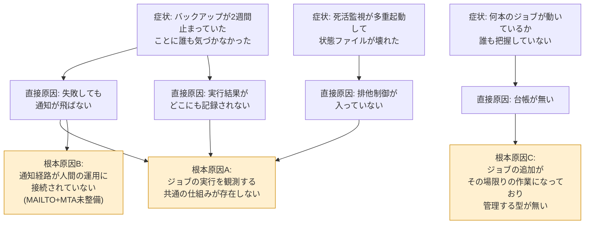
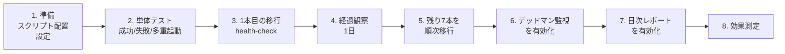

# 改善提案書 — cronのサイレント障害を実行結果の可視化と失敗検知で撲滅

[01-current-analysis.md](./01-current-analysis.md) で洗い出した課題に対し、複数の改善案を比較・評価して方針を決定するためのドキュメント。

> **この案件は架空の設定です。** 依頼元「株式会社サンプル商事」は架空の会社であり、本書の提案・見積もりは学習用に自分で組み立てたものである。

## 目次

1. [課題の構造化](#1-課題の構造化)
2. [改善の目標(ゴール設定)](#2-改善の目標ゴール設定)
3. [改善案の比較](#3-改善案の比較)
4. [選定した案と選定理由](#4-選定した案と選定理由)
5. [期待効果](#5-期待効果)
6. [リスクと対策](#6-リスクと対策)
7. [スコープ外にしたこと](#7-スコープ外にしたこと)
8. [実施計画](#8-実施計画)

## 1. 課題の構造化

### 1.1 症状から原因へ

現状分析で見つかった課題(C1〜C6)を「症状」「直接原因」「根本原因」に分けて整理する。**症状に対処するのではなく、根本原因に対処する**ための整理である。

### 1.2 根本原因の整理

| 記号 | 根本原因 | 対応する課題 | 打ち手の方向性 |
|---|---|---|---|
| A | ジョブの実行を観測する共通の仕組みが無い | C1・C2・C4・C6 | すべてのジョブが通る「共通の入口」を作り、そこで記録・通知・排他制御をまとめて行う |
| B | 通知が人間の運用に接続されていない | C2 | 担当者が日常的に見ている場所(Slack)へ、異常時のみ通知する |
| C | ジョブを管理する型が無い | C3・C5 | ジョブ台帳を作り、「何が・どの間隔で動くはずか」を定義する。これが未実行検知の基準にもなる |

**重要な気づき**: 根本原因Cの「台帳を作る」は、単なる資料整備ではない。**「動くはずの間隔」を定義しなければ、未実行(課題C3)は検知しようがない**。台帳は未実行検知の前提条件そのものである。

## 2. 改善の目標(ゴール設定)

改善案を比較する前に、「何をもって成功とするか」を先に決める。これを決めずに案を比べると、機能の多さだけで判断してしまう。

| No. | 目標 | 目標値 | 測定方法 |
|---|---|---|---|
| G1 | 失敗に気づくまでの時間を短縮する | 平均18時間 → **5分以内** | わざと失敗するジョブを実行し、通知までの時間を測る |
| G2 | 未実行を検知できるようにする | 不可能 → **予定時刻+猶予時間の超過で検知** | わざとジョブを実行させず、通知が出るか確認する |
| G3 | 多重起動を防止する | 発生あり → **0件** | わざと実行間隔より長いジョブを走らせ、後発がスキップされるか確認する |
| G4 | ジョブの全体像を可視化する | 台帳なし → **8本を一覧で管理** | 台帳ファイルと日次レポートの存在・内容を確認する |
| G5 | 既存ジョブへの影響を出さない | — | 既存スクリプトの改修行数 **0行**、移行中の実行停止 **0回** |

## 3. 改善案の比較

### 3.1 検討した4つの案

| 案 | 概要 |
|---|---|
| **案A** | cronの `MAILTO` を設定し、MTA(Postfix)を導入してメール通知を有効にする |
| **案B** | 8本のジョブスクリプトそれぞれに、通知処理とロック処理を書き足す |
| **案C** | 共通ラッパースクリプト(`run_job.sh`)を作り、全ジョブをその経由で起動する |
| **案D** | ジョブ管理ツール・監視SaaS(Rundeck、Healthchecks.io、JP1等)を導入する |

### 3.2 評価軸

| 軸 | なぜこの軸で見るか |
|---|---|
| 失敗の検知(G1) | 依頼の中心。取りこぼしがないか |
| 未実行の検知(G2) | 最も重要かつ、案によっては原理的に実現できない |
| 多重起動の防止(G3) | インシデントB の再発防止 |
| 可視化(G4) | 台帳・レポートとして残るか |
| 既存への影響(G5) | 既存スクリプトを何行変更するか。壊すリスクの大きさ |
| 初期コスト | 導入にかかる工数・費用 |
| 運用コスト | 導入後の維持にかかる手間・費用 |
| 拡張性 | ジョブが9本目、10本目と増えたときの追加作業量 |
| 学習コスト | 担当者1名体制で、引き継ぎ・維持ができるか |

### 3.3 比較表

評価は ◎(十分に満たす) / ○(満たす) / △(部分的) / ×(満たせない)。

| 評価軸 | 案A: MAILTO+MTA | 案B: 各スクリプトに追加 | 案C: 共通ラッパー | 案D: ツール導入 |
|---|---|---|---|---|
| 失敗の検知(G1) | △ 出力の有無で発火するため取りこぼす | ○ 実装すれば可能 | ◎ 終了ステータスで確実に判定 | ◎ |
| 未実行の検知(G2) | **× 原理的に不可能** | **× 原理的に不可能** | ◎ デッドマン監視を併設できる | ◎ 標準機能で対応 |
| 多重起動の防止(G3) | × 機能が無い | ○ 各所に `flock` を実装すれば可能 | ◎ ラッパー1か所で全ジョブに適用 | ◎ |
| 可視化(G4) | × メールが流れるだけ | △ ログはできるが形式がバラバラ | ◎ 記録CSV+台帳+日次レポート | ◎ Web画面 |
| 既存への影響(G5) | ◎ 変更0行 | **× 8本すべてを改修(推定250行超)** | ◎ 変更0行(crontabの記述のみ変更) | ○ 呼び出し方の変更が必要 |
| 初期コスト | 小(半日) | 大(3〜5日) | 中(2〜3日) | 大(5日以上+選定工数) |
| 運用コスト | 中(MTA・迷惑メール対策の維持) | 大(修正のたび8か所) | 小(ラッパー1本の保守) | 中〜大(月額費用・バージョン追従) |
| 拡張性 | △ | × ジョブ追加のたびに実装が必要 | ◎ crontabに1行足すだけ | ◎ |
| 学習コスト | 小 | 小 | 中(`flock`・終了ステータスの理解が必要) | 大(製品固有の知識) |
| 費用 | 0円 | 0円 | 0円 | 有償製品/SaaSは月額費用。無償版も選択肢だが別途サーバーが必要 |

### 3.4 各案の詳細評価

#### 案A: MAILTO + MTA導入

| 観点 | 評価 |
|---|---|
| 良い点 | 追加開発が不要。cronの標準機能なので、どのサーバーでも同じやり方が通用する |
| 致命的な問題 | **cronは終了ステータスではなく「出力の有無」でメールを送る**。何も出力せずに `exit 1` するジョブは通知されない。逆に正常時に `echo` するジョブは毎日メールが飛び、すぐ読まれなくなる |
| その他の問題 | 未実行を検知できない。多重起動も防げない。MTAの構築・迷惑メール対策という新たな運用負荷が増える |
| 判定 | **不採用**。目標G1すら確実には達成できず、G2〜G4は達成不能 |

#### 案B: 各スクリプトに通知・ロック処理を追加

| 観点 | 評価 |
|---|---|
| 良い点 | 各ジョブの事情に合わせた細かい制御ができる |
| 致命的な問題 | **改修対象が8本。うち3本はバックアップ・DBダンプという、壊すと影響の大きいスクリプト**。依頼元からも「既存には触らないでほしい」と明言されている |
| その他の問題 | 通知の書式を変えたくなったら8か所を直すことになる。ジョブが増えるたびに同じ実装を繰り返す。**そして未実行はやはり検知できない**(起動しないコードは動かないため) |
| 判定 | **不採用**。工数・リスク・保守性のすべてで案Cに劣る |

#### 案C: 共通ラッパースクリプト方式

| 観点 | 評価 |
|---|---|
| 良い点 | **既存スクリプトを1行も変更せずに**、記録・通知・排他制御を一度に追加できる。crontabの書き方を `run_job.sh <ジョブID> <元のコマンド>` に変えるだけ |
| 良い点 | 改善したいことがあればラッパー1本を直せば全ジョブに反映される。ジョブ追加時もcrontabに1行足すだけ |
| 良い点 | 実行記録CSVが手元に残るため、デッドマン監視・日次レポートという**次の仕組みを積み上げる土台**になる |
| 注意点 | ラッパーが単一障害点になる。ラッパー自体のバグが全ジョブに波及する → テストを厚くし、ラッパー自身のエラーは終了ステータス90番台に分けて切り分け可能にする |
| 注意点 | 終了ステータスの扱いを誤ると「失敗を検知できない検知システム」になる → 設計と試験で重点的に確認する |
| 判定 | **採用** |

#### 案D: ジョブ管理ツール・監視SaaSの導入

| 観点 | 評価 |
|---|---|
| 良い点 | 未実行検知(デッドマンスイッチ)、実行履歴、Web画面、ジョブの依存関係管理まで最初から揃っている。**規模が大きい現場では最終的にこの方向が正解**になることが多い |
| 問題 | 有償製品・SaaSには月額費用が発生し、今回は「予算は無い」という前提がある |
| 問題 | 無償のOSS(Rundeckなど)でも、それを動かすサーバーの構築・運用・バージョン追従という新たな運用対象が増える。**担当者1名体制では維持できない可能性が高い** |
| 問題 | SaaSを使う場合、サーバーから外部への通信許可というセキュリティ面の調整が必要 |
| 判定 | **今回は不採用**。ただし「ジョブが30本を超える」「複数サーバーに広がる」段階では再検討すべき、と提案書に明記する([7. スコープ外](#7-スコープ外にしたこと)) |

## 4. 選定した案と選定理由

### 4.1 選定: 案C(共通ラッパー方式)+ デッドマン監視 + 日次レポート

構成は3つの部品からなる。

| 部品 | 役割 | 対応する目標 |
|---|---|---|
| `run_job.sh`(共通ラッパー) | 全ジョブの実行を包み、記録・失敗通知・多重起動防止を行う | G1・G3・G5 |
| `deadman_check.sh`(デッドマン監視) | 実行記録を外側から見張り、「あるはずの記録が無い」ことを検知する | G2 |
| `generate_report.sh`(日次レポート) | 実行記録を集計し、Markdownの一覧レポートを生成する | G4 |

### 4.2 選定理由(5点)

1. **依頼元の制約をすべて満たす唯一の案である**
   「既存スクリプトに触らない」「予算0円」「担当者1名で維持できる」の3つを同時に満たすのは案Cだけだった。

2. **未実行検知(G2)を実現できる**
   案A・案Bは、どれだけ工数をかけても未実行を検知できない。これは実装の巧拙ではなく**構造上の限界**である。案Cは「実行記録を残す」ため、その記録を外側から見張ることで未実行を検知できる。**記録を残すこと自体が、次の監視の材料になる**という点が案Cの本質的な強みである。

3. **横断的な関心事を1か所に集約できる**
   「記録する」「通知する」「重複を防ぐ」は、どのジョブにも共通して必要な処理であり、ジョブ固有の業務ロジックとは無関係である。こうした共通処理を各所にコピーせず1か所にまとめる考え方は、プログラミングでは一般的な設計手法である。ラッパー方式はそれをシェルスクリプトの世界で実現する形になる。

4. **段階的に移行でき、いつでも戻せる**
   8本を一度に切り替える必要がなく、影響の小さいジョブから1本ずつ移行できる。crontabの旧行はコメントとして残しておけるため、**ロールバックは行のコメントを外すだけ**で済む。

5. **標準機能だけで構成され、引き継ぎやすい**
   使うのは Bash・`flock`・`cron`・`awk`・`curl` のみで、いずれもLinuxの標準的なコマンドである。新しいミドルウェアもエージェントも増えない。

### 4.3 案Cで妥協した点(正直な評価)

| 妥協点 | 内容 | 判断 |
|---|---|---|
| Web画面が無い | 状況確認はMarkdownレポートとCSVを見る形になる | Slackに通知が飛ぶため、日常運用では画面を見に行く必要が無い。許容 |
| ジョブの依存関係を管理できない | 「AがOKならBを実行」といった制御はできない | 現状の8本に依存関係は無い。必要になった時点で案Dを再検討 |
| デッドマン監視が同じサーバー上にある | サーバーごと停止した場合は検知できない | [7. スコープ外](#7-スコープ外にしたこと)に明記し、次の改善サイクルの課題とする |
| 実行間隔ベースの判定である | cron式そのものを解釈するわけではないため、平日のみのジョブは判定が甘くなる | 猶予時間の設定で運用回避し、[05-effect-measurement.md](./05-effect-measurement.md) の残課題に記載する |

## 5. 期待効果

### 5.1 定量的な効果

| 指標 | Before | After(目標) | 根拠 |
|---|---|---|---|
| 失敗に気づくまでの時間 | 平均18時間 | **5分以内** | ジョブ終了直後にラッパーがSlackへ通知する。人が気づくまでの時間を含めても5分以内を目標とする |
| 未実行の検知 | **不可能** | **予定時刻+猶予時間で検知可能** | 台帳に定義した想定実行間隔と実行記録を、10分ごとに突き合わせる |
| 多重起動事故 | 発生あり | **`flock` で防止(0件)** | 同一ジョブIDの同時実行をロックで排除する |
| 管理対象の可視化 | 台帳なし | **cronジョブ8本を一覧で可視化** | ジョブ台帳(`jobs.conf`)と日次Markdownレポート |
| 既存スクリプトの改修 | — | **0行** | crontabの記述のみ変更する |

### 5.2 定性的な効果

| 効果 | 内容 |
|---|---|
| 障害調査が早くなる | 「いつ動いて、何秒かかって、どう終わったか」が1つのCSVに揃うため、調査の起点が明確になる |
| 引き継ぎができる状態になる | 台帳を見れば、担当者以外でも「何が動いているか」を把握できる |
| 新しいジョブを安全に追加できる | crontabに1行、台帳に1行足すだけで、記録・通知・排他制御が最初から付いてくる |
| 「動いている」ことを説明できる | 日次レポートが、経営層や監査に対する稼働の証跡になる |

## 6. リスクと対策

| No. | リスク | 影響度 | 対策 |
|---|---|---|---|
| R1 | ラッパーのバグが全ジョブに波及する(単一障害点) | 大 | 移行前に単体テストを実施(成功・失敗・多重起動・不正引数)。`shellcheck -S warning` を通す。1本ずつ段階移行し、各段階で確認する |
| R2 | 移行作業中にジョブが実行されず、その日の処理が飛ぶ | 大 | 移行はジョブの実行時刻を避けた時間帯に行う。crontabの旧行はコメントで残し、即座に戻せるようにする |
| R3 | ラッパーがジョブの終了ステータスを取りこぼし、失敗を成功と誤判定する | 大 | パイプ・`tee` を使わず、リダイレクトで出力を保存する設計にする。`$?` はコマンド実行の直後に退避する。意図的に失敗するテストで検証する |
| R4 | デッドマン監視の猶予時間が短すぎて誤検知が多発する | 中 | 猶予時間はジョブごとに設定可能とし、初期値は「通常の所要時間の3倍以上」を目安にする。1週間の試験運用で調整する |
| R5 | Slack通知が多すぎて読まれなくなる | 中 | 通知は異常時のみ。未実行の通知は状態が変わったときだけ(検知のたびには送らない)。正常な情報は日次レポートに集約する |
| R6 | 実行記録CSV・ジョブログがディスクを圧迫する | 小 | `logrotate` で月次ローテート・12世代保存を設定する(実測で1日約39KB、1年で約14MB) |
| R7 | ロックファイルが残り続け、ジョブが永久にスキップされる | 中 | ロックは `flock` によるファイル記述子ロックを使い、プロセス終了時にカーネルが自動解放する方式にする。ロック領域は再起動でクリアされる `/var/lock` に置く。子プロセスにロックを引き継がせない実装にする |
| R8 | Webhook URLが漏洩する | 中 | 設定ファイルは `chmod 600`。リポジトリにはプレースホルダー `<YOUR_SLACK_WEBHOOK_URL>` のみを記載し、実物は登録しない |

## 7. スコープ外にしたこと

「やらないこと」を明示するのは、提案書の重要な役割である。**書かれていないものは「やってもらえる」と期待されてしまう**ため、線引きを明文化する。

| No. | スコープ外の項目 | 理由 | 将来の扱い |
|---|---|---|---|
| S1 | ジョブの依存関係制御(AのあとにB) | 現状の8本に依存関係が無く、需要が無い | 必要になった時点でジョブ管理ツール(案D)を再検討 |
| S2 | Web画面・ダッシュボード | Slack通知とMarkdownレポートで日常運用は足りる。画面を作ると、その画面自体が運用対象になる | 同上 |
| S3 | 複数サーバーへの展開・記録の集約 | 今回の対象は1台。まず1台で有効性を確認する | 実行記録CSVにホスト名の列を用意し、将来の集約に備えておく |
| S4 | サーバー自体の停止・cron停止の外部検知 | 同一サーバー内の監視では、サーバーごと停止した場合を検知できない(**構造上の限界**) | 外形監視サービス(Healthchecks.io等)への定期通知や、別サーバーからの監視を次の改善サイクルで検討 |
| S5 | ジョブのタイムアウト強制終了 | `timeout` コマンドで実装可能だが、既存ジョブを途中で止める判断は業務影響が読めない | 多重起動のスキップ通知で長時間化には気づけるため、まず観測から始める。次サイクルで検討 |
| S6 | ジョブ本体のエラーハンドリング改善 | 各ジョブの中身の品質改善は、本案件(観測性の改善)とは別テーマ | 個別案件として切り出す |
| S7 | メール通知経路の整備(MTA導入) | Slackで代替できるうえ、MTAの維持自体が新たな運用負荷になる | 実施しない |
| S8 | 過去の実行履歴の遡及登録 | 記録が存在しないため、改善前のデータは復元できない | 改善後の記録から蓄積を開始する |

## 8. 実施計画

### 8.1 作業ステップ

### 8.2 移行順序と理由

**影響が小さく、実行間隔が短いジョブから移行する**。間隔が短いジョブは、移行の成否がすぐ分かるためである(5分間隔なら5分後には結果が出る)。

| 順 | ジョブID | 実行間隔 | この順にした理由 |
|---|---|---|---|
| 1 | `health-check` | 5分 | 5分後に結果が分かる。失敗しても即座に戻せる |
| 2 | `user-sync` | 1時間 | 1時間後に確認できる。影響範囲が限定的 |
| 3 | `tmp-cleanup` | 1日 | 失敗しても即座の業務影響が無い |
| 4 | `logrotate-app` | 1日 | 同上 |
| 5 | `cert-expiry-check` | 1週間 | 実行が週1のため、確認は次の月曜になる |
| 6 | `sales-csv-transfer` | 平日 | 業務影響があるため、上記5本で手順が固まってから |
| 7 | `backup-daily` | 1日 | 重要度が高いため後半に |
| 8 | `db-dump` | 1日 | 最重要。最後に移行する |

### 8.3 想定工数

| 作業 | 工数 |
|---|---|
| スクリプト実装・単体テスト | 1.5日 |
| 移行作業(8本) | 0.5日(実作業)+ 経過観察 3日 |
| デッドマン監視・レポートの有効化と調整 | 0.5日 |
| 効果測定・ドキュメント作成 | 0.5日 |
| **合計** | **3日(実作業)+ 経過観察期間** |

### 8.4 次のステップ

具体的な構成・処理フロー・データ形式は [03-design.md](./03-design.md) で設計する。

## 関連ドキュメント

- [01-current-analysis.md](./01-current-analysis.md) — 現状分析書(前に読む)
- [03-design.md](./03-design.md) — 改善設計書(次に読む)
- [04-build-guide.md](./04-build-guide.md) — 実装・移行手順書
- [05-effect-measurement.md](./05-effect-measurement.md) — 効果測定レポート
