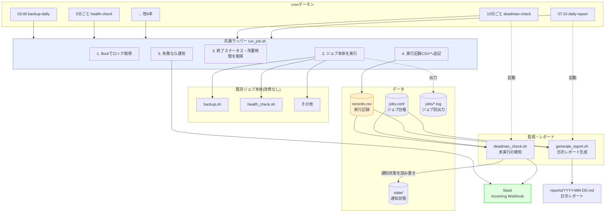
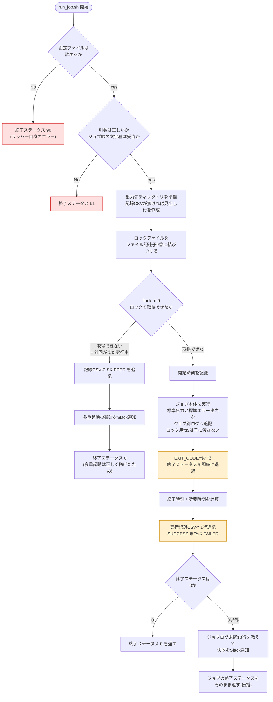
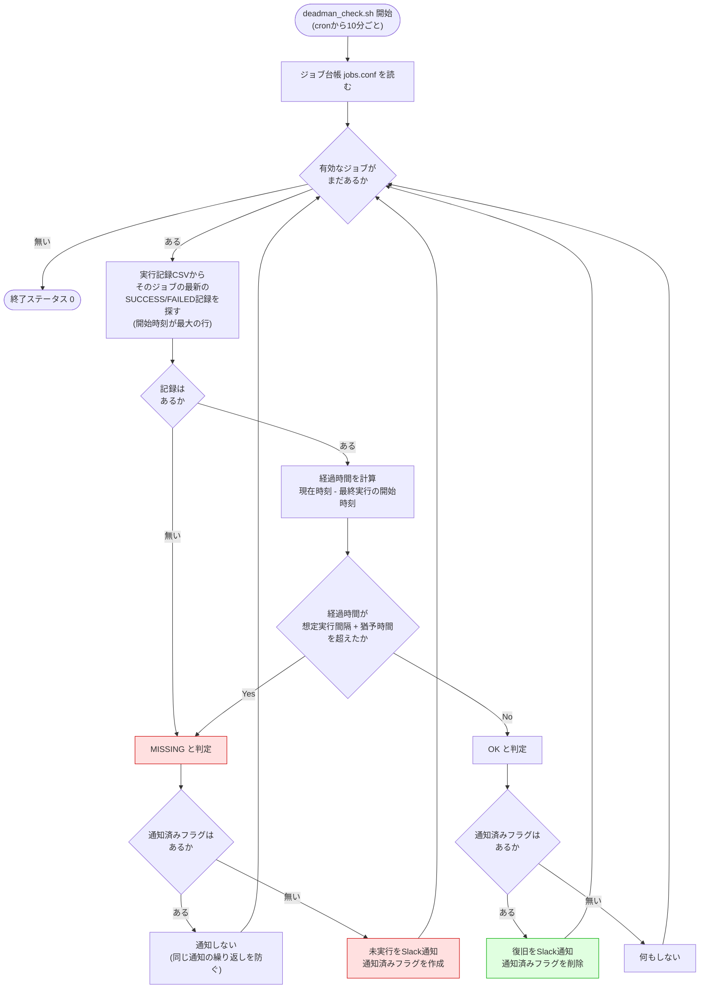
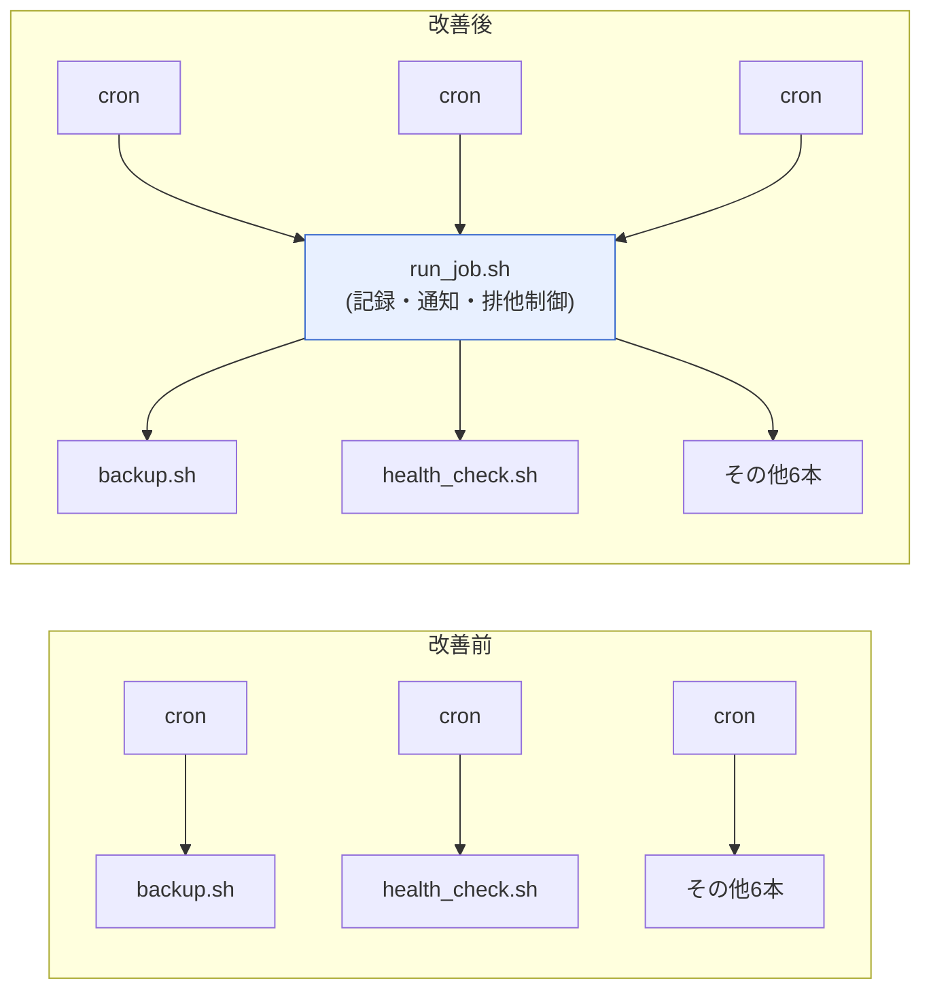

# 改善設計書(To-Be) — cronジョブの可視化と失敗・未実行検知

[02-improvement-proposal.md](./02-improvement-proposal.md) で選定した「共通ラッパー方式 + デッドマン監視 + 日次レポート」の設計書。

> **この案件は架空の設定です。** 依頼元は架空の会社である。ただし本書に記載する仕様・スクリプトの挙動・性能値は、Ubuntu 24.04.4 LTS(GNU bash 5.2.21)の検証環境で実際に動作させて確認したものである。

## 目次

1. [全体構成](#1-全体構成)
2. [共通ラッパー run_job.sh の設計](#2-共通ラッパー-run_jobsh-の設計)
3. [デッドマン監視 deadman_check.sh の設計](#3-デッドマン監視-deadman_checksh-の設計)
4. [実行記録CSVのフォーマット設計](#4-実行記録csvのフォーマット設計)
5. [ジョブ定義ファイル(台帳)の仕様](#5-ジョブ定義ファイル台帳の仕様)
6. [日次レポートの設計](#6-日次レポートの設計)
7. [ファイル配置設計](#7-ファイル配置設計)
8. [技術要素の解説(初心者向け)](#8-技術要素の解説初心者向け)
9. [非機能設計](#9-非機能設計)

## 1. 全体構成

### 1.1 構成図



### 1.2 設計の中心にある考え方

| 考え方 | 内容 |
|---|---|
| **記録がすべての起点** | 「通知する」ことより「記録を残す」ことを先に置く。記録さえあれば、そこから未実行検知もレポートも派生できる。逆に記録が無ければ、どんな監視も作れない |
| **観測する場所を1か所にする** | 記録・通知・排他制御という共通処理を、ジョブごとではなくラッパー1か所に集める |
| **監視は対象の外側に置く** | 未実行を検知するには、ジョブの外から記録を見張る必要がある |
| **既存には触らない** | 既存ジョブは「そのまま動く部品」として扱い、外側から包む |

### 1.3 改善前後の比較

| 観点 | 改善前 | 改善後 |
|---|---|---|
| crontabの記述 | `0 3 * * * /opt/backup-automation/backup.sh` | `0 3 * * * /opt/cron-job-observability/run_job.sh backup-daily /opt/backup-automation/backup.sh` |
| ジョブスクリプト | そのまま | **そのまま(変更なし)** |
| 実行の記録 | 残らない | `records.csv` に1実行=1行 |
| 出力の行き先 | 消える(または各所バラバラ) | `jobs/<ジョブID>.log` に統一 |
| 失敗時 | 誰も気づかない | Slackへ即時通知 |
| 未実行時 | 誰も気づかない | デッドマン監視がSlackへ通知 |
| 多重起動 | そのまま重複実行 | `flock` でスキップ + 通知 |

## 2. 共通ラッパー run_job.sh の設計

### 2.1 インターフェース

```bash
run_job.sh <ジョブID> <実行するコマンド> [引数...]
```

| 引数 | 説明 |
|---|---|
| ジョブID | 台帳(`jobs.conf`)に登録した名前。半角英数字・ハイフン・アンダースコアのみ |
| 実行するコマンド以降 | そのまま実行される。ラッパーは中身を解釈しない |

**なぜジョブIDを引数にするのか**: 実行記録CSV・ジョブ別ログ・ロックファイル・台帳の4つを、同じ名前で結びつけるため。「コマンドのパス」をキーにするとパスが変わっただけで別ジョブ扱いになるため、人間が決めた安定した名前を使う。

### 2.2 内部処理フロー



### 2.3 終了ステータスの設計

ラッパーは「ジョブの終了ステータス」と「ラッパー自身のエラー」を区別できるようにする。

| 終了ステータス | 意味 |
|---|---|
| 0〜89 | **ジョブ本体の終了ステータスをそのまま返す**(伝播) |
| 0 | 多重起動でスキップした場合(ラッパーとしては正常動作) |
| 90 | 設定ファイルが無い、出力先を作れないなど、ラッパー自身の準備エラー |
| 91 | 引数の指定誤り(引数不足、ジョブIDの文字種違反) |

**なぜ90番台に分けるのか**: 「ジョブが失敗した」のか「監視の仕組みが壊れた」のかを、終了ステータスだけで切り分けられるようにするため。この2つは対処する人も対処方法も違う。

**なぜジョブの終了ステータスを伝播させるのか**: ラッパーが常に0を返すと、別のスクリプトから `run_job.sh ... && 次の処理` のように連結したときに、失敗しても次に進んでしまう。ラッパーは「透明な包み紙」であるべきで、中身の成否を隠してはいけない。

### 2.4 出力の扱い

| 方針 | 理由 |
|---|---|
| ジョブの標準出力・標準エラー出力は `>> ジョブ別ログ 2>&1` でファイルに追記する | cronのメール通知に依存しない。`2>&1` でエラー出力も同じファイルにまとめることで、時系列が1本になり読みやすくなる |
| **`\|` (パイプ)や `tee` を使わない** | パイプを使うと、受け取れる終了ステータスがパイプの最後のコマンドのものになり、**ジョブの成否が失われる**([8.2](#82-パイプと-tee-で終了ステータスが消える罠)で詳述) |
| 開始行・終了行の区切りを入れる | 1つのログファイルに複数回分の実行が追記されるため、どこからどこまでが1回分か分かるようにする |

ジョブ別ログの実際の出力例(検証環境で `sample_job.sh --fail` を実行):

```text
===== [2026-09-07T13:56:00+0900] START job_id=sample-job pid=6264 cmd=/opt/cron-job-observability/sample_job.sh --fail =====
[2026-09-07 13:56:00] sample_job.sh を開始します (mode=--fail)
[ERROR] 疑似的な障害を発生させます (exit 3)
[ERROR] 例: バックアップ先ディレクトリに書き込めませんでした
===== [2026-09-07T13:56:00+0900] END   job_id=sample-job status=FAILED exit=3 duration=0s =====
```

### 2.5 通知の設計

| 通知の種類 | 発火条件 | 送信元 |
|---|---|---|
| 失敗通知 | 終了ステータスが0以外 | `run_job.sh` |
| 多重起動の警告 | ロックが取得できずスキップした | `run_job.sh`(`NOTIFY_ON_SKIP=true` のとき) |
| 未実行の通知 | 想定実行間隔+猶予時間を超過 | `deadman_check.sh` |
| 復旧の通知 | 未実行状態から実行が確認できた | `deadman_check.sh` |

失敗通知の本文にはジョブログの末尾10行を添える。**通知を見ただけで一次判断ができる**ようにするためである(サーバーにログインしないと何も分からない通知は、対応が遅れる)。

Webhook URLが未設定(`<YOUR_SLACK_WEBHOOK_URL>` のまま)のときは、送信を試みず通知内容を `runner.log` に書き出す**ドライラン動作**にする。設定前でもラッパーの動作確認ができるようにするための安全策である。

## 3. デッドマン監視 deadman_check.sh の設計

### 3.1 デッドマンスイッチとは

**デッドマンスイッチ**(dead man's switch)= もともとは鉄道車両の安全装置で、「運転士がレバーを握り続けている間だけ走行でき、**手が離れたら自動的に停止する**」仕組みを指す。運転士が意識を失っても列車が暴走しないようにするための設計である。

ここから転じて、IT運用では次の意味で使われる。

> **定期的に届くはずの合図が途絶えたことをもって、異常とみなす監視方式**

通常の監視が「異常が起きたら通知が来る」のに対し、デッドマン監視は「**正常の合図が来なくなったら通知する**」という逆の発想を取る。

| 監視方式 | 合図 | 検知できるもの |
|---|---|---|
| 通常の監視 | 異常時に通知が飛ぶ | 失敗 |
| **デッドマン監視** | 正常時に記録が残る | **失敗 + 未実行 + 監視対象の消滅** |

「通知が来ないこと」を根拠にする監視は、**監視の仕組み自体が壊れた場合も検知できる**という強みがある。ジョブが消えても、cronが止まっても、サーバー内のプロセスが死んでも、「記録が増えない」という事実は変わらないためである。

### 3.2 判定ロジック



### 3.3 判定式

```text
経過時間 = 現在時刻 - 最終実行の開始時刻

経過時間 > (想定実行間隔 + 猶予時間)  →  未実行(MISSING)
```

具体例(`backup-daily`: 想定実行間隔1440分、猶予120分の場合):

| 状況 | 最終実行 | 現在時刻 | 経過 | 判定 |
|---|---|---|---|---|
| 正常 | 9/6 03:00 | 9/7 02:00 | 23時間 | OK(1440+120=1560分=26時間 未満) |
| 正常(実行直後) | 9/7 03:00 | 9/7 03:05 | 5分 | OK |
| **異常** | 9/6 03:00 | 9/7 05:30 | 26.5時間 | **MISSING**(26時間を超過) |

### 3.4 設計上の判断

| 判断 | 内容 | 理由 |
|---|---|---|
| SKIPPED は「実行された」とみなさない | 最新記録の探索対象を SUCCESS と FAILED に限定する | 多重起動でスキップされた回は、実際の処理が行われていない。スキップが続く状態は異常なので、デッドマン監視でも検知したい |
| 最終行ではなく「開始時刻が最大の行」を探す | `awk` で1列目の最大値を持つ行を選ぶ | 実行記録CSVは**終わった順**に追記されるため、行の並び順と開始時刻の順は一致しないことがある(長時間かかったジョブは後ろに回る) |
| 記録が1件も無い場合も MISSING とする | 台帳に `enabled=yes` で登録されているのに記録が無い = 動いていない | 移行直後は全ジョブがこの状態になるため、**移行が済んだジョブから順に `yes` にする**運用にする |
| 通知は状態が変化したときだけ | 状態ファイル(`deadman-<ジョブID>.alerted`)の有無で管理 | 10分ごとに同じ通知が飛ぶと、確実に読まれなくなる |
| 未実行を検知しても終了ステータスは0 | 検知はこのスクリプトの「正常な仕事」である | このスクリプト自身も `run_job.sh` 経由で動かすため、0以外を返すとラッパーからも二重に失敗通知が飛んでしまう |

### 3.5 実行例(検証環境での実測)

猶予込みの許容時間(60+10=70分)を超えたケース:

```text
===== デッドマン監視 (2026-09-07 13:56:10) =====
[MISSING] sample-job : 最終実行 2026-09-07T11:56:10+0900 から 2時間0分 経過(許容 1時間10分)
----- 判定結果: 対象 1 件 / 未実行 1 件 -----
```

このとき `runner.log` に記録された通知内容(Webhook未設定のためドライラン):

```text
2026-09-07 13:56:10 [WARN] [deadman] 未実行を検知しました: sample-job / 最終実行 2026-09-07T11:56:10+0900 から 2時間0分 経過(許容 1時間10分)
2026-09-07 13:56:10 [NOTIFY] [deadman] (送信せず記録のみ) :alarm_clock: cronジョブが実行されていません (sample-job) | ホスト: ops01
検知時刻: 2026-09-07 13:56:10
説明: 検証用のダミージョブ(sample_job.sh)
最終実行 2026-09-07T11:56:10+0900 から 2時間0分 経過(許容 1時間10分)
想定実行間隔: 60分 / 猶予: 10分
crontabの設定・cronサービスの状態・サーバーの時刻を確認してください。
```

## 4. 実行記録CSVのフォーマット設計

### 4.1 列定義

ファイル: `/var/log/cron-job-observability/records.csv`

| 列 | 列名 | 型・形式 | 例 | 説明 |
|---|---|---|---|---|
| 1 | `started_at` | ISO 8601(`%Y-%m-%dT%H:%M:%S%z`) | `2026-09-06T03:00:01+0900` | ジョブ本体の実行を開始した時刻 |
| 2 | `finished_at` | 同上 | `2026-09-06T03:00:43+0900` | ジョブ本体が終了した時刻 |
| 3 | `job_id` | 半角英数字・ハイフン・アンダースコア | `backup-daily` | 台帳と対応するジョブID |
| 4 | `status` | `SUCCESS` / `FAILED` / `SKIPPED` | `SUCCESS` | 実行結果の区分 |
| 5 | `exit_code` | 0〜255、またはスキップ時は `-` | `0` | ジョブ本体の終了ステータス |
| 6 | `duration_sec` | 整数(秒) | `42` | 所要時間 |
| 7 | `host` | ホスト名(`hostname -s`) | `ops01` | 実行したサーバー |
| 8 | `pid` | 整数 | `10001` | ラッパーのプロセスID |

実際のファイル(先頭5行):

```csv
started_at,finished_at,job_id,status,exit_code,duration_sec,host,pid
2026-09-06T00:00:02+0900,2026-09-06T00:00:03+0900,deadman-check,SUCCESS,0,1,ops01,10318
2026-09-06T00:00:08+0900,2026-09-06T00:00:19+0900,health-check,SUCCESS,0,11,ops01,10030
2026-09-06T00:05:08+0900,2026-09-06T00:05:20+0900,health-check,SUCCESS,0,12,ops01,10031
2026-09-06T00:10:02+0900,2026-09-06T00:10:03+0900,deadman-check,SUCCESS,0,1,ops01,10319
```

### 4.2 フォーマット設計の方針

| 方針 | 理由 |
|---|---|
| **自由入力の文字列を列に入れない** | 実行したコマンド文字列を入れたくなるが、コマンドにはカンマ・引用符・改行が含まれうる。これらが入るとCSVの列がずれ、`awk` での集計が壊れる。コマンドの内容はジョブ別ログの先頭行に記録し、CSVには「決まった形の値」だけを置く |
| **日時はISO 8601形式にする** | `2026-09-06T03:00:01+0900` の形式は、**文字列として大小比較すると時刻の前後比較になる**(辞書順=時系列順)。`sort` も `awk` の `>` もそのまま使える |
| **日付部分が先頭10文字に来る** | `substr($1, 1, 10)` で日付を取り出せるため、日付での絞り込みが1行で書ける |
| **タイムゾーンを明示する(`%z`)** | `+0900` を含めることで、サーバーのタイムゾーン設定を変えた場合や、複数拠点のサーバーの記録を集約した場合でも解釈を誤らない |
| **1実行 = 1行 = 追記のみ** | 追記(`>>`)だけなので、複数プロセスが同時に書いても行が壊れにくい。既存行の書き換えが無いため、記録が消える事故が起きない |
| **ホスト名の列を最初から持つ** | 現時点では1台だけだが、将来複数サーバーの記録を1ファイルに集約する余地を残しておく |
| **見出し行を持つ** | 表計算ソフトで開いたときや、半年後に自分が見返したときに列の意味が分かる。集計時は `NR == 1` で読み飛ばす |

### 4.3 status の3値

| 値 | 意味 | exit_code | duration_sec |
|---|---|---|---|
| `SUCCESS` | ジョブが終了ステータス0で終わった | `0` | 実際の所要時間 |
| `FAILED` | ジョブが終了ステータス0以外で終わった | 実際の値(1〜255) | 実際の所要時間 |
| `SKIPPED` | 前回の実行が終わっておらず、多重起動を防ぐため実行しなかった | `-` | `0` |

**なぜ SKIPPED を記録するのか**: 「起動はしたが実行しなかった」という事実自体が重要な情報だから。記録しないと、レポート上は「実行されなかった日」と区別がつかない。

## 5. ジョブ定義ファイル(台帳)の仕様

### 5.1 書式

ファイル: `/opt/cron-job-observability/jobs.conf`

```text
ジョブID,想定実行間隔(分),猶予時間(分),有効フラグ,説明
```

| 項目 | 型 | 説明 |
|---|---|---|
| ジョブID | 文字列 | `run_job.sh` の第1引数と一致させる。半角英数字・ハイフン・アンダースコアのみ |
| 想定実行間隔(分) | 整数 | 「正常なら、最大でも何分に1回は実行されるはずか」 |
| 猶予時間(分) | 整数 | 実行の遅れをどこまで許すか |
| 有効フラグ | `yes` / `no` | `yes` のみ監視・レポートの対象。移行前は `no` |
| 説明 | 文字列 | レポートに表示する日本語の説明。カンマ・`#` は使わない |

`#` で始まる行と空行はコメントとして無視される。カンマ前後の空白は自動的に除去される。

### 5.2 想定実行間隔の決め方

「そのジョブが**最大でどれくらいの間隔まで空きうるか**」を書く。実行頻度そのものではない点に注意する。

| cronの設定 | 想定実行間隔 | 考え方 |
|---|---|---|
| `*/5 * * * *`(5分ごと) | 5 | そのまま |
| `15 * * * *`(毎時15分) | 60 | 1時間ごと |
| `0 3 * * *`(毎日03:00) | 1440 | 24時間 × 60分 |
| `0 6 * * 1`(毎週月曜06:00) | 10080 | 7日 × 24時間 × 60分 |
| `30 7 * * 1-5`(平日07:30) | 4320 | **金曜の次は月曜**なので、最大の空きは72時間 = 3日 |

**平日ジョブの注意点**: 平日のみのジョブは「土日を挟む3日間」を許容せざるを得ないため、たとえば火曜日に失敗して実行されなかった場合、検知できるのは金曜になってしまう。これは実行間隔ベースの判定方式が持つ**構造的な限界**である。cron式そのものを解釈して「次の予定時刻」を計算する方式にすれば解決するが、実装が大幅に複雑になるため、今回は限界を明示したうえで採用する([05-effect-measurement.md](./05-effect-measurement.md) の残課題)。

### 5.3 猶予時間の決め方

猶予時間は「遅れをどこまで許すか」であり、**短すぎると誤検知、長すぎると発見が遅れる**というトレードオフになる。

| 決め方の目安 | 内容 |
|---|---|
| 通常の所要時間の3倍以上 | 判定は「開始時刻」を基準にするため、所要時間そのものは猶予に含まれない。ただしサーバーが混んでいる日の遅れを吸収する余裕として見る |
| 業務上、何分遅れたら困るかを考える | 日次バックアップが1時間遅れても実害は無いが、5分間隔の死活監視が30分止まるのは問題 |
| 検知が遅すぎないか確認する | 「想定間隔+猶予」が発見までの最大時間になる。日次ジョブなら26時間、5分ジョブなら15分 |

本案件で設定した値:

| ジョブID | 想定実行間隔 | 猶予 | 検知までの最大 | 設定理由 |
|---|---|---|---|---|
| `health-check` | 5分 | 10分 | 15分 | 5分間隔。まれに実行がずれても15分以内には次が来るはず |
| `user-sync` | 60分 | 20分 | 80分 | 毎時実行。1時間半で気づければ業務影響は限定的 |
| `backup-daily` | 1440分 | 120分 | 26時間 | 日次。翌朝の始業時に前日分の失敗が分かればよい |
| `db-dump` | 1440分 | 120分 | 26時間 | 同上 |
| `logrotate-app` | 1440分 | 120分 | 26時間 | 同上 |
| `tmp-cleanup` | 1440分 | 120分 | 26時間 | 同上 |
| `cert-expiry-check` | 10080分 | 360分 | 7日6時間 | 週次。証明書の期限は30日前から通知されるため、数日の遅れは許容できる |
| `sales-csv-transfer` | 4320分 | 60分 | 73時間 | 平日のみ。土日を挟むため長くならざるを得ない([5.2](#52-想定実行間隔の決め方)の限界) |
| `deadman-check` | 10分 | 10分 | 20分 | 監視の仕組み自身も監視対象にする |
| `daily-report` | 1440分 | 120分 | 26時間 | 同上 |

### 5.4 台帳が持つ2つの役割

| 役割 | 内容 |
|---|---|
| 未実行検知の基準 | 「何分空いたら異常か」を定義する。これが無いと未実行は判定できない |
| ジョブの一覧(可視化) | 「このサーバーで何が動いているか」を1ファイルで示す。日次レポートの行もこの台帳から生成される |

さらに副次的な効果として、**台帳に無いジョブIDの実行記録があれば「台帳に登録されていないジョブ」として日次レポートに表示される**。誰かが台帳を更新せずにcronを追加した場合に発見できる。

## 6. 日次レポートの設計

### 6.1 目的

| 情報の種類 | 手段 | 性質 |
|---|---|---|
| 「いま異常が起きた」 | Slack通知 | 点の情報。流れて消える |
| 「昨日はどうだったか」 | **日次レポート** | 線の情報。残る。証跡になる |

通知だけでは「毎日1回は必ず失敗しているが、誰も深追いしていない」といった慢性的な状態に気づけない。レポートは傾向を見るために作る。

### 6.2 出力内容

| セクション | 内容 |
|---|---|
| ヘッダ | 対象日・対象ホスト・生成日時・集計元ファイル |
| サマリ | 総実行回数・成功・失敗・スキップの件数 |
| ジョブ別の実行状況 | ジョブごとの実行回数・成否・最終実行時刻・平均/最大所要時間 |
| 対象日に一度も実行されなかったジョブ | 台帳にあるが記録が無いジョブ |
| 台帳に登録されていないジョブ | 記録はあるが台帳に無いジョブ(野良ジョブの検出) |
| 凡例 | アイコンの意味 |

### 6.3 生成例(検証環境で実際に生成したもの)

サンプルデータ(`src/records.sample.csv`、1日分461件)から生成したレポートの抜粋:

```markdown
## サマリ

| 項目 | 件数 |
|---|---|
| 総実行回数 | 461 |
| 成功(SUCCESS) | 459 |
| 失敗(FAILED) | 1 |
| 多重起動によるスキップ(SKIPPED) | 1 |

## ジョブ別の実行状況

| 状態 | ジョブID | 説明 | 実行 | 成功 | 失敗 | スキップ | 最終実行 | 最終結果 | 平均所要(秒) | 最大所要(秒) |
|---|---|---|---|---|---|---|---|---|---|---|
| 🟢 正常 | backup-daily | Webコンテンツの日次バックアップ | 1 | 1 | 0 | 0 | 03:00:01 | SUCCESS | 42.0 | 42 |
| 🟡 スキップあり | health-check | サーバー死活監視 | 288 | 287 | 0 | 1 | 23:55:02 | SUCCESS | 7.7 | 12 |
| 🔴 失敗あり | db-dump | 基幹DBの論理バックアップ | 1 | 0 | 1 | 0 | 01:30:02 | FAILED | 7.0 | 7 |
| 🟢 正常 | user-sync | 人事CSVからのアカウント同期 | 24 | 24 | 0 | 0 | 23:15:01 | SUCCESS | 3.1 | 4 |
| ⚪ 未実行 | cert-expiry-check | SSLサーバー証明書の有効期限チェック | 0 | 0 | 0 | 0 | - | - | - | - |
```

(説明列は紙面の都合で短縮している。実際の出力は [05-effect-measurement.md](./05-effect-measurement.md) を参照)

### 6.4 集計の実装方針

日付の絞り込みとジョブ別集計は `awk` で行う。

```awk
NR == 1 { next }                    # 見出し行を読み飛ばす
substr($1, 1, 10) != d { next }     # 対象日以外の行を読み飛ばす
$3 != id { next }                   # 別のジョブの行を読み飛ばす
{ total++ }
$4 == "SUCCESS" { ok++ }
$4 == "FAILED"  { ng++ }
```

**なぜジョブごとにCSVを読み直すのか**: 1回のawkで全ジョブを集計することもできるが、連想配列を多用したコードは初学者に読みにくい。対象は10本程度、1日の記録も数百行であり、実測でレポート生成は0.06秒だった。**読みやすさを優先し、必要になったら最適化する**という判断をしている。

## 7. ファイル配置設計

### 7.1 配置一覧

| パス | 種別 | 権限 | 内容 |
|---|---|---|---|
| `/opt/cron-job-observability/` | ディレクトリ | 755 | スクリプトと設定の配置先 |
| `/opt/cron-job-observability/run_job.sh` | 実行ファイル | 755 | 共通ラッパー |
| `/opt/cron-job-observability/deadman_check.sh` | 実行ファイル | 755 | デッドマン監視 |
| `/opt/cron-job-observability/generate_report.sh` | 実行ファイル | 755 | レポート生成 |
| `/opt/cron-job-observability/job_observability.conf` | 設定 | **600** | 共通設定(Webhook URLを含むため権限を絞る) |
| `/opt/cron-job-observability/jobs.conf` | 設定 | 644 | ジョブ台帳 |
| `/var/log/cron-job-observability/records.csv` | データ | 644 | 実行記録CSV |
| `/var/log/cron-job-observability/jobs/<ID>.log` | ログ | 644 | ジョブ別の出力 |
| `/var/log/cron-job-observability/runner.log` | ログ | 644 | 監視の仕組み自身の動作ログ |
| `/var/log/cron-job-observability/wrapper-cron.log` | ログ | 644 | ラッパー自体が起動できなかった場合の受け皿 |
| `/var/log/cron-job-observability/reports/` | ディレクトリ | 755 | 日次レポートの出力先 |
| `/var/lib/cron-job-observability/` | 状態 | 755 | デッドマン監視の通知済みフラグ |
| `/var/lock/cron-job-observability/` | ロック | 755 | `flock` 用ロックファイル |

### 7.2 配置場所の選定理由

| 場所 | 理由 |
|---|---|
| `/opt/<製品名>/` にスクリプトを置く | `/opt` は「OSのパッケージ管理に含まれない、後から入れたソフトウェア」を置く場所。既存の構築案件([projects/02](../../projects/02-backup-automation/README.md) など)と方針を揃えている |
| ログを `/var/log/` に置く | ログの標準的な置き場所。`logrotate` の設定も書きやすい |
| 状態ファイルを `/var/lib/` に置く | `/var/lib` は「プログラムが動作中に書き換える、再起動後も残ってほしいデータ」の置き場所。通知済みフラグは再起動で消えては困る |
| **ロックを `/var/lock/` に置く** | Ubuntuでは `/var/lock` は `/run/lock`(メモリ上の一時領域)へのリンクであり、**再起動時に自動的にクリアされる**。「電源断でロックファイルが残り、ジョブが永久にスキップされる」事故を構造的に防げる |

### 7.3 ログの分離設計

3種類のログを意図的に分けている。

| ログ | 内容 | 分けている理由 |
|---|---|---|
| `jobs/<ID>.log` | ジョブ本体の出力 | ジョブ単位で追いたいため。ジョブが増えてもファイルが混ざらない |
| `runner.log` | ラッパー・デッドマン監視自身の動作 | **「ジョブが失敗した」のか「監視の仕組みが壊れた」のかを切り分ける**ため。この2つが混ざると調査が難しくなる |
| `wrapper-cron.log` | crontabからのリダイレクト先 | ラッパー自体が起動できない致命的な事故(パス誤り・権限不足)の受け皿。ここに何か出ていたら異常事態 |

## 8. 技術要素の解説(初心者向け)

### 8.1 終了ステータスと `$?`

**終了ステータス**(exit status)= コマンドが終わるときに返す0〜255の数値。

| 値 | 意味 |
|---|---|
| 0 | 成功 |
| 1〜255 | 失敗(値の意味はコマンドごとに定義される) |

代表的な値:

| 値 | 意味 |
|---|---|
| 1 | 一般的なエラー |
| 2 | シェル組み込みコマンドの誤用 |
| 126 | ファイルはあるが実行権限が無い |
| **127** | **コマンドが見つからない**(cronのPATH問題で頻出) |
| 130 | Ctrl+C(SIGINT)で中断された |

`$?` は「**直前に実行したコマンドの**終了ステータス」を保持する特殊変数である。

```bash
/bin/false
echo "終了ステータス: $?"
```

出力:

```text
終了ステータス: 1
```

**最重要の注意点**: `$?` は次のコマンドを実行した時点で上書きされる。

```bash
/bin/false
echo "何か表示する"    # ← この echo が成功したことで $? が 0 になる
echo "終了ステータス: $?"
```

出力:

```text
何か表示する
終了ステータス: 0
```

false は失敗したのに0になっている。そのため `run_job.sh` では、ジョブ実行の**直後**に必ず変数へ退避している。

```bash
"$@" >> "$JOB_LOG" 2>&1 9>&-
EXIT_CODE=$?          # ← 間に1行も挟まない
```

### 8.2 パイプと `tee` で終了ステータスが消える罠

「実行しながらログにも残したい」と考えると `tee` を使いたくなる。しかしこれは**失敗検知を壊す**。

検証環境での実測:

```bash
bash -c 'false | cat'; echo "パイプあり(pipefailなし): $?"
bash -c 'set -o pipefail; false | cat'; echo "パイプあり(pipefailあり): $?"
bash -c 'false | tee /dev/null > /dev/null'; echo "tee経由: $?"
```

出力:

```text
パイプあり(pipefailなし): 0
パイプあり(pipefailあり): 1
tee経由: 0
```

| 書き方 | 得られる終了ステータス | 何が起きるか |
|---|---|---|
| `false \| cat` | **0**(`cat` の結果) | `false` は失敗したのに成功扱い |
| `set -o pipefail; false \| cat` | 1 | `pipefail` を付けると、パイプ内のどれかが失敗すれば失敗になる |
| `false \| tee ログ` | **0**(`tee` の結果) | **ジョブが失敗しても成功として記録されてしまう** |

パイプライン全体の終了ステータスは、既定では**最後のコマンドのもの**になる。`tee` はほぼ必ず成功するため、`tee` を挟むとジョブの失敗は永久に検知できなくなる。

**本設計での回避策**: パイプを使わず、リダイレクトで出力を保存する。

```bash
"$@" >> "$JOB_LOG" 2>&1        # パイプを使わないので終了ステータスはジョブのもの
```

`tee` がどうしても必要な場合(画面にも出したい場合)は `set -o pipefail` を併用するか、`${PIPESTATUS[0]}` を使う。ただし本ラッパーでは**構造をできるだけ単純にする**ことを優先し、パイプ自体を使わない設計にしている。

### 8.3 `set -e` を使わない理由

`set -e`(エラーが起きたらスクリプトを即終了する)は便利に見えるが、本ラッパーでは**あえて使っていない**。

理由:

| 理由 | 説明 |
|---|---|
| 目的と矛盾する | ラッパーの仕事は「ジョブが失敗したことを記録して通知する」こと。ジョブが失敗した瞬間にラッパーごと終了しては、記録も通知も行われない |
| 挙動が直感に反する | `set -e` は「失敗したら必ず止まる」わけではない。`if` の条件部分、`&&` や `\|\|` の左側、`!` を付けた場合などでは止まらない。この例外を正確に把握しないまま使うと、止まってほしいところで止まらず、止まってほしくないところで止まる |

代わりに使っているのが `set -u`(未定義の変数を参照したらエラーで停止)である。設定ファイルの項目を書き忘れた場合に、空文字で動き続けて意味不明な結果になるのを防げる。

```bash
set -u
```

**方針**: 「エラーで自動的に止める」のではなく、「**各コマンドの終了ステータスを自分で受け取り、自分で判断する**」。監視の仕組みを作る側では、こちらのほうが安全である。

### 8.4 `flock` による排他制御

**排他制御**(exclusive control)= 複数のプロセスが同じ資源を同時に使わないよう、順番待ちさせる仕組み。

`flock` はLinuxの標準コマンドで、ファイルを「鍵」として使う。

本ラッパーでの使い方:

```bash
exec 9>"$LOCK_FILE"     # 9番のファイル記述子をロックファイルに結びつける
if ! flock -n 9; then
    # ロックが取れなかった = 前回の実行がまだ動いている
    ...スキップの記録と通知...
    exit 0
fi
```

| 要素 | 意味 |
|---|---|
| **ファイル記述子**(file descriptor) | プロセスが開いているファイルに付けられる番号(=ファイルの取っ手)。0が標準入力、1が標準出力、2が標準エラー出力。3以降は自由に使える |
| `exec 9>ファイル` | 9番の取っ手をそのファイルに結びつける。以後、この取っ手はプロセスが終わるまで保持される |
| `flock -n 9` | 9番の取っ手にロックを掛ける。`-n` は「取れなければ待たずに即座に失敗する」 |

**`-n`(待たない)にしている理由**: 待つ方式(`flock` の既定)にすると、5分ごとに起動する監視ジョブが「待機中のプロセス」として積み上がり、状況がさらに悪化する。定期実行のジョブでは「今回は諦めて、次の回に任せる」ほうが安全である。

**ロックが自動で解放される仕組み**: `flock` によるロックは**プロセスが終了するとカーネルが自動的に解放する**。スクリプトが `kill -9` で強制終了されても、電源が落ちても、ロックが残ることはない。ロックファイル自体は残るが、それは単なる空ファイルであり問題にならない。

検証環境での確認(ジョブ実行中にロックを掴んでいるプロセスを調べた例):

```bash
fuser -v /var/lock/cron-job-observability/sample-job.lock
```

出力:

```text
                     USER        PID ACCESS COMMAND
/var/lock/cron-job-observability/sample-job.lock:
                     root       7093 F.... bash
                     root       7108 F.... bash
                     root       7110 F.... sleep
```

**注意点(実装上の落とし穴)**: 上の出力を見ると、ジョブが起動した `sleep` プロセスまでが9番の取っ手を持っている。ファイル記述子は**子プロセスに引き継がれる**ためである。この状態でジョブがバックグラウンドプロセスを残して終了すると、**ラッパーが終了してもロックが解放されない**。本ラッパーではジョブ実行時に `9>&-`(9番の取っ手を閉じる)を付けて、子プロセスにロックを引き継がせないようにしている。

```bash
"$@" >> "$JOB_LOG" 2>&1 9>&-
```

### 8.5 デッドマン監視という発想

[3.1](#31-デッドマンスイッチとは)で説明したとおり、「起きるはずのことが起きていない」ことを検知する監視方式である。

初学者がつまずきやすいのは、**「監視は監視対象の外側に置かなければならない」**という点である。

| 誤った設計 | なぜ動かないか |
|---|---|
| バックアップスクリプトの中に「実行されなかったら通知する」処理を書く | スクリプトが実行されなければ、その処理も実行されない |
| ジョブの最後に「次回も動く予定」と通知する | 次回動かなければ通知も来ないが、「来ないこと」に誰も気づかない |
| **実行記録を残し、別のジョブがそれを見張る** | **正しい**。見張り役はジョブとは独立して動く |

「**通知が来ないこと自体を異常とみなせる仕組みになっているか**」が、監視設計の質を判断する基準になる。

なお、この考え方を突き詰めると「では、その見張り役が止まったら誰が気づくのか」という問題に行き着く。本設計では見張り役自身も実行記録を残し、日次レポートに表示されるようにしているが、**同一サーバー内である以上、サーバーごと停止した場合は検知できない**。この限界は [05-effect-measurement.md](./05-effect-measurement.md) の残課題として明記している。

### 8.6 ラッパー方式の設計上の利点

**ラッパー**(wrapper)= 既存の処理を「包んで」呼び出し、前後に共通処理を挟むための仕組み。



| 利点 | 内容 |
|---|---|
| 既存を変更しなくてよい | ジョブ本体は「そのまま動く部品」として扱える。動作実績のあるスクリプトに手を入れるリスクをゼロにできる |
| 修正が1か所で済む | 通知の書式を変えたい、記録項目を増やしたい、といった変更がラッパー1本の修正で全ジョブに反映される |
| 追加が簡単 | 新しいジョブは、crontabに1行・台帳に1行足すだけで記録・通知・排他制御が付いてくる |
| 対象を選ばない | ラッパーは中身を解釈しないため、Bashスクリプトでも、Pythonでも、`mysqldump` のような単体コマンドでも、同じように包める |
| 段階移行できる | 1本ずつ切り替えられ、問題があればその1本だけ元に戻せる |

**トレードオフ(正直に書くべき点)**: ラッパーは全ジョブが通る道になるため、**単一障害点**になる。ラッパーのバグは全ジョブに波及する。そのため、実装は意図的に単純に保ち、テストを厚くし、ラッパー自身のエラーは終了ステータス90番台に分けて切り分けられるようにしている。

### 8.7 cronの実行環境は対話シェルと違う

cronからジョブを動かすときの最大のつまずきが**環境変数の違い**である。

| 項目 | 対話シェル(手でログインした状態) | cron |
|---|---|---|
| `PATH` | `/usr/local/bin` などを含む長い値 | **短い**(通常 `/usr/bin:/bin`) |
| `.bashrc` / `.profile` | 読み込まれる | **読み込まれない** |
| ホームディレクトリ | ログインユーザーのもの | 実行ユーザーのもの |
| ロケール・タイムゾーン | ログイン環境の設定 | 最小限の設定 |
| カレントディレクトリ | 任意 | 実行ユーザーのホーム |

検証環境で、cron相当の最小環境を `env -i` で再現した実測:

```bash
env -i /bin/bash -c "PATH=/usr/bin:/bin JOBOBS_CONF=... run_job.sh sample-job ./job_with_path.sh"
```

ジョブ別ログの内容:

```text
===== [2026-09-07T04:40:39+0000] START job_id=sample-job pid=6875 cmd=./job_with_path.sh =====
PATH=/usr/bin:/bin
./job_with_path.sh: line 4: myreport: command not found
===== [2026-09-07T04:40:39+0000] END   job_id=sample-job status=FAILED exit=127 duration=0s =====
```

この出力から2つのことが読み取れる。

1. **終了ステータス127** = 「コマンドが見つからない」。手で実行すると動くのにcronだと動かない、という典型的な症状の正体がこれである。
2. **タイムスタンプが `+0000`(UTC)になっている**。`env -i` で `TZ` が失われた結果、日本時間ではなくUTCで記録された。cronの環境でも同じことが起こりうるため、**時刻がずれて見える場合はまずタイムゾーンを疑う**。

対策として、crontabの先頭で明示的に設定する。

```text
SHELL=/bin/bash
PATH=/usr/local/sbin:/usr/local/bin:/usr/sbin:/usr/bin:/sbin:/bin
MAILTO=""
```

**そしてラッパー方式の利点がここにも現れる**: ラッパーがジョブの出力をファイルに残すため、こうしたエラーメッセージが消えずに残る。改善前は `command not found` の1行すら見えなかった。

## 9. 非機能設計

### 9.1 性能(検証環境での実測値)

Ubuntu 24.04.4 LTS / GNU bash 5.2.21 の検証環境で測定した値。

| 項目 | 実測値 | 備考 |
|---|---|---|
| ラッパー1回の所要時間(`/bin/false` を実行) | **約35ミリ秒** | 記録・通知(ドライラン)を含む |
| 同(ラッパーを使わず `/bin/false` を直接実行) | 約3ミリ秒 | |
| **ラッパーによる増加分** | **約32ミリ秒** | 5分間隔のジョブでも無視できる水準 |
| デッドマン監視の実行時間(10ジョブ・記録462行) | 約140ミリ秒 | |
| レポート生成の実行時間(記録462行) | 約56ミリ秒 | |

**評価**: 5分間隔で動くジョブに32ミリ秒のオーバーヘッドが乗っても、1日あたり合計約9秒に過ぎない。実用上の問題は無いと判断した。

### 9.2 ディスク使用量

| 項目 | 実測・試算 |
|---|---|
| 実行記録CSV 1日分(10ジョブ・461件) | **約39.4KB**(実測) |
| 同 1年分 | 約14MB(試算: 39.4KB × 365) |
| ジョブ別ログ | ジョブの出力量に依存するため見積もれない → サイズ基準のローテートで対処 |

対策として `logrotate` を設定する(`src/logrotate-cron-job-observability.conf`)。

| 対象 | ローテート条件 | 保存世代 |
|---|---|---|
| `records.csv` | 月次 | 12世代(1年分) |
| `jobs/*.log`・`runner.log`・`wrapper-cron.log` | 週次 または 10MB超過 | 8世代 |

### 9.3 セキュリティ

| 項目 | 設計 |
|---|---|
| Webhook URLの保護 | 設定ファイルは `chmod 600`。リポジトリにはプレースホルダー `<YOUR_SLACK_WEBHOOK_URL>` のみを記載する |
| ジョブIDの検証 | 半角英数字・ハイフン・アンダースコアのみに制限。`../` のような文字列でロックファイル・ログのパスを外に飛び出させないため |
| 実行ユーザー | 既存ジョブと同じ権限で実行する(ラッパーは権限を昇格させない) |
| 記録の改ざん防止 | 本設計では対応しない(スコープ外)。必要なら記録を別サーバーへ転送する |

### 9.4 可用性・障害時の挙動

| 障害 | ラッパーの挙動 |
|---|---|
| Slackへの通知が失敗した | `runner.log` に警告を残し、**ジョブの終了ステータスは変えない**。通知の失敗でジョブの結果を上書きしない |
| 記録CSVが書けない(ディスクフル等) | ジョブ自体は実行される。書き込みエラーは `wrapper-cron.log` に出る |
| ロックファイルが作れない | 終了ステータス90でラッパーが停止する(ジョブは実行されない) |
| ジョブが強制終了された | `flock` のロックはカーネルが自動解放する。記録には最後の終了ステータス(例: 137 = SIGKILL)が残る |

### 9.5 テスト方針

| 種別 | 内容 | 詳細 |
|---|---|---|
| 静的解析 | `shellcheck -S warning` を無警告で通す | 全スクリプトで確認済み |
| 正常系 | 成功するジョブを実行し、記録が SUCCESS になる | [05-effect-measurement.md](./05-effect-measurement.md) |
| 異常系(失敗) | **わざと失敗させ**、FAILED の記録と通知を確認する | 同上 |
| 異常系(未実行) | **わざと実行させず**、デッドマン監視の通知を確認する | 同上 |
| 異常系(多重起動) | **わざと長引かせ**、SKIPPED になることを確認する | 同上 |
| 異常系(引数誤り) | 引数不足・不正なジョブIDで終了ステータス91を返す | 同上 |

## 関連ドキュメント

- [02-improvement-proposal.md](./02-improvement-proposal.md) — 改善提案書(前に読む)
- [04-build-guide.md](./04-build-guide.md) — 実装・移行手順書(次に読む)
- [05-effect-measurement.md](./05-effect-measurement.md) — 効果測定レポート
- [06-troubleshooting.md](./06-troubleshooting.md) — トラブルシューティング集
- [src/run_job.sh](./src/run_job.sh) — 共通ラッパー本体
- [src/deadman_check.sh](./src/deadman_check.sh) — デッドマン監視本体
- [src/generate_report.sh](./src/generate_report.sh) — レポート生成本体
