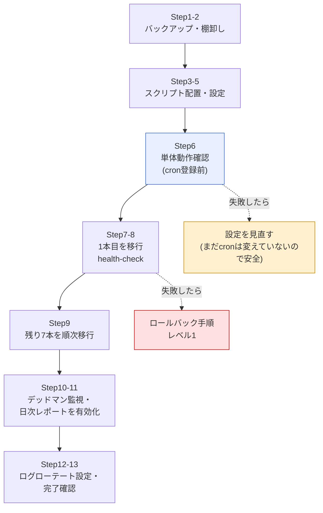

# 実装・移行手順書 — cronジョブの可視化と失敗・未実行検知

[03-design.md](./03-design.md) の設計に基づき、共通ラッパー方式を実際のサーバーへ導入し、**稼働中のcronジョブを1本ずつ安全に移行する**ための手順書。

> **この案件は架空の設定です。** 依頼元は架空の会社である。本手順書のコマンドと出力例は、Ubuntu 24.04.4 LTS(GNU bash 5.2.21)の検証環境で実際に実行して確認したものである。ただし、cronへの登録(`crontab -e`)を伴う手順の出力は、検証環境にcronデーモンが導入されていないため**出力イメージ**として記載している(その旨を各手順に明記する)。

## この手順書の読み方

| 表記 | 意味 |
|---|---|
| 💡ポイント | つまずきやすい点、または「なぜそうするのか」の補足 |
| ⚠️注意 | 実行前に必ず確認すべき点。飛ばすと事故につながる |
| 出力例 | 検証環境で実際に得られた出力 |
| 出力イメージ | 環境の都合で実行できなかった部分の想定出力 |

出力例に現れるホスト名 `ops01` は、検証時にホスト名を `ops01` に設定した環境で実行した実際の結果である。

## 前提条件

| 項目 | 内容 |
|---|---|
| OS | Ubuntu Server 22.04 LTS 以降(検証は 24.04.4 LTS) |
| 権限 | `sudo` が使える(既存のcronジョブがroot実行のため) |
| 必要なコマンド | `bash` `flock` `awk` `sed` `curl` `date` `hostname`(いずれもUbuntu標準) |
| 前提知識 | `crontab -e` でcronを編集できる |
| 所要時間 | 実作業 約2〜3時間(経過観察の待ち時間を除く) |

⚠️注意: 本手順は**稼働中のcronジョブを変更する作業**である。作業前に必ず [Step 1](#step-1-作業前のバックアップを取る) のバックアップを取り、[ロールバック手順](#ロールバック手順) に目を通しておくこと。

## 全体の流れ



💡ポイント: **Step 6 までは既存のcron設定を一切変更しない**。単体動作確認が終わるまでは、いつ中断しても現状に影響が出ない構成にしている。改修作業では「どこまでなら安全に引き返せるか」を意識して手順を組み立てる。

## Step 1: 作業前のバックアップを取る

**なぜ**: crontabは1コマンドで全消去(`crontab -r`)できてしまう。元に戻せる状態を先に作る。

```bash
sudo crontab -l > /root/crontab.backup.$(date +%Y%m%d_%H%M%S)
ls -l /root/crontab.backup.*
```

出力イメージ:

```text
-rw-r--r-- 1 root root 1042 Sep  7 09:15 /root/crontab.backup.20260907_091500
```

⚠️注意: `crontab -l` が「no crontab for root」と出る場合は、ジョブが `/etc/cron.d/` や各ユーザーのcrontabに登録されている可能性がある。次のコマンドで探す。

```bash
sudo ls -l /etc/cron.d/
sudo ls /var/spool/cron/crontabs/
```

## Step 2: 現状のcronジョブを棚卸しする

**なぜ**: 移行対象を確定させ、ジョブIDを決めるため。[01-current-analysis.md](./01-current-analysis.md#3-cronジョブの棚卸し8本) の棚卸し表がこの成果物にあたる。

```bash
sudo crontab -l | grep -v '^#' | grep -v '^$'
```

出力イメージ(改善前の状態):

```text
0 3 * * * /opt/backup-automation/backup.sh >> /var/log/backup-automation/cron.log 2>&1
*/5 * * * * /opt/server-health-check/health_check.sh >> /var/log/server-health-check/cron.log 2>&1
30 1 * * * /opt/db-backup/dump.sh | gzip > /var/backups/db/dump_$(date +\%Y\%m\%d).sql.gz
15 * * * * /opt/user-account-automation/create_users.sh -f /var/opt/hr/users.csv
10 4 * * * /usr/sbin/logrotate /etc/logrotate.d/app-custom
0 5 * * * /opt/ops-scripts/tmp_cleanup.sh
0 6 * * 1 /opt/ops-scripts/cert_expiry_check.sh
30 7 * * 1-5 /opt/ops-scripts/sales_csv_transfer.sh
```

この結果をもとに、各ジョブへ**ジョブID**(半角英数字・ハイフン・アンダースコアのみ)を付ける。

| 元のコマンド | 付けるジョブID |
|---|---|
| `/opt/backup-automation/backup.sh` | `backup-daily` |
| `/opt/server-health-check/health_check.sh` | `health-check` |
| `/opt/db-backup/dump.sh \| gzip > ...` | `db-dump` |
| `/opt/user-account-automation/create_users.sh` | `user-sync` |
| `/usr/sbin/logrotate /etc/logrotate.d/app-custom` | `logrotate-app` |
| `/opt/ops-scripts/tmp_cleanup.sh` | `tmp-cleanup` |
| `/opt/ops-scripts/cert_expiry_check.sh` | `cert-expiry-check` |
| `/opt/ops-scripts/sales_csv_transfer.sh` | `sales-csv-transfer` |

💡ポイント: ジョブIDは**後から変えにくい**。実行記録CSV・ログファイル名・台帳・ロックファイルのすべてがこの名前で結びつくため、変更すると過去の記録との連続性が切れる。「何をするジョブか」が分かる名前を、最初に落ち着いて決める。

## Step 3: ディレクトリを作成する

**なぜ**: スクリプト・記録・状態・ロックを、それぞれ用途に合った標準的な場所に分けて配置するため([03-design.md](./03-design.md#7-ファイル配置設計))。

```bash
sudo mkdir -p /opt/cron-job-observability
sudo mkdir -p /var/log/cron-job-observability/jobs
sudo mkdir -p /var/log/cron-job-observability/reports
sudo mkdir -p /var/lib/cron-job-observability
sudo mkdir -p /var/lock/cron-job-observability
ls -ld /opt/cron-job-observability /var/log/cron-job-observability /var/lib/cron-job-observability /var/lock/cron-job-observability
```

出力例:

```text
drwxr-xr-x 2 root root 4096 Sep  7 13:55 /opt/cron-job-observability
drwxr-xr-x 2 root root 4096 Sep  7 13:55 /var/lib/cron-job-observability
drwxr-xr-x 2 root root 4096 Sep  7 13:55 /var/lock/cron-job-observability
drwxr-xr-x 4 root root 4096 Sep  7 13:55 /var/log/cron-job-observability
```

💡ポイント: `/var/lock` は Ubuntu では `/run/lock`(メモリ上の一時領域)へのリンクになっており、**再起動すると中身が消える**。これはロック置き場としてはむしろ望ましい性質で、「電源断でロックファイルが残り、ジョブが永久にスキップされる」という事故を構造的に防げる。

## Step 4: スクリプトと設定ファイルを配置する

**なぜ**: 実行に必要なファイルを揃え、秘匿情報を含むファイルだけ権限を絞るため。

```bash
cd /path/to/automation/improvements/04-cron-job-observability/src
sudo cp run_job.sh deadman_check.sh generate_report.sh sample_job.sh /opt/cron-job-observability/
sudo cp job_observability.conf jobs.conf /opt/cron-job-observability/
sudo chmod 755 /opt/cron-job-observability/*.sh
sudo chmod 600 /opt/cron-job-observability/job_observability.conf
sudo chmod 644 /opt/cron-job-observability/jobs.conf
ls -l /opt/cron-job-observability/
```

出力例:

```text
total 52
-rwxr-xr-x 1 root root  9570 Sep  7 13:55 deadman_check.sh
-rwxr-xr-x 1 root root 12253 Sep  7 13:55 generate_report.sh
-rw------- 1 root root  3845 Sep  7 13:55 job_observability.conf
-rw-r--r-- 1 root root  3956 Sep  7 13:55 jobs.conf
-rwxr-xr-x 1 root root 12520 Sep  7 13:55 run_job.sh
-rwxr-xr-x 1 root root  2195 Sep  7 13:55 sample_job.sh
```

💡ポイント: `job_observability.conf` だけ `600`(所有者のみ読み書き可)にしているのは、**Slack WebhookのURLが実質的なパスワードだから**である。このURLを知っていれば誰でもそのSlackチャンネルに書き込めるため、他ユーザーから読めない状態にしておく。

## Step 5: 設定ファイルとジョブ台帳を準備する

### 5-1. 共通設定ファイルを編集する

**なぜ**: 通知先を自分の環境に合わせるため。

```bash
sudo vi /opt/cron-job-observability/job_observability.conf
```

変更するのは次の1行のみ(他は既定値のままでよい)。

```bash
SLACK_WEBHOOK_URL="<YOUR_SLACK_WEBHOOK_URL>"
```

ここを、Slackで発行した Incoming Webhook のURLに書き換える。

💡ポイント: **この時点ではまだ書き換えなくてもよい**。プレースホルダー `<YOUR_SLACK_WEBHOOK_URL>` のままにしておくと、スクリプトは通知を送信せず、通知内容を `runner.log` に書き出す**ドライラン動作**になる。Slackの準備ができていなくても Step 6 の動作確認は進められる。本手順書では、この状態のまま動作確認を進める。

### 5-2. ジョブ台帳を「すべて無効」の状態にする

**なぜ**: デッドマン監視は「台帳にあるのに実行記録が無い」ジョブを未実行とみなす。移行前のジョブをいきなり有効にすると、**全ジョブが未実行として一斉に通知される**ためである。

```bash
sudo sed -i 's/,yes,/,no,/' /opt/cron-job-observability/jobs.conf
grep -c ',no,' /opt/cron-job-observability/jobs.conf
```

出力例:

```text
11
```

⚠️注意: この手順を飛ばすと、次のような状態になる(検証環境で実際に確認した出力)。

```text
===== デッドマン監視 (2026-09-07 13:38:25) =====
[MISSING] backup-daily : 実行記録が1件もありません(移行直後の場合は初回実行までお待ちください)
[MISSING] health-check : 実行記録が1件もありません(移行直後の場合は初回実行までお待ちください)
[MISSING] db-dump : 実行記録が1件もありません(移行直後の場合は初回実行までお待ちください)
（以下略）
----- 判定結果: 対象 10 件 / 未実行 10 件 -----
```

移行が済んだジョブから1本ずつ `yes` に戻していく、というのが本手順書の進め方である。

## Step 6: 単体動作確認(cronに登録する前)

**なぜ**: cron設定を変更する前に、ラッパー単体が正しく動くことを確かめる。ここで問題を潰しておけば、移行作業中のトラブルを大幅に減らせる。

### 6-1. 成功するジョブ

```bash
sudo /opt/cron-job-observability/run_job.sh sample-job /opt/cron-job-observability/sample_job.sh
echo "終了ステータス: $?"
```

出力例:

```text
終了ステータス: 0
```

実行記録を確認する。

```bash
cat /var/log/cron-job-observability/records.csv
```

出力例:

```text
started_at,finished_at,job_id,status,exit_code,duration_sec,host,pid
2026-09-07T13:56:00+0900,2026-09-07T13:56:00+0900,sample-job,SUCCESS,0,0,ops01,6244
```

💡ポイント: ジョブ本体は画面に何も出していない。**ラッパーはジョブの出力を画面ではなくログファイルへ振り分けている**ためである。これはcronで動かすときに重要な性質で、出力が画面に出ないからこそ、cronがメールを作ろうとして消える現象が起きなくなる。

### 6-2. わざと失敗させる

**なぜ**: 「失敗を検知する仕組み」が本当に失敗を検知できるかを、最初に確認しておく。

```bash
sudo /opt/cron-job-observability/run_job.sh sample-job /opt/cron-job-observability/sample_job.sh --fail
echo "終了ステータス: $?"
tail -n 1 /var/log/cron-job-observability/records.csv
```

出力例:

```text
終了ステータス: 3
2026-09-07T13:56:00+0900,2026-09-07T13:56:00+0900,sample-job,FAILED,3,0,ops01,6264
```

確認すべき点は2つある。

| 確認点 | 期待 | 意味 |
|---|---|---|
| 記録の `status` | `FAILED` | 失敗として記録されている |
| ラッパーの終了ステータス | `3` | ジョブの終了ステータス(3)が**そのまま返ってきている**。ラッパーが成否を握りつぶしていない |

通知内容も確認する(Webhook未設定のため `runner.log` に記録される)。

```bash
tail -n 12 /var/log/cron-job-observability/runner.log
```

出力例:

```text
終了: 2026-09-07T13:56:00+0900
ログ: /var/log/cron-job-observability/jobs/sample-job.log
----- ログ末尾10行 -----
===== [2026-09-07T13:56:00+0900] START job_id=sample-job pid=6264 cmd=/opt/cron-job-observability/sample_job.sh --fail =====
[2026-09-07 13:56:00] sample_job.sh を開始します (mode=--fail)
[ERROR] 疑似的な障害を発生させます (exit 3)
[ERROR] 例: バックアップ先ディレクトリに書き込めませんでした
===== [2026-09-07T13:56:00+0900] END   job_id=sample-job status=FAILED exit=3 duration=0s =====
```

💡ポイント: 通知にジョブログの末尾を添えているのは、**Slackを見ただけで一次判断ができるようにする**ため。「ジョブが失敗しました」だけの通知では、結局サーバーにログインしないと何も分からず、対応が遅れる。

### 6-3. わざと長引かせて多重起動を再現する

**なぜ**: `flock` による排他制御が効いていることを確認する。

1本目を10秒かかる処理としてバックグラウンドで起動し、2秒後に2本目を起動する。

```bash
sudo /opt/cron-job-observability/run_job.sh sample-job /opt/cron-job-observability/sample_job.sh --sleep 10 > /dev/null 2>&1 &
sleep 2
sudo /opt/cron-job-observability/run_job.sh sample-job /opt/cron-job-observability/sample_job.sh --sleep 10
echo "2本目の終了ステータス: $?"
wait
tail -n 2 /var/log/cron-job-observability/records.csv
```

出力例:

```text
2本目の終了ステータス: 0
2026-09-07T13:56:02+0900,2026-09-07T13:56:02+0900,sample-job,SKIPPED,-,0,ops01,6306
2026-09-07T13:56:00+0900,2026-09-07T13:56:10+0900,sample-job,SUCCESS,0,10,ops01,6288
```

2本目は待たずに `SKIPPED` として記録され、即座に終了している。1本目は最後まで完走している。

💡ポイント: 記録の並び順に注目してほしい。**`SKIPPED`(13:56:02開始)のほうが `SUCCESS`(13:56:00開始)より先に書かれている**。実行記録は「終わった順」に追記されるためである。この性質があるため、デッドマン監視は「最終行」ではなく「開始時刻が最大の行」を探す実装になっている。

### 6-4. 引数の誤りを確認する

**なぜ**: ラッパー自身のエラーが、ジョブの失敗と区別できることを確認する。

```bash
sudo /opt/cron-job-observability/run_job.sh sample-job
echo "終了ステータス: $?"
sudo /opt/cron-job-observability/run_job.sh "../etc/passwd" /bin/true
echo "終了ステータス: $?"
```

出力例:

```text
使い方: run_job.sh <ジョブID> <実行するコマンド> [引数...]
  例: run_job.sh backup-daily /opt/backup-automation/backup.sh
終了ステータス: 91
[ERROR] ジョブIDに使えるのは半角英数字・ハイフン・アンダースコアのみです: ../etc/passwd
終了ステータス: 91
```

💡ポイント: ジョブIDの文字種を制限しているのは、`../` のような文字列でログやロックのパスがディレクトリの外に飛び出すのを防ぐため。**外部から渡される値をそのままファイル名に使わない**、というのは自動化スクリプト全般に共通する基本である。

## Step 7: 1本目のジョブを移行する(health-check)

⚠️注意: ここから既存のcron設定を変更する。**必ず [Step 1](#step-1-作業前のバックアップを取る) のバックアップを取ってから進めること。**

**なぜ `health-check` から始めるのか**: 実行間隔が5分と最も短く、移行の成否が5分後には判明するため。また、死活監視は一時的に止まっても業務データを壊さない。

### 7-1. crontabを編集する

```bash
sudo crontab -e
```

エディタで、対象の1行を**コメントアウトして残し**、その下に新しい行を追加する。

変更前:

```text
*/5 * * * * /opt/server-health-check/health_check.sh >> /var/log/server-health-check/cron.log 2>&1
```

変更後:

```text
# --- 移行前(2026-09-07 コメントアウト。問題があればこの行に戻す)---
#*/5 * * * * /opt/server-health-check/health_check.sh >> /var/log/server-health-check/cron.log 2>&1
# --- 移行後(ラッパー経由)---
*/5 * * * * /opt/cron-job-observability/run_job.sh health-check /opt/server-health-check/health_check.sh >> /var/log/cron-job-observability/wrapper-cron.log 2>&1
```

💡ポイント: 旧行を**削除せずコメントとして残す**のが移行作業の定石。ロールバックが「`#` を消して、新しい行を消す」だけになり、元の書式を思い出す必要がなくなる。日付とコメントアウトした理由も添えておくと、半年後の自分や後任者が判断できる。

⚠️注意: 元の行にあった `>> /var/log/server-health-check/cron.log 2>&1` は不要になる。ラッパーがジョブの出力を `jobs/health-check.log` に振り分けるためである。代わりに、**ラッパー自体が起動できなかった場合の受け皿**として `wrapper-cron.log` へのリダイレクトを付けている。

### 7-2. 登録内容を確認する

```bash
sudo crontab -l | grep health-check
```

出力イメージ:

```text
#*/5 * * * * /opt/server-health-check/health_check.sh >> /var/log/server-health-check/cron.log 2>&1
*/5 * * * * /opt/cron-job-observability/run_job.sh health-check /opt/server-health-check/health_check.sh >> /var/log/cron-job-observability/wrapper-cron.log 2>&1
```

### 7-3. 次の実行を待って確認する

5分待ってから、実行記録を確認する。

```bash
grep health-check /var/log/cron-job-observability/records.csv | tail -n 3
```

出力イメージ:

```text
2026-09-07T14:00:01+0900,2026-09-07T14:00:09+0900,health-check,SUCCESS,0,8,ops01,7012
2026-09-07T14:05:01+0900,2026-09-07T14:05:07+0900,health-check,SUCCESS,0,6,ops01,7098
2026-09-07T14:10:01+0900,2026-09-07T14:10:08+0900,health-check,SUCCESS,0,7,ops01,7150
```

確認するチェックリスト:

| No. | 確認項目 | 確認方法 |
|---|---|---|
| 1 | 記録が5分ごとに増えているか | 上記コマンドを数分空けて2回実行する |
| 2 | `status` が `SUCCESS` か | 記録の4列目 |
| 3 | ジョブ本来の処理が動いているか | ジョブ側のログ(`/var/log/server-health-check/health_check.log`)が更新されているか |
| 4 | 想定外のエラーが出ていないか | `cat /var/log/cron-job-observability/wrapper-cron.log`(**空であるのが正常**) |

⚠️注意: チェック4で `wrapper-cron.log` に何か出力されている場合は、ラッパー自体が起動できていない可能性が高い(パスの誤り、実行権限不足など)。[06-troubleshooting.md](./06-troubleshooting.md) を参照し、**先に進まずロールバックすること**。

### 7-4. 台帳でこのジョブを有効にする

**なぜ**: 実行記録が実際に増えていることを確認できたので、デッドマン監視の対象に加える。

```bash
sudo sed -i 's/^health-check,5,10,no,/health-check,5,10,yes,/' /opt/cron-job-observability/jobs.conf
grep '^health-check' /opt/cron-job-observability/jobs.conf
```

出力イメージ:

```text
health-check,5,10,yes,サーバー死活監視(projects/04-server-health-check)
```

## Step 8: 移行できたことを確認する

**なぜ**: 1本目の移行で手順が正しいことを確認してから、残りに展開するため。

```bash
sudo /opt/cron-job-observability/deadman_check.sh
```

出力イメージ:

```text
===== デッドマン監視 (2026-09-07 14:12:30) =====
[OK]      health-check : 最終実行 2026-09-07T14:10:01+0900(2分前)
----- 判定結果: 対象 1 件 / 未実行 0 件 -----
```

💡ポイント: この時点で「1本のジョブについて、実行記録が残り、未実行検知の対象になっている」状態ができた。**残り7本は、この手順を繰り返すだけ**である。1本目で手順を確立してから横展開するのが、移行作業のリスクを下げる基本形になる。

## Step 9: 残り7本を順次移行する

[02-improvement-proposal.md](./02-improvement-proposal.md#82-移行順序と理由) で決めた順序で、Step 7 と同じ手順を繰り返す。

| 順 | ジョブID | 移行後のcrontab記述 | 確認できるまでの時間 |
|---|---|---|---|
| 2 | `user-sync` | `15 * * * * /opt/cron-job-observability/run_job.sh user-sync /opt/user-account-automation/create_users.sh -f /var/opt/hr/users.csv >> ...` | 1時間 |
| 3 | `tmp-cleanup` | `0 5 * * * /opt/cron-job-observability/run_job.sh tmp-cleanup /opt/ops-scripts/tmp_cleanup.sh >> ...` | 翌日 |
| 4 | `logrotate-app` | `10 4 * * * /opt/cron-job-observability/run_job.sh logrotate-app /usr/sbin/logrotate /etc/logrotate.d/app-custom >> ...` | 翌日 |
| 5 | `cert-expiry-check` | `0 6 * * 1 /opt/cron-job-observability/run_job.sh cert-expiry-check /opt/ops-scripts/cert_expiry_check.sh >> ...` | 次の月曜 |
| 6 | `sales-csv-transfer` | `30 7 * * 1-5 /opt/cron-job-observability/run_job.sh sales-csv-transfer /opt/ops-scripts/sales_csv_transfer.sh >> ...` | 翌営業日 |
| 7 | `backup-daily` | `0 3 * * * /opt/cron-job-observability/run_job.sh backup-daily /opt/backup-automation/backup.sh >> ...` | 翌日 |
| 8 | `db-dump` | (下記の特別な注意を参照) | 翌日 |

完全な記述例は [src/crontab.example](./src/crontab.example) を参照。

### 9-1. パイプやリダイレクトを含むジョブの移行(db-dump)

⚠️注意: 元のコマンドがパイプやリダイレクトを含む場合、**そのまま `run_job.sh` の後ろに書いてはいけない**。

移行前:

```text
30 1 * * * /opt/db-backup/dump.sh | gzip > /var/backups/db/dump_$(date +\%Y\%m\%d).sql.gz
```

誤った移行(パイプがラッパーの外側で解釈されてしまう):

```text
30 1 * * * /opt/cron-job-observability/run_job.sh db-dump /opt/db-backup/dump.sh | gzip > ...
```

正しい移行(`bash -c` でシェルに解釈させる):

```text
30 1 * * * /opt/cron-job-observability/run_job.sh db-dump bash -c '/opt/db-backup/dump.sh | gzip > /var/backups/db/dump_$(date +\%Y\%m\%d).sql.gz' >> /var/log/cron-job-observability/wrapper-cron.log 2>&1
```

💡ポイント: なぜ誤った書き方だと問題なのかというと、`|` はcronが起動するシェルが先に解釈するため、「`run_job.sh` の出力を `gzip` に渡す」という意味になってしまうからである。結果として、ラッパーが記録するのは `dump.sh` 単体の終了ステータスではなくなり、圧縮の失敗も検知できなくなる。

⚠️注意: `bash -c` で包んだ場合、記録される終了ステータスは**パイプラインの最後のコマンド(`gzip`)のもの**になる。`dump.sh` 自体の失敗を確実に捉えたい場合は `bash -c 'set -o pipefail; ...'` とする。この罠の詳細は [03-design.md](./03-design.md#82-パイプと-tee-で終了ステータスが消える罠) を参照。

### 9-2. 移行状況の管理

移行の進捗は台帳の有効フラグで確認できる。

```bash
grep -c ',yes,' /opt/cron-job-observability/jobs.conf
grep -c ',no,' /opt/cron-job-observability/jobs.conf
```

出力イメージ(4本まで移行が済んだ状態):

```text
4
7
```

## Step 10: デッドマン監視を有効にする

**なぜ**: ここまでで失敗の検知はできるようになったが、未実行の検知はまだ手動実行しかできていない。cronに登録して自動化する。

```bash
sudo crontab -e
```

次の行を追加する。

```text
*/10 * * * * /opt/cron-job-observability/run_job.sh deadman-check /opt/cron-job-observability/deadman_check.sh >> /var/log/cron-job-observability/wrapper-cron.log 2>&1
```

台帳の `deadman-check` も有効にする。

```bash
sudo sed -i 's/^deadman-check,10,10,no,/deadman-check,10,10,yes,/' /opt/cron-job-observability/jobs.conf
```

💡ポイント: **デッドマン監視自身もラッパー経由で動かし、台帳にも登録している**。「監視の仕組みが動いていること」も監視対象に含めるという考え方である。ただし、デッドマン監視がまったく起動しなくなった場合、同じサーバーの中では検知できない。この限界については [05-effect-measurement.md](./05-effect-measurement.md#7-残課題と次の改善サイクル) に記載している。

10分後に動作を確認する。

```bash
grep deadman-check /var/log/cron-job-observability/records.csv | tail -n 2
```

出力イメージ:

```text
2026-09-07T14:20:01+0900,2026-09-07T14:20:01+0900,deadman-check,SUCCESS,0,0,ops01,7420
2026-09-07T14:30:01+0900,2026-09-07T14:30:01+0900,deadman-check,SUCCESS,0,0,ops01,7502
```

## Step 11: 日次レポートを有効にする

**なぜ**: 通知は流れて消えるが、レポートは残る。「昨日はどうだったか」を後から確認できるようにする。

まずは手動で動かして確認する。**移行直後で記録が少ない場合は、リポジトリ同梱のサンプルデータで出力形式を確認できる**。

```bash
sudo /opt/cron-job-observability/generate_report.sh 2026-09-06
```

出力例:

```text
レポートを生成しました: /var/log/cron-job-observability/reports/2026-09-06.md
最新版へのコピー: /var/log/cron-job-observability/reports/latest.md
```

生成されたレポートの一部(検証環境でサンプルデータから生成した実際の出力):

```markdown
## サマリ

| 項目 | 件数 |
|---|---|
| 総実行回数 | 462 |
| 成功(SUCCESS) | 460 |
| 失敗(FAILED) | 1 |
| 多重起動によるスキップ(SKIPPED) | 1 |
```

cronに登録する。

```bash
sudo crontab -e
```

```text
10 7 * * * /opt/cron-job-observability/run_job.sh daily-report /opt/cron-job-observability/generate_report.sh yesterday >> /var/log/cron-job-observability/wrapper-cron.log 2>&1
```

台帳の `daily-report` も有効にする。

```bash
sudo sed -i 's/^daily-report,1440,120,no,/daily-report,1440,120,yes,/' /opt/cron-job-observability/jobs.conf
```

💡ポイント: 引数に `yesterday` を渡している。`generate_report.sh` は内部で `date -d` を使っており、`yesterday` や `2026-09-06` のような指定を解釈できる。朝07:10に前日分を生成することで、**始業時に前日の状況が1枚にまとまっている**状態を作る。

## Step 12: crontabの環境変数を設定する

**なぜ**: cronは `.bashrc` を読まないため、PATHが極端に短い。手で実行すると動くジョブがcronでは `command not found`(終了ステータス127)になる、という典型的な事故を防ぐ。

```bash
sudo crontab -e
```

**crontabの先頭**(すべてのジョブ定義より前)に次を追加する。

```text
SHELL=/bin/bash
PATH=/usr/local/sbin:/usr/local/bin:/usr/sbin:/usr/bin:/sbin:/bin
MAILTO=""
```

💡ポイント: `MAILTO=""` は「cronにメールを送らせない」設定である。改善前は「MAILTO未設定 → root宛にメールが作られる → MTAが無いので消える」という状態だった。改善後はラッパーがSlackへ通知するため、**誰も読まないメールをあえて作らない**方針にしている。

参考:検証環境で、cron相当の最小環境を再現してPATH問題を実際に発生させた結果(ジョブ別ログの内容)。

```text
===== [2026-09-07T04:40:39+0000] START job_id=sample-job pid=6875 cmd=./job_with_path.sh =====
PATH=/usr/bin:/bin
./job_with_path.sh: line 4: myreport: command not found
===== [2026-09-07T04:40:39+0000] END   job_id=sample-job status=FAILED exit=127 duration=0s =====
```

💡ポイント: この出力にはもう1つ重要な情報がある。タイムスタンプが `+0000`(UTC)になっている点である。最小環境では `TZ` が失われるため、記録の時刻が日本時間からずれる。**記録の時刻がおかしいと感じたら、まずタイムゾーンを疑う**。

## Step 13: ログローテートを設定する

**なぜ**: 実行記録CSVとジョブログは放置すると増え続ける。あらかじめ上限を決めておく。

```bash
sudo cp logrotate-cron-job-observability.conf /etc/logrotate.d/cron-job-observability
sudo chmod 644 /etc/logrotate.d/cron-job-observability
sudo logrotate -d /etc/logrotate.d/cron-job-observability
```

出力イメージ(`-d` は確認のみで、実際のローテートは行わない):

```text
reading config file /etc/logrotate.d/cron-job-observability
Reading state from file: /var/lib/logrotate/status
Handling 2 logs

rotating pattern: /var/log/cron-job-observability/records.csv  monthly (12 rotations)
empty log files are not rotated, old logs are removed
considering log /var/log/cron-job-observability/records.csv
  Now: 2026-09-07 14:35
  Log does not need rotating (log has already been rotated)
```

💡ポイント: `logrotate -d`(デバッグモード)は**実際には何もせず、何をするつもりかだけを表示する**。設定ファイルを書いたら、いきなり本番で動かす前にこれで確認する習慣をつけるとよい。

## Step 14: 移行完了チェックリスト

すべての移行が終わったら、次を確認する。

| No. | 確認項目 | 確認コマンド | 期待される結果 |
|---|---|---|---|
| 1 | 全ジョブがラッパー経由になっているか | `sudo crontab -l \| grep -v '^#' \| grep -v run_job.sh` | 環境変数の行以外は何も出ない |
| 2 | 台帳が全件有効になっているか | `grep -c ',yes,' /opt/cron-job-observability/jobs.conf` | 10(業務ジョブ8本+監視の仕組み2本) |
| 3 | 実行記録が増えているか | `wc -l /var/log/cron-job-observability/records.csv` | 時間とともに増える |
| 4 | デッドマン監視が正常か | `sudo /opt/cron-job-observability/deadman_check.sh` | 未実行 0 件 |
| 5 | ラッパー自体のエラーが無いか | `cat /var/log/cron-job-observability/wrapper-cron.log` | 空 |
| 6 | 日次レポートが生成されているか | `ls -l /var/log/cron-job-observability/reports/` | 日付ごとのMarkdownと `latest.md` |
| 7 | 通知が届くか | わざと失敗させる([05-effect-measurement.md](./05-effect-measurement.md)) | Slackに通知が届く |

## ロールバック手順

移行後に問題が起きた場合の戻し方を、影響範囲別に3段階で用意する。

### レベル1: 特定の1ジョブだけ戻す(推奨)

**使う場面**: 移行したジョブの1本だけが正しく動かない場合。

```bash
sudo crontab -e
```

1. 移行後の行(`run_job.sh` を含む行)の先頭に `#` を付けてコメントアウトする
2. 移行前の行(`#` でコメントアウトしてあった行)の `#` を外す
3. 保存して閉じる

```bash
sudo crontab -l | grep health-check
```

出力イメージ(戻した後):

```text
*/5 * * * * /opt/server-health-check/health_check.sh >> /var/log/server-health-check/cron.log 2>&1
#*/5 * * * * /opt/cron-job-observability/run_job.sh health-check /opt/server-health-check/health_check.sh >> /var/log/cron-job-observability/wrapper-cron.log 2>&1
```

台帳の該当ジョブも無効に戻す(未実行の誤通知を防ぐため)。

```bash
sudo sed -i 's/^health-check,5,10,yes,/health-check,5,10,no,/' /opt/cron-job-observability/jobs.conf
```

⚠️注意: 台帳を `no` に戻し忘れると、**移行前の状態に戻したジョブについて「実行記録が増えない」ためデッドマン監視が未実行と誤検知する**。ロールバックとセットで必ず実施する。

### レベル2: crontab全体を移行前に戻す

**使う場面**: 複数のジョブで問題が出て、いったん全部を元に戻したい場合。

```bash
ls -l /root/crontab.backup.*
sudo crontab /root/crontab.backup.20260907_091500
sudo crontab -l | head -5
```

出力イメージ:

```text
0 3 * * * /opt/backup-automation/backup.sh >> /var/log/backup-automation/cron.log 2>&1
*/5 * * * * /opt/server-health-check/health_check.sh >> /var/log/server-health-check/cron.log 2>&1
30 1 * * * /opt/db-backup/dump.sh | gzip > /var/backups/db/dump_$(date +\%Y\%m\%d).sql.gz
15 * * * * /opt/user-account-automation/create_users.sh -f /var/opt/hr/users.csv
10 4 * * * /usr/sbin/logrotate /etc/logrotate.d/app-custom
```

台帳も全件無効に戻す。

```bash
sudo sed -i 's/,yes,/,no,/' /opt/cron-job-observability/jobs.conf
```

💡ポイント: `crontab ファイル名` は「そのファイルの内容でcrontabを置き換える」コマンド。Step 1 でバックアップを取っていれば、この1コマンドで完全に元の状態へ戻せる。**バックアップを取っていない場合、この選択肢は存在しない**。

### レベル3: 導入したものを完全に削除する

**使う場面**: 本改善そのものを取りやめる場合。

```bash
# 1. crontabを移行前に戻す(レベル2の手順)
sudo crontab /root/crontab.backup.20260907_091500

# 2. ログローテート設定を削除する
sudo rm -f /etc/logrotate.d/cron-job-observability

# 3. スクリプトと状態ファイルを削除する
sudo rm -rf /opt/cron-job-observability
sudo rm -rf /var/lib/cron-job-observability
sudo rm -rf /var/lock/cron-job-observability

# 4. 記録は消さずに残す(後から調査に使えるため)
ls -l /var/log/cron-job-observability/
```

⚠️注意: 手順4のとおり、**実行記録CSVは削除しない**。改善を取りやめる場合でも「いつ何が動いていたか」の記録は障害調査の資料として価値があるためである。

💡ポイント: **既存のジョブスクリプトには一切手を入れていないため、ロールバックで元に戻す対象は crontab と、追加したファイルだけである**。これがラッパー方式の大きな利点で、「戻せる範囲が明確」であること自体が、稼働中システムを触るうえでのリスク低減になっている。

## 関連ドキュメント

- [03-design.md](./03-design.md) — 改善設計書(前に読む)
- [05-effect-measurement.md](./05-effect-measurement.md) — 効果測定レポート(次に読む)
- [06-troubleshooting.md](./06-troubleshooting.md) — トラブルシューティング集
- [src/crontab.example](./src/crontab.example) — 改善後のcrontab設定の完全な例
