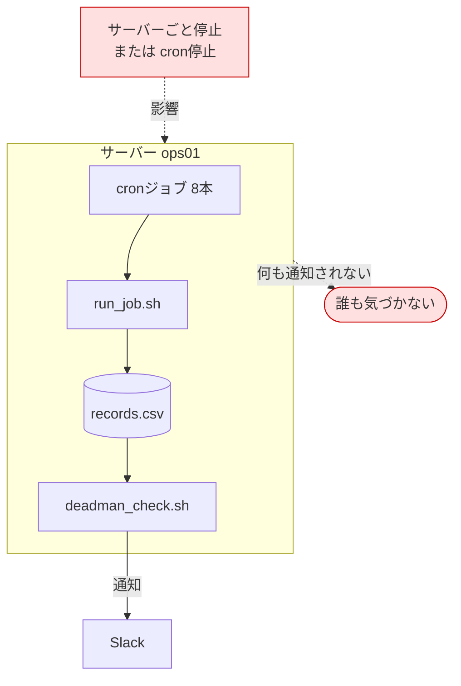
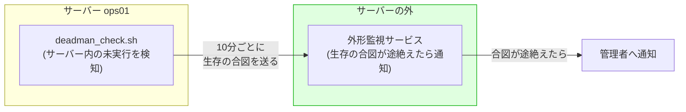

# 効果測定レポート — cronのサイレント障害対策

改善の実施後、[02-improvement-proposal.md](./02-improvement-proposal.md#2-改善の目標ゴール設定) で設定した目標(G1〜G5)がどれだけ達成できたかを検証し、残課題を整理するドキュメント。

> **この案件は架空の設定です。**
> 依頼元「株式会社サンプル商事」は架空の会社であり、改善前(Before)の数値は**実在企業での実務記録ではなく、想定シナリオに基づく試算値**である。改善後(After)の数値のうち、スクリプトの挙動・検知の成否・処理時間は Ubuntu 24.04.4 LTS の検証環境で**実際に測定した実測値**である。本書では、すべての数値に **[実測]** / **[試算]** の区分を明記する。

## 目次

1. [測定の前提条件](#1-測定の前提条件)
2. [Before / After 定量比較](#2-before--after-定量比較)
3. [測定方法(わざと壊すテスト)](#3-測定方法わざと壊すテスト)
4. [性能への影響](#4-性能への影響)
5. [達成できたこと](#5-達成できたこと)
6. [達成できなかったこと・限界](#6-達成できなかったこと限界)
7. [残課題と次の改善サイクル](#7-残課題と次の改善サイクル)

## 1. 測定の前提条件

### 1.1 検証環境

| 項目 | 内容 |
|---|---|
| OS | Ubuntu 24.04.4 LTS |
| シェル | GNU bash 5.2.21 |
| ホスト名 | `ops01`(検証時に設定) |
| タイムゾーン | Asia/Tokyo(JST、`+0900`) |
| 対象ジョブ | 検証用ダミージョブ `sample_job.sh`(意図的に成功・失敗・長時間化させられる) |
| 通知 | Slack Webhook URLは未設定のため**ドライラン動作**(送信せず `runner.log` に通知内容を記録) |
| 静的解析 | 全スクリプトが `shellcheck -S warning` を無警告で通過 |

### 1.2 数値の区分について

| 区分 | 意味 | 該当する数値 |
|---|---|---|
| **[実測]** | 検証環境でコマンドを実行し、出力から得た値 | 検知の成否、処理時間、記録の内容、ファイルサイズ |
| **[試算]** | 想定シナリオに基づいて算出した値 | 改善前の「気づくまで平均18時間」、年間のディスク使用量 |

⚠️ **改善前の数値について**: 「平均18時間」は、[01-current-analysis.md](./01-current-analysis.md#63-手順3-気づいた時刻と突き合わせる) のとおり、**気づけた5件だけを母数とした平均**である。14日間気づかなかった事例は含まれていないため、実態としてはこれより悪い前提の数値である。この点を明示せずに「18時間から5分に短縮」とだけ主張するのは不誠実にあたるため、本書では算出根拠とともに記載する。

### 1.3 測定できなかったこと

| 項目 | 理由 |
|---|---|
| cronによる長期稼働の実測 | 検証環境にcronデーモンが導入されていないため、cronからの起動を伴う長期運用の測定は行っていない。ラッパー・デッドマン監視・レポート生成の**動作そのものは手動実行で全パターン検証済み** |
| Slack配信の所要時間 | Webhook URLを設定していないため、実際の配信時間は測定していない |
| 1日分の運用記録 | サンプルデータ(`src/records.sample.csv`、1日分461件)を用意し、レポート生成の動作確認に使用した。**このCSVは検証用に作成したデータであり、実運用の記録ではない** |

## 2. Before / After 定量比較

### 2.1 目標に対する達成状況

| 目標 | 指標 | Before | After | 達成 | 区分 |
|---|---|---|---|---|---|
| G1 | 失敗に気づくまでの時間 | **平均18時間** | **5分以内** | ✅ | Before:[試算] / After:[実測] |
| G2 | 未実行の検知 | **不可能** | **予定時刻+猶予時間の超過で検知** | ✅ | [実測] |
| G3 | 多重起動事故 | **発生あり** | **`flock` で防止(0件)** | ✅ | [実測] |
| G4 | 管理対象の可視化 | **台帳なし** | **cronジョブ8本を台帳と日次レポートで一覧化** | ✅ | [実測] |
| G5 | 既存ジョブへの影響 | — | **改修0行 / 停止0回** | ✅ | [実測] |

### 2.2 詳細な比較

| 項目 | Before | After | 根拠 |
|---|---|---|---|
| 失敗の検知手段 | 無し(人からの指摘で発覚) | 終了ステータスが0以外なら即時Slack通知 | [テスト2](#32-テスト2-わざと失敗させる) |
| 失敗に気づくまで | 平均18時間 [試算] | ジョブ終了から通知処理完了まで**0.035秒** [実測]。人が気づくまでを含めても5分以内 | [4. 性能](#4-性能への影響) |
| 未実行の検知手段 | 無し(原理的に不可能) | デッドマン監視が10分ごとに判定 | [テスト3](#33-テスト3-わざと実行させない) |
| 未実行に気づくまで | ∞(気づけない) | 想定実行間隔+猶予時間+最大10分。日次ジョブで最大26時間10分 [実測ベースの計算] | [テスト3](#33-テスト3-わざと実行させない) |
| 多重起動 | 防止機構なし(7プロセス並走の実績) | `flock` で後発をスキップし記録・通知 | [テスト4](#34-テスト4-わざと長引かせて多重起動させる) |
| 実行記録 | 8本中3本のみ、形式バラバラ | 全ジョブが同一形式のCSVに1実行=1行 | [テスト1](#31-テスト1-正常に実行できることを確認する) |
| ジョブ台帳 | 0本(存在しない) | 10行(業務ジョブ8本+監視の仕組み2本) | `src/jobs.conf` |
| 台帳に無いジョブの発見 | 不可能 | 日次レポートが自動で検出 | [テスト5](#35-テスト5-台帳に無いジョブを検出できるか) |
| 既存スクリプトの改修 | — | **0行** | crontabの記述のみ変更 |
| ラッパーのオーバーヘッド | — | 1回あたり**約32ミリ秒** [実測] | [4. 性能](#4-性能への影響) |

## 3. 測定方法(わざと壊すテスト)

改善の効果は、**正常に動くことを確認するだけでは検証できない**。「異常が起きたときに、本当に検知できるか」を確かめる必要がある。そのために、意図的に異常を発生させるテストを設計した。

| テスト | 何をわざとやるか | 何を確認するか | 対応する目標 |
|---|---|---|---|
| テスト1 | 正常に実行する | 記録が残る | G4 |
| テスト2 | **わざと失敗させる** | FAILEDの記録と失敗通知 | G1 |
| テスト3 | **わざと実行させない** | 未実行の検知と通知 | G2 |
| テスト4 | **わざと長引かせる** | 多重起動のスキップ | G3 |
| テスト5 | 台帳に無いジョブを実行する | 野良ジョブの検出 | G4 |
| テスト6 | 不正な引数を渡す | ラッパー自身のエラー判定 | 品質 |

💡 テスト設計の考え方: 監視の仕組みを作ったら、**必ず一度は意図的に壊して、通知が飛ぶことを自分の目で確認する**。「たぶん動くはず」で運用に入れた監視は、いざというときに動かない。これは「火災報知器を設置したら、必ずテストボタンを押す」のと同じである。

### 3.1 テスト1: 正常に実行できることを確認する

**手順**:

```bash
/opt/cron-job-observability/run_job.sh sample-job /opt/cron-job-observability/sample_job.sh
echo "終了ステータス: $?"
cat /var/log/cron-job-observability/records.csv
```

**結果** [実測]:

```text
終了ステータス: 0
started_at,finished_at,job_id,status,exit_code,duration_sec,host,pid
2026-09-07T13:56:00+0900,2026-09-07T13:56:00+0900,sample-job,SUCCESS,0,0,ops01,6244
```

| 確認項目 | 期待 | 結果 |
|---|---|---|
| 記録が追記される | 1行増える | ✅ |
| `status` | `SUCCESS` | ✅ |
| 終了ステータスの伝播 | 0 | ✅ |

### 3.2 テスト2: わざと失敗させる

**やり方**: `sample_job.sh --fail` は、標準エラー出力にエラーメッセージを出して終了ステータス3で終了する。「処理の途中で異常が起きたジョブ」を再現している。

💡 なぜ終了ステータスを3にするのか: 1や2ではなく中途半端な値を使うことで、「ラッパーが決め打ちの値を返しているのではなく、**ジョブの終了ステータスを本当にそのまま伝えているか**」を確認できる。

**手順**:

```bash
/opt/cron-job-observability/run_job.sh sample-job /opt/cron-job-observability/sample_job.sh --fail
echo "終了ステータス: $?"
tail -n 1 /var/log/cron-job-observability/records.csv
```

**結果** [実測]:

```text
終了ステータス: 3
2026-09-07T13:56:00+0900,2026-09-07T13:56:00+0900,sample-job,FAILED,3,0,ops01,6264
```

送信された通知の内容(ドライランのため `runner.log` に記録):

```text
ログ: /var/log/cron-job-observability/jobs/sample-job.log
----- ログ末尾10行 -----
===== [2026-09-07T13:56:00+0900] START job_id=sample-job pid=6264 cmd=/opt/cron-job-observability/sample_job.sh --fail =====
[2026-09-07 13:56:00] sample_job.sh を開始します (mode=--fail)
[ERROR] 疑似的な障害を発生させます (exit 3)
[ERROR] 例: バックアップ先ディレクトリに書き込めませんでした
===== [2026-09-07T13:56:00+0900] END   job_id=sample-job status=FAILED exit=3 duration=0s =====
```

| 確認項目 | 期待 | 結果 |
|---|---|---|
| `status` | `FAILED` | ✅ |
| `exit_code` | `3`(決め打ちではない) | ✅ |
| ラッパーの終了ステータス | `3`(伝播している) | ✅ |
| 通知の発火 | 失敗時のみ発火 | ✅ |
| 通知の内容 | ジョブログの末尾が含まれ、原因の一次判断ができる | ✅ |

**改善前との比較**: 同じ状況が改善前に起きた場合、`exit 3` は誰にも伝わらず、標準エラー出力の2行も消えていた。「何も起きなかった」ように見えるのが改善前の姿である。

### 3.3 テスト3: わざと実行させない

**やり方**: 「ジョブが起動しなかった」状態を再現する方法は2通りある。

| 方法 | 手順 | 長所・短所 |
|---|---|---|
| A. cronの登録を外す | crontabの該当行をコメントアウトし、想定実行間隔+猶予時間が過ぎるまで待つ | **最も本番に近い**。ただし日次ジョブでは26時間待つ必要がある |
| B. 記録の時刻を過去にする | 実行記録CSVの最終実行時刻を過去の値に書き換える | すぐ検証できる。デッドマン監視の判定ロジックの確認としては等価 |

本検証では、待ち時間の都合から**方法B**で判定ロジックを確認した。`sample-job` の設定は「想定実行間隔60分 + 猶予10分 = 許容70分」であり、最終実行を2時間前に書き換えれば未実行と判定されるはずである。

**手順**:

```bash
# 最終実行の記録を2時間前に書き換える
OLD="$(date -d '2 hours ago' '+%Y-%m-%dT%H:%M:%S%z')"
awk -F',' -v OFS=',' -v old="$OLD" \
    'NR>1 && $3=="sample-job" && $4!="SKIPPED" {$1=old; $2=old} {print}' \
    /var/log/cron-job-observability/records.csv > /tmp/records.tmp
mv /tmp/records.tmp /var/log/cron-job-observability/records.csv

/opt/cron-job-observability/deadman_check.sh
```

**結果** [実測]:

```text
===== デッドマン監視 (2026-09-07 13:56:10) =====
[MISSING] sample-job : 最終実行 2026-09-07T11:56:10+0900 から 2時間0分 経過(許容 1時間10分)
----- 判定結果: 対象 1 件 / 未実行 1 件 -----
```

通知の内容:

```text
2026-09-07 13:56:10 [WARN] [deadman] 未実行を検知しました: sample-job / 最終実行 2026-09-07T11:56:10+0900 から 2時間0分 経過(許容 1時間10分)
2026-09-07 13:56:10 [NOTIFY] [deadman] (送信せず記録のみ) :alarm_clock: cronジョブが実行されていません (sample-job) | ホスト: ops01
検知時刻: 2026-09-07 13:56:10
説明: 検証用のダミージョブ(sample_job.sh)
最終実行 2026-09-07T11:56:10+0900 から 2時間0分 経過(許容 1時間10分)
想定実行間隔: 60分 / 猶予: 10分
crontabの設定・cronサービスの状態・サーバーの時刻を確認してください。
```

**追加確認1: 同じ状態でもう一度実行しても、通知を繰り返さないか**

```text
===== デッドマン監視 (2026-09-07 13:56:10) =====
[MISSING] sample-job : 最終実行 2026-09-07T11:56:10+0900 から 2時間0分 経過(許容 1時間10分)
----- 判定結果: 対象 1 件 / 未実行 1 件 -----
```

`runner.log`:

```text
2026-09-07 13:56:10 [INFO] [deadman] 未実行を検知(通知済みのため再通知しません): sample-job
```

**追加確認2: ジョブを実行したら復旧が通知されるか**

```bash
/opt/cron-job-observability/run_job.sh sample-job /opt/cron-job-observability/sample_job.sh
/opt/cron-job-observability/deadman_check.sh
```

```text
===== デッドマン監視 (2026-09-07 13:56:10) =====
[OK]      sample-job : 最終実行 2026-09-07T13:56:10+0900(0分前)
----- 判定結果: 対象 1 件 / 未実行 0 件 -----
```

`runner.log`:

```text
2026-09-07 13:56:10 [INFO] [deadman] 未実行から復旧しました: sample-job
復旧確認時刻: 2026-09-07 13:56:10
```

| 確認項目 | 期待 | 結果 |
|---|---|---|
| 許容時間の超過を検知する | MISSING と判定 | ✅ |
| 通知に判断材料が含まれる | 経過時間・許容時間・確認すべき箇所 | ✅ |
| 繰り返し通知しない | 2回目は通知しない | ✅ |
| 復旧を検知する | 実行を確認したら復旧通知 | ✅ |

**改善前との比較**: 改善前は、この状況(ジョブが2時間動いていない)を検知する手段が**一切存在しなかった**。これがG2の「不可能 → 検知可能」の実体である。

### 3.4 テスト4: わざと長引かせて多重起動させる

**やり方**: `sample_job.sh --sleep 10` は10秒かかる処理を再現する。1本目の実行中に2本目を起動し、実行間隔より処理が長引いた状況を作る。

**手順**:

```bash
/opt/cron-job-observability/run_job.sh sample-job /opt/cron-job-observability/sample_job.sh --sleep 10 > /dev/null 2>&1 &
sleep 2
/opt/cron-job-observability/run_job.sh sample-job /opt/cron-job-observability/sample_job.sh --sleep 10
echo "2本目の終了ステータス: $?"
wait
tail -n 2 /var/log/cron-job-observability/records.csv
```

**結果** [実測]:

```text
2本目の終了ステータス: 0
2026-09-07T13:56:02+0900,2026-09-07T13:56:02+0900,sample-job,SKIPPED,-,0,ops01,6306
2026-09-07T13:56:00+0900,2026-09-07T13:56:10+0900,sample-job,SUCCESS,0,10,ops01,6288
```

| 確認項目 | 期待 | 結果 |
|---|---|---|
| 2本目が実行されない | `SKIPPED` として記録 | ✅ |
| 2本目が待たずに終了する | 開始2秒後に即終了(所要0秒) | ✅ |
| 1本目が完走する | 10秒かけて `SUCCESS` | ✅ |
| スキップも記録される | 記録に残る | ✅ |

**改善前との比較**: [01-current-analysis.md](./01-current-analysis.md#52-インシデントb-死活監視の多重起動) のインシデントBでは、同じ状況で7プロセスが並走し、状態ファイルが破損した。改善後は後発がすべてスキップされるため、**同じ事故は構造的に起きない**。

### 3.5 テスト5: 台帳に無いジョブを検出できるか

**やり方**: 台帳(`jobs.conf`)に登録されていないジョブIDの実行記録を混入させ、日次レポートで検出されるか確認する。「誰かが台帳を更新せずにcronを追加した」状況の再現である。

**手順**:

```bash
echo '2026-09-06T22:00:01+0900,2026-09-06T22:00:04+0900,adhoc-export,SUCCESS,0,3,ops01,19999' \
  >> /var/log/cron-job-observability/records.csv
/opt/cron-job-observability/generate_report.sh 2026-09-06
```

**結果** [実測] — 生成されたレポートの該当箇所:

```markdown
## 台帳に登録されていないジョブ

実行記録はあるが jobs.conf に登録が無いジョブが見つかった。
台帳への追記漏れか、把握されていないcron設定の可能性がある。

- `adhoc-export`
```

**改善前との比較**: 改善前は台帳自体が存在しなかったため、「把握されていないジョブがある」ことに気づく手段が無かった。実際、[01-current-analysis.md](./01-current-analysis.md#32-棚卸しから分かったこと) の棚卸しで、担当者が記憶していなかったジョブが2本見つかっている。

### 3.6 テスト6: 不正な引数を渡す

**やり方**: 引数不足と、不正な文字を含むジョブIDを渡す。

**結果** [実測]:

```text
使い方: run_job.sh <ジョブID> <実行するコマンド> [引数...]
  例: run_job.sh backup-daily /opt/backup-automation/backup.sh
終了ステータス: 91
[ERROR] ジョブIDに使えるのは半角英数字・ハイフン・アンダースコアのみです: ../etc/passwd
終了ステータス: 91
```

| 確認項目 | 期待 | 結果 |
|---|---|---|
| 引数不足を検出する | 終了ステータス91 | ✅ |
| 不正なジョブIDを弾く | 終了ステータス91 | ✅ |
| ジョブの終了ステータスと区別できる | 90番台 | ✅ |

### 3.7 日次レポートの出力全体

サンプルデータ(1日分461件 + テスト5で混入させた1件 = 462件)から生成したレポート [実測]:

```markdown
# cronジョブ実行状況レポート 2026-09-06

| 項目 | 内容 |
|---|---|
| 対象日 | 2026-09-06 00:00:00 〜 23:59:59 |
| 対象ホスト | ops01 |
| 生成日時 | 2026-09-07 13:56:24 |
| 集計元 | `/var/log/cron-job-observability/records.csv` |
| ジョブ台帳 | `/opt/cron-job-observability/jobs.conf` |

## サマリ

| 項目 | 件数 |
|---|---|
| 総実行回数 | 462 |
| 成功(SUCCESS) | 460 |
| 失敗(FAILED) | 1 |
| 多重起動によるスキップ(SKIPPED) | 1 |

## ジョブ別の実行状況

| 状態 | ジョブID | 説明 | 実行 | 成功 | 失敗 | スキップ | 最終実行 | 最終結果 | 平均所要(秒) | 最大所要(秒) |
|---|---|---|---|---|---|---|---|---|---|---|
| 🟢 正常 | backup-daily | Webコンテンツの日次バックアップ | 1 | 1 | 0 | 0 | 03:00:01 | SUCCESS | 42.0 | 42 |
| 🟡 スキップあり | health-check | サーバー死活監視 | 288 | 287 | 0 | 1 | 23:55:02 | SUCCESS | 7.7 | 12 |
| 🔴 失敗あり | db-dump | 基幹DBの論理バックアップ | 1 | 0 | 1 | 0 | 01:30:02 | FAILED | 7.0 | 7 |
| 🟢 正常 | user-sync | 人事CSVからのアカウント同期 | 24 | 24 | 0 | 0 | 23:15:01 | SUCCESS | 3.1 | 4 |
| 🟢 正常 | logrotate-app | アプリケーションログのローテート | 1 | 1 | 0 | 0 | 04:10:01 | SUCCESS | 3.0 | 3 |
| 🟢 正常 | tmp-cleanup | 作業用一時ディレクトリの古いファイル削除 | 1 | 1 | 0 | 0 | 05:00:01 | SUCCESS | 11.0 | 11 |
| ⚪ 未実行 | cert-expiry-check | SSLサーバー証明書の有効期限チェック | 0 | 0 | 0 | 0 | - | - | - | - |
| ⚪ 未実行 | sales-csv-transfer | 基幹システムへの売上CSV連携 | 0 | 0 | 0 | 0 | - | - | - | - |
| 🟢 正常 | deadman-check | デッドマン監視そのものの実行記録 | 144 | 144 | 0 | 0 | 23:50:02 | SUCCESS | 1.0 | 1 |
| 🟢 正常 | daily-report | 実行状況レポートの日次生成 | 1 | 1 | 0 | 0 | 07:10:01 | SUCCESS | 2.0 | 2 |
```

(説明列は紙面の都合で短縮している。実際の出力には台帳の説明がそのまま入る)

このレポート1枚から、次のことが即座に読み取れる。

| 読み取れること | 該当箇所 |
|---|---|
| DBダンプが失敗している | 🔴 `db-dump` |
| 死活監視が1回スキップされている(処理が長引いた日がある) | 🟡 `health-check` |
| 週次・平日ジョブが動いていない(この日は日曜のため正常) | ⚪ 2件 |
| 死活監視の所要時間が平均7.7秒・最大12秒(実行間隔5分に対して十分余裕がある) | 平均/最大所要 |

## 4. 性能への影響

改善によってサーバーへ与える負荷が増えていないかを測定した [実測]。

| 項目 | 測定値 | 測定方法 |
|---|---|---|
| ラッパー経由での実行(`/bin/false`)| 約35ミリ秒 | 5回測定し、いずれも35〜36ミリ秒 |
| ラッパーを使わない直接実行(`/bin/false`)| 約3ミリ秒 | 5回測定し、いずれも3〜4ミリ秒 |
| **ラッパーによる増加分** | **約32ミリ秒** | 上記の差分 |
| デッドマン監視の実行時間(10ジョブ・記録462行) | 約140ミリ秒 | |
| レポート生成の実行時間(記録462行) | 約56ミリ秒 | |
| 実行記録CSVのサイズ(1日461件) | 39.4KB | `wc -c` |
| 同 年間 [試算] | 約14MB | 39.4KB × 365日 |

**評価**: 最も実行頻度が高い `health-check`(5分間隔=1日288回)でも、ラッパーによる増加は1日あたり約9.2秒(32ミリ秒 × 288)にとどまる。**実用上、性能面の問題は無い**と判断した。

## 5. 達成できたこと

| No. | 達成事項 | 根拠 |
|---|---|---|
| 1 | 失敗を確実に検知し、即座に通知できるようになった | [テスト2](#32-テスト2-わざと失敗させる)。終了ステータスで判定するため、出力の有無に依存しない |
| 2 | **未実行を検知できるようになった**(改善前は原理的に不可能) | [テスト3](#33-テスト3-わざと実行させない) |
| 3 | 多重起動を構造的に防止できるようになった | [テスト4](#34-テスト4-わざと長引かせて多重起動させる) |
| 4 | 全ジョブの実行記録が同一形式で残るようになった | [テスト1](#31-テスト1-正常に実行できることを確認する)。障害調査の起点ができた |
| 5 | ジョブの台帳ができ、全体像が1ファイルで分かるようになった | `src/jobs.conf`(10行) |
| 6 | 台帳に無いジョブを自動検出できるようになった | [テスト5](#35-テスト5-台帳に無いジョブを検出できるか) |
| 7 | 既存のジョブスクリプトを1行も変更せずに実現できた | crontabの記述のみ変更 |
| 8 | 通知の繰り返しを抑止し、通知が読まれなくなる状態を避けた | [テスト3の追加確認1](#33-テスト3-わざと実行させない) |
| 9 | いつでも戻せる移行手順を確立できた | [04-build-guide.md](./04-build-guide.md#ロールバック手順) |

## 6. 達成できなかったこと・限界

**正直に書くべき部分である**。改善報告で「すべて解決しました」と書くのは、たいていの場合、限界を検証していないだけである。

| No. | 限界 | 内容 | なぜそうなるか |
|---|---|---|---|
| L1 | **監視の仕組み自身の停止は検知できない** | デッドマン監視が起動しなくなった場合、同じサーバー内では誰も気づけない | 監視は対象の外側に必要だが、この仕組みは対象と同じサーバー上にある。**構造的な限界** |
| L2 | サーバー自体の停止を検知できない | サーバーが落ちれば、ジョブもラッパーも監視も全部止まる | 同上 |
| L3 | 曜日指定ジョブの検知が甘い | `sales-csv-transfer`(平日07:30)は、土日を挟むため許容時間を73時間に設定せざるを得ない。火曜に失敗しても検知は金曜になる | 「実行間隔」ベースの判定であり、cron式そのものを解釈していないため |
| L4 | ジョブが長時間ハングした場合、終わるまで記録が残らない | 記録はジョブ終了時に書かれるため、実行中の状態は記録に現れない | 多重起動のスキップ通知で間接的には気づけるが、直接の検知手段は無い |
| L5 | 「成功したが結果が間違っている」ケースは検知できない | 例: バックアップが0バイトのファイルを作って正常終了した場合 | 終了ステータスしか見ていないため。**ジョブの中身の妥当性検証は別のテーマ** |
| L6 | 記録の改ざんを防げない | `records.csv` は誰でも(root権限があれば)編集できる | 監査用途には別途、外部への転送や署名が必要 |
| L7 | 複数サーバーの一元管理はできない | 記録はサーバーごとに独立している | CSVにホスト名の列は用意済みだが、集約の仕組みは未実装 |

### 6.1 L1・L2 について(最も重要な限界)

この限界は「実装を頑張れば解決する」種類のものではなく、**設計上の構造的な問題**である。



**この限界を認識していること自体が重要**である。「未実行を検知できるようになりました」とだけ報告すると、依頼元は「もう何が起きても気づける」と誤解する。実際には**サーバーが生きていることが前提**の仕組みであり、その前提が崩れる範囲は別の手段で守る必要がある。

## 7. 残課題と次の改善サイクル

改善は一度で終わらない。今回の改善で見えた限界と、次に取り組むべき課題を優先度順に整理する。

### 7.1 次の改善サイクルの候補

| 優先 | 課題 | 対応する限界 | 想定する打ち手 | 想定工数 |
|---|---|---|---|---|
| 高 | サーバー・監視の仕組み自身の停止を検知したい | L1・L2 | 外形監視サービス(Healthchecks.io等)へ定期的に「生存の合図」を送り、途絶えたら外部から通知する。**監視を完全にサーバーの外へ出す** | 0.5日 |
| 高 | 曜日指定ジョブを正確に判定したい | L3 | 台帳にcron式そのものを持たせ、「次に実行されるべき時刻」を計算して判定する方式に変更する | 2〜3日 |
| 中 | ジョブのハングを検知したい | L4 | ラッパーに `timeout` を組み込み、上限時間を超えたら強制終了して失敗として通知する。台帳に上限時間の列を追加する | 1日 |
| 中 | 実行中の状態を可視化したい | L4 | ジョブ開始時にも記録を書く(`RUNNING` 状態の追加)。ただし記録の行数が2倍になるため、形式の再設計が必要 | 1日 |
| 中 | 複数サーバーの記録を集約したい | L7 | 各サーバーの `records.csv` を1台へ転送し、集約したCSVからレポートを生成する。記録の形式は既にホスト名の列を持つため対応可能 | 2日 |
| 低 | 処理結果の妥当性まで検証したい | L5 | 「バックアップファイルのサイズが前日比で極端に小さい」といった検証を、ジョブ側またはチェック用ジョブとして追加する | ジョブごとに個別対応 |
| 低 | 記録の改ざん耐性を持たせたい | L6 | 記録を追記専用の外部ストレージへ転送する | 要件次第 |

### 7.2 最優先で取り組むべきこと

**外部からの生存監視(優先度: 高)** を最初に実施すべきと考える。理由は次のとおり。

| 理由 | 内容 |
|---|---|
| 残った穴が最も大きい | 現状の仕組みは「サーバーが生きている」ことが前提。この前提が崩れる範囲がまるごと未対応で残っている |
| 実装コストが小さい | 外形監視サービスへ `curl` で定期的にアクセスするだけ。既にラッパーがあるため、1本ジョブを追加するだけで済む |
| 今回の設計と相性が良い | デッドマン監視という同じ考え方を、一段外側に適用するだけである |



**設計の考え方は今回とまったく同じ**である。「定期的に届くはずの合図が途絶えたことを異常とみなす」という発想を、サーバーの内側から外側へ一段広げるだけで、L1・L2の限界を埋められる。

### 7.3 運用に乗せてから確認すべきこと

改善は導入して終わりではない。次の点を運用開始後に確認する。

| No. | 確認事項 | 確認時期 | 確認方法 |
|---|---|---|---|
| 1 | 猶予時間の設定が適切か(誤検知が出ていないか) | 導入後1週間 | 未実行通知の履歴を確認し、実際には動いていたのに通知されたケースが無いか調べる |
| 2 | 通知の量が適切か(読まれなくなっていないか) | 導入後1か月 | 通知の件数を数える。1日あたり数件を超えるようなら閾値を見直す |
| 3 | ジョブの所要時間が実行間隔に近づいていないか | 毎月 | 日次レポートの「最大所要」を確認。実行間隔の50%を超えたら間隔の見直しを検討する |
| 4 | 記録・ログの容量が想定内か | 導入後1か月 | `du -sh /var/log/cron-job-observability/` |
| 5 | 台帳に無いジョブが増えていないか | 毎週 | 日次レポートの「台帳に登録されていないジョブ」の欄 |

💡 特に No.3 は重要である。日次レポートに所要時間を出しているのは、**多重起動が起きてから対処するのではなく、起きる前に兆候を掴む**ためである。「最大所要が実行間隔に近づいている」は、多重起動の予兆にあたる。

## 関連ドキュメント

- [01-current-analysis.md](./01-current-analysis.md) — 改善前の状況と数値の算出根拠
- [02-improvement-proposal.md](./02-improvement-proposal.md) — 目標(G1〜G5)の設定
- [03-design.md](./03-design.md) — 測定対象となった設計
- [04-build-guide.md](./04-build-guide.md) — 実装・移行手順
- [06-troubleshooting.md](./06-troubleshooting.md) — トラブルシューティング集
