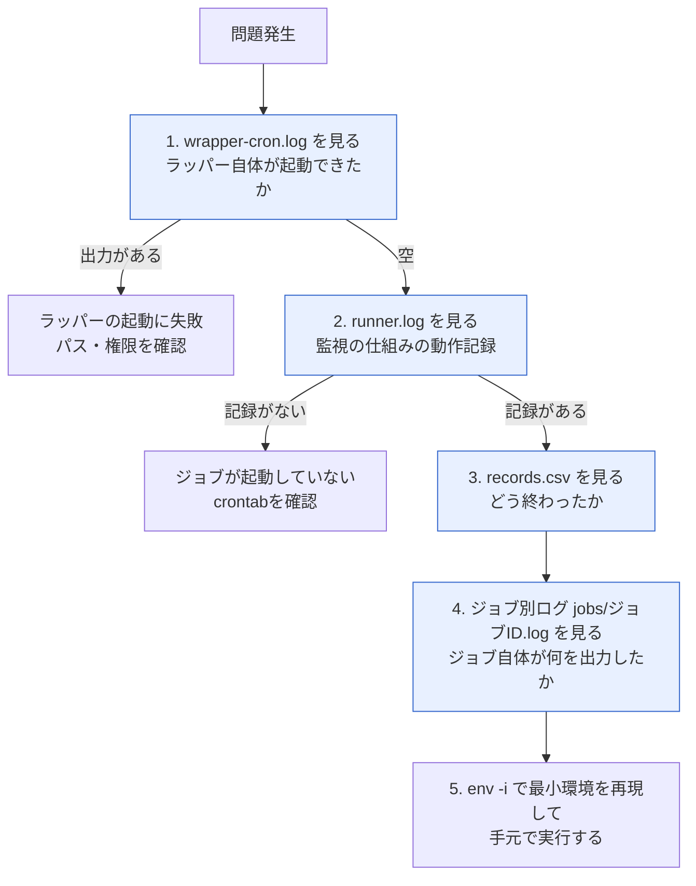

# トラブルシューティング集 — cronジョブの可視化と失敗・未実行検知

導入・運用中に遭遇しやすい問題と、その原因・対処法をQ&A形式でまとめたもの。

> **この案件は架空の設定です。** 依頼元は架空の会社である。本書のコマンドと出力例は、Ubuntu 24.04.4 LTS の検証環境で実際に実行して確認したもの(出力例)と、環境の都合で再現できなかったもの(出力イメージ)を区別して記載している。

## 目次

| No. | 症状 |
|---|---|
| [Q1](#q1-cronからの実行だけ-command-not-found-で失敗する) | cronからの実行だけ `command not found` で失敗する |
| [Q2](#q2-ラッパー経由にしたら出力先やリダイレクトがおかしくなった) | ラッパー経由にしたら出力先やリダイレクトがおかしくなった |
| [Q3](#q3-flockのロックが残ってジョブがずっとskippedになる) | `flock` のロックが残ってジョブがずっとSKIPPEDになる |
| [Q4](#q4-デッドマン監視が誤検知する) | デッドマン監視が誤検知する / 記録の時刻がずれている |
| [Q5](#q5-移行直後に全ジョブが未実行として通知された) | 移行直後に全ジョブが「未実行」として通知された |
| [Q6](#q6-ジョブが失敗しているのに通知が来ない) | ジョブが失敗しているのに通知が来ない(成功扱いになる) |
| [Q7](#q7-slackに通知が届かない) | Slackに通知が届かない |
| [Q8](#q8-日次レポートにジョブが表示されない) | 日次レポートにジョブが表示されない |
| [Q9](#q9-実行記録csvやログが大きくなりすぎた) | 実行記録CSVやログが大きくなりすぎた |

## Q1 cronからの実行だけ command not found で失敗する

### 症状

手動で `run_job.sh` を実行すると正常に終わるのに、cronから実行されたときだけ失敗する。実行記録には終了ステータス `127` が残っている。

```bash
grep FAILED /var/log/cron-job-observability/records.csv | tail -n 1
```

出力イメージ:

```text
2026-09-07T04:10:01+0900,2026-09-07T04:10:01+0900,logrotate-app,FAILED,127,0,ops01,7801
```

### 原因

**終了ステータス127 = 「コマンドが見つからない」**。cronの実行環境は、手でログインしたときの環境とは別物である。

| 項目 | 対話シェル | cron |
|---|---|---|
| `PATH` | `/usr/local/bin` などを含む長い値 | **短い**(通常 `/usr/bin:/bin`) |
| `.bashrc` / `.profile` | 読み込まれる | **読み込まれない** |

`/usr/local/bin` や `/usr/sbin` にあるコマンド(`logrotate` など)を、パスを省略して書いていると、cronからは見つけられない。

### 確認方法

ラッパーがジョブの出力をログに残しているため、原因のメッセージがそのまま残っている。

```bash
tail -n 5 /var/log/cron-job-observability/jobs/logrotate-app.log
```

検証環境で、cron相当の最小環境を `env -i` で再現した実際の出力:

```text
===== [2026-09-07T04:40:39+0000] START job_id=sample-job pid=6875 cmd=./job_with_path.sh =====
PATH=/usr/bin:/bin
./job_with_path.sh: line 4: myreport: command not found
===== [2026-09-07T04:40:39+0000] END   job_id=sample-job status=FAILED exit=127 duration=0s =====
```

💡 **改善前はこのメッセージ自体が見えなかった**。ラッパーを導入したことで、原因が1行で分かるようになっている点も改善効果のひとつである。

### 対処

方法は2つある。両方やっておくのが安全。

**対処1: crontabの先頭でPATHを明示する**

```bash
sudo crontab -e
```

```text
SHELL=/bin/bash
PATH=/usr/local/sbin:/usr/local/bin:/usr/sbin:/usr/bin:/sbin:/bin
```

**対処2: コマンドを絶対パスで書く**

```bash
which logrotate
```

出力例:

```text
/usr/sbin/logrotate
```

crontabの記述を絶対パスにする。

```text
10 4 * * * /opt/cron-job-observability/run_job.sh logrotate-app /usr/sbin/logrotate /etc/logrotate.d/app-custom >> ...
```

### 再現して確認する方法

修正後、cronを待たずに確認したい場合は `env -i` で最小環境を再現できる。

```bash
sudo env -i /bin/bash -c 'PATH=/usr/bin:/bin /opt/cron-job-observability/run_job.sh logrotate-app /usr/sbin/logrotate /etc/logrotate.d/app-custom'
echo "終了ステータス: $?"
```

💡 `env -i` は「環境変数を一切引き継がずにコマンドを実行する」オプション。cronに近い状態を手元で再現できるため、cron絡みの調査で非常に役に立つ。

## Q2 ラッパー経由にしたら出力先やリダイレクトがおかしくなった

### 症状

移行前は `コマンド > /path/to/out.txt` のように出力をファイルに保存していたが、ラッパー経由にしたらファイルが空になった。

### 原因

crontabに次のように書いた場合、リダイレクト(`>`)は**ラッパーの標準出力**に対して適用される。ジョブ本体の出力はラッパーがジョブ別ログへ振り分けているため、リダイレクト先には何も入らない。

```text
# 誤り
0 5 * * * /opt/cron-job-observability/run_job.sh myjob /bin/echo hello > /tmp/out.txt
```

検証環境での実測:

```bash
/opt/cron-job-observability/run_job.sh sample-job /bin/echo hello > /tmp/out.txt
cat /tmp/out.txt
```

出力例:

```text
(空)
```

一方、`hello` はジョブ別ログに記録されている。

同じ理屈で、**パイプ(`|`)も同様の問題を起こす**。

```text
# 誤り: パイプはcronのシェルが先に解釈するため、run_job.sh の出力がgzipに渡される
30 1 * * * /opt/cron-job-observability/run_job.sh db-dump /opt/db-backup/dump.sh | gzip > /var/backups/db.sql.gz
```

### 対処

シェルの機能(リダイレクト・パイプ・変数展開)を使いたい場合は、**`bash -c` で包んでラッパーの内側に入れる**。

```text
30 1 * * * /opt/cron-job-observability/run_job.sh db-dump bash -c '/opt/db-backup/dump.sh | gzip > /var/backups/db.sql.gz' >> /var/log/cron-job-observability/wrapper-cron.log 2>&1
```

検証環境での確認:

```bash
/opt/cron-job-observability/run_job.sh sample-job bash -c 'echo hello > /tmp/out2.txt; exit 0'
echo "rc=$?"
cat /tmp/out2.txt
```

出力例:

```text
rc=0
hello
```

⚠️注意: `bash -c 'A | B'` と書いた場合、記録される終了ステータスは**パイプラインの最後のコマンド(B)のもの**になる。前段(A)の失敗も捉えたい場合は次のようにする。

```text
bash -c 'set -o pipefail; /opt/db-backup/dump.sh | gzip > /var/backups/db.sql.gz'
```

💡 もうひとつのcron特有の注意: **crontabの中では `%` が改行として扱われる**。`date +%Y%m%d` のように `%` を含むコマンドを書く場合は `\%` とエスケープする必要がある。

```text
bash -c '... > /var/backups/db/dump_$(date +\%Y\%m\%d).sql.gz'
```

## Q3 flockのロックが残ってジョブがずっとSKIPPEDになる

### 症状

ジョブが実際には動いていないのに、実行記録が毎回 `SKIPPED` になる。

```bash
tail -n 3 /var/log/cron-job-observability/records.csv
```

出力イメージ:

```text
2026-09-07T14:05:01+0900,2026-09-07T14:05:01+0900,health-check,SKIPPED,-,0,ops01,8102
2026-09-07T14:10:01+0900,2026-09-07T14:10:01+0900,health-check,SKIPPED,-,0,ops01,8155
2026-09-07T14:15:01+0900,2026-09-07T14:15:01+0900,health-check,SKIPPED,-,0,ops01,8203
```

### 原因の切り分け

まず「**誰がロックを掴んでいるか**」を調べる。ロックファイルが存在すること自体は正常であり、問題は「そのファイルを開いたままのプロセスがいるかどうか」である。

```bash
fuser -v /var/lock/cron-job-observability/health-check.lock
```

検証環境で、ジョブの実行中に実行した実際の出力:

```text
                     USER        PID ACCESS COMMAND
/var/lock/cron-job-observability/sample-job.lock:
                     root       7093 F.... bash
                     root       7108 F.... bash
                     root       7110 F.... sleep
```

掴んでいるプロセスが無い場合は次のようになる。

```bash
fuser -v /var/lock/cron-job-observability/sample-job.lock || echo "(ロックを掴んでいるプロセスは無い)"
```

出力例:

```text
(ロックを掴んでいるプロセスは無い)
```

| 調査結果 | 原因 | 対処 |
|---|---|---|
| 対象ジョブのプロセスが動いている | **正常な動作**。前回の実行がまだ終わっていない | ジョブの所要時間が実行間隔を超えていないか確認する([対処A](#対処a-ジョブが本当に長引いている場合)) |
| ジョブとは無関係なプロセスが掴んでいる | ジョブが起動したバックグラウンドプロセスがロックを引き継いでいる([対処B](#対処b-子プロセスがロックを引き継いでいる場合)) | |
| 誰も掴んでいないのにSKIPPEDになる | ロック以外の原因。`runner.log` を確認する | |

### 対処A: ジョブが本当に長引いている場合

日次レポートの「最大所要」で、所要時間の傾向を確認する。

```bash
grep health-check /var/log/cron-job-observability/reports/latest.md
```

出力イメージ:

```text
| 🟡 スキップあり | health-check | サーバー死活監視 | 288 | 285 | 0 | 3 | 23:55:02 | SUCCESS | 240.5 | 380 |
```

平均240秒・最大380秒であれば、5分間隔(300秒)に対して明らかに危険水域である。対処の選択肢は次のとおり。

| 選択肢 | 内容 |
|---|---|
| 実行間隔を延ばす | `*/5` を `*/10` にする。最も簡単で確実 |
| ジョブ自体を速くする | タイムアウト値を短くする、対象を減らす |
| 並列実行を許す | ジョブIDを分割する(監視対象ごとに別ジョブにする)。ただし設計の見直しが必要 |

### 対処B: 子プロセスがロックを引き継いでいる場合

ファイル記述子は子プロセスに引き継がれる。ジョブがバックグラウンドプロセスを残して終了すると、**そのプロセスがロックを掴んだままになる**。

検証環境での再現(バックグラウンドで `sleep 20` を起こして終了するジョブを実行した場合):

```text
                     USER        PID ACCESS COMMAND
/var/lock/cron-job-observability/sample-job.lock:
                     root       7444 F.... sleep
```

この状態では、ラッパーが終了していてもロックは解放されない。

**本ラッパーは既にこの対策を実装済み**である。ジョブ実行時に `9>&-` を付けて、ロック用のファイル記述子を子プロセスへ引き継がせないようにしている。

```bash
"$@" >> "$JOB_LOG" 2>&1 9>&-
```

古い版を使っている場合や、自分でラッパーを実装した場合はこの記述を確認する。

### 緊急の対処: ロックを強制的に解放する

⚠️注意: **ジョブが本当に動いていないことを確認してから**行うこと。動いているジョブを止めると、処理が中途半端な状態で終わる。

```bash
# 1. 掴んでいるプロセスを特定する
fuser -v /var/lock/cron-job-observability/health-check.lock

# 2. そのプロセスが不要なものだと確認したうえで終了させる
sudo kill <PID>

# 3. 解放されたか確認する(ロックが取れれば成功)
flock -n /var/lock/cron-job-observability/health-check.lock -c 'echo "ロックを取得できました"'
```

出力例:

```text
ロックを取得できました
```

💡 **ロックファイルを `rm` で消すのは避ける**。ファイルを消してもロックは消えず(ロックはファイルではなくカーネル内の管理情報)、新しく作られたファイルに対して別のロックが取られるため、結果として**多重起動を許してしまう**。対処すべきはファイルではなくプロセスである。

## Q4 デッドマン監視が誤検知する

### 症状パターン1: 記録の時刻が実際とずれている

実行記録の時刻が、実際の実行時刻と数時間ずれている。

```text
2026-09-07T04:40:39+0000,2026-09-07T04:40:39+0000,sample-job,FAILED,127,0,ops01,6875
```

### 原因

タイムゾーンの指定が失われ、UTC(`+0000`)で記録されている。上の出力は、検証環境で `env -i`(環境変数なし)を使ってcron相当の最小環境を再現したときの実際の記録である。日本時間との差は9時間になる。

### 確認方法

```bash
date
cat /etc/timezone
```

出力例:

```text
Sun Sep  7 14:10:23 JST 2026
Asia/Tokyo
```

cronから見た時刻も確認する(一時的にcronへ登録して確認する方法)。

```text
* * * * * /usr/bin/date >> /tmp/cron-date-check.log 2>&1
```

1〜2分後に確認する。

```bash
cat /tmp/cron-date-check.log
```

出力イメージ:

```text
Sun Sep  7 14:11:01 JST 2026
```

`JST` ではなく `UTC` と表示される場合、cronの環境でタイムゾーンが効いていない。

### 対処

```bash
sudo timedatectl set-timezone Asia/Tokyo
sudo systemctl restart cron
```

crontabの先頭で明示する方法もある。

```text
TZ=Asia/Tokyo
```

⚠️注意: **タイムゾーンを途中で変更すると、それ以前の記録と時刻の連続性が崩れる**。デッドマン監視が「9時間前に実行された」と誤認して未実行と判定する可能性があるため、変更後は一度デッドマン監視を手動実行して結果を確認する。

### 症状パターン2: 実際には動いているのに未実行と通知される

```text
[MISSING] user-sync : 最終実行 2026-09-07T13:15:01+0900 から 1時間25分 経過(許容 1時間20分)
```

### 原因と対処

| 原因 | 確認方法 | 対処 |
|---|---|---|
| 猶予時間が短すぎる | 台帳の値と、実際の実行間隔のばらつきを比較する | `jobs.conf` の猶予時間を延ばす |
| ジョブの実行が遅延している | 記録の `started_at` の間隔を確認する | サーバー負荷やジョブの所要時間を調べる |
| 記録が `SKIPPED` ばかりになっている | 記録の `status` 列を確認する | デッドマン監視は SKIPPED を「実行された」とみなさない([Q3](#q3-flockのロックが残ってジョブがずっとskippedになる)を参照) |

台帳の猶予時間を変更する例:

```bash
sudo sed -i 's/^user-sync,60,20,yes,/user-sync,60,40,yes,/' /opt/cron-job-observability/jobs.conf
grep '^user-sync' /opt/cron-job-observability/jobs.conf
```

出力イメージ:

```text
user-sync,60,40,yes,人事CSVからのアカウント同期(projects/01-user-account-automation)
```

💡 猶予時間を延ばすと誤検知は減るが、**発見が遅れる**というトレードオフがある。安易に大きくせず、「なぜ遅延しているのか」を先に調べるほうがよい。

## Q5 移行直後に全ジョブが未実行として通知された

### 症状

台帳を作った直後にデッドマン監視を動かしたところ、登録した全ジョブが未実行として検知された。

検証環境での実際の出力:

```text
===== デッドマン監視 (2026-09-07 13:38:25) =====
[MISSING] backup-daily : 実行記録が1件もありません(移行直後の場合は初回実行までお待ちください)
[MISSING] health-check : 実行記録が1件もありません(移行直後の場合は初回実行までお待ちください)
[MISSING] db-dump : 実行記録が1件もありません(移行直後の場合は初回実行までお待ちください)
（以下略）
----- 判定結果: 対象 10 件 / 未実行 10 件 -----
```

### 原因

**仕様どおりの動作である**。デッドマン監視は「台帳に有効(`yes`)で登録されているのに実行記録が無い」ジョブを未実行とみなす。まだラッパー経由に移行していないジョブは、当然ながら実行記録を残していない。

### 対処

台帳をいったん全件無効(`no`)にし、**移行が済んだジョブから1本ずつ有効に戻す**。

```bash
# いったん全件を無効にする
sudo sed -i 's/,yes,/,no,/' /opt/cron-job-observability/jobs.conf

# 移行が完了し、記録が増えていることを確認できたジョブだけ有効にする
sudo sed -i 's/^health-check,5,10,no,/health-check,5,10,yes,/' /opt/cron-job-observability/jobs.conf
```

確認:

```bash
grep -c ',yes,' /opt/cron-job-observability/jobs.conf
grep -c ',no,' /opt/cron-job-observability/jobs.conf
```

出力例(1本だけ移行済みの状態):

```text
1
10
```

💡 この「有効フラグ」は、移行の進捗管理表としても機能する。手順の詳細は [04-build-guide.md](./04-build-guide.md#5-2-ジョブ台帳をすべて無効にする) を参照。

## Q6 ジョブが失敗しているのに通知が来ない

### 症状

ジョブのログにはエラーが出ているのに、実行記録は `SUCCESS` になっており、通知も来ない。

### 原因1: パイプや `tee` で終了ステータスが消えている(最も多い)

パイプラインの終了ステータスは、既定では**最後のコマンドのもの**になる。

検証環境での実測:

```bash
bash -c 'false | cat'; echo "パイプあり(pipefailなし): $?"
bash -c 'set -o pipefail; false | cat'; echo "パイプあり(pipefailあり): $?"
bash -c 'false | tee /dev/null > /dev/null'; echo "tee経由: $?"
```

出力例:

```text
パイプあり(pipefailなし): 0
パイプあり(pipefailあり): 1
tee経由: 0
```

`tee` はほぼ必ず成功するため、**`ジョブ | tee ログ` と書くと、ジョブがどれだけ失敗しても常に成功扱いになる**。

### 対処1

`bash -c` の中でパイプを使う場合は `set -o pipefail` を付ける。

```text
/opt/cron-job-observability/run_job.sh db-dump bash -c 'set -o pipefail; /opt/db-backup/dump.sh | gzip > /var/backups/db.sql.gz'
```

### 原因2: ジョブ本体がエラーでも `exit 0` している

ジョブスクリプトの中でエラー処理をした後、`exit 0` で終わっている(あるいは最後のコマンドが成功している)場合。

```bash
tail -n 20 /var/log/cron-job-observability/jobs/<ジョブID>.log
```

ログにエラーが出ているのに終了ステータスが0であれば、ジョブ本体側の問題である。

### 対処2

ジョブ本体を修正するのが本筋だが、**本改善のスコープでは既存ジョブに手を入れない方針**としている([02-improvement-proposal.md](./02-improvement-proposal.md#7-スコープ外にしたこと) S6)。当面の運用としては、日次レポートでジョブログを定期的に確認する。恒久対応は別案件として切り出す。

### 原因3: 通知が無効になっている

```bash
sudo grep -E 'ENABLE_SLACK_NOTIFY|SLACK_WEBHOOK_URL' /opt/cron-job-observability/job_observability.conf
```

出力例:

```text
ENABLE_SLACK_NOTIFY=true
SLACK_WEBHOOK_URL="<YOUR_SLACK_WEBHOOK_URL>"
```

Webhook URLがプレースホルダーのままの場合、スクリプトは**送信せず `runner.log` に記録するだけ**のドライラン動作になる(設定前でも安全に動かすための仕様)。

```bash
grep NOTIFY /var/log/cron-job-observability/runner.log | tail -n 3
```

出力例:

```text
2026-09-07 13:56:00 [NOTIFY] [run_job:sample-job] (送信せず記録のみ) :rotating_light: cronジョブが失敗しました (sample-job) | ホスト: ops01
```

この行が出ていれば、失敗検知そのものは正しく動いている。あとは [Q7](#q7-slackに通知が届かない) に進む。

## Q7 Slackに通知が届かない

### 切り分けの手順

**手順1: 検知自体はできているかを確認する**

```bash
grep NOTIFY /var/log/cron-job-observability/runner.log | tail -n 3
```

| 結果 | 判断 |
|---|---|
| `(送信せず記録のみ)` と出ている | Webhook URLが未設定。手順2へ |
| `Slack通知を送信しました` と出ている | 送信は成功している。Slack側の設定を確認する |
| `Slack通知の送信に失敗しました` と出ている | 通信の問題。手順3へ |
| 何も出ていない | そもそも失敗を検知していない。[Q6](#q6-ジョブが失敗しているのに通知が来ない)へ |

**手順2: Webhook URLを設定する**

```bash
sudo vi /opt/cron-job-observability/job_observability.conf
```

```bash
SLACK_WEBHOOK_URL="<YOUR_SLACK_WEBHOOK_URL>"   # ← ここを実際のURLに書き換える
```

⚠️注意: このURLは実質的なパスワードにあたる。**Gitリポジトリにコミットしないこと**。設定ファイルの権限も確認する。

```bash
ls -l /opt/cron-job-observability/job_observability.conf
```

出力例:

```text
-rw------- 1 root root 3845 Sep  7 13:55 /opt/cron-job-observability/job_observability.conf
```

**手順3: 手動で疎通を確認する**

```bash
source /opt/cron-job-observability/job_observability.conf
curl -s -m 10 -X POST -H 'Content-type: application/json' \
     --data '{"text":"疎通確認"}' "$SLACK_WEBHOOK_URL"
echo "終了ステータス: $?"
```

出力イメージ(成功時):

```text
ok
終了ステータス: 0
```

| 返ってくる内容 | 原因 |
|---|---|
| `ok` | 成功。Slack側のチャンネル設定を確認する |
| `invalid_token` / `no_service` | URLが誤っている、またはWebhookが削除されている |
| 何も返らず終了ステータスが `28` | タイムアウト。サーバーから外部への通信が許可されていない可能性(ファイアウォール・プロキシ) |
| `curl: command not found` | `curl` が入っていない → `sudo apt install curl` |

**手順4: プロキシ環境の場合**

社内ネットワークからの通信にプロキシが必要な場合、cronの環境には設定が引き継がれない。crontabの先頭で指定する。

```text
https_proxy=http://proxy.example.local:8080
```

## Q8 日次レポートにジョブが表示されない

### 症状

実行記録には残っているのに、日次レポートの「ジョブ別の実行状況」の表に出てこない。

### 原因と対処

**原因1: 台帳の有効フラグが `no` になっている**

レポートの表には、台帳で `yes` になっているジョブだけが表示される。

```bash
grep '^<ジョブID>' /opt/cron-job-observability/jobs.conf
```

出力例:

```text
sample-job,60,10,no,検証用のダミージョブ(sample_job.sh)
```

対処: 有効にする。

```bash
sudo sed -i 's/^sample-job,60,10,no,/sample-job,60,10,yes,/' /opt/cron-job-observability/jobs.conf
```

💡 検証用の `sample-job` を既定で `no` にしているのは、**テスト実行の記録で日次レポートを汚さないため**である。

**原因2: 台帳にそもそも登録されていない**

その場合はレポートの別のセクションに表示される。検証環境で、台帳に無いジョブIDの記録を混入させたときの実際の出力:

```markdown
## 台帳に登録されていないジョブ

実行記録はあるが jobs.conf に登録が無いジョブが見つかった。
台帳への追記漏れか、把握されていないcron設定の可能性がある。

- `adhoc-export`
```

対処: 台帳に追記する。**これは不具合ではなく、意図した機能**である(把握されていないジョブを発見するための仕組み)。

**原因3: 対象日が違う**

レポートは日付単位で集計する。既定は「今日」、cronからは `yesterday` を指定して前日分を生成している。

```bash
sudo /opt/cron-job-observability/generate_report.sh 2026-09-06
```

出力例:

```text
レポートを生成しました: /var/log/cron-job-observability/reports/2026-09-06.md
最新版へのコピー: /var/log/cron-job-observability/reports/latest.md
```

**原因4: 記録の日付とレポートの対象日でタイムゾーンが違う**

[Q4](#q4-デッドマン監視が誤検知する) を参照。記録が UTC(`+0000`)で書かれていると、日付の境目がずれる。

## Q9 実行記録CSVやログが大きくなりすぎた

### 症状

`/var/log/cron-job-observability/` の容量が増えている。

```bash
du -sh /var/log/cron-job-observability/
du -sh /var/log/cron-job-observability/*
```

出力イメージ:

```text
1.2G	/var/log/cron-job-observability/
16M	/var/log/cron-job-observability/records.csv
1.1G	/var/log/cron-job-observability/jobs
4.0M	/var/log/cron-job-observability/reports
```

### 原因

`records.csv` は1行が短いため増え方は緩やかである(検証環境の実測で1日461件=約39.4KB、1年で約14MB)。**問題になりやすいのはジョブ別ログのほう**で、ジョブが大量の出力を出す場合に急激に増える。

### 対処1: ログローテートが有効か確認する

```bash
ls -l /etc/logrotate.d/cron-job-observability
sudo logrotate -d /etc/logrotate.d/cron-job-observability
```

`-d` は確認のみ(実際にはローテートしない)。設定が読み込まれているかを確認できる。

未設定の場合は [04-build-guide.md](./04-build-guide.md#step-13-ログローテートを設定する) の手順で設定する。

### 対処2: すぐに容量を空けたい場合

```bash
sudo logrotate -f /etc/logrotate.d/cron-job-observability
du -sh /var/log/cron-job-observability/
```

`-f` は強制実行。ローテート条件(月次・週次)を満たしていなくても、その場でローテートする。

### 対処3: 出力量の多いジョブを特定する

```bash
ls -lhS /var/log/cron-job-observability/jobs/ | head -5
```

出力イメージ:

```text
total 1.1G
-rw-r--r-- 1 root root 1.1G Sep  7 14:20 health-check.log
-rw-r--r-- 1 root root  12M Sep  7 14:10 user-sync.log
-rw-r--r-- 1 root root 240K Sep  7 03:00 backup-daily.log
```

特定のジョブだけが極端に大きい場合、そのジョブが毎回大量の出力を出している。ジョブ側の出力量を減らすか、そのジョブだけローテート条件を厳しくする。

⚠️注意: **`records.csv` を安易に削除しない**。削除すると、デッドマン監視が「実行記録が1件もありません」と判断し、全ジョブが未実行として通知される。過去分が不要な場合も、削除ではなくローテート(圧縮して別名保存)で対応する。

💡 `records.csv` がローテートされた直後は見出し行の無い空ファイルになるが、`run_job.sh` は「ファイルが無ければ見出し行を作る」実装のため、次の実行時に自動的に見出し行が復活する。

## 問題が解決しない場合の調査手順

どの問題にも当てはまらない場合、次の順で情報を集める。



各ログの役割:

| ファイル | 分かること |
|---|---|
| `wrapper-cron.log` | ラッパー自体が起動できなかった致命的な問題。**空であるのが正常** |
| `runner.log` | ラッパー・デッドマン監視の動作記録。通知の内容もここに残る |
| `records.csv` | 各実行の結果(いつ・どれだけかかって・どう終わったか) |
| `jobs/<ジョブID>.log` | ジョブ本体が出力した内容そのもの |

💡 この4つを**この順に**見ると、「監視の仕組みの問題」→「ジョブの問題」の順に切り分けが進む。改善前は最後の1つ(ジョブの出力)すら残っていなかったため、そもそも切り分けができなかった。

## 関連ドキュメント

- [03-design.md](./03-design.md) — 設計と技術要素の解説(終了ステータス・`flock`・cron環境)
- [04-build-guide.md](./04-build-guide.md) — 実装・移行手順とロールバック手順
- [05-effect-measurement.md](./05-effect-measurement.md) — 効果測定と既知の限界
- [src/run_job.sh](./src/run_job.sh) — 共通ラッパー本体
