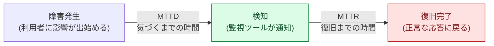
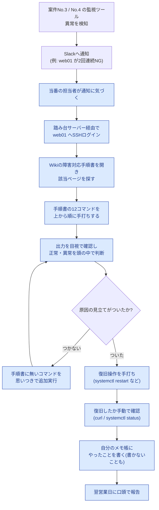
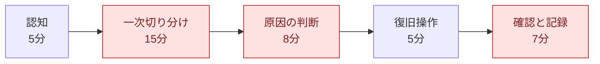

# 01. 現状分析書(As-Is)

## 0. この文書の目的と前提

改善に着手する前に、**「今、何にどれだけ時間がかかっているのか」を数字と事実で押さえる**ための文書である。改善提案([02-improvement-proposal.md](./02-improvement-proposal.md))と効果測定([05-effect-measurement.md](./05-effect-measurement.md))は、すべてこの文書の数値を基準にしている。

> **前提(重要)**: 本案件は**架空の案件設定**である。ここに書かれた「株式会社サンプル商事」の体制・運用実態は、学習用に自分で作成した想定シナリオである。実在の企業での実務実績ではない。ただし、手順書のコマンド・所要時間・スクリプトの動作は、すべて検証環境(Ubuntu Server 22.04 LTS + nginx)で実際に実行して確認している。

## 1. 用語の説明:MTTR とは

この案件全体を貫く指標が **MTTR** である。最初にここを押さえる。

| 用語 | 読み方 | 意味 |
|---|---|---|
| **MTTR** | エムティーティーアール | Mean Time To Repair / Mean Time To Recovery の略。**平均復旧時間**。障害が「検知されてから」「復旧するまで」にかかった時間の平均値 |
| MTBF | エムティービーエフ | Mean Time Between Failures。**平均故障間隔**。障害と障害の間隔の平均。「どれだけ壊れにくいか」の指標 |
| MTTD | エムティーティーディー | Mean Time To Detect。**平均検知時間**。障害が発生してから気づくまでの時間 |

**なぜ MTTR を指標にするのか**

障害対応の改善では「障害をゼロにする」ことは現実的な目標にならない。ハードウェアもソフトウェアも必ずいつかは壊れる。そこで、**壊れることは前提としたうえで、「止まっている時間をどれだけ短くできるか」を目標にする**。これが MTTR である。



案件No.3(ログ監視)・案件No.4(死活監視)の導入によって、上図の **MTTD(気づくまでの時間)は既に短くなっている**(緑)。しかし、その先の **MTTR(赤)は手作業のまま変わっていない** — これが本案件の出発点である。

## 2. 現行の障害対応フロー

Slack通知を受けてから復旧・記録までの流れを図にする。青色の枠が「人が手作業でやっていること」である。



**この図から読み取れること**

- 検知(自動)以降、**復旧・記録まですべてが人の手作業**になっている
- 「判断がつかない場合」のループ(`CMD2`)に入ると、手順書の外に出てしまい、時間も内容も担当者次第になる
- 記録は最後の工程であり、**復旧して安心した後に行うため省略されやすい**

## 3. 手順書に載っている12コマンドの棚卸し

Wikiの手順書に書かれているコマンドを、「何を見て」「何を判断するのか」まで分解して整理した。改善する対象を正確につかむため、また **どのコマンドは自動化してよく、どれは人の判断が要るのかを見極めるため**の作業である。

| # | コマンド | 何を見るか | 何を判断するか | 目安時間 | 自動化の可否 |
|---|---|---|---|---|---|
| 1 | `ssh web01`(踏み台経由) | ログインできるか | サーバー自体が生きているか。ログインすらできなければネットワーク/ホストの問題 | 60秒 | △(接続は人が行う) |
| 2 | `systemctl status nginx` | サービスの状態(active / failed / inactive) | Webサーバーのプロセスが動いているか | 30秒 | ◎ 自動化可 |
| 3 | `systemctl status php-fpm` | アプリケーション側の状態 | 応答を作る側が動いているか | 30秒 | ◎ 自動化可 |
| 4 | `ps aux \| grep nginx` | プロセスの一覧 | systemd の管理外で動いていないか、多重起動していないか | 30秒 | ◎ 自動化可 |
| 5 | `ss -ltnp \| grep :80` | 80番ポートを待ち受けているか | 「プロセスは居るが待ち受けていない」状態でないか | 45秒 | ◎ 自動化可 |
| 6 | `curl -I http://127.0.0.1/` | HTTPステータスコード | サーバー自身から見て正常な応答を返せるか(200か、502か、無応答か) | 45秒 | ◎ 自動化可 |
| 7 | `df -h` | ディスク使用率 | ディスクが満杯でログも書けない状態になっていないか | 30秒 | ◎ 自動化可 |
| 8 | `free -m` | メモリの空き | メモリ不足でプロセスが落とされていないか | 30秒 | ◎ 自動化可 |
| 9 | `uptime` | ロードアベレージ | CPU負荷が高すぎて応答できない状態か | 30秒 | ◎ 自動化可 |
| 10 | `journalctl -u nginx -n 50` | サービスのログ | 起動失敗の理由・エラーの内容 | 90秒 | ◎ 自動化可(要約は人) |
| 11 | `tail -n 100 /var/log/nginx/error.log` | アプリ側のエラーログ | どのリクエストで何が起きたか | 90秒 | ◎ 自動化可(要約は人) |
| 12 | `nginx -t` | 設定ファイルの構文 | 設定変更が原因で起動できないのではないか | 30秒 | ◎ 自動化可 |

**棚卸しで分かったこと**

1. **12コマンドのうち11個は「情報を集めるだけ」で、サーバーの状態を一切変えない**(読み取り専用)。危険がないので自動化してよい。
2. 一方、コマンド10・11の**「ログを読んで何が起きたか解釈する」部分は人の仕事**である。自動化できるのは「集めて件数を数えて見せる」ところまで。
3. コマンド1(ログイン)は、踏み台の認証があるため人が行う。
4. **手順書のどこにも「実行した記録を残す」工程が無い**。記録は担当者の善意に依存していた。

> 💡 ここが改善設計の出発点になる。「読み取り専用の11コマンド=全自動化してよい」「解釈と判断=人に残す」という線引きが、この表から自然に導かれる。

## 4. 時間の内訳(MTTR 40分の分解)

「40分かかっている」だけでは、どこを改善すべきか分からない。工程ごとに分解する。

### 4-1. 一次切り分け(15分)の内訳

| 工程 | 内容 | 所要 |
|---|---|---|
| 通知の確認 | Slack通知を読み、どのサーバーの何の障害かを把握する | 1.5分 |
| ログイン | 踏み台サーバー経由でSSH接続する | 1.0分 |
| 手順書を開く | Wikiで該当ページを探し、コピー用のコマンドを見つける | 2.0分 |
| サービス確認 | コマンド2・3・4 の実行と出力の確認 | 1.5分 |
| ポート確認 | コマンド5 の実行と出力の確認 | 1.5分 |
| HTTP応答確認 | コマンド6 の実行と出力の確認 | 1.0分 |
| リソース確認 | コマンド7・8・9 の実行と出力の確認 | 2.0分 |
| ログ確認 | コマンド10・11・12 の実行と読み込み | 3.0分 |
| メモ作成 | 見た内容を自分のメモに書き写す | 1.5分 |
| **合計** | | **15.0分** |

### 4-2. MTTR 40分全体の内訳

| # | 工程 | 内容 | 所要 | 自動化の余地 |
|---|---|---|---|---|
| 1 | 認知 | 通知が出てから担当者が実際に気づくまで | 5分 | ×(本案件のスコープ外) |
| 2 | **一次切り分け** | 上記4-1の12コマンド | **15分** | ◎ 大きい |
| 3 | 原因の判断 | 集めた情報から原因を推定し、手順書で復旧手順を探す | 8分 | △ 候補提示で短縮可 |
| 4 | 復旧操作 | 復旧コマンドの手打ち・実行 | 5分 | ○ 半自動化可 |
| 5 | 確認と記録 | 復旧確認、メモ作成、報告内容の整理 | 7分 | ◎ 大きい |
| | **合計(MTTR)** | | **40分** | |



**赤色が改善のねらい目**である。合計30分(40分中の75%)が「情報を集める」「手順を探す」「記録を書く」という、**判断そのものではない作業**に費やされている。

## 5. 手順のばらつき(属人化)の実態

同じ障害通知に対して、担当者3名がどう動いたかを比較した(検証環境で同じシナリオを3パターン再現して整理したもの)。

| 工程 | Aさん(経験3年) | Bさん(経験1年) | Cさん(経験6か月) |
|---|---|---|---|
| サービス状態の確認 | 実施 | 実施 | 実施 |
| ポート確認 | 実施 | 実施しない | 実施しない |
| HTTP応答確認 | 実施 | 実施 | 実施 |
| ディスク・メモリ確認 | 実施 | ディスクのみ | 実施しない |
| ログ確認 | journalctl + error.log | error.log のみ | 実施しない |
| 設定構文チェック | 実施 | 実施しない | 実施しない |
| 復旧の判断 | 原因を特定してから再起動 | とりあえず再起動 | 先輩に電話して指示を仰ぐ |
| 一次切り分けの所要 | 12分 | 15分 | 22分 |

**ばらつきが生む3つの実害**

1. **原因を特定しないまま再起動される**: Bさんのパターン。再起動すると症状は一時的に消えるが、原因が残るため再発する。しかも再起動でメモリ上の情報とプロセスの状態が消え、**原因調査の材料まで失われる**。
2. **対応時間が人によって倍近く違う**: 22分 vs 12分。夜間の当番が誰かによって、利用者から見た停止時間が変わってしまう。
3. **引き継げない**: Cさんが先輩に電話する運用は、実質的に「Aさんがいないと復旧できない」状態であり、休暇や退職のリスクを直接抱えている。

## 6. 記録が残らないことが招く実害

改善前の記録は「各自のメモ帳」であり、以下のような具体的な支障が出ていた(想定シナリオとして整理)。

| 場面 | 起きること | なぜ困るのか |
|---|---|---|
| 同じ障害が再発したとき | 前回どう直したのか誰も思い出せない | 毎回ゼロから切り分けをやり直すことになり、MTTRが縮まらない |
| 復旧後に別の不具合が出たとき | 「昨夜の対応で何を触ったのか」が分からない | 二次障害の原因切り分けができない。設定を戻すこともできない |
| 上長へ報告するとき | 記憶をたどって口頭で報告する | 時刻や実施内容が曖昧になり、報告の信頼性が落ちる |
| 手順書を改善したいとき | 「実際に何回・どの手順が使われたか」の実績が無い | どの手順を直せば効果があるのか、データで判断できない |

> 💡 **監査ログがなぜ必要か**は、この表がそのまま答えになる。監査ログは「怒られないため」の記録ではなく、**次の障害対応を速くするための資産**である。記録が無いと、改善のサイクル(計測 → 改善 → 再計測)そのものが回らない。

## 7. MTTR をどう測ったか(測定方法と前提)

「40分」という数値の出どころを明示する。数字を出す以上、**どう測ったかを説明できなければ意味がない**ためである。

### 7-1. MTTR の定義(この案件での測り方)

```text
MTTR = (復旧完了時刻) - (監視ツールが通知を送信した時刻)
```

- **起点**: 案件No.3 / No.4 の監視ツールがSlackへ通知を送信した時刻(Slackのメッセージ投稿時刻)
- **終点**: `curl` によるHTTP応答が正常(2xx)に戻ったことを担当者が確認した時刻
- 障害発生から検知までの時間(MTTD)は含めない。本案件のスコープ外のため

### 7-2. 測定手順

1. 検証環境(Ubuntu Server 22.04 LTS + nginx)に、案件No.4と同等の死活監視を設定する
2. 障害を意図的に再現する(手順は [05-effect-measurement.md](./05-effect-measurement.md) 3章に記載)
3. Wikiの手順書どおりに12コマンドを手打ちし、各工程の開始・終了時刻をストップウォッチで記録する
4. これを3つの障害シナリオ(サービス停止・設定ミス・ディスク逼迫)で各2回、計6回実施する
5. 6回の平均を「改善前のMTTR」とする

### 7-3. 前提条件(この数値が成り立つ条件)

| 前提 | 内容 |
|---|---|
| 対象 | Webサーバー1台の単一障害。複数台同時障害や、DBを含む複合障害は対象外 |
| 担当者のスキル | 手順書を読めば実行できるが、コマンドを暗記してはいない中堅相当を想定 |
| 時間帯 | 日中・夜間の区別はつけていない(夜間はさらに時間がかかる可能性が高い) |
| 認知時間 | 「通知に気づくまで5分」は、Slack通知の確認頻度からの想定値であり実測ではない |
| 環境 | 検証環境はVM1台構成。実際の商用環境より単純である |

> **正直に書いておくべきこと**: 上記のうち **「認知5分」は実測ではなく想定値**である。また、改善前の40分という数値は「架空の運用実態に基づいて自分で再現した手順の計測結果」であり、実在企業の運用データではない。この点は効果測定レポートでも繰り返し明記する。

## 8. 現状分析のまとめ(課題一覧)

| 課題ID | 課題 | 根拠(本文の該当箇所) | 影響 |
|---|---|---|---|
| P1 | 一次切り分けに15分かかる | 3章・4-1 | MTTRの37%を占める最大のボトルネック |
| P2 | 担当者ごとに手順がばらつく | 5章 | 対応品質と所要時間が人に依存する |
| P3 | 原因未特定のまま再起動されることがある | 5章 | 再発の温床。原因調査の材料も失われる |
| P4 | 作業記録が残らない | 6章 | 再発時に活かせない。二次障害の切り分けができない |
| P5 | 手順書がWikiにあるだけで「実行」と結びついていない | 2章・3章 | 手順書の更新が実際の運用に反映されない |
| P6 | 復旧確認と報告に7分かかる | 4-2 | 復旧後の作業も自動化余地が大きい |

これらの課題に対する改善案の比較検討は [02-improvement-proposal.md](./02-improvement-proposal.md) で行う。

## 関連ドキュメント

- [README.md](./README.md) — 案件概要
- [02-improvement-proposal.md](./02-improvement-proposal.md) — 改善提案書(本書の課題P1〜P6への対応)
- [05-effect-measurement.md](./05-effect-measurement.md) — 効果測定(本書の測定方法を改善後にも適用)
- [案件No.4: サーバー死活監視](../../projects/04-server-health-check/README.md) — 通知の発生元
