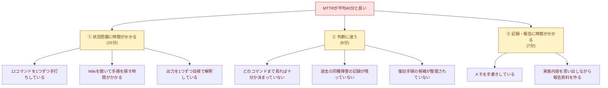
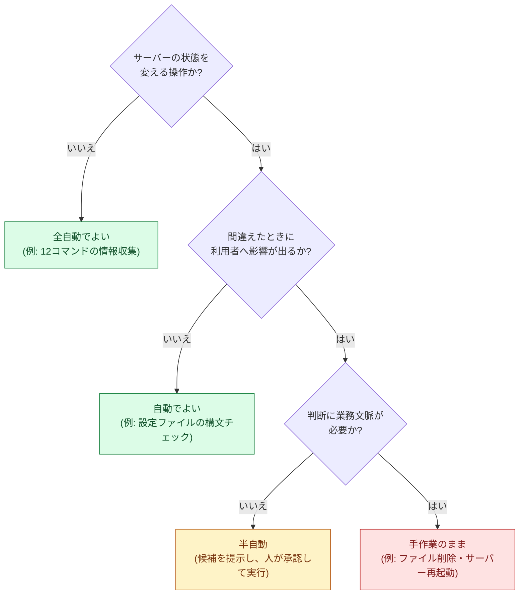
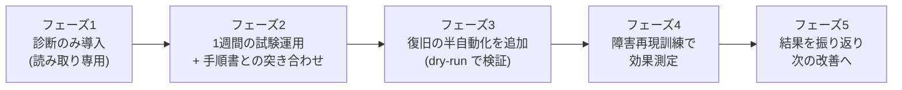

# 02. 改善提案書

## 0. この文書の目的

[01-current-analysis.md](./01-current-analysis.md) で洗い出した課題(P1〜P6)に対して、**複数の改善案を並べて比較し、どれを選ぶのか・なぜ選ぶのかを説明する**ための文書である。

改善案件で最も評価されるのは「手を動かした量」ではなく、**選択肢を並べて比較し、根拠を持って1つを選べること**である。特に本案件では「全自動にしない」という選択が中心的な判断になるため、その理由を5章で詳しく述べる。

> 本案件は架空の設定に基づく学習用の案件である。以下の検討・数値は、検証環境での実測と想定シナリオに基づく試算である。

## 1. 課題の構造化 — なぜ MTTR が40分もかかるのか

課題を並べただけでは、どこに手を打つべきか決められない。**「MTTRが長い」を頂点に置いて、原因を分解する**。

**この分解から見える構造**

| 分類 | 中身 | 性質 |
|---|---|---|
| ① 状況把握(15分) | 決まったコマンドを決まった順で叩く作業 | **完全に定型作業**。機械が得意な領域 |
| ② 判断(8分) | 集めた情報から原因を推定し、打ち手を決める | **人の判断が必要**。ただし「候補の提示」までは機械化できる |
| ③ 記録(7分) | 実施内容を書き残す作業 | **完全に定型作業**。実行と同時に自動で残せる |

つまり、**40分のうち22分(①+③)は定型作業であり、機械に任せられる**。残る8分の判断部分も、材料と候補が揃っていれば短縮できる。この構造理解が、次章以降の改善案の土台になる。

## 2. 改善の目標(定量目標)

| 指標 | 現状 | 目標 | 課題ID |
|---|---|---|---|
| 一次切り分けの情報収集時間 | 15分 | **1分以内** | P1 |
| MTTR(検知から復旧まで) | 平均40分 | **平均15分以内** | P1・P6 |
| 手順のばらつき | 担当者3人でバラバラ | **全員が同じ手順を実行できる** | P2・P5 |
| 作業記録 | 個人メモ頼り | **100%自動記録・後から追跡可能** | P4 |
| 原因未特定のままの再起動 | 発生している | **構造的に起きにくくする** | P3 |

## 3. 改善案の候補(4案)

### 案A: 手順書の整備だけを行う

Wikiの手順書をチェックリスト形式に作り直し、コピー&ペーストしやすい形に整える。ツールは新規に作らない。

- 実施内容: 手順書のフォーマット統一、コマンドのコピー用ブロック化、判断基準の明文化
- 費用: 0円 / 工数: 3人日程度

### 案B: 全自動復旧を実装する

監視ツールが異常を検知したら、スクリプトが自動的にサービスを再起動する。人は結果の通知を受け取るだけ。

- 実施内容: 検知イベントをトリガーに自動復旧スクリプトを起動する仕組み
- 費用: 0円 / 工数: 5人日程度

### 案C: 診断を全自動化し、復旧は半自動にする(本提案の採用案)

一次切り分けを1コマンドに集約する `diagnose.sh` と、状況に応じた復旧候補を提示して**人の承認を得てから実行する** `recover.sh` を作る。実行内容はすべて監査ログに残す。

- 実施内容: 診断スクリプト、復旧支援スクリプト、監査ログ、`--dry-run`、確認プロンプト、段階導入
- 費用: 0円(既存環境と標準コマンドのみ) / 工数: 8人日程度

### 案D: 監視SaaSの自動復旧(オートヒーリング)機能を導入する

商用の監視サービスを契約し、その自動復旧機能・ランブック自動化機能を利用する。

- 実施内容: SaaSの契約、エージェント導入、復旧アクションの定義
- 費用: 月額課金(サーバー台数課金) / 工数: 5人日程度 + 継続的な運用費

## 4. 比較評価

各案を6つの観点で評価する(◎=非常に良い / ○=良い / △=課題あり / ×=要件を満たさない)。

| 評価観点 | 重み | 案A 手順書整備のみ | 案B 全自動復旧 | **案C 診断自動+復旧半自動** | 案D 監視SaaS |
|---|---|---|---|---|---|
| MTTR短縮効果 | 高 | △ 数分程度 | ◎ 最大 | ○ 約70%短縮見込み | ◎ 大きい |
| 安全性(誤作動リスク) | **最高** | ◎ 何も自動化しない | **× 誤検知時に被害拡大** | ◎ 人の承認が必須 | △ 設定次第だが中身が見えない |
| 属人化の解消 | 高 | △ 読む人次第 | ◎ 人が介在しない | ◎ スクリプトが手順 | ○ 定義次第 |
| 監査性(記録が残るか) | 高 | × 手書きのまま | ○ 実行ログは残る | ◎ 実行者・承認まで残る | ○ SaaS内に残る |
| 導入コスト | 中 | ◎ ほぼゼロ | ○ 5人日 | ○ 8人日 | × 月額費用が継続発生 |
| 保守・学習しやすさ | 中 | ◎ | △ 挙動が読みにくい | ◎ Bashと標準コマンドのみ | × 製品知識に依存・移行困難 |
| **総合評価** | | 不採用 | **不採用** | **採用** | 不採用 |

### 選定理由(なぜ案Cなのか)

1. **要件3(勝手に触らないこと)を満たす唯一の実効的な案である**
   依頼内容の3番目に「サーバーを勝手に再起動する仕組みは入れたくない」が明記されている。案B・案Dはこの要件と正面から衝突する。案Aは要件を満たすが、効果が小さい。

2. **効果の大きい部分(定型作業22分)を確実に取りに行ける**
   1章の分解のとおり、40分のうち22分は定型作業である。案Cはこの22分をほぼゼロにできる。判断の8分も候補提示で短縮できる。

3. **費用がかからず、既存のスキルセットで保守できる**
   Bash と標準コマンドのみで構成するため、追加費用は発生しない。担当者3名が読める言語で書かれているため、退職・異動があっても保守を引き継げる。案Dは月額費用に加えて製品知識が必要になり、契約を切ると仕組みごと失われる。

4. **段階的に導入でき、失敗しても戻せる**
   まず「診断のみ」を導入して1週間運用し、問題がなければ復旧の半自動化を追加する、という進め方ができる(手順は [04-build-guide.md](./04-build-guide.md))。案B・案Dは「入れてみて様子を見る」がしにくい。

## 5. 【最重要】なぜ全自動復旧(案B)を採用しなかったのか

この案件で最も説明を要する判断であるため、独立した章として理由を述べる。**「技術的にできるか」ではなく「やるべきか」を判断した**、という点が要点である。

### 5-1. 理由1:通知は「サーバーが壊れた」ことを意味しない

案件No.3・No.4 の監視ツールが送る通知は、正確には「**監視ツールから対象サーバーが正常に見えなかった**」という意味である。その原因には次のようなものが含まれる。

| 通知の裏で実際に起きていること | 自動再起動した場合どうなるか |
|---|---|
| Webサーバーのプロセスが本当に落ちている | 正しく復旧する(想定どおり) |
| 監視サーバー側のネットワークが一時的に不調 | **正常なサーバーを無意味に再起動し、その瞬間だけ本当の障害を作る** |
| 上流のロードバランサやDNSの問題 | 原因は別の場所にあるのに、無関係なサーバーを再起動する |
| DB接続が詰まってHTTPが502を返している | 再起動しても数分後に再発。**再起動を繰り返す無限ループになりうる** |
| ディスクが100%で書き込みできない | 再起動しても直らない。むしろ起動に失敗して**完全停止**する可能性がある |

つまり、**同じ通知が来ても、正しい対応は状況によって違う**。「通知が来たら再起動」という単純な対応は、5つのうち1つの場合にしか正しくない。

### 5-2. 理由2:自動再起動は原因調査の材料を消してしまう

再起動すると、以下が失われる。

- 動いていたプロセスのメモリ上の状態(スタックトレース、接続中のセッション)
- 開いていたファイルディスクリプタや一時ファイル
- 「今まさに異常が起きている状態」そのもの

障害対応の目的は**「今回直すこと」だけでなく「次に起こさないこと」**でもある。自動再起動で症状だけ消えると、**根本原因が分からないまま同じ障害が繰り返される**。実際、改善前の運用でも「とりあえず再起動」によって再発が続いていた(01-current-analysis.md 5章 実害1)。

### 5-3. 理由3:自動化してよい操作と、人が判断すべき操作は性質が違う

線引きの基準を明文化する。

| 判断軸 | 自動化してよい | 人が判断すべき |
|---|---|---|
| 状態を変えるか | 変えない(読み取り専用) | 変える(再起動・削除・設定変更) |
| 間違えたときの影響 | 影響なし(情報が取れないだけ) | 利用者に影響が出る、元に戻せない |
| 判断に文脈が要るか | 不要(閾値で機械的に判定できる) | 必要(業務時間帯・他システムへの影響・過去の経緯) |
| やり直せるか | 何度実行しても同じ(冪等) | やり直しがきかない場合がある |

この基準を12コマンドと復旧操作に当てはめると、線引きは自然に決まる。

### 5-4. 結論:自動化するのは「情報収集」と「手順の提示」まで

| 工程 | 誰がやるか | 理由 |
|---|---|---|
| 情報を集める | **機械(全自動)** | 定型作業で、間違えても影響がない |
| 情報を判定する(閾値との比較) | **機械(全自動)** | 基準が数値で決まっている |
| 復旧手順の候補を出す | **機械(全自動)** | 手順書に書いてあることを機械が読み上げるのと同じ |
| **実行してよいか判断する** | **人** | 文脈が必要。間違えると利用者に影響が出る |
| コマンドを実行する | 機械(承認後) | 人が打つとタイプミスが起きる。承認後なら機械のほうが正確 |
| 結果を確認・記録する | **機械(全自動)** | 定型作業。人がやると省略される |

> **面接での言い方(正直な表現)**:
> 「架空の案件として自分で設計したものですが、全自動復旧も検討したうえで、**あえて採用しませんでした**。同じ障害通知でも、実際に起きていることは5パターンくらいあり、そのうち自動再起動が正解なのは1つだけだったからです。**自動化するのは判断材料を揃えるところまでで、実行の判断は人に残す**という線引きにしました。逆に、人がやると省略されがちな『記録』は完全に自動化しています。」

## 6. 期待効果

| 指標 | Before | After(見込み) | 根拠 |
|---|---|---|---|
| 一次切り分けの情報収集 | 15分 | **30秒** | 12コマンドを1スクリプトに集約。検証環境でのスクリプト実行時間は数秒、サマリを読む時間を含めて30秒 |
| MTTR | 平均40分 | **平均12分** | 内訳: 認知5分(変化なし)+ 切り分け0.5分 + 判断2分 + 復旧操作1.5分 + 確認記録0.5分 + 予備2.5分 |
| 手順のばらつき | 3人でバラバラ | **全員同一** | 手順がスクリプトとして固定される |
| 作業記録 | 個人メモ | **監査ログに自動記録** | 実行と同時に記録されるため省略が起きない |

MTTR の短縮率は **(40 − 12) ÷ 40 = 70%**。

**なぜ12分より短くできないのか**も説明できるようにしておく。

- 認知の5分は本案件のスコープ外(通知の受け取り方の改善が必要)
- 人の判断に2分は必要(むしろ削ってはいけない部分)
- したがって、理論上の下限は7分前後。12分は「予備を見込んだ現実的な目標値」である

## 7. リスクと対策

改善によって新しく生まれるリスクを洗い出し、対策を設計に落とし込む。

| # | リスク | 起こりうること | 対策(設計への反映) |
|---|---|---|---|
| R1 | スクリプトが誤った復旧操作を実行する | 正常なサービスを再起動して障害を作る | 危険度 medium 以上は確認プロンプトで人の承認を必須にする。`--dry-run` で事前確認できるようにする |
| R2 | 焦った担当者が確認プロンプトを反射的に承認する | 内容を読まずに実行してしまう | 危険度 high の操作は `y` ではなく `yes` と全文字入力させる。プロンプトに「何が起きるか」を明示する |
| R3 | 壊れた設定のまま reload/restart してしまう | 動いていたプロセスまで起動しなくなる | reload/restart の前に必ず設定構文チェックを実行し、**失敗したら何もせず中止する** |
| R4 | cron などから無人実行されて勝手に復旧操作が走る | 承認なしの実行 | 端末が無い(非対話)環境では復旧操作を実行せず、候補提示のみで終了する |
| R5 | コマンドが応答せずスクリプトが固まる | 障害対応そのものが止まる | すべての外部コマンドを `timeout` 経由で実行する |
| R6 | 2人が同時に復旧操作を実行する | 操作が競合し、結果が読めなくなる | `flock` による多重起動防止 |
| R7 | 記録が残らないまま操作される | 監査できない変更が発生する | **監査ログに書き込めない場合は復旧操作を実行しない** |
| R8 | 同じ復旧操作を繰り返して直らない | 原因が別にあるのに時間を浪費する | 直近10分以内の同一操作を監査ログから検出し、警告を出す |
| R9 | 担当者がスクリプトに依存し、手作業ができなくなる | ツールが動かないときに対応不能 | 診断レポートに実行した生コマンドと出力を残し、手順書としても読めるようにする。定期的な障害再現訓練を実施する |
| R10 | 権限を広く与えすぎる | ツール経由で何でもできてしまう | `sudo` はコマンド単位で許可する(`/etc/sudoers.d`)。許可アクションを設定ファイルのホワイトリストで制限する |

## 8. スコープ外にしたこと(やらないと決めたこと)

「やらないこと」を明示するのも設計の一部である。以下は本案件では実施しない。

| # | スコープ外の項目 | やらない理由 |
|---|---|---|
| S1 | 通知に気づくまでの時間(認知5分)の短縮 | 通知チャネルの運用ルール(電話連絡・オンコール体制)の話であり、ツールの範囲を超える |
| S2 | 障害そのものを減らすこと(MTBFの改善) | 冗長構成やキャパシティ設計の話であり、本案件の目的(MTTR短縮)とは別テーマ |
| S3 | ファイル削除によるディスク空き容量の確保 | 何を消してよいかは中身と業務上の意味を知る人にしか判断できない。ツールでは行わない |
| S4 | サーバー本体の再起動 | 影響範囲が大きすぎる。責任者の承認を得て手作業で行う領域 |
| S5 | DB・アプリケーションのデータ操作 | 「復旧」ではなく「変更」にあたる。取り返しがつかない操作は自動化しない |
| S6 | Webサーバー以外(DB・バッチサーバー)への展開 | まず1種類で効果を確認してから横展開する。最初から手を広げない |
| S7 | 複数台同時障害・複合障害への対応 | 単一障害での効果を確認するのが先。複雑なケースは人の判断に委ねる |

## 9. 実施計画(段階導入)

一度にすべてを入れず、**戻せる単位で少しずつ入れる**。

| フェーズ | 内容 | 期間 | 中止・切り戻しの判断基準 |
|---|---|---|---|
| 1 | `diagnose.sh` のみ導入。復旧操作は従来どおり手作業 | 1日 | 診断結果が実際の状態と食い違う場合は中止 |
| 2 | 実際の障害・訓練で診断結果と手順書の突き合わせ | 1週間 | 判定基準が実態に合わなければ閾値を調整 |
| 3 | `recover.sh` を導入。まず `--dry-run` のみ使用し、実行は手作業 | 3日 | 提示される候補が的外れなら候補ロジックを見直す |
| 4 | 承認つき実行を解禁。障害再現訓練で計測 | 1週間 | 想定外の挙動があれば `ALLOWED_ACTIONS` で機能を絞る |
| 5 | 効果測定の結果をまとめ、残課題を次サイクルへ | 1日 | — |

各フェーズのロールバック手順は [04-build-guide.md](./04-build-guide.md) 8章に記載する。

## 関連ドキュメント

- [01-current-analysis.md](./01-current-analysis.md) — 本書が対象とする課題P1〜P6の出典
- [03-design.md](./03-design.md) — 案Cの具体的な設計
- [04-build-guide.md](./04-build-guide.md) — 段階導入の具体的な手順
- [05-effect-measurement.md](./05-effect-measurement.md) — 期待効果と実測値の突き合わせ
