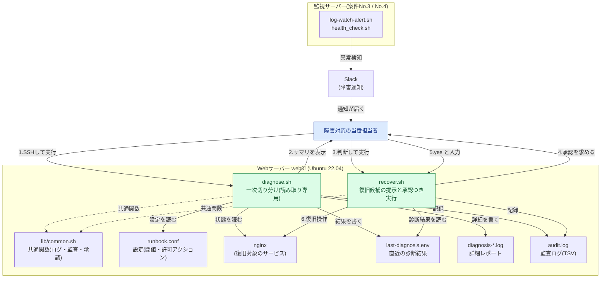
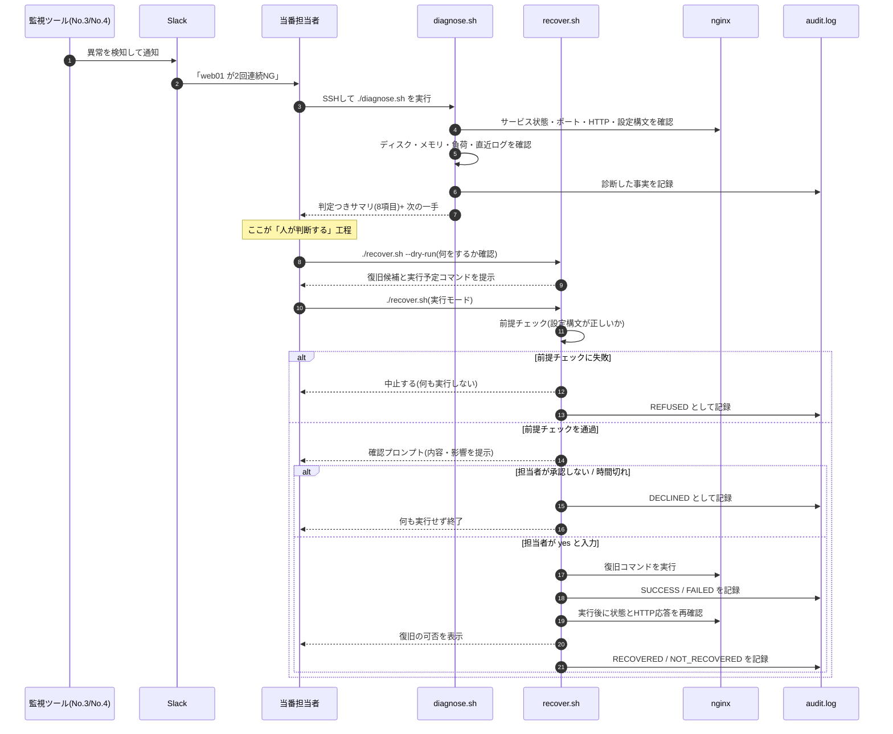
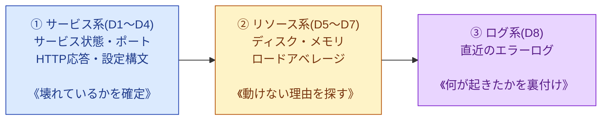
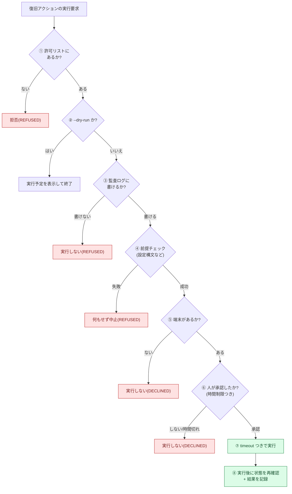

# 03. 改善設計書(To-Be)

## 0. この文書の目的

[02-improvement-proposal.md](./02-improvement-proposal.md) で採用した案C(診断を全自動化し、復旧は半自動)を、**実際に動くものとして設計する**ための文書である。初めて読む人が「なぜこの作りなのか」を理解できるよう、技術要素には初心者向けの解説を添える。

## 1. 設計方針(4つの原則)

すべての設計判断は、次の4原則から導かれている。迷ったらここに戻る。

| # | 原則 | 具体的な意味 |
|---|---|---|
| 1 | **情報収集は全自動、実行の判断は人** | 機械は材料を揃えて候補を示すところまで。「やるかどうか」は人が決める |
| 2 | **安全側に倒す(fail-safe)** | 迷ったら「何もしない」を選ぶ。前提が崩れたら実行せず中止する |
| 3 | **記録が残らない操作はしない** | 監査ログに書けないなら、復旧操作そのものを実行しない |
| 4 | **何度実行しても壊れない(冪等性)** | 同じスクリプトを繰り返し実行しても、結果が壊れたり二重に反映されたりしない |

> **冪等性(べきとうせい)とは**: 同じ操作を1回やっても10回やっても、結果が同じ状態に落ち着く性質のこと。障害対応中は焦って同じコマンドを何度も打ちがちなので、運用ツールには必須の性質である。`diagnose.sh` は読み取りしかしないので当然冪等であり、`recover.sh` の `systemctl restart` も「起動している状態」に収束するため冪等である。

## 2. 全体構成



**構成要素の役割**

| 要素 | 役割 |
|---|---|
| `diagnose.sh` | 一次切り分けの12コマンド相当を8項目に集約して実行し、判定つきサマリを表示する。**読み取り専用** |
| `recover.sh` | 診断結果に応じた復旧候補を提示し、人の承認を得てから実行する |
| `lib/common.sh` | 2つのスクリプトが共通で使う関数(ログ・監査ログ・確認プロンプト・タイムアウト実行) |
| `runbook.conf` | 対象サービス・閾値・許可アクションなどの設定。**処理と設定を分離**し、運用担当者がロジックを触らずに調整できるようにする |
| `last-diagnosis.env` | 診断結果を `KEY=VALUE` 形式で保存し、`recover.sh` へ引き継ぐ |
| `diagnosis-*.log` | 実行した生のコマンドと出力を残す詳細レポート。後から「本当にそうだったか」を確認するための証跡 |
| `audit.log` | 誰が・いつ・何を・どうなったかを1行1レコードで残す監査ログ |

## 3. 全体フロー(検知から記録まで)



## 4. 診断の設計

### 4-1. 見る順番の設計 — なぜ「サービス → リソース → ログ」なのか

一次切り分けは、**闇雲にコマンドを打つのではなく決まった順番で見る**ことで速く正確になる。本設計では次の順にした。



| 順番 | 見るもの | 目的 | この順である理由 |
|---|---|---|---|
| ① サービス系 | サービス状態・ポート・HTTP応答・設定構文 | **利用者から見て壊れているのかを確定させる** | 一番外側の事実。ここがOKなら、そもそも障害は継続していない(誤検知の可能性が高い)と判断できるため、最初に見る |
| ② リソース系 | ディスク・メモリ・CPU負荷 | **動けない理由を探す** | サービス異常の原因は、多くがリソース枯渇。①で異常が確定したあとに原因候補として見る |
| ③ ログ系 | 直近のエラーログ | **何が起きたのかを裏付ける** | ログは情報量が多く、読むのに時間がかかる。①②で当たりをつけてから読むほうが速い |

> 💡 **逆順にすると何が起きるか**: いきなりログから読み始めると、無関係なエラーメッセージに時間を取られる。「サービスは実は正常で、監視の誤検知だった」というケースでも、ログを延々と読み続けてしまう。**まず外側の事実を確定させる**のが、切り分けの基本形である。

### 4-2. 診断項目の一覧と判定基準

| ID | 項目 | 使うコマンド | OK | WARN | NG | SKIP になる条件 |
|---|---|---|---|---|---|---|
| D1 | サービス状態 | `systemctl is-active <svc>`(無ければ `pgrep -x`) | `active` | — | `active` 以外 / 状態取得不可 | `systemctl` も `pgrep` も無い |
| D2 | リッスンポート | `ss -H -ltn`(無ければ `netstat -ltn`) | 設定した全ポートが待ち受け中 | — | 待ち受けていないポートがある | `ss` も `netstat` も無い |
| D3 | HTTP応答 | `curl -o /dev/null -s -w '%{http_code}'` | 2xx / 3xx | 4xx | 5xx / 接続失敗(000) | `curl` が無い |
| D4 | 設定ファイル構文 | `nginx -t`(設定で変更可) | 構文エラーなし | — | 構文エラーあり | チェックコマンド未設定・不在 |
| D5 | ディスク使用率 | `df -P` | 80%未満 | 80%以上 | **90%以上** | `df` が無い / 対象が取得不可 |
| D6 | メモリ使用率 | `free -m`(available基準) | 80%未満 | 80%以上 | **90%以上** | `free` が無い |
| D7 | ロードアベレージ | `/proc/loadavg` + `nproc` | コアあたり1.0未満 | 1.0以上 | **2.0以上** | `/proc/loadavg` が読めない |
| D8 | 直近ログのエラー件数 | `journalctl --since`(無ければ `tail`+`grep -E`) | 5件未満 | **5件以上** | — | 参照できるログが無い |

閾値はすべて `runbook.conf` に定義しており、スクリプト本体を編集せずに変更できる。

**判定基準の設計で意識したこと**

- **D5(ディスク)の90%をNGにした理由**: ディスクが100%になるとログすら書けなくなり、復旧作業自体ができなくなる。100%になる前に手を打つ必要があるため、余裕を持って90%をNGとした。
- **D6(メモリ)で `free` ではなく `available` を見る理由**: Linux は空きメモリをディスクキャッシュとして使う。`free`(純粋な空き)だけを見ると「メモリが足りない」と誤判定する。`available`(必要になれば使える量)で判定するのが正しい。
- **D7(負荷)をコア数で割る理由**: ロードアベレージ4は、1コアのサーバーでは過負荷だが、8コアのサーバーでは余裕がある。**コア数で割った値**で比較しないと意味がない。
- **D8をNGではなくWARNにした理由**: ログにエラーが多いことは「異常の兆候」ではあるが、それ自体はサービス停止を意味しない。NGにすると誤検知が増えるため、WARN止まりにしている。

### 4-3. 診断の出力(3種類)

| 出力先 | 内容 | 誰が読むか |
|---|---|---|
| 画面(標準出力) | 8項目の判定サマリ + 総合判定 + 次の一手 | 対応中の担当者(30秒で状況をつかむため) |
| `diagnosis-YYYYmmdd-HHMMSS.log` | 実行した生のコマンドとその出力すべて | 後から詳細を確認する人、報告書を書く人 |
| `last-diagnosis.env` | `KEY=VALUE` 形式の判定結果 | `recover.sh`(機械が読む) |

**実際の出力例**(検証環境で `nginx` を停止した状態で実行した結果)

```text
=====================================================================
 一次切り分け診断サマリ  host=web01  2026-09-07 04:43:16
 対象: nginx (http://127.0.0.1/)
=====================================================================
 [NG  ] D1 サービス状態: nginx = inactive
 [NG  ] D2 リッスンポート: 待ち受けていないポート: 80
 [NG  ] D3 HTTP応答: http://127.0.0.1/ へ接続できません (curl終了コード=7)
 [OK  ] D4 設定ファイル構文: nginx -t = 構文エラーなし
 [OK  ] D5 ディスク使用率: /=22% /var=22% (警告=80% 異常=90%)
 [OK  ] D6 メモリ使用率: 使用率=4% (全体16075MB / 利用可能15337MB, 警告=80%)
 [OK  ] D7 ロードアベレージ: 1分平均=0.13 / 4コア = 0.03(警告=1.0 異常=2.0)
 [WARN] D8 直近ログのエラー: エラー相当のログ 7件 / journalctl(直近10分)
---------------------------------------------------------------------
 総合判定 : CRITICAL (NG=3 WARN=1 OK=4 SKIP=0)
 所要時間 : 2秒
 詳細     : /var/log/runbook-assist/diagnosis/diagnosis-20260907-044316.log
 次の一手 : recover.sh --dry-run を実行し、復旧候補と実行内容を確認してください。
=====================================================================
```

**この画面設計で意識したこと**

- 判定を行頭に置く: `[NG  ]` `[OK  ]` を左端に揃え、**目を上下に走らせるだけで異常箇所が分かる**ようにした
- 判定の根拠を必ず添える: 「NG」だけでなく「なぜNGなのか(実際の値と閾値)」を1行に含める
- **「次の一手」を最後に書く**: 情報を出して終わりにせず、次に何をすればよいかまで示す。焦っている担当者が迷わないようにするため

**`last-diagnosis.env` の実際の中身**

```text
# diagnose.sh が自動生成したファイル。手で編集しない。
DIAG_TIMESTAMP=2026-09-07T04:43:16+0900
DIAG_HOST=web01
DIAG_SERVICE=nginx
DIAG_OVERALL=CRITICAL
DIAG_SERVICE_STATUS=NG
DIAG_PORT_STATUS=NG
DIAG_HTTP_STATUS=NG
DIAG_CONFIG_STATUS=OK
DIAG_DISK_STATUS=OK
DIAG_MEMORY_STATUS=OK
DIAG_LOAD_STATUS=OK
DIAG_LOG_STATUS=WARN
DIAG_REPORT_FILE=/var/log/runbook-assist/diagnosis/diagnosis-20260907-044316.log
```

> 💡 **このファイルを `source` で読み込まない理由**: `source`(`.`)はファイルの中身を**そのままBashのコードとして実行する**。万一このファイルが書き換えられていたら、任意のコマンドが動いてしまう。本設計では `grep` で該当行を取り出して `=` の右側を切り出すだけの関数(`rb_read_finding`)を用意し、**実行はしない**ようにしている。

## 5. 復旧の設計

### 5-1. 復旧アクションの定義

`recover.sh` が実行できる操作は、次の4つだけである。**ここに無い操作は実行できない**。

| ID | アクション | 危険度 | 実行コマンド | 承認方法 |
|---|---|---|---|---|
| A1 | 設定ファイルの構文チェック | low | `nginx -t` | 不要(読み取りのみ) |
| A2 | サービスへの設定リロード | medium | `systemctl reload nginx` | `y/N` の確認プロンプト |
| A3 | サービスの再起動 | high | `systemctl restart nginx` | **`yes` と全文字入力** |
| A4 | ログの強制ローテート | medium | `logrotate --force /etc/logrotate.d/nginx` | `y/N` の確認プロンプト |

**意図的に定義しなかった操作**

| 操作 | なぜ定義しないか |
|---|---|
| ファイルの削除(ディスク空き容量の確保) | 何を消してよいかは中身と業務上の意味を知る人にしか判断できない |
| サーバー本体の再起動 | 影響範囲が大きすぎる。責任者の承認を得て手作業で行う |
| `systemctl stop`(サービス停止) | 停止は「復旧」ではない。障害を作る側の操作なので用意しない |
| DB・アプリのデータ操作 | 復旧ではなく変更にあたり、取り返しがつかない |

さらに、実行できるアクションは設定ファイルの許可リスト(ホワイトリスト)でも制限している。

```bash
# runbook.conf
ALLOWED_ACTIONS="A1 A2 A3 A4"
```

例えば「本番では再起動まで自動化したくない」場合は `ALLOWED_ACTIONS="A1 A2 A4"` に変えるだけで、A3 はコマンドラインで指定しても実行されなくなる。**スクリプトを書き換えずに機能を絞れる**設計にしている。

### 5-2. 復旧候補の提示ロジック

診断結果(`last-diagnosis.env`)を読み、状況に応じて候補を並べる。

| 診断結果 | 提示する候補(推奨順) | 考え方 |
|---|---|---|
| 設定構文=NG | A1(内容を確認) | 設定の修正自体は人が手作業で行う。ツールは事実確認まで |
| サービス=NG | A1 → A3 | 停止しているので再起動が有力。ただし**再起動前に設定が正しいことを必ず確認**する |
| サービス=OK かつ HTTP=NG/WARN | A1 → A2 → A3 | プロセスは生きているので、まず影響の小さいリロードを試し、駄目なら再起動 |
| ディスク=WARN/NG | A4 + 手動対応の案内 | ローテートで足りなければ、削除は人が手作業で判断する |
| すべてOK | 候補なし | 「復旧操作は不要。監視側の誤検知を疑ってください」と表示して終了 |

**影響の小さい順に並べる**のが原則である(A1 → A2 → A3)。いきなり再起動を提案しない。

**実際の出力例**(サービス停止時)

```text
=====================================================================
 直近の診断結果  (2026-09-07T04:43:16+0900 / 総合判定: CRITICAL)
   サービス=NG  HTTP=NG  設定構文=OK  ディスク=OK
=====================================================================

--- 復旧候補(上から順に試すことを推奨) ---

 [1] A1 設定ファイルの構文チェック [危険度: low]
     理由    : 再起動の前に、設定ファイルが正しいことを確認する
     コマンド: nginx -t

 [2] A3 サービスの再起動 [危険度: high]
     理由    : サービスが停止しているため、再起動で復旧する可能性が高い
     コマンド: systemctl restart nginx

実行するアクションの番号を入力してください(0 = 何もしない):
```

## 6. 確認プロンプトの設計

「人の承認を得る」という要件を、具体的にどう実装するかを設計する。**ここを雑に作ると、確認プロンプトは形だけのものになる**。

### 6-1. 実装(`lib/common.sh` の `rb_confirm`)

```bash
rb_confirm() {
    local risk="$1"
    shift
    local message="$*"
    local timeout_sec="${CONFIRM_TIMEOUT:-60}"
    local answer=""

    # (1) 端末が無ければ、承認を取らずに「実行しない」を選ぶ
    if ! rb_is_interactive; then
        rb_error "非対話環境(端末なし)のため承認を取得できません。実行を中止します。"
        rb_error "内容だけ確認したい場合は --dry-run を付けて実行してください。"
        return 1
    fi

    printf '\n%s\n' "$message" >&2

    # (2) 危険度が high の操作は yes と全文字入力させる
    if [ "$risk" = "high" ]; then
        printf '  この操作はサービスに影響します。実行するなら yes と入力 [yes/no] (%s秒で中止): ' \
            "$timeout_sec" >&2
        # (3) 入力待ちにも制限時間を設ける
        if ! IFS= read -r -t "$timeout_sec" answer; then
            printf '\n' >&2
            rb_warn "入力がタイムアウトしました。実行しません。"
            return 1
        fi
        if [ "$answer" = "yes" ]; then
            return 0
        fi
        return 1
    fi
    ...
}
```

### 6-2. 3つの設計上の工夫

| # | 工夫 | 理由 |
|---|---|---|
| (1) | **端末が無ければ実行しない** | cron や CI から無人実行されたとき、承認なしで復旧操作が走るのを防ぐ。「承認できない」ときは「実行しない」を選ぶ(安全側に倒す) |
| (2) | **危険度 high は `yes` と全文字入力** | `y` + Enter は反射的に押せてしまう。3文字打たせることで、**一度画面を読む時間を強制的に作る** |
| (3) | **入力待ちにタイムアウト(既定60秒)** | 担当者が席を離れた状態でプロンプトが残り続け、後から誰かが誤って Enter を押す事故を防ぐ。時間切れは「no」と同じ扱い |

### 6-3. 承認画面に何を表示するか

承認を求める以上、**判断に必要な情報をすべて画面に出す**必要がある。「本当に実行しますか?」だけの確認は、情報が無いので意味がない。

```text
実行しようとしている操作:
  アクション : A3 サービスの再起動
  コマンド   : systemctl restart nginx
  影響       : サービスを停止してから起動し直す。数秒間、利用者からのアクセスが失敗する。
  対象ホスト : web01
  この操作はサービスに影響します。実行するなら yes と入力 [yes/no] (60秒で中止):
```

| 表示項目 | なぜ必要か |
|---|---|
| アクション名 | 何をしようとしているか |
| 実行コマンド | 実際に何が動くか(コマンドを見れば経験者は即座に判断できる) |
| 影響 | 実行すると利用者に何が起きるか |
| **対象ホスト** | **本番サーバーにSSHしているつもりで検証環境にいた、あるいはその逆、という事故を防ぐ** |

### 6-4. 動作確認結果(検証環境での実測)

| 入力 | 結果 | 戻り値 |
|---|---|---|
| `yes` | 実行に進む | 0 |
| `y` | **実行しない**(high では `yes` 以外は拒否) | 1 |
| 何も入力せず60秒経過 | 「入力がタイムアウトしました。実行しません。」と表示して中止 | 1 |
| 端末なし(パイプ経由など) | 「非対話環境のため承認を取得できません」と表示して中止 | 1 |

## 7. 監査ログの設計

### 7-1. なぜ監査ログが必要か

[01-current-analysis.md](./01-current-analysis.md) 6章のとおり、記録が無いことで「再発時に前回の対応が分からない」「二次障害の切り分けができない」という実害が出ていた。監査ログは**次の障害対応を速くするための資産**として設計する。

### 7-2. フォーマット(タブ区切り10列)

| 列 | 項目 | 例 | 説明 |
|---|---|---|---|
| 1 | 実行日時 | `2026-09-07T04:43:39+0900` | ISO 8601形式。文字列のまま並べ替えれば時系列順になる |
| 2 | ホスト名 | `web01` | どのサーバーでの操作か |
| 3 | 実行者 | `tanaka` | **`sudo` 経由でも実際の人が分かるよう `SUDO_USER` を優先** |
| 4 | スクリプト名 | `recover.sh` | どのツールによる操作か |
| 5 | モード | `execute` | `diagnose` / `dry-run` / `execute` / `refused` / `propose` / `verify` |
| 6 | アクションID | `A3` | 診断時は `-` |
| 7 | 対象 | `nginx` | 操作対象のサービス名 |
| 8 | 結果 | `SUCCESS` | `SUCCESS` / `FAILED` / `DECLINED` / `REFUSED` / `DRY_RUN` / `RECOVERED` / `NOT_RECOVERED` / `OK` / `WARN` / `CRITICAL` |
| 9 | 終了コード | `0` | 実行したコマンドの終了ステータス |
| 10 | 補足 | `systemctl restart nginx (2s)` | 実行したコマンドと所要時間など |

**なぜタブ区切り(TSV)なのか**

- `awk -F'\t'` でそのまま列を指定して集計できる
- メッセージ中にスペースが入っても列がずれない(CSVと違い、引用符の解釈も不要)
- `grep` でそのまま検索できる

### 7-3. 実際の監査ログ(検証環境での出力)

```text
# runbook-assist audit log (TSV)
# timestamp	host	actor	script	mode	action	target	result	exit_code	detail
2026-09-07T04:43:16+0900	web01	tanaka	diagnose.sh	diagnose	-	nginx	CRITICAL	2	NG=3 WARN=1 OK=4 SKIP=0 report=/var/log/runbook-assist/diagnosis/diagnosis-20260907-044316.log
2026-09-07T04:43:16+0900	web01	tanaka	recover.sh	dry-run	A1	nginx	DRY_RUN	0	nginx -t
2026-09-07T04:43:16+0900	web01	tanaka	recover.sh	dry-run	A3	nginx	DRY_RUN	0	systemctl restart nginx
2026-09-07T04:43:39+0900	web01	tanaka	recover.sh	execute	A1	nginx	SUCCESS	0	nginx -t (0s)
2026-09-07T04:44:02+0900	web01	tanaka	recover.sh	execute	A3	nginx	SUCCESS	0	systemctl restart nginx (2s)
2026-09-07T04:44:05+0900	web01	tanaka	recover.sh	verify	A3	nginx	RECOVERED	0	実行後の確認で正常を確認
```

このログを時系列に読むだけで、**「何時何分に誰が、どんな状況で、何を実行し、結果どうなったか」が完全に再現できる**。翌日の報告資料はこのログを貼るだけで作れる。

### 7-4. 監査ログの活用例(`awk` による集計)

```bash
# 直近の復旧操作を10件表示する
awk -F'\t' '$5 == "execute" {print $1, $3, $6, $8}' /var/log/runbook-assist/audit.log | tail -10
```

```text
2026-09-07T04:43:39+0900 tanaka A1 SUCCESS
2026-09-07T04:44:02+0900 tanaka A3 SUCCESS
```

```bash
# アクションごとの実行回数を数える(どの手順がよく使われているか)
awk -F'\t' '$5 == "execute" {count[$6]++} END {for (a in count) print a, count[a]"回"}' \
    /var/log/runbook-assist/audit.log
```

```text
A1 2回
A3 1回
```

> 💡 この集計結果は、**手順書を改善するときの根拠データ**になる。「A3(再起動)ばかり実行されている=根本原因が放置されている」といった傾向が数字で見える。

## 8. 安全設計(危険な操作をどう安全に扱うか)

本設計の中核。8つの安全装置を多層で組み合わせている。**1つが破られても、次が止める**という考え方(多層防御)である。



| # | 安全装置 | 実装 | 何を防ぐか |
|---|---|---|---|
| ① | 許可リスト(ホワイトリスト) | `ALLOWED_ACTIONS` に無いIDは実行しない | 想定外の操作の実行 |
| ② | `--dry-run` | 実行せず、実行予定コマンドだけを表示 | 「何が起きるか分からないまま実行する」こと |
| ③ | 監査ログ必須 | 書き込めないなら復旧操作を実行しない | 記録に残らない変更 |
| ④ | 前提チェック | reload/restart 前に設定構文チェック。失敗したら**何もせず中止** | 壊れた設定の反映による二次障害 |
| ⑤ | 非対話拒否 | 端末が無ければ実行しない | cron等からの無人実行 |
| ⑥ | 確認プロンプト | 危険度に応じて `y/N` または `yes`。60秒でタイムアウト | 反射的な承認・放置された承認画面 |
| ⑦ | タイムアウト実行 | すべての外部コマンドを `timeout` 経由で実行 | 応答しないコマンドによる固まり |
| ⑧ | 実行後の再確認 | サービス状態とHTTP応答を再確認し、結果を記録 | 「実行したが直っていない」の見落とし |

補助的な安全装置として、次も実装している。

| 装置 | 内容 |
|---|---|
| 多重起動防止 | `flock` により、`recover.sh` は同時に1つしか動かない |
| 繰り返し検出 | 直近10分以内に同じアクションを実行していれば警告(監査ログから判定) |
| 権限の最小化 | `sudo -n` + `/etc/sudoers.d` でコマンド単位に許可。root権限そのものは渡さない |
| 削除操作の不在 | 診断・復旧のどちらにもファイル削除処理を実装しない。ログの世代管理は `logrotate` に任せる |

### 8-1. 「失敗したら何もしない」の具体例

最も重要な安全設計を、実際のコードで示す(`recover.sh` の `preflight` 関数)。

```bash
# --- 設定ファイルの構文チェック(失敗したら何もしない) ---
if [ "${#SERVICE_CONFIG_TEST[@]}" -gt 0 ] && rb_have_cmd "${SERVICE_CONFIG_TEST[0]}"; then
    rb_info "事前チェック: ${SERVICE_CONFIG_TEST[*]} を実行します"
    if ! rb_run_priv "${SERVICE_CONFIG_TEST[@]}"; then
        rb_error "設定ファイルの構文チェックに失敗しました。${id} は実行しません。"
        rb_error "壊れた設定のまま反映すると、いま動いているプロセスも起動できなくなります。"
        return 1
    fi
    rb_info "事前チェック: 構文エラーはありませんでした"
fi
```

**なぜこれが重要か**: nginx は、設定ファイルが壊れていても**動いているプロセスはそのまま動き続ける**。しかしそこで `restart` すると、新しい設定を読めずに**起動に失敗し、完全停止する**。「直そうとして完全に止める」のは、障害対応で最も避けたい失敗である。だからこの1つのチェックを、reload/restart の前に必ず通す。

## 9. 終了ステータスの設計

スクリプトが呼び出し元へ返す唯一の数値が終了ステータスである。監視ツールや他のスクリプトから利用できるよう、意味を明確に決めておく。

| 値 | 定数名 | 意味 | `diagnose.sh` | `recover.sh` |
|---|---|---|---|---|
| 0 | `RB_EXIT_OK` | 異常なし / 正常終了 | 全項目OK | 実行成功・dry-run・対応不要 |
| 1 | `RB_EXIT_WARN` | 警告あり | WARNが1件以上 | (使用しない) |
| 2 | `RB_EXIT_CRIT` | 異常あり / 復旧未確認 | NGが1件以上 | 実行したが復旧を確認できなかった |
| 3 | `RB_EXIT_ERROR` | スクリプト自身の実行エラー | 設定不備・出力先が作れない | 前提未達・権限不足・未定義アクション |
| 4 | `RB_EXIT_DECLINED` | 人が承認しなかった | (使用しない) | 承認拒否・時間切れ・非対話環境 |

**活用例**: 終了ステータスがあることで、他のスクリプトから次のように書ける。

```bash
if ! /opt/runbook-assist/diagnose.sh -q; then
    echo "異常あり。エスカレーションします"
fi
```

## 10. サーバー上のディレクトリ構成

障害対応の当番は3名いるため、専用グループ `ops` を作り、そのグループに必要最小限の読み書きを許可する構成にする。

```text
/opt/runbook-assist/            # ツール本体(実行するもの)
├── diagnose.sh                 # 755 root:root(誰でも実行可・書き換えはrootのみ)
├── recover.sh                  # 755 root:root
├── runbook.conf                # 640 root:ops(Webhook URLを含むため other には読ませない)
└── lib/
    └── common.sh               # 644 root:root

/var/lib/runbook-assist/        # 状態(揮発してもよいデータ)2775 root:ops
├── last-diagnosis.env          # 直近の診断結果
└── recover.lock                # 多重起動防止用のロックファイル

/var/log/runbook-assist/        # 記録(残すべきデータ)2775 root:ops
├── audit.log                   # 監査ログ 660 root:ops
└── diagnosis/                  # 2775 root:ops
    └── diagnosis-*.log         # 診断レポート(実行ごとに1ファイル)

/etc/sudoers.d/runbook-assist   # 440 root:root。許可するコマンドを限定
/etc/logrotate.d/runbook-assist # 644 root:root。ログの世代管理
```

**ディレクトリを3つに分けた理由**: 「本体(`/opt`)」「状態(`/var/lib`)」「記録(`/var/log`)」は、性質もバックアップ方針も違う。監査ログは長期保管が必要だが、ロックファイルは消えても構わない。分けておくと、それぞれに適切な権限とローテート設定を当てられる(Linux のファイルシステム階層標準(FHS)に沿った配置でもある)。

**`2775` の先頭の `2` は何か**: SGID(set group ID)という指定で、**そのディレクトリの中に作られたファイルのグループを、親ディレクトリのグループ(`ops`)に自動的に引き継がせる**。これが無いと、当番Aさんが作った監査ログをBさんが書けない、という事態になる。

### 10-1. なぜスクリプト自体に `sudo` を許可しないのか

一見すると、`/etc/sudoers.d` に「`recover.sh` の実行を許可する」と書くのが簡単に見える。しかし**これは重大な権限昇格の穴になる**ため、本設計では採用していない。

```bash
# もし sudo /opt/runbook-assist/recover.sh を許可してしまうと…
sudo /opt/runbook-assist/recover.sh -c /tmp/悪意のある設定ファイル
```

`recover.sh` は `--config` で指定された設定ファイルを `source`(=Bashのコードとして読み込む)する。したがって、**任意の場所の設定ファイルを指定できる状態でスクリプトごと sudo を許すと、実質的に root 権限を渡したのと同じ**になる。

そこで本設計では、次のようにしている。

- スクリプト自体は**担当者の一般ユーザー権限で実行する**
- 権限が必要な操作(`systemctl reload/restart`、`nginx -t`、`logrotate`)だけを、**コマンド単位で `sudo` 許可する**(`sudo -n` で呼び出す)
- 設定ファイル `runbook.conf` は root 所有・640 とし、一般ユーザーには書き換えられないようにする

> 💡 これは「最小権限の原則」の実践例である。**権限は『必要なコマンドに』『必要な分だけ』与える**。「とりあえずスクリプトごとsudoで動かす」は、動くが危険な設計として面接でも指摘されやすいポイントである。

## 11. 技術要素の初心者向け解説

本設計で使っている要素を、はじめて見る人向けに説明する。

### 11-1. `set -uo pipefail` — なぜ `-e` を付けないのか

```bash
set -uo pipefail
```

| オプション | 意味 |
|---|---|
| `-u` | 未定義の変数を参照したらエラーで停止する。設定漏れやタイプミスを早期に発見できる |
| `-o pipefail` | パイプ(`\|`)でつないだコマンドの途中が失敗したら、全体を失敗として扱う |
| `-e`(**あえて付けない**) | コマンドが1つでも失敗したら即座にスクリプトを終了する |

**`-e` を付けない理由**: 診断ツールでは「1つのチェックが失敗しても、残りのチェックを最後まで実行して、集められた情報だけでも人に見せる」ことが重要である。`-e` を付けると、最初の失敗で止まり、**障害時にこそ何も分からなくなる**。代わりに、各コマンドの終了コードを自分でチェックしてハンドリングしている。

### 11-2. `read -r -t` — 確認プロンプトの実装

```bash
IFS= read -r -t 60 answer
```

| 要素 | 意味 |
|---|---|
| `read` | キーボードからの1行入力を変数に読み込むBashの組み込みコマンド |
| `-r` | バックスラッシュ(`\`)をエスケープ文字として解釈しない。入力された文字をそのまま受け取るための指定(付けないと `\n` などが化ける) |
| `-t 60` | 60秒待って入力が無ければ失敗(0以外)を返す |
| `IFS= ` | 入力の前後の空白を削らずにそのまま読む |
| `answer` | 読み込んだ内容を入れる変数名 |

### 11-3. `timeout` — 固まらないようにする

```bash
timeout 10 systemctl restart nginx
```

指定した秒数(ここでは10秒)を超えたらコマンドを打ち切る。**時間切れの場合は終了コード124を返す**ので、「失敗した」のか「時間切れだった」のかを区別できる。

障害時は、コマンド自体が応答を返さなくなることがよくある(固まったNFSに対する `df` など)。タイムアウトが無いと、**診断ツールが固まって障害対応そのものが止まる**。

### 11-4. `$SUDO_USER` — 実際の操作者を記録する

```bash
rb_actor() {
    printf '%s' "${SUDO_USER:-$(id -un)}"
}
```

`sudo` を使うと実行ユーザーは `root` になるため、`id -un` では誰が操作したのか分からない。`sudo` は元のユーザー名を環境変数 `SUDO_USER` に入れてくれるので、**それを優先して記録する**。`${変数:-代替値}` は「変数が空なら代替値を使う」という書き方である。

### 11-5. `sudo -n` — パスワード入力で固まらせない

```bash
rb_run sudo -n systemctl restart nginx
```

`-n`(non-interactive)を付けると、**パスワードが必要な場合は入力を待たずに即座に失敗する**。夜間の自動処理でパスワード入力待ちになって固まるのを防げる。許可されたコマンドだけを `/etc/sudoers.d` に登録しておけば、パスワードなしで実行できる。

### 11-6. 標準出力と標準エラー出力を分ける

本設計では、**サマリは標準出力(stdout)、進捗ログは標準エラー出力(stderr)**に分けている。

```bash
./diagnose.sh > summary.txt     # summary.txt にはサマリだけが入る
                                # 進捗ログは画面に表示され続ける
```

こうしておくと、サマリだけをファイルに保存したり、他のコマンドへ渡したりできる。「人が読むもの」と「機械が処理するもの」を分けるのは、コマンドラインツール設計の基本作法である。

### 11-7. systemd が使えるかどうかの判定

```bash
systemd_available() {
    rb_have_cmd systemctl && [ -d /run/systemd/system ]
}
```

`/run/systemd/system` は、systemd が PID 1(=OSの最初のプロセス)として動いているときにだけ存在する。コンテナやWSLでは `systemctl` コマンド自体は存在しても使えないため、**コマンドの有無だけでは判定できない**。この2条件で判定し、使えない環境では `pgrep` によるプロセス確認へ自動的に切り替える。

## 関連ドキュメント

- [02-improvement-proposal.md](./02-improvement-proposal.md) — この設計を選んだ理由
- [04-build-guide.md](./04-build-guide.md) — この設計を実際に導入する手順
- [06-troubleshooting.md](./06-troubleshooting.md) — 設計どおりに動かないときの対処
- [src/diagnose.sh](./src/diagnose.sh) / [src/recover.sh](./src/recover.sh) / [src/lib/common.sh](./src/lib/common.sh) — 実装本体
