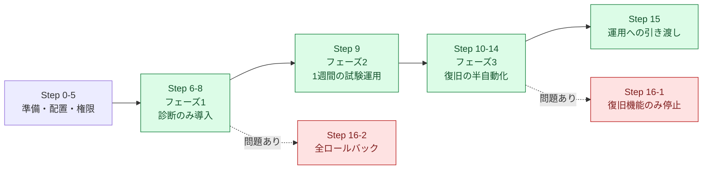

# 04. 実装・移行手順書

本手順は、Ubuntu Server 22.04 LTS 上の Webサーバー(nginx)へ、診断・復旧支援ツールを導入する手順である。

**この手順書の重要な方針**

> **一度にすべてを入れない。** まず**フェーズ1として「診断のみ(読み取り専用)」を導入**し、1週間の試験運用で判定基準が実態に合っているかを確かめてから、**フェーズ3として「復旧の半自動化」を追加**する。各フェーズには**ロールバック手順**を用意し、いつでも元の運用に戻せる状態を保つ。

| フェーズ | 対応するStep | 導入するもの | 元に戻すには |
|---|---|---|---|
| フェーズ1 | Step 0〜8 | `diagnose.sh`(読み取り専用) | Step 16-2 |
| フェーズ2 | Step 9 | 1週間の試験運用(何も追加しない) | — |
| フェーズ3 | Step 10〜15 | `recover.sh`(承認つき実行)・sudo設定・logrotate設定 | Step 16-1 |



---

## Step 0. 前提の確認

```bash
lsb_release -a
```

```text
Distributor ID: Ubuntu
Description:    Ubuntu 22.04.4 LTS
Release:        22.04
Codename:       jammy
```

本ツールが使うコマンドが揃っているかを確認する。

```bash
for c in systemctl ss curl df free awk journalctl timeout flock logrotate; do
  printf '%-12s %s\n' "$c" "$(command -v "$c" || echo '(なし)')"
done
```

```text
systemctl    /usr/bin/systemctl
ss           /usr/bin/ss
curl         /usr/bin/curl
df           /usr/bin/df
free         /usr/bin/free
awk          /usr/bin/awk
journalctl   /usr/bin/journalctl
timeout      /usr/bin/timeout
flock        /usr/bin/flock
logrotate    /usr/sbin/logrotate
```

**何をしているか**: ツールが依存するコマンドの有無を、導入前にまとめて確認している。

**なぜ**: 障害対応の最中に「コマンドが無くて診断できない」と気づくのが最悪のパターンだからである。前提は平時に確認しておく。

💡 **ポイント**: `ss` が無い場合は `sudo apt install -y iproute2` で入る。`curl` が無い場合は `sudo apt install -y curl`。なお、これらが無くても `diagnose.sh` は該当項目を `SKIP` として扱い、**他の項目の診断は最後まで続ける**設計になっている(1つ足りないだけで全部止まらないようにするため)。

---

## Step 1. 担当者グループ `ops` の作成

```bash
sudo groupadd -f ops
sudo usermod -aG ops "$USER"
```

**確認**(一度ログアウト・ログインし直してから実行する):

```bash
id -nG
```

```text
tanaka sudo ops
```

**何をしているか**: 障害対応の当番3名が所属する専用グループ `ops` を作り、自分を追加している。

**なぜ**: 監査ログや診断レポートは「当番の誰もが読み書きできる」必要がある一方で、無関係なユーザーには見せたくない。**グループ単位で権限を設計する**ことで、担当者が増減してもファイルの権限設定を変えずに済む。

💡 **ポイント**: `usermod -aG` の `-a`(append)を忘れると、**既存の所属グループがすべて消える**。`sudo` グループから外れて管理者権限を失う事故が起きやすいので、`-a` は必ず付ける。

---

## Step 2. 配置先ディレクトリの作成

```bash
sudo mkdir -p /opt/runbook-assist/lib
sudo mkdir -p /var/lib/runbook-assist
sudo mkdir -p /var/log/runbook-assist/diagnosis
```

**確認**:

```bash
ls -ld /opt/runbook-assist /var/lib/runbook-assist /var/log/runbook-assist
```

```text
drwxr-xr-x 3 root root 4096 Sep  7 09:00 /opt/runbook-assist
drwxr-xr-x 2 root root 4096 Sep  7 09:00 /var/lib/runbook-assist
drwxr-xr-x 3 root root 4096 Sep  7 09:00 /var/log/runbook-assist
```

**何をしているか**: ツール本体(`/opt`)・状態(`/var/lib`)・記録(`/var/log`)の3か所を作成している。

**なぜ**: 性質の違うデータを混ぜないため([03-design.md](./03-design.md) 10章)。記録は長期保管するがロックファイルは消えてよい、というように扱いが違う。

---

## Step 3. ファイルの配置と権限設定

リポジトリの `src/` 配下をサーバーへ配置する。

```bash
sudo cp src/diagnose.sh   /opt/runbook-assist/
sudo cp src/recover.sh    /opt/runbook-assist/
sudo cp src/runbook.conf  /opt/runbook-assist/
sudo cp src/lib/common.sh /opt/runbook-assist/lib/
```

権限を設定する。

```bash
# 本体: 誰でも実行できるが、書き換えられるのは root だけ
sudo chown -R root:root /opt/runbook-assist
sudo chmod 755 /opt/runbook-assist/diagnose.sh /opt/runbook-assist/recover.sh
sudo chmod 644 /opt/runbook-assist/lib/common.sh

# 設定: Webhook URL を含むため、ops グループにだけ読み取りを許可
sudo chown root:ops /opt/runbook-assist/runbook.conf
sudo chmod 640 /opt/runbook-assist/runbook.conf

# 状態・記録: ops グループが読み書きできるようにする(SGID付き)
sudo chgrp -R ops /var/lib/runbook-assist /var/log/runbook-assist
sudo chmod 2775 /var/lib/runbook-assist /var/log/runbook-assist /var/log/runbook-assist/diagnosis
```

**確認**:

```bash
ls -l /opt/runbook-assist/
ls -ld /var/log/runbook-assist
```

```text
-rwxr-xr-x 1 root root  18234 Sep  7 09:01 diagnose.sh
drwxr-xr-x 2 root root   4096 Sep  7 09:01 lib
-rwxr-xr-x 1 root root  20115 Sep  7 09:01 recover.sh
-rw-r----- 1 root ops    5382 Sep  7 09:01 runbook.conf
drwxrwsr-x 3 root ops    4096 Sep  7 09:01 /var/log/runbook-assist
```

**何をしているか**: 実行権限とアクセス権限を、役割ごとに分けて設定している。

**なぜ**: `runbook.conf` には Slack Webhook URL(秘匿情報)が入るため、無関係なユーザーから読めてはいけない。一方で当番3名は読める必要がある。だから **`640 root:ops`** にしている。

💡 **ポイント**: `chmod 2775` の先頭の `2` は **SGID** という指定で、「このディレクトリの中に作られたファイルのグループを `ops` に自動的に引き継ぐ」という意味になる。`ls -ld` の表示で `drwxrwsr-x` のように **`s`** が見えていれば効いている。これが無いと、Aさんが作った監査ログにBさんが追記できない、という問題が起きる。

---

## Step 4. スクリプトの静的チェック(shellcheck)

配置したスクリプトに文法上の問題がないかを機械的に確認する。

```bash
sudo apt install -y shellcheck    # 未導入の場合
shellcheck -S warning src/diagnose.sh src/recover.sh src/lib/common.sh
echo "終了コード: $?"
```

```text
終了コード: 0
```

**何をしているか**: `shellcheck`(=シェルスクリプト専用の文法・バグ検出ツール)で、警告レベル以上の指摘が無いことを確認している。何も表示されず終了コードが `0` なら指摘ゼロである。

**なぜ**: シェルスクリプトは、書き間違えても**実行するまでエラーにならない**ことが多い(変数名のタイプミスなど)。障害対応ツールが障害対応中に落ちては本末転倒なので、事前に機械的なチェックを通す。

💡 **ポイント**: `-S warning` は「warning レベル以上だけを表示する」指定。`info` や `style` まで含めると指摘が多くなりすぎるため、まずは warning をゼロにすることを目標にするとよい。

---

## Step 5. 設定ファイルの調整

```bash
sudo vi /opt/runbook-assist/runbook.conf
```

最低限、次の項目を自分の環境に合わせる。

| 項目 | 既定値 | 確認方法 |
|---|---|---|
| `WEB_SERVICE` | `nginx` | `systemctl list-units --type=service \| grep -i nginx` |
| `HEALTH_URL` | `http://127.0.0.1/` | `curl -I http://127.0.0.1/` が応答するか |
| `LISTEN_PORTS` | `80` | `ss -ltn` で待ち受けポートを確認 |
| `SERVICE_CONFIG_TEST` | `(nginx -t)` | `nginx -t` が使えるか |
| `ERROR_LOG_FILES` | `/var/log/nginx/error.log` | `ls -l /var/log/nginx/` |

**確認**(設定ファイルがBashの文法として正しいかを確かめる):

```bash
bash -n /opt/runbook-assist/runbook.conf && echo "設定ファイルの文法OK"
```

```text
設定ファイルの文法OK
```

**何をしているか**: `bash -n` は「実行せずに文法チェックだけする」オプション。設定ファイルはスクリプトから `source`(読み込んで実行)されるため、**文法エラーがあるとツール全体が起動しなくなる**。

💡 **ポイント**: `SERVICE_CONFIG_TEST=(nginx -t)` は文字列ではなく**配列**で書いている。文字列にすると実行時に `eval` が必要になり、設定ファイル経由で意図しないコマンドが混入する危険が増えるためである。

---

## Step 6.【フェーズ1】診断の動作確認(正常時)

まず、**サービスが正常な状態**で実行し、全項目がOKになることを確かめる。

```bash
/opt/runbook-assist/diagnose.sh
```

```text
2026-09-07 09:05:12 [INFO] 診断を開始します (対象サービス=nginx, 設定=/opt/runbook-assist/runbook.conf)
2026-09-07 09:05:12 [INFO] [OK] D1 サービス状態: nginx = active
2026-09-07 09:05:12 [INFO] [OK] D2 リッスンポート: 待ち受け確認 OK (80)
2026-09-07 09:05:13 [INFO] [OK] D3 HTTP応答: http://127.0.0.1/ = HTTP 200
2026-09-07 09:05:13 [INFO] [OK] D4 設定ファイル構文: nginx -t = 構文エラーなし
2026-09-07 09:05:13 [INFO] [OK] D5 ディスク使用率: /=22% /var=22% (警告=80% 異常=90%)
2026-09-07 09:05:13 [INFO] [OK] D6 メモリ使用率: 使用率=18% (全体3932MB / 利用可能3221MB, 警告=80%)
2026-09-07 09:05:13 [INFO] [OK] D7 ロードアベレージ: 1分平均=0.08 / 2コア = 0.04(警告=1.0 異常=2.0)
2026-09-07 09:05:13 [INFO] [OK] D8 直近ログのエラー: エラー相当のログ 0件 / journalctl(直近10分)
=====================================================================
 一次切り分け診断サマリ  host=web01  2026-09-07 09:05:13
 対象: nginx (http://127.0.0.1/)
=====================================================================
 [OK  ] D1 サービス状態: nginx = active
 [OK  ] D2 リッスンポート: 待ち受け確認 OK (80)
 [OK  ] D3 HTTP応答: http://127.0.0.1/ = HTTP 200
 [OK  ] D4 設定ファイル構文: nginx -t = 構文エラーなし
 [OK  ] D5 ディスク使用率: /=22% /var=22% (警告=80% 異常=90%)
 [OK  ] D6 メモリ使用率: 使用率=18% (全体3932MB / 利用可能3221MB, 警告=80%)
 [OK  ] D7 ロードアベレージ: 1分平均=0.08 / 2コア = 0.04(警告=1.0 異常=2.0)
 [OK  ] D8 直近ログのエラー: エラー相当のログ 0件 / journalctl(直近10分)
---------------------------------------------------------------------
 総合判定 : OK (NG=0 WARN=0 OK=8 SKIP=0)
 所要時間 : 1秒
 詳細     : /var/log/runbook-assist/diagnosis/diagnosis-20260907-090512.log
 次の一手 : 対応不要です。障害通知が誤検知でなかったか、通知元の条件を確認してください。
=====================================================================
```

```bash
echo "終了コード: $?"
```

```text
終了コード: 0
```

**何をしているか**: 平常時のベースライン(正常な状態の見え方)を取得している。

**なぜ**: 「異常な状態」を判断するには、まず「正常な状態がどう見えるか」を知っている必要がある。障害が起きてから初めてツールを実行するのでは、出力が正常なのか異常なのか判断できない。

💡 **ポイント**: 終了コード `0` は「異常なし」を意味する。この値は監視ツールや他のスクリプトから利用できる([03-design.md](./03-design.md) 9章)。

---

## Step 7. 障害を再現して診断結果を確認する

**検証環境でのみ実施すること。** 本番サーバーでは絶対に行わない。

```bash
sudo systemctl stop nginx
/opt/runbook-assist/diagnose.sh -q
echo "終了コード: $?"
```

```text
=====================================================================
 一次切り分け診断サマリ  host=web01  2026-09-07 09:08:41
 対象: nginx (http://127.0.0.1/)
=====================================================================
 [NG  ] D1 サービス状態: nginx = inactive
 [NG  ] D2 リッスンポート: 待ち受けていないポート: 80
 [NG  ] D3 HTTP応答: http://127.0.0.1/ へ接続できません (curl終了コード=7)
 [OK  ] D4 設定ファイル構文: nginx -t = 構文エラーなし
 [OK  ] D5 ディスク使用率: /=22% /var=22% (警告=80% 異常=90%)
 [OK  ] D6 メモリ使用率: 使用率=18% (全体3932MB / 利用可能3221MB, 警告=80%)
 [OK  ] D7 ロードアベレージ: 1分平均=0.05 / 2コア = 0.02(警告=1.0 異常=2.0)
 [OK  ] D8 直近ログのエラー: エラー相当のログ 0件 / journalctl(直近10分)
---------------------------------------------------------------------
 総合判定 : CRITICAL (NG=3 WARN=0 OK=5 SKIP=0)
 所要時間 : 1秒
 詳細     : /var/log/runbook-assist/diagnosis/diagnosis-20260907-090841.log
 次の一手 : recover.sh --dry-run を実行し、復旧候補と実行内容を確認してください。
=====================================================================
終了コード: 2
```

サービスを元に戻す。

```bash
sudo systemctl start nginx
```

**何をしているか**: 意図的にサービスを止め、診断が正しく異常を検出できるかを確認している。

**なぜ**: **「異常を検知できないツール」は、動いているように見えて何の役にも立たない**。正常時にOKになることだけでなく、異常時にNGになることを必ず確認する。

💡 **ポイント**: `-q`(quiet)を付けると進捗ログが消え、サマリだけが表示される。障害対応中はこちらのほうが読みやすい。当番への案内では `-q` 付きを標準にするとよい。

---

## Step 8. 診断レポートと監査ログの確認

```bash
ls -l /var/log/runbook-assist/diagnosis/ | tail -3
```

```text
-rw-rw-r-- 1 tanaka ops 3821 Sep  7 09:05 diagnosis-20260907-090512.log
-rw-rw-r-- 1 tanaka ops 3654 Sep  7 09:08 diagnosis-20260907-090841.log
```

```bash
head -25 /var/log/runbook-assist/diagnosis/diagnosis-20260907-090841.log
```

```text
2026-09-07 09:08:41 [INFO] 診断を開始します (対象サービス=nginx, 設定=/opt/runbook-assist/runbook.conf)
=====================================================================
 一次切り分け診断レポート
 実行日時 : 2026-09-07 09:08:41
 ホスト   : web01
 実行者   : tanaka
 対象     : nginx (http://127.0.0.1/)
 ツール版 : diagnose.sh 1.0.0 / lib 1.0.0
=====================================================================

----- サービス状態 (systemctl status nginx) -----
$ systemctl status nginx --no-pager -n 0
○ nginx.service - A high performance web server and a reverse proxy server
     Loaded: loaded (/lib/systemd/system/nginx.service; enabled; vendor preset: enabled)
     Active: inactive (dead) since Mon 2026-09-07 09:08:35 UTC; 6s ago
(コマンドが正常終了しませんでした: rc=3)
```

```bash
cat /var/log/runbook-assist/audit.log
```

```text
# runbook-assist audit log (TSV)
# timestamp	host	actor	script	mode	action	target	result	exit_code	detail
2026-09-07T09:05:13+0900	web01	tanaka	diagnose.sh	diagnose	-	nginx	OK	0	NG=0 WARN=0 OK=8 SKIP=0 report=/var/log/runbook-assist/diagnosis/diagnosis-20260907-090512.log
2026-09-07T09:08:42+0900	web01	tanaka	diagnose.sh	diagnose	-	nginx	CRITICAL	2	NG=3 WARN=0 OK=5 SKIP=0 report=/var/log/runbook-assist/diagnosis/diagnosis-20260907-090841.log
```

**何をしているか**: 画面のサマリだけでなく、詳細レポートと監査ログが正しく作られていることを確認している。

**なぜ**: サマリは「判定結果」しか見せない。後から「本当にその判定でよかったのか」を確認するには、**実行した生のコマンドと出力**が必要になる。また、`実行者` 欄に自分の名前が入っていることを確認しておく(`sudo` 経由でも実際の人が記録される設計)。

💡 **ポイント**: 監査ログはタブ区切りなので、`awk -F'\t'` でそのまま集計できる。

```bash
awk -F'\t' '$5 == "diagnose" {print $1, $3, $8}' /var/log/runbook-assist/audit.log
```

```text
2026-09-07T09:05:13+0900 tanaka OK
2026-09-07T09:08:42+0900 tanaka CRITICAL
```

---

## Step 9.【フェーズ2】1週間の試験運用

**ここでいったん立ち止まる。** 復旧の半自動化(`recover.sh`)はまだ導入しない。

| 実施すること | 目的 |
|---|---|
| 障害通知が来たら、まず `diagnose.sh` を実行してから従来どおり手作業で対応する | 診断結果が実際の状況と一致するかを確かめる |
| 1日1回、平常時にも実行してサマリを眺める | 平常時の値(ベースライン)を把握する |
| 判定が実態と合わない項目があれば `runbook.conf` の閾値を調整する | 誤検知・見逃しを減らす |

**閾値調整の例**: ディスク使用率が平常時から85%で運用されているサーバーでは、既定の `DISK_WARN_PERCENT=80` は常にWARNになってしまう。この場合は実態に合わせて `85` などへ調整する。

💡 **ポイント**: **「オオカミ少年」になった監視や診断は、誰も見なくなる。** 常にWARNが出ている状態を放置すると、本当の異常も見逃される。試験運用の目的の半分は「閾値を実態に合わせること」である。

---

## Step 10. sudo設定(最小権限)

フェーズ3(復旧の半自動化)に進む。まず、担当者が権限の必要なコマンドだけを実行できるようにする。

コマンドの実際のパスを確認する。

```bash
command -v systemctl nginx logrotate
```

```text
/usr/bin/systemctl
/usr/sbin/nginx
/usr/sbin/logrotate
```

設定ファイルの**文法チェックを先に行う**。

```bash
sudo visudo -cf src/runbook-assist.sudoers.example
```

```text
src/runbook-assist.sudoers.example: parsed OK
```

配置する。

```bash
sudo cp src/runbook-assist.sudoers.example /etc/sudoers.d/runbook-assist
sudo chown root:root /etc/sudoers.d/runbook-assist
sudo chmod 440 /etc/sudoers.d/runbook-assist
```

**確認**:

```bash
sudo -l -U "$USER" | tail -5
```

```text
User tanaka may run the following commands on web01:
    (root) NOPASSWD: /usr/sbin/nginx -t
    (root) NOPASSWD: /usr/bin/systemctl reload nginx, /usr/bin/systemctl restart nginx,
        /usr/sbin/logrotate --force /etc/logrotate.d/nginx
```

**何をしているか**: 担当者に root 権限そのものを渡すのではなく、**このツールが使う数個のコマンドだけ**をパスワードなしで実行できるようにしている。

**なぜ**: 最小権限の原則。権限は「必要なコマンドに」「必要な分だけ」与える。なお、**`recover.sh` というスクリプト自体には sudo を許可しない**。`--config` で任意の設定ファイルを読み込めるため、スクリプトごと sudo を許すと実質的に root を渡すのと同じになるからである([03-design.md](./03-design.md) 10-1章)。

💡 **ポイント**: `visudo -cf` による文法チェックは**必須**。sudoers ファイルに文法エラーがあると `sudo` 自体が使えなくなり、復旧が非常に困難になる(別の root セッションを開いたまま作業するのが定石)。

---

## Step 11. logrotate の設定

```bash
sudo cp src/runbook-assist.logrotate /etc/logrotate.d/runbook-assist
sudo chown root:root /etc/logrotate.d/runbook-assist
sudo chmod 644 /etc/logrotate.d/runbook-assist
```

**確認**(`-d` は「実際には何もせず、動作予定だけを表示する」デバッグモード):

```bash
sudo logrotate -d /etc/logrotate.d/runbook-assist 2>&1 | head -12
```

```text
reading config file /etc/logrotate.d/runbook-assist
Allocating hash table for state file, size 64 entries

Handling 2 logs

rotating pattern: /var/log/runbook-assist/audit.log  monthly (24 rotations)
empty log files are not rotated, old logs are removed
considering log /var/log/runbook-assist/audit.log
  Now: 2026-09-07 09:20
  Log does not need rotating (log has been already rotated)
```

**何をしているか**: 監査ログと診断レポートの世代管理を、OS標準の `logrotate` に任せる設定を入れている。

**なぜ**: 診断レポートは実行のたびに1ファイル増える。放置するとディスクを圧迫する。かといって**「古いファイルを削除する処理」を自作すると、パスの指定ミス1つで無関係なファイルを消す事故につながる**。ログの世代管理は、枯れた標準ツールに任せるのが安全である。

💡 **ポイント**: `logrotate -d`(dry-run)は、**実際には削除せずに動作予定だけを表示する**。ログ削除に関わる設定は、必ず `-d` で確認してから本番適用する。

---

## Step 12.【フェーズ3】復旧の半自動化 — まず `--dry-run` から

**まだ実際の復旧操作は行わない。** 何ができるかを確認するところから始める。

```bash
/opt/runbook-assist/recover.sh --list
```

```text
=====================================================================
 実行できる復旧アクション一覧 (対象サービス: nginx)
=====================================================================

 A1 設定ファイルの構文チェック [危険度: low / 許可]
    内容    : 設定ファイルを読み込んで文法エラーが無いか確認するだけ。サービスには影響しない。
    コマンド: nginx -t

 A2 サービスへの設定リロード [危険度: medium / 許可]
    内容    : サービスに設定を読み直させる。処理中の接続は維持されるため、通常は無停止で反映できる。
    コマンド: systemctl reload nginx

 A3 サービスの再起動 [危険度: high / 許可]
    内容    : サービスを停止してから起動し直す。数秒間、利用者からのアクセスが失敗する。
    コマンド: systemctl restart nginx

 A4 ログの強制ローテート [危険度: medium / 許可]
    内容    : logrotate でログを切り替え、古いログを圧縮する。ログの削除は行わない(削除設定は logrotate 側の定義に従う)。
    コマンド: logrotate --force /etc/logrotate.d/nginx

---------------------------------------------------------------------
このツールで「あえて自動化していない」操作
---------------------------------------------------------------------
  * ファイルの削除によるディスク空き容量の確保
      → 何を消してよいかは、そのファイルの中身と業務上の意味を
        知っている人にしか判断できないため、必ず手作業で行う。
  * サーバー本体の再起動
      → 影響範囲が大きすぎるため、責任者の承認を得たうえで手作業で行う。
  * DBやアプリケーションのデータ操作
      → 復旧ではなく変更にあたるため、このツールの対象外とする。
```

障害を再現し、`--dry-run` で「何をするつもりか」を確認する。

```bash
sudo systemctl stop nginx          # 検証環境でのみ実施
/opt/runbook-assist/diagnose.sh -q > /dev/null
/opt/runbook-assist/recover.sh --dry-run
```

```text
2026-09-07 09:25:10 [INFO] recover.sh 1.0.0 を開始します (対象=nginx, dry-run=true)
=====================================================================
 直近の診断結果  (2026-09-07T09:25:08+0900 / 総合判定: CRITICAL)
   サービス=NG  HTTP=NG  設定構文=OK  ディスク=OK
=====================================================================

--- 復旧候補(上から順に試すことを推奨) ---

 [1] A1 設定ファイルの構文チェック [危険度: low]
     理由    : 再起動の前に、設定ファイルが正しいことを確認する
     コマンド: nginx -t

 [2] A3 サービスの再起動 [危険度: high]
     理由    : サービスが停止しているため、再起動で復旧する可能性が高い
     コマンド: systemctl restart nginx

[DRY-RUN] A1 設定ファイルの構文チェック [危険度: low]
  内容            : 設定ファイルを読み込んで文法エラーが無いか確認するだけ。サービスには影響しない。
  実行予定コマンド: nginx -t
  → --dry-run のため実行しません

[DRY-RUN] A3 サービスの再起動 [危険度: high]
  内容            : サービスを停止してから起動し直す。数秒間、利用者からのアクセスが失敗する。
  実行予定コマンド: systemctl restart nginx
  事前チェック    : nginx -t が成功すること
  → --dry-run のため実行しません

--dry-run のため、実際の操作は何も行っていません。
```

**何をしているか**: 実行せずに「どういう候補が提示され、どのコマンドが動くのか」だけを確認している。

**なぜ**: 復旧ツールを初めて使うとき、いきなり本番実行するのは危険である。`--dry-run` は「**実行する前に内容を確認する**」ための仕組みであり、この段階で候補が的外れなら、候補提示のロジックか設定を見直す。

💡 **ポイント**: `--dry-run` は非対話環境(cron・CIなど)でも実行できる。定期的に `--dry-run` を実行して、提示内容が壊れていないかを確認する使い方もできる。

---

## Step 13. 承認つき実行の動作確認

いよいよ実際に復旧操作を実行する。サービスは Step 12 で停止したままの状態から始める。

```bash
/opt/runbook-assist/recover.sh
```

```text
=====================================================================
 直近の診断結果  (2026-09-07T09:25:08+0900 / 総合判定: CRITICAL)
   サービス=NG  HTTP=NG  設定構文=OK  ディスク=OK
=====================================================================

--- 復旧候補(上から順に試すことを推奨) ---

 [1] A1 設定ファイルの構文チェック [危険度: low]
     理由    : 再起動の前に、設定ファイルが正しいことを確認する
     コマンド: nginx -t

 [2] A3 サービスの再起動 [危険度: high]
     理由    : サービスが停止しているため、再起動で復旧する可能性が高い
     コマンド: systemctl restart nginx

実行するアクションの番号を入力してください(0 = 何もしない): 2
```

`2` を入力すると、確認プロンプトが表示される。

```text
2026-09-07 09:27:03 [INFO] 事前チェック: nginx -t を実行します
2026-09-07 09:27:03 [INFO] 事前チェック: 構文エラーはありませんでした

実行しようとしている操作:
  アクション : A3 サービスの再起動
  コマンド   : systemctl restart nginx
  影響       : サービスを停止してから起動し直す。数秒間、利用者からのアクセスが失敗する。
  対象ホスト : web01
  この操作はサービスに影響します。実行するなら yes と入力 [yes/no] (60秒で中止): yes

実行: systemctl restart nginx
実行結果: 成功 (2秒)

--- 実行後の確認 ---
 サービス状態 : nginx = active
 HTTP応答     : http://127.0.0.1/ = HTTP 200

復旧を確認しました。障害対応の記録は /var/log/runbook-assist/audit.log に残っています。
```

```bash
echo "終了コード: $?"
```

```text
終了コード: 0
```

**何をしているか**: 候補の選択 → 事前チェック → 承認 → 実行 → 実行後の確認、という一連の流れを通しで確認している。

**なぜ**: この流れ全体が「半自動」の実体である。**どこか1つでも欠けると安全性が崩れる**ため、通しで動作を確認する。

💡 **ポイント**: 確認プロンプトで **`y` ではなく `yes` と入力させている**のは、キー1つの反射的な承認を防ぐためである。実際に `y` だけを入力すると実行されずに中止される。試しに一度やってみるとよい。

### 動作確認しておくべき「拒否される」ケース

| 確認内容 | コマンド | 期待される結果 |
|---|---|---|
| 非対話環境では実行しない | `/opt/runbook-assist/recover.sh < /dev/null` | 候補提示のみで終了(終了コード4) |
| 承認しなければ実行しない | プロンプトで `no` を入力 | 「実行を中止しました」(終了コード4) |
| 許可外のアクションは実行しない | `runbook.conf` で `ALLOWED_ACTIONS="A1 A2"` にして `recover.sh -a A3` | 「設定ファイルで許可されていません」(終了コード3) |
| 前提を満たさなければ実行しない | 設定ファイルをわざと壊して `recover.sh -a A2` | 構文チェックで中止(終了コード3) |

非対話環境での実行例:

```bash
/opt/runbook-assist/recover.sh < /dev/null
echo "終了コード: $?"
```

```text
(候補の提示)

端末が無い環境のため、ここで終了します。候補の提示のみ行いました。
実行する場合は、担当者が端末から recover.sh を実行してください。
終了コード: 4
```

---

## Step 14. 監査ログの最終確認

```bash
awk -F'\t' 'NR > 2 {print $1, $3, $4, $5, $6, $8}' /var/log/runbook-assist/audit.log | tail -6
```

```text
2026-09-07T09:25:08+0900 tanaka diagnose.sh diagnose - CRITICAL
2026-09-07T09:25:10+0900 tanaka recover.sh dry-run A1 DRY_RUN
2026-09-07T09:25:10+0900 tanaka recover.sh dry-run A3 DRY_RUN
2026-09-07T09:27:05+0900 tanaka recover.sh execute A3 SUCCESS
2026-09-07T09:27:08+0900 tanaka recover.sh verify A3 RECOVERED
```

**何をしているか**: 一連の対応が時系列で記録されていることを確認している。

**なぜ**: この5行が、そのまま**障害対応の報告書になる**。「9時25分に診断してCRITICAL判定、内容を dry-run で確認し、9時27分に再起動を実行して復旧を確認した」という事実が、記憶に頼らず再現できる。

---

## Step 15. 運用への引き渡し

導入して終わりにせず、**運用に組み込む**ところまでが移行作業である。

| # | やること | 内容 |
|---|---|---|
| 1 | Wikiの手順書を書き換える | 12コマンドの羅列を削除し、「まず `diagnose.sh -q` を実行する」に置き換える。ただし**12コマンドの内容は付録として残す**(ツールが使えないときのため) |
| 2 | 当番3名へ説明する | 15分程度の説明会。特に「なぜ全自動にしていないのか」「確認プロンプトで何を見て判断するのか」を共有する |
| 3 | 障害再現訓練を実施する | [05-effect-measurement.md](./05-effect-measurement.md) 3章の手順で、3シナリオを全員が1回ずつ実施する |
| 4 | 効果測定を行う | Before/After を計測し、結果をまとめる |
| 5 | 見直しの時期を決める | 3か月後に監査ログを集計し、閾値と候補提示ロジックを見直す |

💡 **ポイント**: 手順書から元のコマンドを**完全に消してはいけない**。ツールが動かない状況(このツール自体のバグ、コマンド不足など)は必ず起きる。**「ツールが無くても対応できる」状態を保つ**ことが、ツール導入時のリスク対策になる。

---

## Step 16. ロールバック手順

導入したものを元に戻す手順。**フェーズごとに独立して戻せる**ようにしてある。

### 16-1. フェーズ3(復旧の半自動化)だけを戻す

「診断は使い続けたいが、復旧の半自動化はいったん止めたい」場合。

**方法A: 設定で機能を止める(推奨・数秒で戻せる)**

```bash
sudo sed -i 's/^ALLOWED_ACTIONS=.*/ALLOWED_ACTIONS=""/' /opt/runbook-assist/runbook.conf
```

**確認**:

```bash
/opt/runbook-assist/recover.sh -a A3
```

```text
2026-09-07 09:40:11 [ERROR] このアクションは設定ファイルで許可されていません: A3
2026-09-07 09:40:11 [ERROR] 許可されているアクション: 
```

**なぜこの方法が良いか**: ファイルを消さずに**設定1行で機能を無効化できる**。問題が解決したら元に戻すのも1行で済む。「一部だけ止めたい」場合も `ALLOWED_ACTIONS="A1 A2"` のように部分的に絞れる。

**方法B: スクリプトを削除する**

```bash
sudo rm -i /opt/runbook-assist/recover.sh
sudo rm -i /etc/sudoers.d/runbook-assist
```

**確認**:

```bash
ls /opt/runbook-assist/
sudo -l -U "$USER" | grep -c nginx
```

```text
diagnose.sh  lib  runbook.conf
0
```

💡 **ポイント**: `rm -i` の `-i` は「1ファイルごとに確認を求める」オプション。**手作業での削除は必ず `-i` を付ける**。障害対応中の焦った状態でのワイルドカード削除は、事故の典型的な原因である。

### 16-2. フェーズ1(診断)も含めて全部戻す

```bash
# 1. ツール本体を削除する(監査ログと診断レポートは残す)
sudo rm -ri /opt/runbook-assist

# 2. sudo設定・logrotate設定を削除する
sudo rm -i /etc/sudoers.d/runbook-assist
sudo rm -i /etc/logrotate.d/runbook-assist

# 3. 状態ファイルを削除する
sudo rm -ri /var/lib/runbook-assist
```

**確認**:

```bash
ls -d /opt/runbook-assist 2>&1
sudo visudo -c | tail -1
```

```text
ls: cannot access '/opt/runbook-assist': No such file or directory
/etc/sudoers: parsed OK
```

**記録は消さない**:

```bash
ls -l /var/log/runbook-assist/
```

```text
-rw-rw---- 1 tanaka ops 2481 Sep  7 09:27 audit.log
drwxrwsr-x 2 tanaka ops 4096 Sep  7 09:25 diagnosis
```

**なぜ監査ログを残すのか**: 監査ログは「ツールの一部」ではなく「**実際に行われた作業の記録**」である。ツールをやめても、過去に誰が何をしたかの記録は残す必要がある。

### 16-3. ロールバック判断の基準

| 状況 | 対応 |
|---|---|
| 診断結果が実態と食い違う | 閾値を調整する。改善しなければフェーズ1をロールバック(16-2) |
| 提示される復旧候補が的外れ | フェーズ3のみロールバック(16-1 方法A)し、候補ロジックを見直す |
| 復旧操作で想定外の挙動が出た | 即座に `ALLOWED_ACTIONS=""` で全機能停止(16-1 方法A)。原因調査後に段階的に再開 |
| ツールが原因で障害が発生した | 全ロールバック(16-2)+ 監査ログを保全して原因を分析 |

💡 **ポイント**: ロールバック手順は「導入して問題が起きてから考える」ものではなく、**導入前に用意しておくもの**である。戻せる状態を確保しておくことが、新しい仕組みを安心して入れるための前提になる。

---

## 導入チェックリスト

| # | 項目 | 完了 |
|---|---|---|
| 1 | 前提コマンドが揃っている(Step 0) | ☐ |
| 2 | `ops` グループを作成し、当番3名を追加した(Step 1) | ☐ |
| 3 | ディレクトリを作成し、権限(SGID含む)を設定した(Step 2・3) | ☐ |
| 4 | `shellcheck -S warning` が指摘ゼロで通った(Step 4) | ☐ |
| 5 | `runbook.conf` を環境に合わせて調整した(Step 5) | ☐ |
| 6 | 正常時に全項目OKになることを確認した(Step 6) | ☐ |
| 7 | 障害再現時にNGを検出できることを確認した(Step 7) | ☐ |
| 8 | 診断レポート・監査ログが出力されることを確認した(Step 8) | ☐ |
| 9 | 1週間の試験運用を行い、閾値を調整した(Step 9) | ☐ |
| 10 | sudo設定を `visudo -cf` で検証してから配置した(Step 10) | ☐ |
| 11 | logrotate 設定を `-d` で確認してから配置した(Step 11) | ☐ |
| 12 | `--dry-run` で候補と実行予定コマンドを確認した(Step 12) | ☐ |
| 13 | 承認つき実行と、拒否される4ケースを確認した(Step 13) | ☐ |
| 14 | 監査ログに一連の流れが記録された(Step 14) | ☐ |
| 15 | 手順書を更新し、当番へ説明した(Step 15) | ☐ |
| 16 | ロールバック手順を実際に試した(Step 16) | ☐ |

## 関連ドキュメント

- [03-design.md](./03-design.md) — 各設定値・安全装置の設計意図
- [05-effect-measurement.md](./05-effect-measurement.md) — 障害再現訓練の手順と効果測定
- [06-troubleshooting.md](./06-troubleshooting.md) — 導入中につまずいたときの対処
