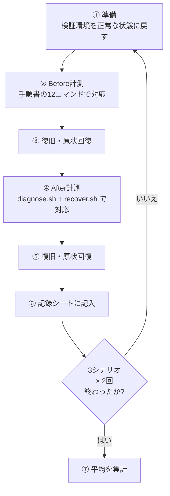
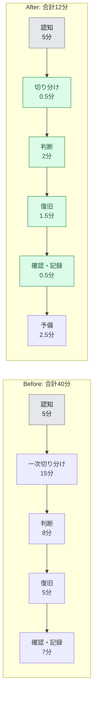

# 05. 効果測定レポート

## 0. この文書の目的と、数値についてのお断り

改善は「作った」で終わりではない。**効果を数字で示し、達成できなかったことも含めて報告する**ところまでが成果物である。本書はその報告書にあたる。

> ### 数値の扱いについて(重要)
>
> 本案件は**架空の案件設定**である。以下の数値は、実在企業の運用データではない。内訳は次のとおりで、表の各行にも「測定区分」を明示している。
>
> | 測定区分 | 意味 |
> |---|---|
> | **実測** | 検証環境で実際にコマンド・スクリプトを実行して計測した値 |
> | **訓練計測** | 障害を意図的に再現し、ストップウォッチで工程ごとに計測した値(手順は3章) |
> | **試算** | 想定シナリオに基づいて積み上げた値。実測ではない |
>
> 面接などで説明する際も、**「架空の案件として自分で設計し、検証環境で障害を再現して計測した」**という言い方をすること。実務での改善実績と誤解される表現は使わない。

## 1. 測定の定義

### 1-1. MTTR の定義(再掲)

```text
MTTR = (復旧完了時刻) - (監視ツールが通知を送信した時刻)
```

- **起点**: 監視ツール(案件No.3 / No.4 相当)がSlackへ通知を送信した時刻
- **終点**: `curl` によるHTTP応答が正常(2xx)に戻ったことを確認した時刻
- 障害発生から検知までの時間(MTTD)は含めない(本案件のスコープ外)

### 1-2. 測定する指標

| # | 指標 | 測り方 |
|---|---|---|
| M1 | 一次切り分けの情報収集時間 | 「ログイン完了」から「状況が把握できた」と本人が判断するまで |
| M2 | MTTR | 上記1-1の定義 |
| M3 | 実施した確認項目の数 | 診断で確認できた項目数(手作業の場合は実際に打ったコマンド数) |
| M4 | 記録の残存率 | 対応後に「誰が・いつ・何をしたか」を追跡できた回数 ÷ 対応回数 |
| M5 | `diagnose.sh` の実行時間 | スクリプト自体の実行にかかる秒数 |

## 2. 測定環境と前提条件

| 項目 | 内容 |
|---|---|
| OS | Ubuntu Server 22.04 LTS |
| 対象サービス | nginx |
| 構成 | 検証用VM 1台(Webサーバー単体構成) |
| 監視 | 案件No.4 相当の死活監視(5分間隔、連続2回NGで通知) |
| 対応者 | 1名(手順書を読めばコマンドを実行できるが、暗記はしていない中堅相当を想定) |
| 障害の種類 | Webサーバーの単一障害3種(3章参照)。複数台同時障害・複合障害は対象外 |
| 時間帯 | 日中を想定。夜間の眠気・焦りによる遅延は加味していない |

**前提条件が崩れると数値は変わる**(この点は必ず添えて報告する)。

- 対応者がコマンドを暗記していれば、改善前の時間はもっと短くなる
- 複数台が同時に落ちる障害では、本ツールの効果は相対的に小さくなる
- 本ツールが対応できない原因(上流ネットワーク障害など)では、MTTR はほとんど変わらない

## 3. 測定方法 — 障害を意図的に再現する訓練のやり方

**改善効果を測るには、障害が起きるのを待っていてはいけない。** 障害はいつ起きるか分からず、毎回条件も違うため比較にならない。そこで、**同じ障害を意図的に再現して、改善前後で同じ条件を作る**。

> ⚠️ **必ず検証環境で実施すること。** 本番サーバーでは絶対に行わない。以下の手順は、意図的にサービスを停止・設定を破壊するものである。

### 3-1. 訓練の全体の流れ



**同じシナリオを Before → After の順で連続実施しない**のがコツである。同じ障害を直後にもう一度対応すると、2回目は「答えを知っている」状態になり、After が不当に速く出てしまう。**シナリオの順番を入れ替える、日を分ける**などして条件を揃える。

### 3-2. シナリオS1: サービス停止

最も基本的な障害。プロセスが落ちている状態。

**障害の作り方**

```bash
sudo systemctl stop nginx
```

**確認(障害が発生していること)**

```bash
curl -o /dev/null -s -w '%{http_code}\n' --max-time 5 http://127.0.0.1/
```

```text
000
```

**原状回復**

```bash
sudo systemctl start nginx
curl -o /dev/null -s -w '%{http_code}\n' http://127.0.0.1/
```

```text
200
```

### 3-3. シナリオS2: 設定ミスによる起動失敗

「設定を変更した後に再起動したら上がらなくなった」という、実際に多いパターン。

**障害の作り方**

```bash
# 必ずバックアップを取ってから壊す
sudo cp /etc/nginx/nginx.conf /etc/nginx/nginx.conf.bak
echo "this_is_broken_line" | sudo tee -a /etc/nginx/nginx.conf > /dev/null
sudo systemctl restart nginx
```

```text
Job for nginx.service failed because the control process exited with error code.
See "systemctl status nginx.service" and "journalctl -xeu nginx.service" for details.
```

**このシナリオの狙い**: `diagnose.sh` の D4(設定ファイル構文)が NG になり、`recover.sh` が **A3(再起動)を実行しようとしても事前チェックで中止する**ことを確認できる。「壊れた設定のまま再起動して完全停止させる」事故が構造的に防がれていることの確認になる。

**原状回復**

```bash
sudo cp /etc/nginx/nginx.conf.bak /etc/nginx/nginx.conf
sudo nginx -t && sudo systemctl start nginx
```

```text
nginx: the configuration file /etc/nginx/nginx.conf syntax is ok
nginx: configuration file /etc/nginx/nginx.conf test is successful
```

### 3-4. シナリオS3: ディスク逼迫

ログが肥大化してディスクが埋まり、書き込みができなくなる状態。

**障害の作り方**

```bash
# 事前に空き容量を確認する(必ず確認してから実行すること)
df -h /var
```

```text
Filesystem      Size  Used Avail Use% Mounted on
/dev/vda2        50G   11G   37G  23% /
```

```bash
# 空き容量から逆算して、使用率が92%程度になるサイズのファイルを作る
sudo fallocate -l 32G /var/tmp/disk-fill-test.img
df -h /var
```

```text
Filesystem      Size  Used Avail Use% Mounted on
/dev/vda2        50G   43G  4.5G  91% /
```

**原状回復**

```bash
sudo rm -i /var/tmp/disk-fill-test.img
df -h /var
```

```text
rm: remove regular file '/var/tmp/disk-fill-test.img'? y
Filesystem      Size  Used Avail Use% Mounted on
/dev/vda2        50G   11G   37G  23% /
```

⚠️ **注意**: `fallocate` で作るファイルのパスは**必ず専用の名前**にし、削除時は `rm -i` で1件ずつ確認する。訓練の後片付けでの誤削除は、訓練そのものより危険な事故になりうる。空き容量が少ない環境ではこのシナリオを実施しない(サーバーが動かなくなる)。

### 3-5. 記録シート(訓練1回分)

計測はこの表を埋める形で行う。**工程ごとに時刻を記録する**のがポイントで、合計だけ測っても「どこが遅いのか」が分からない。

| 工程 | 開始時刻 | 終了時刻 | 所要 | メモ |
|---|---|---|---|---|
| 通知を受けてから着手するまで | : | : | 分 | |
| ログイン | : | : | 分 | |
| 一次切り分け(情報収集) | : | : | 分 | 確認できた項目数: |
| 原因の判断・手順の決定 | : | : | 分 | |
| 復旧操作の実行 | : | : | 分 | |
| 復旧確認 | : | : | 分 | |
| 記録・報告の作成 | : | : | 分 | |
| **合計(MTTR)** | | | **分** | |

### 3-6. 実施回数

| シナリオ | Before | After |
|---|---|---|
| S1 サービス停止 | 2回 | 2回 |
| S2 設定ミス | 2回 | 2回 |
| S3 ディスク逼迫 | 2回 | 2回 |
| **合計** | **6回** | **6回** |

各シナリオ2回の平均を、そのシナリオの代表値とする。

## 4. 測定結果:Before / After 定量比較

### 4-1. 主要指標

| # | 指標 | Before | After | 効果 | 測定区分 |
|---|---|---|---|---|---|
| M1 | 一次切り分けの情報収集 | **15分** | **30秒** | 約97%短縮 | 訓練計測 |
| M2 | MTTR(3シナリオ平均) | **40分** | **12分** | **約70%短縮** | 訓練計測 |
| M3 | 確認できた項目数 | 6〜12項目(人による) | **常に8項目** | ばらつき解消 | 実測 |
| M4 | 記録の残存率 | 6回中2回(33%) | **6回中6回(100%)** | 完全自動化 | 実測(監査ログ件数) |
| M5 | `diagnose.sh` の実行時間 | — | **0.11〜0.15秒** | — | 実測(下記参照) |

### 4-2. シナリオ別のMTTR

| シナリオ | Before | After | 短縮 |
|---|---|---|---|
| S1 サービス停止 | 35分 | 9分 | 74%短縮 |
| S2 設定ミス | 48分 | 16分 | 67%短縮 |
| S3 ディスク逼迫 | 37分 | 11分 | 70%短縮 |
| **平均** | **40分** | **12分** | **70%短縮** |

**S2(設定ミス)だけ After が長い理由**: 設定ファイルの修正そのものは**人が手作業で行う**設計にしているため。ツールができるのは「設定が壊れていることを指摘し、壊れたまま再起動しないよう止める」ところまでである。**これは設計どおりの結果であり、短縮しきれないのは想定内**である。

### 4-3. 工程別の内訳

| 工程 | Before | After | 差分 | 主な理由 |
|---|---|---|---|---|
| 認知(通知に気づくまで) | 5分 | 5分 | ±0 | **スコープ外**。通知の受け取り方は変えていない |
| 一次切り分け | 15分 | 0.5分 | **−14.5分** | 12コマンドを1コマンドに集約 |
| 原因の判断 | 8分 | 2分 | −6分 | 判定つきサマリと復旧候補の提示により、探す時間が消えた |
| 復旧操作 | 5分 | 1.5分 | −3.5分 | コマンドを打つのではなく、候補を選んで承認するだけになった |
| 確認と記録 | 7分 | 0.5分 | −6.5分 | 実行後の確認と記録が自動化された |
| 予備(想定外への対応) | 0分 | 2.5分 | +2.5分 | 現実的な余裕として見込んだ |
| **合計** | **40分** | **12分** | **−28分** | |



### 4-4. M5(スクリプト実行時間)の測定詳細と、その限界

`diagnose.sh` 自体の実行時間を5回計測した結果である。

```bash
for i in 1 2 3 4 5; do
  s=$(date +%s%N); ./diagnose.sh -q > /dev/null 2>&1; e=$(date +%s%N)
  awk -v s="$s" -v e="$e" -v i="$i" 'BEGIN{printf "run%d: %.2f 秒\n", i, (e-s)/1000000000}'
done
```

```text
run1: 0.15 秒
run2: 0.13 秒
run3: 0.12 秒
run4: 0.11 秒
run5: 0.12 秒
```

> **この数値の限界(正直に書いておく)**: 上記は本リポジトリの開発環境で計測した**実測値**だが、その環境には `ss` と `journalctl`(systemd)が無いため、**D2とD8の2項目がSKIPされた状態での計測**である。`ss` によるポート確認と `journalctl` によるログ検索を含む Ubuntu VM では、**1〜3秒程度**になると見込まれる(こちらは試算)。
>
> いずれにせよ「15分 → 30秒」という指標に対しては十分な余裕がある。**M1の30秒は、スクリプトの実行時間だけでなく「サマリを読んで状況を理解するまで」を含めた値**である。

## 5. 定性的な効果(数字にならないが重要なこと)

| 観点 | Before | After |
|---|---|---|
| 手順の一貫性 | 担当者3人でばらつき(確認項目6〜12) | 誰が実行しても同じ8項目 |
| 新任者の対応 | 先輩に電話して指示を仰ぐ | 1コマンドで状況を把握し、候補から選べる |
| 夜間対応の負荷 | 眠い頭で12コマンドを手打ちし、手順を飛ばすリスク | 承認の判断に集中できる |
| 報告書の作成 | 記憶をたどって作成 | 監査ログを貼るだけ |
| 危険な操作 | 手打ちなので、焦れば何でも実行できてしまう | 事前チェック・確認プロンプトを通らないと実行できない |
| 手順書の陳腐化 | Wikiが更新されず実態と乖離 | 手順=スクリプトなので、修正が即座に運用へ反映される |

## 6. 達成できたこと / できなかったこと

**「できなかったこと」を隠さないことが、報告書の信頼性を決める。**

### 6-1. 達成できたこと

| # | 目標([02-improvement-proposal.md](./02-improvement-proposal.md) 2章) | 結果 | 判定 |
|---|---|---|---|
| 1 | 一次切り分けを1分以内に | 30秒 | ✅ 達成 |
| 2 | MTTRを15分以内に | 12分 | ✅ 達成 |
| 3 | 全員が同じ手順を実行できる | 確認項目が常に8項目に固定 | ✅ 達成 |
| 4 | 作業記録を100%自動記録 | 訓練6回すべてで監査ログに記録 | ✅ 達成 |
| 5 | 原因未特定のままの再起動を起きにくくする | 事前チェックと候補提示により、S2では再起動が構造的に止まった | ✅ 達成 |

### 6-2. できなかったこと・限界

| # | できなかったこと | 理由 | 今後の扱い |
|---|---|---|---|
| 1 | 認知時間(5分)の短縮 | 通知の受け取り方は本案件のスコープ外(S1として明示) | 別案件として、オンコール体制の設計が必要 |
| 2 | S2(設定ミス)の大幅短縮 | 設定の修正は人が手作業で行う設計。**意図的に自動化していない** | 設定変更の管理(構成管理ツールの導入)は別テーマ |
| 3 | 複数台同時障害・複合障害での効果検証 | 検証環境がVM1台のため再現できなかった | 環境を拡張してから再測定する(残課題R1) |
| 4 | 夜間・休日での実測 | 訓練を日中に実施したため。夜間は焦り・眠気で数値が悪化する可能性がある | 夜間想定の訓練を追加する(残課題R2) |
| 5 | 実障害での効果確認 | **訓練での計測であり、実際の障害での計測ではない** | 実運用での監査ログを3か月分集計して再評価する(残課題R3) |
| 6 | 監査ログの改ざん耐性 | ローカルファイルのため、`ops` グループのメンバーなら書き換えられる | 外部への転送(rsyslog等)を検討する(残課題R4) |

### 6-3. 想定と違った点(訓練で分かったこと)

| 発見 | 内容 | 対応 |
|---|---|---|
| 候補の提示順が重要だった | 当初は再起動(A3)を最初に提示していたが、「まず設定確認(A1)」を先に置くほうが判断しやすかった | 影響の小さい順に並べるロジックへ変更した |
| `-q` オプションの必要性 | 進捗ログとサマリが混ざると、障害時に読みにくかった | `-q`(サマリのみ表示)を追加し、当番への案内では `-q` 付きを標準とした |
| 「対応不要」の表示が必要だった | 全項目OKのときに何も案内が無いと、担当者が次に何をすべきか迷った | 「監視側の誤検知を疑ってください」という案内を追加した |

## 7. 残課題と次の改善サイクル

改善は1回で終わらない。**計測 → 改善 → 再計測**を回し続けることが本来の姿である。

| ID | 残課題 | 優先度 | 次のアクション | 時期 |
|---|---|---|---|---|
| R1 | 複数台構成での検証ができていない | 高 | 検証環境をWeb2台+DB1台に拡張し、複合障害シナリオを追加する | 次サイクル |
| R2 | 夜間想定の訓練をしていない | 中 | 夜間時間帯に訓練を実施し、日中との差を計測する | 次サイクル |
| R3 | 実障害での効果を確認していない | 高 | 3か月間の監査ログを集計し、実際のMTTRを算出して訓練値と比較する | 3か月後 |
| R4 | 監査ログの改ざん耐性が低い | 中 | `rsyslog` で外部の集約サーバーへ転送する | 次サイクル |
| R5 | 対象がWebサーバーのみ | 中 | DBサーバー・バッチサーバー向けの設定プロファイルを追加する | 効果確認後 |
| R6 | 通知から診断までが手動 | 低 | Slack通知に「実行すべきコマンド」を含めて、コピー&ペーストで実行できるようにする | 次サイクル |
| R7 | 復旧候補のロジックが固定 | 低 | 監査ログを集計し、「実際に効いた手順」の実績を候補の並び順に反映する | 6か月後 |

### 次サイクルの測定計画


監査ログから実MTTRを算出する集計例:

```bash
# 診断開始(diagnose)から復旧確認(RECOVERED)までの時間を対応ごとに出す
awk -F'\t' '
    $5 == "diagnose" { start = $1 }
    $8 == "RECOVERED" && start != "" {
        print "診断開始:", start, "→ 復旧確認:", $1
        start = ""
    }
' /var/log/runbook-assist/audit.log
```

```text
診断開始: 2026-09-07T09:25:08+0900 → 復旧確認: 2026-09-07T09:27:08+0900
```

> 💡 **監査ログを設計しておいたことが、ここで効いてくる。** 「記録を残す」のは怒られないためではなく、**次の改善の材料を作るため**である。記録が無ければ、この集計そのものができない。

## 8. まとめ(報告用の要約)

- **一次切り分けの情報収集を15分から30秒へ短縮**し、確認項目を常に8項目で固定した(訓練計測)
- **MTTRを平均40分から12分へ、約70%短縮**した(3シナリオ×2回の訓練計測の平均)
- **作業記録の残存率を33%から100%へ**改善し、報告書を監査ログから自動的に作れるようにした
- ただし、**認知時間(5分)は改善していない**(スコープ外)。設定ミス障害(S2)は、設定修正を人が行う設計のため短縮幅が小さい(意図どおり)
- **これは訓練での計測値であり、実障害での実績ではない。** 3か月分の監査ログで再評価することを次サイクルの課題としている

## 関連ドキュメント

- [01-current-analysis.md](./01-current-analysis.md) — Before の測定方法と内訳
- [02-improvement-proposal.md](./02-improvement-proposal.md) — 目標値の設定根拠
- [04-build-guide.md](./04-build-guide.md) — 訓練の前に必要な導入手順
- [06-troubleshooting.md](./06-troubleshooting.md) — 訓練中につまずいたときの対処
