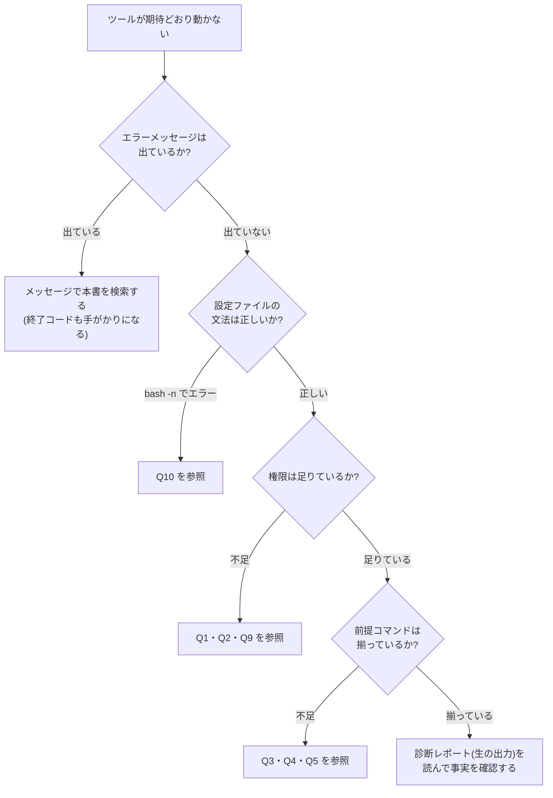

# 06. トラブルシューティング集

導入・運用中に遭遇しやすいトラブルを、Q&A形式でまとめる。**エラーメッセージで検索できるよう、実際の出力をそのまま載せている。**

---

## Q1. 診断を実行すると「出力先ディレクトリを作成できません」と出て終了する

### 現象

```bash
/opt/runbook-assist/diagnose.sh -q
```

```text
2026-09-07 05:04:13 [ERROR] 出力先ディレクトリを作成できません(権限を確認してください): /var/log/runbook-assist/diagnosis
```

```bash
echo $?
```

```text
3
```

### 原因

診断レポートの出力先(`DIAG_DIR`)や状態ファイルの置き場(`STATE_DIR`)に、**実行ユーザーの書き込み権限が無い**。導入手順([04-build-guide.md](./04-build-guide.md) Step 3)の権限設定が漏れているか、実行ユーザーが `ops` グループに入っていないことが多い。

### 対処法

**1. 現在の権限と自分のグループを確認する**

```bash
ls -ld /var/log/runbook-assist /var/log/runbook-assist/diagnosis
id -nG
```

```text
drwxr-xr-x 3 root root 4096 Sep  7 09:01 /var/log/runbook-assist
drwxr-xr-x 2 root root 4096 Sep  7 09:01 /var/log/runbook-assist/diagnosis
tanaka sudo
```

この例では、ディレクトリのグループが `root` のままで、自分は `ops` グループに入っていない。

**2. グループと権限を設定し直す**

```bash
sudo groupadd -f ops
sudo usermod -aG ops "$USER"
sudo chgrp -R ops /var/lib/runbook-assist /var/log/runbook-assist
sudo chmod 2775 /var/lib/runbook-assist /var/log/runbook-assist /var/log/runbook-assist/diagnosis
```

**3. いったんログアウトしてログインし直す**(グループの変更は再ログインしないと反映されない)

```bash
id -nG
```

```text
tanaka sudo ops
```

### 応急処置:権限が無いまま今すぐ診断したい場合

障害対応の最中に権限を直している余裕は無い。その場合は **`-N`(`--no-save`)オプション**を使う。ファイルを一切書かず、画面表示だけを行う。

```bash
/opt/runbook-assist/diagnose.sh -q -N
```

```text
2026-09-07 05:10:02 [INFO] --no-save が指定されたため、ファイルへの出力は行いません。
=====================================================================
 一次切り分け診断サマリ  host=web01  2026-09-07 05:10:02
...
 詳細     : (--no-save のため保存していません)
=====================================================================
```

💡 **ポイント**: 「記録は残らないが診断はできる」状態を用意しておくのは、運用ツールの設計として重要である。**権限が無いというだけで、障害対応そのものが止まってはいけない。**

---

## Q2. 復旧操作が「sudo: a password is required」で失敗する

### 現象

```bash
/opt/runbook-assist/recover.sh -a A2
```

```text
実行: systemctl reload nginx
sudo: a password is required
実行結果: 失敗 (終了コード=1)

復旧操作が失敗しました。これ以上の自動対応は行いません。
診断レポートと監査ログを添えてエスカレーションしてください。
```

### 原因

`recover.sh` は権限が必要なコマンドを **`sudo -n`(パスワードを聞かない非対話モード)** で実行する。sudoers に該当コマンドが `NOPASSWD` で登録されていないと、パスワードを求められた時点で即座に失敗する。

**これは仕様どおりの動作である。** パスワード入力待ちでスクリプトが固まるほうが、障害対応では危険だからである。

### 対処法

**1. 現在許可されているコマンドを確認する**

```bash
sudo -l -U "$USER"
```

```text
User tanaka may run the following commands on web01:
    (ALL : ALL) ALL
```

`NOPASSWD` の行が無い(パスワードが必要な状態)。

**2. sudoers 設定を配置する**([04-build-guide.md](./04-build-guide.md) Step 10)

```bash
sudo visudo -cf src/runbook-assist.sudoers.example
```

```text
src/runbook-assist.sudoers.example: parsed OK
```

```bash
sudo cp src/runbook-assist.sudoers.example /etc/sudoers.d/runbook-assist
sudo chmod 440 /etc/sudoers.d/runbook-assist
```

**3. コマンドのパスが環境と一致しているか確認する**

sudoers ではコマンドを**フルパス**で指定するため、パスが違うと一致しない。

```bash
command -v systemctl nginx logrotate
```

```text
/usr/bin/systemctl
/usr/sbin/nginx
/usr/sbin/logrotate
```

この結果と `/etc/sudoers.d/runbook-assist` の記述が一致していることを確認する。違っていれば、実際のパスに書き換える。

**4. 反映を確認する**

```bash
sudo -l -U "$USER" | grep NOPASSWD
```

```text
    (root) NOPASSWD: /usr/sbin/nginx -t
    (root) NOPASSWD: /usr/bin/systemctl reload nginx, /usr/bin/systemctl restart nginx, /usr/sbin/logrotate --force /etc/logrotate.d/nginx
```

⚠️ **注意**: sudoers ファイルの編集は必ず `visudo -cf` で文法チェックしてから行う。文法エラーがあると `sudo` 自体が使えなくなる。**別の端末で root セッションを開いたまま作業する**のが定石である。

---

## Q3. `systemctl` が使えない環境(コンテナ・WSL)で診断が正しく動かない

### 現象

コンテナやWSL上で実行すると、次のようなエラーが出る。

```bash
systemctl is-active nginx
```

```text
System has not been booted with systemd as init system (PID 1). Can't operate.
Failed to connect to bus: Host is down
```

### 原因

`systemctl` コマンドは存在するが、**systemd が PID 1(=OSの最初のプロセス)として動いていない**ため使えない。Docker コンテナや WSL1、一部の仮想環境で起きる。

### `diagnose.sh` の動作(自動でフォールバックする)

`diagnose.sh` はこの状況を自動で検出し、**`pgrep` によるプロセス確認に切り替える**。

```bash
./diagnose.sh -q
```

```text
 [NG  ] D1 サービス状態: プロセス nginx が見つかりません(systemd未使用のため代替確認)
```

判定の根拠に「systemd未使用のため代替確認」と明記されるため、**なぜその判定になったのかが分かる**ようになっている。

**検出のしくみ**:

```bash
systemd_available() {
    rb_have_cmd systemctl && [ -d /run/systemd/system ]
}
```

`/run/systemd/system` は systemd が PID 1 として動いているときにだけ存在する。**コマンドの有無だけでは判定できない**ため、この2条件で確認している。

### `recover.sh` の動作(実行を拒否する)

復旧側は、フォールバックせずに**拒否する**。

```bash
./recover.sh -a A3
```

```text
2026-09-07 04:43:26 [ERROR] systemd が利用できない環境のため A3 は実行できません。
2026-09-07 04:43:26 [ERROR] この環境では、サービスの起動方法に合わせた手順で手動対応してください。
```

```bash
echo $?
```

```text
3
```

**なぜ診断はフォールバックし、復旧は拒否するのか**

| | 方針 | 理由 |
|---|---|---|
| 診断(読み取り) | 代替手段でも情報を集める | 情報は少しでも多いほうがよい。間違っても実害が無い |
| 復旧(状態変更) | 環境が想定と違えば実行しない | 想定外の環境で状態を変える操作をすると、何が起きるか分からない(安全側に倒す) |

### 対処法

コンテナ環境で運用する場合は、そのコンテナのサービス起動方法(`supervisord`、エントリポイントスクリプトなど)に合わせて、`runbook.conf` の `WEB_PROCESS` を実際のプロセス名に設定し、**復旧操作は手作業で行う**。本ツールは systemd 環境を前提としている。

---

## Q4. `journalctl` にログが無く、D8 が SKIP になる

### 現象

```bash
journalctl -u nginx -n 10 --no-pager
```

```text
No journal files were found.
-- No entries --
```

```text
 [SKIP] D8 直近ログのエラー: 参照できるログがありません(journalctl も /var/log/nginx/error.log も読めません)
```

### 原因

考えられる原因は3つある。

| # | 原因 | 確認方法 |
|---|---|---|
| 1 | ジャーナルの永続化が無効(再起動でログが消える設定) | `ls -d /var/log/journal`(存在しなければ揮発モード) |
| 2 | 実行ユーザーにジャーナルの読み取り権限が無い | `id -nG`(`adm` または `systemd-journal` に入っているか) |
| 3 | そもそも systemd が動いていない環境 | Q3を参照 |

### 対処法

**原因1(永続化が無効)の場合**

```bash
ls -d /var/log/journal 2>&1
```

```text
ls: cannot access '/var/log/journal': No such file or directory
```

永続化を有効にする。

```bash
sudo mkdir -p /var/log/journal
sudo systemd-tmpfiles --create --prefix /var/log/journal
sudo systemctl restart systemd-journald
journalctl -u nginx -n 3 --no-pager
```

```text
Sep 07 09:12:01 web01 systemd[1]: Started A high performance web server and a reverse proxy server.
```

**原因2(権限不足)の場合**

```bash
sudo usermod -aG adm "$USER"
```

再ログイン後に確認する。

**それでも参照できない場合:ログファイルを直接見る設定にする**

`runbook.conf` の `ERROR_LOG_FILES` に、実際のログファイルを指定する。`journalctl` が使えない場合、`diagnose.sh` は自動的にこちらを参照する。

```bash
ls -l /var/log/nginx/
```

```text
-rw-r----- 1 www-data adm  8213 Sep  7 09:12 access.log
-rw-r----- 1 www-data adm  1024 Sep  7 09:12 error.log
```

```bash
sudo vi /opt/runbook-assist/runbook.conf
# ERROR_LOG_FILES="/var/log/nginx/error.log /var/log/php8.1-fpm.log"
```

💡 **ポイント**: `SKIP` は「異常」ではなく「**確認できなかった**」という意味である。異常と混同しないよう、サマリでは `NG` と `SKIP` を明確に分けて表示している。ただし、SKIPが多い状態は「診断の目が塞がっている」状態でもあるので、平時に解消しておくこと。

---

## Q5. `ss: command not found` で D2(リッスンポート)が SKIP になる

### 現象

```text
 [SKIP] D2 リッスンポート: ss / netstat のどちらも無いため確認できません
```

### 原因

`ss` は `iproute2` パッケージ、`netstat` は `net-tools` パッケージに含まれる。最小構成のOSイメージやコンテナでは、どちらも入っていないことがある。

### 対処法

```bash
sudo apt install -y iproute2
command -v ss
```

```text
/usr/bin/ss
```

```bash
/opt/runbook-assist/diagnose.sh -q
```

```text
 [OK  ] D2 リッスンポート: 待ち受け確認 OK (80)
```

### 補足:ポート確認の代わりになるもの

`ss` をどうしても入れられない場合、D3(HTTP応答)がその役割の一部を代替する。**実際にHTTPで接続できているなら、ポートは待ち受けている**からである。ただし「プロセスは生きているが待ち受けていない」という状態の切り分けはできなくなる。

---

## Q6. cron や CI から実行すると、確認プロンプトで止まる/実行されない

### 現象

cron から `recover.sh` を実行しても、復旧操作が行われない。ログには次のように残る。

```text
端末が無い環境のため、ここで終了します。候補の提示のみ行いました。
実行する場合は、担当者が端末から recover.sh を実行してください。
```

```bash
echo $?
```

```text
4
```

### 原因

**これは仕様どおりの動作である。** バグではない。

`recover.sh` は、標準入力・標準出力が端末(キーボードと画面)につながっていない場合、**復旧操作を実行しない**設計になっている。

```bash
rb_is_interactive() {
    [ -t 0 ] && [ -t 1 ]
}
```

### なぜこの仕様なのか

無人環境で自動的に復旧操作が走ると、本案件の設計方針([02-improvement-proposal.md](./02-improvement-proposal.md) 5章)である「**実行の判断は人が行う**」が崩れる。承認を取れないなら、実行しないほうが安全である(安全側に倒す)。

### 対処法(用途別)

| やりたいこと | 方法 |
|---|---|
| 定期的に状況を確認したい | `diagnose.sh` を cron に登録する。診断は読み取り専用なので無人実行して問題ない |
| 提示される候補が壊れていないか定期確認したい | `recover.sh --dry-run` を cron で実行する。dry-run は非対話環境でも動作する |
| 復旧を実行したい | **担当者が端末から実行する**(この運用は変更しない) |

cron 登録例(診断のみ):

```text
# 15分ごとに診断を実行し、異常時のみログに残す
*/15 * * * * /opt/runbook-assist/diagnose.sh -q > /dev/null 2>&1 || logger -t runbook-assist "診断で異常検出(終了コード $?)"
```

💡 **ポイント**: 診断は無人で回してよく、復旧は人が居るときだけ、という**役割の非対称性**が、このツールの設計そのものを表している。

---

## Q7. 「他の recover.sh が実行中です」と出て起動できない

### 現象

```bash
/opt/runbook-assist/recover.sh -a A1
```

```text
2026-09-07 05:04:14 [ERROR] 他の recover.sh が実行中です。完了を待ってから実行してください。
```

```bash
echo $?
```

```text
3
```

### 原因

`recover.sh` は `flock` によって**同時に1つしか起動できない**ようにしている。障害時に複数人が同時に対応を始めて、同じサービスを同時に再起動してしまう事故を防ぐためである。

### 対処法

**1. 本当に他の人が実行中でないか確認する**

```bash
ps -ef | grep -F 'recover.sh' | grep -v grep
```

```text
suzuki   28451 28430  0 09:31 pts/1    00:00:00 /usr/bin/bash /opt/runbook-assist/recover.sh
```

**実行中のプロセスがある場合は、そのまま待つ。** 障害対応中に2人が別々の操作を始めるのは、最も避けたい状況である。Slack などで声を掛け合い、対応者を1人に決めること。

**2. プロセスが存在しないのにロックが残っている場合**

```bash
ps -ef | grep -F 'recover.sh' | grep -v grep
```

```text
(何も表示されない)
```

このときは、ロックファイルを開いているプロセスがあるか確認する。

```bash
sudo fuser -v /var/lib/runbook-assist/recover.lock
```

```text
(何も表示されなければ、ロックは保持されていない)
```

`flock` はファイルではなく**ファイルディスクリプタに対してロックをかける**ため、プロセスが終了すればロックは自動的に解放される。**ロックファイルが残っていること自体は問題ではない**(削除する必要はない)。それでも起動できない場合は、SSHセッションが切れて残ったプロセスがいないかを確認する。

```bash
ps -ef | grep -F 'runbook-assist' | grep -v grep
```

💡 **ポイント**: ロックファイルを見つけて `rm` したくなるが、**まず「本当に誰かが実行中ではないか」を確認する**のが正しい順序である。ロックは事故を防ぐために存在している。

---

## Q8. `recover.sh` が「診断結果が見つかりません」と表示する

### 現象

```bash
/opt/runbook-assist/recover.sh --dry-run
```

```text
2026-09-07 09:35:02 [WARN] 診断結果が見つかりません: /var/lib/runbook-assist/last-diagnosis.env
2026-09-07 09:35:02 [WARN] 先に diagnose.sh を実行してください(候補は提示できません)。
```

### 原因

`recover.sh` は、`diagnose.sh` が書き出した診断結果ファイル(`last-diagnosis.env`)を読んで復旧候補を組み立てる。このファイルが無い、つまり**まだ一度も診断を実行していない**状態である。

診断せずに復旧候補を出すことは、設計上できない。**状況を確認せずに「とりあえずこれをやりましょう」と提案するツール**にはしない、という方針のためである。

### 対処法

**1. 先に診断を実行する**

```bash
/opt/runbook-assist/diagnose.sh -q
/opt/runbook-assist/recover.sh --dry-run
```

**2. 診断は実行したのにファイルが無い場合**

`diagnose.sh` を `-N`(`--no-save`)付きで実行していると、結果ファイルは作られない。`-N` を外して実行し直す。

```bash
ls -l /var/lib/runbook-assist/last-diagnosis.env
```

```text
-rw-rw-r-- 1 tanaka ops 512 Sep  7 09:36 last-diagnosis.env
```

**3. 診断せずに特定のアクションだけ実行したい場合**

アクションIDを直接指定すれば、診断結果が無くても実行できる(前提チェックと承認プロンプトは通常どおり行われる)。

```bash
/opt/runbook-assist/recover.sh -a A1
```

---

## Q9. 「監査ログを利用できないため、復旧操作は実行しません」と表示される

### 現象

```bash
/opt/runbook-assist/recover.sh -a A1
```

```text
2026-09-07 05:04:13 [ERROR] 監査ログのディレクトリを作成できません: /var/log/runbook-assist
2026-09-07 05:04:13 [ERROR] 監査ログを利用できないため、復旧操作は実行しません。
2026-09-07 05:04:13 [ERROR] AUDIT_LOG のパスと権限を確認してください: /var/log/runbook-assist/audit.log
```

```bash
echo $?
```

```text
3
```

### 原因

**これも仕様どおりの動作である。**

本設計では「**記録が残せないなら、復旧操作も実行しない**」という原則を採っている([03-design.md](./03-design.md) 1章 原則3)。記録に残らない変更をサーバーに加えないための、意図的な制限である。

なお、**診断(`diagnose.sh`)は監査ログが無くても続行する**。読み取り専用でサーバーの状態を変えないため、記録できなくても実害が無いからである(その場合は警告だけを表示する)。

### 対処法

**1. 監査ログのパスと権限を確認する**

```bash
ls -l /var/log/runbook-assist/audit.log
```

```text
-rw-r----- 1 root root 2481 Sep  7 09:27 /var/log/runbook-assist/audit.log
```

グループが `root` のままで、`ops` グループのメンバーが書けない状態である。

**2. 権限を修正する**

```bash
sudo chgrp ops /var/log/runbook-assist/audit.log
sudo chmod 660 /var/log/runbook-assist/audit.log
sudo chmod 2775 /var/log/runbook-assist
ls -l /var/log/runbook-assist/audit.log
```

```text
-rw-rw---- 1 root ops 2481 Sep  7 09:27 /var/log/runbook-assist/audit.log
```

**3. ディスクが満杯でないか確認する**

ディスク使用率100%でも書き込みに失敗する。この場合、復旧操作より先にディスクの空き容量を確保する必要がある。

```bash
df -h /var/log
```

```text
Filesystem      Size  Used Avail Use% Mounted on
/dev/vda2        50G   50G     0 100% /
```

💡 **ポイント**: この状況は「**ツールが動かないから手作業に切り替える**」と判断すべき場面である。手順書に元の12コマンドを残しておくのは、まさにこのためである([04-build-guide.md](./04-build-guide.md) Step 15)。

---

## Q10. 設定ファイルを編集したら、全項目が「未設定または空です」になった

### 現象

```bash
/opt/runbook-assist/diagnose.sh -q
```

```text
/opt/runbook-assist/runbook.conf: line 21: unexpected EOF while looking for matching `"'
2026-09-07 05:04:13 [ERROR] 設定ファイルの項目が未設定または空です: WEB_SERVICE
2026-09-07 05:04:13 [ERROR] 設定ファイルの項目が未設定または空です: HEALTH_URL
2026-09-07 05:04:13 [ERROR] 設定ファイルの項目が未設定または空です: AUDIT_LOG
2026-09-07 05:04:13 [ERROR] 設定ファイルの項目が未設定または空です: DIAG_DIR
2026-09-07 05:04:13 [ERROR] 設定ファイルの項目が未設定または空です: STATE_DIR
2026-09-07 05:04:13 [ERROR] 設定ファイルの内容を確認してください: /opt/runbook-assist/runbook.conf
```

### 原因

1行目の `unexpected EOF while looking for matching '"'` が本当の原因である。**設定ファイルの引用符(`"`)が閉じられていない**ため、途中で読み込みが止まり、それ以降の設定がすべて未定義になっている。

設定ファイルは Bash の変数定義として読み込まれる(`source`)ため、Bashの文法エラーがあるとこうなる。

### 対処法

**1. 文法チェックを行う**

```bash
bash -n /opt/runbook-assist/runbook.conf
```

```text
/opt/runbook-assist/runbook.conf: line 21: unexpected EOF while looking for matching `"'
/opt/runbook-assist/runbook.conf: line 30: syntax error: unexpected end of file
```

**2. 指摘された行を修正する**

```bash
sed -n '19,22p' /opt/runbook-assist/runbook.conf
```

```text
# 監視・復旧の対象とするサービス名(systemd のユニット名)
WEB_SERVICE="nginx
```

引用符が閉じていない。`WEB_SERVICE="nginx"` に修正する。

**3. 修正後にもう一度チェックする**

```bash
bash -n /opt/runbook-assist/runbook.conf && echo "設定ファイルの文法OK"
```

```text
設定ファイルの文法OK
```

💡 **ポイント**: 設定ファイルを編集したら、**必ず `bash -n` で文法チェックしてから保存を確定する**習慣をつける。障害対応の直前に設定を触って壊すのが、最も痛いパターンである。よくある間違いは、引用符の閉じ忘れ・`=` の前後にスペースを入れる(`WEB_SERVICE = "nginx"` は誤り)・全角スペースの混入の3つ。

---

## Q11. 診断は全項目OKなのに、監視から障害通知が来続ける

### 現象

```text
 総合判定 : OK (NG=0 WARN=0 OK=8 SKIP=0)
 次の一手 : 対応不要です。障害通知が誤検知でなかったか、通知元の条件を確認してください。
```

それでも Slack には「web01 が2回連続NG」という通知が届き続ける。

### 原因

**サーバー自身から見れば正常だが、監視サーバーから見ると異常**という状態である。原因は主に次の3つ。

| # | 原因 | 確認方法 |
|---|---|---|
| 1 | 監視サーバーとWebサーバーの間のネットワーク障害 | 監視サーバーから `curl -v http://web01/` |
| 2 | ファイアウォール・セキュリティグループの設定変更 | `sudo ufw status` / クラウドのSG設定 |
| 3 | 監視の設定ミス(URL・ポート・期待するステータスコードの誤り) | 監視側の `targets.conf` を確認 |

### 対処法

**1. 監視サーバー側から確認する**

```bash
# 監視サーバー上で実行する
curl -o /dev/null -s -w '%{http_code}\n' --max-time 5 http://192.168.1.11/
```

```text
000
```

サーバー自身では200なのに監視サーバーからは000であれば、**問題はWebサーバーではなく経路にある**。

**2. ファイアウォールを確認する**

```bash
sudo ufw status
```

```text
Status: active

To                         Action      From
--                         ------      ----
80/tcp                     ALLOW       192.168.1.0/24
```

**3. 監視側の設定を確認する**

[案件No.4](../../projects/04-server-health-check/README.md) の `targets.conf` で、URLや期待するステータスコードが正しいかを確認する。

💡 **ポイント**: **「診断がOKなのに通知が来る」は、ツールの不具合ではなく重要な情報である。** 「サーバー自身は正常」という事実が確定しているため、調査範囲を「サーバーの外側(経路・ファイアウォール・監視設定)」に絞り込める。これは、診断ツールが無かった頃には得られなかった情報である。この場合、**サーバーを再起動しても何も解決しない**。全自動復旧を採用しなかった理由([02-improvement-proposal.md](./02-improvement-proposal.md) 5-1章)が、そのまま当てはまるケースでもある。

---

## 困ったときの確認順序(まとめ)

トラブルが起きたら、次の順で確認する。



**終了コードによる切り分け**

| 終了コード | 意味 | 主な確認先 |
|---|---|---|
| 0 | 正常 | — |
| 1 | 警告あり(診断) | 閾値の設定が実態に合っているか |
| 2 | 異常あり / 復旧未確認 | 診断レポートの詳細を確認 |
| 3 | 実行エラー | Q1・Q2・Q7・Q9・Q10 |
| 4 | 承認されなかった / 非対話 | Q6 |

## 関連ドキュメント

- [03-design.md](./03-design.md) — 各動作の設計意図(なぜその仕様なのか)
- [04-build-guide.md](./04-build-guide.md) — 導入手順とロールバック
- [05-effect-measurement.md](./05-effect-measurement.md) — 障害再現訓練の手順
