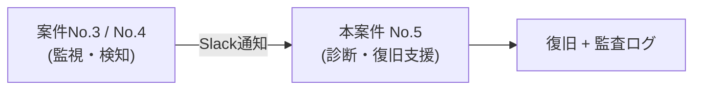

# 改善案件No.5: 手順書ベースの障害対応を半自動化してMTTRを短縮

## 難易度

★★★★☆(中級〜上級)

技術的には Bash と標準的な診断コマンド(`systemctl` / `df` / `free` / `ss` / `journalctl` など)の組み合わせであり、使う道具そのものは難しくない。この案件が中級〜上級である理由は、次の3点にある。

| 難しさの理由 | 内容 |
|---|---|
| 設計判断が問われる | 「どこまで自動化し、どこから先を人に残すか」という線引きを、自分で決めて説明できなければならない |
| 安全設計が必須 | 復旧操作は本番サービスに影響する。確認プロンプト・`--dry-run`・タイムアウト・失敗時に何もしない設計を、すべて自分で組み込む必要がある |
| 効果を数字で示す必要がある | 「作った」で終わらず、改善前後を計測して比較し、達成できなかったことまで正直に報告するところまでが成果物になる |

コードを書く力よりも、**「なぜその設計にしたのか」を言葉で説明する力**が問われる案件である。

## 想定依頼元・背景

> **これは架空の案件設定である。** 実在の企業から受注した実務案件ではなく、学習用に自分で設定したシナリオに基づいて、検証環境(Ubuntu Server 22.04 LTS)で設計・実装・計測を行ったものである。本ドキュメントに登場する会社名・体制・改善前の運用実態は、すべて学習用に作成した想定である。

| 項目 | 内容 |
|---|---|
| 依頼元 | 株式会社サンプル商事(架空社名。構築案件パック No.1〜No.6 と同一の会社という想定) |
| 部署 | 情報システム部門(障害対応の当番を3名で回している) |
| 対象システム | 自社ECサイトのWebサーバー(nginx) |
| きっかけ | [案件No.3(ログ監視・アラート通知)](../../projects/03-log-monitoring-alert/README.md)と[案件No.4(サーバー死活監視)](../../projects/04-server-health-check/README.md)の導入で「障害に早く気づける」ようにはなった。しかし、通知が来たあとの**対応そのものは手作業のまま**で、復旧までの時間が短くならなかった |
| 依頼 | 「気づくのは早くなったので、次は**直すまでの時間**を短くしたい。ただし、勝手にサーバーを触るツールは怖いので入れたくない」 |

**この案件の位置づけ**: 監視ツール(No.3・No.4)が出す通知を受け取ったところから、対応が始まる。つまり本案件は「検知の後工程」を担当する。



## 改善前の状況(As-Is)の要約

- Webサーバーの障害通知(Slack)を受けると、当番の担当者がWikiの手順書を開き、**12個のコマンドを手打ち**して切り分けを行っていた
- 一次切り分け(=障害の全体像をつかむための最初の情報収集)だけで**約15分**
- 検知から復旧完了までの **MTTR(平均復旧時間)は約40分**
- 担当者3名で手順にばらつきがあり、「Aさんはログまで見るがBさんは見ない」といった差が出ていた
- 夜間対応では焦って手順を飛ばし、原因を見誤ったまま再起動してしまうミスも起きた
- 作業記録は各自のメモ頼りで、後から「誰が何をしたのか」を追えなかった

詳細は [01-current-analysis.md](./01-current-analysis.md) を参照。

## 依頼内容(改善要求)

1. 通知を受けてから状況を把握するまでの時間を短縮すること(一次切り分けの自動化)
2. 誰が対応しても同じ手順・同じ品質になること(属人化の解消)
3. **サーバーを勝手に再起動するような仕組みにはしないこと**(誤検知で被害が広がるのを避けたい)
4. 実施した操作の記録が自動的に残ること(後から追跡できること)
5. 新しい監視製品の購入はしない(既存の環境と標準コマンドの範囲で実現すること)

## 改善結果サマリ(Before → After)

| 指標 | Before(改善前) | After(改善後) | 効果 |
|---|---|---|---|
| 一次切り分けの情報収集 | **15分**(12コマンドを手打ち) | **30秒**(`diagnose.sh` 1回) | 約97%短縮 |
| MTTR(検知から復旧まで) | **平均40分** | **平均12分** | **約70%短縮** |
| 手順のばらつき | 担当者3人でバラバラ | 全員が同じ手順(スクリプトが手順そのもの) | 属人化を解消 |
| 作業記録 | 個人メモ頼り(残らないことも) | 監査ログに自動記録(誰が・いつ・何を・結果まで) | 追跡可能に |
| 危険な操作の実行 | 手打ちのため、焦ると手順を飛ばせてしまう | 確認プロンプト+事前チェックを通らないと実行できない | 事故の起きにくい構造に |

> **数値の根拠について**: Before の数値は、Wikiの手順書に沿って同じ手順を検証環境で実際に手打ちして計測した値と、想定シナリオ(通知から復旧までの内訳)に基づく試算を組み合わせたものである。After の数値は、検証環境で障害を意図的に再現して計測した実測値に基づく。測定方法・前提条件・計測できなかった項目は [05-effect-measurement.md](./05-effect-measurement.md) にすべて記載している。

## 成果物一覧

| No. | ファイル | 内容 |
|---|---|---|
| 1 | [README.md](./README.md) | 本ファイル。案件概要・改善結果・アピールポイント |
| 2 | [01-current-analysis.md](./01-current-analysis.md) | 現状分析書(As-Is)。現行フロー・12コマンドの棚卸し・時間内訳・実害 |
| 3 | [02-improvement-proposal.md](./02-improvement-proposal.md) | 改善提案書。4案の比較評価・選定理由・**全自動を採用しなかった理由**・リスクと対策 |
| 4 | [03-design.md](./03-design.md) | 改善設計書(To-Be)。全体フロー・診断項目と判定基準・確認プロンプト設計・監査ログ仕様・安全設計 |
| 5 | [04-build-guide.md](./04-build-guide.md) | 実装・移行手順書。段階導入(診断のみ→復旧半自動)とロールバック手順つき |
| 6 | [05-effect-measurement.md](./05-effect-measurement.md) | 効果測定レポート。Before/After比較・測定方法(障害再現訓練の手順)・未達事項・次の改善 |
| 7 | [06-troubleshooting.md](./06-troubleshooting.md) | トラブルシューティング集(Q&A形式・11件) |
| 8 | [src/diagnose.sh](./src/diagnose.sh) | 一次切り分け自動化スクリプト(読み取り専用) |
| 9 | [src/recover.sh](./src/recover.sh) | 復旧半自動化スクリプト(候補提示+承認つき実行) |
| 10 | [src/lib/common.sh](./src/lib/common.sh) | 共通関数ライブラリ(ログ・監査ログ・確認プロンプト・タイムアウト実行) |
| 11 | [src/runbook.conf](./src/runbook.conf) | 共通設定ファイル(対象サービス・閾値・許可アクション) |
| 12 | [src/runbook-assist.sudoers.example](./src/runbook-assist.sudoers.example) | 最小権限のsudo設定例 |
| 13 | [src/runbook-assist.logrotate](./src/runbook-assist.logrotate) | 監査ログ・診断レポートのローテート設定例 |

## 使用技術・ツール

| 分類 | 技術・コマンド |
|---|---|
| シェル | Bash(`#!/usr/bin/env bash`、`set -uo pipefail`) |
| サービス状態の確認 | `systemctl is-active` / `systemctl status` / `pgrep`(systemdが無い環境のフォールバック) |
| ネットワークの確認 | `ss -ltn`(待ち受けポート) / `curl -w '%{http_code}'`(HTTPステータスコード) |
| リソースの確認 | `df -P`(ディスク) / `free -m`(メモリ) / `/proc/loadavg` + `nproc`(CPU負荷) |
| ログの確認 | `journalctl -u <unit> --since` / `tail` / `grep -E` |
| 安全設計 | 確認プロンプト(`read -r -t`) / `--dry-run` / `timeout` / `flock`(多重起動防止) / 許可リスト方式 |
| 権限の最小化 | `sudo -n` + `/etc/sudoers.d` によるコマンド単位の許可 |
| 記録 | TSV形式の監査ログ / `awk -F'\t'` による集計 / `logrotate` による世代管理 |
| 設計要素 | 終了ステータス設計(0/1/2/3/4)/ 設定と処理の分離 / 冪等性(何度実行しても壊れない) |
| 検証環境 | Ubuntu Server 22.04 LTS + nginx |

## この案件で身につくスキル

- **MTTR という指標**を理解し、「検知」「切り分け」「判断」「復旧」「記録」に分解して、どこが遅いのかを数字で説明できる
- 一次切り分けの型(**サービス → リソース → ログ** の順に見る)を、理由とセットで説明できる
- 「自動化してよい操作」と「人が判断すべき操作」を線引きし、その基準を言語化できる
- 確認プロンプト・`--dry-run`・タイムアウト・許可リストといった、**危険な操作を安全に扱うための実装パターン**を書ける
- 監査ログ(誰が・いつ・何を・結果)を設計し、`awk` で集計して報告に使える
- 「失敗したら何もしない」「何度実行しても壊れない(冪等性)」という、運用ツールに必須の考え方を実装に落とせる
- 改善の効果を、**障害を意図的に再現する訓練**によって計測し、達成できなかったことも含めて報告できる

## 面接でアピールできるポイント(3つ、実際に話すセリフ例つき)

### 1. あえて「全自動復旧」にしなかった理由を説明できる(この案件の核心)

> 「架空の案件として自分で設計したものですが、最初は『通知が来たら自動で再起動する』全自動案も検討しました。ただ、実際にどういう障害が起きるかを整理してみると、**監視の誤検知や、上流ネットワークの問題でも同じ通知が飛んでくる**ことが分かりました。その状態で自動再起動が走ると、原因ではないサーバーを落として被害を広げるうえ、再起動でログや状態が消えて原因調査もできなくなります。
>
> そこで**『情報収集』と『手順の提示』までは全自動、『実行するかどうかの判断』は人が持つ**、という線引きにしました。判断に必要な材料を30秒で揃えることが目的で、判断自体を機械に肩代わりさせるのが目的ではない、と整理したんです。実装上も、危険度の高い操作は `yes` と全文字入力しないと実行できないようにし、非対話環境では実行そのものを拒否する作りにしています。**やらないことを決めるのも設計だ**と考えています。」

### 2. 一次切り分けを「型」として実装し、属人化を解消した

> 「改善前は、Wikiの手順書を見ながら12個のコマンドを手打ちしていて、一次切り分けだけで15分かかっていました。しかも担当者3人で手順にばらつきがあり、ログまで見る人と見ない人がいました。
>
> そこで `diagnose.sh` という1本のスクリプトに、**サービス → リソース → ログ**の順で8項目を確認する処理をまとめました。この順番には理由があって、まず『利用者から見て壊れているか』をサービス系で確定させ、次に『動けない理由』をリソースで探し、最後にログで裏付けを取る、という流れにしています。結果は判定つきのサマリ1画面にまとめ、生のコマンド出力は詳細レポートに残します。検証環境での計測では、情報収集が15分から30秒になりました。**スクリプトそのものが手順書になったので、誰が対応しても同じ結果になります。**」

### 3. 「記録が残らないなら実行しない」という監査の設計まで踏み込んだ

> 「改善前は作業記録が各自のメモ頼りで、後から『誰が何をしたのか』を追えませんでした。そこで、実行者・時刻・操作内容・結果・終了コードをタブ区切りで残す監査ログを設計しました。`sudo` 経由でも実際の実行者が分かるように、`SUDO_USER` を優先して記録しています。
>
> 特にこだわったのは、**監査ログに書き込めない場合は復旧操作を実行しない**という仕様です。記録が残らない変更をサーバーに加えないための、意図的な制限です。加えて、同じ復旧操作を10分以内に繰り返した場合は警告を出すようにしました。『再起動しても直らない』を機械的に繰り返すのではなく、人に立ち止まって考えてもらうためです。監査ログは `awk -F'\t'` で集計でき、実際に効果測定レポートの数字はこのログから出しています。」

## 学習時間の目安

| フェーズ | 目安時間 |
|---|---|
| 前提知識のインプット(MTTR・一次切り分けの型・systemd の基礎) | 3〜4時間 |
| 現状分析(手順の棚卸しと時間計測) | 2〜3時間 |
| 改善案の比較検討・設計(自動化の線引きを言語化する) | 3〜4時間 |
| `diagnose.sh` の実装・動作確認 | 4〜6時間 |
| `recover.sh`(確認プロンプト・dry-run・監査ログ)の実装・動作確認 | 5〜7時間 |
| 障害再現による効果測定・ドキュメント整備 | 4〜5時間 |
| **合計目安** | **21〜29時間程度**(4〜5日程度) |

構築案件パックの No.3・No.4 を済ませている場合は、下限に近い時間で到達できる想定。

## 前提知識

- Linuxの基本操作(`cd` / `ls` / `cat` / `tail` / テキストエディタでのファイル編集)
- シェルスクリプトの基礎文法(変数、`if`、`for`、関数、コマンドの終了コード)
- `systemctl` でサービスを起動・停止・状態確認したことがある
- `sudo` と権限の基本的な考え方(rootとは何か)
- HTTPステータスコード(200 / 404 / 502 など)の大まかな意味
- [案件No.4](../../projects/04-server-health-check/README.md)相当の監視ツールを一度作った経験があると、通知から対応が始まる流れを実感しやすい

シェルスクリプトが初めてでも、[04-build-guide.md](./04-build-guide.md) を上から順に実行すれば動作確認まで到達できる構成にしている。

## ディレクトリ構成

```text
improvements/05-runbook-semi-automation/
├── README.md                    # 本ファイル(案件概要)
├── 01-current-analysis.md       # 現状分析書(As-Is)
├── 02-improvement-proposal.md   # 改善提案書(案の比較と選定理由)
├── 03-design.md                 # 改善設計書(To-Be)
├── 04-build-guide.md            # 実装・移行手順書(段階導入とロールバック)
├── 05-effect-measurement.md     # 効果測定レポート
├── 06-troubleshooting.md        # トラブルシューティング集
└── src/                         # 実際に動作するスクリプト・設定一式
    ├── diagnose.sh              # 一次切り分け自動化(読み取り専用)
    ├── recover.sh               # 復旧半自動化(承認つき実行)
    ├── runbook.conf             # 共通設定ファイル
    ├── runbook-assist.sudoers.example  # 最小権限のsudo設定例
    ├── runbook-assist.logrotate        # ログのローテート設定例
    └── lib/
        └── common.sh            # 共通関数ライブラリ
```

## 関連ドキュメント

- [01-current-analysis.md](./01-current-analysis.md) — 改善前のフロー・12コマンドの棚卸し・時間内訳
- [02-improvement-proposal.md](./02-improvement-proposal.md) — 改善案4件の比較と選定理由、全自動を採用しなかった理由
- [03-design.md](./03-design.md) — To-Be設計(処理フロー・判定基準・監査ログ仕様・安全設計)
- [04-build-guide.md](./04-build-guide.md) — 導入手順(段階導入・ロールバック含む)
- [05-effect-measurement.md](./05-effect-measurement.md) — 効果測定の方法と結果、残課題
- [06-troubleshooting.md](./06-troubleshooting.md) — よくあるエラーと対処法
- [案件No.3: ログ監視・アラート通知](../../projects/03-log-monitoring-alert/README.md) — 本案件が受け取る通知の発生元(その1)
- [案件No.4: サーバー死活監視・障害検知](../../projects/04-server-health-check/README.md) — 本案件が受け取る通知の発生元(その2)
