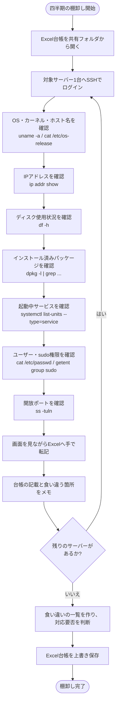
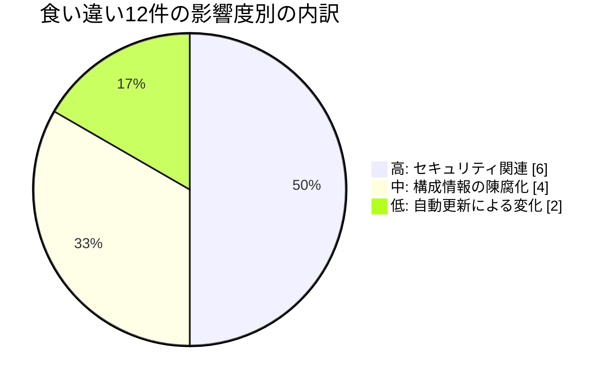
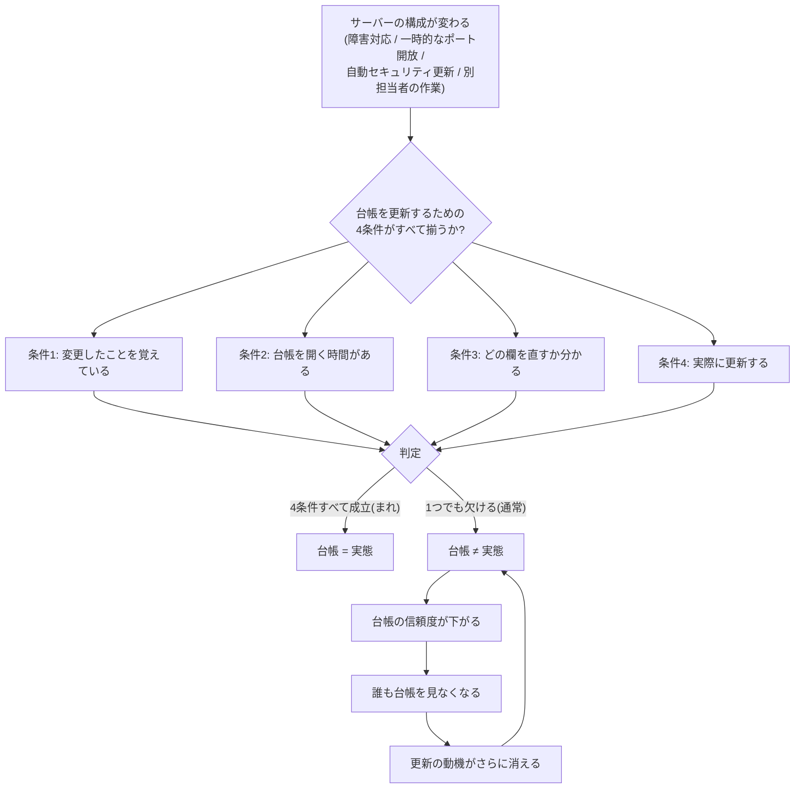

# 現状分析書(As-Is) — 手動更新のサーバー台帳

> **注意: この案件は架空の設定である。** 株式会社サンプル商事は実在しない。本書に記載した作業時間・食い違いの件数は、**学習用に設計した想定シナリオに基づく試算**であり、実在企業での実測値ではない。試算の根拠は本書内にすべて明示している。

## 1. この文書の目的

改善を提案する前に、「今どうなっているのか」を数字と事実で押さえる。改善案件では、ここが曖昧なまま手を動かすと、次の2つの失敗が起きる。

| 失敗の型 | 内容 |
|---|---|
| 効果が説明できない | 「便利になりました」としか言えず、改善したかどうかを誰も判断できない |
| 的外れな改善になる | 本当のボトルネックではないところを自動化してしまい、現場の負担が変わらない |

そのため本書では、**(1) 作業の流れ**、**(2) 作業時間の内訳**、**(3) 実際に起きた問題**、**(4) なぜそれが起きるのかの構造**、の4点を順に整理する。

## 2. 現行の棚卸し作業の流れ

現在、株式会社サンプル商事の情報システム課では、四半期に1度、担当者1名が全6台のサーバーを対象に「棚卸し」を行っている。棚卸しとは、台帳に書かれている内容とサーバーの実態を突き合わせ、ズレていれば台帳を直す作業のことである。

この流れの中で、特に問題があるのは次の3箇所である。

| 箇所 | 問題 |
|---|---|
| C〜I(情報の取得) | 打つコマンドが担当者の記憶頼み。手順書がないため、人が変われば見る項目も変わる |
| J(Excelへの転記) | **人が目で読んで手で打ち込む**ため、転記ミスが混入しうる。ここが最も時間を食う |
| K(食い違いのメモ) | **いつその変更が入ったのかが分からない**。3ヶ月のどこかで変わった、としか言えない |

## 3. 作業時間の内訳(1台あたり80分の根拠)

1台あたり約80分という数字は、次の作業項目の積み上げである(想定シナリオに基づく試算)。

| # | 作業内容 | 所要時間 | 備考 |
|---|---|---|---|
| 1 | サーバーへのログイン・作業準備(踏み台経由・パスワード確認など) | 5分 | |
| 2 | OS・カーネル・ホスト名の確認 | 10分 | コマンドを思い出す時間を含む |
| 3 | ディスク使用状況の確認 | 5分 | |
| 4 | インストール済みパッケージの確認 | 10分 | 何を見るべきかの判断に時間がかかる |
| 5 | 起動中サービスの確認 | 10分 | 出力が長く、目で追うのに時間がかかる |
| 6 | ユーザー一覧・sudo権限の確認 | 10分 | `/etc/passwd` を目視し、UIDの範囲を判断する |
| 7 | 開放ポートの確認 | 10分 | ポート番号からサービスを推測する作業を含む |
| 8 | Excelへの転記 | 15分 | **最大の時間消費。画面を行き来しながら手入力** |
| 9 | 台帳との突き合わせ・差異のメモ | 5分 | |
| | **1台あたり合計** | **80分** | |

| 集計単位 | 計算式 | 結果 |
|---|---|---|
| 全6台 | 80分 × 6台 = 480分 | **8時間**(丸1営業日) |
| 年間 | 8時間 × 年4回(四半期ごと) | **年32時間** |

> **この数字の読み方**: 「年32時間」は、金額換算すればそれほど大きくないように見えるかもしれない。しかし本当の問題は時間ではなく、次章で述べる**「3ヶ月間、台帳が信用できない状態が続くこと」**にある。改善提案では、時間削減だけでなくこちらを主目的として扱う。

## 4. 前回の棚卸しで見つかった食い違い(12件の内訳)

前回の棚卸しで、台帳の記載と実態が食い違っていた箇所は12件だった(想定シナリオ)。**種類ごとに分類すると、ドリフトがどこで起きやすいかが見えてくる。**

| # | 分類 | 具体的な内容 | 件数 | 影響度 | なぜ起きたか |
|---|---|---|---|---|---|
| 1 | IPアドレス | DHCPから固定IPへ変更したが、台帳が旧IPのままだった | 2 | 中 | 変更作業自体が緊急対応で、台帳更新まで手が回らなかった |
| 2 | OS・カーネル版数 | 自動セキュリティ更新でカーネルが上がっていたが、台帳は構築時のまま | 2 | 低 | そもそも「自動で変わる項目」なので、人が追随するのは不可能 |
| 3 | ユーザーアカウント | **台帳にない一般ユーザーが存在していた(うち1件は退職者のアカウント)** | 3 | **高** | 一時的な作業用に作ったまま削除し忘れた |
| 4 | sudo権限 | 台帳では一般ユーザー扱いのアカウントに、sudo権限が付与されていた | 1 | **高** | 障害対応時に一時的に付与し、そのまま戻し忘れた |
| 5 | 開放ポート | **検証用に開けたポートが開放されたままだった** | 2 | **高** | 検証終了後に閉じる手順が漏れた |
| 6 | ディスク構成 | ディスクを増設していたが、台帳の容量欄が古いままだった | 1 | 中 | 容量拡張は台帳の更新対象という認識が薄かった |
| 7 | 廃止済みサーバー | すでに廃止したサーバーが台帳に残っていた | 1 | 中 | 廃止手続きに「台帳から消す」工程が入っていなかった |
| | **合計** | | **12** | | |

### この内訳から読み取れること

1. **半数(6件)がセキュリティに直結する項目だった**
   ユーザーアカウント(3件)、sudo権限(1件)、開放ポート(2件)。これらは「台帳が古い」という管理上の不便で済む話ではなく、**攻撃の入り口が意図せず開いている**状態を意味する。改善設計では、この4種類を「重要度: 高」として特別扱いする根拠になっている。

2. **「戻し忘れ」が繰り返し出てくる**
   一時的にユーザーを作る、一時的にsudoを付ける、一時的にポートを開ける。いずれも作業としては正しいが、**元に戻す工程だけが抜け落ちている**。人間の注意力では防げないパターンであり、「戻し忘れに気づく仕組み」が必要だと分かる。

3. **人が追随できない項目がある**
   カーネル版数(2件)は、自動セキュリティ更新によって人の関与なしに変わる。「台帳を手で更新する」という前提そのものが、この項目には成立しない。

## 5. 台帳が「腐る」メカニズム

ここまでの事実を、構造として整理する。**手動の台帳は、担当者の努力不足で腐るのではない。放っておけば必ず腐るようにできている。**

### 構造的な問題点は4つ

| # | 問題 | なぜ人の努力で解決できないか |
|---|---|---|
| 1 | **更新が変更作業と分離している** | サーバーを変更しても、台帳は自動では変わらない。「変更する」と「記録する」が別作業なので、片方だけが実行される |
| 2 | **記録が後回しにされる構造** | 変更が必要な場面(障害対応・緊急依頼)は、たいてい時間に追われている。そこで優先されるのは復旧であって記録ではない |
| 3 | **人が関与しない変更がある** | 自動セキュリティ更新のように、そもそも人が気づかないうちに構成が変わる項目がある |
| 4 | **腐るほど使われなくなる(自己強化ループ)** | 一度「台帳は当てにならない」と思われると、参照されなくなり、更新の動機も消える。ズレは加速度的に広がる |

### 結論: 対処の方向性

上記4つのうち、**問題1〜3は「人が台帳を手で更新する」という前提そのものが原因**である。したがって、対処は次の2択になる。

| 方向性 | 内容 | 評価 |
|---|---|---|
| (a) ルールと運用でカバーする | 変更申請書を必須にする、更新チェックリストを作る、など | **問題2・3には無力**。緊急時にルールは守られず、自動更新は申請されない |
| (b) 前提を変える | **人が更新する台帳をやめ、サーバーから収集した情報で台帳を作る** | 問題1〜3をまとめて解消できる。ズレが「発生しない」のではなく「発生しても翌日には見える」状態になる |

本案件は (b) の方向で改善を設計する。詳細な案の比較は [02-improvement-proposal.md](./02-improvement-proposal.md) を参照。

## 6. 現状をどのように測ったか(測定の前提と限界)

改善効果を後から検証できるようにするため、「今の状態をどう測ったか」を明示しておく。

| 指標 | 測定方法 | 種別 |
|---|---|---|
| 棚卸し作業時間(1台80分) | 棚卸し作業を9工程に分解し、各工程の所要時間を積み上げて算出 | **想定シナリオに基づく試算** |
| 年間作業時間(32時間) | 8時間 × 年4回(四半期ごと)の単純計算 | **想定シナリオに基づく試算** |
| 食い違い件数(12件) | 前回の棚卸しで作成された「差異メモ」を分類・集計したという想定 | **想定シナリオに基づく試算** |
| 乖離の発見までの時間(最大3ヶ月) | 棚卸しの実施間隔(四半期=約90日)そのもの。変更直後に起きたズレは、次の棚卸しまで発見されない | **論理的な上限値** |
| 変更履歴の追跡可否 | Excel台帳に更新日時・更新者・変更内容の履歴欄が存在しないという想定 | **仕様上の事実** |

### 測定の限界(正直に書いておくべきこと)

- **作業時間は自己申告の積み上げであり、ストップウォッチで計測したものではない。** 実際には担当者の習熟度で大きく変動しうる(慣れた人なら1台50分、不慣れなら120分ということもある)。したがって「8時間」は**桁の感覚を掴むための数字**として扱い、改善後の比較でも「何時間削れたか」より「**人手が必要かどうか**」の質的な変化を主要な効果として扱う。
- **食い違い12件は、あくまで前回1回分の観測値である。** 毎回12件出るという保証はない。ただし、後述する改善では「件数を減らすこと」ではなく「**件数が何件であれ、翌日に分かること**」を目的とするため、この不確かさは改善の評価に影響しない。
- **「台帳が信用されていない」という定性的な問題は数値化していない。** これは測定が難しいが、改善提案の主目的そのものであるため、[05-effect-measurement.md](./05-effect-measurement.md) では「達成できたか判断が難しい項目」として正直に扱う。

## 7. 現状分析のまとめ

| 観点 | 結論 |
|---|---|
| 時間の問題 | 年32時間の棚卸し作業。削減できるが、これは本質ではない |
| **鮮度の問題** | **台帳の情報は最大3ヶ月古い。この間、台帳は意思決定に使えない** |
| **検知の問題** | **意図しない変更(戻し忘れ)に気づく手段がない。前回は6件がセキュリティ関連だった** |
| 追跡の問題 | 「いつ変わったか」が分からず、原因調査ができない |
| 構造の問題 | 人が手で更新する限り、ルールを厳しくしても解決しない |

→ 次は [02-improvement-proposal.md](./02-improvement-proposal.md)(改善提案書)へ。
