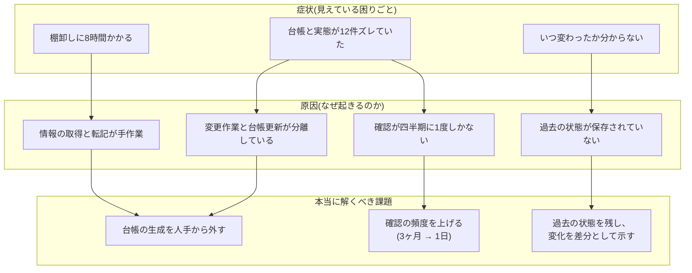
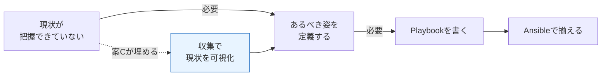
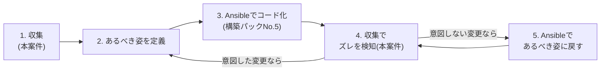

# 改善提案書 — 構成情報の自動収集と差分検知

> **注意: この案件は架空の設定である。** 株式会社サンプル商事は実在しない。本書の効果見積もりは、[01-current-analysis.md](./01-current-analysis.md) の想定シナリオに基づく試算である。

## 1. 課題の構造化

[01-current-analysis.md](./01-current-analysis.md) で洗い出した現状を、「症状」「原因」「本当に解くべき課題」の3層に整理する。改善案件では、**症状にそのまま対処すると的外れになる**ため、この整理を必ず先に行う。

### 課題の優先順位

| 優先 | 課題 | 理由 |
|---|---|---|
| 1 | **確認の頻度を上げる(3ヶ月 → 1日)** | セキュリティ関連の食い違いが6件あった。「戻し忘れたポートが3ヶ月開きっぱなし」を「翌日に気づく」に変えることが、最も価値が高い |
| 2 | **台帳の生成を人手から外す** | 人が更新する限り、更新漏れは構造的に避けられない([01-current-analysis.md](./01-current-analysis.md) 第5章) |
| 3 | **変化を差分として示す** | 「今の状態」だけでは、何が変わったかを人が読み比べる作業が残ってしまう |
| 4 | 作業時間の削減(年32時間) | 1〜3を実現すれば自動的に達成される。目的ではなく結果 |

> **ポイント**: 「作業時間の削減」を最優先に置かなかった点が、この提案の要である。時間短縮だけが目的なら「棚卸しの手順書を整備して効率化する」でも部分的には達成できてしまう。しかしそれでは、**セキュリティ上の食い違いを3ヶ月見逃す**という最大の問題が残ったままになる。

## 2. 改善案の比較検討

課題に対して、実現手段を4案挙げて比較した。

### 案A: 台帳の運用ルールを厳格化する

**内容**: 変更申請書の提出を必須にし、作業完了時に台帳を更新することを手順として義務化する。月次で更新状況をチェックする担当を決める。

| 項目 | 評価 |
|---|---|
| 導入コスト | 低(ルール策定と周知のみ。数時間) |
| 追加費用 | なし |
| 課題1(頻度) | ✕ 変更申請されない変更(自動セキュリティ更新)は捕捉できない |
| 課題2(人手から外す) | ✕ むしろ人手の作業が増える |
| 課題3(差分表示) | ✕ 実現できない |
| 継続性 | **✕ 低い。** 緊急対応時にルールは守られない。[01-current-analysis.md](./01-current-analysis.md) 第5章で示したとおり、この方向は構造的に破綻する |

### 案B: Ansibleで常に「あるべき姿」を上書きする

**内容**: 構築パック案件No.5([Ansibleによるサーバー初期構築自動化](../../projects/05-ansible-provisioning/README.md))で作成したPlaybookを既存6台にも適用し、日次または週次で `ansible-playbook` を実行して、常にコードどおりの状態へ強制的に揃える。

| 項目 | 評価 |
|---|---|
| 導入コスト | **高**(既存6台の現状をPlaybookとして書き起こす必要がある。1台あたり数時間〜) |
| 追加費用 | なし(Ansibleは無償) |
| 課題1(頻度) | △ 実行のたびに揃うが、「何がズレていたか」は `--check` を使わない限り記録されない |
| 課題2(人手から外す) | ○ Playbook = 台帳とみなせる |
| 課題3(差分表示) | △ `--check --diff` である程度は可能だが、Playbookに書いた項目に限られる |
| リスク | **✕ 高い。** 稼働中サーバーへの上書きは、意図しないサービス停止を招く可能性がある |

### 案C: 構成情報の自動収集と差分検知(本提案)

**内容**: 各サーバーからSSH経由で構成情報を読み取り専用で収集し、JSONのスナップショットとして日付ごとに保存する。前日のスナップショットと比較して差分を検知し、Slack通知・レポート・台帳の自動生成を行う。

| 項目 | 評価 |
|---|---|
| 導入コスト | 中(スクリプト実装・SSH鍵準備で20〜30時間程度) |
| 追加費用 | なし(既存のBash・ssh・jq・cronのみ) |
| 課題1(頻度) | **◎ 日次実行で、乖離の発見が最大3ヶ月 → 翌日になる** |
| 課題2(人手から外す) | **◎ 台帳は収集結果から毎日自動生成される** |
| 課題3(差分表示) | **◎ 前日との差分を項目単位で提示できる** |
| リスク | **低い。読み取り専用のため、対象サーバーの状態を変えない** |
| 段階導入 | ○ 1台から始めて対象を広げられる |

### 案D: 構成管理SaaS / 商用ツールを導入する

**内容**: 資産管理・構成管理のSaaS(エージェントを各サーバーに入れ、管理画面で一覧・差分を見られる製品)を契約する。

| 項目 | 評価 |
|---|---|
| 導入コスト | 中(エージェント配布と初期設定) |
| 追加費用 | **✕ 月額費用が継続的に発生する**(6台規模では割高になりやすい) |
| 課題1(頻度) | ◎ 製品によってはリアルタイム |
| 課題2(人手から外す) | ◎ |
| 課題3(差分表示) | ◎ |
| リスク | △ 各サーバーに常駐エージェントを入れる必要がある。エージェント自体が障害要因・更新対象になる |
| 学習価値 | ✕ 「製品を導入した」以上のものが残らない |

### 比較表(まとめ)

| 評価軸 | 案A: ルール厳格化 | 案B: Ansibleで上書き | **案C: 収集+差分検知** | 案D: SaaS導入 |
|---|---|---|---|---|
| 導入コスト | ◎ 低 | ✕ 高 | ○ 中 | ○ 中 |
| 継続費用 | ◎ なし | ◎ なし | **◎ なし** | ✕ 月額あり |
| 課題1: 確認頻度 | ✕ | △ | **◎** | ◎ |
| 課題2: 人手から外す | ✕ | ○ | **◎** | ◎ |
| 課題3: 差分の可視化 | ✕ | △ | **◎** | ◎ |
| 稼働中サーバーへのリスク | ◎ なし | ✕ 高い(上書きする) | **◎ 低い(読むだけ)** | △ 常駐エージェント |
| 段階的な導入 | ○ | △ | **◎ 1台ずつ広げられる** | △ |
| ロールバックの容易さ | ◎ | ✕ 難しい | **◎ cronを止めるだけ** | △ 解約手続き |
| **総合** | 不採用 | 不採用(ただし将来併用) | **採用** | 不採用 |

## 3. 案Cを選定した理由

1. **最大の課題(確認頻度)に、最も直接的に効く。**
   日次実行にすることで、「乖離の発見まで最大3ヶ月」が「翌日」になる。これはセキュリティ関連の食い違い6件に対する直接の対策である。

2. **稼働中のサーバーに対して安全である。**
   収集は `uname` / `df` / `getent` のような**読み取り専用のコマンドだけ**で構成する。対象サーバーの設定を一切変更しないため、「改善のために本番を壊す」という最悪の事態が原理的に起きない。改善案件では、この安全性が採用可否を分けることが多い。

3. **既存の技術資産だけで実現できる。**
   Bash・ssh・jq・cronはすべて既に使っている道具であり、新しい製品の学習コスト・費用・調達手続きが発生しない。

4. **やめるのが簡単である。**
   期待した効果が出なければ、cronの登録を1行消すだけで元の運用に戻せる。対象サーバーには何も残らない(エージェントを入れないため)。**「引き返せる改善」から始める**のは、運用改善の鉄則である。

5. **将来のAnsible適用(案B)への布石になる。**
   詳細は次章で述べるが、案Cで集めた情報は、そのまま「あるべき姿」を定義するための材料になる。案Cと案Bは順番の関係にあり、対立しない。

## 4. 「Ansibleで強制的に揃える」を第一選択にしなかった理由

構築パック案件No.5でAnsibleを扱っている以上、「なぜ今回もAnsibleでやらないのか」は当然出る疑問である。この判断は本案件で最も説明すべきポイントなので、独立した章として整理する。

### 理由1: 「あるべき姿」がまだ定義できていない

Ansibleは「コードに書いた状態へ揃える」ツールである。したがって、**先に「正しい状態」が決まっていなければ使えない。**

現状の6台は、時期も担当者もバラバラな手作業で構築されており、どれが「正しい設定」なのかを誰も断言できない。この状態でPlaybookを書こうとすると、

- 「web01はこの設定、web02は別の設定。どちらが正しい?」
- 「このユーザーは消していいのか、業務で使っているのか?」

という判断が延々と発生し、**その判断材料そのものが今は存在しない**。

つまり、**案C(収集)は案B(Ansible適用)の前提工程**である。順番を逆にはできない。

### 理由2: 稼働中サーバーへの上書きは、サービス停止のリスクがある

Ansibleの適用は、対象サーバーの設定を実際に書き換える操作である。既に本番稼働しているサーバーに対して、内容を完全には把握していないPlaybookを流すことは、次のような事故につながりうる。

| 想定される事故 | 内容 |
|---|---|
| サービス断 | Playbookの `service` タスクで、業務中にサービスが再起動される |
| 設定の巻き戻し | 障害対応で入れた暫定設定が、Playbookの内容で上書きされて元に戻る |
| アカウント消失 | Playbookに書いていないユーザーを「不要」と判断して削除してしまう |

一方、案Cの収集は読み取り専用であり、**最悪の失敗が「情報が取れなかった」で済む**。改善の第一歩としてどちらを選ぶべきかは明らかである。

### 理由3: Ansibleは「管理下に入れた項目」しか見張れない

これが技術的に最も重要な理由である。Ansibleが揃えられるのは、**Playbookに書いてある項目だけ**である。

| 変更の例 | Ansibleは検知・修正できるか | 収集+差分検知は検知できるか |
|---|---|---|
| Playbookに書いたNginxの設定ファイルが書き換えられた | ○ 次回実行で元に戻る | ○(ファイル内容までは今回のスコープ外だが、パッケージ版数は検知) |
| **誰かが手で新しいユーザーを追加した** | **✕ Playbookに記述がなければ素通り** | **◎ 検知できる** |
| **検証用に開けたポートが残っている** | **✕ ファイアウォール設定を管理下に置いていなければ素通り** | **◎ 検知できる** |
| **一時的に付与したsudo権限が戻されていない** | **✕ 同上** | **◎ 検知できる** |
| 自動更新でカーネル版数が上がった | ✕ 管理対象外 | ◎ 検知できる |

[01-current-analysis.md](./01-current-analysis.md) で挙げた食い違い12件のうち、**セキュリティに直結する6件は、いずれも「Playbookに書いていない範囲で起きた変更」**である。これらはAnsibleを日次実行しても検知できない。

### 理由4: そもそも両者は目的が違う(補完関係)

| 観点 | Ansible(IaC) | 構成情報の収集+差分検知 |
|---|---|---|
| 目的 | **あるべき姿に「揃える」** | 実際の姿を「見る」 |
| 方向 | コード → サーバー(書き込み) | サーバー → 管理側(読み取り) |
| 得意なこと | 新規構築、複数台の設定統一、再現性の確保 | 現状把握、想定外の変更の検知、変更履歴の記録 |
| 苦手なこと | 管理外の変更を見つけること | 見つけたズレを直すこと |
| 対象範囲 | Playbookに書いた項目のみ | 収集スクリプトで取得できる範囲すべて |
| 失敗したときの影響 | サーバーの状態が変わる(大きい) | 情報が取れないだけ(小さい) |

両者を組み合わせると、次のような運用サイクルになる。**これが本案件の最終的な目標像**である。

> **面接での説明の仕方**: 「Ansibleを使わなかった」ではなく、「**Ansibleを使う前提を整えるために、まず収集から始めた**」と説明するのが正確である。両者は競合する選択肢ではない。

## 5. 期待される効果

| 指標 | 改善前(As-Is) | 改善後(To-Be) | 根拠 |
|---|---|---|---|
| 棚卸しの作業時間 | 8時間/四半期(年32時間) | **0分**(日次で自動実行) | 収集・比較・台帳生成をすべてスクリプト化するため |
| 情報の鮮度 | 最大3ヶ月前 | **前日** | 日次実行のため |
| 乖離の発見まで | 最大3ヶ月 | **翌日** | 前日のスナップショットと比較するため |
| 変更履歴 | 追跡不可 | **日次スナップショットで追跡可能** | 日付ごとにJSONを保存するため |
| 台帳の更新 | 人が手で更新(実質されない) | 収集結果から毎日自動生成 | 台帳が「生成物」になるため |
| 転記ミス | 発生しうる | **発生しない** | 人が値を打ち込む工程が存在しなくなるため |
| 対象台数の拡張性 | 1台増えるごとに80分/回 増加 | 設定ファイルに1行追加(作業時間はほぼ増えない) | 収集はSSHの並びを1つ増やすだけのため |

### 効果の中で最も重要なもの

数字で最も大きいのは「年32時間の削減」だが、**本改善の主目的は「乖離の発見まで最大3ヶ月 → 翌日」である**。前回の棚卸しで見つかった食い違いのうち6件がセキュリティ関連(退職者アカウントの残存、開放されたままのポート、戻し忘れたsudo権限)だったことを踏まえると、この6件が3ヶ月放置されるか翌日に分かるかは、時間削減とは比較にならない意味を持つ。

## 6. リスクと対策

改善そのものが新たなリスクを生まないよう、事前に洗い出して対策を設計に織り込む。

### 6-1. セキュリティ上のリスク(最重要)

| # | リスク | 起きるとどうなるか | 対策 |
|---|---|---|---|
| R1 | **収集用のSSH秘密鍵が漏洩する** | その鍵で管理対象6台すべてにログインされる | **① 収集専用ユーザー(`invadmin`)を作り、通常の管理者アカウントとは分離する** **② `authorized_keys` の `command=` オプションで、その鍵で実行できるコマンドを収集スクリプトだけに限定する**(制限の強さと運用の手間はトレードオフがあるため、[04-build-guide.md](./04-build-guide.md) のステップ5で2段階の選択肢として提示する) **③ `from="管理サーバーのIP"` で接続元を制限する** **④ `no-port-forwarding,no-agent-forwarding,no-X11-forwarding,no-pty` を付け、踏み台としての悪用を防ぐ** ⑤ 秘密鍵は `chmod 600`、置き場所は管理サーバー上の収集専用ユーザーのホームのみ |
| R2 | 収集用ユーザーに強い権限を与えてしまう | 収集用の口が、実質的な管理者権限の裏口になる | **sudoを一切付与しない。** 一般ユーザー権限で読める項目だけを収集対象とする(`getent passwd` / `df` / `uname` / `ss -tln` などは一般ユーザーで実行可能)。root権限がないと取れない項目は、**取らない**という判断をする(取れなかったことは `notes` に記録する) |
| R3 | **収集した情報自体が機微情報である** | ユーザー一覧・開放ポート・パッケージ版数は、攻撃者にとって価値の高い偵察情報 | ① スナップショットの保存先を `chmod 700` にし、収集専用ユーザーのみ読めるようにする ② **パスワードハッシュ・SSH秘密鍵・設定ファイルの中身は収集対象に含めない** ③ 生成した台帳を公開リポジトリへコミットしない(実IPやユーザー名を含むため) |
| R4 | Slack Webhook URLが漏洩する | 第三者が社内チャンネルへ投稿できる | 設定ファイル `inventory.conf` を `chmod 600` にする。リポジトリには `<YOUR_SLACK_WEBHOOK_URL>` というプレースホルダーのみを置き、実URLはコミットしない |
| R5 | ホスト鍵の変更に気づかず、なりすましサーバーに接続する | 偽サーバーへ収集用の接続を行ってしまう | `StrictHostKeyChecking=accept-new` を使う。初回は自動で受け入れるが、**以前と鍵が変わった場合は接続を拒否する**。`yes` にしないのは初回登録の手間を避けるため、`no` にしないのはなりすましを許してしまうため |

### 6-2. 運用上のリスク

| # | リスク | 起きるとどうなるか | 対策 |
|---|---|---|---|
| R6 | **差分が出すぎて誰も見なくなる(アラート疲れ)** | 通知が無視され、本当に重要な変更を見逃す | ① 「毎回変わる値」(ディスク使用率など)を設定ファイルの正規表現で比較対象から除外する ② セキュリティ関連の項目(ユーザー・sudo・ポート・パッケージ)だけを**重要度「高」**として強調する ③ 導入初期は1台だけで運用し、ノイズの量を確認してから対象を広げる |
| R7 | 収集中に対象サーバーへ負荷をかける | 業務時間中にサービスの応答が遅くなる | ① 実行は業務開始前(05:30)の1日1回 ② 収集コマンドはいずれも一瞬で終わる読み取り専用コマンドのみ ③ 検証環境での実測では1台あたり0.1秒未満(SSH接続時間を除く) |
| R8 | 1台の応答不能で全体が止まる | 6台中1台がダウンしているだけで、その日の台帳が一切更新されない | ① `BatchMode=yes` で入力待ちによる無限停止を防ぐ ② `ConnectTimeout` と `timeout` コマンドで上限時間を設ける ③ **1台の失敗で処理を止めず、残りの収集を続ける**(`set -e` を使わない設計) ④ 失敗も `status: "error"` として記録し、レポートに「収集失敗」として表示する |
| R9 | cronの実行が重なる | 前回の収集が終わらないうちに次が始まり、スナップショットが壊れる | `flock` によるファイルロックで二重起動を防止する |
| R10 | スナップショットが増え続けてディスクを圧迫する | 管理サーバーのディスクが枯渇する | 保持期間(既定400日)を過ぎた日付ディレクトリを `find -mtime` で自動削除する。**検証環境の実測では1台1回あたり約1.7KB**のため、6台×400日でも約4MBにとどまる試算 |
| R11 | ツール自体が止まっていることに気づかない | 「差分がない」のか「動いていない」のか区別できない | 設定 `NOTIFY_ON_NO_DRIFT=true` で「本日差分なし」も通知できるようにする(死活監視を兼ねる)。cronのログにも毎回結果を残す |

### 6-3. 対策の要点(初心者向けの補足)

> **「最小権限の原則」とは**: 「その処理を行うために本当に必要な権限だけを与え、それ以上は与えない」という、セキュリティ設計の基本原則のこと。今回で言えば、「構成情報を読むだけ」なのだから、書き込み権限もroot権限も要らない。**面倒でも root で収集しないこと**が、この改善が「安全な改善」であるための条件である。

> **`authorized_keys` の `command=` とは**: サーバー側の `~/.ssh/authorized_keys` に登録した公開鍵の行頭に `command="/path/to/script"` と書いておくと、**その鍵でログインしてきた接続は、何を指示されても必ずそのコマンドだけを実行する**という制限がかかる。仮に秘密鍵が盗まれても、攻撃者はシェルを取れず、収集スクリプトを実行することしかできない。具体的な設定手順は [04-build-guide.md](./04-build-guide.md) のステップ4を参照。

## 7. スコープ外にしたこと(今回やらないこと)

改善案件では「何をやらないか」を明示することが、やることを決めるのと同じくらい重要である。あれもこれもと広げると、いつまでも動くものができない。

| # | スコープ外にしたこと | 理由 | 将来の扱い |
|---|---|---|---|
| 1 | **検知したズレの自動修復** | 自動で元に戻すと、**正当な変更まで勝手に巻き戻してしまう**。ドリフト検知の初期段階では、まず「人が見て判断する」に留めるのが安全 | 「あるべき姿」が定義できた段階で、Ansible(構築パックNo.5)と組み合わせて実現する |
| 2 | 設定ファイルの中身(`nginx.conf` など)の差分 | 収集するデータ量が一気に増え、機微情報(パスワードを含む設定)を管理サーバーへ集めてしまうリスクがある | ファイルの**ハッシュ値だけ**を収集して改変検知する形なら安全に拡張できる。次サイクルの課題 |
| 3 | リアルタイム検知(変更された瞬間に通知) | `auditd` や `inotify` による常駐監視が必要になり、対象サーバーに常駐プロセスを置くことになる。今回の「読み取り専用・エージェントレス」という安全性の前提が崩れる | 要件として上がったら再検討 |
| 4 | Windows Serverおよびネットワーク機器 | 収集手段(SSH+シェル)がそのままでは使えない。対象6台はすべてLinuxであるため、今回は不要 | 対象が増えたら別方式を検討 |
| 5 | クラウド(AWS/Azure等)のリソース構成 | サーバー内部の構成とは取得方法がまったく異なる(各クラウドのAPIが必要) | クラウド移行時に別案件として扱う |
| 6 | 全インストール済みパッケージの収集 | 1台あたり数千行になり、セキュリティ更新のたびに大量の差分が出てノイズになる(R6) | 監視対象パッケージを設定ファイルで指定する方式とし、必要に応じて増やす |
| 7 | 台帳のWeb画面提供 | Markdown/CSVで十分に読める。Webアプリの構築・運用コストに見合わない | 必要になればGitHubリポジトリへの配置で代替(構築パックNo.6の応用) |

## 8. 提案のまとめ

| 項目 | 内容 |
|---|---|
| 採用する案 | **案C: 構成情報の自動収集と差分検知** |
| 主目的 | 乖離の発見までの時間を「最大3ヶ月」から「翌日」へ短縮する |
| 副次的効果 | 棚卸し作業 年32時間の削減、変更履歴の追跡が可能に、転記ミスの消滅 |
| 採用しなかった案 | A(ルール厳格化: 構造的に破綻)/ B(Ansible上書き: 前提が未整備でリスクが高い)/ D(SaaS: 継続費用と学習価値の点で不適) |
| Ansibleとの関係 | **対立ではなく補完。** 本案件は将来のIaC適用の前提工程にあたる |
| 安全性の担保 | 読み取り専用の収集、収集専用ユーザー、`command=` による鍵の権限制限、sudo不使用 |
| やめ方 | cronの登録を削除するだけ。対象サーバーには何も残らない |

→ 次は [03-design.md](./03-design.md)(改善設計書)へ。
