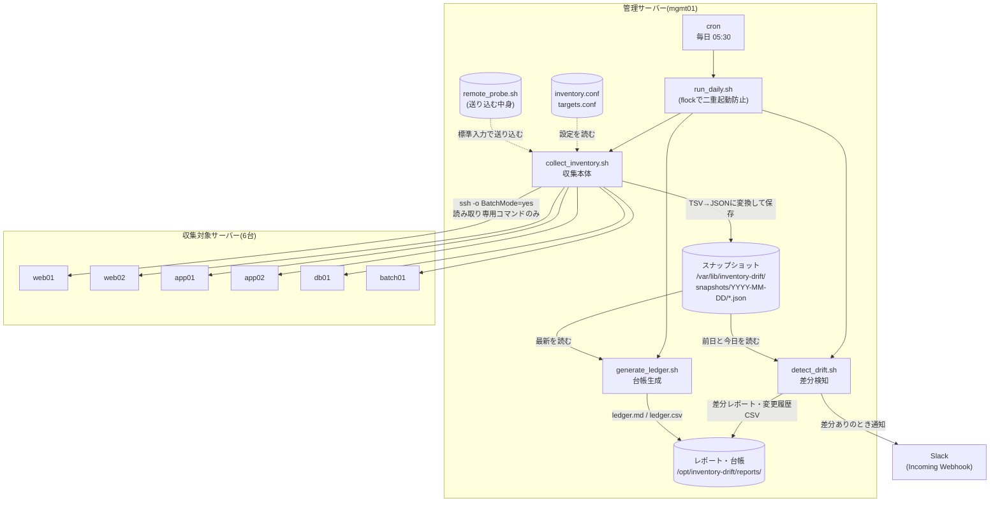
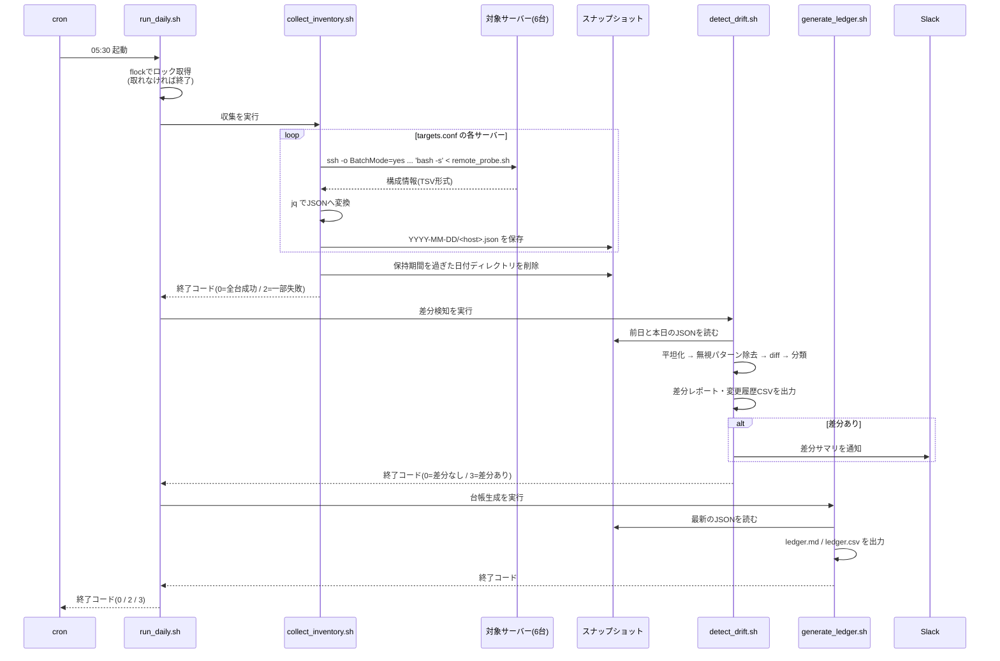
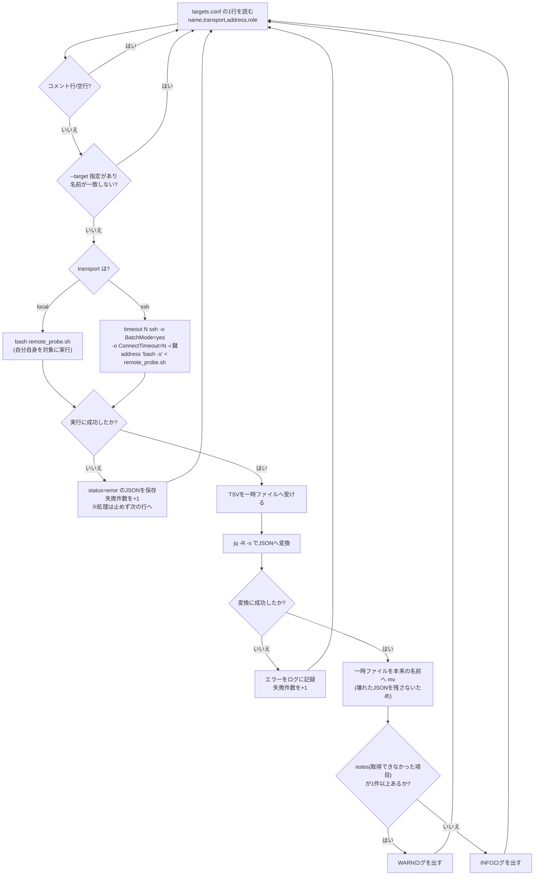
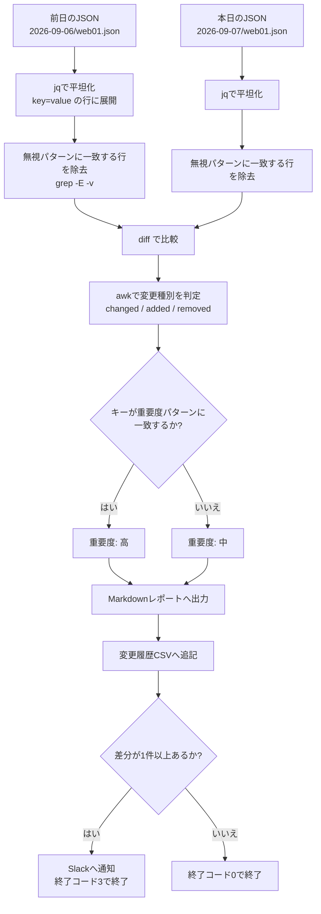
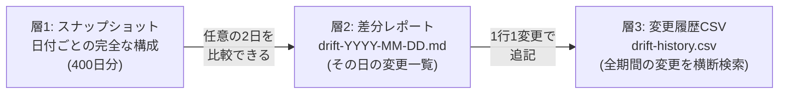
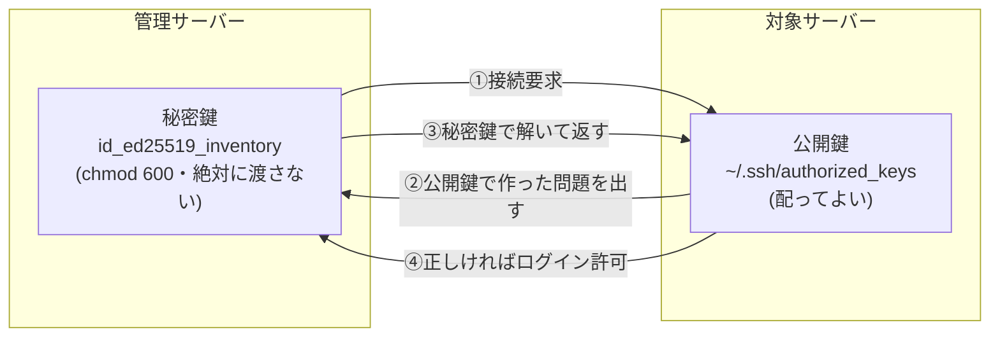

# 改善設計書(To-Be) — 構成情報の自動収集・差分検知

> **注意: この案件は架空の設定である。** 本書に掲載しているコマンドの実行結果は、いずれも**手元の検証環境(Ubuntu 24.04 LTS / bash 5.2 / jq 1.7)で実際に実行して得た出力**である。IPアドレス・ホスト名などは検証環境のものであり、架空の依頼元の実データではない。

## 1. 設計方針

[02-improvement-proposal.md](./02-improvement-proposal.md) の結論を、実装可能な設計に落とし込む。設計の柱は次の5つである。

| # | 方針 | 理由 |
|---|---|---|
| 1 | **読み取り専用に徹する** | 稼働中サーバーを壊さない。失敗しても「情報が取れない」で済む |
| 2 | **対象サーバーには何もインストールしない(エージェントレス)** | 6台への配布・更新の手間をなくす。やめるときも何も残らない |
| 3 | **収集(テキスト)と加工(JSON化)を分離する** | 対象サーバーに `jq` が無くても動く。責務が分かれてテストしやすい |
| 4 | **保存は日付ごとのスナップショット** | 「変更履歴」を、複雑なDBではなくファイルの並びで実現する |
| 5 | **比較は「平坦化してから `diff`」** | JSON同士を直接比べるより、人にも機械にも分かりやすい |

## 2. 全体構成図



### 登場人物の役割

| 要素 | 役割 | ファイル |
|---|---|---|
| 管理サーバー | 収集を実行し、データを保管する側。1台だけ用意する | - |
| 収集対象サーバー | 情報を読み取られる側。**何もインストールしない** | - |
| `remote_probe.sh` | 対象サーバー上で動き、構成情報をTSVで吐き出す | [src/remote_probe.sh](./src/remote_probe.sh) |
| `collect_inventory.sh` | 全台へSSHし、返ってきたTSVをJSONにしてスナップショット保存 | [src/collect_inventory.sh](./src/collect_inventory.sh) |
| `detect_drift.sh` | 前回と今回のスナップショットを比較し、差分レポートと通知 | [src/detect_drift.sh](./src/detect_drift.sh) |
| `generate_ledger.sh` | 最新スナップショットから台帳(Markdown/CSV)を生成 | [src/generate_ledger.sh](./src/generate_ledger.sh) |
| `run_daily.sh` | 上記3本を順番に実行する。cronから呼ばれる | [src/run_daily.sh](./src/run_daily.sh) |

## 3. 処理フロー

### 3-1. 日次処理の全体像



### 3-2. 1台分の収集フロー(詳細)



> **なぜ「一時ファイルに書いてから `mv`」なのか**: 直接本番のファイルへ書くと、途中で失敗したときに**壊れかけのJSON**が残ってしまう。翌日その壊れたファイルと比較すると、意味のない差分が大量に出る。`mv` は同一ファイルシステム内なら瞬時に完了する操作なので、「完成したものだけを置き換える」という安全な書き方ができる。

## 4. 収集する項目と収集コマンド

### 4-1. 項目一覧

| # | 項目 | 収集コマンド | なぜ収集するか | root権限 |
|---|---|---|---|---|
| 1 | OS名・ID・版数 | `. /etc/os-release` | サポート期限切れOSの把握。移行計画の基礎情報 | 不要 |
| 2 | カーネル版数 | `uname -r` | セキュリティ更新の適用状況。再起動が必要かの判断材料 | 不要 |
| 3 | アーキテクチャ | `uname -m` | パッケージ選定時に必要 | 不要 |
| 4 | ホスト名 | `hostname -f`(失敗時 `hostname`) | 台帳の識別子と実機の設定が一致しているかの確認 | 不要 |
| 5 | IPアドレス | `ip -o -4 addr show scope global`(失敗時 `hostname -I`) | **[01-current-analysis.md](./01-current-analysis.md) の食い違い2件はこれ** | 不要 |
| 6 | ディスク使用状況 | `df -P <マウントポイント>` | 容量の増設や構成変更の検知 | 不要 |
| 7 | 主要パッケージ版数 | `dpkg-query -W -f='${Version}'`(RHEL系は `rpm -q`) | 脆弱性対応状況の把握 | 不要 |
| 8 | 起動中サービス | `systemctl list-units --type=service --state=running` | 意図しないサービスの起動・停止の検知 | 不要 |
| 9 | 一般ユーザー一覧 | `getent passwd`(UID 1000〜65533に絞る) | **退職者アカウントの残存を検知(食い違い3件)** | 不要 |
| 10 | 管理者権限ユーザー | `getent group sudo` / `getent group wheel` | **戻し忘れたsudo権限を検知(食い違い1件)** | 不要 |
| 11 | 待ち受けTCPポート | `ss -H -tln`(失敗時 `netstat -tln` → `/proc/net/tcp`) | **開けっぱなしのポートを検知(食い違い2件)** | 不要 |

> **設計上の重要な決定**: **すべての項目が「一般ユーザー権限で取得できる」もので構成されている。** これは偶然ではなく、[02-improvement-proposal.md](./02-improvement-proposal.md) の R2(収集用ユーザーに強い権限を与えない)を満たすために意図的に選んだ結果である。root でないと読めない情報(`/etc/shadow` の中身など)は、価値があっても**収集対象から外している**。

### 4-2. 収集しないと決めたもの(と、その理由)

| 収集しないもの | 理由 |
|---|---|
| パスワードハッシュ(`/etc/shadow`) | root権限が必要。かつ漏洩時の被害が甚大 |
| SSH秘密鍵 | 論外。**絶対に収集してはならない** |
| 設定ファイルの中身 | データ量が大きく、機微情報を含みうる([02-improvement-proposal.md](./02-improvement-proposal.md) スコープ外7項目の#2) |
| 全インストール済みパッケージ | 数千行になりノイズ源となる(同 #6) |
| プロセス一覧 | 実行のたびに変わるため、差分検知には向かない |
| メモリ・CPU使用率 | 「構成」ではなく「状態」。死活監視([構築パック案件No.4](../../projects/04-server-health-check/README.md))の役割 |

### 4-3. 収集の実行方式: なぜ `bash -s` なのか

対象サーバーでスクリプトを動かす方法は2つある。

| 方式 | やり方 | 評価 |
|---|---|---|
| (a) スクリプトを配置してから実行 | `scp remote_probe.sh web01:/opt/` してから `ssh web01 /opt/remote_probe.sh` | ✕ **収集項目を1つ増やすたびに6台へ再配布**が必要。配布漏れがあると台ごとに違う結果になる |
| (b) **標準入力で送り込んで実行** | `ssh web01 'bash -s' < remote_probe.sh` | **◎ 対象サーバーには何も残らない。** 常に管理サーバー上の最新版が実行される |

本設計では (b) を採用する。`bash -s` は「標準入力から読んだ内容をスクリプトとして実行する」という bash のオプションである。

```bash
# 実際の呼び出し(collect_inventory.sh より)
timeout "$SSH_COMMAND_TIMEOUT" \
    ssh -o BatchMode=yes \
        -o ConnectTimeout="$SSH_CONNECT_TIMEOUT" \
        -o StrictHostKeyChecking=accept-new \
        -i "$SSH_KEY" \
        "$address" \
        "PROBE_WATCH_PACKAGES='${WATCH_PACKAGES}' PROBE_DISK_MOUNTS='${DISK_MOUNTS}' bash -s" \
        < "$PROBE_SCRIPT"
```

### 4-4. 中間形式(TSV)の設計

`remote_probe.sh` の出力は、JSONではなく**タブ区切りテキスト(TSV)**である。

```text
schema_version	1
os_name	Ubuntu 24.04.4 LTS
os_id	ubuntu
os_version_id	24.04
kernel	6.18.44-fc-v24
arch	x86_64
hostname	vm
ip	192.0.2.2
collect_note	ip	ip_command_missing_used_hostname
disk	/	264212084	22
disk	/var	264212084	22
disk	/home	264212084	22
package	bash	5.2.21-2ubuntu4
package	openssh-server	not_installed
package	curl	8.5.0-2ubuntu10.8
collect_note	service	systemd_unavailable
user	ubuntu	1000	/bin/bash
sudoer	ubuntu
port	2024
port	18080
collect_note	port	used_proc_net_tcp_fallback
```

> 上記は検証環境で `bash remote_probe.sh` を実行した実際の出力(抜粋)である。`collect_note` の3行は、検証環境に `ip` コマンド・systemd・`ss` コマンドが無いために出ている。**「取れなかったこと」が記録として残るのがこの設計の要点**で、値が空なのか取得に失敗したのかを後から区別できる。

TSVを中間形式に選んだ理由は3つある。

| 理由 | 説明 |
|---|---|
| ① 対象サーバーに `jq` が不要 | JSONを正しく組み立てるには、引用符やエスケープの処理が要る。シェルだけで書くと必ずどこかで壊れる。TSVなら `printf` だけで安全に作れる |
| ② 人が目で読める | 収集がおかしいとき、`ssh web01 'bash -s' < remote_probe.sh` を手で叩けば、そのまま読める形で原因を確認できる |
| ③ `jq` で配列に変換しやすい | 同じキーの行を集めるだけでリストになる(後述の `rows()` 関数) |

## 5. JSONスキーマ設計

### 5-1. スキーマ全体

管理サーバー側で、TSVを次の構造のJSONへ変換して保存する。

```json
{
  "schema_version": 1,
  "host": "localhost",
  "role": "test",
  "transport": "local",
  "collected_at": "2026-09-07T04:41:09+0000",
  "status": "ok",
  "facts": {
    "os": { "name": "Ubuntu 24.04.4 LTS", "id": "ubuntu", "version_id": "24.04" },
    "kernel": "6.18.44-fc-v24",
    "arch": "x86_64",
    "hostname": "vm",
    "ip_addresses": ["192.0.2.2"],
    "disks": [
      { "mount": "/", "size_kb": 264212084, "used_percent": 22 }
    ],
    "packages": [
      { "name": "bash", "version": "5.2.21-2ubuntu4" },
      { "name": "nginx", "version": "not_installed" }
    ],
    "services": [],
    "users": [ { "name": "ubuntu", "uid": 1000, "shell": "/bin/bash" } ],
    "sudoers": ["ubuntu"],
    "ports": [2024, 2025, 18080, 36191, 39221]
  },
  "notes": [
    { "item": "ip", "reason": "ip_command_missing_used_hostname" },
    { "item": "service", "reason": "systemd_unavailable" },
    { "item": "port", "reason": "used_proc_net_tcp_fallback" }
  ]
}
```

> これは検証環境で実際に生成されたスナップショットである(一部を抜粋)。ファイルサイズは **1,728バイト(約1.7KB)**。

### 5-2. 各フィールドの設計意図

| フィールド | 型 | 設計意図 |
|---|---|---|
| `schema_version` | 数値 | **将来スキーマを変えたときに、古いスナップショットと区別するため。** これが無いと、形式変更のたびに過去データがすべて比較不能になる |
| `host` | 文字列 | `targets.conf` で付けた管理上の名前。**実機の `hostname` とは別物**として持つ。両者を比較すること自体が「台帳の名前と実機設定が食い違っていないか」の検査になる |
| `role` | 文字列 | 役割(web/app/db/batch)。台帳の分類欄に使う |
| `transport` | 文字列 | `ssh` か `local` か。どうやって取得したかの記録 |
| `collected_at` | 文字列 | 収集時刻(ISO 8601形式)。**管理サーバー側の時計で記録する**(対象サーバーの時計がずれていても一貫性が保てる) |
| `status` | 文字列 | `ok` / `error`。**収集失敗もファイルとして残す**ための鍵。ファイルが無いだけだと「サーバーが台帳から消えた」と誤検知されうる |
| `facts` | オブジェクト | 構成情報の本体。差分検知の対象はここだけ |
| `notes` | 配列 | 取得できなかった項目とその理由。**空の値と取得失敗を区別する** |

### 5-3. 「リストをどう持つか」という設計判断

`packages` や `users` のようなリスト項目は、次の2通りの持ち方がありうる。

| 案 | JSON例 | 評価 |
|---|---|---|
| (a) オブジェクトのリスト | `[{"name":"nginx","version":"1.24.0"}]` | **採用。** 1要素に複数の属性を持たせられる。順序が変わっても、後述の平坦化で `packages[nginx]` という鍵に正規化できる |
| (b) 文字列のリスト | `["nginx=1.24.0"]` | 単純だが、属性が増えると文字列を自分でパースすることになる |

`ports` と `sudoers` は属性が1つしかないため、(b) に近い単純な配列にしている。**すべてを同じ形にするより、項目の性質に合わせるほうが読みやすい**という判断である。

### 5-4. TSV → JSON 変換の実装(jq)

`collect_inventory.sh` の中核部分を抜粋する。

```jq
def rows($k): map(select(.[0] == $k));
def val($k): (rows($k) | .[0][1]);

split("\n")
| map(select(length > 0) | split("\t"))
| {
    schema_version: ((val("schema_version") // "1") | tonumber),
    host: $host,
    ...
    facts: {
      ...
      packages: (rows("package") | map({ name: .[1], version: .[2] }) | sort_by(.name)),
      ports:    (rows("port") | map(.[1] | tonumber) | unique | sort)
    }
  }
```

| 記法 | 意味 |
|---|---|
| `jq -R -s` | `-R` は入力をJSONではなく**生の文字列**として読む。`-s`(slurp)は入力全体を1つにまとめる。この2つを組み合わせると「テキストファイル全体を1つの文字列として受け取る」動作になる |
| `split("\n")` | 文字列を改行で分割して配列にする(=行の配列) |
| `map(... | split("\t"))` | 各行をタブで分割する(=列の配列の配列) |
| `def rows($k): ...` | 「1列目が `$k` の行だけを集める」自作関数。`rows("package")` でパッケージ行だけが取れる |
| `--arg host "$name"` | シェルの変数をjqへ安全に渡す方法。文字列として扱われるため、値に特殊文字が入っても壊れない |
| `sort_by` / `unique` | **並び順を毎回同じにする**ための正規化。これを怠ると、順序が変わっただけで差分が出てしまう |

## 6. 差分検知のロジック

### 6-1. 全体の流れ



### 6-2. ステップ1: 平坦化(flatten)

**なぜ平坦化するのか。** JSONは入れ子構造なので、そのまま `diff` を取ると次の問題が起きる。

- 配列の**順序が1つ変わっただけ**で、その後の全行がズレて差分に見える
- インデント(字下げ)の違いが差分になる
- 「`packages` 配列の3番目の要素の `version` が変わった」と言われても、人には何のことか分からない

そこで、比較の前に**1行1項目の `key=value` 形式**へ変換する。

```bash
# 実際の平坦化結果(検証環境の実行例)
$ jq -r -f flatten.jq snapshots/2026-09-07/localhost.json
arch=x86_64
disks[/].size_kb=264212084
disks[/].used_percent=22
disks[/home].size_kb=264212084
disks[/home].used_percent=22
disks[/var].size_kb=264212084
disks[/var].used_percent=22
hostname=vm
ip_addresses[192.0.2.2]=assigned
kernel=6.18.44-fc-v24
os.id=ubuntu
os.name=Ubuntu 24.04.4 LTS
os.version_id=24.04
packages[bash]=5.2.21-2ubuntu4
packages[cron]=not_installed
packages[curl]=8.5.0-2ubuntu10.8
packages[nginx]=not_installed
packages[openssh-server]=not_installed
packages[rsync]=not_installed
ports[18080]=listen
ports[2024]=listen
ports[2025]=listen
ports[36191]=listen
ports[39221]=listen
sudoers[ubuntu]=yes
users[ubuntu].shell=/bin/bash
users[ubuntu].uid=1000
```

**設計の要点: 鍵に「要素の名前」を埋め込む**

| 悪い例 | 良い例(本設計) | 違い |
|---|---|---|
| `packages[2]=1.24.0` | `packages[nginx]=1.24.0` | 添字だと、パッケージが1つ増えただけで以降すべてがズレる |
| `users[0].uid=1000` | `users[ubuntu].uid=1000` | 名前を鍵にすれば、並び順に依存しない |
| `ports[3]=listen` | `ports[18080]=listen` | ポート番号そのものが鍵 |

この工夫により、**「順序の違い」を差分と誤検知しなくなる**。最後に `sort` をかけているため、`diff` は純粋な内容の違いだけを報告する。

### 6-3. ステップ2: 無視すべき項目(ノイズ対策)

**構成情報の中には、「毎回必ず変わるが、それは異常ではない」値が混ざっている。** これをそのまま差分として扱うと、毎日必ず通知が飛び、本当に見るべき変更が埋もれる([02-improvement-proposal.md](./02-improvement-proposal.md) R6)。

| 項目 | なぜ毎回変わるか | 扱い |
|---|---|---|
| `disks[*].used_percent`(ディスク使用率) | ログが増えれば毎日変わる。構成の変更ではない | **除外。** 容量監視は[構築パック案件No.4](../../projects/04-server-health-check/README.md)の役割 |
| `collected_at`(収集時刻) | 実行するたびに必ず変わる | **除外**(そもそも `facts` の外に置いているため平坦化されない) |
| `disks[*].size_kb`(ディスク容量) | 通常は変わらない。変わったらディスク増設 | **検知対象に含める**(食い違い1件がこれ) |
| `kernel`(カーネル版数) | 自動更新で変わるが、**変わったことを知りたい** | **検知対象に含める**(適用状況の把握が目的) |
| `packages[*]`(パッケージ版数) | 自動更新で変わるが、知りたい | **検知対象に含める** |

除外の設定は、正規表現で `inventory.conf` に持たせている。**コードを触らずに運用しながら調整できる**ことが重要である。

```bash
# inventory.conf より
DRIFT_IGNORE_PATTERN='^disks\[[^]]*\]\.used_percent=|^collected_at='
```

```bash
# detect_drift.sh での適用
flatten_snapshot() {
    local json_file="$1"
    # grep -E -v : 指定した拡張正規表現に「一致しない」行だけを残す
    jq -r "$FLATTEN_JQ" "$json_file" | grep -E -v "$DRIFT_IGNORE_PATTERN"
}
```

> **運用のコツ**: 最初から完璧な無視リストは作れない。**まず1台で数日動かし、「毎日出るが対処不要な差分」が見つかったら追加する**、という進め方が現実的である([04-build-guide.md](./04-build-guide.md) ステップ8)。

### 6-4. ステップ3: `diff` と変更種別の判定

平坦化した2つのファイルを `diff` で比較する。`diff` の出力は次の形になる。

```text
< kernel=6.18.44-fc-v24      ← 前日にだけあった行
> kernel=6.18.45-fc-v24      ← 本日にだけある行
> sudoers[deploy]=yes        ← 本日にだけある行(前日に対応行なし)
```

この `<` / `>` を、`awk` で**キーごとに突き合わせ**て、3種類に分類する。

| 判定 | 条件 | 意味 |
|---|---|---|
| `changed`(変更) | 同じキーが `<` と `>` の両方にある | 値が書き換わった |
| `added`(追加) | `>` にだけある | 新しい項目が増えた(ユーザー追加、ポート開放など) |
| `removed`(削除) | `<` にだけある | 項目が消えた(サービス停止、ユーザー削除など) |

```awk
# detect_drift.sh の diff_facts() より(要点のみ)
{
    mark = substr($0, 1, 1)          # "<" か ">"
    line = substr($0, 3)             # "key=value" の部分
    idx  = index(line, "=")
    key = substr(line, 1, idx - 1)
    val = substr(line, idx + 1)
    if (mark == "<") { old[key] = val; seen[key] = 1 }
    else             { new[key] = val; seen[key] = 1 }
}
END {
    for (k in seen) {
        if ((k in old) && (k in new)) { t = "changed" }
        else if (k in new)            { t = "added" }
        else                          { t = "removed" }
        ...
    }
}
```

> **なぜ `index(line, "=")` で最初の `=` を探すのか**: 値の中に `=` が含まれる可能性があるため(例: `users[x].shell=/bin/bash` は安全だが、将来項目を増やすと起こりうる)。`split(line, "=")` で分割すると値が切れてしまうので、**最初の `=` の位置だけを見て、その前を鍵、その後ろ全部を値**とする。

### 6-5. ステップ4: 重要度の判定

すべての差分を同じ扱いにすると、「カーネルが上がった」と「知らないユーザーが増えた」が並んで表示され、後者が埋もれる。そこで、キーの名前で重要度を分ける。

```bash
# inventory.conf より
DRIFT_CRITICAL_PATTERN='^(users|sudoers|ports|packages)\['
```

| キーの例 | 重要度 | 根拠 |
|---|---|---|
| `users[deploy].uid` | **高** | [01-current-analysis.md](./01-current-analysis.md) の食い違い3件がユーザー関連 |
| `sudoers[deploy]` | **高** | 同 1件。権限の戻し忘れ |
| `ports[8080]` | **高** | 同 2件。開けっぱなしのポート |
| `packages[nginx]` | **高** | 脆弱性対応状況に直結 |
| `kernel` | 中 | 自動更新で変わるのが正常 |
| `disks[/].size_kb` | 中 | 増設は計画的に行われるもの |
| `hostname` | 中 | 変わることはまれ |

### 6-6. 実際の検知結果(検証環境での実行例)

検証環境で、実際にサーバー上で新しいポート(18080)を待ち受けさせた状態で収集し、前日のスナップショットと比較した結果である。

```bash
$ ./detect_drift.sh --config ./test.conf
2026-09-07 04:38:36 [INFO] ===== 差分検知を開始します (2026-09-06 -> 2026-09-07) =====
2026-09-07 04:38:36 [WARN] [localhost] 差分 1 件(うち重要 1 件)を検知しました
2026-09-07 04:38:36 [INFO] 差分レポートを出力しました: .../reports/drift-2026-09-07.md
2026-09-07 04:38:36 [INFO] ===== 差分検知終了: 差分 1 件 / 重要 1 件 =====
$ echo $?
3
```

生成された差分レポート(抜粋):

```markdown
## サマリ

- 検知した差分: **1 件**(うち重要度「高」: 1 件)
- 収集失敗: 0 台 / 新規登録: 0 台 / 今回収集なし: 0 台

| サーバー | 判定 | 差分件数 | うち重要 |
|---|---|---|---|
| localhost | 差分あり | 1 | 1 |

## 詳細

### localhost

| 項目 | 変更種別 | 変更前 | 変更後 | 重要度 |
|---|---|---|---|---|
| `ports[18080]` | 追加 | - | listen | 高 |
```

### 6-7. 終了コードの設計

| 終了コード | 意味 | 設計意図 |
|---|---|---|
| 0 | 差分なし | 正常 |
| 1 | エラー(設定不備など) | **本当の異常。** cronのメール通知で気づくべきもの |
| 3 | **差分を検知した** | エラーではない。「要確認」という第3の状態を表すために、あえて1以外の値を割り当てている |

> **なぜ差分検知をエラー(1)にしないのか**: 差分の検知は、このツールが**正しく仕事をした**結果である。これをエラー扱いにすると、cronの失敗通知と混ざり、「本当にツールが壊れたとき」に気づけなくなる。**「異常」と「要確認」を区別する**のは、監視系ツールの設計における基本の考え方である(構築パック案件No.4の閾値設計と同じ思想)。

## 7. スナップショットの保存設計と保持期間

### 7-1. ディレクトリ構成

```text
/var/lib/inventory-drift/            # データの置き場(chmod 700)
└── snapshots/
    ├── 2026-09-05/
    │   ├── web01.json
    │   ├── web02.json
    │   ├── app01.json
    │   ├── app02.json
    │   ├── db01.json
    │   └── batch01.json
    ├── 2026-09-06/
    │   └── ...(同じ6ファイル)
    └── 2026-09-07/
        └── ...(同じ6ファイル)

/opt/inventory-drift/                # スクリプトとレポートの置き場
├── remote_probe.sh
├── collect_inventory.sh
├── detect_drift.sh
├── generate_ledger.sh
├── run_daily.sh
├── inventory.conf                   # chmod 600(Webhook URLを含むため)
├── targets.conf
└── reports/
    ├── ledger.md                    # 最新の台帳(毎日上書き)
    ├── ledger.csv                   # 同上(Excel用)
    ├── drift-2026-09-07.md          # 日付ごとの差分レポート
    ├── drift-2026-09-06.md
    └── drift-history.csv            # 全変更履歴の追記型CSV

/var/log/inventory-drift/            # ログ
├── inventory-drift.log
└── cron.log
```

### 7-2. なぜ「日付ディレクトリ + ホスト名.json」なのか

| 案 | 構成 | 評価 |
|---|---|---|
| (a) `<host>/<date>.json` | ホスト別のフォルダに日付ファイル | △ 「ある日の全台の状態」を見るのに、6フォルダを回る必要がある |
| (b) **`<date>/<host>.json`** | 日付フォルダにホスト別ファイル | **◎ 採用。** 「2026-09-07の全台」がフォルダ1つで完結する。差分検知は日付単位の処理なので相性がよい。世代削除もフォルダごと消せる |
| (c) 1つの巨大JSON | `all-2026-09-07.json` に全台をまとめる | ✕ 1台の収集失敗でファイル全体が壊れうる。ファイルが大きくなり `jq` が遅くなる |

**日付の書式を `YYYY-MM-DD`(ISO 8601)にしている理由**: この形式は**辞書順に並べると時系列順になる**。そのため、「最新の日付」を探す処理が `sort | tail -n 1` だけで書ける。`09-07-2026` のような書式ではこうはいかない。

```bash
# detect_drift.sh より: 日付ディレクトリを時系列順に並べる
mapfile -t snapshot_dates < <(
    find "$SNAPSHOT_ROOT" -mindepth 1 -maxdepth 1 -type d -printf '%f\n' | sort
)
```

### 7-3. 保持期間の設計

| 項目 | 値 | 根拠 |
|---|---|---|
| 保持日数 | **400日** | 「前年の同じ月と比較できる」ようにするため、1年(365日)+ 余裕35日。監査や年次の振り返りで「1年前はどうだったか」を参照できる |
| 削除の方法 | `find -mtime +400 -type d` で日付ディレクトリごと削除 | ファイル単位ではなくディレクトリ単位にすることで、消し残しが出ない |
| 想定容量 | **約4MB** | 検証環境の実測で1ファイル約1.7KB。1.7KB × 6台 × 400日 ≒ 4.1MB という試算 |

```bash
# collect_inventory.sh より
purged="$(find "$SNAPSHOT_ROOT" -mindepth 1 -maxdepth 1 -type d \
    -mtime "+${SNAPSHOT_RETENTION_DAYS}" -print -exec rm -rf {} + 2>/dev/null | wc -l)"
```

> **`-mindepth 1 -maxdepth 1` を必ず付ける理由**: これを省くと、検索対象に `SNAPSHOT_ROOT` そのものが含まれ、条件に合致した瞬間に**データ置き場ごと消える**。削除を伴う `find` では、範囲の指定を必ず厳密に行うこと。構築パック案件No.2(バックアップの世代管理)でも同じ注意点がある。

### 7-4. 「変更履歴」をどう実現しているか

「いつ・何が変わったか」を追える状態は、次の3層で実現している。



| 層 | ファイル | 使いどころ |
|---|---|---|
| 層1: スナップショット | `snapshots/<date>/<host>.json` | 「3ヶ月前のweb01はどんな構成だったか」を丸ごと復元したいとき。`detect_drift.sh --previous 2026-06-07 --current 2026-09-07` で任意の2日を比較できる |
| 層2: 差分レポート | `reports/drift-<date>.md` | 「昨日から何が変わったか」を毎朝読むとき |
| 層3: 変更履歴CSV | `reports/drift-history.csv` | 「このユーザーはいつ追加されたのか」を横断検索するとき。`grep 'sudoers\[deploy\]' drift-history.csv` で一発 |

```csv
detected_date,host,key,change_type,before,after,severity
2026-09-07,localhost,ports[18080],追加,-,listen,高
2026-09-08,localhost,kernel,変更,6.18.44-fc-v24,6.18.45-fc-v24,中
2026-09-08,localhost,sudoers[deploy],追加,-,yes,高
```

> 上記は検証環境で実際に生成された `drift-history.csv` の内容(抜粋)である。

## 8. 技術要素の初心者向け解説

### 8-1. SSHの非対話実行 — cronから他サーバーを操作するための作法

**「非対話(ノンインタラクティブ)」とは、人が画面の前にいない状態で実行されること**を指す。cronから動くスクリプトはすべて非対話実行である。ここには特有の落とし穴がある。

| オプション | 意味 | 付けないとどうなるか |
|---|---|---|
| `-o BatchMode=yes` | パスワード・パスフレーズを**一切聞かない**。聞く必要が出たら即座に失敗する | **入力待ちのままプロセスが永久に残る。** cronが毎日起動するため、そのうちプロセスが積み上がってサーバーが重くなる。**最も危険な落とし穴** |
| `-o ConnectTimeout=10` | 接続確立の上限秒数 | 応答のないサーバーで既定値(数十秒〜)待ち続ける。6台順に処理すると全体が遅延する |
| `-o StrictHostKeyChecking=accept-new` | 初回のホスト鍵は自動で受け入れるが、**変わったら拒否する** | `yes`(既定): 初回接続で「本当に接続しますか?」と聞かれ、`BatchMode=yes` と組み合わさって必ず失敗する<br>`no`: なりすましサーバーにも接続してしまう(**危険**) |
| `-i /path/to/key` | 使う秘密鍵を明示する | 収集用ではない鍵が使われ、意図しない権限で接続する可能性がある |
| `timeout 60 ssh ...` | コマンド全体の上限時間 | 接続はできたが対象サーバーが高負荷でコマンドが返らない場合、やはり止まる |

**鍵認証(公開鍵認証)の仕組み(おさらい)**



パスワード認証を使わない理由は2つある。**(1)** パスワードをスクリプトに書くことになり、平文で保存されてしまう。**(2)** `BatchMode=yes` ではパスワード入力ができない。鍵認証は「安全だから使う」だけでなく、**自動化のために必然的にそうなる**という側面が大きい。

### 8-2. `jq` — JSONを扱うための道具

`jq` は「JSONに対する `grep` や `awk`」にあたるコマンドである。本案件では3つの使い方をしている。

| 用途 | 使い方 | 本案件での例 |
|---|---|---|
| ① JSONを**作る** | `jq -n --arg k v '{...}'` | TSVからスナップショットJSONを組み立てる |
| ② JSONから**取り出す** | `jq -r '.facts.kernel'` | 台帳のセルに埋める値を取り出す |
| ③ JSONを**別の形に変える** | `jq -r '... | @csv'` | CSV台帳の生成 |

**よく使うオプション**

| オプション | 意味 |
|---|---|
| `-r`(raw output) | 結果を生の文字列で出す。付けないと `"Ubuntu 24.04"` のように引用符が付く |
| `-n`(null input) | 入力なしで、`--arg` で渡した値だけからJSONを組み立てる |
| `-R`(raw input) | 入力をJSONではなく生テキストとして読む |
| `-s`(slurp) | 入力全体を1つにまとめる |
| `--arg 名前 値` | シェルの変数をjqへ**安全に**渡す。文字列として扱われるため、値に `"` や `\` が入っても壊れない |

**やってはいけない書き方**

```bash
# ✕ 悪い例: 自分でJSONを組み立てる
curl -d "{\"text\": \"$message\"}" "$URL"
# → $message に " や改行が入った瞬間にJSONが壊れ、通知が飛ばなくなる

# ○ 良い例: jqに組み立てさせる(detect_drift.sh の実装)
payload="$(jq -n --arg text "$message" '{text: $text}')"
curl -sS -X POST -H 'Content-type: application/json' --data "$payload" "$URL"
```

### 8-3. `diff` — 2つのテキストの違いを出す

| 書き方 | 出力形式 | 本案件での採否 |
|---|---|---|
| `diff a b` | `< 前` / `> 後` の形式 | **採用。** 行頭1文字で前後が判別でき、`awk` で処理しやすい |
| `diff -u a b` | `-` / `+` の統一形式(Gitでおなじみ) | 人が読むには良いが、前後3行の文脈行(コンテキスト)が混ざるため機械処理には不向き |

```bash
# 検証環境での実行例(平坦化・無視パターン除去まで済ませた2ファイルを比較)
$ diff prev.txt cur.txt
16a17
> ports[18080]=listen

$ diff prev.txt cur.txt | grep -E '^[<>] '
> ports[18080]=listen
```

`16a17` は「16行目の後ろに、(比較先の)17行目を追加(append)した」という意味。本案件では `grep -E '^[<>] '` でこの行番号情報を捨て、内容の行だけを取り出している。

なお `diff` は、**違いがあると終了コード1**を返す(違いがなければ0)。`set -e` を付けたスクリプトの中で `diff` を使うと、差分を見つけた瞬間にスクリプトが止まってしまう。本案件で `set -e` を使っていない理由の1つがこれである。

### 8-4. `flock` — 二重起動を防ぐ

cronは「前回の実行が終わっているか」を気にせず起動する。収集に時間がかかった日には、前回と今回が同時に走ってしまう。

```bash
# run_daily.sh より
exec 9>"$LOCK_FILE"        # ファイルディスクリプタ9番をロックファイルへ割り当て
if ! flock -n 9; then      # -n : 取れなければ待たずに諦める
    echo "[WARN] 前回の実行がまだ終わっていないため、今回の実行を見送ります" >&2
    exit 0
fi
```

> **なぜ「ロックファイルが存在するかどうか」で判定しないのか**: `if [ -f lock ]; then exit; fi; touch lock` という書き方は、**確認した直後・作成する直前**に別のプロセスが割り込むと両方とも通過してしまう(競合状態)。`flock` はOSの機能でこの隙間をなくしている。

### 8-5. ローカルモード — SSH先が無くても試せる仕組み

学習時にサーバーを6台用意できるとは限らない。そこで `targets.conf` の `transport` に `local` を指定すると、SSHを使わず**自分自身のマシンを対象に**収集する。

```text
# targets.conf
localhost,local,-,test
```

```bash
# collect_inventory.sh の run_probe() より
case "$transport" in
    local)
        PROBE_WATCH_PACKAGES="$WATCH_PACKAGES" \
        PROBE_DISK_MOUNTS="$DISK_MOUNTS" \
            timeout "$SSH_COMMAND_TIMEOUT" bash "$PROBE_SCRIPT"
        ;;
    ssh)
        timeout "$SSH_COMMAND_TIMEOUT" ssh -o BatchMode=yes ... < "$PROBE_SCRIPT"
        ;;
esac
```

**SSH部分だけを差し替える設計**にしているため、ローカルモードで確認したロジックは、SSH接続先を用意したあともそのまま通用する。デバッグの切り分け(「収集ロジックの問題か、SSHの問題か」)にも使える。

### 8-6. 設定と処理の分離

本案件では、次のものをすべて `inventory.conf` / `targets.conf` に外出ししている。

| 設定項目 | なぜコードに書かないか |
|---|---|
| 収集対象サーバー | 台数の増減が最も頻繁に起きる。**設定ファイルに1行足すだけ**で済むようにする |
| 保存先パス | 環境ごとに違う。学習環境と本番で切り替えたい |
| 無視パターン | **運用しながら育てる項目。** コードを触らずに調整できる必要がある |
| 重要度パターン | 同上。組織の関心事によって変わる |
| Slack Webhook URL | 秘匿情報。コードと一緒にリポジトリへ入れてはいけない |
| 収集対象パッケージ | 監視したい対象は現場ごとに違う |

この方針は構築パック案件No.2・No.4と共通である。**「処理を書いた人」と「運用する人」が別でも安全に運用できる**ことが目的である。

## 9. 設計のまとめ

| 設計項目 | 決定内容 |
|---|---|
| 収集方式 | SSH + `bash -s` によるエージェントレス収集(読み取り専用) |
| 中間形式 | TSV(対象サーバーに `jq` 不要) |
| 保存形式 | JSON(`schema_version` / `host` / `collected_at` / `status` / `facts` / `notes`) |
| 保存場所 | `snapshots/YYYY-MM-DD/<host>.json`(日付フォルダ + ホスト別ファイル) |
| 保持期間 | 400日(約4MBの試算)。`find -mtime` で自動削除 |
| 比較方式 | 平坦化(`key=value`)→ 無視パターン除去 → `diff` → `awk` で種別判定 |
| ノイズ対策 | ディスク使用率などを正規表現で除外。設定ファイルで調整可能 |
| 重要度 | ユーザー・sudo・ポート・パッケージを「高」として強調 |
| 通知 | Slack Incoming Webhook(`jq` でペイロード生成) |
| 定期実行 | cron 毎日05:30 + `flock` で二重起動防止 |
| 障害時の方針 | 1台の失敗で全体を止めない。失敗も `status: "error"` として記録する |
| 学習用の配慮 | `transport=local` によるローカルモード |

→ 次は [04-build-guide.md](./04-build-guide.md)(実装・移行手順書)へ。
