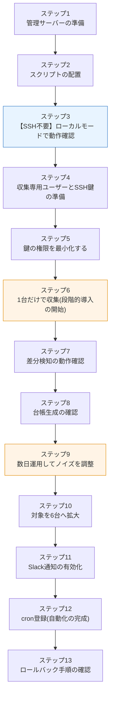

# 実装・移行手順書 — 構成情報の自動収集・差分検知

> **注意: この案件は架空の設定である。** 手順中の `192.168.1.x` などのアドレスやサーバー名は、架空の依頼元(株式会社サンプル商事)の想定環境のものである。
>
> **出力例の表記について**: 本書のコマンド出力には2種類ある。
> - 🟢 **【実測】** … 手元の検証環境(Ubuntu 24.04 LTS / bash 5.2 / jq 1.7)で実際に実行して得た出力
> - ⚪ **【出力イメージ】** … 想定環境(SSH接続先6台)を前提とした出力の例。実際に6台を用意して実行したものではない
>
> この区別を必ず確認しながら読み進めること。

## 0. この手順書の進め方

### 0-1. 全体の流れ



> 💡 **ポイント: ステップ3だけでも大きな学習効果がある**
> ステップ3(ローカルモード)は、**SSH接続先のサーバーが1台も無くても実行できる**。「自分のマシン1台を対象に、収集 → 差分検知 → 台帳生成の全工程を動かす」ところまで到達できるので、まずはここまでを目標にするとよい。SSHの準備(ステップ4〜5)は、そのあとで落ち着いて取り組める。

### 0-2. 用意するもの

| 役割 | 台数 | 要件 |
|---|---|---|
| 管理サーバー | 1台 | Linux(Ubuntu 22.04以降を推奨)、`bash` / `ssh` / `jq` / `cron` が動くこと |
| 収集対象サーバー | 0〜6台 | Linux、SSHで接続できること。**0台でもステップ3までは進められる** |

## ステップ1: 管理サーバーの準備

### 1-1. 必要なコマンドが揃っているか確認する

**なぜ最初に確認するのか**: 途中で「`jq` が無い」と分かると、手順を戻ることになる。前提条件は最初に潰しておく。

```bash
for cmd in bash ssh jq diff awk find flock timeout; do
    if command -v "$cmd" >/dev/null 2>&1; then
        echo "OK   : $cmd ($(command -v "$cmd"))"
    else
        echo "MISSING: $cmd"
    fi
done
```

🟢 **【実測】出力**

```text
OK   : bash (/usr/bin/bash)
OK   : ssh (/usr/bin/ssh)
OK   : jq (/usr/bin/jq)
OK   : diff (/usr/bin/diff)
OK   : awk (/usr/bin/awk)
OK   : find (/usr/bin/find)
OK   : flock (/usr/bin/flock)
OK   : timeout (/usr/bin/timeout)
```

`MISSING` があれば、次のコマンドでインストールする。

```bash
# Ubuntu / Debian系
sudo apt update
sudo apt install -y jq diffutils findutils util-linux coreutils openssh-client

# RHEL / AlmaLinux系
sudo dnf install -y jq diffutils findutils util-linux coreutils openssh-clients
```

### 1-2. 収集専用ユーザーを作成する

**なぜ専用ユーザーを作るのか**: 収集処理を root や個人アカウントで動かすと、万一スクリプトに問題があったときの影響範囲が大きくなる。また、対象サーバー側のログに「誰が接続してきたか」が `invadmin` として明確に残る。**最小権限の原則**([02-improvement-proposal.md](./02-improvement-proposal.md) R2)の第一歩である。

```bash
sudo useradd -m -s /bin/bash -c "inventory drift collector" invadmin
sudo passwd -l invadmin    # パスワードログインを無効化(鍵認証のみにする)
id invadmin
```

⚪ **【出力イメージ】**

```text
uid=1001(invadmin) gid=1001(invadmin) groups=1001(invadmin)
```

> 💡 **ポイント: `sudo` グループに入れないこと**
> `invadmin` には管理者権限を一切与えない。[03-design.md](./03-design.md) 第4章のとおり、収集する項目はすべて一般ユーザー権限で取得できるように設計されている。「あとで必要になるかもしれないから」と `sudo` を付けるのは、最小権限の原則に反する。**必要になってから付けるのが正しい順序**である。

### 1-3. ディレクトリを作成する

**なぜ場所を分けるのか**: プログラム(`/opt`)、データ(`/var/lib`)、ログ(`/var/log`)を分けるのは Linux の慣習(FHS: Filesystem Hierarchy Standard)である。バックアップ対象や権限設定を場所ごとに変えられる。

```bash
sudo mkdir -p /opt/inventory-drift/reports
sudo mkdir -p /var/lib/inventory-drift/snapshots
sudo mkdir -p /var/log/inventory-drift

# 所有者を収集専用ユーザーにする
sudo chown -R invadmin:invadmin /opt/inventory-drift /var/lib/inventory-drift /var/log/inventory-drift

# スナップショットは機微情報(ユーザー一覧・開放ポート)を含むため、本人だけが読める権限にする
sudo chmod 700 /var/lib/inventory-drift /var/lib/inventory-drift/snapshots

ls -ld /opt/inventory-drift /var/lib/inventory-drift/snapshots /var/log/inventory-drift
```

⚪ **【出力イメージ】**

```text
drwxr-xr-x 3 invadmin invadmin 4096 Sep  7 05:00 /opt/inventory-drift
drwx------ 2 invadmin invadmin 4096 Sep  7 05:00 /var/lib/inventory-drift/snapshots
drwxr-xr-x 2 invadmin invadmin 4096 Sep  7 05:00 /var/log/inventory-drift
```

> 💡 **ポイント: `chmod 700` の理由**
> 収集した情報には「どのユーザーがいるか」「どのポートが開いているか」が含まれる。これは攻撃者にとって価値の高い偵察情報である([02-improvement-proposal.md](./02-improvement-proposal.md) R3)。**集めた情報を守るところまでが収集の設計**である。

## ステップ2: スクリプトの配置

```bash
# リポジトリから配置する場合
sudo cp improvements/06-inventory-drift-detection/src/*.sh /opt/inventory-drift/
sudo cp improvements/06-inventory-drift-detection/src/*.conf /opt/inventory-drift/
sudo chown invadmin:invadmin /opt/inventory-drift/*

# 実行権限を付ける
sudo chmod 750 /opt/inventory-drift/*.sh
# remote_probe.sh は「送り込まれる中身」なので実行権限は不要だが、
# ローカルモードで直接叩けるよう同じ扱いにしておく

# 設定ファイルは Slack Webhook URL を含むため、本人だけが読める権限にする
sudo chmod 600 /opt/inventory-drift/inventory.conf
sudo chmod 640 /opt/inventory-drift/targets.conf

ls -l /opt/inventory-drift/
```

⚪ **【出力イメージ】**

```text
total 68
-rwxr-x--- 1 invadmin invadmin 11234 Sep  7 05:02 collect_inventory.sh
-rw-r--r-- 1 invadmin invadmin  2010 Sep  7 05:02 crontab.example
-rwxr-x--- 1 invadmin invadmin 12876 Sep  7 05:02 detect_drift.sh
-rwxr-x--- 1 invadmin invadmin  9540 Sep  7 05:02 generate_ledger.sh
-rw------- 1 invadmin invadmin  5120 Sep  7 05:02 inventory.conf
-rwxr-x--- 1 invadmin invadmin  8720 Sep  7 05:02 remote_probe.sh
-rwxr-x--- 1 invadmin invadmin  4380 Sep  7 05:02 run_daily.sh
-rw-r----- 1 invadmin invadmin  2450 Sep  7 05:02 targets.conf
```

### 2-1. 静的解析でスクリプトを検査する

**なぜ実行前に検査するのか**: シェルスクリプトは、書き間違えても実行できてしまうことが多い(例: 引用符を忘れた変数展開)。`shellcheck` は、そういった「動くが危ない」書き方を実行前に指摘してくれるツールである。

```bash
sudo apt install -y shellcheck    # 未導入の場合
shellcheck -S warning /opt/inventory-drift/*.sh /opt/inventory-drift/inventory.conf
echo "exit=$?"
```

🟢 **【実測】出力**

```text
exit=0
```

> 💡 **ポイント: 「無警告で通ること」を基準にする**
> `shellcheck` は指摘が出ても実行はできるため、つい放置しがちである。本案件では**すべてのスクリプトを `-S warning` で無警告**にしている。設定ファイル(`inventory.conf`)の先頭に `# shellcheck shell=bash` と `# shellcheck disable=SC2034` を書いているのは、「変数を定義するだけのファイル」であることを解析ツールに伝えるためである。

## ステップ3: 【SSH不要】ローカルモードで動作確認する

**このステップの目的**: SSHの準備をする前に、**収集ロジックそのものが正しく動くこと**を確認する。問題が起きたときに「SSHの問題か、スクリプトの問題か」を切り分けられるようにするのが狙いである。

### 3-1. 収集スクリプト単体を実行してみる

```bash
cd /opt/inventory-drift
bash remote_probe.sh
```

🟢 **【実測】出力(抜粋)**

```text
schema_version	1
os_name	Ubuntu 24.04.4 LTS
os_id	ubuntu
os_version_id	24.04
kernel	6.18.44-fc-v24
arch	x86_64
hostname	vm
ip	192.0.2.2
collect_note	ip	ip_command_missing_used_hostname
disk	/	264212084	22
disk	/var	264212084	22
disk	/home	264212084	22
package	bash	5.2.21-2ubuntu4
package	openssh-server	not_installed
package	nginx	not_installed
package	curl	8.5.0-2ubuntu10.8
collect_note	service	systemd_unavailable
user	ubuntu	1000	/bin/bash
sudoer	ubuntu
port	2024
port	2025
collect_note	port	used_proc_net_tcp_fallback
```

> 💡 **ポイント: `collect_note` が出ても失敗ではない**
> 上の実測環境には `ip` コマンド・systemd・`ss` コマンドが無いため、`collect_note` の行が3つ出ている。これは**「その項目が取れなかった理由を記録した」**というだけで、収集自体は成功している。通常のUbuntu Serverで実行すれば、これらの `collect_note` は出ずに `service` の行が並ぶ。
> **「取れなかったことを黙って握りつぶさない」**のは意図した設計である([03-design.md](./03-design.md) 5-2)。値が空なのか取得に失敗したのかを区別できないと、翌日に大量の誤検知が出る。

### 3-2. 練習用の設定ファイルを作る

**なぜ本番設定を直接いじらないのか**: 本番用の `inventory.conf` は `/var/lib` や `/var/log` を指しており、動作確認のたびに本番データが混ざってしまう。**練習用のコピーを作って、保存先だけを差し替える**のが安全である。

```bash
mkdir -p ~/inv-test
cd /opt/inventory-drift

# 保存先を練習用ディレクトリへ差し替えた設定ファイルを作る
sed -e "s#^SNAPSHOT_ROOT=.*#SNAPSHOT_ROOT=\"$HOME/inv-test/snapshots\"#" \
    -e "s#^REPORT_DIR=.*#REPORT_DIR=\"$HOME/inv-test/reports\"#" \
    -e "s#^LOG_FILE=.*#LOG_FILE=\"$HOME/inv-test/inventory-drift.log\"#" \
    -e "s#^TARGETS_FILE=.*#TARGETS_FILE=\"$HOME/inv-test/targets-local.conf\"#" \
    inventory.conf > ~/inv-test/test.conf

# 対象を「自分自身」1台だけにする(ローカルモード)
echo 'localhost,local,-,test' > ~/inv-test/targets-local.conf

cat ~/inv-test/targets-local.conf
```

🟢 **【実測】出力**

```text
localhost,local,-,test
```

`targets.conf` の書式は `name,transport,address,role` の4項目である。`transport` を `local` にすると、SSHを使わずに自分自身を対象に収集する。

### 3-3. 収集を実行する

```bash
cd /opt/inventory-drift
./collect_inventory.sh --config ~/inv-test/test.conf
```

🟢 **【実測】出力**

```text
2026-09-07 04:35:05 [INFO] ===== 構成情報の収集を開始します (日付: 2026-09-07) =====
2026-09-07 04:35:05 [INFO] [localhost] 収集開始 (transport=local, address=-)
2026-09-07 04:35:05 [WARN] [localhost] 収集完了(ただし取得できなかった項目が 3 件あります)
2026-09-07 04:35:05 [INFO] ===== 収集終了: 対象 1 台 / 成功 1 台 / 失敗 0 台 =====
```

生成されたJSONを確認する。

```bash
jq . ~/inv-test/snapshots/$(date +%F)/localhost.json | head -30
```

🟢 **【実測】出力(抜粋)**

```json
{
  "schema_version": 1,
  "host": "localhost",
  "role": "test",
  "transport": "local",
  "collected_at": "2026-09-07T04:35:05+0000",
  "status": "ok",
  "facts": {
    "os": {
      "name": "Ubuntu 24.04.4 LTS",
      "id": "ubuntu",
      "version_id": "24.04"
    },
    "kernel": "6.18.44-fc-v24",
    "arch": "x86_64",
    "hostname": "vm",
    "ip_addresses": [
      "192.0.2.2"
    ],
```

> 💡 **ポイント: ファイルサイズを見ておく**
> `wc -c` で確認すると **1,728バイト(約1.7KB)** だった(🟢 実測)。これが400日 × 6台でも約4MBにしかならないという試算の根拠である([03-design.md](./03-design.md) 7-3)。**容量の見積もりは、実測値1つあれば掛け算で出せる。**

### 3-4. 差分検知を試す(初回は「基準の作成」になる)

```bash
./detect_drift.sh --config ~/inv-test/test.conf
echo "exit=$?"
```

🟢 **【実測】出力**

```text
2026-09-07 04:59:01 [INFO] ===== 差分検知を開始します (なし -> 2026-09-07) =====
2026-09-07 04:59:01 [INFO] [localhost] 前回スナップショットなし。基準として登録しました
2026-09-07 04:59:01 [INFO] 差分レポートを出力しました: .../inv-test/reports/drift-2026-09-07.md
2026-09-07 04:59:01 [INFO] ===== 差分検知終了: 差分 0 件 / 重要 0 件 =====
exit=0
```

比較対象が無いので差分は0件になる。**これは正常**である。差分検知は2日目からが本番となる。

> 💡 **ポイント: 「前回なし」を差分として扱わない理由**
> 初回や新規追加のサーバーで「全項目が追加された」と報告すると、1台あたり数十件の差分が出て、本当に見るべき変更が埋もれる。そのため、前回スナップショットが無いホストは**差分件数に数えず、「基準として登録」とだけ記録する**設計にしている。

### 3-5. 台帳を生成する

```bash
./generate_ledger.sh --config ~/inv-test/test.conf
head -25 ~/inv-test/reports/ledger.md
```

🟢 **【実測】出力(抜粋)**

```markdown
# サーバー台帳(自動生成)

> **このファイルは `generate_ledger.sh` が自動生成しています。手で編集しないでください。**
> 手で書き換えても次回の実行で上書きされます。内容を変えたい場合は、
> サーバー側の実際の構成を変えるか、収集項目の設定を変更してください。

| 項目 | 内容 |
|---|---|
| 管理組織 | 株式会社サンプル商事(架空の依頼元) |
| 管理担当 | 情報システム課 運用担当 |
| 情報の基準日 | 2026-09-07 |
| 生成日時 | 2026-09-07 04:39:55 |
| 対象サーバー数 | 1 台 |

## 1. サーバー一覧

| 名前 | 役割 | ホスト名 | OS | カーネル | IPアドレス | 待受ポート | 収集状態 |
|---|---|---|---|---|---|---|---|
| localhost | test | vm | Ubuntu 24.04.4 LTS | 6.18.44-fc-v24 | 192.0.2.2 | 2024 2025 36191 39221 | OK |
```

CSV版も確認する。

```bash
head -2 ~/inv-test/reports/ledger.csv
```

🟢 **【実測】出力**

```csv
name,role,hostname,os,kernel,arch,ip_addresses,disks,packages,users,sudoers,listen_ports,collected_at,status
"localhost","test","vm","Ubuntu 24.04.4 LTS","6.18.44-fc-v24","x86_64","192.0.2.2","/=252GB;/home=252GB;/var=252GB","bash=5.2.21-2ubuntu4;cron=not_installed;curl=8.5.0-2ubuntu10.8;nginx=not_installed;openssh-server=not_installed;rsync=not_installed","ubuntu","ubuntu","2024;2025;36191;39221","2026-09-07T04:35:05+0000","ok"
```

> 💡 **ポイント: 台帳の冒頭に「手で編集しないでください」と書く理由**
> 生成された台帳を手で直すと、翌日には上書きされて消える。これは不具合ではなく**設計そのもの**である。「台帳は書くものではなく、生成されるもの」に変わったことを、ファイルを開いた人が最初に理解できるようにしている。

**ここまでで、SSHを使わずに全機能の動作確認が完了した。** SSH接続先を用意できない場合は、ステップ9(ノイズ調整)へ進んでもよい。

## ステップ4: 収集専用ユーザーとSSH鍵の準備

ここからは、実際に別サーバーへ接続する準備を行う。

### 4-1. 収集用のSSH鍵ペアを作成する

**なぜ専用の鍵を作るのか**: 普段使っている個人の鍵を流用すると、「収集処理が使う鍵」と「人が使う鍵」の区別がつかなくなる。片方だけを失効させることもできない。**用途ごとに鍵を分ける**のが原則である。

```bash
sudo -u invadmin ssh-keygen -t ed25519 \
    -f /home/invadmin/.ssh/id_ed25519_inventory \
    -N '' \
    -C 'inventory-collector@mgmt01'
```

| オプション | 意味 |
|---|---|
| `-t ed25519` | 鍵の種類。RSAより短く高速で、現在の推奨方式 |
| `-f <パス>` | 鍵ファイルの保存先 |
| `-N ''` | **パスフレーズなし**。cronから非対話で使うため、パスフレーズは設定できない |
| `-C '...'` | コメント。どのサーバーのどの用途の鍵かが分かるようにする |

🟢 **【実測】出力(検証環境で同じコマンド形式を実行した結果)**

```text
Generating public/private ed25519 key pair.
Your identification has been saved in /home/invadmin/.ssh/id_ed25519_inventory
Your public key has been saved in /home/invadmin/.ssh/id_ed25519_inventory.pub
The key fingerprint is:
SHA256:6tQLc1Wya6kHBAFSaOVBvMwK4XF0Swo06suBQPbRAvI inventory-collector@mgmt01
The key's randomart image is:
+--[ED25519 256]--+
|oB+OB+..         |
...
+----[SHA256]-----+
```

> ⚠️ **パスフレーズなしの鍵を作ることの意味を理解しておくこと**
> パスフレーズが無いということは、**その鍵ファイルを手に入れた者は誰でも接続できる**ということである。だからこそ、次の2つが必須になる。
> 1. 鍵ファイルの権限を `600`(本人のみ読み書き可)にする
> 2. **鍵の側で「できること」を制限する**(ステップ5)
>
> 「パスフレーズが無いから危険」ではなく、「**パスフレーズが無い分、別の方法で守る**」という考え方をする。

```bash
sudo -u invadmin chmod 600 /home/invadmin/.ssh/id_ed25519_inventory
sudo -u invadmin chmod 644 /home/invadmin/.ssh/id_ed25519_inventory.pub
sudo ls -l /home/invadmin/.ssh/
```

⚪ **【出力イメージ】**

```text
-rw------- 1 invadmin invadmin 411 Sep  7 05:10 id_ed25519_inventory
-rw-r--r-- 1 invadmin invadmin 103 Sep  7 05:10 id_ed25519_inventory.pub
```

> ⚠️ **秘密鍵の中身は、絶対にどこにも貼り付けないこと。** 手順書・チケット・チャット・リポジトリのいずれにも書かない。本書でも公開鍵のフィンガープリントのみを示し、鍵の中身は一切掲載していない。

### 4-2. 対象サーバー側に収集用ユーザーを作る

対象サーバー(まずは web01 の1台だけ)で作業する。

```bash
# web01 での作業
sudo useradd -m -s /bin/bash -c "inventory collector (read only)" invadmin
sudo passwd -l invadmin
sudo mkdir -p /home/invadmin/.ssh
sudo chmod 700 /home/invadmin/.ssh
sudo chown -R invadmin:invadmin /home/invadmin/.ssh
```

> 💡 **ポイント: 対象サーバー側でも `sudo` を付けない**
> [03-design.md](./03-design.md) 4-1の表のとおり、収集項目はすべて一般ユーザー権限で取得できる。もし「この項目が取れない」と感じたら、**sudoを付けるのではなく、その項目を収集対象から外すことを先に検討する**。それが最小権限の設計である。

## ステップ5: 鍵の権限を最小化する

ここが本案件のセキュリティ設計の中心である。**「鍵を持っていても、収集しかできない」**状態を作る。

### 5-1. 2つの制限レベル

`authorized_keys` には、鍵ごとに制限オプションを書ける。制限の強さと運用の手間にはトレードオフがあるため、2つのレベルを用意する。

| | **レベル1: 標準(推奨)** | **レベル2: 厳格** |
|---|---|---|
| 概要 | 接続元IP制限 + 各種転送の禁止 | レベル1に加えて、実行できるコマンドを収集スクリプトに固定 |
| 対象サーバーへの配置 | **不要**(スクリプトは毎回 `bash -s` で送り込む) | **必要**(`remote_probe.sh` を各サーバーへ配置する) |
| 収集項目を変更したいとき | 管理サーバーのファイルを直すだけ | **6台すべてに再配布が必要** |
| 鍵が漏洩したときの被害 | その鍵で任意のコマンドを実行される(ただし一般ユーザー権限・転送は不可) | **収集スクリプトの実行しかできない** |
| おすすめ | 学習・小規模環境 | 本番環境・機微度の高い環境 |

### 5-2. レベル1の設定(推奨)

管理サーバーで公開鍵の内容を確認する。

```bash
sudo cat /home/invadmin/.ssh/id_ed25519_inventory.pub
```

⚪ **【出力イメージ】**

```text
ssh-ed25519 AAAAC3NzaC1lZDI1NTE5AAAAI...(省略)... inventory-collector@mgmt01
```

対象サーバー(web01)の `/home/invadmin/.ssh/authorized_keys` に、**制限オプションを先頭に付けて**1行で書き込む。

```bash
# web01 での作業(<公開鍵の内容> は上で確認したものを貼り付ける)
sudo -u invadmin tee /home/invadmin/.ssh/authorized_keys >/dev/null <<'EOF'
from="192.168.1.10",no-port-forwarding,no-agent-forwarding,no-X11-forwarding,no-pty ssh-ed25519 AAAAC3NzaC1lZDI1NTE5AAAAI...(省略)... inventory-collector@mgmt01
EOF

sudo chmod 600 /home/invadmin/.ssh/authorized_keys
sudo chown invadmin:invadmin /home/invadmin/.ssh/authorized_keys
```

| オプション | 意味 | これが無いとどうなるか |
|---|---|---|
| `from="192.168.1.10"` | **管理サーバーのIPからの接続のみ許可** | 鍵が漏洩したら、どこからでも接続できてしまう |
| `no-port-forwarding` | ポート転送を禁止 | この鍵を踏み台にして、内部ネットワークの他のサーバーへ中継されうる |
| `no-agent-forwarding` | SSHエージェント転送を禁止 | 接続元の他の鍵まで悪用されうる |
| `no-X11-forwarding` | X11転送を禁止 | 不要な機能は塞ぐ(攻撃面の削減) |
| `no-pty` | 端末(疑似TTY)の割り当てを禁止 | **対話シェルを開けなくする。** 収集は非対話実行なので、これで困ることはない |

> 💡 **ポイント: `no-pty` の効果を体感してみる**
> `no-pty` を設定した鍵で `ssh -i 鍵 invadmin@web01` と打つと、シェルが開かずに終了する。一方、`ssh -i 鍵 invadmin@web01 'uname -r'` のようなコマンド実行はできる。**「人が入り込む用途」だけを封じている**わけである。

### 5-3. レベル2の設定(より厳格にする場合)

レベル2では、対象サーバーに収集スクリプトを配置し、鍵で実行できるコマンドをそれに固定する。

```bash
# 管理サーバーから、収集スクリプトを対象サーバーへ配置する
scp -i /home/invadmin/.ssh/id_ed25519_inventory \
    /opt/inventory-drift/remote_probe.sh invadmin@192.168.1.11:/tmp/

# web01 での作業
sudo mv /tmp/remote_probe.sh /usr/local/bin/inventory_probe.sh
sudo chown root:root /usr/local/bin/inventory_probe.sh
sudo chmod 755 /usr/local/bin/inventory_probe.sh    # 一般ユーザーは実行のみ、書き換え不可
```

`authorized_keys` に `command=` を追加する。

```text
command="env PROBE_WATCH_PACKAGES='bash openssh-server nginx cron rsync curl' /usr/local/bin/inventory_probe.sh",from="192.168.1.10",no-port-forwarding,no-agent-forwarding,no-X11-forwarding,no-pty ssh-ed25519 AAAAC3NzaC1lZDI1NTE5AAAAI...(省略)... inventory-collector@mgmt01
```

> 💡 **ポイント: 管理サーバー側のスクリプトは、レベル1でもレベル2でも変更不要**
> `collect_inventory.sh` は `ssh <host> '... bash -s' < remote_probe.sh` という形で呼び出す。`command=` が設定されていると、sshdは**送られてきたコマンドを無視して、固定したコマンドだけを実行する**。`remote_probe.sh` は標準入力を読まないため、送り込まれた内容は単に捨てられる。結果として**同じ収集スクリプトが、どちらのレベルでもそのまま動く**。
> ただし、レベル2では `PROBE_WATCH_PACKAGES` などの環境変数も無視されるため、上記のように `command="env VAR=値 /path/script"` の形で対象サーバー側に埋め込む必要がある。**収集項目を変えるたびに6台の `authorized_keys` を直す**ことになるのが、レベル2の運用コストである。

### 5-4. 接続確認

```bash
sudo -u invadmin ssh -o BatchMode=yes -o ConnectTimeout=10 \
    -i /home/invadmin/.ssh/id_ed25519_inventory \
    invadmin@192.168.1.11 'uname -r'
```

⚪ **【出力イメージ】**

```text
6.8.0-45-generic
```

> レベル2を設定した場合、上のコマンドは `uname -r` ではなく収集スクリプトのTSV出力を返す(コマンドが固定されているため)。**これは設定が効いている証拠**である。

接続できない場合は [06-troubleshooting.md](./06-troubleshooting.md) のQ1を参照。

## ステップ6: 1台だけで収集する(段階的導入の開始)

**なぜ6台まとめて始めないのか**: 最初から6台で始めると、問題が起きたときに原因の切り分けが難しい。また、ノイズ(毎日出る不要な差分)がどれくらい出るか分からないまま通知を有効にすると、初日から通知が溢れて信頼を失う。**1台で数日運用し、内容に納得してから広げる**のが安全である。

### 6-1. 対象を1台だけにする

```bash
sudo -u invadmin tee /opt/inventory-drift/targets.conf >/dev/null <<'EOF'
# 段階的導入: まずは web01 の1台だけ
web01,ssh,invadmin@192.168.1.11,web
EOF
```

### 6-2. 収集を実行する

```bash
cd /opt/inventory-drift
sudo -u invadmin ./collect_inventory.sh
```

⚪ **【出力イメージ】**

```text
2026-09-07 05:20:11 [INFO] ===== 構成情報の収集を開始します (日付: 2026-09-07) =====
2026-09-07 05:20:11 [INFO] [web01] 収集開始 (transport=ssh, address=invadmin@192.168.1.11)
2026-09-07 05:20:12 [INFO] [web01] 収集完了 -> /var/lib/inventory-drift/snapshots/2026-09-07/web01.json
2026-09-07 05:20:12 [INFO] ===== 収集終了: 対象 1 台 / 成功 1 台 / 失敗 0 台 =====
```

> 💡 **ポイント: `--target` オプションで1台だけ試せる**
> `targets.conf` に6台書いた状態でも、`./collect_inventory.sh --target web01` とすれば、その1台だけを収集できる。障害切り分けや、追加したサーバーの初回確認に便利である。

🟢 **【実測】`--target` の動作確認(ローカルモードで実行)**

```text
$ ./collect_inventory.sh --config ~/inv-test/test.conf --target localhost
2026-09-07 04:41:09 [INFO] ===== 構成情報の収集を開始します (日付: 2026-09-07) =====
2026-09-07 04:41:09 [INFO] [localhost] 収集開始 (transport=local, address=-)
2026-09-07 04:41:10 [WARN] [localhost] 収集完了(ただし取得できなかった項目が 3 件あります)
2026-09-07 04:41:10 [INFO] ===== 収集終了: 対象 1 台 / 成功 1 台 / 失敗 0 台 =====
```

### 6-3. 収集に失敗したときの挙動を確認しておく

**なぜわざと失敗させるのか**: 「失敗したときに何が起きるか」を、本番で初めて知るのは危険である。**到達できないアドレスを1台加えて、意図的に失敗させる**ことで、挙動を先に確認しておく。

```bash
# 到達できないアドレスを一時的に追加して実行する
echo 'web99,ssh,invadmin@192.0.2.99,web' >> /opt/inventory-drift/targets.conf
sudo -u invadmin ./collect_inventory.sh
echo "exit=$?"
```

🟢 **【実測】出力(検証環境で到達不能アドレスを対象に実行)**

```text
2026-09-07 04:59:11 [INFO] ===== 構成情報の収集を開始します (日付: 2026-09-07) =====
2026-09-07 04:59:11 [INFO] [localhost] 収集開始 (transport=local, address=-)
2026-09-07 04:59:11 [WARN] [localhost] 収集完了(ただし取得できなかった項目が 3 件あります)
2026-09-07 04:59:11 [INFO] [web99] 収集開始 (transport=ssh, address=invadmin@192.0.2.99)
2026-09-07 04:59:14 [ERROR] [web99] 収集に失敗しました(SSH接続不可・タイムアウト等)
2026-09-07 04:59:14 [INFO] ===== 収集終了: 対象 2 台 / 成功 1 台 / 失敗 1 台 =====
exit=2
```

> 実測は検証環境のローカルモード(1台目 `localhost`)と、到達できないアドレス(2台目 `web99`)を組み合わせて行った。ログには `ssh: connect to host 192.0.2.99 port 22: Connection timed out` も併せて記録される。

確認すべき点は3つある。

| 確認点 | 期待する結果 | 実測結果 |
|---|---|---|
| 1台の失敗で処理が止まらないか | 残りの台の収集が続く | 🟢 続いた(localhost は成功) |
| 失敗が記録として残るか | `status: "error"` のJSONが保存される | 🟢 保存された |
| 終了コードで判別できるか | 2(一部失敗)が返る | 🟢 `exit=2` |

```bash
cat /var/lib/inventory-drift/snapshots/$(date +%F)/web99.json
```

🟢 **【実測】出力**

```json
{
  "schema_version": 1,
  "host": "web99",
  "role": "web",
  "transport": "ssh",
  "collected_at": "2026-09-07T04:59:11+0000",
  "status": "error",
  "facts": null,
  "notes": [
    {
      "item": "collect",
      "reason": "probe_failed"
    }
  ]
}
```

確認が済んだら、テスト用の行を削除する。

```bash
sudo -u invadmin sed -i '/^web99,/d' /opt/inventory-drift/targets.conf
sudo rm -f /var/lib/inventory-drift/snapshots/$(date +%F)/web99.json
```

## ステップ7: 差分検知の動作確認

**このステップの目的**: 「本当に変更を検知できるのか」を、**意図的に構成を変えて確かめる**。動くと信じるのではなく、動くことを確認する。

### 7-1. 1回目の収集(基準の作成)

```bash
sudo -u invadmin ./collect_inventory.sh
sudo -u invadmin ./detect_drift.sh
```

初回は比較対象が無いため「基準として登録しました」となる。

### 7-2. 意図的に構成を変える

対象サーバー上で、**元に戻せる、安全な変更**を1つ加える。以下は「新しいポートで待ち受ける」例である。

```bash
# web01 での作業: 一時的にポート18080で待ち受けるプロセスを起動する
python3 -m http.server 18080 --bind 127.0.0.1 &
```

> 💡 **ポイント: テストは「戻せる変更」で行う**
> ユーザー追加やパッケージ導入でも検知テストはできるが、**後片付けを忘れると本物のドリフトを自分で作ってしまう**。プロセスを起動するだけなら、`kill` するか再起動すれば確実に元に戻る。テスト内容を選ぶときは「戻し方」から先に考えること。

### 7-3. 2回目の収集と差分検知

**通常は1日1回の実行なので、同じ日に2回目を試すには「1回目を前日分として退避」する。**

```bash
# 1回目の結果を「前日分」として退避する(検証のための操作)
YESTERDAY=$(date -d yesterday +%F)
sudo -u invadmin mv /var/lib/inventory-drift/snapshots/$(date +%F) \
                   /var/lib/inventory-drift/snapshots/${YESTERDAY}

# 2回目の収集
sudo -u invadmin ./collect_inventory.sh
sudo -u invadmin ./detect_drift.sh
echo "exit=$?"
```

🟢 **【実測】出力(検証環境で、実際にポート18080を待ち受けた状態で実行)**

```text
2026-09-07 04:38:36 [INFO] ===== 差分検知を開始します (2026-09-06 -> 2026-09-07) =====
2026-09-07 04:38:36 [WARN] [localhost] 差分 1 件(うち重要 1 件)を検知しました
2026-09-07 04:38:36 [INFO] 差分レポートを出力しました: .../reports/drift-2026-09-07.md
2026-09-07 04:38:36 [INFO] Slack通知は無効(ENABLE_SLACK_NOTIFY=false)のため送信しません
2026-09-07 04:38:36 [INFO] ===== 差分検知終了: 差分 1 件 / 重要 1 件 =====
exit=3
```

レポートを確認する。

```bash
cat /opt/inventory-drift/reports/drift-$(date +%F).md
```

🟢 **【実測】出力(詳細部分)**

```markdown
## 詳細

### localhost

| 項目 | 変更種別 | 変更前 | 変更後 | 重要度 |
|---|---|---|---|---|
| `ports[18080]` | 追加 | - | listen | 高 |
```

> 💡 **ポイント: 終了コード3は「エラー」ではない**
> `exit=3` は「差分を検知した」という意味であり、ツールが正しく動いた証拠である([03-design.md](./03-design.md) 6-7)。0(差分なし)・1(エラー)・3(要確認)の3状態を区別することで、**cronの失敗通知と差分通知が混ざらない**ようにしている。

### 7-4. 後片付け

```bash
# web01 での作業: テスト用のプロセスを停止する
kill %1
```

## ステップ8: 台帳生成の確認

```bash
sudo -u invadmin ./generate_ledger.sh
ls -l /opt/inventory-drift/reports/
```

⚪ **【出力イメージ】**

```text
-rw-r--r-- 1 invadmin invadmin  1204 Sep  7 05:31 drift-2026-09-07.md
-rw-r--r-- 1 invadmin invadmin   142 Sep  7 05:31 drift-history.csv
-rw-r--r-- 1 invadmin invadmin  2860 Sep  7 05:31 ledger.csv
-rw-r--r-- 1 invadmin invadmin  4120 Sep  7 05:31 ledger.md
```

変更履歴CSVの内容も確認する。

🟢 **【実測】`drift-history.csv` の内容**

```csv
detected_date,host,key,change_type,before,after,severity
2026-09-07,localhost,ports[18080],追加,-,listen,高
```

> 💡 **ポイント: これが「変更履歴が追える」の実体**
> 改善前は「いつ誰が変えたか追えない」状態だった。このCSVがあれば、`grep 'sudoers' drift-history.csv` で「管理者権限が付与された日」を一覧できる。**日付ディレクトリ(層1)・日次レポート(層2)・履歴CSV(層3)の3層**で追跡を実現している([03-design.md](./03-design.md) 7-4)。

## ステップ9: 数日運用してノイズを調整する

**このステップを飛ばさないこと。** 差分検知ツールが現場で使われなくなる最大の原因は、「毎日どうでもいい差分が出て、誰も見なくなる」ことである([02-improvement-proposal.md](./02-improvement-proposal.md) R6)。

### 9-1. 数日ぶん実行し、毎日出る差分を洗い出す

3〜5日ほど手動または cron で実行し、差分レポートを並べて眺める。

```bash
grep -h '^| `' /opt/inventory-drift/reports/drift-*.md | sort | uniq -c | sort -rn | head
```

⚪ **【出力イメージ】**

```text
      4 | `disks[/var].used_percent` | 変更 | 61 | 63 | 中 |
      3 | `disks[/].used_percent` | 変更 | 22 | 23 | 中 |
      1 | `packages[nginx]` | 変更 | 1.24.0-2ubuntu7 | 1.24.0-2ubuntu7.1 | 高 |
```

上の例では、ディスク使用率が毎日差分として出ている。**これは構成の変更ではないので、無視対象にすべきである。**

### 9-2. 無視パターンを設定に追加する

```bash
sudo -u invadmin vi /opt/inventory-drift/inventory.conf
```

```bash
# 変更前(既定値)
DRIFT_IGNORE_PATTERN='^disks\[[^]]*\]\.used_percent=|^collected_at='

# 例: 一時的な待ち受けポートが毎日変わる環境では、高位ポート(30000番以上)も除外する
DRIFT_IGNORE_PATTERN='^disks\[[^]]*\]\.used_percent=|^collected_at=|^ports\[[3-9][0-9]{4}\]='
```

🟢 **【実測】無視設定が効いていることの確認**

検証環境で、ディスク使用率を 22% → 45% に変えたスナップショットを作って比較したところ、**カーネル・パッケージ・ユーザー・sudo権限・ポートの5種類の差分は検知され、ディスク使用率の変化だけは差分に出なかった**。

```text
| 項目 | 変更種別 | 変更前 | 変更後 | 重要度 |
|---|---|---|---|---|
| `kernel` | 変更 | 6.18.44-fc-v24 | 6.18.45-fc-v24 | 中 |
| `packages[curl]` | 変更 | 8.5.0-2ubuntu10.8 | 8.5.0-2ubuntu10.9 | 高 |
| `ports[18080]` | 削除 | listen | - | 高 |
| `sudoers[deploy]` | 追加 | - | yes | 高 |
| `users[deploy].shell` | 追加 | - | /bin/bash | 高 |
| `users[deploy].uid` | 追加 | - | 1001 | 高 |
```

> 💡 **ポイント: 無視リストは「育てる」もの**
> 最初から完璧な無視リストは作れない。**数日運用して、実際に出た差分を見てから追加する**のが正しい進め方である。設定ファイルに置いているのは、コードを触らずに運用しながら調整できるようにするためである。
> ただし、**何でも無視すればよいわけではない**。「うるさいから」という理由で `packages` を丸ごと無視すると、脆弱性対応の追跡ができなくなる。**無視する前に「この差分を見逃したら困る場面はあるか?」を必ず自問すること。**

## ステップ10: 対象を6台へ拡大する

1台での運用に納得できたら、対象を広げる。**一度に全台ではなく、2台 → 4台 → 6台と段階的に増やすと、問題が起きたときの切り分けが容易である。**

### 10-1. 対象サーバー側の準備(残り5台)

ステップ4-2とステップ5を、残りの5台にも実施する。

### 10-2. targets.conf に追加する

```bash
sudo -u invadmin tee /opt/inventory-drift/targets.conf >/dev/null <<'EOF'
# 株式会社サンプル商事(架空の依頼元)の管理対象サーバー6台
web01,ssh,invadmin@192.168.1.11,web
web02,ssh,invadmin@192.168.1.12,web
app01,ssh,invadmin@192.168.1.21,app
app02,ssh,invadmin@192.168.1.22,app
db01,ssh,invadmin@192.168.1.31,db
batch01,ssh,invadmin@192.168.1.41,batch
EOF
```

### 10-3. 追加した台だけを先に確認する

```bash
for host in web02 app01 app02 db01 batch01; do
    sudo -u invadmin ./collect_inventory.sh --target "$host"
done
```

⚪ **【出力イメージ】**

```text
2026-09-10 05:20:11 [INFO] ===== 構成情報の収集を開始します (日付: 2026-09-10) =====
2026-09-10 05:20:11 [INFO] [web02] 収集開始 (transport=ssh, address=invadmin@192.168.1.12)
2026-09-10 05:20:12 [INFO] [web02] 収集完了 -> /var/lib/inventory-drift/snapshots/2026-09-10/web02.json
2026-09-10 05:20:12 [INFO] ===== 収集終了: 対象 1 台 / 成功 1 台 / 失敗 0 台 =====
...
```

> 💡 **ポイント: 追加した日は必ず差分が出る**
> 新しく追加したサーバーは、前日のスナップショットが存在しない。そのため差分検知では「新規(基準作成)」として扱われ、差分としては数えられない。**2日目から通常の比較が始まる。**

## ステップ11: Slack通知を有効にする

**なぜ最後に有効化するのか**: 通知は「内容に納得してから」有効にする。ノイズだらけの通知が初日から飛ぶと、受け取る側の信頼を最初に失う。

### 11-1. Webhook URLを設定する

```bash
sudo -u invadmin vi /opt/inventory-drift/inventory.conf
```

```bash
ENABLE_SLACK_NOTIFY="true"
SLACK_WEBHOOK_URL="<YOUR_SLACK_WEBHOOK_URL>"    # ← 実際のURLに置き換える
```

> ⚠️ **Webhook URLの扱い**
> - リポジトリには**必ず `<YOUR_SLACK_WEBHOOK_URL>` というプレースホルダーのまま**置く。実URLをコミットすると、GitHubのシークレット検知に引っかかるだけでなく、第三者が社内チャンネルへ投稿できるようになる。
> - `inventory.conf` の権限は必ず `600` にする。

```bash
sudo chmod 600 /opt/inventory-drift/inventory.conf
sudo ls -l /opt/inventory-drift/inventory.conf
```

⚪ **【出力イメージ】**

```text
-rw------- 1 invadmin invadmin 5120 Sep 10 05:40 /opt/inventory-drift/inventory.conf
```

### 11-2. 通知のテスト

```bash
sudo -u invadmin ./detect_drift.sh
```

⚪ **【出力イメージ】**

```text
2026-09-10 05:41:02 [WARN] [web01] 差分 2 件(うち重要 1 件)を検知しました
2026-09-10 05:41:03 [INFO] Slackへ通知しました
2026-09-10 05:41:03 [INFO] ===== 差分検知終了: 差分 2 件 / 重要 1 件 =====
```

Slackに届くメッセージの形式:

```text
【構成ドリフト検知】株式会社サンプル商事
比較: 2026-09-09 -> 2026-09-10
差分 2 件(重要 1 件) / 収集失敗 0 台
詳細: /opt/inventory-drift/reports/drift-2026-09-10.md
```

> 💡 **ポイント: 「差分なしの日も通知する」設定がある**
> `NOTIFY_ON_NO_DRIFT="true"` にすると、「本日差分なし」も毎日届く。通知は増えるが、**「通知が来ない」が「差分がない」なのか「ツールが止まっている」なのか区別できる**ようになる。監視ツール自身の死活監視として有効な考え方である。

## ステップ12: cronに登録する(自動化の完成)

```bash
sudo -u invadmin crontab -e
```

[src/crontab.example](./src/crontab.example) の内容を貼り付ける。

```cron
PATH=/usr/local/sbin:/usr/local/bin:/usr/sbin:/usr/bin:/sbin:/bin
SHELL=/bin/bash

30 5 * * * /opt/inventory-drift/run_daily.sh >> /var/log/inventory-drift/cron.log 2>&1
```

登録内容を確認する。

```bash
sudo -u invadmin crontab -l
```

⚪ **【出力イメージ】**

```text
PATH=/usr/local/sbin:/usr/local/bin:/usr/sbin:/usr/bin:/sbin:/bin
SHELL=/bin/bash

30 5 * * * /opt/inventory-drift/run_daily.sh >> /var/log/inventory-drift/cron.log 2>&1
```

> 💡 **ポイント: cronでは `PATH` を明示する**
> cronから起動されるプロセスの `PATH` は、ログイン時よりずっと短い。そのため「手で実行すると動くのに、cronだと `jq: command not found` になる」という定番のトラブルが起きる。**`PATH` を先頭に書いておけば防げる。**

### 12-1. cronを待たずに動作を確認する

```bash
sudo -u invadmin /opt/inventory-drift/run_daily.sh
echo "exit=$?"
```

🟢 **【実測】出力(ローカルモードで実行)**

```text
2026-09-07 04:40:49 [INFO] ===== 構成情報の収集を開始します (日付: 2026-09-07) =====
2026-09-07 04:40:49 [INFO] [localhost] 収集開始 (transport=local, address=-)
2026-09-07 04:40:49 [WARN] [localhost] 収集完了(ただし取得できなかった項目が 3 件あります)
2026-09-07 04:40:49 [INFO] ===== 収集終了: 対象 1 台 / 成功 1 台 / 失敗 0 台 =====
2026-09-07 04:40:49 [INFO] ===== 差分検知を開始します (2026-09-06 -> 2026-09-07) =====
2026-09-07 04:40:49 [WARN] [localhost] 差分 1 件(うち重要 1 件)を検知しました
2026-09-07 04:40:49 [INFO] 差分レポートを出力しました: .../reports/drift-2026-09-07.md
2026-09-07 04:40:49 [INFO] Slack通知は無効(ENABLE_SLACK_NOTIFY=false)のため送信しません
2026-09-07 04:40:49 [INFO] ===== 差分検知終了: 差分 1 件 / 重要 1 件 =====
2026-09-07 04:40:49 [INFO] ===== 台帳の生成を開始します (対象日: 2026-09-07, 1 台) =====
2026-09-07 04:40:49 [INFO] Markdown台帳を出力しました: .../reports/ledger.md
2026-09-07 04:40:49 [INFO] CSV台帳を出力しました: .../reports/ledger.csv
2026-09-07 04:40:49 [INFO] ===== 台帳の生成が完了しました =====
exit=3
```

**収集 → 差分検知 → 台帳生成が、1コマンドで順番に実行されることが確認できた。**

### 12-2. 翌朝、cronで実行されたことを確認する

```bash
tail -20 /var/log/inventory-drift/cron.log
grep "$(date +%F)" /var/log/inventory-drift/inventory-drift.log | head
```

## ステップ13: ロールバック手順

**改善を導入するときは、「やめ方」を先に決めておく。** これがないと、問題が起きたときに慌てて場当たり的な対応をすることになる。

### 13-1. 段階別のロールバック

| レベル | 状況 | 手順 | 所要時間 |
|---|---|---|---|
| **L1: 通知だけ止める** | 通知がうるさいが、データ収集は続けたい | `inventory.conf` の `ENABLE_SLACK_NOTIFY="false"` にする | 1分 |
| **L2: 自動実行を止める** | ツールの挙動を調べたい。手動実行は残したい | `crontab -e` で該当行の先頭に `#` を付ける | 1分 |
| **L3: 対象を減らす** | 特定のサーバーで問題が起きている | `targets.conf` の該当行の先頭に `#` を付ける | 1分 |
| **L4: 完全に撤去する** | 導入を取りやめる | 下記13-2の手順 | 15分 |

### 13-2. 完全撤去の手順

```bash
# 1) cronの登録を削除する(まず自動実行を止める)
sudo -u invadmin crontab -e     # 該当行を削除
sudo -u invadmin crontab -l     # 削除されたことを確認

# 2) 対象サーバー側の収集用アカウントを無効化する(6台すべてで実施)
#    削除する前に、まずログインを止める。すぐ戻せるようにするため。
sudo -u invadmin mv /home/invadmin/.ssh/authorized_keys \
                    /home/invadmin/.ssh/authorized_keys.disabled

# 3) 収集したデータを確認する(必要なら退避する)
sudo du -sh /var/lib/inventory-drift/snapshots
sudo tar czf ~/inventory-drift-archive-$(date +%F).tar.gz \
    /var/lib/inventory-drift/snapshots /opt/inventory-drift/reports

# 4) 問題がなければ削除する
sudo rm -rf /opt/inventory-drift /var/lib/inventory-drift /var/log/inventory-drift

# 5) 対象サーバー側の収集用ユーザーを削除する(6台すべてで実施)
sudo userdel -r invadmin

# 6) 管理サーバー側の収集用ユーザーを削除する
sudo userdel -r invadmin
```

> 💡 **ポイント: 撤去しても対象サーバーには何も残らない**
> この改善は、対象サーバーに**エージェント(常駐プログラム)を一切インストールしていない**。撤去作業は「ユーザーと `authorized_keys` を消す」だけで完了する。**引き返しやすさは、改善提案が採用されるかどうかを左右する重要な要素**である([02-improvement-proposal.md](./02-improvement-proposal.md) 第3章の選定理由4)。

> ⚠️ **手順2で「削除」ではなく「無効化」から始める理由**
> `userdel` を先にやってしまうと、判断が間違っていたときに全台で再作成が必要になる。**「戻しやすい操作から順に行う」**のは、運用作業全般の鉄則である。

## 移行チェックリスト

導入完了時に、以下がすべてチェックできることを確認する。

| # | 確認項目 | 確認方法 |
|---|---|---|
| 1 | 全スクリプトが `shellcheck -S warning` を無警告で通る | `shellcheck -S warning /opt/inventory-drift/*.sh` |
| 2 | 収集専用ユーザーに `sudo` 権限が付いていない | `id invadmin`(管理サーバー・対象サーバー両方) |
| 3 | 秘密鍵の権限が `600` である | `ls -l /home/invadmin/.ssh/id_ed25519_inventory` |
| 4 | `authorized_keys` に `from=` と各種 `no-*` が設定されている | 対象サーバーで `cat /home/invadmin/.ssh/authorized_keys` |
| 5 | `inventory.conf` の権限が `600` である | `ls -l /opt/inventory-drift/inventory.conf` |
| 6 | スナップショット置き場の権限が `700` である | `ls -ld /var/lib/inventory-drift/snapshots` |
| 7 | Webhook URLがリポジトリにコミットされていない | `git grep -n 'hooks.slack.com'`(何も出ないこと) |
| 8 | 6台すべてから収集できる | `./collect_inventory.sh` の「成功 6 台」を確認 |
| 9 | 意図的な変更が差分として検知される | ステップ7の手順を再実行 |
| 10 | 毎日出るノイズが無視設定に反映されている | 直近3日の差分レポートを目視確認 |
| 11 | cronに登録されている | `sudo -u invadmin crontab -l` |
| 12 | ロールバック手順を実施できる状態にある | 本書ステップ13を読み合わせ |

→ 次は [05-effect-measurement.md](./05-effect-measurement.md)(効果測定レポート)へ。
