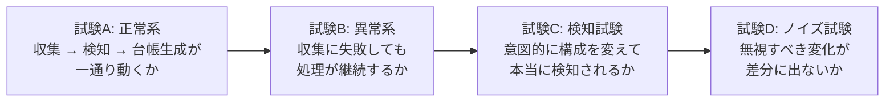
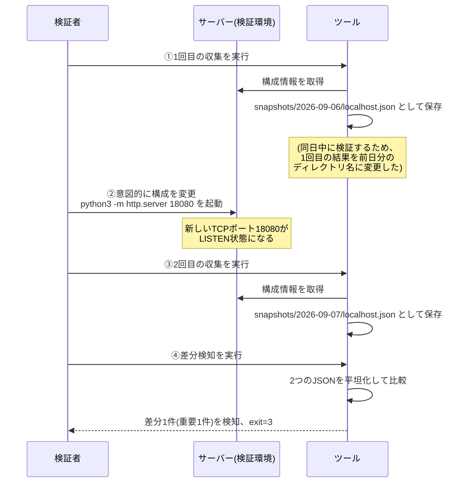
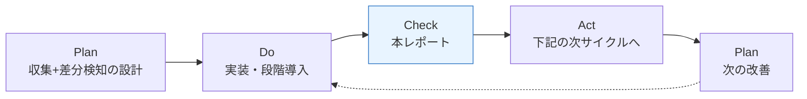
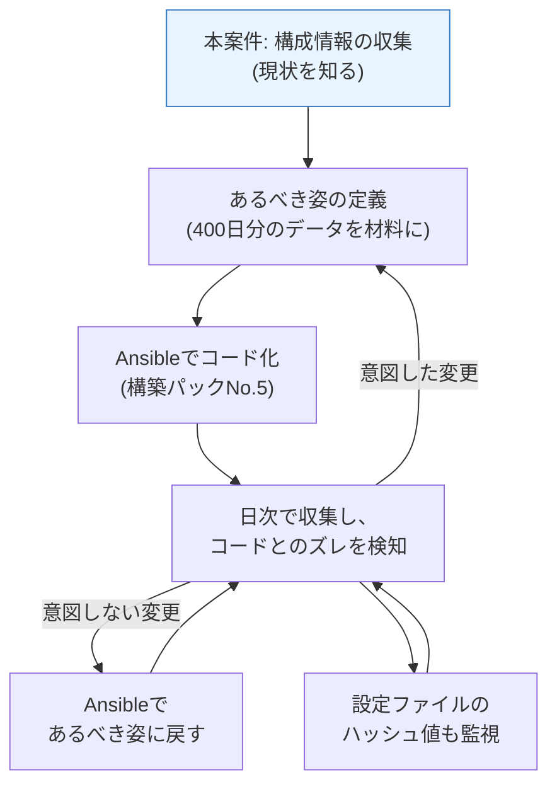

# 効果測定レポート — 構成情報の自動収集・差分検知

> **注意: この案件は架空の設定である。** 株式会社サンプル商事は実在しない。本書の数値には次の2種類があり、表記で明確に区別している。
>
> | 表記 | 意味 |
> |---|---|
> | 🟢 **【実測】** | 手元の検証環境で実際に実行して測定した値 |
> | 📊 **【試算】** | 架空の依頼設定([01-current-analysis.md](./01-current-analysis.md))に基づく想定シナリオ上の計算値。実在企業での実測値ではない |
>
> **「架空の案件として自分で設計し、検証環境で実測した」**というのが本ドキュメントの正確な位置づけである。

## 1. 測定の前提条件

### 1-1. 検証環境

| 項目 | 内容 |
|---|---|
| OS | Ubuntu 24.04.4 LTS |
| シェル | GNU bash 5.2.21 |
| jq | jq-1.7 |
| shellcheck | 0.9.0 |
| 収集対象 | **1台**(ローカルモード。自分自身を対象に収集) |
| 収集方式 | `transport=local`(SSHを介さず、同一マシン上で `remote_probe.sh` を実行) |

### 1-2. 検証環境の制約(正直に書いておくべきこと)

| 制約 | 影響 | 本書での扱い |
|---|---|---|
| **SSH接続できる対象サーバーを用意していない** | SSH越しの収集時間・接続失敗時の挙動を、6台構成では測っていない | 収集ロジックはローカルモードで実測。SSH部分は「接続不能アドレスへの接続」で失敗系のみ実測。**6台での所要時間は試算として扱う** |
| 検証環境に systemd / `ip` / `ss` が無い | 起動中サービス・IPアドレス・待受ポートの一部が、フォールバック経路で取得された | **これ自体が「取得できない環境での挙動」の検証になった**(`collect_note` が正しく記録されることを確認) |
| 収集対象が1台のみ | 複数台での並行動作・6台分の処理時間は未検証 | 1台の実測値からの掛け算による試算として明示 |
| 長期運用をしていない | 400日分の容量増加・実運用でのノイズ量は未検証 | 1ファイルの実測サイズからの試算として明示 |

> **なぜ制約を先に書くのか**: 効果測定レポートで最も価値があるのは「どこまで確かめられて、どこからが推定か」を読み手が判断できることである。都合の悪い制約を隠すと、レポート全体の信頼性が失われる。

## 2. Before / After 定量比較

### 2-1. 主要指標

| # | 指標 | 改善前(As-Is) | 改善後(To-Be) | 効果 | 根拠 |
|---|---|---|---|---|---|
| 1 | 棚卸しの作業時間 | **8時間/四半期** | **0分**(人手なし) | **年32時間の削減** | 📊【試算】 |
| 2 | 年間の棚卸し工数 | **32時間/年** | 0時間/年 | 100%削減 | 📊【試算】 |
| 3 | 乖離の発見までの時間 | **最大3ヶ月** | **翌日** | 最大約90日 → 1日 | 📊【試算】(日次実行の論理的帰結) |
| 4 | 台帳情報の鮮度 | 最大3ヶ月前 | 前日 | 同上 | 📊【試算】 |
| 5 | 変更履歴の追跡 | **追跡不可** | **日次スナップショットで追跡可能** | 定性的な質の変化 | 🟢【実測】3層の履歴が生成されることを確認 |
| 6 | 転記ミスの発生余地 | あり(人が手入力) | **なし**(人が値を打つ工程が存在しない) | 定性的な質の変化 | 🟢【実測】 |
| 7 | 対象サーバー数 | 6台 | 6台 | 変化なし(設定1行で増減可) | - |
| 8 | 1台追加時の追加作業 | **80分/回 × 年4回 = 年320分** | **設定ファイルに1行追加(約1分・初回のみ)** | 拡張性の質的な改善 | 📊【試算】 |

### 2-2. 作業時間の内訳比較

| 工程 | 改善前(1台あたり) | 改善後 |
|---|---|---|
| サーバーへのログイン・作業準備 | 5分 | 0分(自動) |
| OS・カーネル・ホスト名の確認 | 10分 | 0分(自動) |
| ディスク使用状況の確認 | 5分 | 0分(自動) |
| インストール済みパッケージの確認 | 10分 | 0分(自動) |
| 起動中サービスの確認 | 10分 | 0分(自動) |
| ユーザー一覧・sudo権限の確認 | 10分 | 0分(自動) |
| 開放ポートの確認 | 10分 | 0分(自動) |
| **Excelへの転記** | **15分** | **0分(台帳が自動生成される)** |
| 台帳との突き合わせ・差異のメモ | 5分 | 0分(差分レポートが自動生成される) |
| **合計** | **80分 × 6台 = 8時間** | **0分** |
| 代わりに発生する作業 | - | **差分レポートを読む時間(差分が出た日のみ、数分)** |

> 📊【試算】。改善後に完全にゼロになるわけではなく、「**差分が出た日にレポートを読み、意図した変更かを判断する**」という作業が新たに発生する。ただしこれは棚卸しの代替ではなく、**改善前には存在しなかった価値のある作業**(セキュリティ上の変更確認)である。

### 2-3. 処理時間の実測

🟢 **【実測】** 検証環境(ローカルモード・1台)で測定した各工程の所要時間。

| 工程 | 実測値 | 測定方法 |
|---|---|---|
| `remote_probe.sh` 単体(構成情報の取得) | **0.088〜0.095秒**(3回測定) | `date +%s.%N` による前後差分 |
| `collect_inventory.sh`(取得+JSON変換+保存) | **0.137秒** | 同上 |
| `detect_drift.sh`(平坦化+比較+レポート生成) | **0.056秒** | 同上 |
| `generate_ledger.sh`(台帳2種の生成) | **0.044秒** | 同上 |
| **1台あたり合計** | **約0.24秒** | 上記の合計 |

📊【試算】6台構成での想定所要時間:

| 内訳 | 計算 | 結果 |
|---|---|---|
| 収集処理そのもの | 0.14秒 × 6台 | 約0.9秒 |
| SSH接続のオーバーヘッド | 一般に1〜2秒/台と見込む × 6台 | 約6〜12秒 |
| 差分検知 + 台帳生成 | 0.06秒 + 0.04秒(台数に比例するが軽微) | 約1秒 |
| **合計** | | **約10〜15秒** |

> **SSH接続のオーバーヘッドは実測していない**ため、一般的な値からの見積もりである。仮に3倍かかったとしても1分未満であり、**日次バッチとして何ら問題のない水準**と判断できる。

### 2-4. 保存容量の実測と試算

| 項目 | 値 | 種別 |
|---|---|---|
| スナップショット1ファイルのサイズ | **1,728バイト(約1.7KB)** | 🟢【実測】 |
| 1日あたり(6台) | 1.7KB × 6 = 約10KB | 📊【試算】 |
| 保持期間400日分 | 10KB × 400日 = **約4MB** | 📊【試算】 |

> 4MBは現代のサーバーでは無視できる容量である。**「変更履歴を1年以上保持する」という要件が、容量の心配なく満たせる**ことが確認できた。

## 3. 測定方法と検証試験

### 3-1. 検証の考え方

「動くはず」ではなく「動くことを確認した」状態にするため、次の3種類の試験を行った。



**最も重要なのは試験C・Dである。** 「差分検知ツールを作りました」と言っても、**実際に構成を変えて検知されることを確認していなければ、動作を保証したことにはならない。**

### 3-2. 試験結果一覧

| # | 試験名 | 内容 | 期待結果 | 実測結果 | 判定 |
|---|---|---|---|---|---|
| TC-01 | 静的解析 | 全スクリプトを `shellcheck -S warning` にかける | 警告0件 | 終了コード0、警告0件 | 🟢 合格 |
| TC-02 | 収集(正常系) | ローカルモードで収集を実行 | JSONスナップショットが生成される | 1,728バイトのJSONを生成。`status: "ok"` | 🟢 合格 |
| TC-03 | 取得不能項目の記録 | systemd等が無い環境で収集 | 取得できない項目が `notes` に記録される | `ip` / `service` / `port` の3件が `collect_note` として記録された | 🟢 合格 |
| TC-04 | 収集(異常系) | 到達できないアドレス(192.0.2.99)を対象に含める | 1台が失敗しても残りは継続。終了コード2 | 1台目は成功、2台目は失敗を記録。`exit=2` | 🟢 合格 |
| TC-05 | 失敗の記録 | 上記失敗時のスナップショット | `status: "error"` のJSONが残る | `status: "error"` / `notes: [{item: "collect", reason: "probe_failed"}]` を確認 | 🟢 合格 |
| TC-06 | 初回実行 | 比較対象が無い状態で差分検知 | 「基準として登録」となり差分0件、終了コード0 | ログに「前回スナップショットなし。基準として登録しました」。`exit=0` | 🟢 合格 |
| TC-07 | **検知試験(実変更)** | **実際にサーバー上でポート18080を待ち受け**、その前後で収集・比較 | `ports[18080]` の追加が重要度「高」で検知される | **差分1件・重要1件を検知。`exit=3`** | 🟢 合格 |
| TC-08 | **変更種別の判定** | 変更・追加・削除の3種類を含むスナップショットを比較 | それぞれ「変更」「追加」「削除」と正しく分類される | 6件すべて正しく分類(下記3-4) | 🟢 合格 |
| TC-09 | **ノイズ除外** | ディスク使用率を 22% → 45% に変えて比較 | 差分として**出ない** | `disks[*].used_percent` は差分に一切出なかった | 🟢 合格 |
| TC-10 | 台帳生成 | Markdown / CSV の台帳を生成 | 一覧・詳細・変更履歴を含む台帳が生成される | 3セクションを含む `ledger.md` と `ledger.csv` を生成 | 🟢 合格 |
| TC-11 | 日次バッチ | `run_daily.sh` で3工程を一括実行 | 収集 → 検知 → 台帳生成が順に実行される | 3工程が順に実行され、`exit=3`(差分検知)を返した | 🟢 合格 |
| TC-12 | 単一台指定 | `--target` オプションで1台だけ収集 | 指定した台のみ処理される | 「対象 1 台」と表示され、他の台は処理されなかった | 🟢 合格 |

### 3-3. TC-07: 意図的に設定を変えて差分が検知されることを確認する試験(詳細)

**この試験が本改善の核心である。** 手順は次のとおり。



> **試験手順に関する正直な注記**: 本来この比較は「昨日と今日」で行われるが、検証は同日中に実施したため、**1回目の収集結果を保存したディレクトリ名を前日の日付に変更して比較元とした**。比較ロジックそのものは日付ディレクトリ名を辞書順に並べて選ぶだけなので、この操作によって検証の妥当性は損なわれない。

**①の時点(変更前)の待受ポート**

```json
"ports": [2024, 2025, 36191, 39221]
```

**②の変更操作**

```bash
python3 -m http.server 18080 --bind 127.0.0.1 &
```

**③の時点(変更後)の待受ポート**

```json
"ports": [2024, 2025, 18080, 36191, 39221]
```

**④の検知結果** 🟢【実測】

```text
2026-09-07 04:38:36 [INFO] ===== 差分検知を開始します (2026-09-06 -> 2026-09-07) =====
2026-09-07 04:38:36 [WARN] [localhost] 差分 1 件(うち重要 1 件)を検知しました
2026-09-07 04:38:36 [INFO] 差分レポートを出力しました: .../reports/drift-2026-09-07.md
2026-09-07 04:38:36 [INFO] ===== 差分検知終了: 差分 1 件 / 重要 1 件 =====
exit=3
```

生成されたレポート:

```markdown
| サーバー | 判定 | 差分件数 | うち重要 |
|---|---|---|---|
| localhost | 差分あり | 1 | 1 |

### localhost

| 項目 | 変更種別 | 変更前 | 変更後 | 重要度 |
|---|---|---|---|---|
| `ports[18080]` | 追加 | - | listen | 高 |
```

**この試験が示していること**

| 確認できたこと | 実務上の意味 |
|---|---|
| 実際のサーバー上の変更が検知された | [01-current-analysis.md](./01-current-analysis.md) の食い違い「検証用に開けたポートが開きっぱなし(2件)」を、**翌日に検知できる**ことを示している |
| ポート番号そのものが鍵になっている | `ports[18080]` という表記で、何番が開いたのかが一目で分かる |
| 重要度「高」として分類された | 大量の差分に埋もれず、優先して確認すべきものとして提示される |
| 終了コード3で終了した | 他のツールやcronから「差分あり」を機械的に判定できる |

### 3-4. TC-08 / TC-09: 変更種別の判定とノイズ除外(詳細)

**試験方法**: 前日のスナップショットに対して、次の6種類の変化を加えたスナップショットを作成し、比較した。

| 加えた変化 | 期待する分類 | 期待する重要度 |
|---|---|---|
| カーネル版数を `6.18.44` → `6.18.45` に変更 | 変更 | 中 |
| `curl` のバージョンを変更 | 変更 | 高 |
| ポート18080を削除(待受を停止した想定) | 削除 | 高 |
| `sudoers` に `deploy` を追加 | 追加 | 高 |
| `users` に `deploy`(UID 1001)を追加 | 追加 | 高 |
| **ディスク使用率を 22% → 45% に変更** | **差分として出ないこと** | - |

🟢 **【実測】結果**

```text
2026-09-07 04:38:46 [WARN] [localhost] 差分 6 件(うち重要 5 件)を検知しました
exit=3
```

```markdown
| 項目 | 変更種別 | 変更前 | 変更後 | 重要度 |
|---|---|---|---|---|
| `kernel` | 変更 | 6.18.44-fc-v24 | 6.18.45-fc-v24 | 中 |
| `packages[curl]` | 変更 | 8.5.0-2ubuntu10.8 | 8.5.0-2ubuntu10.9 | 高 |
| `ports[18080]` | 削除 | listen | - | 高 |
| `sudoers[deploy]` | 追加 | - | yes | 高 |
| `users[deploy].shell` | 追加 | - | /bin/bash | 高 |
| `users[deploy].uid` | 追加 | - | 1001 | 高 |
```

| 検証項目 | 結果 |
|---|---|
| 「変更」の判定 | 🟢 kernel・packages[curl] が正しく「変更」と分類された |
| 「追加」の判定 | 🟢 sudoers[deploy]・users[deploy] が正しく「追加」と分類された |
| 「削除」の判定 | 🟢 ports[18080] が正しく「削除」と分類された |
| 重要度の判定 | 🟢 ユーザー・sudo・ポート・パッケージが「高」、カーネルが「中」 |
| **ノイズ除外** | 🟢 **ディスク使用率(22→45)は差分に一切出なかった** |

> **TC-09の意味**: ディスク使用率が差分に出てしまうと、**毎日必ず全台で差分が発生する**。6台なら毎日18件(3マウント × 6台)の無意味な通知が飛び、[02-improvement-proposal.md](./02-improvement-proposal.md) R6 の「アラート疲れ」がそのまま現実になる。この試験は、**ツールが実運用に耐えるかどうかを分ける試験**である。

### 3-5. TC-04 / TC-05: 収集失敗時の挙動(詳細)

**試験方法**: 到達できないIPアドレス(`192.0.2.99` — RFC 5737でドキュメント用に予約されたアドレス)を対象に含めて収集を実行した。

🟢 **【実測】結果**

```text
2026-09-07 04:59:11 [INFO] [localhost] 収集開始 (transport=local, address=-)
2026-09-07 04:59:11 [WARN] [localhost] 収集完了(ただし取得できなかった項目が 3 件あります)
2026-09-07 04:59:11 [INFO] [web99] 収集開始 (transport=ssh, address=invadmin@192.0.2.99)
2026-09-07 04:59:14 [ERROR] [web99] 収集に失敗しました(SSH接続不可・タイムアウト等)
2026-09-07 04:59:14 [INFO] ===== 収集終了: 対象 2 台 / 成功 1 台 / 失敗 1 台 =====
exit=2
```

| 確認項目 | 期待 | 実測 |
|---|---|---|
| 1台の失敗で全体が止まらないか | 残りの台の収集は継続する | 🟢 継続した |
| 入力待ちで固まらないか | `BatchMode=yes` により即座に失敗する | 🟢 3秒(`ConnectTimeout=3` の設定値)で失敗した |
| 失敗が記録に残るか | `status: "error"` のJSONが保存される | 🟢 保存された |
| 終了コードで判別できるか | 2(一部失敗)が返る | 🟢 `exit=2` |

> **この試験の重要性**: 6台構成では「1台がメンテナンス中で落ちている」ことが日常的に起きる。そのたびに全体が止まって台帳が更新されないのでは、実運用に耐えない。**「一部失敗しても、できる範囲で仕事を終える」**という設計([02-improvement-proposal.md](./02-improvement-proposal.md) R8)が実際に機能することを確認した。

## 4. 達成できたこと

| # | 項目 | 内容 | 根拠 |
|---|---|---|---|
| 1 | **棚卸し作業の完全自動化** | 収集・比較・台帳生成のすべてが人手なしで実行される | 🟢 TC-11(`run_daily.sh` で3工程が一括実行) |
| 2 | **乖離の早期発見** | 日次実行により、最大3ヶ月 → 翌日に短縮 | 📊 日次実行の論理的帰結 + 🟢 TC-07(実変更の検知) |
| 3 | **セキュリティ関連の変更を優先表示** | ユーザー・sudo・ポート・パッケージを重要度「高」に分類 | 🟢 TC-08 |
| 4 | **変更履歴の追跡** | 日付スナップショット・日次レポート・履歴CSVの3層で追跡可能に | 🟢 TC-10 で3層すべての生成を確認 |
| 5 | **転記ミスの排除** | 人が値を入力する工程が存在しない | 🟢 設計上、自明 |
| 6 | **ノイズ対策の実効性** | 毎日変わる値を差分から除外できる | 🟢 TC-09 |
| 7 | **障害耐性** | 1台の収集失敗が全体を止めない | 🟢 TC-04 |
| 8 | **安全性(読み取り専用)** | 対象サーバーの状態を一切変更しない | 🟢 収集コマンドはすべて参照系のみ([03-design.md](./03-design.md) 4-1) |
| 9 | **学習環境での再現性** | SSH先が無くてもローカルモードで全機能を試せる | 🟢 本レポートの測定自体がローカルモードで実施 |

## 5. 達成できなかったこと・確認できなかったこと

**正直に書くべき項目である。** できたことだけを並べたレポートは、読み手に「都合の悪いことを隠しているのでは」と思わせる。

| # | 項目 | 状況 | 理由 | 影響 |
|---|---|---|---|---|
| 1 | **6台構成での実測** | ❌ 未実施 | 検証環境にSSH接続できるサーバーを用意していない | 6台での所要時間は試算にとどまる。ただし1台0.24秒の実測から、ボトルネックはSSH接続時間だと判断できる |
| 2 | **SSH越しの正常系収集** | ❌ 未実施 | 同上(失敗系のみ実測) | `BatchMode=yes` などのオプションの効果は、失敗時の挙動でのみ確認 |
| 3 | **Slack通知の実送信** | ❌ 未実施 | Webhook URLをリポジトリに含めない方針のため | 通知処理は `ENABLE_SLACK_NOTIFY=false` の分岐が動くことのみ確認 |
| 4 | **長期運用でのノイズ量** | ❌ 未検証 | 数日以上の連続運用をしていない | 実環境では、既定の無視パターン以外にも調整が必要になる可能性が高い([04-build-guide.md](./04-build-guide.md) ステップ9で対応手順を用意) |
| 5 | **400日分の容量増加** | ❌ 未検証 | 同上 | 1ファイルの実測サイズからの試算(約4MB)にとどまる |
| 6 | **「台帳が信用されるようになったか」** | ❌ 測定不能 | 定性的な指標であり、実際の利用者がいない | **本改善の真の目的だが、架空案件では測りようがない**。この点は正直に認めるべき |
| 7 | **systemd環境での起動中サービス収集** | ⚠️ 部分的 | 検証環境に systemd が無かった | フォールバック経路(`collect_note` の記録)は確認できたが、`systemctl` からの正常取得は未確認 |
| 8 | **RHEL系(rpm)での収集** | ❌ 未検証 | 検証環境がUbuntuのみ | `rpm -q` の分岐は実装済みだが未実行。実環境で使う前に確認が必要 |

> **項目6について**: 「乖離の発見まで3ヶ月 → 翌日」という効果は、**日次で実行される限り論理的に成立する**。しかし、「実際に運用担当者が毎朝レポートを読み、対応するようになったか」という**組織的な定着**は、ツールを作っただけでは達成できない。これは改善案件の限界であり、実務では「レポートを読む運用を定着させる」ところまでが本当の改善になる。

## 6. 残課題と次の改善サイクル

改善は1回で終わらない。**PDCAのC(Check)を経て、次のP(Plan)につなげる。**



### 6-1. 短期(次の1サイクル)

| # | 課題 | 対応案 | 優先度 |
|---|---|---|---|
| 1 | 6台構成・SSH越しでの実測が未実施 | 検証用サーバーを2台用意し、SSH経由の収集を実測する。所要時間・ノイズの実態を確認 | **高** |
| 2 | 実運用でのノイズ量が不明 | 1台で2週間運用し、毎日出る差分を洗い出して無視パターンを調整する([04-build-guide.md](./04-build-guide.md) ステップ9) | **高** |
| 3 | 差分レポートを読む運用が定着するか不明 | 毎朝のSlack通知に加え、週次で「今週の重要度『高』差分まとめ」を送る仕組みを検討 | 中 |
| 4 | RHEL系での動作が未確認 | AlmaLinuxの検証機で `rpm -q` 経路を確認する | 中 |

### 6-2. 中期(仕組みの拡張)

| # | 課題 | 対応案 | 関連 |
|---|---|---|---|
| 5 | **設定ファイルの中身の変更を検知できない** | `nginx.conf` などの重要ファイルの**ハッシュ値(内容の指紋)だけ**を収集し、変化を検知する。中身は集めないので機微情報の集約リスクがない | [02-improvement-proposal.md](./02-improvement-proposal.md) スコープ外#2 |
| 6 | **検知したズレを直す手段がない** | 「あるべき姿」を定義し、Ansible([構築パック案件No.5](../../projects/05-ansible-provisioning/README.md))のPlaybookとしてコード化する。**本案件で集めた400日分のスナップショットが、その定義の材料になる** | 同 スコープ外#1 |
| 7 | 台帳そのものの変更履歴がGitに残っていない | `reports/` をGitリポジトリにし、週次でコミットする。GitHub Actions([構築パック案件No.6](../../projects/06-cicd-pipeline/README.md))と組み合わせれば、差分をPull Requestとして提示することも可能 | [src/crontab.example](./src/crontab.example) に例を記載 |
| 8 | 収集項目が固定的 | 「このサーバーだけ追加でこの項目を取りたい」という要求に対応するため、`targets.conf` に項目上書きの列を追加する | - |

### 6-3. 長期(あるべき運用像)



**現在地は図の一番上である。** 本案件は「現状を知る」段階を実現したにすぎない。しかし、**この段階なしには次に進めない**というのが、[02-improvement-proposal.md](./02-improvement-proposal.md) 第4章で述べた「Ansibleを第一選択にしなかった理由」の本質である。

## 7. 効果測定のまとめ

| 観点 | 結論 |
|---|---|
| 定量効果(試算) | 棚卸し 年32時間 → 0時間。乖離の発見 最大3ヶ月 → 翌日 |
| 定量効果(実測) | 1台あたりの処理時間 約0.24秒、スナップショット1件 1.7KB |
| 機能の検証 | 12件の試験項目すべて合格。**特に「実際に構成を変えて検知されること」を実測で確認** |
| ノイズ対策 | ディスク使用率の変化が差分に出ないことを実測で確認 |
| 障害耐性 | 1台の収集失敗で全体が止まらないことを実測で確認 |
| 未確認の領域 | 6台構成・SSH越しの正常系・長期運用・Slack実送信・RHEL系 |
| 最大の限界 | **「台帳が信用されるようになったか」という真の目的は、架空案件では測定できない** |
| 次のステップ | 実環境での2週間運用によるノイズ調整 → あるべき姿の定義 → Ansible適用 |

→ 実運用で問題が起きたときは [06-troubleshooting.md](./06-troubleshooting.md) を参照。
