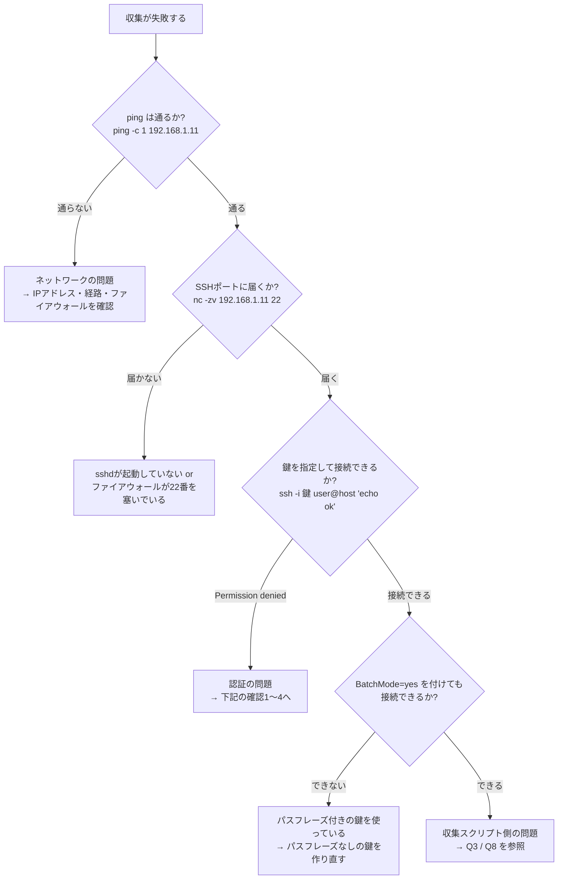
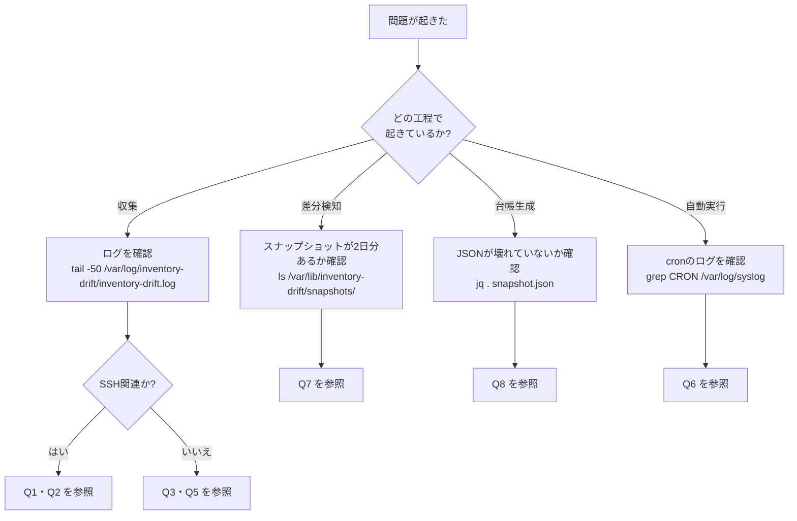

# トラブルシューティング集 — 構成情報の自動収集・差分検知

> **注意: この案件は架空の設定である。** 手順中のIPアドレス・サーバー名は架空の想定環境のものである。エラーメッセージのうち、🟢【実測】と付いたものは手元の検証環境で実際に再現させて取得したものである。

## 目次

| Q | 症状 | 分類 |
|---|---|---|
| [Q1](#q1-ssh接続に失敗する) | SSH接続に失敗する / 収集がすべて失敗する | SSH |
| [Q2](#q2-スクリプトが入力待ちのまま止まる) | スクリプトが入力待ちのまま止まる・cronのプロセスが溜まる | SSH |
| [Q3](#q3-特定の項目だけ取得できない) | 特定の項目だけ取得できない(`collect_note` が出る) | 収集 |
| [Q4](#q4-毎日同じ差分が出続けて通知がうるさい) | 毎日同じ差分が出続けて通知がうるさい | 差分検知 |
| [Q5](#q5-jq-がない環境で動かしたい--jq-command-not-found) | `jq` がない環境で動かしたい / `jq: command not found` | 依存関係 |
| [Q6](#q6-手で実行すると動くのに-cron-だと動かない) | 手で実行すると動くのに cron だと動かない | cron |
| [Q7](#q7-差分がまったく検知されない) | 差分がまったく検知されない | 差分検知 |
| [Q8](#q8-jq-がエラーを出してレポートが途中で切れる) | `jq` がエラーを出してレポートが途中で切れる | jq |
| [Q9](#q9-スナップショットが増え続けてディスクを圧迫する) | スナップショットが増え続けてディスクを圧迫する | 運用 |
| [Q10](#q10-台帳を手で直したのに元に戻ってしまう) | 台帳を手で直したのに元に戻ってしまう | 仕様 |

---

## Q1. SSH接続に失敗する

### 症状

収集がすべて失敗し、次のようなログが出る。

🟢【実測】

```text
2026-09-07 04:59:11 [INFO] [web99] 収集開始 (transport=ssh, address=invadmin@192.0.2.99)
2026-09-07 04:59:14 [ERROR] [web99] 収集に失敗しました(SSH接続不可・タイムアウト等)
2026-09-07 04:59:14 [INFO] ===== 収集終了: 対象 2 台 / 成功 1 台 / 失敗 1 台 =====
```

ログファイル(`inventory-drift.log`)には、SSHが出した詳細メッセージも記録される。

🟢【実測】

```text
Warning: Identity file /home/invadmin/.ssh/id_ed25519_inventory not accessible: No such file or directory.
ssh: connect to host 192.0.2.99 port 22: Connection timed out
```

### 原因の切り分け手順

**いきなり設定を変えず、どこで失敗しているかを1段ずつ確認する。** ネットワーク → 認証 → 権限、の順に切り分けるのが定石である。



### 確認1: 手動でSSH接続してみる

```bash
sudo -u invadmin ssh -o BatchMode=yes -o ConnectTimeout=10 \
    -i /home/invadmin/.ssh/id_ed25519_inventory \
    invadmin@192.168.1.11 'echo ok'
```

`ok` が返れば認証は成功している。失敗する場合は `-v`(詳細表示)を付ける。

```bash
sudo -u invadmin ssh -v -o BatchMode=yes -i /home/invadmin/.ssh/id_ed25519_inventory \
    invadmin@192.168.1.11 'echo ok' 2>&1 | grep -E 'Offering|Authentications|denied'
```

⚪【出力イメージ】

```text
debug1: Offering public key: /home/invadmin/.ssh/id_ed25519_inventory ED25519 SHA256:6tQ...
debug1: Authentications that can continue: publickey
Permission denied (publickey).
```

### 確認2: 鍵ファイルのパスと権限

**最も多い原因がこれである。**

```bash
sudo ls -l /home/invadmin/.ssh/
```

| 確認点 | 正しい状態 | 間違っているとどうなるか |
|---|---|---|
| 秘密鍵が存在するか | `id_ed25519_inventory` がある | `Identity file ... not accessible` と出る(上の実測ログの1行目) |
| 秘密鍵の権限 | `600`(`-rw-------`) | SSHが「権限が緩すぎる」と判断して鍵の使用を拒否する |
| `.ssh` ディレクトリの権限 | `700`(`drwx------`) | 同上 |
| `inventory.conf` の `SSH_KEY` のパス | 実際のファイルと一致 | 存在しない鍵を指定していることになる |

```bash
# 修正する場合
sudo chmod 700 /home/invadmin/.ssh
sudo chmod 600 /home/invadmin/.ssh/id_ed25519_inventory
sudo chown -R invadmin:invadmin /home/invadmin/.ssh
```

### 確認3: 対象サーバー側の `authorized_keys`

```bash
# 対象サーバーでの作業
sudo ls -l /home/invadmin/.ssh/authorized_keys
sudo -u invadmin cat /home/invadmin/.ssh/authorized_keys
```

| 確認点 | 正しい状態 |
|---|---|
| ファイルの権限 | `600` |
| ディレクトリ `.ssh` の権限 | `700` |
| 所有者 | `invadmin:invadmin` |
| 公開鍵が**1行で**書かれているか | 改行が混入していると認証に失敗する |
| `from="..."` のIPが正しいか | 管理サーバーのIPと一致していること |

> ⚠️ **`from=` の落とし穴**: 管理サーバーが複数のIPを持っている場合や、NAT経由で接続する場合、**対象サーバーから見える接続元IP**が想定と違うことがある。対象サーバーの認証ログで実際の接続元を確認する。
>
> ```bash
> # 対象サーバーでの作業
> sudo tail -20 /var/log/auth.log | grep invadmin      # Ubuntu/Debian
> sudo tail -20 /var/log/secure  | grep invadmin       # RHEL系
> ```

### 確認4: ホスト鍵の変更

対象サーバーを再構築すると、ホスト鍵が変わる。本ツールは `StrictHostKeyChecking=accept-new` を使っているため、**「以前と鍵が変わった」場合は意図的に接続を拒否する**(なりすまし対策)。

⚪【出力イメージ】

```text
@@@@@@@@@@@@@@@@@@@@@@@@@@@@@@@@@@@@@@@@@@@@@@@@@@@@@@@@@@@
@    WARNING: REMOTE HOST IDENTIFICATION HAS CHANGED!     @
@@@@@@@@@@@@@@@@@@@@@@@@@@@@@@@@@@@@@@@@@@@@@@@@@@@@@@@@@@@
```

**正当な再構築だと確認できた場合のみ**、古い記録を削除する。

```bash
sudo -u invadmin ssh-keygen -R 192.168.1.11
```

> ⚠️ **心当たりがない場合は絶対に削除しないこと。** ホスト鍵の変更は、通信経路上で偽サーバーに接続させられている(中間者攻撃)可能性を示している。まずサーバー管理者に確認する。

---

## Q2. スクリプトが入力待ちのまま止まる

### 症状

- 収集が終わらない。`ps` を見ると `ssh` プロセスが残り続けている
- cronで毎日実行するうちに、`ssh` プロセスが何十個も溜まっている

```bash
ps -ef | grep '[s]sh -o BatchMode'
```

⚪【出力イメージ】

```text
invadmin  1234     1  0 Sep05 ?  00:00:00 ssh -o BatchMode=yes ... invadmin@192.168.1.31
invadmin  2345     1  0 Sep06 ?  00:00:00 ssh -o BatchMode=yes ... invadmin@192.168.1.31
invadmin  3456     1  0 Sep07 ?  00:00:00 ssh -o BatchMode=yes ... invadmin@192.168.1.31
```

### 原因

**非対話実行(=人が画面の前にいない実行)の設定が抜けている**ときに起きる、最も危険な症状である。

| 抜けている設定 | 何が起きるか |
|---|---|
| `-o BatchMode=yes` | パスワードやパスフレーズを聞かれ、**誰も答えないので永久に待ち続ける** |
| `-o ConnectTimeout=N` | 応答のないサーバーに対して、SSHの既定値(数十秒〜)待ち続ける |
| `timeout` コマンド | 接続後に対象サーバーが高負荷で応答を返さない場合、やはり止まる |
| `-o StrictHostKeyChecking=accept-new` | 初回接続で「本当に接続しますか? (yes/no)」と聞かれる。`BatchMode=yes` があれば止まらずに失敗するが、無いと止まる |

### 対処

本ツールの `collect_inventory.sh` には、これら4つがすべて実装済みである。改造した場合は削っていないか確認する。

```bash
grep -n 'BatchMode\|ConnectTimeout\|StrictHostKey\|timeout' /opt/inventory-drift/collect_inventory.sh
```

⚪【出力イメージ】

```text
143:            timeout "$SSH_COMMAND_TIMEOUT" \
144:                ssh -o BatchMode=yes \
145:                    -o ConnectTimeout="$SSH_CONNECT_TIMEOUT" \
146:                    -o StrictHostKeyChecking=accept-new \
```

溜まったプロセスを掃除する。

```bash
pkill -u invadmin -f 'ssh -o BatchMode'
```

タイムアウト値は設定ファイルで調整できる。

```bash
# inventory.conf
SSH_CONNECT_TIMEOUT=10     # 接続確立の上限秒数
SSH_COMMAND_TIMEOUT=60     # 収集処理全体の上限秒数
```

> 💡 **考え方**: 自動実行される処理では、**「失敗する」よりも「終わらない」ほうがずっと厄介**である。失敗はログに残り通知できるが、終わらないプロセスは静かに溜まっていく。**必ず上限時間を設ける**のが鉄則である。

---

## Q3. 特定の項目だけ取得できない

### 症状

収集は成功するが、警告が出る。

🟢【実測】

```text
2026-09-07 04:35:05 [WARN] [localhost] 収集完了(ただし取得できなかった項目が 3 件あります)
```

JSONを見ると `notes` に理由が記録されている。

🟢【実測】

```json
"notes": [
  { "item": "ip", "reason": "ip_command_missing_used_hostname" },
  { "item": "service", "reason": "systemd_unavailable" },
  { "item": "port", "reason": "used_proc_net_tcp_fallback" }
]
```

### `reason` の一覧と対処

| `reason` | 意味 | 対処 |
|---|---|---|
| `no_etc_os_release` | `/etc/os-release` が読めない | 非常に古いディストリビューションの可能性。`/etc/redhat-release` などを見る改造が必要 |
| `fqdn_unresolved` | `hostname -f` が失敗し、短いホスト名で代用した | `/etc/hosts` にFQDNの記載がない。**多くの場合は問題ないが、DNS設定を見直す機会になる** |
| `ip_command_missing_used_hostname` | `ip` コマンドが無く、`hostname -I` で代用した | `sudo apt install iproute2` で改善できる。代用でも値は取れている |
| `unavailable`(ip) | IPアドレスをどの方法でも取得できなかった | `iproute2` パッケージを導入する |
| `df_failed:<マウント>` | そのマウントポイントで `df` が失敗した | `inventory.conf` の `DISK_MOUNTS` から、存在しないマウントポイントを削除する |
| `no_package_manager` | `dpkg-query` も `rpm` も無い | Alpine Linux などの場合。`apk info` 対応の改造が必要 |
| **`systemd_unavailable`** | **systemdが動いていない(コンテナ環境など)** | サービス一覧は取得できない。**コンテナが対象なら仕様として受け入れる** |
| `used_proc_net_tcp_fallback` | `ss` も `netstat` も無く、`/proc/net/tcp` から読み取った | `sudo apt install iproute2` で `ss` が使えるようになる。フォールバックでも値は取れている |
| `unavailable`(port) | ポート情報をどの方法でも取得できなかった | `/proc` がマウントされていない特殊な環境。要調査 |

### 「権限不足で取得できない」場合の考え方

本ツールの収集項目は、**すべて一般ユーザー権限で取得できるように選定してある**([03-design.md](./03-design.md) 4-1)。したがって「権限不足で取れない」ことは、通常は起きない。

もし独自に収集項目を追加して権限不足になった場合、**対処は3択**である。

| 選択肢 | 評価 |
|---|---|
| (a) 収集用ユーザーに `sudo` を付ける | **✕ 推奨しない。** 最小権限の原則が崩れ、鍵の漏洩リスクが跳ね上がる |
| (b) `sudoers` で**そのコマンドだけ**パスワードなし実行を許可する | △ どうしても必要な場合の次善策。`invadmin ALL=(root) NOPASSWD: /usr/sbin/ss -tlnp` のように、**コマンドと引数まで固定**して許可する |
| (c) **その項目を収集対象から外す** | **○ まず検討すべき選択肢。** 「あると便利」程度の項目のために権限を広げるのは割に合わない |

> 💡 **考え方**: セキュリティ設計では「取れる情報を最大化する」のではなく、「**必要な情報を、最小の権限で取る**」のが正しい。取れない項目があったら、まず「本当に必要か」を問い直す。

---

## Q4. 毎日同じ差分が出続けて通知がうるさい

### 症状

毎朝Slackに通知が来るが、中身は毎回同じような内容である。

⚪【出力イメージ】

```markdown
| 項目 | 変更種別 | 変更前 | 変更後 | 重要度 |
|---|---|---|---|---|
| `disks[/var].used_percent` | 変更 | 61 | 63 | 中 |
| `disks[/].used_percent` | 変更 | 22 | 23 | 中 |
```

### 原因

**「毎回変わるが、それは異常ではない」値**を差分として扱っている。これを放置すると、本当に見るべき変更が埋もれ、そのうち誰も通知を見なくなる(アラート疲れ)。

### 対処1: 毎日出る差分を洗い出す

```bash
grep -h '^| `' /opt/inventory-drift/reports/drift-*.md \
    | awk -F'|' '{print $2}' | sort | uniq -c | sort -rn | head
```

⚪【出力イメージ】

```text
      7  `disks[/var].used_percent`
      6  `disks[/].used_percent`
      3  `ports[41235]`
      1  `packages[nginx]`
```

`ports[41235]` のように、**毎回番号が変わる高位ポート**(一時的な通信で使われるポート)もノイズ源になりやすい。

### 対処2: 無視パターンに追加する

```bash
sudo -u invadmin vi /opt/inventory-drift/inventory.conf
```

```bash
# 変更前(既定値)
DRIFT_IGNORE_PATTERN='^disks\[[^]]*\]\.used_percent=|^collected_at='

# 変更後: 30000番以上の高位ポートも除外する
DRIFT_IGNORE_PATTERN='^disks\[[^]]*\]\.used_percent=|^collected_at=|^ports\[[3-9][0-9]{4}\]='
```

### 対処3: 除外が効いているか確認する

**設定を変えたら、必ず効果を確認する。** 過去の2日を指定して再実行すれば、通知を出さずに検証できる。

```bash
sudo -u invadmin /opt/inventory-drift/detect_drift.sh \
    --previous 2026-09-05 --current 2026-09-06
```

🟢【実測】検証環境では、ディスク使用率を 22% → 45% に変えたスナップショットを比較しても、`disks[*].used_percent` は差分として一切出力されなかった(他の5種類の変更は正しく検知された)。

> ⚠️ **除外しすぎに注意**
> 「うるさいから」という理由で `packages` を丸ごと除外すると、**脆弱性対応の追跡ができなくなる**。除外を追加する前に、必ず次を自問すること。
>
> **「この差分を見逃したら困る場面はあるか?」**
>
> 困る場面が思いつくなら、除外ではなく**重要度の調整**(`DRIFT_CRITICAL_PATTERN` から外して「中」にする)で対応する。

---

## Q5. `jq` がない環境で動かしたい / `jq: command not found`

### 症状

🟢【実測】

```text
[ERROR] jq が見つかりません。'sudo apt install jq' でインストールしてください
```

### 原因と対処の切り分け

**まず「どこに `jq` が必要か」を正しく理解する。**

| 場所 | `jq` は必要か | 理由 |
|---|---|---|
| **管理サーバー** | **必要** | JSONの生成・比較・台帳出力をすべてここで行う |
| **収集対象サーバー(6台)** | **不要** | `remote_probe.sh` はタブ区切りテキスト(TSV)を出すだけで、JSONを扱わない |

これは意図した設計である([03-design.md](./03-design.md) 4-4)。**対象サーバーに何もインストールしなくてよい**ようにするため、あえて中間形式をTSVにしている。

### 対処1: 管理サーバーにインストールする

```bash
# Ubuntu / Debian系
sudo apt update && sudo apt install -y jq

# RHEL / AlmaLinux系
sudo dnf install -y jq

# 確認
jq --version
```

🟢【実測】

```text
jq-1.7
```

### 対処2: インターネットに接続できない管理サーバーの場合

`jq` は単一バイナリで動作するため、別のマシンでダウンロードして配置するだけで使える。

```bash
# 配置後
sudo mv jq-linux-amd64 /usr/local/bin/jq
sudo chmod 755 /usr/local/bin/jq
jq --version
```

### 対処3: cronからだけ「見つからない」場合

`jq --version` は動くのに、cronから実行したときだけ `command not found` になる場合は、**`jq` が無いのではなく `PATH` が通っていない**。Q6を参照。

```bash
# jq がどこにあるかを確認する
command -v jq
```

🟢【実測】

```text
/usr/bin/jq
```

`/usr/local/bin` などに置いている場合は、cronの `PATH` にそのディレクトリを含める必要がある。

---

## Q6. 手で実行すると動くのに cron だと動かない

### 症状

- 手で `./run_daily.sh` を実行すると正常に動く
- cronに登録すると、`cron.log` にエラーが出る、または何も起きない

⚪【出力イメージ】(`/var/log/inventory-drift/cron.log`)

```text
/opt/inventory-drift/collect_inventory.sh: line 91: jq: command not found
```

### 原因: cronの実行環境はログイン時と別物である

| 違い | 内容 | 対策 |
|---|---|---|
| **`PATH` が短い** | 多くの環境で `/usr/bin:/bin` のみ。`/usr/local/bin` が含まれない | crontabの先頭で `PATH` を明示する |
| **シェルが `/bin/sh`** | bash固有の書き方(`[[ ]]` や配列)が動かない | crontabの先頭で `SHELL=/bin/bash` を指定する |
| ホームディレクトリ・環境変数が違う | `~` の展開先が想定と違う | スクリプト内では**絶対パス**を使う |
| 標準出力の行き先が違う | 画面ではなくメールに送られる | `>> ログファイル 2>&1` でリダイレクトする |

### 対処: crontabの先頭に環境設定を書く

```bash
sudo -u invadmin crontab -e
```

```cron
PATH=/usr/local/sbin:/usr/local/bin:/usr/sbin:/usr/bin:/sbin:/bin
SHELL=/bin/bash

30 5 * * * /opt/inventory-drift/run_daily.sh >> /var/log/inventory-drift/cron.log 2>&1
```

### 切り分けのコツ: cronと同じ環境を再現する

`env -i`(環境変数を空にして実行)で、cronに近い状態を手元で再現できる。

```bash
sudo -u invadmin env -i /bin/bash -c '/opt/inventory-drift/run_daily.sh'
```

これで再現すれば環境変数の問題、再現しなければ別の原因(権限など)である。

### cronのログを確認する

```bash
# cron自体がスクリプトを起動したかを確認する
grep CRON /var/log/syslog | tail -5           # Ubuntu/Debian
sudo journalctl -u crond --since today        # RHEL系(systemd)
```

⚪【出力イメージ】

```text
Sep  7 05:30:01 mgmt01 CRON[12345]: (invadmin) CMD (/opt/inventory-drift/run_daily.sh >> /var/log/inventory-drift/cron.log 2>&1)
```

この行が無ければ、**そもそもcronが起動していない**(登録ミス、cronサービス停止、ユーザー違い)。この行があるのにログが空なら、スクリプト側の問題である。

> 💡 **`%` に注意**: crontabの中では `%` が改行として扱われる。`date +%F` のようなコマンドを書くときは `date +\%F` とエスケープが必要である([src/crontab.example](./src/crontab.example) に例を記載)。

---

## Q7. 差分がまったく検知されない

### 症状

サーバーの設定を変えたのに、差分レポートが「差分なし」になる。

### 確認1: そもそも比較できる状態か

🟢【実測】比較対象が無いときは、次のように出る。

```text
2026-09-07 04:59:01 [INFO] ===== 差分検知を開始します (なし -> 2026-09-07) =====
2026-09-07 04:59:01 [INFO] [localhost] 前回スナップショットなし。基準として登録しました
```

**「なし -> 日付」となっている場合は、比較する前回分が存在しない。** これは初回実行時の正常な動作である。

```bash
ls -1 /var/lib/inventory-drift/snapshots/
```

⚪【出力イメージ】

```text
2026-09-06
2026-09-07
```

2つ以上の日付ディレクトリが必要である。1つしかない場合は、翌日を待つか、[04-build-guide.md](./04-build-guide.md) ステップ7-3の方法(1回目の結果を前日の日付にリネームする)で検証する。

### 確認2: 変更した項目が収集対象に含まれているか

**収集していない項目は、当然ながら差分にも出ない。**

| 変更した内容 | 収集対象か | 備考 |
|---|---|---|
| ユーザーを追加した(UID 1000以上) | ○ | |
| **ユーザーを追加した(UID 999以下のシステムユーザー)** | **✕** | 一般ユーザー(UID 1000〜65533)のみが対象 |
| sudoグループに追加した | ○ | |
| **`/etc/sudoers.d/` に直接ファイルを置いた** | **✕** | グループ経由の権限のみ収集対象 |
| ポートを開いた(LISTENした) | ○ | |
| **ファイアウォールの規則を変えた** | **✕** | 実際にLISTENしていないポートは検知できない |
| パッケージを更新した | **設定次第** | `inventory.conf` の `WATCH_PACKAGES` に含まれるもののみ |
| **設定ファイル(`nginx.conf` 等)を編集した** | **✕** | スコープ外([02-improvement-proposal.md](./02-improvement-proposal.md) 第7章) |

`WATCH_PACKAGES` に監視したいパッケージを追加する。

```bash
# inventory.conf
WATCH_PACKAGES="bash openssh-server nginx cron rsync curl postgresql redis-server"
```

### 確認3: 無視パターンで消されていないか

```bash
grep DRIFT_IGNORE_PATTERN /opt/inventory-drift/inventory.conf
```

平坦化した結果を直接見て、その項目が存在するかを確認する。

```bash
# detect_drift.sh 内の平坦化処理と同じことを手で行う
jq -r '.facts.ports[] | "ports[\(.)]=listen"' \
    /var/lib/inventory-drift/snapshots/2026-09-07/web01.json
```

### 確認4: 2つのスナップショットを直接比較してみる

```bash
diff <(jq -S . /var/lib/inventory-drift/snapshots/2026-09-06/web01.json) \
     <(jq -S . /var/lib/inventory-drift/snapshots/2026-09-07/web01.json)
```

`jq -S` はキーをソートして出力するオプション。**ここで何も出なければ、そもそも収集結果が同じ**であり、差分検知ではなく収集側を疑うべきである(変更が反映される前に収集した、対象サーバーを間違えている、など)。

---

## Q8. `jq` がエラーを出してレポートが途中で切れる

### 症状

台帳の生成中にエラーが出て、出力の一部(例: サーバー別の詳細セクション)が空になる。

🟢【実測】(スクリプト開発中に実際に発生させたエラー)

```text
jq: error (at /path/to/localhost.json:101): Cannot index array with string "name"
```

### 原因

**`jq` の中で `.`(カレント値)が何を指しているかを取り違えている。** `jq` で最も多いつまずきどころである。

```jq
# ✕ 誤り: index() の引数の中では、. が「sudoers 配列」を指している
(.facts.users // [])
| map("| \(.name) | ... " +
      (if (($doc.facts.sudoers // []) | index(.name)) then "あり" else "なし" end))
#                                              ^^^^^ ここの . は配列であってユーザーではない
```

```jq
# ○ 正しい: 先に変数へ束縛してから使う
(.facts.users // [])
| map(. as $u
      | "| \($u.name) | ... " +
        (if (($doc.facts.sudoers // []) | index($u.name)) then "あり" else "なし" end))
```

### 対処: `jq` のデバッグ手順

**1. パイプの途中で止めて、何が入っているかを見る**

```bash
jq '.facts.users' /var/lib/inventory-drift/snapshots/2026-09-07/web01.json
```

**2. `debug` を挟む**

```bash
jq '.facts.users | debug | map(.name)' snapshot.json
```

`debug` は、その時点の値を標準エラー出力に表示しつつ、値をそのまま次へ流す。

**3. `as $変数` で束縛する**

入れ子が2段以上になったら、**素直に変数へ入れる**のが安全である。

```jq
. as $doc | .facts.users | map(. as $u | ...)
```

### 関連: JSONそのものが壊れている場合

```bash
jq . /var/lib/inventory-drift/snapshots/2026-09-07/web01.json > /dev/null
echo "exit=$?"
```

`exit=0` でなければJSONが壊れている。本ツールは「一時ファイルへ書いてから `mv` する」設計により壊れたJSONを残さないようにしているが([03-design.md](./03-design.md) 3-2)、ディスク枯渇などで発生しうる。その場合は該当ファイルを削除して収集し直す。

```bash
rm /var/lib/inventory-drift/snapshots/2026-09-07/web01.json
/opt/inventory-drift/collect_inventory.sh --target web01
```

---

## Q9. スナップショットが増え続けてディスクを圧迫する

### 症状

```bash
du -sh /var/lib/inventory-drift/snapshots
ls -1 /var/lib/inventory-drift/snapshots | wc -l
```

⚪【出力イメージ】

```text
128M	/var/lib/inventory-drift/snapshots
1250
```

### 原因の切り分け

| 原因 | 確認方法 | 対処 |
|---|---|---|
| 保持期間の設定が無効(0以下) | `grep SNAPSHOT_RETENTION_DAYS inventory.conf` | 正の数を設定する(既定400) |
| 削除処理の権限が無い | 収集ログに削除のログが出ていない | ディレクトリの所有者を `invadmin` にする |
| 収集項目を増やしすぎた | 1ファイルのサイズを確認する | 全パッケージを収集していないか確認する(`WATCH_PACKAGES` を絞る) |
| そもそも想定より台数が多い | `wc -l targets.conf` | 想定内なら容量は問題にならないはず |

### 想定される容量

| 項目 | 値 |
|---|---|
| 1ファイルのサイズ(🟢実測) | **約1.7KB** |
| 6台 × 400日 | **約4MB** |

**128MBになっているなら、1ファイルが想定の30倍以上に膨らんでいる**ということである。まずファイルサイズを確認する。

```bash
ls -lS /var/lib/inventory-drift/snapshots/*/*.json | head -3
```

### 手動での削除

```bash
# 削除対象を確認する(まず -print だけで実行する。いきなり消さない)
find /var/lib/inventory-drift/snapshots -mindepth 1 -maxdepth 1 -type d -mtime +400 -print

# 問題なければ削除する
find /var/lib/inventory-drift/snapshots -mindepth 1 -maxdepth 1 -type d -mtime +400 -exec rm -rf {} +
```

> ⚠️ **`-mindepth 1 -maxdepth 1` を絶対に省かないこと。** これを省くと検索対象に `snapshots` ディレクトリ自体が含まれ、条件に合致した瞬間に**データ置き場ごと消える**。削除を伴う `find` では、**必ず先に `-print` で対象を確認してから `-exec rm` を実行する**こと。

---

## Q10. 台帳を手で直したのに元に戻ってしまう

### 症状

`ledger.md` を編集して保存したのに、翌日には元の内容に戻っている。

### 回答: それは仕様である

**これは不具合ではなく、本改善の中心にある設計そのものである。**

台帳の冒頭には、次の警告が自動で入っている。

```markdown
> **このファイルは `generate_ledger.sh` が自動生成しています。手で編集しないでください。**
> 手で書き換えても次回の実行で上書きされます。
```

改善前の問題は、「**人が更新する台帳は必ず腐る**」ことだった([01-current-analysis.md](./01-current-analysis.md) 第5章)。そこで本改善では、台帳を「書くもの」から「**サーバーの実態から生成されるもの**」に作り変えた。手で編集できてしまうと、その瞬間に元の問題(人の手が入った内容と実態のズレ)が戻ってくる。

### 「台帳の内容を変えたい」ときの正しい対処

| やりたいこと | 正しい方法 |
|---|---|
| 記載内容が実態と違う | **実態のほうが正しい。** サーバー側の設定を直すか、その内容を受け入れる |
| サーバーの役割(role)を変えたい | `targets.conf` の4列目を編集する |
| 収集する項目を増やしたい | `inventory.conf` の `WATCH_PACKAGES` / `DISK_MOUNTS` を編集する。項目自体を増やすなら `remote_probe.sh` を改造する |
| 台帳のレイアウトを変えたい | `generate_ledger.sh` の jq プログラムを編集する |
| 台帳に補足のメモを残したい | **別ファイルに書く。** 例: `reports/notes.md` を作り、台帳とは分けて管理する |

> 💡 **これが「改善」の本質**
> 「手で直せないのは不便だ」という声は必ず出る。しかし、**手で直せることこそが、改善前の問題の原因だった**。台帳を生成物にすることで、「更新漏れ」という概念そのものが存在しなくなる。この説明ができることが、改善案件を担当したことの証明になる。

---

## 困ったときの確認順序(まとめ)



### まず実行すべき3つのコマンド

```bash
# 1) 直近の実行ログを見る(何が起きたかが最も分かる)
tail -50 /var/log/inventory-drift/inventory-drift.log

# 2) 単体で手動実行して、エラーメッセージを直接見る
sudo -u invadmin /opt/inventory-drift/collect_inventory.sh --target web01

# 3) 静的解析でスクリプトの文法問題を除外する
shellcheck -S warning /opt/inventory-drift/*.sh
```

**この3つで、原因の大半は切り分けられる。** それでも分からない場合は、「どの工程で・どんなメッセージが・どの条件のときに出るか」を整理してから調べると、解決が早くなる。
