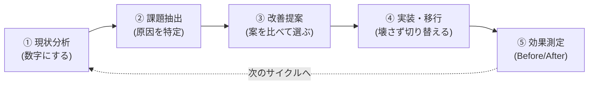

# 自動化改善ツール構築 案件パック

**「作れる」の次に問われる、「今ある運用を分析して直せる」を示す改善案件6件**

[案件パック(projects/)](../README.md) がツールを**ゼロから作る**案件集であるのに対し、この改善案件パックは**すでに動いている運用の問題を見つけて直す**案件集である。現状分析 → 課題抽出 → 改善提案 → 実装・移行 → 効果測定という、実務の運用改善の流れをそのままなぞる。

---

## 1. なぜ「改善」のパックが必要か

未経験からインフラ・サーバー構築エンジニアを目指すとき、ポートフォリオは「作れること」を示すものになりがちである。しかし入社後に任される仕事は、新規構築よりも**すでにある運用の面倒を見て、少しずつ良くしていく仕事**のほうが圧倒的に多い。

| | 構築案件パック(projects/) | 改善案件パック(improvements/) |
|---|---|---|
| 出発点 | 「こういうツールが欲しい」 | 「今のやり方に困っている」 |
| 示せる力 | 要件を形にする力 | **現状を分析し、優先順位をつけて直す力** |
| 難しさ | 何もない状態から作る | **動いているものを壊さずに変える** |
| 成果の示し方 | 動くツール | **Before/Afterの数字** |
| 面接で聞かれること | 「どう作りましたか」 | 「**なぜそう判断しましたか**」 |

改善案件では、コードを書く前に「現状を数字で把握し、複数の選択肢を比べ、選んだ理由を説明する」工程がある。この工程こそが、実務で評価される部分である。

---

## 2. 収録案件一覧(全6件)

| No. | 改善案件名 | 難易度 | 改善の軸 | 代表指標(Before → After) | 主な技術 | リンク |
|---|---|---|---|---|---|---|
| 1 | 月次運用報告書の作成を自動集計・自動生成に改善 | ★☆☆☆☆(入門) | 業務効率化 | 作業時間 3時間/月 → **5分/月** | Bash / awk / date / cron | [01-ops-report-automation/](01-ops-report-automation/README.md) |
| 2 | コピペで増えた運用スクリプトを共通ライブラリ化して保守性と潜在バグを改善 | ★★☆☆☆(初級) | 保守性 | 修正時に触るファイル 4 → **1**、潜在バグ 2箇所 → **0** | Bash / source / jq / shellcheck | [02-shared-library-refactoring/](02-shared-library-refactoring/README.md) |
| 3 | アラート過多(アラート疲れ)を棚卸しと重要度分類で改善 | ★★★☆☆(中級) | 監視品質 | 通知 200件/日 → **12件/日**、見逃し 月2件 → **0件** | Bash / 連想配列 / ルール定義 / jq | [03-alert-noise-reduction/](03-alert-noise-reduction/README.md) |
| 4 | cronのサイレント障害を実行結果の可視化と失敗検知で撲滅 | ★★★☆☆(中級) | 可観測性 | 失敗に気づくまで 平均18時間 → **5分以内** | Bash / ラッパー / flock / デッドマン監視 | [04-cron-job-observability/](04-cron-job-observability/README.md) |
| 5 | 手順書ベースの障害対応を半自動化してMTTRを短縮 | ★★★★☆(中級〜上級) | 障害対応 | MTTR 40分 → **12分**、情報収集 15分 → **30秒** | Bash / 診断コマンド集約 / 確認プロンプト / 監査ログ | [05-runbook-semi-automation/](05-runbook-semi-automation/README.md) |
| 6 | 手動更新のサーバー台帳を構成情報の自動収集・差分検知に改善 | ★★★★☆(上級) | 構成管理 | 棚卸し 8時間/四半期 → **0(日次自動)**、乖離の発見 最大3か月 → **翌日** | Bash / ssh / jq / diff / cron | [06-inventory-drift-detection/](06-inventory-drift-detection/README.md) |

難易度は★1つ(入門)〜★5つ(上級)。各案件のREADMEに、その難易度とした理由を明記している。

> **数値の扱いについて**: 上記はすべて**架空の運用シナリオに基づく設定**である。各案件の効果測定レポートに、どれが検証環境での実測値で、どれが想定シナリオに基づく試算かを明記している。実在企業での実務実績ではない。

---

## 3. 各案件のドキュメント構成(全案件共通の8点セット)

改善案件は、構築案件とは違う成果物の型を持つ。**コードを書く前の3つの文書(現状分析・改善提案・改善設計)が、この型の中心**である。

| ファイル | 内容 | 対応するステップ |
|---|---|---|
| `README.md` | 案件概要・Before/Afterサマリ・面接アピールポイント | — |
| `01-current-analysis.md` | 現状分析書(As-Is): 現行手順の可視化、作業時間の実測、問題の洗い出し | ① 現状分析 |
| `02-improvement-proposal.md` | 改善提案書: 課題の構造化、**最低3案の比較と選定理由**、リスクと対策、スコープ外 | ② 課題抽出 / ③ 改善提案 |
| `03-design.md` | 改善設計書(To-Be): 構成図・処理フロー・データ設計・技術要素の解説 | ③ 改善提案 |
| `04-build-guide.md` | 実装・移行手順書: **段階的移行**と**ロールバック手順**を含む | ④ 実装・移行 |
| `05-effect-measurement.md` | 効果測定レポート: Before/After比較、測定方法と前提条件、**残課題** | ⑤ 効果測定 |
| `06-troubleshooting.md` | トラブルシューティング集(Q&A形式) | — |
| `src/` | 動作確認済みのスクリプト・設定ファイル一式 | ④ 実装・移行 |

構築案件パックの構成(要件定義書 → 設計書 → 構築手順書 → テスト仕様書)と読み比べると、**「まだ何も無い」場合と「すでに動いている」場合で必要な文書が変わる**ことが分かる。これ自体が学びになる。

---

## 4. 改善の型を先に理解する

6件はすべて同じ5ステップの型に沿っている。**先に型を理解すると、覚える量が激減する。**

型そのものの解説は [docs/01-kaizen-method.md](docs/01-kaizen-method.md) にある。**最初にこれを読むこと**を強く推奨する。

効果の測り方(指標の選び方・測定方法・面接での語り方)は [docs/02-metrics-guide.md](docs/02-metrics-guide.md) にまとめている。

---

## 5. 進め方

### 前提

改善案件は「すでに動いている運用」を題材にするため、**構築案件パックの内容を先に把握しているとスムーズ**である。特に次の対応関係がある。

| 改善案件 | 前提として読んでおくとよい構築案件 |
|---|---|
| No.1 月次報告書 | [No.2 バックアップ自動化](../projects/02-backup-automation/README.md)、[No.4 死活監視](../projects/04-server-health-check/README.md)(ログの出力元) |
| No.2 共通ライブラリ化 | [No.1](../projects/01-user-account-automation/README.md)〜[No.4](../projects/04-server-health-check/README.md)(改善対象のコードそのもの) |
| No.3 アラート過多 | [No.3 ログ監視](../projects/03-log-monitoring-alert/README.md)、[No.4 死活監視](../projects/04-server-health-check/README.md)(通知の発生元) |
| No.4 cron可視化 | [No.2 バックアップ自動化](../projects/02-backup-automation/README.md)(cronで動く処理) |
| No.5 障害対応 | [No.4 死活監視](../projects/04-server-health-check/README.md)(障害検知の入口) |
| No.6 構成ドリフト | [No.5 Ansible(IaC)](../projects/05-ansible-provisioning/README.md)(対比して理解する) |

シェルスクリプトを書いた経験がない場合は、先に [演習パック(exercises/)](../exercises/README.md) のステージ1から始めるとよい。

### 推奨する順番

No.1 から順に進める。理由は次のとおり。

1. **No.1・No.2 は改善の型を最小の題材で体験する**(No.1は業務効率化の王道、No.2は自分のコードを直す最短の改善)
2. **No.3・No.4 は「運用の質」を上げる改善**(通知の設計、失敗の検知という運用固有の考え方に進む)
3. **No.5・No.6 は判断が問われる改善**(どこまで自動化するか、どう管理するかという設計判断が中心になる)

### 1件あたりの目安

読むだけなら1件30〜60分、実際に手を動かして検証環境で再現するなら1件6〜15時間程度(各案件のREADMEに内訳あり)。

---

## 6. このパックを面接で使うときの注意

改善案件は「実務経験」と誤解されやすい。**必ず架空案件であることを先に伝えること。**

> 「実務経験ではなく、架空の運用シナリオを自分で設定して、現状分析から効果測定まで一通り設計した案件です。数値は検証環境で実測したものと、想定シナリオに基づく試算が混ざっているので、その前提でお話しします。」

この一言を先に置くと、以降の技術的な説明はすべて信用してもらえる。逆に実績のように話すと、深掘りされたときに崩れる。詳しくは [docs/02-metrics-guide.md](docs/02-metrics-guide.md#5-面接で語れる数字の作り方) を参照。

---

## 7. 関連ドキュメント

| ドキュメント | 内容 |
|---|---|
| [docs/01-kaizen-method.md](docs/01-kaizen-method.md) | 改善の型(現状分析から効果測定までの5ステップ) |
| [docs/02-metrics-guide.md](docs/02-metrics-guide.md) | 効果測定ガイド(指標の選び方・測り方・面接での語り方) |
| [../README.md](../README.md) | ポートフォリオ全体の入口 |
| [../projects/](../projects/) | 構築案件パック(全6件) |
| [../exercises/README.md](../exercises/README.md) | 自動採点つき演習パック(全21演習) |
| [../docs/01-portfolio-guide.md](../docs/01-portfolio-guide.md) | ポートフォリオ活用ガイド(面接・職務経歴書での見せ方) |
| [../docs/03-glossary.md](../docs/03-glossary.md) | 初心者向け用語集 |
