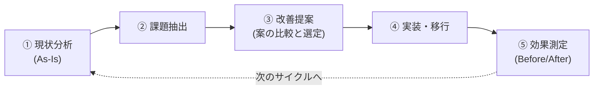

# 改善の型: 現状分析から効果測定までの5ステップ

改善案件パック(improvements/)の全6件は、すべて同じ「型」に沿って作られている。この文書はその型そのものを解説する。**型を先に理解しておくと、6件の案件が「同じ手順の繰り返し」に見えるようになり、覚える量が一気に減る。**

そして、この型は面接で最も語りやすい部分でもある。「何を作ったか」は覚えれば話せるが、「なぜそれを作ると判断したか」は型を理解していないと話せない。

---

## 1. なぜ「いきなり作らない」のか

未経験のうちにやりがちな失敗は、課題を聞いた瞬間にツールを書き始めることだ。しかし実務では、次の理由でそれが失敗する。

| いきなり作ると起きること | 何が問題か |
|---|---|
| 作ったが誰も使わない | 本当の困りごとと違うものを作っていた |
| 改善したのに評価されない | 良くなったことを数字で示せない |
| 別の問題が増えた | 既存の運用を壊した、通知が増えた |
| 作り直しになる | 他の選択肢を検討していなかった |

改善の仕事は「作る」ことではなく、**「今どうなっていて、何が問題で、どう直すのが妥当かを判断すること」**が本体である。コードはその判断の結果にすぎない。

だから改善案件パックの各案件は、8つの成果物のうち**最初の3つ(現状分析・改善提案・改善設計)を、コードを書く前に作る**構成になっている。

---

## 2. 5ステップの全体像



| ステップ | 成果物 | 一言でいうと |
|---|---|---|
| ① 現状分析 | `01-current-analysis.md` | 今どうなっているかを**数字にする** |
| ② 課題抽出 | `02-improvement-proposal.md` 前半 | 症状ではなく**原因**を特定する |
| ③ 改善提案 | `02-improvement-proposal.md` 後半 / `03-design.md` | 複数案を比べて**選んだ理由を言語化**する |
| ④ 実装・移行 | `04-build-guide.md` / `src/` | 既存を**壊さずに**切り替える |
| ⑤ 効果測定 | `05-effect-measurement.md` | 良くなったことを**同じ物差しで**示す |

---

## 3. ステップ① 現状分析(As-Is): 体感を数字に変える

改善の出発点は「なんとなく大変」ではなく「**何分かかっていて、何件失敗しているか**」である。

### やること

1. **現行の手順を1ステップずつ書き出す**(頭の中の手順を外に出す)
2. **各ステップにかかる時間を測る**(ストップウォッチでよい)
3. **問題が起きた回数を数える**(ログ、チケット、記憶でもよいが根拠を書く)
4. **図にする**(Mermaidのフローチャートで手順を可視化する)

### なぜ数字にするのか

- 改善後に**比較できる**(数字がないとBefore/Afterが作れない)
- **どこを直すべきかが分かる**(3時間のうち2時間半が転記作業なら、直すべきは転記)
- **人を説得できる**(「大変です」より「月3時間かかっています」のほうが通る)

> 💡 未経験の学習段階では、実際の職場のデータがない。そのため改善案件パックでは**架空の運用シナリオを設定し、検証環境で実際に測れるものは測り、測れないものは「想定シナリオに基づく試算」と明記**している。この区別を曖昧にしないことが、後述する「正直さ」につながる。

---

## 4. ステップ② 課題抽出: 症状と原因を分ける

現状分析で出てきたのは**症状**である。そのまま直すと対症療法になる。

| 症状(見えていること) | ありがちな対症療法 | 本当の原因 |
|---|---|---|
| 通知が多すぎて見ない | 通知を止める | 重要度の区別がない |
| バックアップが止まっていた | 手動で確認する運用にする | 失敗を検知する仕組みがない |
| 台帳が実態と違う | 棚卸しの頻度を上げる | 手動更新に依存している |

原因にたどり着くコツは、**「なぜそれが起きるのか」を3回繰り返す**ことだ。

```text
症状: バックアップが2週間止まっていたのに気づかなかった
 → なぜ? cronジョブが失敗しても通知されないから
   → なぜ? 失敗を検知する仕組みを入れていないから
     → なぜ? 「動いていて当たり前」という前提で作ったから
原因: 成功が前提の設計で、失敗時の経路を設計していなかった
```

ここまで来ると、直すべきものが「バックアップスクリプト」ではなく「**ジョブ実行の可視化の仕組み**」だと分かる。改善案件No.4はこの構造になっている。

---

## 5. ステップ③ 改善提案: 選択肢を比べて、選んだ理由を書く

**改善案は必ず複数出す。**1案しか出さないと「他により良い方法があるのでは」に答えられない。

改善案件パックでは、各案件で最低3案を比較表にしている。比較の観点は次の4つで十分だ。

| 観点 | 見るポイント |
|---|---|
| 効果 | 課題をどれだけ解決できるか |
| コスト | 作る手間、覚える手間、お金 |
| リスク | 既存の運用を壊さないか、失敗したとき戻せるか |
| 継続性 | 作った本人以外が保守できるか |

### 「何もしない案」を必ず入れる

比較には「**現状維持(何もしない)**」を必ず含める。これがあると、改善の必要性そのものを説明できる。実務でも「それは今のままでいいのでは」と聞かれることは多い。

### 選ばなかった理由こそが価値になる

面接で効くのは、選んだ案の説明より**選ばなかった案の説明**である。

- 改善案件No.5では「全自動で復旧する案」を**あえて選ばなかった**(誤検知時に自動再起動すると被害が広がるため、判断は人に残した)
- 改善案件No.6では「Ansibleで常に上書きして揃える案」を**第一選択にしなかった**(まず現状のズレを把握するのが先だと判断した)

この「やらなかった判断」を語れる人は、未経験でも「考えて作っている」と評価されやすい。

### スコープを切る

「今回やらないこと」を明記する。範囲を無限に広げないための線引きであり、これも実務の重要スキルである。

---

## 6. ステップ④ 実装・移行: 既存を壊さずに切り替える

改善が新規構築と決定的に違うのは、**すでに動いている運用がある**点だ。止めれば業務が止まる。

改善案件パックの `04-build-guide.md` は、必ず次の3点を含んでいる。

| 必須要素 | 内容 | なぜ必要か |
|---|---|---|
| 段階的移行 | 1本ずつ / 1台ずつ / まず並行運用 | 一度に全部変えると、壊れたとき原因が分からない |
| 並行運用と突き合わせ | 新旧を同時に動かし結果を比較 | 新しい仕組みが正しいことを確認してから切り替える |
| ロールバック手順 | 元に戻す具体的な手順 | 戻せない変更は、怖くて誰も本番に入れられない |

> 💡 「ロールバック手順を用意しました」と言えることは、それ自体が実務経験者に伝わるシグナルになる。改善の現場では、**戻せることが前に進む条件**である。

---

## 7. ステップ⑤ 効果測定: 同じ物差しで測る

改善は、**測って初めて改善だと言える**。

### 測り方の原則

1. **Beforeと同じ方法で測る**(片方はストップウォッチ、片方は体感、では比較にならない)
2. **前提条件を書く**(対象6台、1か月分のログ、3回測って平均、など)
3. **できなかったことも書く**(全部うまくいった報告は疑われる)

詳しい指標の選び方と測定方法は [02-metrics-guide.md](02-metrics-guide.md) にまとめている。

### 残課題を書くと評価が上がる

「ここまでは解決した。ここは残っている。次はこう改善する」と書けると、**改善を1回のイベントではなくサイクルとして理解している**ことが伝わる。実務の改善は必ず続きがある。

---

## 8. この型を面接でどう語るか

改善案件は、次の3点セットで話すと相手に伝わる。

```text
1. 何が問題だったか(数字つき)
   「月次報告書の作成に毎月3時間かかり、転記ミスも年6件発生していました」

2. どう考えて、何をしたか(選択肢と判断)
   「まず作業時間を実測したところ、3時間のうち2時間半が転記でした。
    Excelマクロ化とスクリプトでの自動生成を比べ、Gitで差分が追えて
    他のツールとも連携しやすいスクリプト方式を選びました」

3. どれだけ良くなったか(Before/After)
   「結果、作業は月5分になり、転記ミスは構造上ゼロになりました。
    なお、これは架空の運用を想定して自分で設計した案件で、
    時間は検証環境で実測した値です」
```

3番目の**正直な注記が信頼を作る**。実務経験として盛ると、深掘りされたときに崩れる。「架空案件として設計し、自分で検証した」と最初に言えば、以降の技術的な話はすべて信用してもらえる。

---

## 9. よくある失敗

| 失敗 | どうなるか | 対策 |
|---|---|---|
| 現状を測らずに作り始める | 効果を示せない | 最初に必ず時間と件数を数える |
| 案を1つしか出さない | 判断力が伝わらない | 最低3案(現状維持を含む)を比較する |
| 全部を自動化しようとする | 危険な操作まで自動化して事故る | 「人が判断すべき操作」を線引きする(改善案件No.5) |
| 通知を減らすために監視を止める | 見えなくなるだけ | 記録は残し、通知だけ絞る(改善案件No.3) |
| 一度に全部切り替える | 壊れたとき戻せない | 段階移行+ロールバック手順 |
| 数字を盛る | 面接で崩れる | 前提条件と測定方法を必ず書く |

---

## 10. 次に読むもの

- [02-metrics-guide.md](02-metrics-guide.md) — 効果測定ガイド(何をどう測るか、面接で語れる数字の作り方)
- [../README.md](../README.md) — 改善案件パックの入口(全6件の一覧)
- [../01-ops-report-automation/README.md](../01-ops-report-automation/README.md) — この型を最初に体験する入門案件
