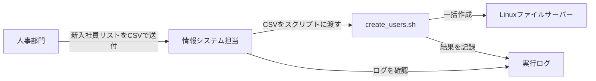

# 要件定義書: Linuxユーザーアカウント一括作成・管理自動化ツール

対象案件: [README.md](./README.md) を参照。本書では「何を作るか」を機能要件・非機能要件として明文化する。

## 1. 前提となる業務フロー

これまでは `B → D` の部分(アカウント作成)を担当者が`useradd`コマンドを1件ずつ手入力していたため、入力ミスや作業漏れが発生していた。本ツールは `C` を新設し、この部分を自動化する。

## 2. 機能要件

| ID | 要件 | 詳細 | 優先度 |
|---|---|---|---|
| F-01 | CSV一括読み込み | 氏名・ユーザー名・部署(グループ)・初期パスワードの4列を持つCSVファイルを読み込み、1行を1ユーザーとして処理する | 必須 |
| F-02 | ユーザーアカウント作成 | `useradd` を用いてLinuxユーザーアカウントを作成する。ホームディレクトリも同時に作成する | 必須 |
| F-03 | 所属グループの自動作成 | CSVで指定された部署名のグループが存在しない場合、`groupadd` で自動作成してから所属させる | 必須 |
| F-04 | 既存ユーザーのスキップ | 作成対象のユーザー名がすでに存在する場合は作成処理を行わず、スキップした旨をログに記録する | 必須 |
| F-05 | 初期パスワード設定 | `chpasswd` を用いてCSVに記載された初期パスワードを設定する | 必須 |
| F-06 | 初回ログイン時のパスワード変更強制 | `chage -d 0` を用いて、次回ログイン時にパスワード変更を強制する | 必須 |
| F-07 | 実行ログの記録 | 成功・失敗・スキップの件数と各行の処理結果を、日時付きでログファイルに記録する。画面にも同時に表示する | 必須 |
| F-08 | ドライランモード | `-n` / `--dry-run` オプション指定時は、実際のユーザー・グループ作成やパスワード設定を行わず、実行される予定の内容だけを画面とログに出力する | 必須 |
| F-09 | root権限チェック | root権限(実効ユーザーID=0)以外で実行された場合、エラーメッセージを表示して処理を開始せずに終了する | 必須 |
| F-10 | 入力データのバリデーション | 必須項目が空の行、Linuxのユーザー名として不正な形式(英小文字・数字・`_`・`-` 以外を含む等)の行はエラーとして処理をスキップし、ログに記録する | 必須 |
| F-11 | ヘルプ表示 | `-h` / `--help` 指定時、使い方を表示して終了する(root権限不要) | 推奨 |

## 3. 非機能要件

| ID | 項目 | 要件 | 補足 |
|---|---|---|---|
| N-01 | べき等性(=同じ操作を何度実行しても結果が変わらない性質) | 同じCSVでスクリプトを複数回実行しても、既存ユーザーへの重複作成やエラーが発生しないこと | F-04のスキップ処理により実現する |
| N-02 | 安全性 | 誤操作による意図しないアカウント作成・削除を防ぐため、変更を伴う操作の前に必ずドライランで確認できること | F-08 |
| N-03 | 可搬性 | 特別な追加パッケージを必要とせず、標準的なLinuxディストリビューションに最初から入っているコマンド(bash・coreutils・shadow-utils相当)のみで動作すること | 外部ライブラリへの依存をなくし、どのサーバーでもそのまま使えるようにするため |
| N-04 | 監査性 | 「いつ・誰が・どのユーザーに対して・何をしたか」がログファイルから追跡できること | F-07。ログにはタイムスタンプとレベル(INFO/ERROR/SKIP)を必ず付与する |
| N-05 | 可読性・保守性 | 将来担当者が変わっても読める(=引き継げる)よう、処理の各ステップにコメントで目的を明記すること | 担当者1名体制の企業では属人化のリスクが特に高いため |
| N-06 | エラー時の継続性 | CSVの1行でエラーが発生しても、スクリプト全体を停止せず残りの行の処理を継続すること | 1件のミスで一括処理全体が止まらないようにするため |

## 4. スコープ外(本ツールで対応しないこと)

| 項目 | 理由 |
|---|---|
| ユーザーの削除・無効化(退職者対応) | 本案件は「入社時のアカウント作成」に限定。削除処理は別案件として扱う想定 |
| パスワードの複雑性チェック(桁数・記号の強制) | OS側のPAM設定(パスワードポリシー)側の責務とする。詳細は[05-troubleshooting.md](./05-troubleshooting.md)を参照 |
| LDAP(=複数サーバーのユーザー情報を1か所で一元管理する仕組み)/Active Directory連携 | 対象は単一のLinuxファイルサーバー(ローカルアカウント管理)のみ |
| Windowsサーバーへの対応 | Linux専用ツールとして設計する |

## 5. 検証環境

| 項目 | バージョン・内容 |
|---|---|
| OS | Ubuntu Server 22.04 LTS(64bit) |
| シェル | GNU bash 5.1系(Ubuntu 22.04 標準搭載) |
| ユーザー管理コマンド群 | passwd パッケージ(`useradd`/`chpasswd`/`chage` 等)、Ubuntu標準搭載 |
| 権限 | 検証用アカウントに `sudo` 権限が付与されていること |
| 想定マシン構成 | vCPU 1〜2 / メモリ 1〜2GB 程度の最小構成で十分(軽量なシェルスクリプトのため) |
| ネットワーク | 外部接続は不要(すべてローカルコマンドで完結するため) |

> 💡 CentOS Stream / AlmaLinux 等のRHEL系ディストリビューションでも、`useradd`・`groupadd`・`chpasswd`・`chage`・`getent`はいずれも標準搭載のコマンドであるため、基本的に同じ手順で動作する。ただしデフォルトのパスワードポリシー(PAM設定)がディストリビューションにより異なるため、`chpasswd`実行時の挙動に差が出る場合がある点は留意する。

## 6. 入力CSVフォーマット定義

| 列 | 項目名 | 必須 | 内容 | 例 |
|---|---|---|---|---|
| 1 | 氏名 | ○ | ユーザーのGECOS情報(コメント)として登録される氏名 | 山田太郎 |
| 2 | ユーザー名 | ○ | Linuxログインアカウント名。英小文字・数字・`_`・`-`のみ、先頭は英小文字または`_` | yamada_t |
| 3 | 部署(グループ) | ○ | 所属させるLinuxグループ名。存在しなければ自動作成 | eigyo |
| 4 | 初期パスワード | ○ | 初回ログイン用の初期パスワード。次回ログイン時に変更が強制される | ChangeMe123! |

- 1行目はヘッダー行として扱い、処理対象外とする(2行目以降がデータ)。
- 文字コードはUTF-8を前提とする(詳細は[05-troubleshooting.md](./05-troubleshooting.md)を参照)。
- サンプル: [src/users.csv.sample](./src/users.csv.sample)

## 7. 関連ドキュメント

- [README.md](./README.md)
- [02-design.md](./02-design.md)
- [03-build-guide.md](./03-build-guide.md)
- [04-test-plan.md](./04-test-plan.md)
- [05-troubleshooting.md](./05-troubleshooting.md)
