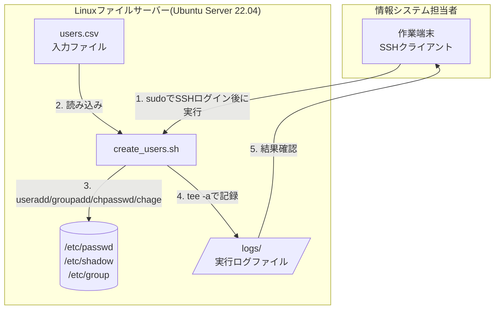
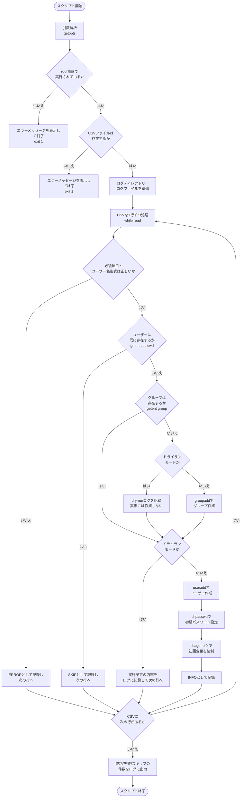
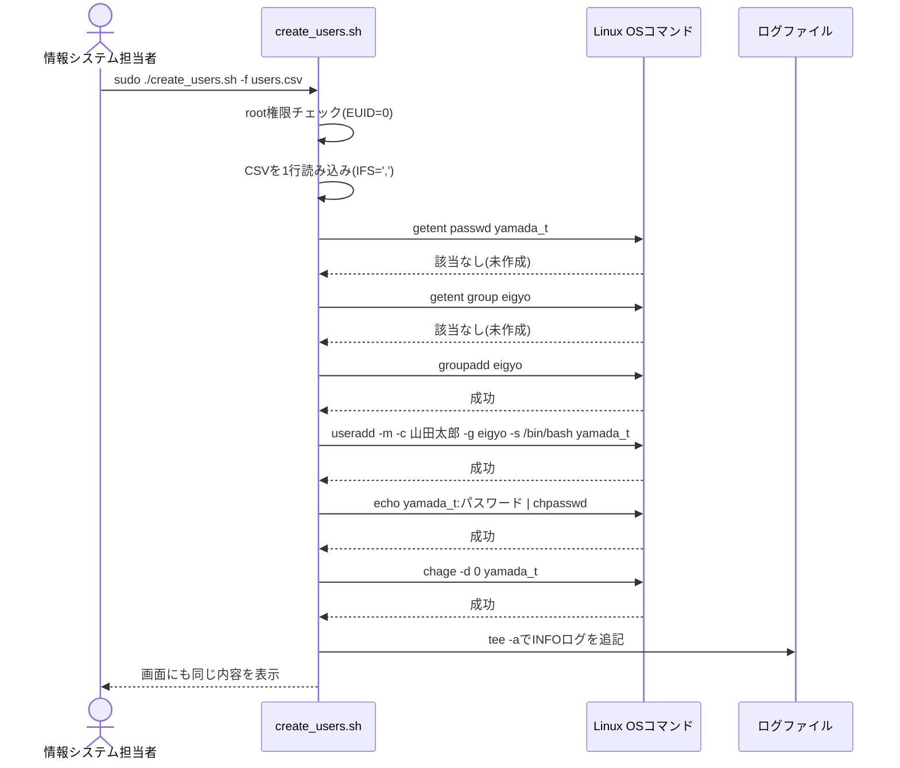

# 設計書: Linuxユーザーアカウント一括作成・管理自動化ツール

対象案件: [README.md](./README.md) / 要件: [01-requirements.md](./01-requirements.md)

## 1. システム構成

本ツールは外部サービスと通信せず、1台のLinuxサーバー上で完結するローカル実行型のスクリプトである。



- 担当者は作業端末からSSHでファイルサーバーにログインし、`sudo` 権限でスクリプトを実行する。
- スクリプトはCSVを読み込み、OS標準のユーザー管理コマンド(`useradd`等)を呼び出して `/etc/passwd` 等のシステムファイルを更新する。
- 実行結果は画面表示とログファイルの両方に残る。

## 2. 処理フロー(全体)



## 3. 処理シーケンス(1ユーザー分・本番実行時)



## 4. ディレクトリ構成

```text
projects/01-user-account-automation/
├── README.md
├── 01-requirements.md
├── 02-design.md            # 本ファイル
├── 03-build-guide.md
├── 04-test-plan.md
├── 05-troubleshooting.md
└── src/
    ├── create_users.sh     # メインスクリプト
    └── users.csv.sample    # 入力CSVサンプル

# 実運用時にサーバー上へ配置した場合のイメージ
/opt/account-tool/
├── create_users.sh
├── users.csv                # 担当者が用意する入力ファイル(都度差し替え)
└── logs/
    └── create_users_20260401_090000.log   # 実行のたびに自動生成される
```

## 5. 主要コマンド・技術要素の解説(初心者向け)

### 5-1. シバン(`#!/bin/bash`)

ファイルの1行目に書く特別な記述。「このファイルを実行するときは `/bin/bash` というプログラムに処理させてください」とOSに指示するもの。これがないと、OSはテキストファイルをどう実行してよいか分からずエラーになる。必ず**ファイルの一番先頭**(1文字目)に書く必要がある。

### 5-2. 変数展開:`$var` と `"$var"` の違い

| 書き方 | 意味 | 注意点 |
|---|---|---|
| `$var` | 変数を展開したあと、**単語分割**(スペース区切りで複数の単語に分かれる)や**ワイルドカード展開**が行われる | 値に空白や`*`が含まれると意図しない分割・展開が起こる |
| `"$var"` | ダブルクォートで囲むと、展開後の値が**1つの文字列としてそのまま**扱われる | 基本的に変数は常にダブルクォートで囲むのが安全 |

例: `fullname="山田 太郎"` の場合、`echo $fullname` は「山田」「太郎」の2単語として扱われてしまう可能性があるが、`echo "$fullname"` なら「山田 太郎」という1つの文字列として正しく扱われる。本スクリプトでは変数を使う箇所を基本的にすべて `"$変数名"` の形でダブルクォートしている。

### 5-3. `if` 文とテストコマンド(`[ ]` と `[[ ]]`)

```bash
if [[ -z "$username" ]]; then
    echo "ユーザー名が空です"
fi
```

- `[ ]` はPOSIX標準の古くからあるテストコマンド(実体は `test` コマンド)。移植性は高いが、クォートを忘れると事故が起きやすい。
- `[[ ]]` はbash拡張の書き方。`&&`・`||` がそのまま使え、`=~`(正規表現マッチ)にも対応しており、クォート漏れによる事故が起きにくい。
- 本スクリプトはbash専用(シバンが`#!/bin/bash`)であるため、基本的に安全な `[[ ]]` を使用している。

主な判定演算子:

| 演算子 | 意味 |
|---|---|
| `-z "$s"` | 文字列 `$s` が空である |
| `-n "$s"` | 文字列 `$s` が空でない |
| `-f "$f"` | `$f` というファイルが存在し、通常ファイルである |
| `-r "$f"` | `$f` に読み取り権限がある |
| `"$a" == "$b"` | 文字列 `$a` と `$b` が一致する |
| `"$s" =~ 正規表現` | `[[ ]]` 限定。正規表現にマッチするか |

### 5-4. `while read` によるCSVの1行ずつの読み込みと `IFS`

```bash
while IFS=',' read -r fullname username group password || [[ -n "$fullname" ]]; do
    echo "$fullname / $username / $group"
done < <(tail -n +2 "$CSV_FILE")
```

- `IFS`(Internal Field Separator = 内部フィールド区切り文字)は、bashが文字列を単語に分割する際の区切り文字を決める特殊変数。デフォルトは空白・タブ・改行。
- `IFS=',' read ...` のように**その行だけに一時的に指定する**ことで、「今回だけカンマ区切りで読む」という指定ができ、スクリプトの他の部分には影響しない。
- `read -r` の `-r` は「バックスラッシュを特殊文字として解釈しない」オプション。付けないとパスワード中の `\` などで意図しない動作になり得るため、`read` には基本的に `-r` を付ける。
- `tail -n +2` でヘッダー行(1行目)を読み飛ばし、`< <(...)`(プロセス置換)でその結果をwhileに渡している。`command | while ...` という書き方(パイプ)ではなく `< <(command)` を使うのは、パイプだとwhileの中身がサブシェル(別プロセス)で実行され、ループ内で更新したカウンタ変数がループを抜けると失われてしまうため。

### 5-5. `useradd` / `groupadd` / `chpasswd` / `chage` / `getent`

| コマンド | 役割 | 本スクリプトでの使い方 |
|---|---|---|
| `getent passwd <name>` | ユーザーの存在確認(`/etc/passwd`やLDAP等を横断して検索) | 既存ユーザーのスキップ判定 |
| `getent group <name>` | グループの存在確認 | グループの自動作成が必要かの判定 |
| `groupadd <name>` | グループを新規作成する | 部署名グループが未作成なら作成 |
| `useradd -m -c "氏名" -g <group> -s /bin/bash <name>` | ユーザーを新規作成する | `-m`はホームディレクトリ作成、`-c`はコメント(氏名)登録、`-g`は所属グループ指定、`-s`はログインシェル指定 |
| `chpasswd` | 標準入力から `ユーザー名:パスワード` 形式で受け取り、一括でパスワードを設定する | 対話式のプロンプトなしで初期パスワードを設定 |
| `chage -d 0 <name>` | 最終パスワード変更日を1970-01-01(epoch=0)に設定する | 「パスワードが期限切れ」と扱われ、次回ログイン時に変更が強制される |

### 5-6. `getopts` によるコマンドライン引数処理

```bash
while getopts "f:l:nh" opt; do
    case "$opt" in
        f) CSV_FILE="$OPTARG" ;;
        l) LOG_DIR="$OPTARG" ;;
        n) DRY_RUN="true" ;;
        h) usage; exit 0 ;;
        \?) usage; exit 1 ;;
    esac
done
```

- `getopts` はbash組み込みのオプション解析コマンド。`"f:l:nh"` の中で、コロン`:`が付いている文字(`f`・`l`)は「値を必要とするオプション」、付いていない文字(`n`・`h`)は「フラグのみのオプション」を意味する。
- 値ありオプションで指定された値は `$OPTARG` に入る。
- `getopts` は本来 `-f` のような1文字オプションしか扱えないため、要件にある `--dry-run` のような長いオプションを使えるようにするために、本スクリプトでは事前に `--dry-run` → `-n`、`--help` → `-h` へ変換してから `getopts` に渡す、という一般的なテクニックを使っている。

### 5-7. `tee -a` によるログの二重出力

```bash
echo "[${now}] [${level}] ${message}" | tee -a "$LOG_FILE"
```

- `tee` は標準入力の内容を、画面(標準出力)とファイルの両方に同時に書き出すコマンド。名前の由来は配管の「T字継手」で、1つの流れを2方向に分岐させるイメージ。
- `-a`(append)を付けないと実行のたびにログファイルが上書きされてしまうため、必ず `-a` を付けて追記する。

### 5-8. root権限チェック(`$EUID`)

```bash
if [[ "${EUID}" -ne 0 ]]; then
    echo "エラー: このスクリプトはroot権限で実行してください。" >&2
    exit 1
fi
```

- `$EUID` はbashの組み込み変数で、現在実行しているプロセスの「実効ユーザーID」を表す。rootのEUIDは必ず`0`。
- `useradd`等はroot権限がないと失敗するが、そのときのエラーメッセージは初心者には分かりにくい(`useradd: Permission denied.`など)。そこで**処理を始める前に自分でチェックし、分かりやすい日本語で案内する**ことで、原因調査の手間を減らしている。
- エラーメッセージを `>&2` で標準エラー出力に送っているのは、「これは正常な処理結果ではなくエラーである」ということをOSやログ収集の仕組みに正しく伝えるための基本作法。

### 5-9. なぜドライランモードが実務で重要なのか

システム変更を伴うスクリプト(特にアカウント作成・削除、ファイル削除、設定変更など)を初めて本番環境で実行するときは、想定通りの対象・件数に対して処理が行われるかを**変更を加えずに事前確認する**のが実務での基本動作。CSVの入力ミス(部署名のタイプミスや行の重複など)は事前のドライラン実行によって「何件が作成対象になるか」を画面上で確認することで気づける。本ツールでは `-n`(`--dry-run`)フラグを立てると、`useradd`・`groupadd`・`chpasswd`・`chage`という実際に変更を加えるコマンドの呼び出しだけをスキップし、`getent`による存在確認(読み取りのみ)はそのまま実行する設計にすることで、「本番実行したらどうなるか」を正確に再現している。

> 💡 本ツールは一貫性を優先し、ドライランモードであってもroot権限チェック自体は行う設計にしている。ドライランは「変更を行わない」ことが目的であり、「一般ユーザーでも実行できる」ことは目的に含まれないためである。

### 5-10. なぜ `set -e` を使わないのか

Bashスクリプトでは冒頭に `set -e` を書き、コマンドが失敗したら即座にスクリプト全体を停止する、という書き方がよく使われる。しかし本ツールでは要件として「CSVの1行でエラーが発生しても、他の行の処理を続ける」ことが求められているため、`set -e` は採用していない。代わりに `useradd` などの各コマンドの成否を `if コマンド; then ... else ... fi` の形で1つずつ判定し、失敗した場合だけその行をスキップして次の行へ進む、という制御を明示的に書いている。「自動で止まる」のではなく「どこで何が起きたら何をするかを自分で書く」ほうが、業務要件に合った正確な制御ができる場合がある、という設計判断の一例。

## 6. 関連ドキュメント

- [README.md](./README.md)
- [01-requirements.md](./01-requirements.md)
- [03-build-guide.md](./03-build-guide.md)
- [04-test-plan.md](./04-test-plan.md)
- [05-troubleshooting.md](./05-troubleshooting.md)
