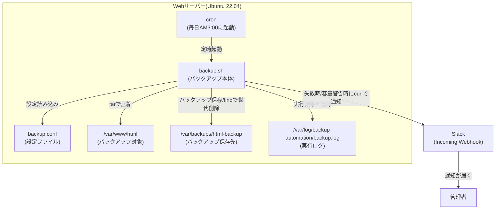
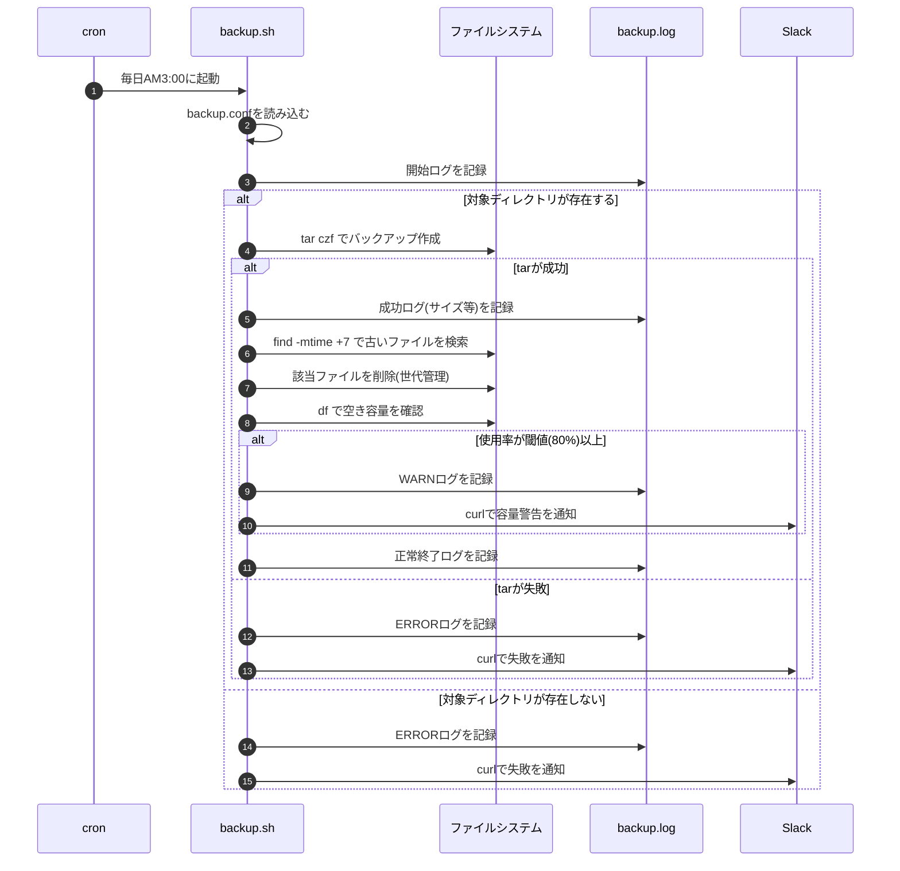

# 02. 設計書

## 1. システム構成

バックアップ処理に関わる要素と、それぞれの役割を図で示す。



**構成要素の役割**

| 要素 | 役割 |
|---|---|
| cron | 決まった時刻に`backup.sh`を自動起動する「時計係」 |
| backup.sh | バックアップ作成・世代管理・容量チェック・通知を行う本体スクリプト |
| backup.conf | 対象ディレクトリや保存世代数などの設定値を持つファイル(スクリプトと分離) |
| バックアップ対象(`/var/www/html`) | 圧縮してバックアップする元データ |
| バックアップ保存先(`/var/backups/html-backup`) | 圧縮済みの`tar.gz`ファイルを蓄積する場所 |
| ログファイル | すべての実行結果を記録し、後から追跡できるようにする |
| Slack Webhook | 失敗時・警告時に管理者へリアルタイムで知らせる通知経路 |

## 2. 処理フロー(シーケンス図)

cronから起動されてから、成功・失敗それぞれのケースでどう動くかを示す。



## 3. サーバー上のディレクトリ構成

構築先サーバー上の配置は以下の通り(リポジトリ内の`src/`配下のファイルを、この場所へコピーして使う想定)。

```text
/opt/backup-automation/
├── backup.sh              # バックアップ本体スクリプト(実行権限 755)
└── backup.conf             # 設定ファイル(権限 600、Webhook URLを含むため)

/var/www/html/               # バックアップ対象(既存のWebサーバーのコンテンツ)

/var/backups/html-backup/    # バックアップ保存先
├── html-backup-20260825.tar.gz
├── html-backup-20260826.tar.gz
├── ...
└── html-backup-20260831.tar.gz   # 常に直近7世代分だけが残る

/var/log/backup-automation/
├── backup.log               # backup.sh自身が出力する実行ログ
└── cron.log                 # cron経由実行時の標準出力/エラー出力

/etc/logrotate.d/
└── backup-automation         # backup.logを日次でローテーションする設定
```

## 4. 主要な技術要素の解説(初心者向け)

### 4.1 cron(定期実行の仕組み)

`cron`はLinuxで「指定した時刻に、指定したコマンドを自動実行する」ための仕組み。`crontab -e`コマンドで、実行ユーザーごとの予定表(crontab)を編集する。

書式は次の5つのフィールド+実行コマンドで構成される。

```text
分 時 日 月 曜日 実行するコマンド
0  3  *  *  *   /opt/backup-automation/backup.sh
```

| フィールド | 指定範囲 | 今回の値 | 意味 |
|---|---|---|---|
| 分 | 0〜59 | `0` | 0分(ちょうど) |
| 時 | 0〜23 | `3` | 3時 |
| 日 | 1〜31 | `*` | 毎日(指定なし) |
| 月 | 1〜12 | `*` | 毎月(指定なし) |
| 曜日 | 0〜7(0と7は日曜) | `*` | 毎曜日(指定なし) |

つまり `0 3 * * *` は「日・月・曜日を問わず、毎日3時0分に実行する」という意味になる。`*`は「その項目は絞り込まない=常に条件を満たす」というワイルドカードだと理解すると読みやすい。

> 💡 なぜAM3:00なのか: 一般的にアクセスが少ない深夜帯を選ぶことで、バックアップ処理(ディスクI/O)がサービスの応答速度に与える影響を最小限にするため。

### 4.2 tar(アーカイブ・圧縮コマンド)

`tar`は複数のファイル・ディレクトリを1つのファイル(アーカイブ)にまとめるコマンド。`z`オプションを付けることでgzip圧縮も同時に行える。

```bash
tar czvf backup.tar.gz /var/www/html
```

| オプション | 意味 |
|---|---|
| `c` | create。新しいアーカイブを作成する |
| `z` | gzip圧縮を行う(拡張子を`.tar.gz`にするのが慣習) |
| `v` | verbose。処理中のファイル名を画面に表示する(動作確認用。ログが冗長になるため本番のcron実行では省略することが多い) |
| `f` | 直後にアーカイブファイル名を指定する(このオプションは必ず最後に置く) |

本スクリプトでは`-C`オプションを併用し、対象ディレクトリの「親ディレクトリ」に移動してから相対パスで固めている。

```bash
tar -czf backup.tar.gz -C /var/www html
```

こうすることで、tarの中に`/var/www/html`という絶対パスがそのまま残らず、展開(リストア)時に意図しない場所へ上書きしてしまう事故を防げる。

### 4.3 find(古いバックアップの検索・削除)

`find`は条件に合うファイルを検索するコマンド。バックアップの世代管理では「更新日時が〇日より古いファイル」を探すのに使う。

```bash
find /var/backups/html-backup -type f -name "html-backup-*.tar.gz" -mtime +7
```

| オプション | 意味 |
|---|---|
| `-type f` | ファイルのみを対象にする(ディレクトリを誤って対象にしない) |
| `-name "パターン"` | ファイル名で絞り込む(命名規則が違う他ファイルを巻き込まない) |
| `-mtime +N` | 更新日時(modify time)が「N日より古い」ファイルを探す |

`-mtime`は「24時間を1単位として、今日からの経過日数」で判定する。`+7`は「7日より前=8日目以降」を意味する点に注意する。ここを勘違いして`-mtime 7`(ちょうど7日目のみ)と書くと、意図せず古いファイルが消えずに溜まり続けるミスにつながる。

> 💡 実際に消す前に、まず`find ... -print`で「何が対象になるか」を確認してから`rm`につなげると事故を防げる。本スクリプトも一覧を取得してからログに残し、削除する設計にしている。

### 4.4 df(空き容量チェック)

`df`はディスクの使用状況を確認するコマンド。バックアップ先の空き容量が逼迫していないかを、削除処理のあとに毎回チェックする。

```bash
df --output=pcent /var/backups/html-backup
```

```text
Use%
 42%
```

`--output=pcent`を指定すると使用率(%)だけを取り出せるため、余計な列をパースする手間が減る。この値を閾値(既定80%)と比較し、超えていれば警告を出す。

### 4.5 curl(Slack Webhook通知)

`curl`はHTTP通信をコマンドラインから行うツール。Slackの「Incoming Webhook」という機能を使うと、指定URLへJSON形式のPOSTリクエストを送るだけでSlackにメッセージを投稿できる。

```bash
curl -s -X POST -H 'Content-type: application/json' \
    --data '{"text": "バックアップに失敗しました"}' \
    "<YOUR_SLACK_WEBHOOK_URL>"
```

| オプション | 意味 |
|---|---|
| `-s` | silent。進捗表示を出さない(ログを汚さないため) |
| `-X POST` | HTTPのPOSTメソッドで送信する |
| `-H 'Content-type: application/json'` | 送信データがJSON形式であることをサーバーに伝えるヘッダー |
| `--data '{...}'` | 送信する本文(JSON)。`text`キーがSlackに表示されるメッセージ本文になる |

> 💡 なぜmailコマンドではなくSlackを選んだか: 検証環境では外部のメールサーバー(MTA)を別途構築・設定する必要があり手間が大きい一方、SlackのIncoming WebhookはURLを発行するだけですぐ通知を試せるため、ポートフォリオとしての再現性・検証のしやすさを優先した。実務ではメール通知とSlack通知を併用するケースも多い。

### 4.6 date(日付フォーマットの生成)

バックアップファイル名に含める日付は`date`コマンドで生成する。

```bash
date '+%Y%m%d'
```

```text
20260831
```

`+`のあとにフォーマット指定子を書く。`%Y`は西暦4桁、`%m`は月2桁、`%d`は日2桁を意味する。この形式にすると、ファイル名を文字列としてソートしても日付順に並ぶという利点がある。

## 5. バックアップ設計の基本用語

| 用語 | 意味 |
|---|---|
| フルバックアップ | 対象データの「全量」を毎回バックアップする方式。今回はこの方式を採用している(実装がシンプルで、リストア=復元時も1ファイルを展開するだけで済むため) |
| 差分・増分バックアップ | 前回からの変更分だけを保存する方式。ストレージ容量は節約できるが、リストア手順が複雑になる(今回はスコープ外) |
| 世代管理 | 過去何回分(何日分)のバックアップを残しておくかというルール。今回は「7世代=直近7日分」とし、`find -mtime`で自動的に古い世代を削除する |
| RPO(Recovery Point Objective) | 障害が起きたときに「どの時点の状態まで復旧できればよいか」という目標値。日次バックアップの場合、最悪でも「前日の3時時点」までは復旧できるため、RPOはおおよそ24時間となる |
| RTO(Recovery Time Objective) | 障害発生から「どれくらいの時間で復旧を終えるか」という目標値(今回は自動リストアの仕組みまでは作らないため、参考用語として記載) |

## 6. あえてこの設計にした理由(設計判断のメモ)

- **`set -e`ではなく`set -u`のみを使用**: バックアップ失敗時に即座にスクリプトを終了させてしまうと、その後の「ログ記録」や「Slack通知」まで実行されなくなる。そこで、各コマンドの終了コード(`$?`)を都度チェックし、失敗しても通知処理までは必ず到達できるようにしている。
- **設定ファイル(`backup.conf`)を分離**: 対象ディレクトリや世代数が変わるたびにスクリプト本体を編集するのは事故のもと。設定値だけを別ファイルに切り出すことで、運用担当者がロジックを触らずに済むようにしている。
- **容量チェックは削除処理のあと**: 先に古い世代を削除してから空き容量を確認することで、「削除してもなお逼迫している」という本当に危険な状態だけを警告できるようにしている。
